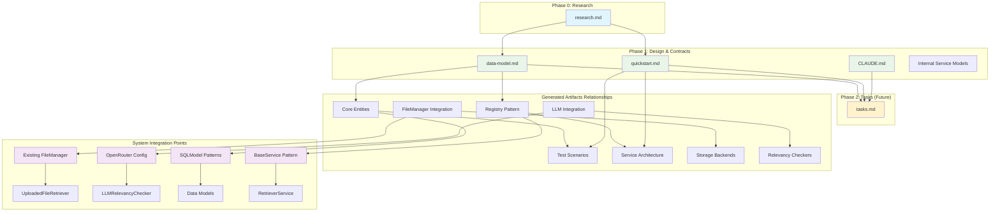

# Implementation Plan: RetrieverService Framework

**Branch**: `015-retriever-framework` | **Date**: 2025-11-27 | **Spec**: [spec.md](./spec.md)
**Input**: Feature specification from `/home/manstis/workspaces/github/manstis/forks/nexus/specs/015-retriever-framework/spec.md`

## Execution Flow (/plan command scope)
```
1. Load feature spec from Input path
   → If not found: ERROR "No feature spec at {path}"
2. Fill Technical Context (scan for NEEDS CLARIFICATION)
   → Detect Project Type from context (web=frontend+backend, mobile=app+api)
   → Set Structure Decision based on project type
3. Fill the Constitution Check section based on the content of the constitution document.
4. Evaluate Constitution Check section below
   → If violations exist: Document in Complexity Tracking
   → If no justification possible: ERROR "Simplify approach first"
   → Update Progress Tracking: Initial Constitution Check
5. Execute Phase 0 → research.md
   → If NEEDS CLARIFICATION remain: ERROR "Resolve unknowns"
6. Execute Phase 1 → schemas, data-model.md, quickstart.md, agent-specific template file (e.g., `CLAUDE.md` for Claude Code, `.github/copilot-instructions.md` for GitHub Copilot, `GEMINI.md` for Gemini CLI, `QWEN.md` for Qwen Code or `AGENTS.md` for opencode).
7. Re-evaluate Constitution Check section
   → If new violations: Refactor design, return to Phase 1
   → Update Progress Tracking: Post-Design Constitution Check
8. Plan Phase 2 → Describe task generation approach (DO NOT create tasks.md)
9. STOP - Ready for /tasks command
```

**IMPORTANT**: The /plan command STOPS at step 7. Phases 2-4 are executed by other commands:
- Phase 2: /tasks command creates tasks.md
- Phase 3-4: Implementation execution (manual or via tools)

## Summary
Implement `RetrieverService` framework with registry-based architecture to coordinate document retrieval from multiple storage backends (starting with uploaded files) using configurable relevancy checkers (LLM-based with keyword fallback). Service accepts `invocation_id` and user prompt to dynamically load context and return ranked relevant documents with full content.

## Technical Context
**Language/Version**: Python 3.12 \
**Primary Dependencies**: FastAPI, SQLModel (unified data models), LangChain (LLM integration), AsyncPG (PostgreSQL), python-magic (MIME detection), aiofiles (async file I/O) \
**Storage**: PostgreSQL with SQLModel ORM, JSONB for context metadata, pluggable file storage backends (local filesystem, future S3/GCS) \
**Testing**: pytest with async support, pytest-cov (80% minimum coverage), respx for HTTP mocking \
**Target Platform**: Linux server with async/await pattern throughout \
**Project Type**: single - backend service component (no frontend/mobile) \
**Performance Goals**: Handle uploaded file retrieval with response time targets (TBD) for relevancy checking, support multiple concurrent retrieval operations \
**Constraints**: 10MB file size limit, full document content returned (no chunking at service level), graceful LLM fallback to keyword-based relevancy \
**Scale/Scope**: Multi-user system with per-invocation document retrieval, extensible registry pattern for future storage backends and relevancy algorithms

## Constitution Check
*GATE: Must pass before Phase 0 research. Re-check after Phase 1 design.*

[Gates determined based on constitution file]

### Technology Standards Compliance
- [x] **SQLModel for Data Models**: All data models use SQLModel (not separate Pydantic + SQLAlchemy) - Using existing SQLModel patterns for `RelevantDocument` and configuration models

### Code Architecture Compliance
- [x] **DRY Principle**: Design avoids code duplication through proper abstraction - Registry pattern prevents duplication for retriever/checker implementations
- [x] **SOLID Principles**: Design follows Single Responsibility, Open/Closed, Liskov Substitution, Interface Segregation, and Dependency Inversion - Service follows existing patterns with clear interfaces
- [x] **Separation of Concerns**: Clear boundaries between layers (presentation, business logic, data access) - RetrieverService is business logic layer, separated from storage (FileManager) and presentation concerns
- [x] **Dependency Injection**: Dependencies are explicitly injected via constructors - Service uses focused dependencies: session for database access, registries for retrieval logic
- [x] **Composition vs Inheritance**: Design uses composition over inheritance unless clear "is-a" relationship exists - Registry composition pattern for retrievers/checkers vs inheritance

### API Specification Standards Compliance
- [x] **OpenAPI/AsyncAPI Compliance**: N/A - Internal service component, no direct API endpoints
- [x] **Naming Convention**: N/A - Internal service, following Python snake_case conventions
- [x] **Documentation Completeness**: N/A - Internal service component
- [x] **RFC 9457 Error Format**: N/A - Internal service uses exceptions, not HTTP responses
- [x] **Error Message Safety**: Will use domain exceptions without exposing implementation details
- [x] **API Versioning**: N/A - Internal service component
- [x] **API Path Structure**: N/A - Internal service component
- [x] **Pagination Support**: N/A - Internal service returns ranked document lists
- [x] **Filtering/Sorting Consistency**: N/A - Internal service component
- [x] **Security Documentation**: N/A - Internal service, security handled at API layer
- [x] **Schema Compatibility**: Will follow backward compatibility for data models used

## Project Structure

### Documentation (this feature)
```
specs/[###-feature]/
├── plan.md              # This file (/plan command output)
├── research.md          # Phase 0 output (/plan command)
├── data-model.md        # Phase 1 output (/plan command)
├── quickstart.md        # Phase 1 output (/plan command)
└── tasks.md             # Phase 2 output (/tasks command - NOT created by /plan)
```

### Source Code (repository root)
```
# RetrieverService Framework Structure
src/nexus/agent_orchestrator/context_manager/
├── retriever_service/              # New RetrieverService framework
│   ├── models/                     # SQLModel data models
│   ├── interfaces/                 # Abstract base classes
│   ├── registries/                 # Registry pattern implementations
│   ├── retrievers/                 # Concrete retriever implementations
│   ├── checkers/                   # Concrete checker implementations
│   ├── services/                   # Main service layer
│   └── utils/                      # Utility modules

tests/unit/agent_orchestrator/context_manager/
├── retriever_service/              # Unit tests for RetrieverService

tests/integration/agent_orchestrator/context_manager/
├── retriever_service/              # Integration tests for RetrieverService
```

**Structure Decision**: Option 1 (Single project) - Backend service component with no frontend/mobile requirements

**Migration from Existing Stub**: The current implementation includes a stub `RetrieverService` class in `src/nexus/agent_orchestrator/context_manager/retriever.py` that needs to be replaced:

- **Current Interface**: `retrieve(query: str, correlation_id: str) -> None`
- **New Interface**: `retrieve_relevant_documents(invocation_id: UUID, prompt: str) -> List[RelevantDocument]`

**Files Requiring Updates**:
- Remove: `src/nexus/agent_orchestrator/context_manager/retriever.py`
- Update imports in: `planner.py`, `__init__.py`
- Update tests: `test_planner.py`, `test_services.py`
- Replace stub with full implementation in new location

**Interface Changes Required**:
- **ContextManagerPlanner.plan_request()**: Add `invocation_id` parameter
  - Current: `plan_request(correlation_id: str, session_id: str, query: str)`
  - New: `plan_request(invocation_id: str, correlation_id: str, session_id: str, query: str)`
- **InvocationExecutionService**: Pass `invocation.id` to ContextManagerPlanner
- **Call flow**: `InvocationExecutionService` → `ContextManagerPlanner` → `RetrieverService`

## Phase 0: Outline & Research
1. **Extract unknowns from Technical Context** above:
   - For each NEEDS CLARIFICATION → research task
   - For each dependency → best practices task
   - For each integration → patterns task

2. **Generate and dispatch research agents**:
   ```
   For each unknown in Technical Context:
     Task: "Research {unknown} for {feature context}"
   For each technology choice:
     Task: "Find best practices for {tech} in {domain}"
   ```

3. **Consolidate findings** in `research.md` using format:
   - Decision: [what was chosen]
   - Rationale: [why chosen]
   - Alternatives considered: [what else evaluated]

**Output**: research.md with all NEEDS CLARIFICATION resolved

## Phase 1: Design & Contracts
*Prerequisites: research.md complete*

1. **Extract entities from feature spec** → `data-model.md`:
   - Entity name, fields, relationships
   - Validation rules from requirements
   - State transitions if applicable

2. **Generate API contracts** from functional requirements:
   - For each user action → endpoint
   - Use standard REST/GraphQL patterns
   - Output OpenAPI/AsyncAPI schema to `[project root]/schemas/[component]/`
   - Note: Schemas are stored at project root level, NOT within the specs folder

3. **Generate contract tests** from contracts:
   - One test file per endpoint
   - Assert request/response schemas
   - Tests must fail (no implementation yet)

4. **Extract test scenarios** from user stories:
   - Each story → integration test scenario
   - Quickstart test = story validation steps

5. **Update agent file incrementally** (O(1) operation):
   - Run `.specify/scripts/bash/update-agent-context.sh claude`
     **IMPORTANT**: Execute it exactly as specified above. Do not add or remove any arguments.
   - If exists: Add only NEW tech from current plan
   - Preserve manual additions between markers
   - Update recent changes (keep last 3)
   - Keep under 150 lines for token efficiency
   - Output to repository root

**Output**: data-model.md, [project root]/schemas/[component]/*, failing tests, quickstart.md, agent-specific file

## Phase 2: Task Planning Approach
*This section describes what the /tasks command will do - DO NOT execute during /plan*

**Task Generation Strategy**:
- Load `.specify/templates/tasks-template.md` as base
- Generate tasks from Phase 1 design docs (schemas, data model, quickstart)
- Each schema → contract test task [P]
- Each entity → model creation task [P]
- Each user story → integration test task
- Implementation tasks to make tests pass

**Ordering Strategy**:
- TDD order: Tests before implementation
- Dependency order: Models before services before UI
- Mark [P] for parallel execution (independent files)

**Estimated Output**: 25-30 numbered, ordered tasks in tasks.md

**IMPORTANT**: This phase is executed by the /tasks command, NOT by /plan

## Implementation Plan Architecture



## Phase 3+: Future Implementation
*These phases are beyond the scope of the /plan command*

**Phase 3**: Task execution (/tasks command creates tasks.md)
**Phase 4**: Implementation (execute tasks.md following constitutional principles)
**Phase 5**: Validation (run tests, execute quickstart.md, performance validation)

## Complexity Tracking
*Fill ONLY if Constitution Check has violations that must be justified*

| Violation | Why Needed | Simpler Alternative Rejected Because |
|-----------|------------|-------------------------------------|
| [e.g., 4th project] | [current need] | [why 3 projects insufficient] |
| [e.g., Repository pattern] | [specific problem] | [why direct DB access insufficient] |


## Progress Tracking
*This checklist is updated during execution flow*

**Phase Status**:
- [x] Phase 0: Research complete (/plan command)
- [x] Phase 1: Design complete (/plan command)
- [x] Phase 2: Task planning complete (/plan command - describe approach only)
- [ ] Phase 3: Tasks generated (/tasks command)
- [ ] Phase 4: Implementation complete
- [ ] Phase 5: Validation passed

**Gate Status**:
- [x] Initial Constitution Check: PASS
- [x] Post-Design Constitution Check: PASS
- [x] All NEEDS CLARIFICATION resolved
- [x] Complexity deviations documented (none required)

---
*Based on Constitution v1.2.0 - See `.specify/memory/constitution.md`*
