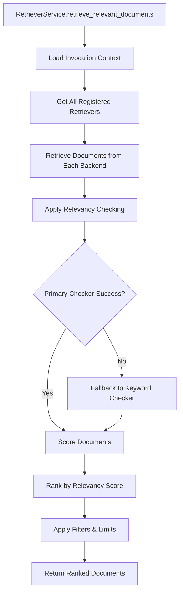

# RetrieverService Framework

The RetrieverService framework provides intelligent document retrieval and relevancy checking for the Nexus multi-agent system. It enables agents to find and rank relevant documents from uploaded files using both LLM-based semantic analysis and keyword-based fallback methods.

## Overview

The RetrieverService framework consists of:

- **Multi-backend document retrieval** from various storage systems
- **Intelligent relevancy checking** with LLM and keyword-based algorithms  
- **Configurable fallback mechanisms** for reliability
- **Registry patterns** for extensibility
- **Performance optimization** with caching and batching
- **Integration** with existing Nexus configuration and file management

## Quick Start

### Basic Usage

```python
from nexus.agent_orchestrator.context_manager.retriever_service.services import get_retriever_service
from uuid import UUID

# Get service instance
service = get_retriever_service()

# Retrieve relevant documents
documents = await service.retrieve_relevant_documents(
    invocation_id=UUID("your-invocation-id"),
    prompt="machine learning algorithms"
)

# Process results
for doc in documents:
    print(f"File: {doc.file_metadata.filename}")
    print(f"Relevancy: {doc.relevancy_score:.3f}")
    print(f"Content preview: {doc.content[:200]}...")
```

### Configuration via Settings

The framework integrates with the Nexus configuration system through `nexus.core.config.get_settings()`. Configuration parameters are defined in the settings with `retriever_` prefix:

```python
# Configuration is managed through settings, examples:
# retriever_llm_model = "anthropic/claude-3.5-sonnet"
# retriever_llm_temperature = 0.3
# retriever_llm_similarity_threshold = 0.7
# retriever_llm_max_results = 10
# retriever_keyword_similarity_threshold = 0.4
# retriever_keyword_max_results = 15
# retriever_keyword_case_sensitive = false
# retriever_keyword_stem_words = true
# retriever_context_window_size = 2000
```

## Architecture

### Framework Structure

```
retriever_service/
├── models/                        # Data models
│   ├── relevant_document.py       # Document with relevancy score
│   └── relevancy_configuration.py # Configuration parameters
├── interfaces/                    # Abstract base classes
│   ├── document_retriever.py      # Retriever interface
│   └── relevancy_checker.py       # Checker interface
├── registries/                    # Registry implementations
│   ├── retriever_registry.py      # Retriever management
│   └── relevancy_registry.py      # Checker management
├── config/                        # Configuration system
│   └── configuration_manager.py   # Global config manager
├── retrievers/                    # Concrete retrievers
│   └── uploaded_file_retriever.py # File upload retriever
├── checkers/                      # Relevancy checkers
│   ├── keyword_relevancy_checker.py # Keyword-based
│   └── llm_relevancy_checker.py    # LLM-based
├── services/                      # Main service layer
│   └── retriever_service.py       # Core orchestration
└── exceptions.py                  # Domain exceptions
```

### Key Design Patterns

1. **Registry Pattern**: Extensible retriever and checker registration
2. **Strategy Pattern**: Pluggable relevancy algorithms with fallback
3. **Composition**: FileManager used as dependency, not inheritance
4. **Dependency Injection**: Clean separation of concerns
5. **Domain Exceptions**: Graceful error handling and recovery

### Data Flow



## Components

### Models

#### RelevantDocument

Represents a document with relevancy scoring and metadata:

```python
from nexus.agent_orchestrator.context_manager.retriever_service.models.relevant_document import RelevantDocument

document = RelevantDocument(
    content="Document content text...",
    relevancy_score=0.85,
    file_metadata=file_metadata,  # From FileManager
    source_type="uploaded_file",
    retrieval_metadata={"retrieved_at": "2024-12-03T10:00:00"}
)
```

#### RelevancyConfiguration

Configuration for relevancy checking algorithms:

```python
from nexus.agent_orchestrator.context_manager.retriever_service.models.relevancy_configuration import RelevancyConfiguration

config = RelevancyConfiguration(
    checker_type="llm",
    similarity_threshold=0.7,
    max_results=10,
    algorithm_parameters={
        "model": "anthropic/claude-3.5-sonnet",
        "temperature": 0.3
    }
)
```

### Registries

#### RetrieverRegistry

Manages document retriever implementations:

```python
from nexus.agent_orchestrator.context_manager.retriever_service.registries.retriever_registry import RetrieverRegistry
from nexus.agent_orchestrator.context_manager.retriever_service.retrievers.uploaded_file_retriever import UploadedFileRetriever

registry = RetrieverRegistry()
registry.register_retriever("uploaded_file", UploadedFileRetriever)

# Get retriever instance
retriever = registry.get_retriever("uploaded_file")
```

#### RelevancyRegistry

Manages relevancy checker implementations with configurations:

```python
from nexus.agent_orchestrator.context_manager.retriever_service.registries.relevancy_registry import RelevancyRegistry
from nexus.agent_orchestrator.context_manager.retriever_service.checkers.llm_relevancy_checker import LLMRelevancyChecker

registry = RelevancyRegistry()
registry.register_checker("llm", LLMRelevancyChecker, llm_config)

# Set primary and fallback
registry.set_primary_checker("llm")
registry.set_fallback_checker("keyword")
```

### Relevancy Checkers

#### LLMRelevancyChecker

Uses large language models for semantic relevancy scoring:

```python
from nexus.agent_orchestrator.context_manager.retriever_service.checkers.llm_relevancy_checker import LLMRelevancyChecker

checker = LLMRelevancyChecker()
score = await checker.check_relevancy(document, query, config)
```

**Features:**
- Semantic understanding and context analysis
- Configurable models via OpenRouter
- File metadata integration
- Custom system prompts
- Temperature and token control

#### KeywordRelevancyChecker

Fast, deterministic keyword-based relevancy scoring:

```python
from nexus.agent_orchestrator.context_manager.retriever_service.checkers.keyword_relevancy_checker import KeywordRelevancyChecker

checker = KeywordRelevancyChecker()
score = await checker.check_relevancy(document, query, config)
```

**Features:**
- TF-IDF scoring
- Filename matching
- Phrase detection with bonuses
- Proximity scoring
- Word stemming and stopword removal
- Case sensitivity options

### Configuration System

#### ConfigurationManager

Centralized configuration management with Nexus settings integration:

```python
from nexus.agent_orchestrator.context_manager.retriever_service.config.configuration_manager import ConfigurationManager

manager = ConfigurationManager()

# Get default configurations (from settings)
llm_config = manager.get_llm_configuration()
keyword_config = manager.get_keyword_configuration()

# Configuration loads automatically from get_settings()
# No custom configuration creation method available
```


## Extension Points

### Adding New Document Retrievers

Implement the `DocumentRetriever` interface:

```python
from nexus.agent_orchestrator.context_manager.retriever_service.interfaces.document_retriever import DocumentRetriever
from nexus.agent_orchestrator.context_manager.retriever_service.models.relevant_document import RelevantDocument

class MyCustomRetriever(DocumentRetriever):
    async def retrieve_documents(self, invocation_context: dict) -> list[RelevantDocument]:
        # Your implementation here
        return documents

# Register with the system
retriever_registry.register_retriever("my_custom", MyCustomRetriever)
```

### Adding New Relevancy Checkers

Implement the `RelevancyChecker` interface:

```python
from nexus.agent_orchestrator.context_manager.retriever_service.interfaces.relevancy_checker import RelevancyChecker

class MyCustomChecker(RelevancyChecker):
    async def check_relevancy(self, document: RelevantDocument, query: str, config: RelevancyConfiguration) -> float:
        # Your scoring logic here
        return score  # 0.0 to 1.0

# Register with configuration
custom_config = RelevancyConfiguration(checker_type="my_custom", ...)
relevancy_registry.register_checker("my_custom", MyCustomChecker, custom_config)
```

## Error Handling

The framework uses domain-specific exceptions for different error types:

```python
from nexus.agent_orchestrator.context_manager.retriever_service.exceptions import (
    RetrieverServiceError,      # General service errors
    DocumentRetrievalError,     # Document retrieval failures  
    RelevancyCheckError,        # Relevancy checking failures
    ConfigurationError,         # Configuration issues
    RegistryError               # Registry operation failures
)

try:
    documents = await service.retrieve_relevant_documents(invocation_id, prompt)
except RetrieverServiceError as e:
    logger.error(f"Retrieval failed: {e}")
    # Handle gracefully, perhaps return cached results
```

## Performance Considerations

### Performance

The framework processes documents using async/await patterns for optimal performance:

- Documents are processed concurrently where possible
- Graceful error handling ensures partial failures don't stop processing
- Service uses dependency injection for efficient resource management

### Async Operations

All operations are fully async for optimal performance:

```python
# Multiple documents processed concurrently
documents = await asyncio.gather(*[
    retriever.retrieve_documents(context)
    for retriever in retrievers
])
```

## Integration with Nexus

### File Management

The framework integrates seamlessly with Nexus FileManager:

```python
# FileManager is used internally by UploadedFileRetriever
# No direct FileManager dependency in business logic
```

### OpenRouter Integration

LLM relevancy checking uses existing OpenRouter configuration:

```python
# Uses existing get_openrouter_llm() function
# Respects NEXUS_OPENROUTER_API_KEY environment variable
```

### Database Integration

Invocation context is loaded from the main Nexus database:

```python
# Uses AsyncSession from nexus.core.database
# Loads file_metadata from Invocation.context_data JSONB field
```

## Testing

The framework includes comprehensive test coverage:

### Unit Tests

```bash
# Run unit tests
pytest tests/unit/agent_orchestrator/context_manager/retriever_service/

# Run specific test module
pytest tests/unit/agent_orchestrator/context_manager/retriever_service/test_registries.py
```

### Integration Tests

```bash
# Run integration tests
pytest tests/integration/agent_orchestrator/context_manager/retriever_service/

# Test end-to-end flow
pytest tests/integration/agent_orchestrator/context_manager/retriever_service/test_retriever_service.py
```

### Edge Case Tests

```bash
# Run edge case tests
pytest tests/unit/agent_orchestrator/context_manager/retriever_service/test_edge_cases.py
```

## Monitoring & Observability

### Logging

All components use structured logging:

```python
import logging
logger = logging.getLogger(__name__)

# Logs include:
# - Document retrieval metrics
# - Relevancy scoring results  
# - Performance timing
# - Error conditions with context
```

### Metrics

Key metrics to monitor:

- **Retrieval Latency**: Time to retrieve and score documents
- **Cache Hit Ratios**: Effectiveness of caching layers
- **Fallback Usage**: Frequency of LLM → keyword fallback
- **Error Rates**: Failed retrievals and relevancy checks

## Security Considerations

### File Path Security

- Internal file paths are never exposed in API responses
- File access is controlled through FileManager abstractions
- File IDs used for public references instead of paths

### Configuration Security

- API keys managed through existing Nexus configuration
- No secrets stored in configuration files
- Environment variable validation and sanitization

## Troubleshooting

### Common Issues

**No documents returned:**
- Check invocation has uploaded files with status "converted"
- Verify similarity thresholds aren't too restrictive
- Check retriever registrations are active

**Low relevancy scores:**  
- Adjust similarity thresholds in application settings
- Review query phrasing and document content
- Check LLM model configuration and prompts

**Performance issues:**
- Check async processing performance
- Review OpenRouter API latency
- Monitor service resource usage

**Configuration errors:**
- Check configuration parameter types and constraints in settings
- Review log messages for detailed error information
- Verify ConfigurationManager setup

### Debug Mode

Enable detailed logging:

```bash
export NEXUS_LOG_LEVEL=DEBUG
```

This provides verbose logging of:
- Document retrieval steps
- Relevancy calculation details
- Performance metrics
- Configuration loading
