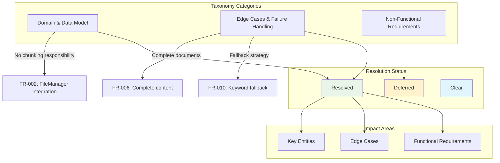
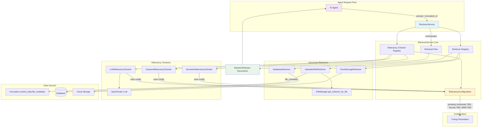

# Feature Specification: RetrieverService Framework

**Feature Branch**: `015-retriever-framework`  
**Created**: 2025-11-27  
**Status**: Draft  
**Input**: User description: "015-retriever-framework

I want to implement 'RetrieverService' here: src/nexus/agent_orchestrator/context_manager/retriever.py

It will need to have a registry of different retrievers; so we can add support for different persistent stores later.

The first retriever will be for Uploaded files. It will use FileManager.get_retriever_for_file(..) and an Invocation's context_data.file_metadata.

The RetrieverService will need to also have a registry of "relevancy" checkers that use different algorithms to check if a document is relevant to the prompt.

We will need a basic implementation of a relevancy checker that uses an LLM (see 'get_openrouter_llm' in src/nexus/agent_orchestrator/clients/openrouter_config.py)"

## User Scenarios & Testing

### Primary User Story
When an AI agent processes an invocation, the system needs to retrieve relevant documents from all available sources based on the user's prompt. The RetrieverService acts as the central orchestrator that uses all registered document retrievers to collate documents from different sources (uploaded files, databases, cloud storage, etc.) and applies relevancy checkers to find the most pertinent content for the agent to process.

### Acceptance Scenarios
1. **Given** an invocation and a user prompt, **When** the agent requests document retrieval, **Then** the RetrieverService returns ranked relevant documents from all available sources
2. **Given** multiple types of storage backends are configured, **When** retrieving documents, **Then** the service uses ALL registered retrievers to collate documents from every available source
3. **Given** a user prompt about specific content, **When** relevancy checking is performed, **Then** the LLM-based checker identifies which documents meet the configured relevancy threshold for the query
4. **Given** a new storage backend is added to the system, **When** files are stored using that backend, **Then** the RetrieverService can retrieve documents from the new backend without code changes

### Edge Cases
- What happens when no documents are available from any registered retriever?
- How does the system handle when the LLM relevancy checker is unavailable or returns errors? (Resolved: Fallback to keyword-based relevancy checking)
- What occurs when a storage backend becomes unavailable (network timeout, service down, authentication failure)?
- How does the system behave when document content cannot be loaded from storage due to permission or corruption issues?

## Requirements

### Functional Requirements
- **FR-001**: System MUST provide a registry-based architecture for registering multiple document retrievers
- **FR-002**: System MUST support retrieval of documents from uploaded files using FileManager integration
- **FR-003**: System MUST provide a registry for different relevancy checking algorithms
- **FR-004**: System MUST implement an LLM-based relevancy checker using OpenRouter configuration
- **FR-005**: Service MUST accept an invocation_id and user prompt as input to load context dynamically for document retrieval
- **FR-006**: System MUST return ranked relevant documents based on relevancy scoring with complete document content
- **FR-007**: Service MUST handle cases where no files are available or relevancy checking fails by returning appropriate error responses and triggering fallback mechanisms
- **FR-008**: System MUST allow future addition of new retriever types without modifying existing code
- **FR-009**: System MUST allow future addition of new relevancy checker algorithms without breaking changes
- **FR-010**: System MUST implement keyword-based fallback relevancy checker for LLM failures
- **FR-011**: System MUST support global configuration of comprehensive tuning parameters per relevancy checker type including similarity thresholds (TBD), maximum result count (TBD), ranking weights (TBD), algorithm-specific parameters (Top-k, Top-p for matching - values TBD), grounding parameters for reference relevance (TBD), recency weighting (TBD), and maximal marginal relevance settings (TBD)
- **FR-012**: Service MUST use ALL registered DocumentRetrievers to collate documents from all available sources, not select retrievers based on FileMetadata or other contextual information

## Clarifications

### Session 2025-11-27
- Q: What should be the document processing approach for uploaded files? → A: Load full file content (no chunking in RetrieverService)
- Q: How should the system behave when LLM relevancy checking fails? → A: Fallback to keyword-based relevancy checking
- Q: What should be the maximum amount of document content returned per retrieval request? → A: The whole document should be returned
- Q: What is the role of RetrieverService regarding document chunking? → A: RetrieverService does not chunk documents
- Q: How should RetrieverService access invocation context? → A: Via invocation_id parameter to load context dynamically
- Q: Should the RetrieverService support configurable tuning profiles for different retrieval scenarios? → A: Yes, but only global configuration per relevancy checker type
- Q: Which retrieval performance parameters should have configurable thresholds? → A: All of the above + algorithm-specific parameters (Top-k, Top-p, recency weights)
- Q: How does RetrieverService select which DocumentRetrievers to use? → A: Uses ALL registered retrievers to collate documents from all sources

### Session 2025-12-03
- Q: How should performance requirements be expressed in the specification? → A: Keep general performance categories but mark specific thresholds as "TBD"

### Clarification Process Impact

### Key Entities
- **RetrieverService**: Central orchestrator that coordinates document retrieval using registered retrievers and relevancy checkers
- **DocumentRetriever**: Abstract interface for retrieving documents from different storage backends, returns RelevantDocument objects with full metadata context
- **RelevancyChecker**: Interface for algorithms that determine document relevance using full document context (content + metadata)
- **RelevantDocument**: Representation of retrieved document content with relevancy score, file metadata, source type, and retrieval context
- **RelevancyConfiguration**: Configuration container holding tuning parameters for relevancy checker types, including similarity thresholds (TBD), result limits (TBD), ranking weights (TBD), and algorithm-specific settings (Top-k, Top-p, grounding, recency weighting, MMR - values TBD)

### Architecture Overview

---

## Review & Acceptance Checklist

### Content Quality
- [x] No implementation details (languages, frameworks, APIs)
- [x] Focused on user value and business needs  
- [x] Written for non-technical stakeholders
- [x] All mandatory sections completed

### Requirement Completeness
- [x] No [NEEDS CLARIFICATION] markers remain
- [x] Requirements are testable and unambiguous  
- [x] Success criteria are measurable
- [x] Scope is clearly bounded
- [x] Dependencies and assumptions identified

---

## Execution Status

- [x] User description parsed
- [x] Key concepts extracted
- [x] Ambiguities marked
- [x] User scenarios defined
- [x] Requirements generated
- [x] Entities identified
- [x] Review checklist passed

---
