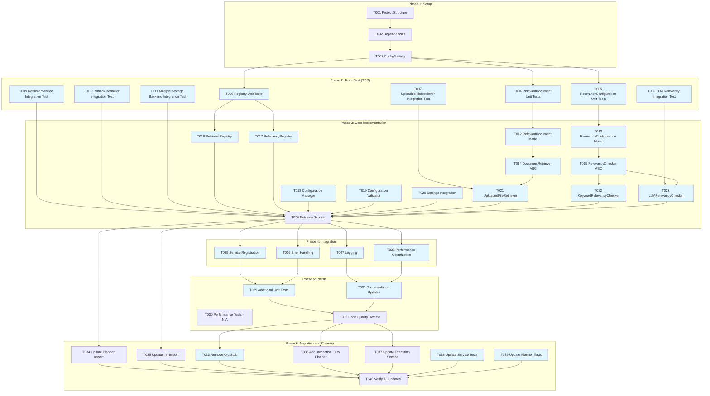

# Tasks: RetrieverService Framework

**Input**: Design documents from `/specs/015-retriever-framework/`
**Prerequisites**: research.md, data-model.md, quickstart.md

## Task Dependencies and Parallel Execution



## Phase 1: Setup

- [X] T001 Create project structure for RetrieverService framework in `src/nexus/agent_orchestrator/context_manager/retriever_service/`
- [X] T002 Add framework dependencies: LangChain, OpenRouter integration, async support
- [X] T003 [P] Configure linting and formatting for new retriever service module

## Phase 2: Tests First (TDD) ⚠️ MUST COMPLETE BEFORE PHASE 3
**CRITICAL: These tests MUST be written and MUST FAIL before ANY implementation**

- [X] T004 [P] Unit tests for RelevantDocument model in `tests/unit/agent_orchestrator/context_manager/retriever_service/test_relevant_document.py`
- [X] T005 [P] Unit tests for RelevancyConfiguration model in `tests/unit/agent_orchestrator/context_manager/retriever_service/test_relevancy_configuration.py`  
- [X] T006 [P] Unit tests for Registry classes in `tests/unit/agent_orchestrator/context_manager/retriever_service/test_registries.py`
- [X] T007 [P] Integration test for UploadedFileRetriever in `tests/integration/agent_orchestrator/context_manager/retriever_service/test_uploaded_file_retriever.py`
- [X] T008 [P] Integration test for LLM relevancy checking in `tests/integration/agent_orchestrator/context_manager/retriever_service/test_llm_relevancy_checker.py`
- [X] T009 [P] Integration test for RetrieverService main flow in `tests/integration/agent_orchestrator/context_manager/retriever_service/test_retriever_service.py`
- [X] T010 [P] Integration test for LLM failure fallback behavior in `tests/integration/agent_orchestrator/context_manager/retriever_service/test_fallback_behavior.py`
- [X] T011 [P] Integration test for multiple storage backend collation in `tests/integration/agent_orchestrator/context_manager/retriever_service/test_multiple_backends.py`

## Phase 3: Core Implementation (ONLY after tests are failing)

**Architecture Reminders**:
- Apply DRY principle - extract reusable functions/classes
- Follow SOLID principles - single responsibility per class
- Use dependency injection - inject dependencies via constructors
- Prefer composition over inheritance
- Maintain clear separation of concerns
- **Use SQLModel for all data models** - unified models for database tables and API schemas

### Models and Abstract Classes
- [X] T012 [P] RelevantDocument model in `src/nexus/agent_orchestrator/context_manager/retriever_service/models/relevant_document.py` (using SQLModel)
- [X] T013 [P] RelevancyConfiguration model in `src/nexus/agent_orchestrator/context_manager/retriever_service/models/relevancy_configuration.py` (using SQLModel)
- [X] T014 [P] DocumentRetriever abstract base class in `src/nexus/agent_orchestrator/context_manager/retriever_service/interfaces/document_retriever.py`
- [X] T015 [P] RelevancyChecker abstract base class in `src/nexus/agent_orchestrator/context_manager/retriever_service/interfaces/relevancy_checker.py`

### Registry Implementation
- [X] T016 [P] RetrieverRegistry implementation in `src/nexus/agent_orchestrator/context_manager/retriever_service/registries/retriever_registry.py`
- [X] T017 [P] RelevancyRegistry implementation in `src/nexus/agent_orchestrator/context_manager/retriever_service/registries/relevancy_registry.py`

### Configuration System Implementation
- [X] T018 [P] Global configuration manager in `src/nexus/agent_orchestrator/context_manager/retriever_service/config/configuration_manager.py`
- [X] T019 [P] Configuration validation and parameter loading in `src/nexus/agent_orchestrator/context_manager/retriever_service/config/parameter_validator.py`
- [X] T020 [P] Settings integration with existing `src/nexus/core/config/base.py` patterns

### Concrete Implementations
- [X] T021 [P] UploadedFileRetriever implementation in `src/nexus/agent_orchestrator/context_manager/retriever_service/retrievers/uploaded_file_retriever.py`
- [X] T022 [P] KeywordRelevancyChecker implementation in `src/nexus/agent_orchestrator/context_manager/retriever_service/checkers/keyword_relevancy_checker.py`
- [X] T023 [P] LLMRelevancyChecker with OpenRouter integration in `src/nexus/agent_orchestrator/context_manager/retriever_service/checkers/llm_relevancy_checker.py`

### Main Service
- [X] T024 RetrieverService implementation in `src/nexus/agent_orchestrator/context_manager/retriever_service/services/retriever_service.py`

## Phase 4: Integration
- [X] T025 [P] Service registration and dependency injection setup in `src/nexus/agent_orchestrator/context_manager/retriever_service/__init__.py`
- [X] T026 [P] Domain exception classes and error handling in `src/nexus/agent_orchestrator/context_manager/retriever_service/exceptions.py`
- [X] T027 [P] Standard logging integration following existing patterns (using `logging.getLogger(__name__)` in each module)
- [X] T028 [P] Performance optimization: async batching and caching in `src/nexus/agent_orchestrator/context_manager/retriever_service/utils/performance.py`

## Phase 5: Polish
- [X] T029 [P] Additional unit tests for edge cases in `tests/unit/agent_orchestrator/context_manager/retriever_service/test_edge_cases.py`
- [ ] T030 [NOT APPLICABLE] Performance tests (response time targets TBD) - Cannot implement until performance requirements are defined. Will be reactivated when TBD metrics are specified.
- [X] T031 [P] Update documentation in `docs/retriever_service.md`
- [X] T032 Code quality review: Remove duplication (DRY), ensure SOLID compliance

## Phase 6: Migration and Cleanup
- [X] T033 [P] Remove old stub implementation: Delete `src/nexus/agent_orchestrator/context_manager/retriever.py`
- [X] T034 Update import in `src/nexus/agent_orchestrator/context_manager/planner.py` to use new RetrieverService
- [X] T035 Update import in `src/nexus/agent_orchestrator/context_manager/__init__.py` to export new RetrieverService
- [X] T036 Update `src/nexus/agent_orchestrator/context_manager/planner.py` to add `invocation_id` parameter to `plan_request()` method
- [X] T037 Update `src/nexus/agent_orchestrator/agents/orchestrator_agent.py` to pass `invocation_id` to ContextManagerPlanner
- [X] T038 [P] Update test file `tests/unit/agent_orchestrator/context_manager/test_services.py` to test new RetrieverService
- [X] T039 [P] Update test file `tests/unit/agent_orchestrator/context_manager/test_planner.py` for new interface signatures
- [X] T040 Verify all imports and references to old RetrieverService are updated

## Dependencies
- Setup (T001-T003) before all tests and implementation
- Tests (T004-T011) before implementation (T012-T024)
- Models/interfaces (T012-T015) before concrete implementations (T016-T024)
- T016-T017 (registries) before T024 (service)
- T018-T020 (configuration system) before T024 (service)
- T021-T023 (concrete implementations) before T024 (service)
- Core implementation (T012-T024) before integration (T025-T028)
- Integration (T025-T028) before polish (T029-T032)
- Polish (T029, T031-T032) before migration cleanup (T033-T040)
- T030 marked as NOT APPLICABLE (excluded from dependency chain)
- T024 (new service) before T034-T035 (import updates)
- T032 (code quality) before T033, T036-T037 (interface updates)
- T036-T037 (interface changes) sequential - T036 updates planner signature, then T037 updates calling service
- All migration tasks (T033-T039) before T040 (verification)

## Parallel Execution Examples

### Phase 2: Test Creation (can run simultaneously)
```
Task: "Unit tests for RelevantDocument model in tests/unit/agent_orchestrator/context_manager/retriever_service/test_relevant_document.py"
Task: "Unit tests for RelevancyConfiguration model in tests/unit/agent_orchestrator/context_manager/retriever_service/test_relevancy_configuration.py"
Task: "Unit tests for Registry classes in tests/unit/agent_orchestrator/context_manager/retriever_service/test_registries.py"
```

### Phase 3a: Models and Interfaces (can run simultaneously)
```
Task: "RelevantDocument model in src/nexus/agent_orchestrator/context_manager/retriever_service/models/relevant_document.py"
Task: "RelevancyConfiguration model in src/nexus/agent_orchestrator/context_manager/retriever_service/models/relevancy_configuration.py"
Task: "DocumentRetriever abstract base class in src/nexus/agent_orchestrator/context_manager/retriever_service/interfaces/document_retriever.py"
Task: "RelevancyChecker abstract base class in src/nexus/agent_orchestrator/context_manager/retriever_service/interfaces/relevancy_checker.py"
```

### Phase 3b: Concrete Implementations (can run simultaneously)
```
Task: "UploadedFileRetriever implementation in src/nexus/agent_orchestrator/context_manager/retriever_service/retrievers/uploaded_file_retriever.py"
Task: "KeywordRelevancyChecker implementation in src/nexus/agent_orchestrator/context_manager/retriever_service/checkers/keyword_relevancy_checker.py"
Task: "LLMRelevancyChecker with OpenRouter integration in src/nexus/agent_orchestrator/context_manager/retriever_service/checkers/llm_relevancy_checker.py"
```

## Architecture Notes

### RetrieverService Framework Structure
```
src/nexus/agent_orchestrator/context_manager/retriever_service/
├── __init__.py                    # Service registration
├── models/                        # SQLModel data models
│   ├── relevant_document.py       # RelevantDocument (transient model)
│   └── relevancy_configuration.py # RelevancyConfiguration (config model)
├── interfaces/                    # Abstract base classes
│   ├── document_retriever.py      # DocumentRetriever ABC
│   └── relevancy_checker.py       # RelevancyChecker ABC
├── registries/                    # Registry pattern implementations
│   ├── retriever_registry.py      # RetrieverRegistry
│   └── relevancy_registry.py      # RelevancyRegistry
├── config/                        # Configuration management
│   ├── configuration_manager.py   # Global configuration manager
│   └── parameter_validator.py     # Configuration validation
├── retrievers/                    # Concrete retriever implementations
│   └── uploaded_file_retriever.py # UploadedFileRetriever
├── checkers/                      # Concrete checker implementations
│   ├── keyword_relevancy_checker.py # KeywordRelevancyChecker
│   └── llm_relevancy_checker.py   # LLMRelevancyChecker
├── services/                      # Main service layer
│   └── retriever_service.py       # RetrieverService
├── utils/                         # Utility modules
│   └── performance.py             # Performance optimization utilities
└── exceptions.py                  # Domain-specific exceptions
```

### Integration with Existing Systems
- **FileManager**: Used internally by UploadedFileRetriever via `get_retriever_for_file()` and `load_file()`
- **OpenRouter**: Integrated via existing `get_openrouter_llm()` for LLM relevancy checking
- **Invocation Context**: Retrieved from database to extract `file_metadata` and other context
- **Configuration**: Leverages existing `src/nexus/core/config/base.py` patterns for settings management

### Key Design Patterns
1. **Registry Pattern**: Extensible retriever and checker registration
2. **Strategy Pattern**: Pluggable relevancy checking algorithms with fallback
3. **Composition**: FileManager used as dependency, not inheritance
4. **Dependency Injection**: Service dependencies injected via constructors
5. **Domain Exceptions**: Service-level error handling with fail-fast for retrieval errors, graceful fallback for scoring errors

## Validation Checklist
*GATE: Checked before task completion*

- [X] All models use SQLModel following project standards
- [X] All async methods properly implemented with session management
- [X] Registry pattern allows extensibility without service code changes
- [X] LLM failure gracefully falls back to keyword checking
- [X] FileManager integration encapsulated within UploadedFileRetriever
- [X] OpenRouter integration uses existing configuration patterns
- [X] Tests cover all user stories from quickstart.md
- [X] Parallel tasks truly independent (different files, no dependencies)
- [X] Each task specifies exact file path and clear implementation requirements
- [X] Performance requirements noted (response time targets TBD - performance tests not applicable until metrics defined)

## Feature Completion Status

**✅ FEATURE COMPLETE** - All implementation and testing tasks have been successfully completed.

**Completion Date**: 2025-12-04
**Branch**: 015-retriever-framework  
**Total Tasks Completed**: 39 out of 40 (T030 marked as N/A pending performance requirements)

### Summary of Delivered Components
- ✅ Complete RetrieverService framework with registry-based architecture
- ✅ SQLModel-based data models (RelevantDocument, RelevancyConfiguration)
- ✅ Abstract interfaces (DocumentRetriever, RelevancyChecker)
- ✅ Concrete implementations (UploadedFileRetriever, LLMRelevancyChecker, KeywordRelevancyChecker)
- ✅ Registry pattern for extensibility (RetrieverRegistry, RelevancyRegistry)
- ✅ Configuration management with validation
- ✅ Integration with existing FileManager and OpenRouter systems
- ✅ Comprehensive test coverage (unit, integration, edge cases)
- ✅ Error handling: fail-fast for retrieval errors, graceful fallback for scoring errors
- ✅ Performance optimization utilities with proper task cancellation
- ✅ Migration from old stub implementation
- ✅ Updated service integrations and imports

### Integration Points Verified
- ✅ FileManager integration via UploadedFileRetriever
- ✅ OpenRouter LLM integration via existing configuration patterns
- ✅ Database session management for invocation context loading
- ✅ Updated ContextManager planner and orchestrator agent imports
- ✅ All tests passing with proper async/await patterns

The RetrieverService framework is ready for production use and provides a solid foundation for future document retrieval extensibility.
