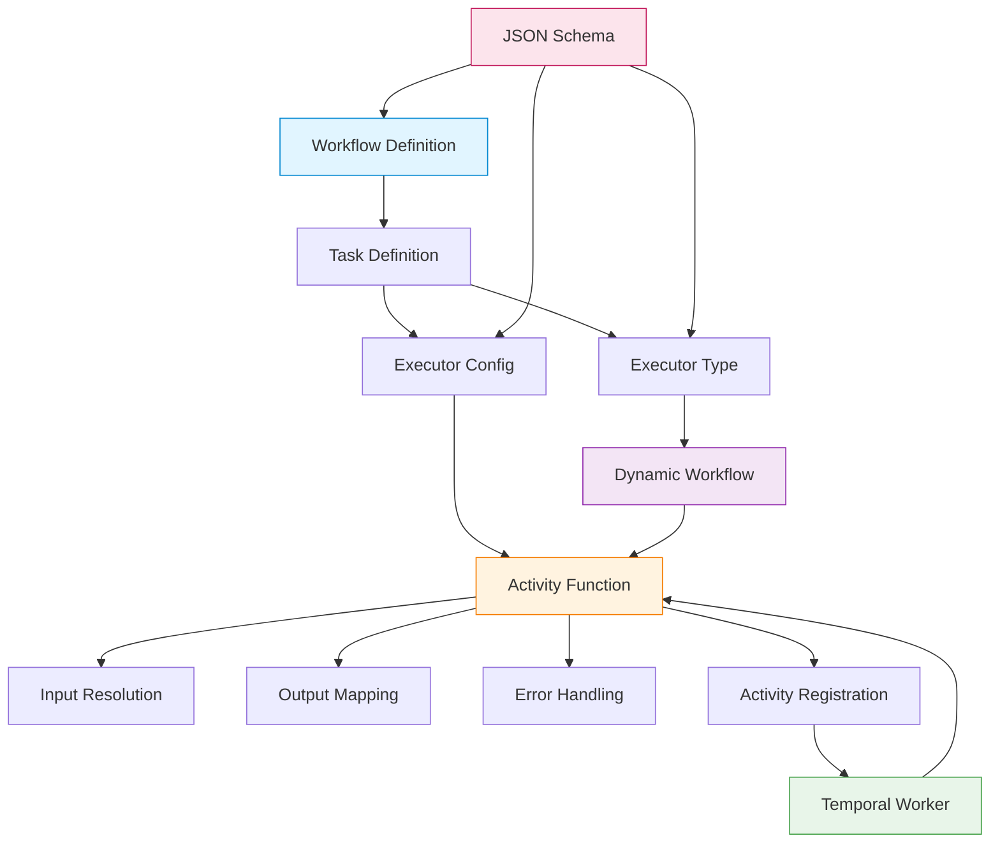

# Data Model: Activity Pattern Architecture

**Feature**: Temporal Activity Architecture Guidelines
**Spec**: [spec.md](./spec.md)
**Plan**: [plan.md](./plan.md)

## Overview

This document describes the conceptual architecture and key entities in the Temporal activity pattern system. While this spec doesn't implement new data models, it documents the architectural patterns that exist across all activity types.

## Core Entities

### 1. Activity Function

**Purpose**: The actual executable unit of work in a Temporal workflow

**Structure**:
```python
@activity.defn
async def execute_<type>_activity(
    activity_config: dict[str, Any],
    input_data: dict[str, Any],
) -> dict[str, Any]:
    """Activity function signature"""
```

**Attributes**:
- **Decorator**: `@activity.defn` from Temporal SDK
- **Function Name**: Convention: `execute_<type>_activity`
- **Parameters**:
  - `activity_config`: Configuration from workflow definition
  - `input_data`: Runtime inputs from workflow state
- **Return Type**: `dict[str, Any]` containing activity results

**Examples** (from existing implementations):
- `execute_bash_script` / `execute_python_script` (script_activity.py)
- `execute_api_request` (api_activity.py)
- `execute_agentic_activity` (agentic_activity.py)

**Relationships**:
- Uses → Executor Configuration (extracts and validates config)
- Invoked By → Dynamic Workflow (via activity execution)
- Registered In → Temporal Worker (activity list)

---

### 2. Executor Configuration

**Purpose**: Pydantic model defining the configuration schema for an activity type

**Structure**:
```python
class <Type>ExecutorConfig(BaseModel):
    """Configuration for <type> executor."""

    # Type-specific fields
    field1: str = Field(description="...")
    field2: int = Field(default=60, ge=1, le=3600)
    # ...
```

**Attributes**:
- **Base Class**: `pydantic.BaseModel`
- **Validation**: Automatic via Pydantic
- **Documentation**: Field-level descriptions
- **Defaults**: Optional fields with sensible defaults

**Examples** (from existing implementations):
- `ScriptExecutorConfig` - language, code, environment, timeout_seconds
- `APIExecutorConfig` - method, url, headers, body, query_params, authentication, timeout
- `AgenticExecutorConfig` - prompt, agent, model, timeout

**Relationships**:
- Part Of → ExecutorConfig union type
- Used By → Activity Function (validation)
- Referenced In → TaskDefinition (workflow YAML)

---

### 3. Executor Type

**Purpose**: Enum value identifying the activity type in workflow definitions

**Structure**:
```python
class ExecutorType(str, Enum):
    """Supported executor types for tasks."""

    SCRIPT = "script"
    API = "api"
    AGENTIC = "agentic"
    # Future types added here
```

**Attributes**:
- **Base Class**: `str, Enum`
- **Values**: Lowercase string identifiers
- **Discriminator**: Used in JSON schema oneOf patterns

**Current Values**:
- `SCRIPT` - Script execution (bash, python)
- `API` - HTTP API calls
- `AGENTIC` - AI agent invocations

**Relationships**:
- Referenced In → TaskDefinition (executor field)
- Maps To → Executor Configuration (discriminator)
- Used By → Dynamic Workflow (routing logic)

---

### 4. Activity Registration

**Purpose**: Process of making an activity available to the Temporal worker

**Structure**:
```python
# In temporal_worker.py
worker = Worker(
    client,
    task_queue=TASK_QUEUE,
    workflows=[DynamicWorkflow],
    activities=[
        execute_bash_script,
        execute_python_script,
        execute_api_request,
        execute_agentic_activity,
        # New activities added here
    ],
)
```

**Attributes**:
- **Location**: `services/temporal_worker.py`
- **Registration Point**: Worker initialization
- **Activity List**: All available activity functions

**Relationships**:
- Registers → Activity Functions
- Managed By → Temporal Worker
- Enables → Activity Execution

---

### 5. Dynamic Workflow Integration

**Purpose**: Mechanism for invoking activities from workflow definitions

**Structure**:
```python
# In dynamic_workflow.py
if task.executor == ExecutorType.SCRIPT:
    if config.language == ScriptLanguage.BASH:
        result = await workflow.execute_activity(
            execute_bash_script,
            args=[activity.task.model_dump(), task_inputs],
            ...
        )
```

**Attributes**:
- **Routing Logic**: Switch on executor type
- **Activity Invocation**: `workflow.execute_activity()`
- **Configuration**: Timeout, retry policy from workflow definition

**Relationships**:
- Invokes → Activity Functions
- Routes By → Executor Type
- Executes In → DynamicWorkflow class

---

### 6. Input Resolution

**Purpose**: Process of resolving expressions and preparing inputs for activity execution

**Structure**:
```python
class ExpressionResolver:
    def resolve_expression(self, expr: str, workflow_state: dict) -> Any:
        """Resolve ${...} expressions in configuration"""
```

**Attributes**:
- **Expression Format**: `${input.field}`, `${variables.name}`, `${secrets.key}`
- **Resolution Context**: workflow_state (inputs, variables, activity_outputs)
- **Validation**: Type checking, security validation

**Relationships**:
- Used By → Activity Functions
- Resolves → Configuration expressions
- Accesses → Workflow State

---

### 7. Output Mapping

**Purpose**: Transform activity results using JSONPath-like expressions

**Structure**:
```python
outputs: dict[str, str] | None = Field(
    default=None,
    description="Output mapping (JSONPath expressions)"
)
```

**Attributes**:
- **Format**: JSONPath expressions
- **Source**: Activity return value
- **Target**: Workflow state (activity_outputs)

**Examples**:
```yaml
outputs:
  job_id: "$.result.id"
  status: "$.result.status"
```

**Relationships**:
- Processes → Activity Results
- Updates → Workflow State
- Defined In → Activity configuration

---

### 8. Error Handling

**Purpose**: Standardized exception hierarchy for activity execution errors

**Structure**:
```python
class ActivityExecutionError(Exception):
    """Base exception for activity errors"""

class <Type>ActivityError(ActivityExecutionError):
    """Specific error for activity type"""
```

**Attributes**:
- **Base Class**: `ActivityExecutionError`
- **Type-Specific**: Each activity has its own error class
- **Message Format**: Clear, actionable error messages

**Examples** (from existing implementations):
- `ScriptExecutionError` (script_activity.py)
- `APIExecutionError` (api_activity.py)
- `AgenticActivityError` (agentic_activity.py)

**Relationships**:
- Raised By → Activity Functions
- Caught By → Dynamic Workflow
- Triggers → Retry Policy (if configured)

---

### 9. JSON Schema Definition

**Purpose**: Workflow definition schema that validates YAML configurations

**Structure**:
```json
{
  "taskDefinition": {
    "type": "object",
    "required": ["executor", "config"],
    "properties": {
      "executor": {
        "type": "string",
        "enum": ["script", "api", "agentic"]
      },
      "config": {
        "oneOf": [
          {"$ref": "#/definitions/ScriptExecutorConfig"},
          {"$ref": "#/definitions/APIExecutorConfig"},
          {"$ref": "#/definitions/AgenticExecutorConfig"}
        ],
        "discriminator": {
          "propertyName": "../executor",
          "mapping": {
            "script": "#/definitions/ScriptExecutorConfig",
            "api": "#/definitions/APIExecutorConfig",
            "agentic": "#/definitions/AgenticExecutorConfig"
          }
        }
      }
    }
  }
}
```

**Attributes**:
- **Format**: JSON Schema
- **Validation**: Executor type and config consistency
- **Discriminator**: Maps executor type to config schema

**Relationships**:
- Validates → Workflow Definitions
- Defines → Executor Type enum
- Maps → Executor Configurations

---

## Entity Relationships Diagram



## Pattern Summary

**Key Patterns**:

1. **Configuration-Driven**: Activities are configured via Pydantic models
2. **Type-Safe**: Enum-based executor types with discriminated unions
3. **Expression-Based**: Dynamic value resolution from workflow state
4. **Error-First**: Standardized error hierarchy for clear failure handling
5. **Schema-Validated**: JSON schema ensures configuration correctness
6. **Registration-Based**: Activities explicitly registered with worker
7. **Output-Mapped**: Results transformed via JSONPath expressions

**Extension Points**:

New activity types must provide:
1. Activity Function (with @activity.defn)
2. Executor Configuration (Pydantic model)
3. Executor Type enum value
4. Activity Registration (in temporal_worker.py)
5. Dynamic Workflow routing (in dynamic_workflow.py)
6. Error class (inheriting from ActivityExecutionError)
7. JSON Schema definition (discriminator mapping)

---

## Testing Guidelines

### Testing Strategy for Activity Pattern Components

When implementing new activity types, follow these testing patterns for each architectural entity:

#### 1. Activity Function Tests

**Location**: `tests/unit/workflows/workflow_engine/activities/test_<type>_activity.py`

**Required Test Coverage**:
- **Basic Execution**: Verify activity executes successfully with valid configuration
- **Configuration Validation**: Test all Pydantic validation rules (required fields, constraints, types)
- **Expression Resolution**: Test `${input.field}`, `${variables.name}`, `${task_id.output}` patterns
- **Error Handling**: Verify custom exceptions are raised with clear messages
- **Edge Cases**: Test boundary conditions (empty inputs, maximum values, etc.)
- **Async Behavior**: Test timeouts, delays, concurrent execution if applicable

**Example Test Structure**:
```python
class TestMyActivity:
    async def test_basic_execution(self): ...
    async def test_invalid_config_raises_error(self): ...
    async def test_expression_resolution(self): ...
    async def test_timeout_handling(self): ...
```

#### 2. Executor Configuration Tests

**Pattern**: Test Pydantic model validation

**Required Coverage**:
- Required field validation (missing fields raise ValidationError)
- Type validation (incorrect types rejected)
- Constraint validation (Field min/max, regex patterns)
- Default values applied correctly
- Model serialization/deserialization

**Example**:
```python
def test_config_missing_required_field():
    with pytest.raises(ValidationError):
        MyExecutorConfig()  # Missing required field

def test_config_validation_constraints():
    with pytest.raises(ValidationError):
        MyExecutorConfig(timeout=-1)  # Negative timeout invalid
```

#### 3. Dynamic Workflow Integration Tests

**Location**: `tests/integration/workflows/test_dynamic_workflow.py`

**Required Coverage**:
- Workflow successfully routes to new activity type
- Activity configuration passed correctly
- Timeout and retry policies applied
- Output mapping works correctly
- Activity results stored in workflow state

**Pattern**: Integration tests that execute full workflow with new activity

#### 4. Expression Resolution Tests

**Location**: Existing tests in `tests/unit/workflows/test_expression_resolver.py`

**What to Verify**:
- Input references: `${input.field}` resolves correctly
- Variable references: `${variables.name}` resolves correctly
- Activity output references: `${task_id.output}` resolves correctly
- Nested paths: `${input.user.name}` navigates correctly
- Multiple expressions in one string: `"User ${input.name} has ID ${input.id}"`
- Missing references return None or default values

**Note**: ExpressionResolver is shared across all activities, so activity-specific tests should verify expressions work within activity context, not re-test the resolver itself.

#### 5. Error Handling Tests

**Required Coverage**:
- Custom exception class exists and inherits from base Exception
- Clear error messages provided
- Error context includes relevant details (config values, state)
- Errors propagate correctly to workflow
- Retry policy triggered on expected error types

**Example**:
```python
async def test_activity_error_with_context():
    with pytest.raises(MyActivityError, match="Invalid configuration: timeout must be positive"):
        await execute_my_activity(invalid_config, {})
```

#### 6. JSON Schema Validation Tests

**Location**: `tests/unit/workflows/test_workflow_definition.py`

**Required Coverage**:
- Workflow definitions with new executor type validate successfully
- Discriminator correctly routes to new config schema
- Invalid configurations rejected by schema
- All required fields enforced
- Enum values validated

**Pattern**: Use JSON schema validator to test workflow YAML/JSON

#### 7. Integration Test Checklist

**End-to-End Testing**:
- [ ] Workflow definition with new activity type loads successfully
- [ ] Temporal worker registers new activity without errors
- [ ] Workflow executes new activity and completes
- [ ] Activity outputs are captured in workflow state
- [ ] Subsequent activities can reference outputs via `${task_id.field}`
- [ ] Error cases trigger proper retry behavior
- [ ] Timeout configuration works as expected

### Test Organization

**Unit Tests** (fast, isolated):
- `tests/unit/workflows/workflow_engine/activities/` - Activity function logic
- `tests/unit/workflows/workflow_engine/models/` - Configuration models
- `tests/unit/workflows/` - Expression resolution, output mapping

**Integration Tests** (slower, full stack):
- `tests/integration/workflows/` - Full workflow execution
- `tests/integration/temporal/` - Temporal worker integration

**Testing Best Practices**:
1. **Test configuration validation first** - Catch Pydantic errors early
2. **Use parametrized tests** - Test multiple scenarios efficiently
3. **Mock external dependencies** - Keep unit tests fast and isolated
4. **Test error messages** - Ensure developers get clear, actionable errors
5. **Follow existing patterns** - Reference tests for script_activity, api_activity, agentic_activity

### Testing Tools and Utilities

**Existing Test Utilities**:
- `pytest` - Test framework
- `pytest.mark.parametrize` - Data-driven tests
- `pytest.raises` - Exception testing
- `unittest.mock` - Mocking dependencies
- `pydantic.ValidationError` - Configuration validation testing

**Example Test File Structure**:
```python
"""Unit tests for <type> activity."""

import pytest
from pydantic import ValidationError

from nexus.workflows.workflow_engine.activities.<type>_activity import (
    MyActivityError,
    execute_my_activity,
)
from nexus.workflows.workflow_engine.models import MyExecutorConfig


class TestMyActivity:
    """Test suite for <type> activity execution."""

    async def test_basic_execution(self): ...
    async def test_all_config_options(self): ...
    async def test_expression_resolution(self): ...
    async def test_error_handling(self): ...

class TestMyExecutorConfig:
    """Test suite for <type> executor configuration."""

    def test_required_fields(self): ...
    def test_validation_constraints(self): ...
    def test_default_values(self): ...
```

---

*This data model serves as a reference architecture for implementing new activity types following the patterns established in specs/016-activity-pattern/spec.md*
