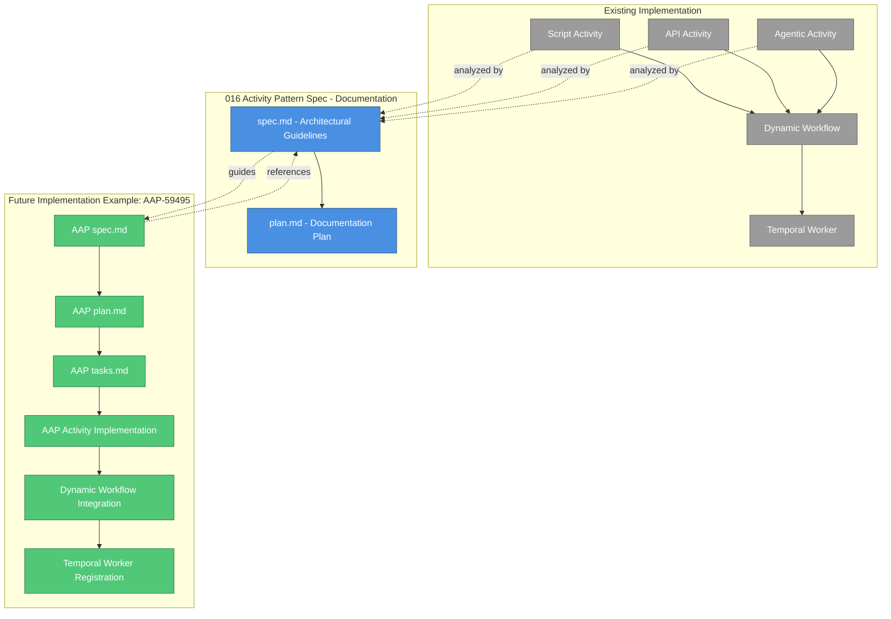

# Implementation Plan: Temporal Activity Architecture Guidelines

**Branch**: `016-activity-pattern` | **Date**: 2025-12-01 | **Spec**: [spec.md](./spec.md)
**Input**: Feature specification from `/specs/016-activity-pattern/spec.md`

## Execution Flow (/plan command scope)
```
1. Load feature spec from Input path
   → Feature spec loaded: Documentation/guideline spec (not implementation)
2. Fill Technical Context
   → SPECIAL CASE: This is documentation-only, no implementation required
   → No code artifacts to generate
3. Skip Constitution Check
   → N/A for documentation artifacts
4. Skip Phase 0 (research)
   → Documentation spec is complete, serves as reference material
5. Skip Phase 1 (design)
   → No schemas, models, or contracts needed for guideline documentation
6. Skip Phase 2 (task planning)
   → No implementation tasks needed - spec IS the deliverable
7. COMPLETE - Documentation artifact ready
   → Purpose: Serve as reference for future feature implementations (e.g., AAP-59495)
```

**IMPORTANT**: This spec is DOCUMENTATION-ONLY. It provides architectural guidelines for developers implementing new Temporal activity types. No code implementation is required for this spec itself.

## Summary

This spec documents architectural patterns and guidelines for creating new Temporal activity types in the Nexus workflow engine. It establishes consistent patterns by analyzing existing implementations (script, API, agentic executors) and provides a framework for future activity implementations.

**Primary Deliverable**: Architectural guideline document (spec.md)
**Purpose**: Reference material for implementing new activity types (e.g., AAP Job Template executor in AAP-59495)
**Scope**: Documentation only - no code, schemas, or tests generated

## Technical Context

**Nature**: Documentation/Guidelines (not implementation)
**Language/Version**: N/A (documentation)
**Primary Dependencies**: N/A (documentation)
**Storage**: N/A (documentation)
**Testing**: N/A (documentation)
**Target Platform**: N/A (documentation)
**Project Type**: Documentation artifact
**Performance Goals**: N/A (documentation)
**Constraints**: Must accurately reflect existing implementation patterns
**Scale/Scope**: Guideline document covering 13 functional requirements

**User-Provided Context**: Spec 016 provides architectural guidelines for creating additional Temporal activities. There are no actual tasks and implementation needed for this spec itself. The result is to lay out guidelines for actual implementation done by another SpecKit feature, for example, for AAP Job Template executor.

## Constitution Check

**STATUS**: N/A - Documentation artifact does not require constitution compliance checks

This is a documentation spec that describes architectural patterns. Constitution checks apply to code implementations, not guideline documents. Future features that use these guidelines (e.g., AAP-59495) will be subject to full constitution compliance.

### Technology Standards Compliance
- [x] **N/A**: Documentation spec - no data models to implement

### Code Architecture Compliance
- [x] **N/A**: Documentation spec - no code to architect

### API Specification Standards Compliance
- [x] **N/A**: Documentation spec - no APIs to specify

## Project Structure

### Documentation (this feature)
```
specs/016-activity-pattern/
├── spec.md              # COMPLETED - Architectural guidelines
├── plan.md              # This file - explains documentation-only nature
├── data-model.md        # COMPLETED - Conceptual architecture and entity relationships
└── quickstart.md        # COMPLETED - Worked example (Echo executor tutorial)
```

**Note**: No research.md or tasks.md - this is a documentation/guideline spec. The artifacts serve as reference material for future implementations.

### Source Code (repository root)

**None** - This is a documentation artifact. No source code changes required.

**Structure Decision**: N/A - Documentation only

## Phase 0: Research

**STATUS**: SKIPPED - Not applicable for documentation spec

The spec.md itself serves as the research output, documenting existing patterns in:
- [agentic_activity.py](../../src/nexus/workflows/workflow_engine/activities/agentic_activity.py)
- [api_activity.py](../../src/nexus/workflows/workflow_engine/activities/api_activity.py)
- [script_activity.py](../../src/nexus/workflows/workflow_engine/activities/script_activity.py)
- [dynamic_workflow.py](../../src/nexus/workflows/workflow_engine/dynamic_workflow.py)
- [temporal_worker.py](../../src/nexus/workflows/workflow_engine/services/temporal_worker.py)

**Output**: spec.md (already complete)

## Phase 1: Design & Contracts

**STATUS**: COMPLETED - Documentation artifacts generated

Created conceptual architecture documentation and tutorial example.

**Generated Artifacts**:

### data-model.md
Documents the conceptual architecture with:
- 9 core entities (Activity Function, Executor Config, Executor Type, etc.)
- Entity relationships and dependencies
- Pattern summary for extension points
- Serves as reference architecture diagram

### quickstart.md
Provides worked example with:
- Step-by-step tutorial for creating Echo executor
- Complete code examples for all 7 required components
- Unit tests demonstrating validation
- Example workflow definition
- Validation checklist mapping to all 13 functional requirements
- Common pitfalls and solutions

**Key Documented Patterns**:
1. Activity function structure (@activity.defn decorator)
2. Executor configuration (Pydantic models)
3. Activity registration (Temporal worker)
4. Dynamic workflow integration
5. Error handling (ActivityExecutionError hierarchy)
6. Input resolution and output mapping
7. JSON schema discriminators

**Output**: data-model.md, quickstart.md

## Phase 2: Task Planning Approach

**STATUS**: NOT APPLICABLE - No implementation tasks for documentation spec

This spec does NOT generate tasks.md. Instead, it serves as input for future feature implementations.

**Usage Pattern**:
1. Developer receives implementation task (e.g., "Implement AAP Job Template executor")
2. Developer creates new spec following SpecKit workflow (e.g., AAP-59495)
3. Developer references THIS spec (016) for architectural patterns
4. Developer's new spec generates plan.md and tasks.md for actual implementation

## Phase 3+: Future Implementation

**STATUS**: NOT APPLICABLE - Documentation spec has no implementation phases

This spec is complete as-is. No further phases needed.

**Actual Use**: Future feature teams (implementing new activity types) will:
1. Create their own feature spec
2. Reference this spec (016) for patterns
3. Generate their own plan.md and tasks.md
4. Implement following the documented guidelines

## Complexity Tracking

**STATUS**: N/A - No violations, documentation artifact

## Progress Tracking

**Phase Status**:
- [x] Phase 0: Research complete (spec.md is the research artifact)
- [x] Phase 1: Design complete (data-model.md and quickstart.md generated)
- [x] Phase 2: Task planning complete (N/A - no tasks for documentation)
- [x] Phase 3: Tasks generated (N/A - documentation spec)
- [x] Phase 4: Implementation complete (all documentation artifacts delivered)
- [x] Phase 5: Validation passed (spec reviewed and corrected, tutorial example created)

**Gate Status**:
- [x] Initial Constitution Check: N/A (documentation)
- [x] Post-Design Constitution Check: N/A (documentation)
- [x] All NEEDS CLARIFICATION resolved: Yes (spec is complete)
- [x] Complexity deviations documented: N/A (no implementation)

**Special Notes**:
- This is a **documentation-only spec** that serves as architectural guidelines
- **Four documentation artifacts** created: spec.md, plan.md, data-model.md, quickstart.md
- No code implementation required for this spec itself
- Future feature implementations (e.g., AAP-59495) will reference these guidelines
- The spec correctly identifies existing executors (script, API, agentic) and uses AAP as an example of a future executor
- quickstart.md provides a complete tutorial with Echo executor as worked example

## Testing Guidance Provided

This documentation spec includes comprehensive testing guidance for developers implementing new activity types:

### Testing Documentation Locations

1. **data-model.md - Testing Guidelines Section**
   - Testing strategy for all 7 architectural entities
   - Required test coverage for each component
   - Test organization (unit vs integration)
   - Testing best practices and tools
   - Example test file structure

2. **quickstart.md - Step 8: Create Tests**
   - Complete unit test examples for Echo executor
   - Tests covering all configuration options
   - Expression resolution testing
   - Error handling validation
   - Edge case testing patterns

### Testing Coverage Areas Documented

**Component-Level Testing**:
- Activity function tests (execution, validation, error handling)
- Executor configuration tests (Pydantic model validation)
- Dynamic workflow integration tests
- Expression resolution tests
- Error handling tests
- JSON schema validation tests
- Integration tests (end-to-end workflow execution)

**Testing Patterns Documented**:
- Configuration validation with Pydantic ValidationError
- Expression resolution (`${input.field}`, `${variables.name}`, `${task_id.output}`)
- Async behavior testing (timeouts, delays)
- Error message validation with pytest.raises
- Parametrized tests for multiple scenarios
- Mock usage for external dependencies

**Testing Tools Referenced**:
- pytest framework
- pytest.mark.parametrize for data-driven tests
- pytest.raises for exception testing
- unittest.mock for mocking
- pydantic.ValidationError for config validation
- Existing test utilities in tests/unit/workflows/

### Testing Best Practices Included

1. **Test configuration validation first** - Catch errors early
2. **Use parametrized tests** - Efficient scenario coverage
3. **Mock external dependencies** - Fast, isolated unit tests
4. **Test error messages** - Clear, actionable feedback
5. **Follow existing patterns** - Reference script_activity, api_activity, agentic_activity tests

### Integration Test Checklist

The documentation provides a 7-point integration test checklist for validating complete activity implementations:
- Workflow definition loading
- Temporal worker registration
- Workflow execution completion
- Output capture in workflow state
- Output reference by subsequent activities
- Error retry behavior
- Timeout configuration

**Purpose**: These testing guidelines ensure that future activity implementations (e.g., AAP Job Template executor in AAP-59495) have comprehensive test coverage following established patterns.

## Architecture Visualization

This diagram shows how the activity pattern guideline spec integrates with the workflow engine and guides future implementations:



**Diagram Explanation**:
- **Gray boxes**: Existing implementations that were analyzed
- **Blue boxes**: This guideline spec (documentation artifact)
- **Green boxes**: Future implementations that will follow the guidelines
- **Dotted lines**: Knowledge flow and reference relationships
- **Solid lines**: Implementation dependencies

---
*Based on Constitution v1.2.0 - See `.specify/memory/constitution.md`*
*Note: Constitution compliance applies to implementations that follow these guidelines, not the guideline document itself*
