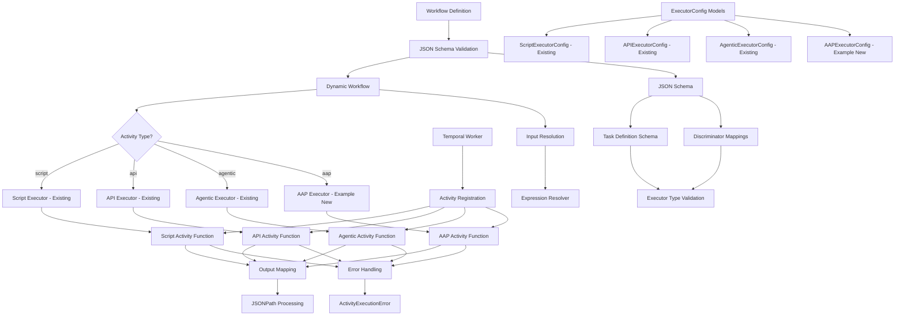

# Feature Specification: Temporal Activity Architecture Guidelines

**Feature Branch**: `016-activity-pattern`  
**Created**: 2025-12-01  
**Status**: Draft  
**Input**: User description: "Based on existing Temporal activities:

- src/nexus/workflows/workflow_engine/activities/agentic_activity.py
- src/nexus/workflows/workflow_engine/activities/api_activity.py
- src/nexus/workflows/workflow_engine/activities/script_activity.py

Pay attention to how the existing activities are used from:
- src/nexus/workflows/workflow_engine/dynamic_workflow.py
- src/nexus/workflows/workflow_engine/services/temporal_worker.py

Generate a spec covering the architectural guidelines to create additional activities.

It should include details of:

- Registering new activities for Temporal
- Invocation of new activities
- Activity configuration"

## Execution Flow (main)
```
1. Parse user description from Input
   → User requests architectural guidelines for creating Temporal activities
2. Extract key concepts from description
   → Actors: developers, system architects
   → Actions: create new activities, register activities, configure execution
   → Data: activity configurations, execution results
   → Constraints: follow existing patterns, maintain type safety
3. For each unclear aspect:
   → Activity types are well-defined based on existing patterns
4. Fill User Scenarios & Testing section
   → Clear developer workflow for creating new activity types
5. Generate Functional Requirements
   → Each requirement derived from existing implementation patterns
6. Identify Key Entities
   → Activity configurations, executor types, validation patterns
7. Run Review Checklist
   → No implementation details in spec - focuses on architectural patterns
8. Return: SUCCESS (spec ready for planning)
```

---

## Quick Guidelines
- ✓ Focus on WHAT developers need and WHY for activity creation
- ✓ Avoid HOW to implement specific activity logic
- ✓ Written for system architects and developers extending the workflow engine

---

## User Scenarios & Testing *(mandatory)*

### Primary User Story
As a system architect extending the Nexus workflow engine, I need clear architectural guidelines for creating new Temporal activity types so that I can add custom executors (like AAP Job Template execution) that follow established patterns and maintain consistency with existing activities.

### Acceptance Scenarios
1. **Given** a new integration requirement (e.g., AAP Job Template executor), **When** a developer follows the activity creation guidelines, **Then** the new activity integrates seamlessly with the existing workflow engine and follows the same patterns as script, API, and agentic activities
2. **Given** a custom activity implementation, **When** the activity is registered with the Temporal worker, **Then** it becomes available for use in workflow definitions and can be invoked through the dynamic workflow system
3. **Given** an activity configuration in a workflow definition, **When** the workflow engine processes the activity, **Then** the configuration is validated using Pydantic models and passed correctly to the activity function
4. **Given** multiple new activity types, **When** they are registered together, **Then** the worker can handle all activity types concurrently without conflicts

### Edge Cases
- What happens when activity configuration validation fails? → Pydantic validation raises ValidationError, workflow execution fails with clear error message indicating which configuration field is invalid
- How does the system handle activity registration conflicts? → Temporal worker initialization fails if duplicate activity names are registered, preventing startup with clear conflict error
- What occurs when an activity type is referenced but not registered? → Dynamic workflow raises error when attempting to execute unregistered activity type, workflow execution fails with clear error indicating missing activity

## Requirements *(mandatory)*

### Functional Requirements
- **FR-001**: System MUST provide clear patterns for creating new Temporal activity functions that follow the existing @activity.defn decorator pattern
- **FR-002**: System MUST support registration of new activities in the Temporal worker alongside existing activities (script, API, agentic)
- **FR-003**: System MUST enable new activities to be invoked through the dynamic workflow system using the same execution patterns as existing activities
- **FR-004**: System MUST validate new activity configurations using Pydantic models that follow the same structure as existing ExecutorConfig classes
- **FR-005**: System MUST support new activity types in the ExecutorType enum and corresponding configuration handling in the dynamic workflow
- **FR-006**: System MUST maintain consistency in error handling patterns across all activity types, including custom exceptions that inherit from ActivityExecutionError
- **FR-007**: System MUST ensure new activities can utilize the same timeout, retry policy, and output mapping mechanisms as existing activities
- **FR-008**: System MUST support the same input resolution and expression evaluation patterns for new activities
- **FR-009**: System MUST enable new activities to integrate with the workflow state management and activity output tracking system
- **FR-010**: System MUST provide guidelines for proper resource cleanup and connection management in new activities
- **FR-011**: System MUST require registration of new executor types in the workflow definition JSON schema with proper discriminator mappings
- **FR-012**: System MUST validate that new task definitions include required schema elements including executor type, configuration properties, and validation rules
- **FR-013**: System MUST ensure new activity types are properly defined in the JSON schema with appropriate oneOf discriminator patterns following existing schema structure
- **FR-014**: System MUST require comprehensive test coverage for new activity types including unit tests for activity logic and configuration validation, and integration tests for end-to-end workflow execution

### Key Entities *(include if feature involves data)*
- **Activity Function**: Temporal activity decorated with @activity.defn that performs the actual work
- **Executor Configuration**: Pydantic model defining configuration schema for the activity type
- **Executor Type**: Enum value representing the activity type in workflow definitions
- **Activity Registration**: Process of adding the activity function to the Temporal worker's activity list
- **Dynamic Workflow Integration**: Mechanism for invoking activities through the dynamic workflow system
- **Input Resolution**: Process of resolving expressions and preparing inputs for activity execution
- **Output Mapping**: System for transforming activity results using JSONPath-like expressions
- **Error Handling**: Standardized exception hierarchy for activity execution errors
- **JSON Schema Definition**: Workflow definition schema that validates workflow configurations and defines executor type discriminators

### Testing Requirements

New activity implementations MUST include comprehensive test coverage:

**Unit Tests**: Activity function logic, configuration validation, expression resolution, error handling
**Integration Tests**: Full workflow execution with Temporal worker, end-to-end validation
**Test Organization**: Follow existing patterns in `tests/unit/workflows/` and `tests/integration/workflows/`

### Architecture Diagram



---

## Review & Acceptance Checklist
*GATE: Automated checks run during main() execution*

### Content Quality
- [x] No implementation details (specific code, file paths, function implementations)
- [x] Focused on architectural patterns and developer needs
- [x] Written for technical stakeholders (system architects and developers)
- [x] All mandatory sections completed

### Requirement Completeness
- [x] No [NEEDS CLARIFICATION] markers remain
- [x] Requirements are testable and unambiguous  
- [x] Success criteria are measurable
- [x] Scope is clearly bounded
- [x] Dependencies and assumptions identified

---

## Execution Status
*Updated by main() during processing*

- [x] User description parsed
- [x] Key concepts extracted
- [x] Ambiguities marked
- [x] User scenarios defined
- [x] Requirements generated
- [x] Entities identified
- [x] Review checklist passed

---
