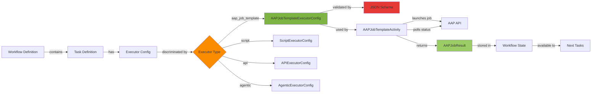
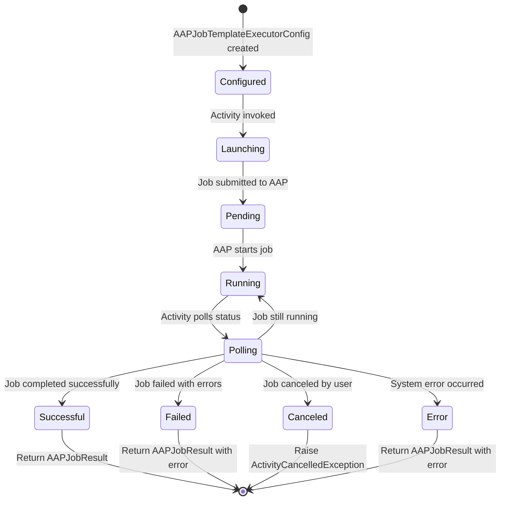

# Data Model: AAP Job Template Executor

**Feature**: Foundational Node Library Updates
**Date**: 2025-12-01
**Spec**: [spec.md](./spec.md)

## Entity Overview

This feature introduces one new executor configuration entity and related result model for AAP Job Template execution.

## New Entities

### AAPJobTemplateExecutorConfig

**Purpose**: Configuration for launching AAP job templates from workflows

**Base Class**: `BaseModel` (Pydantic, same pattern as ScriptExecutorConfig, APIExecutorConfig, AgenticExecutorConfig)

**Location**: `src/nexus/workflows/workflow_engine/models/workflow_definition.py`

**Schema**:
```python
from typing import Any, Dict, List, Literal, Optional
from pydantic import BaseModel, ConfigDict, Field

class AAPJobTemplateExecutorConfig(BaseModel):
    """
    Configuration for AAP Job Template executor.

    This executor launches job templates in Ansible Automation Platform
    and polls for completion, returning job results to the workflow.
    """

    model_config = ConfigDict(populate_by_name=True)

    executor: Literal["aap_job_template"] = "aap_job_template"

    # Required fields
    job_template_id: int = Field(
        ...,
        description="AAP job template ID to launch",
        gt=0
    )

    # Optional override fields
    inventory: Optional[str] = Field(
        default=None,
        description="Override default inventory (name or ID)"
    )

    credentials: Optional[List[int]] = Field(
        default=None,
        description="List of credential IDs to use for job execution"
    )

    extra_vars: Dict[str, Any] = Field(
        default_factory=dict,
        description="Extra variables to pass to the job template"
    )

    # Optional execution parameters
    limit: Optional[str] = Field(
        default=None,
        description="Limit job execution to specific hosts (host pattern)"
    )

    tags: Optional[str] = Field(
        default=None,
        description="Ansible tags to run (comma-separated)"
    )

    skip_tags: Optional[str] = Field(
        default=None,
        description="Ansible tags to skip (comma-separated)"
    )

    verbosity: int = Field(
        default=0,
        ge=0,
        le=5,
        description="Job verbosity level (0=normal, 1-5=verbose)"
    )

    # Configuration metadata
    model_config = {
        "json_schema_extra": {
            "examples": [
                {
                    "executor": "aap_job_template",
                    "job_template_id": 123,
                    "inventory": "production",
                    "extra_vars": {
                        "app_version": "1.2.3",
                        "deploy_environment": "prod"
                    },
                    "tags": "deploy,configure",
                    "verbosity": 1
                }
            ]
        }
    }
```

**Validation Rules**:
- `job_template_id` must be positive integer
- `verbosity` must be between 0 and 5
- `executor` must be exactly "aap_job_template"
- `extra_vars` must be valid JSON object

**Relationships**:
- Extends `BaseModel` from Pydantic (same as other executor configs)
- Used by `TaskDefinition` via `config` field (discriminated union)
- Discriminated by executor type in workflow schema oneOf

### AAPJobResult

**Purpose**: Result object returned by AAP job template execution

**Base Class**: `BaseModel` (Pydantic)

**Location**: `src/nexus/workflows/workflow_engine/models/activity_results.py` (or similar)

**Schema**:
```python
from typing import Any, Dict
from pydantic import BaseModel, Field

class AAPJobResult(BaseModel):
    """
    Result of AAP job template execution.

    Contains job metadata, status, and output for use in
    subsequent workflow tasks.
    """

    job_id: int = Field(
        ...,
        description="AAP job ID for the executed job template"
    )

    status: str = Field(
        ...,
        description="Final job status: 'successful', 'failed', 'canceled', or 'error'"
    )

    output: str = Field(
        default="",
        description="Job stdout output"
    )

    artifacts: Dict[str, Any] = Field(
        default_factory=dict,
        description="Job artifacts and statistics returned by AAP"
    )

    elapsed: float = Field(
        default=0.0,
        description="Job execution time in seconds"
    )

    model_config = {
        "json_schema_extra": {
            "examples": [
                {
                    "job_id": 456,
                    "status": "successful",
                    "output": "PLAY [Deploy Application] ***...",
                    "artifacts": {
                        "changed": 5,
                        "failures": 0,
                        "ok": 10,
                        "skipped": 2
                    },
                    "elapsed": 45.2
                }
            ]
        }
    }
```

**Validation Rules**:
- `job_id` must be positive integer
- `status` should be one of: successful, failed, canceled, error
- `elapsed` must be non-negative

**Usage**:
- Returned by `execute_aap_job_template_activity()`
- Available to subsequent tasks via workflow state
- Can be used in condition expressions

## Updated Entities

### Workflow Schema - Executor Type

**Location**: `schemas/workflows/workflow-definition.schema.json`

**Change**: Add new executor type to enum

```json
{
  "definitions": {
    "executorType": {
      "type": "string",
      "enum": ["script", "api", "agentic", "aap_job_template"]
    }
  }
}
```

**Note**: Executor types are defined in JSON schema, not as Python enum. The workflow validation uses the schema to discriminate between executor configs.

### Dynamic Workflow Executor Mapping

**Location**: `src/nexus/workflows/workflow_engine/dynamic_workflow.py`

**Change**: Add mapping for AAP executor

```python
# Executor type to activity function mapping
EXECUTOR_ACTIVITIES = {
    "script": execute_script_activity,
    "api": execute_api_activity,
    "agentic": execute_agentic_activity,
    "aap_job_template": execute_aap_job_template_activity,  # NEW
}
```

## Schema Validation Changes

### Deprecated Features Removed

**Script Languages**:
- ❌ Removed: `javascript`, `powershell`, `ansible` from `scriptExecutorConfig.language` enum
- ✓ Supported: `python`, `bash`

**Loop Types**:
- ❌ Removed: `countLoop` from `loopDefinition` oneOf
- ✓ Supported: `forEachLoop`, `whileLoop`

**Trigger Types**:
- ❌ Removed: `eventTrigger`, `scheduledTrigger` from `triggerDefinition` oneOf
- ✓ Supported: `manualTrigger`

**Activity Fields**:
- ❌ Removed: `condition` field from `baseActivity` properties
- ✓ Supported: `conditionActivity` as standalone activity type

**Activity Types**:
- ❌ Removed: `joinActivity` type
- ✓ Supported: `convergeActivity` (renamed from join)

**Converge Types**:
- ❌ Removed: `ANY`, `Majority`, `Count` from `convergeActivity.converge_type` enum
- ✓ Supported: `ALL` (waits for all branches to complete)

## Data Flow Diagram



## State Transitions

### AAP Job Execution States



## Database Considerations

**Storage**:
- Executor configs are stored as JSONB in workflow_definitions table
- No new database tables required
- Existing workflow execution tracking table stores job results

**Indexes**:
- No new indexes required (existing workflow execution indexes sufficient)

**Migrations**:
- No database schema changes required (all config stored in JSONB)
- JSON schema validation updated in application code only

## Validation Examples

### Valid Configuration
```json
{
  "executor": "aap_job_template",
  "job_template_id": 123,
  "inventory": "production",
  "extra_vars": {
    "app_version": "1.2.3"
  },
  "tags": "deploy",
  "verbosity": 1
}
```

### Invalid Configurations

**Missing job_template_id**:
```json
{
  "executor": "aap_job_template",
  "inventory": "production"
}
```
Error: "Field 'job_template_id' is required"

**Invalid verbosity**:
```json
{
  "executor": "aap_job_template",
  "job_template_id": 123,
  "verbosity": 10
}
```
Error: "Field 'verbosity' must be between 0 and 5"

## Migration Guide

**Features removed from codebase**:

The following features have been removed from the implementation (no user-facing validation errors needed since there are no existing customers):

1. **JavaScript/PowerShell/Ansible scripts** → Only Python and Bash script executors are supported
2. **Count loops** → Only forEach and while loops are supported
3. **Event/Scheduled triggers** → Only manual triggers are supported
4. **Condition fields on tasks** → Only standalone condition activity is supported
5. **Join activities** → Renamed to "converge" activities in code
6. **Converge types: ANY, Majority, Count** → Only ALL type supported for converge activity

## References

- Base model: `ExecutorConfig` in `src/nexus/workflows/workflow_engine/models/executor_config.py`
- Activity pattern: See spec 016-activity-pattern
- AAP API reference: https://docs.ansible.com/automation-controller/latest/html/controllerapi/api_ref.html
