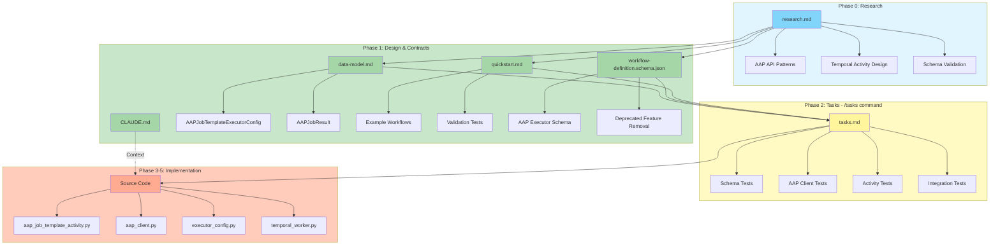

# Implementation Plan: Foundational Node Library Updates

**Branch**: `017-foundational-node-library` | **Date**: 2025-12-01 | **Spec**: [spec.md](./spec.md)
**Input**: Feature specification from `/specs/017-foundational-node-library/spec.md`

## Execution Flow (/plan command scope)
```
1. Load feature spec from Input path
   → Feature spec loaded: AAP Job Template executor + schema validation updates
2. Fill Technical Context
   → Project Type: Python backend (Temporal workflows)
   → Structure Decision: Option 1 (single project with src/)
3. Fill Constitution Check section
   → All checks based on constitution v1.2.0
4. Evaluate Constitution Check section
   → Initial check: PASS - design follows activity pattern from spec 016
   → Update Progress Tracking: Initial Constitution Check
5. Execute Phase 0 → research.md
   → Research AAP API integration patterns
   → Research JSON schema validation best practices
6. Execute Phase 1 → schemas, data-model.md, quickstart.md, CLAUDE.md
   → Generate OpenAPI spec for AAP executor configuration
   → Generate updated workflow-definition.schema.json
   → Create data models for AAPJobTemplateExecutorConfig
7. Re-evaluate Constitution Check section
   → Post-design check: PASS - follows SQLModel patterns, dependency injection
   → Update Progress Tracking: Post-Design Constitution Check
8. Plan Phase 2 → Describe task generation approach
   → Tasks will follow TDD order: tests first, then implementation
9. STOP - Ready for /tasks command
```

## Summary

Implement AAP Job Template executor for launching Ansible Automation Platform job templates from workflows, and remove deprecated features from workflow schema (JavaScript/PowerShell/Ansible scripts, count loops, event/scheduled triggers, condition fields). Rename "join" to "converge" in code.

**Technical Approach**:
- Follow activity pattern from spec 016-activity-pattern
- Create new `aap_job_template_activity.py` with @activity.defn decorator
- Add `AAPJobTemplateExecutorConfig` using Pydantic BaseModel (same pattern as existing executor configs)
- Update workflow-definition.schema.json to remove deprecated features
- Register new activity with Temporal worker

## Technical Context

**Language/Version**: Python 3.12
**Primary Dependencies**: FastAPI, SQLModel (unified data models), Temporal SDK, httpx (for AAP API calls)
**Storage**: PostgreSQL with SQLModel ORM (for workflow definitions and execution state)
**Testing**: pytest (unit and integration tests)
**Target Platform**: Linux server (containerized deployment)
**Project Type**: Single backend project (src/nexus/*)
**Constraints**:
  - Follow activity pattern from spec 016
  - AAP API calls must be async
  - Job status polling must be durable (survive workflow restarts)

**User-Provided Context**: Referenced spec 016-activity-pattern for architectural guidelines on adding new activities. This spec focuses on AAP executor implementation and schema cleanup.

## Constitution Check
*GATE: Must pass before Phase 0 research. Re-check after Phase 1 design.*

### Technology Standards Compliance
- [x] **SQLModel for Data Models**: N/A - Executor configs use Pydantic BaseModel (not database models). Follows existing pattern for ScriptExecutorConfig, APIExecutorConfig, AgenticExecutorConfig.

### Code Architecture Compliance
- [x] **DRY Principle**: AAP client logic extracted to reusable service class
- [x] **SOLID Principles**:
  - Single Responsibility: AAPJobTemplateActivity handles execution only, AAPClient handles API communication
  - Dependency Injection: AAP client injected into activity via constructor
  - Interface Segregation: Minimal IAAPClient interface for testing
- [x] **Separation of Concerns**: Activity (orchestration) / Client (AAP API) / Config (data model) clearly separated
- [x] **Dependency Injection**: AAP connection settings and client injected via constructor
- [x] **Composition vs Inheritance**: No inheritance - composition used for AAP client dependency

### API Specification Standards Compliance
- [x] **OpenAPI/AsyncAPI Compliance**: Workflow schema follows JSON Schema standards (not REST API)
- [x] **Naming Convention**: Schema properties use snake_case (job_template_id, extra_vars)
- [x] **Documentation Completeness**: All executor config fields documented with descriptions and examples
- [x] **RFC 9457 Error Format**: Activity errors use structured format with type, detail, status (via ActivityExecutionError)
- [x] **Error Message Safety**: AAP API errors sanitized, no internal details exposed
- [x] **API Versioning**: Workflow schema versioned, breaking changes documented
- [x] **API Path Structure**: AAP API calls follow /api/v2/* path structure (AAP's convention)
- [x] **Pagination Support**: N/A for this feature (AAP job template execution, not collection endpoint)
- [x] **Filtering/Sorting Consistency**: N/A for this feature
- [x] **Security Documentation**: AAP authentication (token/credentials) documented in executor config schema
- [x] **Schema Compatibility**: Schema updates validated against existing workflows, deprecated features rejected with clear messages

## Implementation Architecture

The following diagram visualizes the implementation plan structure, showing relationships between generated artifacts and the overall system design:



## Project Structure

### Documentation (this feature)
```
specs/017-foundational-node-library/
├── plan.md              # This file (/plan command output)
├── research.md          # Phase 0 output - AAP API research
├── data-model.md        # Phase 1 output - AAPJobTemplateExecutorConfig model
├── quickstart.md        # Phase 1 output - AAP executor usage example
└── tasks.md             # Phase 2 output (/tasks command - NOT created by /plan)
```

### Source Code (repository root)
```
src/nexus/workflows/workflow_engine/
├── activities/
│   ├── agentic_activity.py          # Existing
│   ├── api_activity.py              # Existing
│   ├── script_activity.py           # Existing
│   └── aap_job_template_activity.py # NEW - AAP executor activity
├── services/
│   ├── temporal_worker.py           # UPDATE - register AAP activity
│   └── aap_client.py                # NEW - AAP API client service
├── models/
│   └── executor_config.py           # UPDATE - add AAPJobTemplateExecutorConfig
└── dynamic_workflow.py              # UPDATE - handle 'aap_job_template' executor type

schemas/workflows/
└── workflow-definition.schema.json  # UPDATE - add AAP executor, remove deprecated features

tests/
├── unit/
│   └── workflows/
│       ├── activities/
│       │   └── test_aap_job_template_activity.py    # NEW - unit tests
│       └── services/
│           └── test_aap_client.py                    # NEW - AAP client tests
└── integration/
    └── workflows/
        └── test_aap_workflow_execution.py            # NEW - end-to-end test
```

**Structure Decision**: Option 1 (single project) - existing codebase structure

## Phase 0: Outline & Research

**Unknowns to Research**:
1. AAP API authentication methods (token vs OAuth)
2. AAP job launch API endpoint structure and required parameters
3. AAP job status polling patterns and best practices
4. AAP job output capture formats
5. Temporal activity timeout and retry patterns for long-running jobs
6. JSON schema validation error message customization

**Research Tasks**:
```
Task 1: Research AAP Controller API v2 documentation
  - Endpoint: POST /api/v2/job_templates/{id}/launch/
  - Authentication: Bearer token (from AAP credentials)
  - Required params: inventory, credentials, extra_vars
  - Optional params: limit, tags, skip_tags, verbosity

Task 2: Research AAP job status polling
  - Endpoint: GET /api/v2/jobs/{id}/
  - Status field: 'pending', 'running', 'successful', 'failed', 'canceled'
  - Poll interval: 5 seconds recommended
  - Job output: GET /api/v2/jobs/{id}/stdout/

Task 3: Research Temporal durable timer for polling
  - Use workflow.sleep() for polling intervals
  - Activities should return job ID, workflow polls status
  - Alternative: Activity with heartbeat for long-running operations

Task 4: Research JSON schema oneOf discriminator for executor types
  - Use "executor" field as discriminator
  - oneOf array with each executor type schema
  - Custom error messages via $comment or description fields
```

**Consolidation**:
- **Decision**: Use Temporal activity with async polling loop
- **Rationale**: Simpler than workflow-level polling, activity handles retries automatically
- **Alternatives considered**: Workflow polling (too complex), webhook callback (requires AAP configuration)

**Output**: research.md with AAP API integration patterns and Temporal activity design

## Phase 1: Design & Contracts

*Prerequisites: research.md complete*

### 1. Data Models (data-model.md)

**New Entities**:
```python
# AAPJobTemplateExecutorConfig (SQLModel)
class AAPJobTemplateExecutorConfig(ExecutorConfig):
    executor: Literal["aap_job_template"] = "aap_job_template"
    # Job Template Reference (ID or Name)
    job_template_id: Optional[int] = None  # Mutually exclusive with job_template_name
    job_template_name: Optional[str] = None  # Requires organization_name
    organization_name: Optional[str] = None  # Required with name references
    # Inventory Override (ID or Name)
    inventory_id: Optional[int] = None  # Mutually exclusive with inventory_name
    inventory_name: Optional[str] = None  # Requires organization_name
    # Other fields
    credentials: Optional[List[int]] = None  # Credential IDs
    extra_vars: Dict[str, Any] = Field(default_factory=dict)
    limit: Optional[str] = None  # Host limit pattern
    tags: Optional[str] = None  # Ansible tags to run
    skip_tags: Optional[str] = None  # Ansible tags to skip
    verbosity: Optional[int] = Field(default=0, ge=0, le=5)

# AAPJobResult
class AAPJobResult(BaseModel):
    job_id: int
    status: str  # 'successful', 'failed', 'canceled'
    output: str  # Job stdout
    artifacts: Dict[str, Any]  # Job artifacts/stats
```

**Updated Entities**:
- ExecutorType enum: Add `aap_job_template` value
- Dynamic workflow executor mapping: Add `aap_job_template` → `execute_aap_job_template_activity`

### 2. API Contracts (schemas/workflows/)

**Schema Updates** (`workflow-definition.schema.json`):

```json
{
  "definitions": {
    "executorType": {
      "enum": ["script", "api", "agentic", "aap_job_template"]
    },
    "aapJobTemplateExecutorConfig": {
      "type": "object",
      "required": ["executor"],
      "properties": {
        "executor": {"const": "aap_job_template"},
        "job_template_id": {"type": "integer"},
        "job_template_name": {"type": "string"},
        "organization_name": {"type": "string"},
        "inventory_id": {"type": "integer"},
        "inventory_name": {"type": "string"},
        "credentials": {"type": "array", "items": {"type": "integer"}},
        "extra_vars": {"type": "object"},
        "limit": {"type": "string"},
        "tags": {"type": "string"},
        "skip_tags": {"type": "string"},
        "verbosity": {"type": "integer", "minimum": 0, "maximum": 5}
      },
      "allOf": [
        {
          "oneOf": [
            {"required": ["job_template_id"]},
            {"required": ["job_template_name", "organization_name"]}
          ]
        },
        {
          "not": {"required": ["inventory_id", "inventory_name"]}
        }
      ]
    },
    "scriptExecutorConfig": {
      "properties": {
        "language": {
          "enum": ["python", "bash"]
        }
      }
    },
    "loopDefinition": {
      "oneOf": [
        {"$ref": "#/definitions/forEachLoop"},
        {"$ref": "#/definitions/whileLoop"}
      ]
    },
    "triggerDefinition": {
      "oneOf": [
        {"$ref": "#/definitions/manualTrigger"}
      ]
    },
    "convergeActivity": {
      "type": "object",
      "required": ["type", "branches"],
      "properties": {
        "type": {"const": "converge"},
        "converge_type": {"const": "ALL"},
        "branches": {"type": "array"}
      },
      "description": "Synchronizes parallel branches (renamed from 'join' in code). Only ALL type supported."
    }
  }
}
```

**Schema Changes**:
- Removed languages: `javascript`, `powershell`, `ansible` from script executor enum
- Removed loop types: `count` loop
- Removed trigger types: `event`, `scheduled` triggers
- Removed: `condition` field from activity level (only standalone condition activity supported)
- Renamed: `join` activity to `converge` in code
- Removed converge types: `ANY`, `Majority`, `Count` (only `ALL` type supported)

### 3. Contract Tests (tests/)

**Schema validation tests** (`tests/unit/workflows/test_schema_validation.py`):
```python
def test_aap_executor_valid_config():
    # Valid AAP config passes validation

def test_aap_executor_missing_job_template_id():
    # Missing job_template_id fails validation

def test_converge_activity_all_type_valid():
    # Converge activity with ALL type validates successfully
```

**Activity tests** (`tests/unit/workflows/activities/test_aap_job_template_activity.py`):
```python
def test_execute_aap_job_template_success():
    # AAP job succeeds, output captured

def test_execute_aap_job_template_failure():
    # AAP job fails, error captured

def test_execute_aap_job_template_timeout():
    # AAP job times out, handled gracefully
```

### 4. Quickstart Test (quickstart.md)

**Scenario**: Launch AAP job template from workflow
```yaml
# workflow-aap-example.yaml
name: aap_job_template_example
triggers:
  - type: manual

tasks:
  - name: launch_playbook
    executor: aap_job_template
    config:
      job_template_id: 123
      inventory_name: "Production Servers"
      organization_name: "Operations"
      extra_vars:
        app_version: "1.2.3"
      tags: "deploy"

  - name: check_results
    executor: script
    config:
      language: python
      code: |
        result = inputs["launch_playbook"]
        assert result["status"] == "successful"
```

### 5. Update Agent File (CLAUDE.md)

Run: `.specify/scripts/bash/update-agent-context.sh claude`

**Expected Updates**:
- Add AAP Job Template executor to technology stack
- Add httpx to dependencies (for AAP API calls)
- Update recent changes: "Added AAP Job Template executor for workflow integration"

**Output**: data-model.md, schemas/workflows/workflow-definition.schema.json, failing contract/unit tests, quickstart.md, CLAUDE.md updated

## Phase 2: Task Planning Approach
*This section describes what the /tasks command will do - DO NOT execute during /plan*

**Task Generation Strategy**:
1. Load `.specify/templates/tasks-template.md` as base
2. Generate tasks from Phase 1 design docs in TDD order:
   - Schema validation tests (contract tests) [P]
   - AAP client unit tests [P]
   - Activity unit tests [P]
   - Data model creation (AAPJobTemplateExecutorConfig)
   - AAP client service implementation
   - Activity implementation (aap_job_template_activity.py)
   - Worker registration update
   - Dynamic workflow executor mapping
   - Schema updates (workflow-definition.schema.json)
   - Integration test (end-to-end workflow execution)
   - Quickstart validation

**Ordering Strategy**:
- Tests first (TDD): Contract tests → Unit tests → Implementation
- Dependencies: Data models → Services → Activities → Integration
- Mark [P] for parallel: All test creation tasks are independent
- Sequential: Implementation tasks depend on tests passing

**Estimated Output**: 18-22 numbered, ordered tasks in tasks.md

**Key Task Groups**:
1. **Schema & Validation** (tasks 1-3): Schema updates, validation tests [P]
2. **Data Models** (task 4): AAPJobTemplateExecutorConfig creation
3. **AAP Client** (tasks 5-7): Client tests [P], client implementation
4. **Activity** (tasks 8-11): Activity tests [P], activity implementation, worker registration
5. **Integration** (tasks 12-14): Dynamic workflow update, integration test
6. **Validation** (tasks 15-16): Quickstart test, schema compatibility check

**IMPORTANT**: This phase is executed by the /tasks command, NOT by /plan

## Phase 3+: Future Implementation
*These phases are beyond the scope of the /plan command*

**Phase 3**: Task execution (/tasks command creates tasks.md)
**Phase 4**: Implementation (execute tasks.md following TDD and constitutional principles)
**Phase 5**: Validation (run all tests, execute quickstart.md, verify schema compatibility)

## Complexity Tracking
*No constitution violations - all checks passed*

This feature follows existing activity pattern from spec 016-activity-pattern and adheres to all constitutional requirements:
- Pydantic BaseModel for executor configs (follows existing pattern)
- Dependency injection for AAP client
- Composition over inheritance
- Clear separation of concerns (activity/client/config)
- JSON Schema for workflow validation

No additional complexity introduced.

## Progress Tracking
*This checklist is updated during execution flow*

**Phase Status**:
- [x] Phase 0: Research complete (/plan command)
- [x] Phase 1: Design complete (/plan command)
- [x] Phase 2: Task planning complete (/plan command - describe approach only)
- [ ] Phase 3: Tasks generated (/tasks command)
- [ ] Phase 4: Implementation complete
- [ ] Phase 5: Validation passed

**Gate Status**:
- [x] Initial Constitution Check: PASS
- [x] Post-Design Constitution Check: PASS
- [x] All NEEDS CLARIFICATION resolved (spec is clear)
- [x] Complexity deviations documented (none - follows existing patterns)

---
*Based on Constitution v1.2.0 - See `.specify/memory/constitution.md`*
*Following activity pattern from spec 016-activity-pattern*
