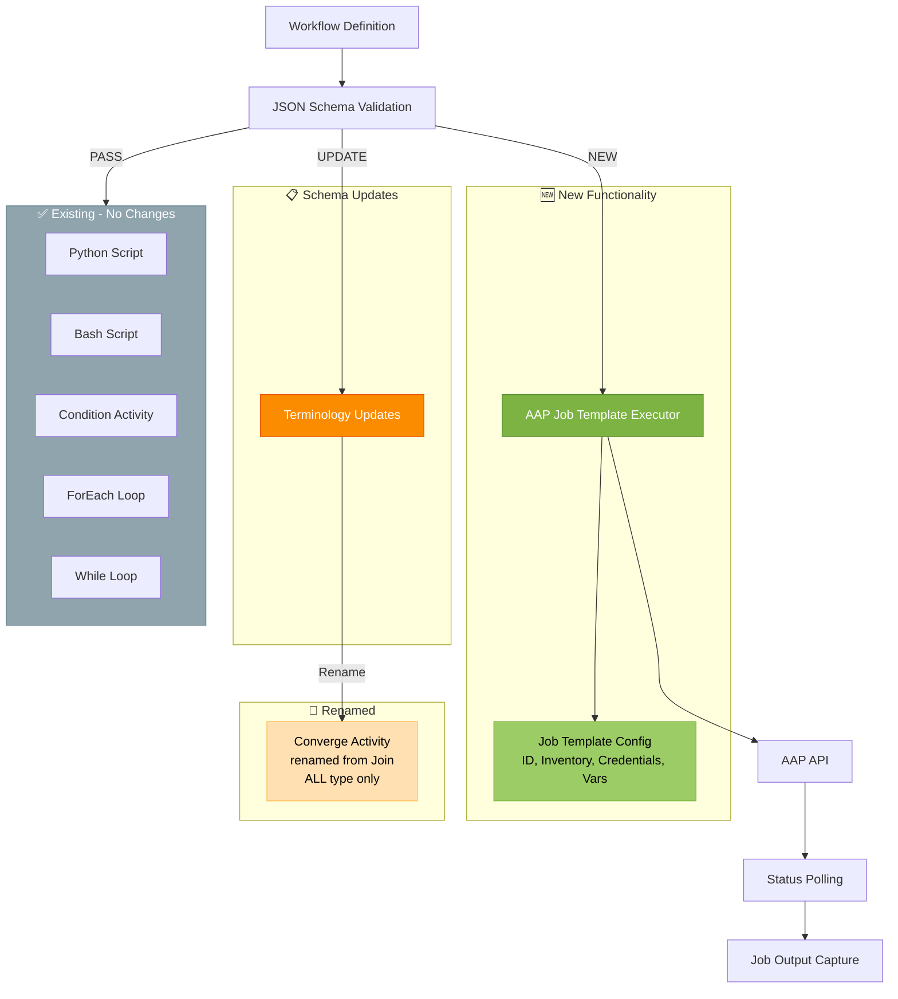

# Feature Specification: Foundational Node Library Updates

**Feature Branch**: `017-foundational-node-library`
**Created**: 2025-12-01
**Status**: Draft
**Input**: User description: "Complete AAP-59495. Reference to but not repeat spec 016 for adding a new activity"

**Related Jira Epic**: [AAP-57951](AAP-57951) - Foundational Node Library (Triggers, Actions & Control Flow)

## Execution Flow (main)
```
1. Parse user description from Input
   → User requests completion of foundational node library requirements for AAP-57951
2. Extract key concepts from description
   → Actors: automation designers
   → Actions: execute AAP job templates, validate schema updates
   → Data: workflow definitions, job template configurations
   → Constraints: follow activity pattern from spec 016, remove deprecated features
3. For each unclear aspect:
   → Requirements clearly defined in epic and updates
4. Fill User Scenarios & Testing section
   → Focus on AAP job template execution and schema validation
5. Generate Functional Requirements
   → New: AAP job template executor
   → Updates: schema validation for removed features
6. Identify Key Entities
   → AAP job template configuration, schema validation rules
7. Run Review Checklist
   → No implementation details per spec 016 pattern
8. Return: SUCCESS (spec ready for planning)
```

---

## ⚡ Quick Guidelines
- ✅ Focus on WHAT automation designers need for AAP job templates
- ✅ Define schema validation requirements for removed features
- ❌ Avoid repeating existing functionality (python/bash scripts, conditionals, loops)
- 👥 Written for product owners and automation designers

---

## User Scenarios & Testing *(mandatory)*

### Primary User Story
As an Automation Designer, I want to execute AAP Job Templates as workflow tasks and have the schema validate that deprecated features are removed, so that I can integrate my existing Ansible Automation Platform automations into workflows using only supported node types.

### Acceptance Scenarios

**AAP Job Template Execution**
1. **Given** a workflow definition with an AAP Job Template task, **When** the workflow executes, **Then** the specified job template launches in Ansible Automation Platform with provided parameters (job template ID, inventory, credentials, extra variables)

2. **Given** an AAP job template task with optional parameters (limit, tags, skipTags, verbosity), **When** the workflow executes, **Then** these parameters are passed correctly to the AAP job launch

3. **Given** an AAP job is launched, **When** the job executes in AAP, **Then** the workflow polls for job status until completion and captures job output for subsequent tasks

4. **Given** an AAP job fails or times out, **When** the workflow monitors the job, **Then** the task captures the failure with error details and applies configured retry or error handling policies

**Schema Update - Join to Converge Rename**
5. **Given** a workflow definition using "converge" activity with type "ALL", **When** the workflow is validated and executed, **Then** the converge activity successfully synchronizes all parallel branches before continuing

### Edge Cases
- What happens when AAP connection fails? → Job template executor cannot reach AAP, task fails with connection error and applies retry policy
- How does system handle invalid job template ID? → AAP returns 404 error, task fails with clear message indicating template not found
- What occurs when AAP job is cancelled externally? → Workflow detects cancelled status during polling, task fails with cancellation error
- How are AAP credential issues handled? → AAP returns authentication error, task fails with credential error message

---

## Requirements *(mandatory)*

### Functional Requirements

**AAP Job Template Executor (NEW)**
- **FR-001**: System MUST support AAP Job Template task executor that launches job templates in Ansible Automation Platform
- **FR-002**: System MUST accept required job template configuration: job template ID, inventory, credentials, and extra variables
- **FR-003**: System MUST support optional job template parameters: limit, tags, skipTags, and verbosity
- **FR-004**: System MUST poll AAP job status until completion and capture job output for subsequent workflow tasks
- **FR-005**: System MUST handle AAP job failures and timeouts with appropriate error handling and retry capabilities
- **FR-006**: System MUST provide clear error messages for AAP connection failures, invalid job template IDs, and credential issues

**Schema Update - Join to Converge Rename**
- **FR-007**: System MUST support "converge" activity with type "ALL" for parallel branch synchronization (renamed from "join", only ALL type supported, ANY/Majority/Count types removed)

### Key Entities

**New Entities**:
- **AAP Job Template Task**: Executor type that launches Ansible Automation Platform job templates
- **Job Template Configuration**: Configuration model including job template ID, inventory, credentials, extra variables, limit, tags, skipTags, verbosity

**Existing Entities** (mentioned for context):
- **Python Script Task**: Existing executor for Python code (no changes needed)
- **Bash Script Task**: Existing executor for Bash commands (no changes needed)
- **Condition Activity**: Existing standalone activity for if/then/else branching (validation update only)
- **ForEach Loop**: Existing loop for array iteration (no changes needed)
- **While Loop**: Existing loop for conditional iteration (no changes needed)
- **Converge Activity**: Renamed from "join" for parallel branch synchronization (only ALL type supported, ANY/Majority/Count removed)

### Architecture Visualization



---

## Review & Acceptance Checklist
*GATE: Automated checks run during main() execution*

### Content Quality
- [x] No implementation details (follows spec 016 pattern)
- [x] Focused on new capabilities (AAP executor) and validation requirements
- [x] Written for product stakeholders and automation designers
- [x] All mandatory sections completed

### Requirement Completeness
- [x] No [NEEDS CLARIFICATION] markers remain
- [x] Requirements are testable and unambiguous
- [x] Success criteria are measurable
- [x] Scope clearly bounded (new AAP executor + schema validation)
- [x] Dependencies identified (spec 016 activity pattern)

---

## Execution Status
*Updated by main() during processing*

- [x] User description parsed
- [x] Key concepts extracted
- [x] Ambiguities marked (none)
- [x] User scenarios defined
- [x] Requirements generated
- [x] Entities identified
- [x] Review checklist passed
- [x] Mermaid diagram included

---

## Notes

**Relationship to Spec 016**: This spec defines WHAT is needed for the foundational node library. Implementation will follow the activity pattern architectural guidelines established in spec 016-activity-pattern.

**Removed from Scope**:
- Ansible playbook execution as script activity type
- Scheduler trigger functionality
- Event trigger functionality
- Wait activity node
- Converge types: ANY, Majority, Count (only ALL type supported)

**Already Implemented** (no changes needed):
- Python script executor
- Bash script executor
- Condition activity (standalone)
- ForEach loop
- While loop
- Manual trigger via API
- REST API action node

**New Work Required**:
- AAP Job Template executor implementation
- Terminology update from "join" to "converge" in code
