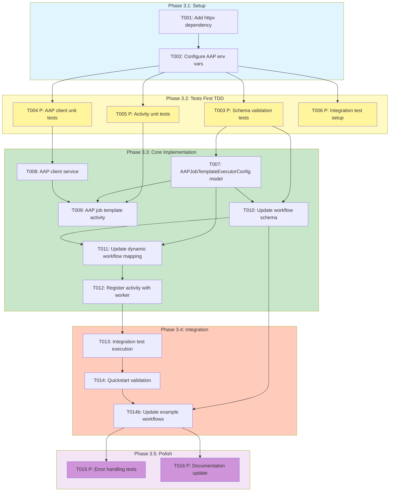

# Tasks: AAP Job Template Executor

**Feature**: Foundational Node Library Updates
**Branch**: `017-foundational-node-library`
**Input**: Design documents from `specs/017-foundational-node-library/`
**Prerequisites**: plan.md, research.md, data-model.md, quickstart.md

## Task Dependency Visualization

The following diagram visualizes task dependencies, parallel execution possibilities, and the implementation workflow:



## Format: `[ID] [P?] Description`
- **[P]**: Can run in parallel (different files, no dependencies)
- Include exact file paths in descriptions
- Follow TDD: Tests must be written and FAIL before implementation

## Path Conventions
Single project structure (existing):
- Source code: `src/nexus/workflows/workflow_engine/`
- Tests: `tests/unit/workflows/`, `tests/integration/workflows/`
- Schemas: `schemas/workflows/`

## Phase 3.1: Setup

### T001: Add httpx dependency to project
**File**: `pyproject.toml`
**Action**: Add `httpx` to dependencies for AAP API calls
**Details**:
- Add to `[project.dependencies]` section
- Version: `>=0.27.0` (async support required)
- Run `uv sync` after updating

**Validation**: `uv pip list | grep httpx` shows httpx installed

---

### T002: Configure AAP environment variables
**Files**:
- `.env.example`
- `src/nexus/workflows/workflow_engine/settings.py`

**Action**: Add AAP connection settings to configuration
**Details**:
- Add to `.env.example`:
  ```bash
  NEXUS_AAP_BASE_URL=https://aap.example.com
  NEXUS_AAP_USERNAME=workflow_user
  NEXUS_AAP_PASSWORD=secret_password
  # OR use token authentication
  NEXUS_AAP_TOKEN=your_api_token
  ```
- Add to `settings.py`:
  ```python
  AAP_BASE_URL: str = Field(...)
  AAP_USERNAME: str | None = Field(default=None)
  AAP_PASSWORD: str | None = Field(default=None)
  AAP_TOKEN: str | None = Field(default=None)
  ```

**Validation**: Settings load without error

---

## Phase 3.2: Tests First (TDD) ⚠️ MUST COMPLETE BEFORE 3.3

**CRITICAL: These tests MUST be written and MUST FAIL before ANY implementation**

### T003 [P]: Schema validation tests for AAP executor
**File**: `tests/unit/workflows/test_yaml_workflow_parser.py` (existing tests) + new tests needed
**Action**: Write tests that verify AAP executor config validation and converge activity support

**Tests Needed**:
1. AAP executor valid config passes validation
2. AAP executor missing job_template_id fails validation
3. Converge activity with ALL type validates successfully

**Test Functions to Add**:
```python
async def test_aap_executor_valid_config()  # NEW
async def test_aap_executor_missing_job_template_id()  # NEW
async def test_converge_activity_all_type_valid()  # NEW
```

**Note**: Deprecated features (JavaScript/PowerShell/Ansible scripts, count loops, event/scheduled triggers, join activities, converge types ANY/Majority/Count) have been removed from the schema enum values. No explicit validation rejection tests needed as there are no existing customers.

**Validation**: New tests FAIL with "not implemented" or schema validation passes incorrectly

---

### T004 [P]: AAP client unit tests
**File**: `tests/unit/workflows/services/test_aap_client.py`
**Action**: Write tests for AAP API client interactions
**Details**:
Mock httpx responses for:
1. `test_launch_job_template_success()` - Returns job ID
2. `test_launch_job_template_auth_failure()` - Returns 401
3. `test_launch_job_template_not_found()` - Returns 404
4. `test_poll_job_status_pending()` - Returns pending status
5. `test_poll_job_status_running()` - Returns running status
6. `test_poll_job_status_successful()` - Returns successful status
7. `test_poll_job_status_failed()` - Returns failed status
8. `test_get_job_output()` - Returns job stdout
9. `test_get_job_artifacts()` - Returns job artifacts/stats
10. `test_cancel_job()` - Cancels running job

**Validation**: All tests FAIL with "AAPClient not found" or similar

---

### T005 [P]: AAP job template activity unit tests
**File**: `tests/unit/workflows/activities/test_aap_job_template_activity.py`
**Action**: Write tests for activity execution logic
**Details**:
Test cases:
1. `test_execute_aap_job_template_success()` - Job succeeds, output captured
2. `test_execute_aap_job_template_failure()` - Job fails, error captured
3. `test_execute_aap_job_template_timeout()` - Job times out, handled gracefully
4. `test_execute_aap_job_template_cancellation()` - Activity cancelled, job cancelled in AAP
5. `test_execute_aap_job_template_retry_on_network_error()` - Network error triggers retry
6. `test_execute_aap_job_template_heartbeat()` - Activity sends heartbeats during polling
7. `test_execute_aap_job_template_invalid_config()` - Invalid config raises ValueError
8. `test_execute_aap_job_template_with_extra_vars()` - Extra vars passed correctly
9. `test_execute_aap_job_template_with_tags()` - Tags and skip_tags applied
10. `test_execute_aap_job_template_polling_loop()` - Polls until terminal state

**Validation**: All tests FAIL with "execute_aap_job_template_activity not found"

---

### T006 [P]: Integration test setup for AAP workflow
**File**: `tests/integration/workflows/test_aap_workflow_execution.py`
**Action**: Write end-to-end integration test (will fail until implementation complete)
**Details**:
Test scenarios from quickstart.md:
1. `test_basic_aap_job_execution()` - Execute workflow with AAP task, verify completion
2. `test_multi_step_workflow_with_aap()` - Pre-validation → AAP → Post-validation
3. `test_aap_job_failure_handling()` - AAP job fails, workflow handles error
4. `test_aap_connection_failure()` - AAP unreachable, retry policy applied

Setup:
- Mock AAP API responses using httpx-mock or respx
- Create test workflow definitions
- Execute via Temporal test server

**Validation**: Tests FAIL with missing activity registration or implementation

---

## Phase 3.3: Core Implementation (ONLY after tests are failing)

**Architecture Reminders**:
- Apply DRY principle - extract reusable AAP client methods
- Follow SOLID principles - AAPClient handles API, Activity handles orchestration
- Use dependency injection - inject AAPClient into activity
- Maintain clear separation of concerns (client/activity/config)
- Use Pydantic BaseModel for executor configs (NOT SQLModel - follows existing pattern)

**API Specification Reminders**:
- Workflow schema uses JSON Schema (not OpenAPI)
- Use snake_case for all schema properties
- Include descriptions for all fields

### T007: Create AAPJobTemplateExecutorConfig model
**File**: `src/nexus/workflows/workflow_engine/models/workflow_definition.py`
**Action**: Add AAP executor config model following existing pattern
**Details**:
Add after `AgenticExecutorConfig` class:

```python
class AAPJobTemplateExecutorConfig(BaseModel):
    """Configuration for AAP Job Template executor."""

    model_config = ConfigDict(populate_by_name=True)

    executor: Literal["aap_job_template"] = "aap_job_template"
    # Job Template Reference
    job_template_id: Optional[int] = Field(default=None, description="AAP job template ID (mutually exclusive with name)", gt=0)
    job_template_name: Optional[str] = Field(default=None, description="AAP job template name (requires organization_name)")
    organization_name: Optional[str] = Field(default=None, description="AAP organization name")
    # Inventory Override
    inventory_id: Optional[int] = Field(default=None, description="Override inventory by ID (mutually exclusive with name)", gt=0)
    inventory_name: Optional[str] = Field(default=None, description="Override inventory by name (requires organization_name)")
    # Other fields
    credentials: Optional[List[int]] = Field(default=None, description="List of credential IDs to use")
    extra_vars: Dict[str, Any] = Field(default_factory=dict, description="Extra variables to pass to job")
    limit: Optional[str] = Field(default=None, description="Limit job execution to specific hosts")
    tags: Optional[str] = Field(default=None, description="Ansible tags to run (comma-separated)")
    skip_tags: Optional[str] = Field(default=None, description="Ansible tags to skip (comma-separated)")
    verbosity: int = Field(default=0, ge=0, le=5, description="Job verbosity level (0-5)")
```

Update `ExecutorType` enum to add `AAP_JOB_TEMPLATE = "aap_job_template"`

**Validation**: `test_aap_executor_valid_config()` passes

---

### T008: Implement AAP client service
**File**: `src/nexus/workflows/workflow_engine/services/aap_client.py` (NEW)
**Action**: Create AAP API client using httpx
**Details**:

```python
import httpx
from typing import Any, Dict

class AAPClient:
    """Client for AAP Controller API v2."""

    def __init__(self, base_url: str, username: str | None = None,
                 password: str | None = None, token: str | None = None):
        self.base_url = base_url
        self._client = httpx.AsyncClient()
        # Auth configuration

    async def launch_job_template(self, job_template_id: int, **params) -> int:
        """Launch job template, return job ID."""
        # POST /api/v2/job_templates/{id}/launch/

    async def poll_job_status(self, job_id: int) -> str:
        """Poll job status, return: pending/running/successful/failed/error/canceled."""
        # GET /api/v2/jobs/{id}/

    async def get_job_output(self, job_id: int) -> str:
        """Get job stdout output."""
        # GET /api/v2/jobs/{id}/stdout/?format=txt

    async def get_job_artifacts(self, job_id: int) -> Dict[str, Any]:
        """Get job artifacts and statistics."""
        # GET /api/v2/jobs/{id}/ and extract artifacts field

    async def cancel_job(self, job_id: int) -> None:
        """Cancel running job."""
        # POST /api/v2/jobs/{id}/cancel/
```

**Validation**: All tests in `test_aap_client.py` pass

---

### T009: Implement AAP job template activity
**File**: `src/nexus/workflows/workflow_engine/activities/aap_job_template_activity.py` (NEW)
**Action**: Create Temporal activity with polling loop
**Details**:

```python
import asyncio
from temporalio import activity
from typing import Any, Dict

# AAP polling configuration (internal implementation detail)
AAP_POLL_INTERVAL_SECONDS = 5  # Poll job status every 5 seconds

@activity.defn
async def execute_aap_job_template_activity(
    activity_config: dict[str, Any],
    input_data: dict[str, Any],
) -> dict[str, Any]:
    """Execute AAP job template activity.

    1. Launch job template via AAP API
    2. Poll job status periodically until completion
    3. Handle cancellation (cancel AAP job if workflow cancelled)
    4. Send heartbeats for long-running jobs
    5. Return job result (status, output, artifacts)
    """

    # Parse config
    config = AAPJobTemplateExecutorConfig(**activity_config)

    # Initialize AAP client (inject via settings)
    aap_client = get_aap_client()

    # Launch job (handles both ID and name-based lookups)
    job_id = await aap_client.launch_job_template(
        job_template_id=config.job_template_id,
        job_template_name=config.job_template_name,
        organization_name=config.organization_name,
        inventory_id=config.inventory_id,
        inventory_name=config.inventory_name,
        credentials=config.credentials,
        extra_vars=config.extra_vars,
        limit=config.limit,
        tags=config.tags,
        skip_tags=config.skip_tags,
        verbosity=config.verbosity,
    )

    # Poll until terminal state
    while True:
        if activity.is_cancelled():
            await aap_client.cancel_job(job_id)
            raise ActivityCancelledException()

        status = await aap_client.poll_job_status(job_id)

        if status in ['successful', 'failed', 'error', 'canceled']:
            break

        activity.heartbeat(job_id)
        await asyncio.sleep(AAP_POLL_INTERVAL_SECONDS)

    # Get job output and artifacts
    output = await aap_client.get_job_output(job_id)
    artifacts = await aap_client.get_job_artifacts(job_id)

    return {
        "job_id": job_id,
        "status": status,
        "output": output,
        "artifacts": artifacts,
    }
```

**Important**: Use module-level constant `AAP_POLL_INTERVAL_SECONDS` instead of hardcoding the value. This makes it easier to adjust for testing or future optimization without changing the core logic.

**Validation**: All tests in `test_aap_job_template_activity.py` pass

---

### T010: Update workflow schema for AAP executor **[PARTIALLY COMPLETE]**
**File**: `schemas/workflows/workflow-definition.schema.json`
**Action**: Add AAP executor definition and remove deprecated features

**✅ Already Implemented** (commit 75dc224):
- Removed `"javascript"` and `"powershell"` from `scriptExecutorConfig.properties.language.enum`
- Schema now has: `"enum": ["python", "bash"]`

**Still Needed**:

1. Add to `definitions.executorType.enum`: `"aap_job_template"`

2. Add `aapJobTemplateExecutorConfig` definition:
```json
"aapJobTemplateExecutorConfig": {
  "type": "object",
  "required": ["executor"],
  "properties": {
    "executor": {"const": "aap_job_template"},
    "job_template_id": {"type": "integer", "minimum": 1},
    "job_template_name": {"type": "string"},
    "organization_name": {"type": "string"},
    "inventory_id": {"type": "integer", "minimum": 1},
    "inventory_name": {"type": "string"},
    "credentials": {"type": "array", "items": {"type": "integer"}},
    "extra_vars": {"type": "object"},
    "limit": {"type": "string"},
    "tags": {"type": "string"},
    "skip_tags": {"type": "string"},
    "verbosity": {"type": "integer", "minimum": 0, "maximum": 5}
  },
  "allOf": [
    {
      "oneOf": [
        {"required": ["job_template_id"]},
        {"required": ["job_template_name", "organization_name"]}
      ]
    },
    {
      "not": {"required": ["inventory_id", "inventory_name"]}
    }
  ]
}
```

3. Remove `"ansible"` from `scriptExecutorConfig.properties.language.enum` (if still present)

4. Update `loopDefinition.oneOf`: Remove `countLoop` reference

5. Update `triggerDefinition.oneOf`: Remove `eventTrigger` and `scheduledTrigger` references, keep only `manualTrigger`

6. Remove `joinActivity` from activity types, ensure `convergeActivity` exists

**Validation**: Schema validation tests in T003 pass

---

### T011: Update dynamic workflow executor mapping
**File**: `src/nexus/workflows/workflow_engine/dynamic_workflow.py`
**Action**: Add AAP executor to executor mapping
**Details**:

1. Import the activity:
```python
from src.nexus.workflows.workflow_engine.activities.aap_job_template_activity import execute_aap_job_template_activity
```

2. Find the executor mapping dict and add:
```python
EXECUTOR_ACTIVITIES = {
    "script": execute_script_activity,
    "api": execute_api_activity,
    "agentic": execute_agentic_activity,
    "aap_job_template": execute_aap_job_template_activity,  # NEW
}
```

3. Add handling in `_execute_task_activity` method:
```python
if activity.task.executor == ExecutorType.AAP_JOB_TEMPLATE:
    return await self._execute_aap_job_template_executor(activity, task_inputs, timeout, execution_id)
```

4. Implement `_execute_aap_job_template_executor` method following pattern of `_execute_agentic_executor`

**Validation**: Integration tests can invoke AAP activities via workflow

---

### T012: Register AAP activity with Temporal worker
**File**: `src/nexus/workflows/workflow_engine/services/temporal_worker.py`
**Action**: Register new activity with worker
**Details**:

Find the activity registration and add:
```python
activities=[
    execute_script_activity,
    execute_api_activity,
    execute_agentic_activity,
    execute_aap_job_template_activity,  # NEW
]
```

**Validation**: Worker starts without error, activity shows in `tctl activity list`

---

## Phase 3.4: Integration

### T013: Execute integration tests
**File**: `tests/integration/workflows/test_aap_workflow_execution.py`
**Action**: Run integration tests created in T006
**Details**:
- All 4 test scenarios must pass
- Verify AAP API interactions work end-to-end
- Check workflow state captures job results
- Validate error handling and retries

**Validation**: All integration tests pass

---

### T014: Validate quickstart scenarios
**Files**: Test files from quickstart.md examples
**Action**: Create and execute workflows from quickstart.md
**Details**:

Create test workflows:
1. `workflows/test-aap-deploy-app.yaml` (Example 1)
2. `workflows/test-aap-with-validation.yaml` (Example 2)
3. `workflows/test-aap-error-handling.yaml` (Example 3)

Execute and verify:
- Example 1: Basic execution completes successfully
- Example 2: Multi-step workflow with scripts and AAP works
- Example 3: Error handling and retry policies work

**Validation**: All quickstart scenarios work as documented

---

### T014b: Update existing example workflows to conform to updated schema
**Files**: Example workflow files in `samples/workflows/` or similar directory
**Action**: Update any existing example workflows that use deprecated features
**Details**:

Search for and update workflows using:
1. JavaScript/PowerShell/Ansible script executors → Convert to Python or Bash
2. Count loops → Convert to forEach or while loops
3. Event/scheduled triggers → Convert to manual triggers
4. Condition fields at node level → Convert to standalone condition activities
5. Join activities → Rename to converge activities with type: ALL
6. Converge activities with ANY/Majority/Count types → Update to type: ALL

**Steps**:
1. Find all workflow example files in the repository (e.g., `samples/`, `examples/`, `docs/workflows/`)
2. Review each workflow for deprecated features
3. Update workflows to use only supported features
4. Validate updated workflows against new schema
5. Test updated workflows to ensure they still work as intended

**Validation**: All example workflows validate against updated schema and execute successfully

---

## Phase 3.5: Polish

### T015 [P]: Error handling edge case tests
**File**: `tests/unit/workflows/activities/test_aap_error_handling.py`
**Action**: Add tests for edge cases and error scenarios
**Details**:
1. `test_aap_api_rate_limiting()` - Handle 429 Too Many Requests
2. `test_aap_job_output_too_large()` - Handle large stdout (>1MB)
3. `test_aap_network_timeout()` - Handle network timeout gracefully
4. `test_aap_invalid_credentials()` - Handle 401 Unauthorized
5. `test_aap_job_stuck_in_pending()` - Handle jobs that never start
6. `test_concurrent_aap_jobs()` - Multiple AAP jobs in same workflow

**Validation**: All edge case tests pass

---

### T016 [P]: Update documentation
**Files**:
- `CLAUDE.md`
- `README.md` (if AAP executor needs user documentation)

**Action**: Document AAP executor usage and configuration
**Details**:

CLAUDE.md updates:
- Add httpx to dependencies
- Add AAP executor to recent changes
- Document NEXUS_AAP_* environment variables

README.md (if applicable):
- Add AAP job template executor to features list
- Link to quickstart.md for usage examples

**Validation**: Documentation is complete and accurate

---

## Dependencies

**Critical Path**:
```
T001 → T002 → [T003, T004, T005, T006] → T007 → T008 → T009 → T010 → T011 → T012 → T013 → T014 → T014b → [T015, T016]
```

**Detailed Dependencies**:
- T001 (httpx) blocks T002 (settings need httpx available)
- T002 (settings) blocks all tests (T003-T006 need env config)
- T003 (schema tests) blocks T007 (model), T010 (schema updates)
- T004 (client tests) blocks T008 (client implementation)
- T005 (activity tests) blocks T009 (activity implementation)
- T006 (integration setup) runs in parallel with other test setup
- T007 (model) blocks T009 (activity needs model), T010 (schema needs model), T011 (mapping needs enum)
- T008 (client) blocks T009 (activity uses client)
- T010 (schema) blocks T011 (mapping needs schema validation), T014b (example workflows need updated schema)
- T011 (mapping) blocks T012 (worker needs complete mapping)
- T012 (worker) blocks T013 (integration needs registered activity)
- T013 (integration) blocks T014 (quickstart validation)
- T014 (quickstart) blocks T014b (validate new features work before updating examples)
- T014b (example updates) blocks T015-T016 (polish phase)

**Parallel Execution Groups**:
- Group 1 (after T002): T003, T004, T005, T006 - All test files
- Group 2 (after T014b): T015, T016 - Error tests and docs (different files)

## Parallel Execution Examples

**Group 1: Test Creation (after T002)**
```bash
# All tests can be written in parallel - different files
Task: tests/unit/workflows/test_schema_validation_deprecated.py
Task: tests/unit/workflows/services/test_aap_client.py
Task: tests/unit/workflows/activities/test_aap_job_template_activity.py
Task: tests/integration/workflows/test_aap_workflow_execution.py
```

**Group 2: Polish Phase (after T014)**
```bash
# Error tests and documentation can be done in parallel
Task: tests/unit/workflows/activities/test_aap_error_handling.py
Task: Update CLAUDE.md and README.md
```

## Notes

**TDD Discipline**:
- T003-T006 MUST be completed and failing before starting T007
- Each test file must have at least one test that fails
- Verify tests fail for the right reason (not implementation found, not syntax error)

**Code Quality**:
- Follow existing activity pattern (see `agentic_activity.py`, `script_activity.py`)
- Use dependency injection for AAPClient (don't instantiate in activity)
- Add comprehensive docstrings with examples
- Use type hints for all function signatures

**Schema Changes**:
- Deprecated features have been removed from schema enum values

**Environment Variables**:
- All AAP config must use NEXUS_ prefix
- Support both username/password and token auth
- Document all variables in .env.example

## Validation Checklist

- [x] All schemas have corresponding tests (T003)
- [x] All entities have model tasks (T007 - AAPJobTemplateExecutorConfig)
- [x] All tests come before implementation (T003-T006 before T007-T012)
- [x] Parallel tasks truly independent (different files, no shared state)
- [x] Each task specifies exact file path
- [x] No task modifies same file as another [P] task
- [x] TDD approach: tests fail first, implementation makes them pass
- [x] Integration tests validate end-to-end scenarios
- [x] Quickstart examples executable and validated
