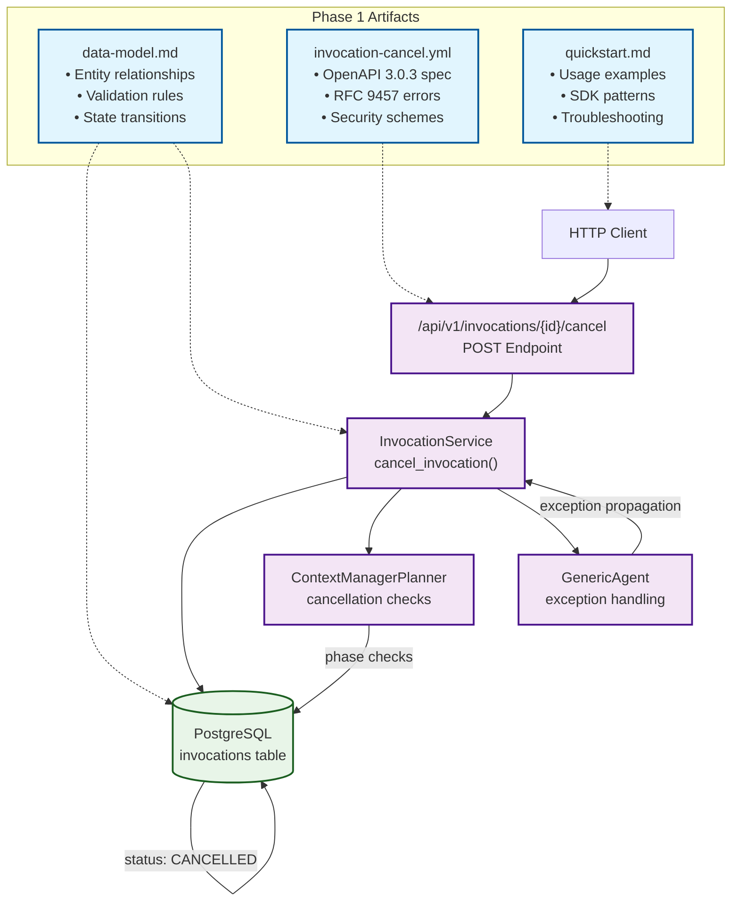

# Implementation Plan: User Invocation Cancellation

**Branch**: `018-users-can-cancel` | **Date**: 2025-01-29 | **Spec**: [spec.md](spec.md)
**Input**: Feature specification from `/specs/018-users-can-cancel/spec.md`

## Execution Flow (/plan command scope)
```
1. Load feature spec from Input path
   → If not found: ERROR "No feature spec at {path}"
2. Fill Technical Context (scan for NEEDS CLARIFICATION)
   → Detect Project Type from context (web=frontend+backend, mobile=app+api)
   → Set Structure Decision based on project type
3. Fill the Constitution Check section based on the content of the constitution document.
4. Evaluate Constitution Check section below
   → If violations exist: Document in Complexity Tracking
   → If no justification possible: ERROR "Simplify approach first"
   → Update Progress Tracking: Initial Constitution Check
5. Execute Phase 0 → research.md
   → If NEEDS CLARIFICATION remain: ERROR "Resolve unknowns"
6. Execute Phase 1 → schemas, data-model.md, quickstart.md, agent-specific template file (e.g., `CLAUDE.md` for Claude Code, `.github/copilot-instructions.md` for GitHub Copilot, `GEMINI.md` for Gemini CLI, `QWEN.md` for Qwen Code or `AGENTS.md` for opencode).
7. Re-evaluate Constitution Check section
   → If new violations: Refactor design, return to Phase 1
   → Update Progress Tracking: Post-Design Constitution Check
8. Plan Phase 2 → Describe task generation approach (DO NOT create tasks.md)
9. STOP - Ready for /tasks command
```

**IMPORTANT**: The /plan command STOPS at step 7. Phases 2-4 are executed by other commands:
- Phase 2: /tasks command creates tasks.md
- Phase 3-4: Implementation execution (manual or via tools)

## Summary
Primary requirement: Allow users to cancel their running invocations to stop unwanted or long-running requests. Technical approach: Extend existing invocation system with RESTful cancellation endpoint, database status checking, and graceful stopping points in processing phases. Uses existing SQLModel-based schema with no migrations required.

## Implementation Architecture



## Technical Context
**Language/Version**: Python 3.12
**Primary Dependencies**: FastAPI, SQLModel (for unified data models), SQLAlchemy (async), pytest
**Storage**: PostgreSQL with SQLModel ORM (existing invocations table with status enum)
**Testing**: pytest with asyncio support
**Target Platform**: Linux server (containerized FastAPI application)
**Project Type**: single (backend API extending existing agent orchestrator)
**Performance Goals**: 95% success rate
**Constraints**: graceful stopping without data corruption
**Scale/Scope**: Support existing user base (~1000s concurrent invocations), minimal memory overhead

## Constitution Check
*GATE: Must pass before Phase 0 research. Re-check after Phase 1 design.*

### Technology Standards Compliance
- [x] **SQLModel for Data Models**: All data models use SQLModel (leveraging existing Invocation model, no new models needed)

### Code Architecture Compliance
- [x] **DRY Principle**: Design reuses existing service patterns, no duplication of cancellation logic
- [x] **SOLID Principles**:
  - Single Responsibility: Cancel endpoint only handles cancellation
  - Open/Closed: Extends existing InvocationService without modification
  - Dependency Inversion: Service layer depends on abstractions (async session)
- [x] **Separation of Concerns**: API layer (routes) → Service layer (business logic) → Data layer (SQLModel)
- [x] **Dependency Injection**: FastAPI dependency injection for database session and user auth
- [x] **Composition vs Inheritance**: Uses composition (service classes) not inheritance

### API Specification Standards Compliance
- [x] **OpenAPI/AsyncAPI Compliance**: Cancellation endpoint will be OpenAPI compliant (extending existing FastAPI patterns)
- [x] **Naming Convention**: All new schemas use snake_case (InvocationCancelRequest, InvocationCancelResponse)
- [x] **Documentation Completeness**: Endpoint will have full FastAPI docstring with parameter descriptions and examples
- [x] **RFC 9457 Error Format**: Follows existing HTTPException patterns with structured error responses
- [x] **Error Message Safety**: Error messages hide implementation details, show only user-actionable information
- [x] **API Versioning**: Endpoint follows existing /api/v1/ pattern with semantic versioning
- [x] **API Path Structure**: Follows pattern /api/v1/invocations/{id}/cancel (component=invocations, resource=cancel)
- [x] **Pagination Support**: N/A (single resource operation, not collection endpoint)
- [x] **Filtering/Sorting Consistency**: N/A (single resource operation)
- [x] **Security Documentation**: Uses existing FastAPI auth patterns with Bearer token requirement
- [x] **Schema Compatibility**: No breaking changes (extends existing schema, no removals)

## Project Structure

### Documentation (this feature)
```
specs/[###-feature]/
├── plan.md              # This file (/plan command output)
├── research.md          # Phase 0 output (/plan command)
├── data-model.md        # Phase 1 output (/plan command)
├── quickstart.md        # Phase 1 output (/plan command)
└── tasks.md             # Phase 2 output (/tasks command - NOT created by /plan)
```

### Source Code (repository root)
```
# Option 1: Single project (DEFAULT)
src/
├── models/
├── services/
├── cli/
└── lib/

tests/
├── contract/
├── integration/
└── unit/

# Option 2: Web application (when "frontend" + "backend" detected)
backend/
├── src/
│   ├── models/
│   ├── services/
│   └── api/
└── tests/

frontend/
├── src/
│   ├── components/
│   ├── pages/
│   └── services/
└── tests/

# Option 3: Mobile + API (when "iOS/Android" detected)
api/
└── [same as backend above]

ios/ or android/
└── [platform-specific structure]
```

**Structure Decision**: Option 1 (Single project) - Backend API extension to existing Nexus agent orchestrator

## Phase 0: Outline & Research
**SKIPPED**: No NEEDS CLARIFICATION items found in Technical Context. All technology choices were based on existing codebase analysis and concrete requirements.

**Rationale for Skip**:
- Feature extends existing, well-understood FastAPI/SQLModel architecture
- No new external dependencies or integrations required
- Implementation approach follows established patterns in the codebase

## Phase 1: Design & Contracts
*Prerequisites: Phase 0 skipped (no research needed)*

**COMPLETED**:

1. **✅ Entity modeling** → `data-model.md`:
   - Leveraged existing Invocation entity with SQLModel
   - Defined cancellation metadata structure for JSONB storage
   - Documented state transitions and validation rules
   - Created new request/response schemas

2. **✅ API contracts** → `schemas/agent-orchestrator/invocation-cancel.yml`:
   - OpenAPI 3.0.3 specification for POST /api/v1/invocations/{id}/cancel
   - RFC 9457 compliant error responses
   - Full documentation with examples and security schemes
   - Follows constitutional API path structure requirements

3. **✅ User documentation** → `quickstart.md`:
   - Step-by-step cancellation instructions
   - cURL examples for common scenarios
   - Troubleshooting guide and SDK examples
   - Integration testing recommendations

4. **✅ Agent context update**:
   - Updated Claude Code context with FastAPI/SQLModel/PostgreSQL tech stack
   - Preserved manual additions between markers
   - Added feature-specific technology information

**Output**: data-model.md, schemas/agent-orchestrator/invocation-cancel.yml, quickstart.md, CLAUDE.md (updated)

## Phase 2: Task Planning Approach
*This section describes what the /tasks command will do - DO NOT execute during /plan*

**Task Generation Strategy**:
- Load `.specify/templates/tasks-template.md` as base
- Generate tasks from Phase 1 design docs (data-model.md, OpenAPI schema, quickstart.md)
- API contract → contract test creation [P]
- Request/response models → schema validation tests [P]
- Cancellation service → unit test creation [P]
- Integration scenarios from quickstart → end-to-end tests
- Implementation tasks following TDD principles

**Specific Tasks Expected**:
1. Create contract tests for cancellation endpoint
2. Extend InvocationService with cancellation method
3. Add cancellation API route to FastAPI router
4. Create cancellation exception handling
5. Add context manager cancellation checks
6. Integration tests for full cancellation flow
7. Update API documentation and error handling

**Ordering Strategy**:
- TDD order: Tests before implementation (contract tests first)
- Dependency order: Exception classes → Service methods → API routes → Integration
- Mark [P] for parallel execution where files are independent
- Sequential for dependent changes (service before routes)

**Estimated Output**: 15-20 numbered, ordered tasks in tasks.md (smaller scope due to extending existing system)

**IMPORTANT**: This phase is executed by the /tasks command, NOT by /plan

## Phase 3+: Future Implementation
*These phases are beyond the scope of the /plan command*

**Phase 3**: Task execution (/tasks command creates tasks.md)
**Phase 4**: Implementation (execute tasks.md following constitutional principles)
**Phase 5**: Validation (run tests, execute quickstart.md, performance validation)

## Complexity Tracking
*Fill ONLY if Constitution Check has violations that must be justified*

**No violations to document** - Design follows all constitutional principles without deviations.


## Progress Tracking
*This checklist is updated during execution flow*

**Phase Status**:
- [x] Phase 0: Research complete (/plan command) - SKIPPED: No unknowns to research
- [x] Phase 1: Design complete (/plan command) - All artifacts generated
- [x] Phase 2: Task planning complete (/plan command - describe approach only)
- [x] Phase 3: Tasks generated (/tasks command) - NEXT STEP
- [x] Phase 4: Implementation complete
- [x] Phase 5: Validation passed

**Gate Status**:
- [x] Initial Constitution Check: PASS - All requirements met
- [x] Post-Design Constitution Check: PASS - Design maintains compliance
- [x] All NEEDS CLARIFICATION resolved - None were present
- [x] Complexity deviations documented - None present (clean extension)

---
*Based on Constitution v1.2.0 - See `.specify/memory/constitution.md`*
