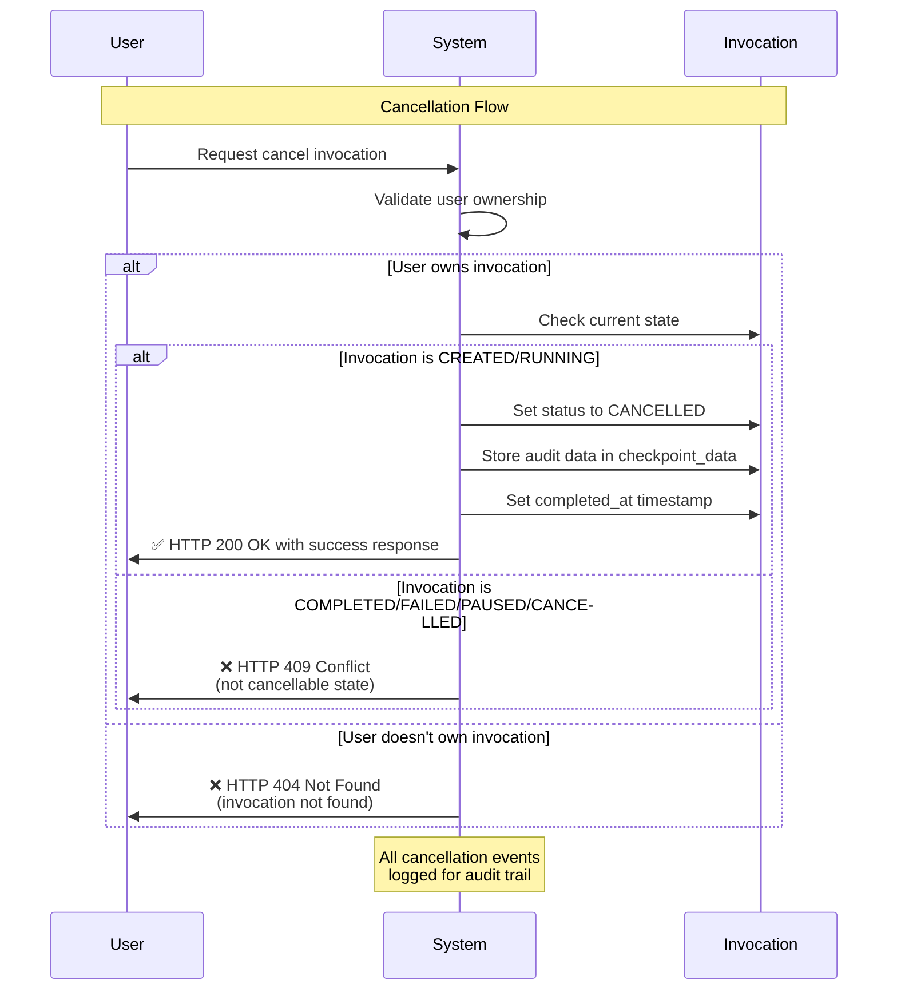

# Feature Specification: User Invocation Cancellation

**Feature Branch**: `018-users-can-cancel`
**Created**: 2025-01-29
**Status**: Draft
**Input**: User description: "Users can cancel running invocations to stop unwanted or long-running requests"

## Execution Flow (main)
```
1. Parse user description from Input
   �  "Users can cancel running invocations to stop unwanted or long-running requests"
2. Extract key concepts from description
   �  Actors: Users, Actions: Cancel, Data: Invocations, Constraints: Running state
3. For each unclear aspect:
   �  No unclear aspects - feature scope is well-defined
4. Fill User Scenarios & Testing section
   �  Clear user flow: initiate cancel � system stops execution � user gets confirmation
5. Generate Functional Requirements
   �  Requirements are testable and specific
6. Identify Key Entities (if data involved)
   �  Invocation entity with cancellation metadata
7. Run Review Checklist
   �  No implementation details, user-focused requirements
8. Return: SUCCESS (spec ready for planning)
```

---

## � Quick Guidelines
-  Focus on WHAT users need and WHY
- L Avoid HOW to implement (no tech stack, APIs, code structure)
- =e Written for business stakeholders, not developers

---

## User Scenarios & Testing *(mandatory)*

### Primary User Story
As a Nexus user, I want to cancel my running invocations so that I can stop unwanted or long-running requests when I realize they're not what I intended, contain errors, or are taking longer than expected. This gives me control over my automation tasks and prevents waste of system resources.

### User Flow Diagram


### Acceptance Scenarios
1. **Given** I have a RUNNING invocation that I initiated, **When** I request to cancel it, **Then** the system marks it as CANCELLED and stores cancellation metadata
2. **Given** I have a CREATED invocation, **When** I request to cancel it, **Then** the system successfully cancels it before execution begins
3. **Given** I have a COMPLETED invocation, **When** I try to cancel it, **Then** the system returns HTTP 409 Conflict status
4. **Given** I try to cancel someone else's invocation, **When** I submit the cancel request, **Then** the system returns HTTP 404 Not Found status
5. **Given** I cancel an invocation with a custom reason, **When** I check its details later, **Then** I can see the cancellation metadata in checkpoint_data
6. **Given** I submit an invalid UUID format, **When** I request cancellation, **Then** the system returns HTTP 400 Bad Request status

### Edge Cases
- Invalid UUID formats are rejected with HTTP 400 Bad Request
- Multiple cancellation attempts on same invocation return appropriate status based on current state
- Database transaction failures during cancellation return HTTP 500 Internal Server Error
- Fast invocations that complete before cancellation cannot be cancelled (returns HTTP 409)

## Requirements *(mandatory)*

### Functional Requirements
- **FR-001**: System MUST allow users to cancel only their own invocations
- **FR-002**: System MUST only allow cancellation of invocations in CREATED or RUNNING states
- **FR-003**: System MUST prevent cancellation of invocations in COMPLETED, FAILED, PAUSED, or already CANCELLED states
- **FR-004**: System MUST provide immediate feedback on whether the cancellation was successful or failed
- **FR-005**: System MUST record cancellation metadata including timestamp, reason, and requesting user ID
- **FR-006**: System MUST mark cancelled invocations with CANCELLED status and set completion timestamp
- **FR-007**: System MUST validate user ownership before processing cancellation requests
- **FR-008**: System MUST return appropriate HTTP status codes for different failure scenarios
- **FR-009**: Users MUST be able to specify an optional reason for cancellation (defaults to "User cancelled")
- **FR-010**: System MUST store cancellation audit data in the invocation's checkpoint metadata

### Success Criteria
- Cancelled invocations produce no partial or corrupted output data
- Users receive immediate confirmation (within 1 second) of cancellation success or failure
- 100% of cancellation attempts respect user ownership boundaries
- All cancellation events are recorded with complete audit information
- System maintains responsive performance during cancellation operations

### Key Entities *(include if feature involves data)*
- **Invocation**: Represents a user-initiated automation task with states (created, running, paused, completed, failed, cancelled), ownership information, execution metadata, and cancellation details stored in checkpoint_data
- **Cancellation Request**: Contains optional reason field for why the invocation should be cancelled
- **Cancellation Response**: Indicates success/failure status with descriptive message

---

## Technical Interface *(implementation details)*

### API Endpoint
- **POST** `/api/v1/invocations/{invocation_id}/cancel`
- Requires valid UUID format for invocation_id parameter
- Accepts JSON request body with optional reason field

### Request Schema
```json
{
  "reason": "User cancelled"  // Optional, max 500 characters
}
```

### Response Schema
```json
{
  "success": true|false,
  "message": "Descriptive result message"
}
```

### HTTP Status Codes
- **200 OK**: Cancellation successful
- **400 Bad Request**: Invalid UUID format
- **404 Not Found**: Invocation not found or user doesn't own it
- **409 Conflict**: Invocation not in cancellable state
- **500 Internal Server Error**: Unexpected system error

### Audit Data Storage
Cancellation metadata stored in `invocation.checkpoint_data`:
```json
{
  "cancelled_at": "ISO timestamp",
  "cancelled_by": "user_uuid",
  "reason": "cancellation reason"
}
```

---

## Scope & Boundaries

### In Scope
- Cancelling invocations in CREATED or RUNNING states only
- User ownership validation before cancellation
- Storing cancellation audit data in checkpoint_data field
- HTTP status codes for different error conditions
- Optional cancellation reason with default value

### Out of Scope
- Cancelling invocations belonging to other users (unless admin privileges)
- Recovering or resuming cancelled invocations
- Cancelling system-level background tasks unrelated to user invocations
- Real-time progress updates during cancellation process
- Bulk cancellation of multiple invocations simultaneously

---

## Dependencies & Assumptions

### Dependencies
- Existing invocation management system
- User authentication and authorization system
- Audit logging infrastructure

### Assumptions
- Users understand the difference between running and completed invocations
- Cancellation is intended to be permanent (no undo functionality)
- Users have legitimate reasons for cancelling their own work
- System can identify safe stopping points during invocation processing
- Network connectivity allows cancellation requests to reach the system promptly

---

## Review & Acceptance Checklist
*GATE: Automated checks run during main() execution*

### Content Quality
- [x] No implementation details (languages, frameworks, APIs)
- [x] Focused on user value and business needs
- [x] Written for non-technical stakeholders
- [x] All mandatory sections completed

### Requirement Completeness
- [x] No [NEEDS CLARIFICATION] markers remain
- [x] Requirements are testable and unambiguous
- [x] Success criteria are measurable
- [x] Scope is clearly bounded
- [x] Dependencies and assumptions identified

---

## Execution Status
*Updated by main() during processing*

- [x] User description parsed
- [x] Key concepts extracted
- [x] Ambiguities marked (none identified)
- [x] User scenarios defined
- [x] Requirements generated
- [x] Entities identified
- [x] Review checklist passed

---
