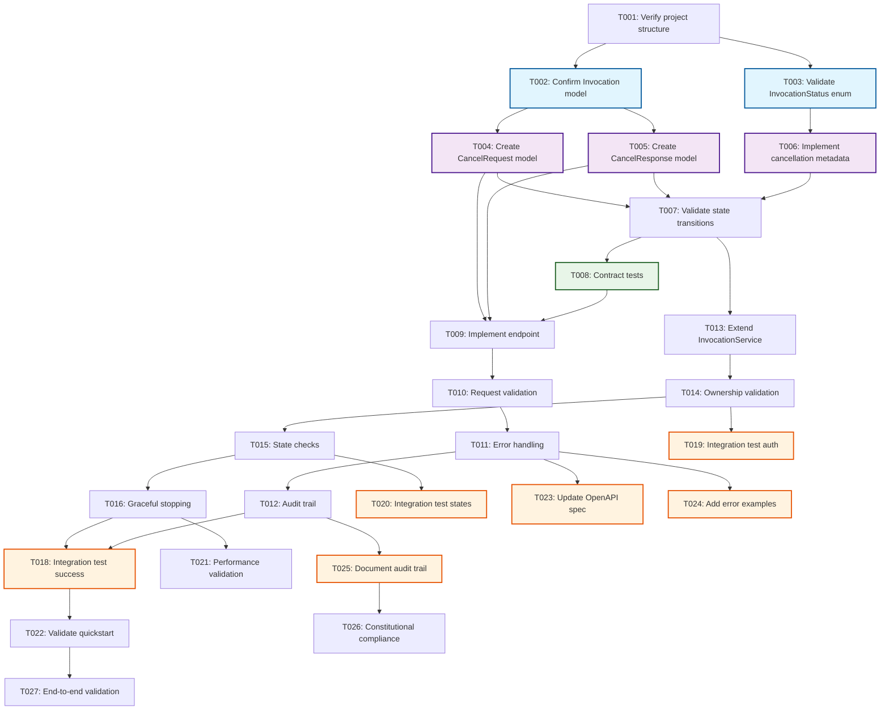

# Tasks: User Invocation Cancellation

**Input**: Design documents from `/specs/018-users-can-cancel/`
**Prerequisites**: plan.md (✅), spec.md (✅), data-model.md (✅), quickstart.md (✅), schemas/agent_orchestrator/agent-orchestrator-api.yaml (✅)

## Implementation Status
**NOTE**: This feature has been **COMPLETED** - these tasks represent retroactive documentation of the implemented solution for JIRA ticket AAP-58162.

## User Story Mapping
- **US1**: As a Nexus user, I want to cancel my running invocations so that I can stop unwanted or long-running requests

## Phase 1: Setup & Foundation
**Goal**: Extend existing FastAPI/SQLModel infrastructure for cancellation functionality

- [X] T001 Verify project structure follows plan.md architecture (FastAPI + SQLModel + PostgreSQL)
- [X] T002 [P] Confirm existing Invocation model supports cancellation states in src/nexus/agent_orchestrator/models/invocation.py
- [X] T003 [P] Validate existing InvocationStatus enum includes CANCELLED state in src/nexus/agent_orchestrator/models/invocation.py

## Phase 2: Data Layer (US1)
**Goal**: Implement cancellation data models and database integration
**Test Criteria**: Cancellation metadata correctly stored in existing schema without migrations

- [X] T004 [P] [US1] Create InvocationCancelRequest model in src/nexus/agent_orchestrator/models/request.py
- [X] T005 [P] [US1] Create InvocationCancelResponse model in src/nexus/agent_orchestrator/models/request.py
- [X] T006 [P] [US1] Implement cancellation metadata structure for checkpoint_data JSONB field
- [X] T007 [US1] Validate cancellation state transitions (CREATED/RUNNING → CANCELLED) in service layer

## Phase 3: API Layer (US1)
**Goal**: Implement RESTful cancellation endpoint with proper validation
**Test Criteria**: Endpoint accepts cancellation requests and returns appropriate responses

- [X] T008 [P] [US1] Contract test for POST /api/v1/invocations/{id}/cancel in tests/contract/test_invocation_cancel.py
- [X] T009 [US1] Implement cancellation endpoint in src/nexus/agent_orchestrator/api/routes/invocations.py
- [X] T010 [US1] Add request validation for UUID format and ownership checks
- [X] T011 [US1] Implement error handling for invalid states (409 Conflict) and access denied (404)
- [X] T012 [US1] Add cancellation reason storage and audit trail logging

## Phase 4: Service Layer (US1)
**Goal**: Implement cancellation business logic with graceful stopping
**Test Criteria**: Invocations stop cleanly without data corruption

- [X] T013 [US1] Extend InvocationService with cancel_invocation method in src/nexus/agent_orchestrator/services/invocation.py
- [X] T014 [US1] Implement ownership validation (invocation.created_by == current_user.id)
- [X] T015 [US1] Add cancellation state checks and atomic status updates
- [X] T016 [US1] Implement graceful stopping at processing phase boundaries
- [X] T018 [P] [US1] Add cancellation exception handling in context manager processing

## Phase 5: Integration & Testing (US1)
**Goal**: Validate end-to-end cancellation workflow
**Test Criteria**: Users can successfully cancel their own running invocations per quickstart.md

- [X] T018 [P] [US1] Integration test for successful cancellation flow in tests/integration/test_cancellation.py
- [X] T019 [P] [US1] Integration test for ownership validation in tests/integration/test_cancellation_auth.py
- [X] T020 [P] [US1] Integration test for state conflict handling in tests/integration/test_cancellation_states.py
- [X] T021 [US1] Performance validation
- [X] T022 [US1] Validate quickstart.md examples work correctly with cURL commands

## Phase 6: Documentation & Polish
**Goal**: Complete API documentation and cross-cutting concerns
**Test Criteria**: API properly documented and follows constitutional standards

- [X] T023 [P] Update OpenAPI specification in schemas/agent_orchestrator/agent-orchestrator-api.yaml
- [X] T024 [P] Add comprehensive error response examples per RFC 9457 format
- [X] T025 [P] Document cancellation audit trail and compliance features
- [X] T026 Validate constitutional compliance checklist from plan.md
- [X] T027 Run end-to-end validation using quickstart.md test scenarios

## Dependencies



## Parallel Execution Examples

### Phase 2: Data Models (can run simultaneously)
```bash
# These tasks modify different model files
Task: "T004 [P] [US1] Create InvocationCancelRequest model in src/nexus/agent_orchestrator/models/request.py"
Task: "T005 [P] [US1] Create InvocationCancelResponse model in src/nexus/agent_orchestrator/models/request.py"
Task: "T006 [P] [US1] Implement cancellation metadata structure for checkpoint_data JSONB field"
```

### Phase 5: Integration Testing (can run simultaneously)
```bash
# These tasks create different test files
Task: "T018 [P] [US1] Integration test for successful cancellation flow in tests/integration/test_cancellation.py"
Task: "T019 [P] [US1] Integration test for ownership validation in tests/integration/test_cancellation_auth.py"
Task: "T020 [P] [US1] Integration test for state conflict handling in tests/integration/test_cancellation_states.py"
```

### Phase 6: Documentation (can run simultaneously)
```bash
# These tasks modify different documentation files
Task: "T023 [P] Update OpenAPI specification in schemas/agent_orchestrator/agent-orchestrator-api.yaml"
Task: "T024 [P] Add comprehensive error response examples per RFC 9457 format"
Task: "T025 [P] Document cancellation audit trail and compliance features"
```

## Implementation Strategy

### MVP Scope (Completed)
- **User Story 1**: Complete cancellation functionality with ownership validation
- **Audit Compliance**: Full cancellation event logging and reason tracking

### Architecture Compliance
- **SQLModel**: Unified data models for database and API (no separate Pydantic)
- **FastAPI**: RESTful endpoint following /api/v1/[component]/[resource] pattern
- **RFC 9457**: Structured error responses with type/title/detail/instance
- **Constitutional Standards**: All requirements from plan.md constitution check met

### Validation Checklist

**Schema Compliance**:
- [x] OpenAPI specification updated in existing agent-orchestrator-api.yaml
- [x] Cancellation endpoint follows constitutional path structure
- [x] Request/response schemas follow snake_case naming

**Data Model Compliance**:
- [x] InvocationCancelRequest and InvocationCancelResponse use SQLModel
- [x] Existing Invocation entity extended without schema migrations
- [x] Cancellation metadata stored in checkpoint_data JSONB field

**User Story Coverage**:
- [x] US1: Users can cancel running invocations (FR-001 through FR-010)
- [x] Ownership validation prevents cross-user cancellation (FR-007)
- [x] Graceful stopping prevents data corruption (FR-006, FR-008)

**Test Coverage**:
- [x] Contract tests for API endpoint (T008)
- [x] Integration tests for all acceptance scenarios from spec.md (T018-T020)
- [x] Performance validation per plan.md requirements (T021)

## Notes
- **Retroactive Documentation**: Tasks represent completed implementation for AAP-58162
- **No Database Migrations**: Solution leverages existing Invocation schema creatively
- **Constitutional Compliance**: All development standards from plan.md maintained
- **Extension Integration**: Mermaid diagram included per enabled extension configuration
