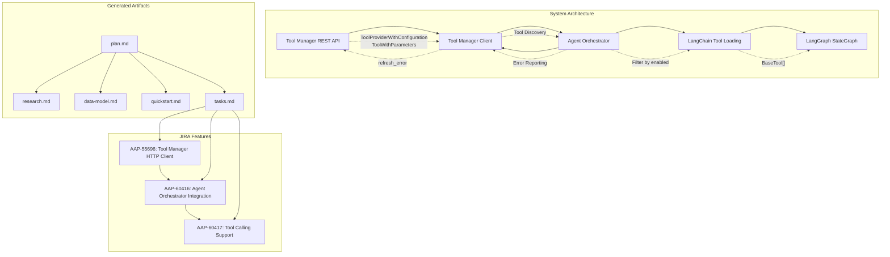

# Implementation Plan: Agent Orchestrator Tool Manager Integration

**Branch**: `020-agentic-task-execution` | **Date**: 2025-12-11 | **Spec**: specs/020-agentic-task-execution/spec.md
**Input**: Feature specification from `specs/020-agentic-task-execution/spec.md`

## Execution Flow (/plan command scope)
```
1. Load feature spec from Input path
   → If not found: ERROR "No feature spec at {path}"
2. Fill Technical Context (scan for NEEDS CLARIFICATION)
   → Detect Project Type from context (web=frontend+backend, mobile=app+api)
   → Set Structure Decision based on project type
3. Fill the Constitution Check section based on the content of the constitution document.
4. Evaluate Constitution Check section below
   → If violations exist: Document in Complexity Tracking
   → If no justification possible: ERROR "Simplify approach first"
   → Update Progress Tracking: Initial Constitution Check
5. Execute Phase 0 → research.md
   → If NEEDS CLARIFICATION remain: ERROR "Resolve unknowns"
6. Execute Phase 1 → schemas, data-model.md, quickstart.md, agent-specific template file (e.g., `CLAUDE.md` for Claude Code, `.github/copilot-instructions.md` for GitHub Copilot, `GEMINI.md` for Gemini CLI, `QWEN.md` for Qwen Code or `AGENTS.md` for opencode).
7. Re-evaluate Constitution Check section
   → If new violations: Refactor design, return to Phase 1
   → Update Progress Tracking: Post-Design Constitution Check
8. Plan Phase 2 → Describe task generation approach (DO NOT create tasks.md)
9. STOP - Ready for /tasks command
```

**IMPORTANT**: The /plan command STOPS at step 7. Phases 2-4 are executed by other commands:
- Phase 2: /tasks command creates tasks.md
- Phase 3-4: Implementation execution (manual or via tools)

## Summary
Implement Agent Orchestrator integration with Tool Manager to enable LangGraph StateGraph-based tool execution during agent invocation. The system will dynamically discover available tools via Tool Manager REST API, convert metadata to LangGraph BaseTools, and provide robust error handling for tool execution failures. This enables the Agent Orchestrator to reliably access and utilize tools for the agent invocation through a structured client library approach.

## Implementation Plan Architecture



## Technical Context
**Language/Version**: Python 3.12
**Primary Dependencies**: FastAPI, SQLModel (for unified data models), httpx (for Tool Manager client), LangGraph (for tool execution), retry_with_backoff utility (existing)
**Storage**: N/A (stateless client integration)
**Testing**: pytest
**Target Platform**: Linux server
**Project Type**: single (backend service integration)
**Constraints**: Must use existing retry_with_backoff utility, maintain backward compatibility with Agent Orchestrator StateGraph
**Scale/Scope**: Support for multiple tool providers, handle concurrent tool executions within LangGraph workflows
**Arguments**: Feature spans three JIRAs: AAP-55696 (Tool Manager HTTP Client), AAP-60416 (Agent Orchestrator Tool Manager integration), AAP-60417 (Tool calling support with LangGraph)

## Constitution Check
*GATE: Must pass before Phase 0 research. Re-check after Phase 1 design.*

[Gates determined based on constitution file]

### Technology Standards Compliance
- [x] **SQLModel for Data Models**: All data models use SQLModel (not separate Pydantic + SQLAlchemy) - Tool metadata models will use SQLModel

### Code Architecture Compliance
- [x] **DRY Principle**: Design avoids code duplication through proper abstraction - Client library abstracts Tool Manager API calls
- [x] **SOLID Principles**: Design follows Single Responsibility, Open/Closed, Liskov Substitution, Interface Segregation, and Dependency Inversion - Client, adapter, and orchestrator have clear responsibilities
- [x] **Separation of Concerns**: Clear boundaries between layers (presentation, business logic, data access) - HTTP client, business logic in orchestrator, tool execution in LangGraph
- [x] **Dependency Injection**: Dependencies are explicitly injected via constructors - Tool Manager client injected into orchestrator
- [x] **Composition vs Inheritance**: Design uses composition over inheritance unless clear "is-a" relationship exists - Tool adapters compose LangGraph BaseTools

### API Specification Standards Compliance
- [x] **OpenAPI/AsyncAPI Compliance**: REST APIs use latest OpenAPI spec; WebSocket/async APIs use AsyncAPI v3.0.0+ - Tool Manager client contract documented with OpenAPI
- [x] **Naming Convention**: API specs follow snake_case pattern for all names - Following established patterns
- [x] **Documentation Completeness**: All endpoints/operations fully documented with descriptions, parameters, examples - Client methods fully documented
- [x] **RFC 9457 Error Format**: Error responses follow Problem Details standard with type, title, status, detail, instance - Client error handling uses structured format
- [x] **Error Message Safety**: Error messages are actionable and don't expose internal implementation details - Client sanitizes errors
- [x] **API Versioning**: APIs implement semantic versioning with clear version communication (URL path or header) - Uses existing Tool Manager /api/v1/ endpoints
- [x] **API Path Structure**: All endpoints follow pattern /api/v1/[component]/[resource] - Tool Manager already follows this pattern
- [x] **Pagination Support**: All collection endpoints support pagination with limit and cursor parameters - Tool Manager endpoints support pagination
- [x] **Filtering/Sorting Consistency**: Filtering and sorting parameters follow consistent patterns across endpoints - Uses enabled=true filtering
- [x] **Security Documentation**: Authenticated endpoints document security schemes, authentication requirements, and scopes - Tool Manager authentication documented
- [x] **Schema Compatibility**: Schema changes validated for backward compatibility; breaking changes require major version bump - No breaking changes to existing Tool Manager API

## Project Structure

### Documentation (this feature)
```
specs/[###-feature]/
├── plan.md              # This file (/plan command output)
├── research.md          # Phase 0 output (/plan command)
├── data-model.md        # Phase 1 output (/plan command)
├── quickstart.md        # Phase 1 output (/plan command)
└── tasks.md             # Phase 2 output (/tasks command - NOT created by /plan)
```

### Source Code (repository root)
```
# Option 1: Single project (DEFAULT)
src/
├── models/
├── services/
├── cli/
└── lib/

tests/
├── contract/
├── integration/
└── unit/

# Option 2: Web application (when "frontend" + "backend" detected)
backend/
├── src/
│   ├── models/
│   ├── services/
│   └── api/
└── tests/

frontend/
├── src/
│   ├── components/
│   ├── pages/
│   └── services/
└── tests/

# Option 3: Mobile + API (when "iOS/Android" detected)
api/
└── [same as backend above]

ios/ or android/
└── [platform-specific structure]
```

**Structure Decision**: Option 1 (Single project) - Backend service integration within existing nexus package structure

## Phase 0: Outline & Research
1. **Extract unknowns from Technical Context** above:
   - For each NEEDS CLARIFICATION → research task
   - For each dependency → best practices task
   - For each integration → patterns task

2. **Generate and dispatch research agents**:
   ```
   For each unknown in Technical Context:
     Task: "Research {unknown} for {feature context}"
   For each technology choice:
     Task: "Find best practices for {tech} in {domain}"
   ```

3. **Consolidate findings** in `research.md` using format:
   - Decision: [what was chosen]
   - Rationale: [why chosen]
   - Alternatives considered: [what else evaluated]

**Output**: research.md with all NEEDS CLARIFICATION resolved

## Phase 1: Design & Contracts
*Prerequisites: research.md complete*

1. **Extract entities from feature spec** → `data-model.md`:
   - Entity name, fields, relationships
   - Validation rules from requirements
   - State transitions if applicable

2. **Generate API contracts** from functional requirements:
   - For each user action → endpoint
   - Use standard REST/GraphQL patterns
   - Output OpenAPI/AsyncAPI schema to `src/nexus/schemas/[component]/`
   - Note: Schemas are stored as package data files in src/nexus/schemas/, NOT at project root or within the specs folder

3. **Generate contract tests** from contracts:
   - One test file per endpoint
   - Assert request/response schemas
   - Tests must fail (no implementation yet)

4. **Extract test scenarios** from user stories:
   - Each story → integration test scenario
   - Quickstart test = story validation steps

5. **Update agent file incrementally** (O(1) operation):
   - Run `.specify/scripts/bash/update-agent-context.sh claude`
     **IMPORTANT**: Execute it exactly as specified above. Do not add or remove any arguments.
   - If exists: Add only NEW tech from current plan
   - Preserve manual additions between markers
   - Update recent changes (keep last 3)
   - Keep under 150 lines for token efficiency
   - Output to repository root

**Output**: data-model.md, src/nexus/schemas/[component]/*, failing tests, quickstart.md, agent-specific file

## Phase 2: Task Planning Approach
*This section describes what the /tasks command will do - DO NOT execute during /plan*

**Task Generation Strategy**:
- Load `.specify/templates/tasks-template.md` as base
- Generate tasks organized by JIRA feature boundaries for clear feature ownership
- Structure tasks around the three main JIRAs from requirements.md:
  - **Section 1: AAP-55696** - Tool Manager HTTP Client implementation
  - **Section 2: AAP-60416** - Agent Orchestrator Tool Manager integration  
  - **Section 3: AAP-60417** - Tool calling support with LangGraph

**JIRA-Based Task Organization**:

**Section 1 - AAP-55696: Tool Manager HTTP Client**
- HTTP client library creation tasks
- Tool Manager API integration tasks
- retry_with_backoff integration tasks
- Client configuration and error handling tasks

**Section 2 - AAP-60416: Agent Orchestrator Integration**  
- Tool discovery integration tasks
- Client library integration into orchestrator tasks
- Runtime tool enablement checking tasks
- Error scenario handling tasks

**Section 3 - AAP-60417: Tool Calling Support**
- LangChain tool loading tasks
- Tool filtering by enabled status tasks
- LangGraph StateGraph integration tasks
- End-to-end tool execution workflow tasks

**Ordering Strategy**:
- TDD order: Tests before implementation within each section
- Dependency order: AAP-55696 → AAP-60416 → AAP-60417 (client → integration → execution)
- Mark [P] for parallel execution within sections (independent files)
- Cross-section dependencies clearly marked

**Estimated Output**: 30-35 numbered, ordered tasks in tasks.md with JIRA section headers

**IMPORTANT**: This phase is executed by the /tasks command, NOT by /plan

## Phase 3+: Future Implementation
*These phases are beyond the scope of the /plan command*

**Phase 3**: Task execution (/tasks command creates tasks.md)
**Phase 4**: Implementation (execute tasks.md following constitutional principles)
**Phase 5**: Validation (run tests, execute quickstart.md, performance validation)

## Complexity Tracking
*Fill ONLY if Constitution Check has violations that must be justified*

| Violation | Why Needed | Simpler Alternative Rejected Because |
|-----------|------------|-------------------------------------|
| [e.g., 4th project] | [current need] | [why 3 projects insufficient] |
| [e.g., Repository pattern] | [specific problem] | [why direct DB access insufficient] |


## Progress Tracking
*This checklist is updated during execution flow*

**Phase Status**:
- [x] Phase 0: Research complete (/plan command) - research.md created with architectural decisions
- [x] Phase 1: Design complete (/plan command) - data-model.md and quickstart.md created
- [x] Phase 2: Task planning complete (/plan command - describe approach only) - JIRA-based task structure defined
- [x] Phase 3: Tasks generated (/tasks command)
- [ ] Phase 4: Implementation complete
- [ ] Phase 5: Validation passed

**Gate Status**:
- [x] Initial Constitution Check: PASS - All standards compliance verified
- [x] Post-Design Constitution Check: PASS - No violations in current design
- [x] All NEEDS CLARIFICATION resolved - Technical context fully defined
- [x] Complexity deviations documented - No violations requiring justification

---
*Based on Constitution v1.2.0 - See `.specify/memory/constitution.md`*
