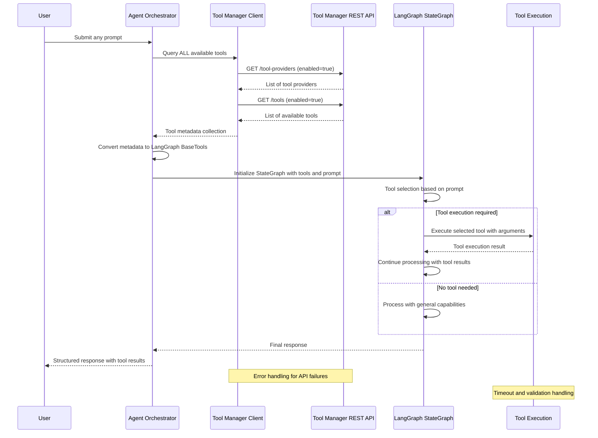

# Feature Specification: Agent Orchestrator Tool Manager Integration

**Feature Branch**: `020-agentic-task-execution`  
**Created**: 2025-12-11  
**Status**: Draft  
**Input**: User description: "020-agentic-task-execution"

## User Scenarios & Testing

### Primary User Story
The Agent Orchestrator needs to access and utilize tools from the Tool Manager during agent invocations. When users submit prompts, the orchestrator should:
1. Query the Tool Manager for all available and enabled tools (no prompt-based filtering)
2. Provide complete tool metadata to LangGraph StateGraph for LLM-based tool selection and execution
3. Allow LangGraph StateGraph to handle tool selection, execution, and result processing
4. Return structured results back to the user

### Acceptance Scenarios
1. **Given** the Tool Manager has registered tool providers with enabled tools, **When** a user submits a prompt requiring tool execution, **Then** the orchestrator should discover available tools and provide them to LangGraph StateGraph for appropriate usage
2. **Given** the orchestrator receives any user prompt, **When** all enabled tools are retrieved and provided to LangGraph, **Then** LangGraph StateGraph should select appropriate tools and return the results through the orchestrator
3. **Given** a tool execution fails due to network or configuration issues, **When** LangGraph StateGraph attempts tool calling, **Then** it should handle the error gracefully and provide meaningful feedback through the orchestrator
4. **Given** no suitable tools are available for a user's request, **When** LangGraph StateGraph processes the prompt, **Then** it should respond using its general capabilities without tool calling

### Edge Cases
- What happens when the Tool Manager API is unavailable during orchestration?
- How does the system handle tools that become disabled between discovery and LangGraph StateGraph execution?
- What occurs when tool execution times out or returns invalid responses during LangGraph StateGraph processing?
- How does LangGraph StateGraph behave when multiple tools could potentially fulfill the same request?

## Requirements

### Functional Requirements
- **FR-001**: System MUST provide access to available tools for discovery and execution
- **FR-002**: Agent Orchestrator MUST retrieve ALL available and enabled tools dynamically on every user request (no prompt-based filtering of tools)
- **FR-003**: System MUST make tools accessible for agent execution
- **FR-004**: Agent Orchestrator MUST support tool calling capabilities during agent invocations
- **FR-005**: System MUST support passing input parameters from user prompts to tool execution
- **FR-006**: System MUST handle tool execution results and return structured responses to users
- **FR-007**: System MUST provide robust error handling for tool discovery failures, execution failures, and timeout scenarios, including updating failed tool status appropriately
- **FR-008**: System MUST log basic tool invocation events for troubleshooting (comprehensive metrics deferred to future iteration)
- **FR-009**: System MUST support configuration for tool access, credentials, and retry logic for reliable operation
- **FR-010**: System MUST validate that tools are still enabled before attempting execution
- **FR-011**: System implementation does not need to address performance metrics, scale targets, or response time requirements (deferred to future iterations)

### Key Entities
- **Tool Manager Client**: HTTP client wrapper for Tool Manager REST API endpoints, providing standardized request/response handling
- **Tool Metadata**: Structured representation of tool definitions including name, description, parameters, and availability status  
- **LangGraph BaseTools**: Tool adapters that convert Tool Manager metadata into executable LangGraph tools
- **Tool Execution Context**: Runtime context containing prompt information, user session, and tool selection criteria
- **Tool Execution Result**: Structured response from tool execution including output data, status, and error information

## Clarifications

### Session 2025-12-11
- Q: When tool filtering occurs (enabled vs disabled tools), should this happen once during Agent Orchestrator initialization or dynamically on every user request? → A: Every request - always query for current enabled status
- Q: What should happen when a tool that was available during discovery becomes disabled or unavailable by the time LangGraph attempts to execute it? → A: Fail gracefully - continue without tool, inform user, and update tool's status to ERROR with refresh_error field via Tool Manager client
- Q: When multiple tools could potentially fulfill the same user request, how should LangGraph/Agent Orchestrator determine which tool to use? → A: Tool selection is handled by LangGraph's LLM-based decision making, not by our system - we only filter by enabled status
- Q: What timeout values should be used for Tool Manager client API calls to prevent blocking orchestration workflows? → A: Use retry_with_backoff utility
- Q: Since LangGraph handles tool execution, should the Agent Orchestrator capture and log tool invocation metrics for monitoring purposes? → A: Out of scope for this iteration - future need for comprehensive metrics

### Session 2025-12-15
- Q: Does the orchestrator choose which tools may be needed for specific prompts? → A: No - orchestrator retrieves all enabled tools for all prompts
- Q: What are the expected performance and scale requirements for tool discovery and execution? → A: All performance metrics are a future concern and not part of this feature

### Clarification Taxonomy Resolution

```mermaid
graph TD
    A[Clarification Categories] --> B[Functional Scope & Behavior]
    A --> C[Domain & Data Model]
    A --> D[Interaction & UX Flow]
    A --> E[Non-Functional Quality]
    A --> F[Integration & Dependencies]
    A --> G[Edge Cases & Failure Handling]
    A --> H[Constraints & Tradeoffs]

    B --> B1[RESOLVED: Tool filtering strategy]
    B --> B2[RESOLVED: Tool selection delegation to LangGraph]

    C --> C1[CLEAR: Tool metadata structure defined]
    C --> C2[CLEAR: Client-server data model established]

    D --> D1[CLEAR: User interaction flow documented]
    D --> D2[CLEAR: Error state handling specified]

    E --> E1[RESOLVED: Timeout/retry using existing utility]
    E --> E2[DEFERRED: Comprehensive metrics to future iteration]

    F --> F1[CLEAR: Tool Manager REST API integration]
    F --> F2[CLEAR: LangGraph framework integration]

    G --> G1[RESOLVED: Tool execution failure handling]
    G --> G2[CLEAR: API unavailability scenarios]

    H --> H1[CLEAR: Scope boundaries established]
    H --> H2[CLEAR: Future iteration dependencies noted]

    style B1 fill:#90EE90
    style B2 fill:#90EE90
    style E1 fill:#90EE90
    style G1 fill:#90EE90
    style E2 fill:#FFA500
```

## Integration Flow Diagram

---

## Review & Acceptance Checklist

### Content Quality
- [x] No implementation details (languages, frameworks, APIs)
- [x] Focused on user value and business needs
- [x] Written for non-technical stakeholders
- [x] All mandatory sections completed

### Requirement Completeness
- [x] No [NEEDS CLARIFICATION] markers remain
- [x] Requirements are testable and unambiguous  
- [x] Success criteria are measurable
- [x] Scope is clearly bounded
- [x] Dependencies and assumptions identified

---

## Execution Status

- [x] User description parsed
- [x] Key concepts extracted
- [x] Ambiguities marked
- [x] User scenarios defined
- [x] Requirements generated
- [x] Entities identified
- [x] Review checklist passed
