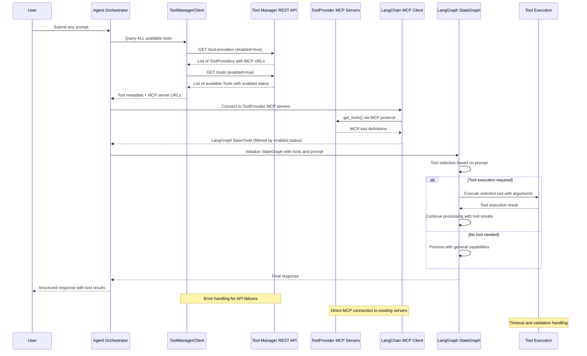

# Feature Specification: Agent Orchestrator Tool Manager Integration

**Feature Branch**: `020-agentic-task-execution`  
**Created**: 2025-12-11  
**Status**: Draft  
**Input**: User description: "020-agentic-task-execution"

## User Scenarios & Testing

### Primary User Story
The Agent Orchestrator needs to access and utilize tools from the Tool Manager during agent invocations. When users submit prompts, the orchestrator should:
1. Query the Tool Manager for all available and enabled tools (no prompt-based filtering)
2. Provide complete tool metadata to LangGraph StateGraph for LLM-based tool selection and execution
3. Allow LangGraph StateGraph to handle tool selection, execution, and result processing
4. Return structured results back to the user

### Acceptance Scenarios
1. **Given** the Tool Manager has registered tool providers with enabled tools, **When** a user submits a prompt requiring tool execution, **Then** the orchestrator should discover available tools and provide them to LangGraph StateGraph for appropriate usage
2. **Given** the orchestrator receives any user prompt, **When** all enabled tools are retrieved and provided to LangGraph, **Then** LangGraph StateGraph should select appropriate tools and return the results through the orchestrator
3. **Given** a tool execution fails due to network or configuration issues, **When** LangGraph StateGraph attempts tool calling, **Then** it should handle the error gracefully and provide meaningful feedback through the orchestrator
4. **Given** no suitable tools are available for a user's request, **When** LangGraph StateGraph processes the prompt, **Then** it should respond using its general capabilities without tool calling

### Edge Cases
- **EC-001**: WHEN Tool Manager API is unavailable during orchestration, THEN system MUST retry with exponential backoff for up to 30 seconds then, if still unavailable, continue without tools and log the unavailability
- **EC-002**: WHEN tools become unavailable between discovery and LangGraph StateGraph execution, THEN system MUST detect the unavailable state, gracefully continue without the tool, and inform user with specific messaging
- **EC-003**: WHEN tool execution times out (>30s) or returns invalid responses during LangGraph StateGraph processing, THEN system MUST cancel execution, update tool status to ERROR, and return structured error response to user
- **EC-004**: WHEN multiple tools could potentially fulfill the same request, THEN LangGraph StateGraph MUST use LLM-based decision making to select appropriate tool without system intervention beyond enabled status filtering

## Requirements

### Functional Requirements
- **FR-001**: Agent Orchestrator MUST dynamically retrieve ALL enabled tools on every user request (enabled=true AND status=AVAILABLE), validating enabled status before discovery and execution (no prompt-based filtering of tools)
- **FR-002**: System MUST make enabled tools accessible for agent execution through LangGraph StateGraph integration
- **FR-003**: Agent Orchestrator MUST support tool calling capabilities during agent invocations
- **FR-004**: System MUST support passing input parameters from user prompts to tool execution
- **FR-005**: System MUST handle tool execution results, return structured responses to users with defined schema (status: success|error|timeout, data: execution results, metadata: tool_id|duration|timestamp, error: structured error details), and log tool invocation events including: execution start (tool name, arguments), completion (duration, success/failure), errors (details, stack trace), and status updates to Tool Manager
- **FR-006**: System MUST provide robust error handling for specific scenarios: (1) Tool Manager API unavailable - retry with exponential backoff up to 30 seconds and if still unavailable continue without tools, (2) Tool execution timeout or failure - capture error details and update tool status to ERROR with refresh_error field containing structured error message (error_code, description, timestamp, context), (4) Tool unavailable between discovery and execution - gracefully continue without tool and inform user
- **FR-007**: System MUST support configuration for tool access, credentials, retry logic, and timeout values for reliable operation
- **FR-008**: System implementation does not need to address performance metrics, scale targets, or response time requirements (deferred to future iterations)
- **FR-009**: When tool execution fails during agent invocation, system MUST implement retry-then-disable workflow: (1) Retry tool execution up to 3 times with exponential backoff, (2) On persistent failure set enabled=False and status=MISSING (if tool removed from MCP server) or ERROR (if execution/network failure), (3) Update refresh_error field with structured failure details including error type, timestamp, and context, (4) Continue agent workflow gracefully without the failed tool and inform user of tool unavailability

### Key Entities
- **ToolManagerClient**: HTTP client wrapper for Tool Manager REST API endpoints, providing standardized request/response handling
- **Tool Metadata**: Structured representation of tool definitions including name, description, parameters, and availability status  
- **LangGraph BaseTools**: LangChain-generated executable tools created from ToolProvider MCP servers using LangChain's native MCP client support for LangGraph StateGraph execution
- **Tool Execution Context**: Runtime context containing prompt information, user session, and tool selection criteria
- **Tool Execution Result**: Structured response from tool execution including output data, status, and error information

## Clarifications

### Session 2025-12-11
- Q: When tool filtering occurs (enabled vs disabled tools), should this happen once during Agent Orchestrator initialization or dynamically on every user request? → A: Every request - always query for current enabled status
- Q: What should happen when a tool that was available during discovery becomes disabled or unavailable by the time LangGraph attempts to execute it? → A: Fail gracefully - continue without tool, inform user, and update tool's status to ERROR with refresh_error field via ToolManagerClient
- Q: When multiple tools could potentially fulfill the same user request, how should LangGraph/Agent Orchestrator determine which tool to use? → A: Tool selection is handled by LangGraph's LLM-based decision making, not by our system - we only filter by enabled status
- Q: What timeout values should be used for ToolManagerClient API calls to prevent blocking orchestration workflows? → A: Use retry_with_backoff utility
- Q: Since LangGraph handles tool execution, should the Agent Orchestrator capture and log tool invocation metrics for monitoring purposes? → A: Out of scope for this iteration - future need for comprehensive metrics

### Session 2025-12-15
- Q: Does the orchestrator choose which tools may be needed for specific prompts? → A: No - orchestrator retrieves all enabled tools for all prompts
- Q: What are the expected performance and scale requirements for tool discovery and execution? → A: All performance metrics are a future concern and not part of this feature

### Session 2025-12-19
- Q: The current tasks assume custom tool adaptation, but your vision uses LangChain's native MCP support. This requires clarification on the Tool Manager's interface: → A: ToolProviders already have MCP server URLs in their MCPConfiguration - LangChain MCP client connects directly to existing ToolProvider MCP servers

### Clarification Taxonomy Resolution

```mermaid
graph TD
    A[Clarification Categories] --> B[Functional Scope & Behavior]
    A --> C[Domain & Data Model]
    A --> D[Interaction & UX Flow]
    A --> E[Non-Functional Quality]
    A --> F[Integration & Dependencies]
    A --> G[Edge Cases & Failure Handling]
    A --> H[Constraints & Tradeoffs]

    B --> B1[RESOLVED: Tool filtering strategy]
    B --> B2[RESOLVED: Tool selection delegation to LangGraph]

    C --> C1[CLEAR: Tool metadata structure defined]
    C --> C2[CLEAR: Client-server data model established]

    D --> D1[CLEAR: User interaction flow documented]
    D --> D2[CLEAR: Error state handling specified]

    E --> E1[RESOLVED: Timeout/retry using existing utility]
    E --> E2[DEFERRED: Comprehensive metrics to future iteration]

    F --> F1[CLEAR: Tool Manager REST API integration]
    F --> F2[CLEAR: LangGraph framework integration]

    G --> G1[RESOLVED: Tool execution failure handling]
    G --> G2[CLEAR: API unavailability scenarios]

    H --> H1[CLEAR: Scope boundaries established]
    H --> H2[CLEAR: Future iteration dependencies noted]

    style B1 fill:#90EE90
    style B2 fill:#90EE90
    style E1 fill:#90EE90
    style G1 fill:#90EE90
    style E2 fill:#FFA500
```

## Integration Flow Diagram

---

## Review & Acceptance Checklist

### Content Quality
- [x] No implementation details (languages, frameworks, APIs)
- [x] Focused on user value and business needs
- [x] Written for non-technical stakeholders
- [x] All mandatory sections completed

### Requirement Completeness
- [x] No [NEEDS CLARIFICATION] markers remain
- [x] Requirements are testable and unambiguous  
- [x] Success criteria are measurable
- [x] Scope is clearly bounded
- [x] Dependencies and assumptions identified

---

## Execution Status

- [x] User description parsed
- [x] Key concepts extracted
- [x] Ambiguities marked
- [x] User scenarios defined
- [x] Requirements generated
- [x] Entities identified
- [x] Review checklist passed
