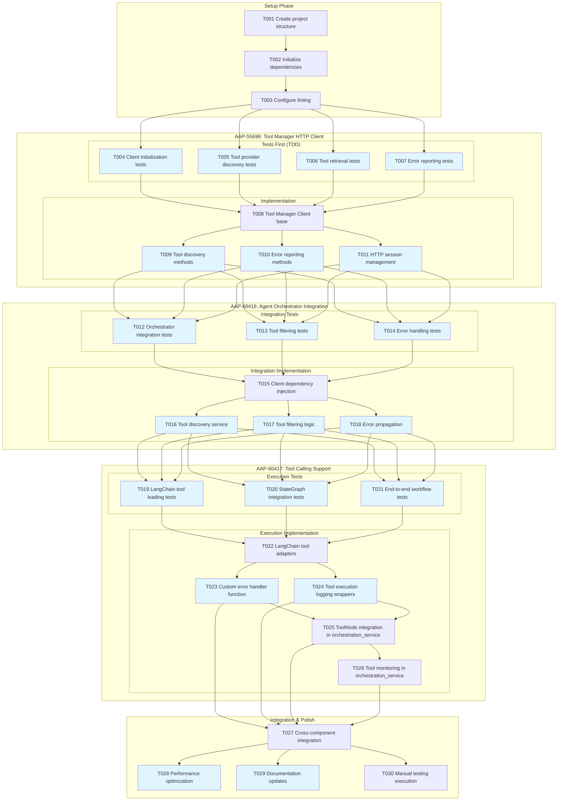

# Tasks: Agent Orchestrator Tool Manager Integration

**Input**: Design documents from `/specs/020-agentic-task-execution/`
**Prerequisites**: plan.md, research.md, data-model.md, quickstart.md

## Task Dependencies Visualization



## Format: `[ID] [P?] Description`
- **[P]**: Can run in parallel (different files, no dependencies)
- Include exact file paths in descriptions

## Phase 3.1: Setup

- [ ] T001 Create project structure for tool_manager package in src/nexus/agent_orchestrator/tool_manager/
- [ ] T002 Initialize Python dependencies: httpx, retry_with_backoff integration
- [ ] T003 [P] Configure linting and formatting tools for tool_manager package

## Phase 3.2: AAP-55696: Tool Manager HTTP Client - Tests First (TDD) ⚠️ MUST COMPLETE BEFORE IMPLEMENTATION

**CRITICAL: These tests MUST be written and MUST FAIL before ANY implementation**

- [ ] T004 [P] Client initialization tests in tests/unit/agent_orchestrator/tool_manager/test_client_init.py
- [ ] T005 [P] Tool provider discovery tests in tests/unit/agent_orchestrator/tool_manager/test_tool_discovery.py
- [ ] T006 [P] Tool retrieval and filtering tests in tests/unit/agent_orchestrator/tool_manager/test_tool_retrieval.py
- [ ] T007 [P] Error reporting and status update tests including refresh_error field updates for FR-006 in tests/unit/agent_orchestrator/tool_manager/test_error_reporting.py

## Phase 3.3: AAP-55696: Tool Manager HTTP Client Implementation (ONLY after tests are failing)

**Architecture Reminders**:
- **TDD Compliance**: Write tests first, ensure they fail before implementation (RED-GREEN-REFACTOR cycle mandatory)
- Apply DRY principle - extract reusable functions/classes
- Follow SOLID principles - single responsibility per class
- Use dependency injection - inject dependencies via constructors
- Prefer composition over inheritance
- Maintain clear separation of concerns
- **Use SQLModel for all data models** - unified models for database tables and API schemas
- **Error Handling**: Use ToolNode's built-in handle_tool_errors parameter with custom function (per research.md decision)

**API Specification Reminders**:
- Document all REST APIs with OpenAPI spec (latest version)
- Use snake_case for all API spec names (parameters, properties, schemas)
- All endpoints must follow path pattern: /api/v1/[component]/[resource]
- Implement RFC 9457 Problem Details for error responses

- [ ] T008 Tool Manager Client base class in src/nexus/agent_orchestrator/tool_manager/client.py
- [ ] T009 [P] Tool provider discovery methods (get_enabled_tool_providers) in src/nexus/agent_orchestrator/tool_manager/client.py
- [ ] T010 [P] Tool retrieval methods (get_enabled_tools) and error status update with refresh_error field for FR-006 in src/nexus/agent_orchestrator/tool_manager/client.py
- [ ] T011 [P] Error reporting methods (update_tool_status) and HTTP session management with exponential backoff retry for Tool Manager API unavailability (FR-006) in src/nexus/agent_orchestrator/tool_manager/client.py

## Phase 3.4: AAP-60416: Agent Orchestrator Integration - Tests First

- [ ] T012 [P] Orchestrator Tool Manager client integration tests in tests/integration/agent_orchestrator/test_tool_manager_integration.py
- [ ] T013 [P] Tool filtering and enablement tests in tests/integration/agent_orchestrator/test_tool_filtering.py
- [ ] T014 [P] Client error handling and propagation tests in tests/integration/agent_orchestrator/test_error_handling.py

## Phase 3.5: AAP-60416: Agent Orchestrator Integration Implementation

- [ ] T015 Tool Manager client dependency injection in src/nexus/agent_orchestrator/orchestrator.py
- [ ] T016 [P] Tool discovery service integration in src/nexus/agent_orchestrator/tool_manager/discovery.py
- [ ] T017 [P] Tool filtering by enabled status logic in src/nexus/agent_orchestrator/tool_manager/filtering.py
- [ ] T018 [P] Error propagation and handling middleware in src/nexus/agent_orchestrator/tool_manager/error_handler.py
- [ ] T018b [P] Tool enablement validation middleware - check tools remain enabled between discovery and execution, gracefully handle disabled tools in src/nexus/agent_orchestrator/tool_manager/enablement_validator.py

## Phase 3.6: AAP-60417: Tool Calling Support - Tests First

- [ ] T019 [P] LangChain tool loading integration tests in tests/integration/agent_orchestrator/test_langchain_integration.py
- [ ] T020 [P] StateGraph tool registration tests in tests/integration/agent_orchestrator/test_stategraph_integration.py
- [ ] T021 [P] End-to-end tool execution workflow tests in tests/integration/agent_orchestrator/test_tool_execution_workflow.py

## Phase 3.7: AAP-60417: Tool Calling Support Implementation

- [ ] T022 LangChain tool loading and BaseTool conversion in src/nexus/agent_orchestrator/tool_manager/langchain_adapter.py
- [ ] T023 [P] Custom error handler function for tool execution monitoring with 30-second timeout enforcement in src/nexus/agent_orchestrator/tool_manager/tool_error_handler.py
- [ ] T024 [P] Tool execution logging wrapper functions (wrap_tool_call/awrap_tool_call) with timeout tracking for FR-007 in src/nexus/agent_orchestrator/tool_manager/tool_execution_logging.py
- [ ] T025 Add ToolNode to existing StateGraph with tool discovery and error handler integration, using logging wrappers from tool_manager module in src/nexus/agent_orchestrator/services/orchestration_service.py
- [ ] T026 Integrate tool execution monitoring with existing streaming infrastructure in src/nexus/agent_orchestrator/services/orchestration_service.py

## Phase 3.8: Integration & Polish

- [ ] T027 Cross-component integration and dependency wiring in src/nexus/agent_orchestrator/__init__.py
- [ ] T028 [P] Performance optimization and connection pooling in src/nexus/agent_orchestrator/tool_manager/client.py
- [ ] T029 [P] Update documentation: docs/api.md and README.md with Tool Manager integration
- [ ] T030 Execute manual testing scenarios from quickstart.md

## Dependencies

**Cross-JIRA Dependencies**:
- Tests (T004-T007) before AAP-55696 implementation (T008-T011)
- AAP-55696 completion (T011) before AAP-60416 tests (T012-T014)
- AAP-60416 completion (T018) before AAP-60417 tests (T019-T021)
- All core implementation before integration (T026)

**Within-JIRA Dependencies**:
- T008 blocks T009, T010, T011 (client base before methods)
- T015 blocks T016, T017, T018, T018b (injection before usage)
- T022 blocks T023, T024 (adapter before integration)
- T023, T024 block T025 (error handler and logging before ToolNode integration)
- T025 blocks T026 (ToolNode before monitoring integration)
- T025 and T026 modify same file (orchestration_service.py) - must be sequential

**Integration Dependencies**:
- T026 blocks T027 (tool monitoring before cross-component integration)
- T027 blocks T028, T029, T030 (integration before optimization)

## Parallel Execution Examples

### AAP-55696 Test Phase (T004-T007):
```
Task: "Client initialization tests in tests/unit/agent_orchestrator/tool_manager/test_client_init.py"
Task: "Tool provider discovery tests in tests/unit/agent_orchestrator/tool_manager/test_tool_discovery.py"
Task: "Tool retrieval and filtering tests in tests/unit/agent_orchestrator/tool_manager/test_tool_retrieval.py"
Task: "Error reporting and status update tests in tests/unit/agent_orchestrator/tool_manager/test_error_reporting.py"
```

### AAP-55696 Implementation Phase (T009-T011):
```
Task: "Tool provider discovery methods (get_enabled_tool_providers) in src/nexus/agent_orchestrator/tool_manager/client.py"
Task: "Tool retrieval methods (get_enabled_tools) in src/nexus/agent_orchestrator/tool_manager/client.py"
Task: "Error reporting methods (update_tool_status) and HTTP session management in src/nexus/agent_orchestrator/tool_manager/client.py"
```

### AAP-60417 Implementation Phase (T023-T026):
```
Task: "Custom error handler function for tool execution monitoring in src/nexus/agent_orchestrator/tool_manager/tool_error_handler.py"
Task: "Tool execution logging wrapper functions (wrap_tool_call/awrap_tool_call) for FR-008 in src/nexus/agent_orchestrator/tool_manager/tool_execution_logging.py"
Task: "Add ToolNode to existing StateGraph with tool discovery and error handler integration, using logging wrappers from tool_manager module in src/nexus/agent_orchestrator/services/orchestration_service.py"
Task: "Integrate tool execution monitoring with existing streaming infrastructure in src/nexus/agent_orchestrator/services/orchestration_service.py"
```

## Notes

- [P] tasks = different files, no dependencies within same JIRA section
- Verify tests fail before implementing corresponding functionality
- Follow TDD strictly: Tests → Implementation → Integration
- Commit after completing each JIRA section
- Use retry_with_backoff utility for all Tool Manager API calls
- Maintain backward compatibility with existing StateGraph workflows

## Task Generation Rules Applied

1. **From JIRAs**: Each JIRA becomes a major section with setup → tests → implementation flow
2. **From Data Model**: Tool Manager Client component → client creation and method tasks
3. **From Integration Points**: Agent Orchestrator integration → dependency injection and service tasks
4. **From Tool Execution**: LangGraph StateGraph integration → adapter and execution tasks
5. **Ordering**: Setup → JIRA sections in dependency order → Integration → Polish
6. **Dependencies**: Cross-JIRA blocking, within-JIRA method dependencies

## Validation Checklist
*GATE: Checked before implementation*

- [x] All JIRAs have corresponding test and implementation tasks
- [x] All integration points have explicit tasks
- [x] All tests come before implementation (TDD compliance)
- [x] Parallel tasks truly independent (different files)
- [x] Each task specifies exact file path
- [x] No task modifies same file as another [P] task
- [x] Cross-JIRA dependencies clearly documented
- [x] All FR-006 error scenarios have explicit task coverage
- [x] Tool Manager API integration follows established patterns

## JIRA Feature Coverage

### AAP-55696: Tool Manager HTTP Client
**Tasks**: T004-T011 (8 tasks)
- ✅ Client library wraps Tool Manager REST API endpoints
- ✅ Standardized request/response handling using ToolProviderWithConfiguration and ToolWithParameters
- ✅ retry_with_backoff integration for timeout/retry logic
- ✅ Configuration for API endpoints and credentials

### AAP-60416: Agent Orchestrator Integration
**Tasks**: T012-T018 (7 tasks)
- ✅ Orchestrator uses client for tool discovery during invocations
- ✅ Runtime identification of enabled tools per request
- ✅ Error handling for missing providers/disabled tools
- ✅ API configuration support

### AAP-60417: Tool Calling Support
**Tasks**: T019-T025 (7 tasks)
- ✅ LangGraph configured with filtered tools from LangChain
- ✅ End-to-end tool calling workflow within invocations
- ✅ Input arguments from prompt context
- ✅ Tool execution handled by LangGraph StateGraph
- ✅ Error handling and status reporting to Tool Manager
