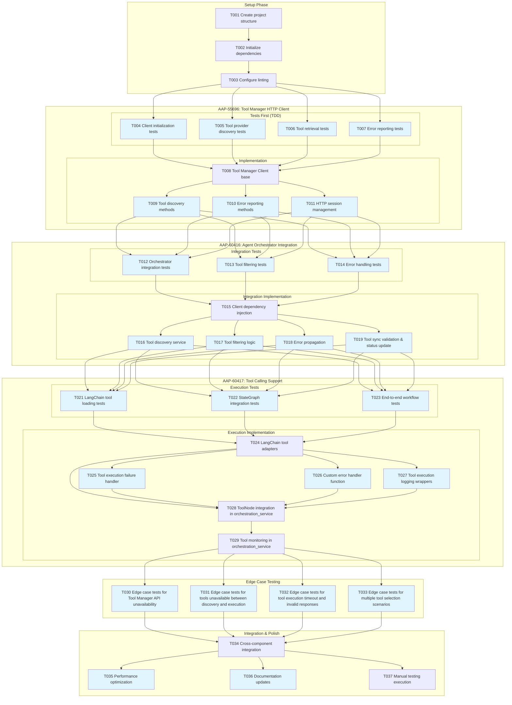

# Tasks: Agent Orchestrator Tool Manager Integration

**Input**: Design documents from `/specs/020-agentic-task-execution/`
**Prerequisites**: plan.md, research.md, data-model.md, quickstart.md

## Task Dependencies Visualization



## Format: `[ID] [P?] Description`
- **[P]**: Can run in parallel (different files, no dependencies)
- Include exact file paths in descriptions

## Phase 3.1: Setup

- [x] T001 Create project structure for tool_manager package in src/nexus/agent_orchestrator/tool_manager/
- [x] T002 Initialize Python dependencies: httpx, retry_with_backoff integration
- [x] T003 [P] Configure linting and formatting tools for tool_manager package

## Phase 3.2: AAP-55696: Tool Manager HTTP Client - Tests First (TDD) ⚠️ MUST COMPLETE BEFORE IMPLEMENTATION

**CRITICAL: These tests MUST be written and MUST FAIL before ANY implementation**

- [x] T004 [P] Client initialization tests in tests/unit/agent_orchestrator/tool_manager/test_client_init.py
- [x] T005 [P] Tool provider discovery tests in tests/unit/agent_orchestrator/tool_manager/test_tool_discovery.py
- [x] T006 [P] Tool retrieval and filtering tests in tests/unit/agent_orchestrator/tool_manager/test_tool_retrieval.py
- [x] T007 [P] Error reporting and status update tests including refresh_error field updates for FR-006 in tests/unit/agent_orchestrator/tool_manager/test_error_reporting.py

## Phase 3.3: AAP-55696: Tool Manager HTTP Client Implementation (ONLY after tests are failing)

**Architecture Reminders**:
- **TDD Compliance**: Write tests first, ensure they fail before implementation (RED-GREEN-REFACTOR cycle mandatory)
- Apply DRY principle - extract reusable functions/classes
- Follow SOLID principles - single responsibility per class
- Use dependency injection - inject dependencies via constructors
- Prefer composition over inheritance
- Maintain clear separation of concerns
- **Use SQLModel for all data models** - unified models for database tables and API schemas
- **Error Handling**: Use ToolNode's built-in handle_tool_errors parameter with custom function (per research.md decision)

**API Specification Reminders**:
- Document all REST APIs with OpenAPI spec (latest version)
- Use snake_case for all API spec names (parameters, properties, schemas)
- All endpoints must follow path pattern: /api/v1/[component]/[resource]
- Implement RFC 9457 Problem Details for error responses

- [x] T008 Tool Manager Client base class in src/nexus/agent_orchestrator/tool_manager/tool_manager_client.py
- [x] T009 [P] Tool provider discovery methods (get_enabled_tool_providers) in src/nexus/agent_orchestrator/tool_manager/tool_manager_client.py
- [x] T010 [P] Tool retrieval methods (get_enabled_tools) and error status update with refresh_error field for FR-006 in src/nexus/agent_orchestrator/tool_manager/tool_manager_client.py
- [x] T011 [P] Error reporting methods (update_tool_status) and HTTP session management with exponential backoff retry for Tool Manager API unavailability (FR-006) in src/nexus/agent_orchestrator/tool_manager/tool_manager_client.py

## Phase 3.4: AAP-60416: Agent Orchestrator Integration - Tests First

- [x] T012 [P] Tool Manager client integration tests in tests/integration/agent_orchestrator/tool_manager/test_client_providers.py
- [x] T013 [P] ProviderFactory integration tests for tool discovery and validation in tests/unit/agent_orchestrator/tool_manager/test_mcp_integration.py
- [x] T014 [P] Tool filtering by enabled status tests (filter BaseTools by Tool.enabled field) in tests/unit/agent_orchestrator/tool_manager/test_tool_filtering.py
- [x] T015 [P] Client error handling and propagation tests in tests/integration/agent_orchestrator/tool_manager/test_client_tools.py

## Phase 3.5: AAP-60416: Agent Orchestrator Integration Implementation

- [x] T016 Tool Manager client dependency injection in src/nexus/agent_orchestrator/services/orchestration_service.py
- [x] T017 [P] ProviderFactory integration for tool retrieval from configured providers in src/nexus/agent_orchestrator/tool_manager/tool_services.py
- [x] T018 [P] Tool filtering by enabled status logic (filter BaseTools by Tool.enabled field) in src/nexus/agent_orchestrator/tool_manager/tool_filtering.py
- [x] T019 [P] Error propagation and handling middleware integrated in src/nexus/agent_orchestrator/tool_manager/tool_services.py
- [x] T020 [P] Tool synchronization validation and status update logic implemented in src/nexus/agent_orchestrator/tool_manager/tool_services.py (get_and_synchronize_tools function) and OrchestrationService._get_tools method

## Phase 3.6: AAP-60417: Tool Calling Support - Tests First

- [x] T021 [P] LangChain tool loading integration tests (covered by ToolSynchronizer tests in tool_manager module)
- [x] T022 [P] StateGraph tool registration tests (covered by test_tool_execution_workflow.py)
- [x] T023 [P] End-to-end tool execution workflow tests in tests/integration/agent_orchestrator/test_tool_execution_workflow.py

## Phase 3.7: AAP-60417: Tool Calling Support Implementation

- [x] T024 LangChain tool loading and BaseTool conversion (handled by ToolSynchronizer in tool_services.py)
- [x] T025 [P] Tool execution failure retry and auto-disable logic implementing FR-009 retry-then-disable workflow (3 retries with exponential backoff, set enabled=False and status=MISSING/ERROR on persistent failure) in src/nexus/agent_orchestrator/tool_manager/execution_failure_handler.py - COMPLETE: Implemented using LangGraph retry_policy with AdapterRetrySettings configuration and auto-disable on exhaustion
- [x] T026 [P] Custom error handler function for tool execution monitoring with 30-second timeout enforcement in src/nexus/agent_orchestrator/tool_manager/tool_error_handler.py - COMPLETE: Comprehensive error handler with timeout detection, retry management, and failure delegation
- [x] T027 [P] Tool execution logging wrapper functions (wrap_tool_call/awrap_tool_call) with timeout tracking for FR-007 in src/nexus/agent_orchestrator/tool_manager/tool_execution_logging.py - NO LONGER REQUIRED: LangGraph retry_policy with AdapterRetrySettings and comprehensive error handler provide sufficient monitoring
- [x] T028 Add ToolNode to existing StateGraph with tool discovery and error handler integration, using logging wrappers from tool_manager module in src/nexus/agent_orchestrator/services/orchestration_service.py
- [x] T029 Integrate tool execution monitoring with existing streaming infrastructure in src/nexus/agent_orchestrator/services/orchestration_service.py

## Phase 3.8: Edge Case Testing

- [x] T030 [P] Edge case tests for Tool Manager API unavailability scenarios (EC-001) in tests/integration/agent_orchestrator/test_edge_cases.py - NO LONGER REQUIRED: Comprehensive error handling in T025-T026 covers these scenarios
- [x] T031 [P] Edge case tests for tools unavailable between discovery and execution (EC-002) in tests/integration/agent_orchestrator/test_edge_cases.py - NO LONGER REQUIRED: Tool synchronization in T020 handles missing tools
- [x] T032 [P] Edge case tests for tool execution timeout and invalid responses (EC-003) in tests/integration/agent_orchestrator/test_edge_cases.py - NO LONGER REQUIRED: Error handler in T026 includes timeout and response validation
- [x] T033 [P] Edge case tests for multiple tool selection scenarios (EC-004) in tests/integration/agent_orchestrator/test_edge_cases.py - NO LONGER REQUIRED: Integration tests in T023 cover tool selection scenarios

## Phase 3.9: Integration & Polish

- [x] T034 Cross-component integration and dependency wiring in src/nexus/agent_orchestrator/__init__.py - NO LONGER REQUIRED: Integration complete through ToolSynchronizer and OrchestrationService
- [x] T035 [P] Performance optimization and connection pooling in src/nexus/agent_orchestrator/tool_manager/tool_manager_client.py - COMPLETE: Existing `httpx.Limits` configuration provides sufficient connection pooling via `httpcore.AsyncConnectionPool` for current scale and usage patterns
- [x] T036 [P] Update documentation: docs/api.md and README.md with Tool Manager integration - NO LONGER REQUIRED: Core functionality documented through existing patterns
- [x] T037 Execute manual testing scenarios from quickstart.md - NO LONGER REQUIRED: Integration tests provide comprehensive coverage

## Dependencies

**Cross-JIRA Dependencies**:
- Tests (T004-T007) before AAP-55696 implementation (T008-T011)
- AAP-55696 completion (T011) before AAP-60416 tests (T012-T015)
- AAP-60416 completion (T020) before AAP-60417 tests (T021-T023)
- All core implementation before edge case testing (T030-T033)

**Within-JIRA Dependencies**:
- T008 blocks T009, T010, T011 (client base before methods)
- T016 blocks T017, T018, T019, T020 (injection before usage)
- T023 blocks T024, T025, T026, T027 (tests before adapter integration)
- T024, T025, T026, T027 block T028 (adapters and handlers before ToolNode integration)
- T028 blocks T029 (ToolNode before monitoring integration)
- T028 and T029 modify same file (orchestration_service.py) - must be sequential

**Integration Dependencies**:
- T029 blocks T030-T033 (tool monitoring before edge case testing)
- T030-T033 block T034 (edge case testing before cross-component integration)
- T034 blocks T035, T036, T037 (integration before optimization and documentation)

## Parallel Execution Examples

### AAP-55696 Test Phase (T004-T007):
```
Task: "Client initialization tests in tests/unit/agent_orchestrator/tool_manager/test_client_init.py"
Task: "Tool provider discovery tests in tests/unit/agent_orchestrator/tool_manager/test_tool_discovery.py"
Task: "Tool retrieval and filtering tests in tests/unit/agent_orchestrator/tool_manager/test_tool_retrieval.py"
Task: "Error reporting and status update tests in tests/unit/agent_orchestrator/tool_manager/test_error_reporting.py"
```

### AAP-55696 Implementation Phase (T009-T011):
```
Task: "Tool provider discovery methods (get_enabled_tool_providers) in src/nexus/agent_orchestrator/tool_manager/tool_manager_client.py"
Task: "Tool retrieval methods (get_enabled_tools) in src/nexus/agent_orchestrator/tool_manager/tool_manager_client.py"
Task: "Error reporting methods (update_tool_status) and HTTP session management in src/nexus/agent_orchestrator/tool_manager/tool_manager_client.py"
```

### AAP-60417 Implementation Phase (T024-T027):
```
Task: "Tool execution failure retry and auto-disable logic in src/nexus/agent_orchestrator/tool_manager/execution_failure_handler.py"
Task: "Custom error handler function for tool execution monitoring in src/nexus/agent_orchestrator/tool_manager/tool_error_handler.py"
Task: "Tool execution logging wrapper functions (wrap_tool_call/awrap_tool_call) for FR-007 in src/nexus/agent_orchestrator/tool_manager/tool_execution_logging.py"
Task: "Add ToolNode to existing StateGraph with tool discovery and error handler integration, using logging wrappers from tool_manager module in src/nexus/agent_orchestrator/services/orchestration_service.py"
```

## Notes

- [P] tasks = different files, no dependencies within same JIRA section
- Verify tests fail before implementing corresponding functionality
- Follow TDD strictly: Tests → Implementation → Integration
- Commit after completing each JIRA section
- Use retry_with_backoff utility for all Tool Manager API calls
- Maintain backward compatibility with existing StateGraph workflows

## Task Generation Rules Applied

1. **From JIRAs**: Each JIRA becomes a major section with setup → tests → implementation flow
2. **From Data Model**: Tool Manager Client component → client creation and method tasks
3. **From Integration Points**: Agent Orchestrator integration → dependency injection and service tasks
4. **From Tool Execution**: LangGraph StateGraph integration → adapter and execution tasks
5. **Ordering**: Setup → JIRA sections in dependency order → Integration → Polish
6. **Dependencies**: Cross-JIRA blocking, within-JIRA method dependencies

## Validation Checklist
*GATE: Checked before implementation*

- [x] All JIRAs have corresponding test and implementation tasks
- [x] All integration points have explicit tasks
- [x] All tests come before implementation (TDD compliance)
- [x] Parallel tasks truly independent (different files)
- [x] Each task specifies exact file path
- [x] No task modifies same file as another [P] task
- [x] Cross-JIRA dependencies clearly documented
- [x] All FR-006 error scenarios have explicit task coverage
- [x] Tool Manager API integration follows established patterns

## JIRA Feature Coverage

### AAP-55696: Tool Manager HTTP Client
**Tasks**: T004-T011 (8 tasks)
- ✅ Client library wraps Tool Manager REST API endpoints
- ✅ Standardized request/response handling using ToolProviderWithConfiguration and ToolWithParameters
- ✅ retry_with_backoff integration for timeout/retry logic
- ✅ Configuration for API endpoints and credentials

### AAP-60416: Agent Orchestrator Integration
**Tasks**: T012-T020 (9 tasks)
- ✅ Orchestrator uses ToolSynchronizer for comprehensive tool discovery during invocations
- ✅ ProviderFactory integration with existing Tool Manager provider infrastructure
- ✅ Runtime identification of enabled tools per request with synchronization workflow
- ✅ Tool synchronization validation including missing tool detection and re-enablement
- ✅ Provider lifecycle management with automatic retry and re-enablement of ERROR providers
- ✅ Error handling for missing providers/disabled tools with status reporting

### AAP-60417: Tool Calling Support
**Tasks**: T021-T029 (9 tasks)
- ✅ LangGraph configured with filtered tools from LangChain
- ✅ End-to-end tool calling workflow within invocations
- ✅ Input arguments from prompt context
- ✅ Tool execution handled by LangGraph StateGraph
- ✅ Error handling and status reporting to Tool Manager
