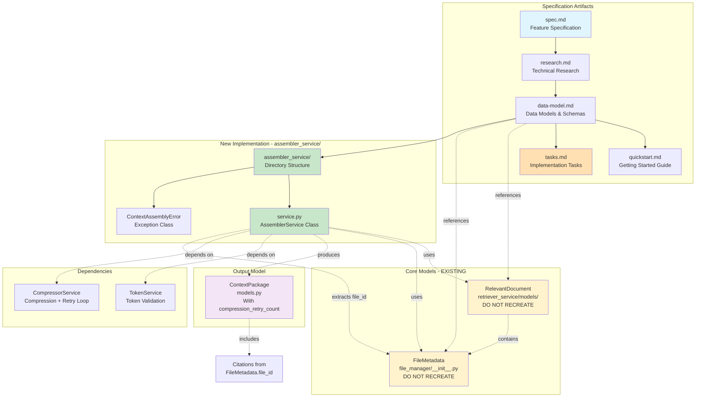

# Implementation Plan: Context Assembly for Multi-Agent System

**Branch**: `017-context-assembler` | **Date**: 2025-12-10 | **Updated**: 2025-12-12 | **Spec**: [specs/021-context-assembly/spec.md](spec.md)
**Input**: Feature specification from `specs/021-context-assembly/spec.md`

## Execution Flow (/plan command scope)
```
1. Load feature spec from Input path ✓
   → Spec loaded successfully with clarifications
2. Fill Technical Context ✓
   → Internal service, Python 3.12, Pydantic (in-memory models), no API endpoints
3. Fill the Constitution Check section ✓
4. Evaluate Constitution Check section
   → All checks pass - internal service follows existing patterns
5. Execute Phase 0 → research.md ✓
6. Execute Phase 1 → data-model.md, quickstart.md ✓
7. Re-evaluate Constitution Check section
   → Design complies with all constitutional requirements
8. Plan Phase 2 → Describe task generation approach ✓
9. STOP - Ready for /tasks command
```

## Summary

The AssemblerService is an internal service component within the Context Manager (located in `assembler_service/service.py`) that receives RelevantDocuments from the existing retriever model, manages token budget through TokenService, implements a compression retry loop (controlled by compression_loop parameter, relies on LLM non-determinism for variation), and merges document content into structured ContextPackage objects for LLM workflow consumption. The service extracts citations from FileMetadata.file_id attributes for unambiguous source identification (avoiding filename ambiguity), computes grounding scores as simple averages of relevancy scores, and handles comprehensive error scenarios including exhausted compression retries.

**Scope**: AssemblerService focuses solely on assembling RelevantDocuments into ContextPackage - System Prompts and User Prompts are handled elsewhere in the workflow.

**Technical Approach**: Implement as internal Python service in separate `assembler_service/` directory following existing context_manager patterns, using existing RelevantDocument and FileMetadata models, implementing compression retry loop (same "greedy" strategy, LLM non-determinism provides variation), extracting citations from FileMetadata.file_id (unique identifier preventing ambiguity when filenames repeat), and using Pydantic BaseModel for ContextPackage (in-memory only, no database persistence).

## Technical Context

**Language/Version**: Python 3.12
**Primary Dependencies**: Pydantic (data models), existing TokenService, existing CompressorService, existing TokenCalculator
**Storage**: ContextPackage is in-memory only (not persisted to database)
**Testing**: pytest with unit tests, integration tests with mocked dependencies
**Target Platform**: Linux server (same as existing Context Manager components)
**Project Type**: Single project (internal service within existing monolith)
**Performance Goals**: Assembly operations must complete quickly to avoid delaying LLM invocation workflow (<100ms for typical cases)
**Constraints**:
  - No API endpoints (internal service only)
  - Must follow existing context_manager component patterns
  - Service location: separate `assembler_service/` directory with `service.py` implementation
  - Use existing RelevantDocument model (do not recreate)
  - Use existing FileMetadata model for citations (file_id attribute for unambiguous identification)
  - Token budget enforcement with validation after each compression retry
  - Compression retry loop with progressively aggressive strategies (controlled by compression_loop parameter)
  - Deterministic and reproducible grounding score computation
  - ContextPackage is Pydantic BaseModel only (no database persistence)
  - Focus on document assembly only (no System/User Prompt handling)
**Scale/Scope**: Handles multiple RelevantDocuments per assembly request, processes within context of single invocation workflow, supports 0-N compression retries

## Constitution Check
*GATE: Must pass before Phase 0 research. Re-check after Phase 1 design.*

### Technology Standards Compliance
- [x] **Pydantic for Data Models**: ContextPackage uses Pydantic BaseModel (in-memory only, no database persistence)

### Code Architecture Compliance
- [x] **DRY Principle**: Reuses existing TokenService and CompressorService, avoids duplication
- [x] **SOLID Principles**:
  - Single Responsibility: AssemblerService handles only assembly logic
  - Open/Closed: Extensible for new content types without modification
  - Liskov Substitution: N/A (internal service, not part of inheritance hierarchy)
  - Interface Segregation: Clean interface with single assemble() method
  - Dependency Injection: TokenService and CompressorService injected via constructor
- [x] **Separation of Concerns**: Clear boundaries between token validation, compression, assembly, and package building
- [x] **Dependency Injection**: Dependencies (TokenService, CompressorService) explicitly injected
- [x] **Composition vs Inheritance**: Uses composition to integrate TokenService and CompressorService; no inheritance needed (ContextPackage is pure Pydantic model)

### API Specification Standards Compliance
- [x] **OpenAPI/AsyncAPI Compliance**: N/A - internal service with no API endpoints
- [x] **Naming Convention**: N/A - no API
- [x] **Documentation Completeness**: N/A - no API
- [x] **RFC 9457 Error Format**: N/A - internal service (uses Python exceptions)
- [x] **Error Message Safety**: Error messages (ContextAssemblyError) are clear and don't expose internals
- [x] **API Versioning**: N/A - no API
- [x] **API Path Structure**: N/A - no API
- [x] **Pagination Support**: N/A - no API
- [x] **Filtering/Sorting Consistency**: N/A - no API
- [x] **Security Documentation**: N/A - no API
- [x] **Schema Compatibility**: N/A - no API (internal service interface may evolve with internal versioning)

## Project Structure

### Documentation (this feature)
```
specs/021-context-assembly/
├── plan.md              # This file
├── research.md          # Phase 0 output
├── data-model.md        # Phase 1 output
├── quickstart.md        # Phase 1 output
└── tasks.md             # Phase 2 output (/tasks command)
```

### Source Code (repository root)
```
src/nexus/agent_orchestrator/context_manager/
├── assembler_service/               # NEW: Separate directory for assembler
│   ├── __init__.py                 # Service exports
│   └── service.py                   # AssemblerService implementation
├── retriever_service/               # Existing: Contains RelevantDocument model
│   └── models/
│       └── relevant_document.py     # Existing RelevantDocument model (DO NOT RECREATE)
├── file_manager/                    # Existing: Contains FileMetadata model
│   └── __init__.py                 # Exports FileMetadata model
├── models.py                        # ContextPackage Pydantic model (already exists)
├── compressor.py                    # CompressorService (existing dependency)
└── planner.py                       # ContextManagerPlanner (orchestrator)

tests/unit/agent_orchestrator/context_manager/
└── test_assembler_service.py        # Unit tests for AssemblerService

tests/integration/agent_orchestrator/context_manager/
└── test_assembler_integration.py    # Integration tests
```

**Structure Decision**: Option 1 (Single project) - Internal service within existing monolith
**Key Architectural Change**: AssemblerService in separate `assembler_service/` directory to match other context manager service patterns

## Phase 0: Outline & Research

### Research Areas

Based on the feature specification, all technical decisions are clear with no NEEDS CLARIFICATION remaining after the clarification session. However, we need to research existing patterns and implementations:

1. **Existing Context Manager Patterns**
   - **Decision**: Follow patterns from CompressorService and RetrieverService
   - **Rationale**: Maintain consistency across context_manager components
   - **Research Focus**: Review existing service implementations for constructor injection, error handling, logging patterns

2. **Grounding Score Computation**
   - **Decision**: Simple average (arithmetic mean) of all relevancy_score values
   - **Rationale**: Clarified in Session 2025-12-10 - equal weight to all documents
   - **Implementation**: `sum(doc.relevancy_score for doc in documents) / len(documents)`
   - **Edge Cases**: Handle empty list (return 0.0), filter out None/invalid scores

3. **Token Budget Management**
   - **Decision**: Two-stage validation using existing TokenService
   - **Rationale**: Validate before compression attempt, validate after compression
   - **Pattern**: Exception-driven flow using TokenLimitExceededError
   - **Research Focus**: Review TokenService interface and TokenLimitExceededError implementation

4. **Exception Hierarchy**
   - **Decision**: Create ContextAssemblyError for post-compression failures
   - **Rationale**: Clear error signaling when compression insufficient
   - **Research Focus**: Review existing exception patterns in context_manager

5. **Citation Collection**
   - **Decision**: Collect file_id strings from RelevantDocument.file_metadata.file_id attributes
   - **Rationale**: Simple, unambiguous source identification using unique file_id
   - **Implementation**: Extract file_id from each document's file_metadata (compression does not generate new file_ids)

6. **Prompt Hierarchy Enforcement**
   - **Decision**: Organize payload sections as system → context → user
   - **Rationale**: LLM consumption requirement from JIRA AAP-58204
   - **Implementation**: OrderedDict or explicit section ordering in payload structure

**Output**: See research.md for detailed findings

## Phase 1: Design & Contracts

### Data Model (data-model.md)

**Primary Entity**: ContextPackage (already exists in models.py)
- Pydantic BaseModel (in-memory only, no database persistence)
- Fields: id, correlation_id, invocation_id, payload, grounding_score, citations, package_metadata
- Validation: grounding_score in range [0.0, 1.0]

**Supporting Models**:
- RelevantDocument (from RetrieverService) - input model
- TokenService interface - existing dependency
- CompressorService interface - existing dependency

**New Exception**:
- ContextAssemblyError (inherits from Exception) - raised when post-compression validation fails

### Service Interface

```python
class AssemblerService:
    def __init__(self, token_service: TokenService, compressor_service: CompressorService):
        """Initialize assembler with injected dependencies."""

    async def assemble(
        self,
        documents: list[RelevantDocument] | None,
        correlation_id: str,
        max_tokens: int,
        compression_loop: int
    ) -> ContextPackage:
        """
        Assemble RelevantDocuments into ContextPackage with compression retry loop.

        Args:
            documents: List of RelevantDocuments from retriever (uses existing model)
            correlation_id: Correlation ID for distributed tracing
            max_tokens: Maximum token budget for assembled context
            compression_loop: Maximum number of compression retry attempts (0 = no retries)

        Returns:
            ContextPackage with assembled document content, citations from FileMetadata.file_id,
            grounding score, and package metadata

        Raises:
            ContextAssemblyError: When token limits exceeded after all compression retries exhausted
            TokenServiceError: When TokenService unavailable
        """
```

### Contract Tests (No API endpoints)

Since this is an internal service with no API endpoints, contract tests are N/A. Instead, we focus on:

1. **Unit Tests**: Test AssemblerService methods in isolation with mocked dependencies
2. **Integration Tests**: Test interaction with TokenService and CompressorService
3. **Component Tests**: Test end-to-end assembly workflow from RelevantDocuments to ContextPackage

### Test Scenarios from User Stories

From spec.md Acceptance Scenarios (Updated 2025-12-12):

1. **Test**: Documents within token budget pass without compression
   - Input: RelevantDocuments with total tokens < max_tokens
   - Assert: No CompressorService call, valid ContextPackage returned

2. **Test**: Documents exceeding budget trigger compression with retry loop
   - Input: RelevantDocuments with total tokens > max_tokens, compression_loop > 0
   - Assert: CompressorService invoked multiple times (retry loop)

3. **Test**: Compressed content within budget proceeds successfully
   - Input: Documents → compression → tokens < max_tokens
   - Assert: Valid ContextPackage with compression_applied=true, compression_retry_count in metadata

4. **Test**: Compression retry loop increments retry_count
   - Input: Documents → compression fails → retry
   - Assert: retry_count increments with each retry attempt

5. **Test**: All compression retries exhausted raises error
   - Input: Documents → compression retries (compression_loop times) → tokens still > max_tokens
   - Assert: ContextAssemblyError raised after exhausting all retries

6. **Test**: compression_loop=0 fails immediately after first compression attempt
   - Input: Documents → compression → tokens still > max_tokens, compression_loop=0
   - Assert: ContextAssemblyError raised without retries

7. **Test**: Citations extracted from FileMetadata.file_id
   - Input: RelevantDocuments with file_metadata.file_id attributes
   - Assert: Citations list populated from FileMetadata.file_id in ContextPackage for unambiguous identification

8. **Test**: Grounding score computed as simple average
   - Input: 3 documents with relevancy_scores [0.8, 0.6, 0.9]
   - Assert: grounding_score = 0.7667 (average)

9. **Test**: Required fields present in output
   - Input: Valid assembly request
   - Assert: All ContextPackage fields populated (payload, grounding_score, citations, package_metadata)

10. **Test**: End-to-end with proper document assembly
   - Input: Full workflow with RelevantDocuments
   - Assert: Output includes assembled document content and citations from FileMetadata.file_id

11. **Test**: Package metadata includes compression retry count
   - Input: Documents requiring multiple compression retries
   - Assert: package_metadata.compression_retry_count reflects actual retries performed

### Agent File Update

Run agent context update:
```bash
.specify/scripts/bash/update-agent-context.sh claude
```

This will add Context Assembly implementation details to `CLAUDE.md` including:
- AssemblerService location and responsibilities
- Integration with TokenService and CompressorService
- Grounding score computation method
- Exception handling patterns

**Output**: data-model.md, failing tests (test_assembler.py, test_assembler_integration.py), quickstart.md, updated CLAUDE.md

## Phase 2: Task Planning Approach

*This section describes what the /tasks command will do - NOT executed during /plan*

### Task Generation Strategy

The /tasks command will load `.specify/templates/tasks-template.md` and generate tasks based on:

1. **From data-model.md** (Updated 2025-12-12):
   - Create ContextAssemblyError exception class [P]
   - Create assembler_service/ directory structure [P]
   - Validate RelevantDocument model exists (DO NOT recreate) [P]
   - Validate FileMetadata model exists (DO NOT recreate) [P]
   - Update ContextPackage model if needed (validate Pydantic BaseModel, no database persistence) [P]
   - Create AssemblerService class structure in service.py [P]

2. **From test scenarios** (Updated 2025-12-12):
   - Write unit test for token budget validation [P]
   - Write unit test for compression triggering with retry loop [P]
   - Write unit test for compression retry strategy progression [P]
   - Write unit test for compression_loop=0 behavior [P]
   - Write unit test for exhausted retries error handling [P]
   - Write unit test for grounding score computation [P]
   - Write unit test for citation extraction from FileMetadata.file_id [P]
   - Write unit test for empty/null input handling [P]
   - Write unit test for package_metadata compression_retry_count [P]
   - Write integration test for TokenService interaction
   - Write integration test for CompressorService retry loop interaction
   - Write integration test for post-retry exhaustion scenario

3. **Implementation tasks** (TDD: make tests pass):
   - Implement token usage tracking with TokenService
   - Implement compression decision logic with retry loop
   - Implement retry counter and strategy progression
   - Implement compression_loop parameter handling
   - Implement post-retry validation
   - Implement grounding score computation (simple average)
   - Implement citation extraction from FileMetadata.file_id
   - Implement document content organization (NO System/User Prompt handling)
   - Implement ContextPackage building
   - Implement error handling (ContextAssemblyError after retry exhaustion)
   - Implement correlation_id tracing
   - Implement package_metadata with compression_retry_count

4. **Integration tasks**:
   - Update ContextManagerPlanner to use new AssemblerService with compression_loop
   - Implement AssemblerService in assembler_service/service.py
   - Add logging statements for observability (including retry attempts)
   - Update package_metadata population with retry tracking

### Ordering Strategy

**Test-Driven Development Order**:
1. Exception classes first (dependencies)
2. Unit tests (parallel where possible)
3. Service implementation to make unit tests pass
4. Integration tests
5. Service refinement to make integration tests pass
6. Planner integration
7. End-to-end validation

**Dependency Order**:
- ContextAssemblyError before tests
- Unit tests before implementation
- Service implementation before integration
- All tests passing before planner integration

**Parallel Execution [P]**:
- Exception class creation
- Model updates
- Independent unit test files
- Documentation updates

### Estimated Output

Approximately 35-40 numbered, ordered tasks in tasks.md covering:
- Directory structure creation (1 task)
- Exception definition (1 task)
- Model validation (2 tasks - verify existing models)
- Model updates (1-2 tasks)
- Unit tests (11-13 tasks) - mostly parallel, includes retry loop tests
- Service implementation (10-12 tasks) - includes retry logic
- Integration tests (4-5 tasks) - includes retry scenarios
- Planner integration (2-3 tasks) - includes compression_loop parameter
- Documentation and cleanup (2-3 tasks)

**IMPORTANT**: This phase is executed by the /tasks command, NOT by /plan

## Implementation Architecture Diagram

The following diagram visualizes the implementation plan architecture, showing relationships between generated artifacts and the overall system design:



**Key Architectural Points**:
- **Reuse Existing Models**: RelevantDocument and FileMetadata are existing models - import and use, do not recreate
- **New Directory**: AssemblerService in separate `assembler_service/` directory following context_manager patterns
- **Citation Source**: Citations extracted from `FileMetadata.file_id` attribute for unambiguous source identification
- **Compression Retry**: Progressive retry loop controlled by `compression_loop` parameter
- **Scope**: Document assembly only - NO System/User Prompt handling

## Phase 3+: Future Implementation

*These phases are beyond the scope of the /plan command*

**Phase 3**: Task execution (/tasks command creates tasks.md)
**Phase 4**: Implementation (execute tasks.md following constitutional principles)
**Phase 5**: Validation (run tests, execute quickstart.md, ensure all acceptance scenarios pass)

## Complexity Tracking

*Fill ONLY if Constitution Check has violations that must be justified*

No violations identified. All constitutional requirements are met:
- Uses Pydantic for data models (in-memory only)
- Follows SOLID principles with dependency injection
- Internal service with no API endpoint requirements
- Maintains separation of concerns
- Uses composition over inheritance

| Violation | Why Needed | Simpler Alternative Rejected Because |
|-----------|------------|-------------------------------------|
| N/A | N/A | N/A |

## Planner Integration

**ContextManagerPlanner Updates (2025-12-17)**:

The planner orchestrator has been updated to integrate with the new AssemblerService implementation:

**Changes Made**:
1. **Import Updates**:
   - Changed from `from .assembler import AssemblerService` to `from .assembler_service import AssemblerService`
   - Added `from .token_validation import TokenValidationService` for dependency injection

2. **Workflow Simplification**:
   - Updated docstring from 3-phase to 2-phase workflow:
     - Phase 1: Retrieval (find relevant documents)
     - Phase 2: Assembly (create final context package with internal compression retry loop)
   - Removed Phase 2 compression block (lines 141-179) - now handled internally by AssemblerService

3. **Assembly Phase Update**:
   - Get `max_tokens` from `settings.context_manager_max_total_tokens`
   - Get `compression_loop` from `settings.context_manager_compression_loop` (default: 3)
   - Inject dependencies:
     - `TokenValidationService()` for token budget validation
     - `CompressorService()` via factory for compression operations
   - Call assembler with new signature:
     ```python
     context_package = await assembler.assemble(
         documents=retrieved_docs,
         correlation_id=correlation_id,
         max_tokens=max_tokens,
         compression_loop=compression_loop,
     )
     ```
   - Return `ContextPackage` directly from assembler (no longer building new package in planner)

4. **Old Stub Removal**:
   - Deleted `src/nexus/agent_orchestrator/context_manager/assembler.py` stub
   - Old stub signature: `def assemble(sections, correlation_id) -> None`
   - New service signature: `async def assemble(documents, correlation_id, max_tokens, compression_loop) -> ContextPackage`

**Rationale**:
- AssemblerService now owns the complete assembly workflow including compression retry loop
- Planner's responsibility reduced to orchestrating retrieval and assembly phases
- Dependency injection allows proper testing and separation of concerns
- Configuration parameters (max_tokens, compression_loop) controlled via settings

**Testing**:
- Task T035: Verify planner passes compression_loop parameter correctly
- Task T035: Verify AssemblerService receives injected dependencies properly

## Progress Tracking

*This checklist is updated during execution flow*

**Phase Status**:
- [x] Phase 0: Research complete (/plan command)
- [x] Phase 1: Design complete (/plan command)
- [x] Phase 2: Task planning complete (/plan command - describe approach only)
- [ ] Phase 3: Tasks generated (/tasks command)
- [ ] Phase 4: Implementation complete
- [ ] Phase 5: Validation passed

**Gate Status**:
- [x] Initial Constitution Check: PASS
- [x] Post-Design Constitution Check: PASS
- [x] All NEEDS CLARIFICATION resolved (via /clarify session 2025-12-10)
- [x] Complexity deviations documented (none exist)

---
*Based on Constitution v1.2.0 - See `.specify/memory/constitution.md`*
