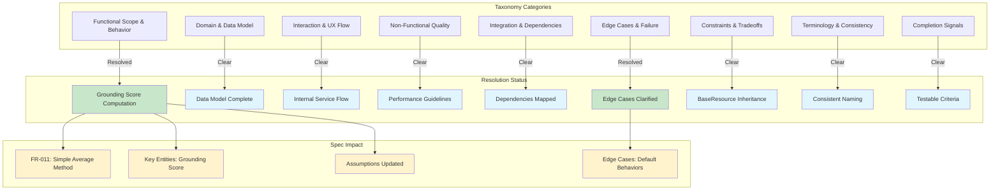
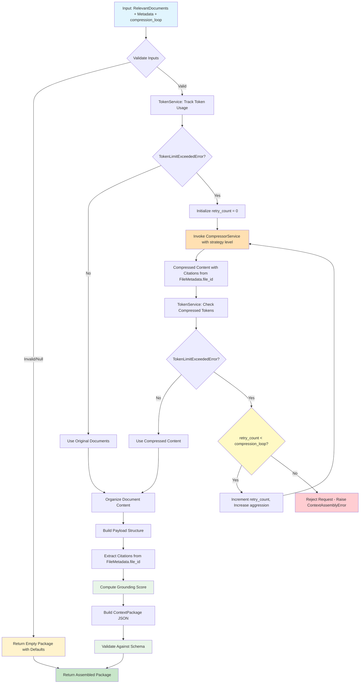
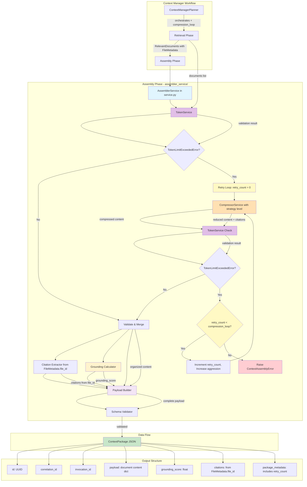

# Feature Specification: Context Assembly for Multi-Agent System

**Feature Branch**: `017-context-assembler`
**Created**: 2025-12-10
**Updated**: 2025-12-12
**Status**: Draft
**Service Type**: Internal service (no API endpoints)
**Location**: `src/nexus/agent_orchestrator/context_manager/assembler_service/`
**Input**: User description: "context-assembly Please use JIRA AAP-58204 and create specs, plans, tasks files in the directory specs/021-context-assembly please use the current branch and no performance checks have to implemented in the current run"

**JIRA Reference**: [AAP-58204](AAP-58204)

## Clarifications

### Session 2025-12-10
- Q: How should the grounding score be computed when combining multiple RelevantDocuments with different relevancy_score values? → A: Simple Average - Mean of all relevancy_score values (equal weight to all documents)

### Session 2025-12-12 - Architectural Updates
- **RelevantDocument Model**: Confirmed as existing Pydantic model at `src/nexus/agent_orchestrator/context_manager/retriever_service/models/relevant_document.py` - do not create new model
- **FileMetadata Model**: Confirmed as existing Pydantic model at `src/nexus/agent_orchestrator/context_manager/file_manager/__init__.py` - use file_id attribute for citations
- **AssemblerService Location**: Service must be in separate directory `src/nexus/agent_orchestrator/context_manager/assembler_service/` with implementation in `service.py`
- **Compression Retry Loop**: Added `compression_loop` parameter to control progressive compression retry attempts with increasingly aggressive strategies
- **Citations Source**: Citations are extracted from `RelevantDocument.file_metadata.file_id` (not filename, to avoid ambiguity when filenames repeat)
- **Scope Clarification**: AssemblerService only assembles RelevantDocuments into ContextPackage - System Prompts and User Prompts are handled elsewhere in the workflow

### Clarification Impact Analysis



## Execution Flow (main)
```
1. Parse user description from Input
   → JIRA AAP-58204: Assembler builds final context obj with LLM-ready output
   → Updates: Use existing models, FileMetadata.file_id citations, separate directory, retry loop
2. Extract key concepts from description
   → Actors: AssemblerService (in assembler_service/), ContextPackage, CompressorService, LLM consumer
   → Actions: receive documents from existing RelevantDocument model, check token usage, compress with retry loop if needed, extract citations from FileMetadata.file_id, merge document content, compute grounding score
   → Data: RelevantDocuments (existing model), FileMetadata (existing model), token counts, compression_loop parameter, citations from file_ids, grounding metrics
   → Constraints: token budget, compression retry limit, schema validation
3. For each unclear aspect:
   → Marked with [NEEDS CLARIFICATION] where needed (none identified)
4. Fill User Scenarios & Testing section
   → User flow: RelevantDocuments with FileMetadata → token check → compression retry loop (if needed) → assembled package with file_id citations → LLM consumption
5. Generate Functional Requirements
   → Each requirement is testable
6. Identify Key Entities
   → Including existing models (RelevantDocument, FileMetadata) and new parameters (compression_loop)
7. Run Review Checklist
   → Ready for planning
8. Return: SUCCESS (spec ready for planning)
```

---

## ⚡ Quick Guidelines
- Focus on WHAT users need and WHY
- Avoid HOW to implement (no tech stack, APIs, code structure)
- Written for business stakeholders, not developers
- **Note**: This is an internal service component, not a user-facing API

---

## User Scenarios & Testing *(mandatory)*

### Primary User Story
As a context manager planner orchestrating context workflow, after the retrieval phase completes, I need an assembler service (located in assembler_service/service.py) that receives RelevantDocuments from the existing retriever model, uses TokenService to track their token usage, invokes compression with progressive retry attempts (controlled by compression_loop parameter) when TokenLimitExceededError is raised, validates the compressed content fits within limits after each retry (rejecting the request with ContextAssemblyError only when all retries are exhausted), extracts citations from FileMetadata.file_id attributes, and then merges the document content and metadata into a structured ContextPackage JSON object so that the LLM workflow can consume properly formatted, grounded context with clear source attribution.

### Acceptance Scenarios
1. **Given** RelevantDocuments from the retrieval phase, **When** TokenService tracks their token usage and no TokenLimitExceededError is raised, **Then** documents pass through without compression and are merged into a valid ContextPackage JSON structure conforming to the defined schema
2. **Given** RelevantDocuments being tracked by TokenService, **When** TokenLimitExceededError is raised and compression_loop > 0, **Then** the compression service is invoked with progressively aggressive strategies to reduce content to fit within the token limit
3. **Given** compressed content from CompressorService, **When** TokenService checks the compressed token count and it fits within budget, **Then** the assembly proceeds successfully
4. **Given** compressed content that still exceeds token limit, **When** compression retries remain (compression_loop not exhausted), **Then** the system retries with a more aggressive compression strategy
5. **Given** compressed content that still exceeds token limit, **When** all compression retries are exhausted (compression_loop count reached), **Then** the request is rejected with ContextAssemblyError indicating compression was insufficient
6. **Given** RelevantDocuments with file_metadata, **When** assembling the context package, **Then** citations are extracted from FileMetadata.file_id attributes and included in the package for unambiguous traceability
7. **Given** content from RelevantDocuments (compressed or uncompressed), **When** computing grounding metrics, **Then** a grounding score (0.0-1.0) is calculated representing coverage and factual accuracy
8. **Given** assembled context package, **When** inspecting the output JSON, **Then** it contains all required fields: payload, grounding_score, citations, package_metadata
9. **Given** the full invocation workflow, **When** running end-to-end, **Then** the output includes proper citations from FileMetadata file_ids and assembled document content

### Edge Cases
- What happens when RelevantDocuments are None or empty? (Return default ContextPackage with grounding_score=0.0)
- What happens when compression_loop is set to 0? (No compression retries, fail immediately on first TokenLimitExceededError after compression)
- How does system handle when all compression_loop retries are exhausted? (Reject request with ContextAssemblyError)
- What occurs when grounding score cannot be computed from relevancy_score values? (Default to 0.0)
- What happens if some RelevantDocuments have missing or invalid relevancy_score values? (Exclude from average or treat as 0.0)
- What happens if FileMetadata.file_id is missing or null in RelevantDocuments? (Log warning and skip citation, or use document_id as fallback)
- What happens if multiple documents reference the same file? (file_id provides unique identification, avoiding ambiguity)
- What occurs when TokenService is unavailable or fails? (Fail assembly with appropriate error)
- How does the system respond when compression reduces content but TokenLimitExceededError is still raised? (Retry with more aggressive strategy up to compression_loop limit)

### Assembly Flow Diagram



## Requirements *(mandatory)*

### Functional Requirements
- **FR-001**: AssemblerService MUST accept interface `assemble(documents: list[RelevantDocument] | None, correlation_id: str, max_tokens: int, compression_loop: int) -> ContextPackage` that receives retrieved documents and compression retry configuration and produces structured output
- **FR-002**: System MUST use TokenService to track token usage of all RelevantDocuments and detect when TokenLimitExceededError is raised
- **FR-003**: System MUST invoke CompressorService when TokenService raises TokenLimitExceededError to reduce content size
- **FR-004**: System MUST use original RelevantDocument content when TokenService does not raise TokenLimitExceededError without invoking compression
- **FR-005**: System MUST use TokenService to verify compressed content token count after compression completes
- **FR-006**: System MUST implement compression retry loop that attempts progressively more aggressive compression strategies when TokenLimitExceededError persists after compression
- **FR-007**: System MUST track retry attempts using a counter that increments with each compression retry up to the compression_loop limit
- **FR-008**: System MUST select increasingly aggressive compression strategies with each retry (e.g., summarize → extract key points → aggressive truncation)
- **FR-009**: System MUST reject the request and raise ContextAssemblyError when TokenLimitExceededError persists after all compression_loop retries are exhausted
- **FR-010**: System MUST skip compression retries entirely when compression_loop is set to 0 and fail immediately on first TokenLimitExceededError after compression
- **FR-011**: System MUST validate ContextPackage structure against schema with required fields: id, correlation_id, payload, grounding_score, citations, package_metadata
- **FR-012**: System MUST merge document content (compressed or original) from RelevantDocuments into payload dictionary
- **FR-013**: System MUST extract file_id values from RelevantDocument.file_metadata.file_id attributes for complete source traceability and unambiguous file identification
- **FR-014**: System MUST compute grounding score (0.0-1.0 range) as the arithmetic mean of all RelevantDocument relevancy_score values when combining multiple documents into a single ContextPackage
- **FR-015**: System MUST populate package_metadata with timing information, token counts (original and final), session_id, compression status, compression retry count, and configuration used
- **FR-016**: System MUST handle null or empty RelevantDocuments gracefully by returning valid ContextPackage with default values
- **FR-017**: System MUST use correlation_id for distributed tracing throughout assembly process and include in package metadata
- **FR-018**: System MUST generate unique package ID for each assembled ContextPackage for tracking purposes
- **FR-019**: System MUST support integration with existing ContextManagerPlanner workflow receiving RelevantDocuments directly from RetrieverService
- **FR-020**: System MUST use ContextPackage as an in-memory Pydantic model only, without database persistence, as context packages are ephemeral and rebuilt on demand

### Non-Functional Requirements
- **NFR-001**: AssemblerService MUST be implemented as an internal service without API endpoints, following patterns used by other context manager components
- **NFR-002**: Assembly operations including TokenService checking and compression MUST complete quickly to avoid delaying LLM invocation workflow
- **NFR-003**: ContextPackage JSON structure MUST be LLM-compatible and easily consumable as prompt input
- **NFR-004**: Grounding score calculation MUST be deterministic and reproducible for the same input documents
- **NFR-005**: System MUST maintain data integrity ensuring citations accurately reference source documents whether compressed or not
- **NFR-006**: TokenService error handling MUST be reliable and provide clear error messages when limits are exceeded

### Success Criteria
- 100% of RelevantDocuments that pass TokenService validation without TokenLimitExceededError proceed without compression
- 100% of RelevantDocuments triggering TokenLimitExceededError invoke compression successfully with retry loop mechanism
- Compression retry loop successfully attempts progressively aggressive strategies up to compression_loop limit
- 100% of requests where compressed content still exceeds limits after all retries are rejected with ContextAssemblyError
- All assembled packages include citations extracted from RelevantDocument.file_metadata.file_id attributes
- file_id provides unambiguous citation identification even when filenames repeat
- Grounding scores are computed and fall within valid 0.0-1.0 range
- TokenService is used for all token validation checks both before and after each compression attempt
- Package metadata includes compression_retry_count tracking actual number of retry attempts made
- Assembly phase integrates seamlessly with retrieval phase receiving RelevantDocuments with FileMetadata references
- End-to-end invocation workflow produces assembled ContextPackage with document content and citations
- All edge cases (null input, TokenService failures, exhausted retries, missing file_ids) are handled gracefully with clear error messages

### Key Entities *(include if feature involves data)*
- **RelevantDocument**: Existing Pydantic model from `src/nexus/agent_orchestrator/context_manager/retriever_service/models/relevant_document.py` containing document content, file_metadata (with FileMetadata reference), relevancy_score, source_type, and retrieval_metadata
- **FileMetadata**: Existing Pydantic model from `src/nexus/agent_orchestrator/context_manager/file_manager/__init__.py` containing file_id (used for citations), filename, size_bytes, mime_type, file_path, status, and conversion metadata
- **ContextPackage**: Pydantic BaseModel representing final assembled context with fields: id, correlation_id, invocation_id, payload, grounding_score, citations, package_metadata (note: this is an in-memory model only, not persisted to database)
- **TokenService**: Service for tracking token usage and raising TokenLimitExceededError when limits are exceeded
- **TokenLimitExceededError**: Exception raised by TokenService when content exceeds token budget
- **ContextAssemblyError**: Exception raised when request must be rejected due to token limits even after all compression_loop retries are exhausted
- **compression_loop**: Integer parameter controlling maximum number of compression retry attempts with progressively aggressive strategies (0 = no retries)
- **Compression Strategy Progression**: Ordered sequence of compression approaches from conservative to aggressive applied across retry attempts
- **Payload**: Dictionary structure containing organized document content from RelevantDocuments
- **Citations**: List of file_id strings extracted from RelevantDocument.file_metadata.file_id attributes for unambiguous source traceability (avoids ambiguity when filenames repeat)
- **Grounding Score**: Float value (0.0-1.0) computed as the simple average (arithmetic mean) of individual RelevantDocument relevancy_score values when combining multiple documents
- **Package Metadata**: Dictionary containing timing_data, original_token_count, final_token_count, compression_applied boolean, compression_retry_count, session_id, and config_used
- **Token Budget**: Maximum allowable tokens (max_tokens parameter) for final assembled context output

### Assumptions
- AssemblerService is located in separate directory `src/nexus/agent_orchestrator/context_manager/assembler_service/` with implementation in `service.py`
- AssemblerService follows the same patterns as other context manager components (RetrieverService, CompressorService)
- RelevantDocument is an existing Pydantic model defined in `src/nexus/agent_orchestrator/context_manager/retriever_service/models/relevant_document.py`
- FileMetadata is an existing Pydantic model defined in `src/nexus/agent_orchestrator/context_manager/file_manager/__init__.py`
- RetrieverService provides RelevantDocuments with complete content, file_metadata containing FileMetadata instance, and individual relevancy_score values
- Each RelevantDocument contains a file_metadata attribute that references a FileMetadata instance with a file_id attribute
- Citations are extracted from RelevantDocument.file_metadata.file_id for unambiguous source attribution (file_id is unique, filename may repeat)
- TokenService is available and raises TokenLimitExceededError when content exceeds limits
- CompressorService is available for compression when TokenLimitExceededError is raised
- CompressorService supports multiple compression strategies/levels for progressive compression attempts
- ContextPackage Pydantic schema is defined in models.py as an in-memory model (not persisted to database)
- ContextPackage does NOT inherit from BaseResource as it is ephemeral and not stored in database
- ContextManagerPlanner orchestrates the assembly phase after retrieval and provides compression_loop parameter
- Grounding score is computed as simple average (arithmetic mean) of all RelevantDocument relevancy_score values
- Token budget is configured via settings (context_manager_max_total_tokens) and passed to assembler
- compression_loop count is provided by caller (ContextManagerPlanner or configuration)
- Each retry attempt uses progressively more aggressive compression strategy
- Citations are file_id strings extracted from RelevantDocument.file_metadata.file_id (compression does not generate new file_ids)
- TokenService failures and post-compression limit violations result in clear exceptions
- ContextAssemblyError is a defined exception type for assembly failures when all retries are exhausted
- No REST API routes or FastAPI endpoints are needed for AssemblerService

### Dependencies
- **RelevantDocument Model**: Existing Pydantic model at `src/nexus/agent_orchestrator/context_manager/retriever_service/models/relevant_document.py` (specs/015-retriever-framework)
- **FileMetadata Model**: Existing Pydantic model at `src/nexus/agent_orchestrator/context_manager/file_manager/__init__.py` providing file_id attribute for citations (specs/008-file-manager-upload)
- **RetrieverService**: Provides RelevantDocuments with content and file_metadata references (specs/015-retriever-framework)
- **CompressorService**: Invoked by assembler when TokenLimitExceededError is raised, supports multiple compression strategies (specs/019-context-compression)
- **TokenService**: Used for tracking token usage and raising TokenLimitExceededError (specs/012-token-counting)
- **ContextPackage Model**: SQLModel schema defining structure (src/nexus/agent_orchestrator/context_manager/models.py)
- **ContextManagerPlanner**: Orchestrator that invokes assembler with RelevantDocuments and compression_loop parameter from retrieval phase

---

## Architecture Overview



---

## Review & Acceptance Checklist
*GATE: Automated checks run during main() execution*

### Content Quality
- [x] No implementation details (languages, frameworks, APIs)
- [x] Focused on user value and business needs
- [x] Written for non-technical stakeholders
- [x] All mandatory sections completed

### Requirement Completeness
- [x] No [NEEDS CLARIFICATION] markers remain
- [x] Requirements are testable and unambiguous
- [x] Success criteria are measurable
- [x] Scope is clearly bounded
- [x] Dependencies and assumptions identified

---

## Execution Status
*Updated by main() during processing*

- [x] User description parsed
- [x] Key concepts extracted from JIRA AAP-58204
- [x] Ambiguities marked (none requiring clarification)
- [x] User scenarios defined
- [x] Requirements generated
- [x] Entities identified
- [x] Review checklist passed
- [x] Mermaid diagrams added per extension

---
