# Tasks: Context Assembly for Multi-Agent System

**Input**: Design documents from `/specs/021-context-assembly/`
**Prerequisites**: plan.md, research.md, data-model.md, quickstart.md
**Branch**: `017-context-assembler`
**Updated**: 2025-12-12

## Execution Flow
```
1. Load plan.md from feature directory ✓
   → Tech stack: Python 3.12, SQLModel, internal service (no API)
   → Dependencies: TokenService, CompressorService
   → Updated: assembler_service/ directory, compression_loop parameter
2. Load design documents ✓
   → data-model.md: ContextPackage, ContextAssemblyError, existing models (RelevantDocument, FileMetadata)
   → quickstart.md: Test scenarios + edge cases
   → research.md: Compression retry loop, citation from FileMetadata.file_id, no System/User Prompts
3. Generate tasks by category:
   → Setup: Directory structure, exception class, model validation
   → Tests: Unit tests (retry loop + document assembly), integration tests (retry scenarios)
   → Core: AssemblerService implementation with retry logic
   → Integration: Planner integration with compression_loop parameter
   → Polish: Code coverage, documentation
4. Task ordering:
   → Directory setup → Exception class → Unit tests → Implementation → Integration tests → Planner
5. Mark parallel tasks [P] for independent files
6. Validate: All test scenarios covered, TDD approach followed, existing models not recreated
```

## Format: `[ID] [P?] Description`
- **[P]**: Can run in parallel (different files, no dependencies)
- Include exact file paths in descriptions
- **CRITICAL**: Do NOT recreate RelevantDocument or FileMetadata models - they already exist

## Task Dependency Visualization

```mermaid
graph TD
    subgraph "Phase 1: Setup & Validation"
        T001[T001: Create assembler_service directory]
        T002[T002 P: Verify RelevantDocument exists]
        T003[T003 P: Verify FileMetadata exists]
        T004[T004: Create ContextAssemblyError]
        T005[T005: Verify ContextPackage model]
    end

    subgraph "Phase 2: Unit Tests - Core Logic TDD"
        T006[T006 P: Test grounding score computation]
        T007[T007 P: Test citation extraction from FileMetadata.file_id]
        T008[T008 P: Test empty/null documents]
        T009[T009 P: Test invalid relevancy scores]
        T010[T010 P: Test document content organization]
    end

    subgraph "Phase 3: Unit Tests - Retry Loop TDD"
        T011[T011 P: Test compression retry loop progression]
        T012[T012 P: Test compression_loop=0 behavior]
        T013[T013 P: Test exhausted retries error]
        T014[T014 P: Test retry strategy progression]
        T015[T015 P: Test package_metadata compression_retry_count]
    end

    subgraph "Phase 4: Core Implementation"
        T016[T016: Implement _compute_grounding_score]
        T017[T017: Implement _extract_citations from FileMetadata.file_id]
        T018[T018: Implement _build_payload document assembly]
        T019[T019: Implement _compress_with_retry loop]
    end

    subgraph "Phase 5: Assembly Logic Implementation"
        T020[T020: Implement token validation with retry]
        T021[T021: Implement compression decision logic]
        T022[T022: Implement retry counter tracking]
        T023[T023: Implement strategy progression]
        T024[T024: Implement error handling with retry_count]
        T025[T025: Implement main assemble method]
    end

    subgraph "Phase 6: Integration Tests"
        T026[T026 P: Test within budget no compression]
        T027[T027 P: Test compression trigger with retry]
        T028[T028 P: Test successful retry after first failure]
        T029[T029 P: Test multiple retry attempts]
        T030[T030 P: Test exhausted retries rejection]
        T031[T031 P: Test compression_loop=0 immediate failure]
        T032[T032 P: Test end-to-end with citations]
    end

    subgraph "Phase 7: Planner Integration"
        T033[T033: Add correlation_id logging with retry tracking]
        T034[T034: Update ContextManagerPlanner signature]
        T035[T035: Verify planner integration with compression_loop]
    end

    subgraph "Phase 8: Polish"
        T036[T036 P: Run all tests]
        T037[T037 P: Verify code coverage >90%]
        T038[T038 P: Execute quickstart validation]
        T039[T039: Update package_metadata with retry_count]
        T040[T040: Final review and cleanup]
    end

    T001 --> T004
    T002 --> T006
    T003 --> T007
    T004 --> T006
    T004 --> T007
    T004 --> T008
    T004 --> T009
    T004 --> T010
    T004 --> T011
    T004 --> T012
    T004 --> T013
    T004 --> T014
    T004 --> T015
    T005 --> T006

    T006 --> T016
    T007 --> T017
    T008 --> T018
    T010 --> T018
    T011 --> T019
    T012 --> T019
    T013 --> T019
    T014 --> T019

    T016 --> T025
    T017 --> T025
    T018 --> T025
    T019 --> T025
    T020 --> T025
    T021 --> T025
    T022 --> T025
    T023 --> T025
    T024 --> T025

    T025 --> T026
    T025 --> T027
    T025 --> T028
    T025 --> T029
    T025 --> T030
    T025 --> T031
    T025 --> T032

    T026 --> T033
    T027 --> T033
    T028 --> T033
    T029 --> T033
    T030 --> T033
    T031 --> T033
    T032 --> T033

    T033 --> T036
    T034 --> T035
    T035 --> T036

    style T001 fill:#e1f5fe
    style T004 fill:#e1f5fe
    style T006 fill:#fff3cd
    style T011 fill:#fff3cd
    style T016 fill:#c8e6c9
    style T019 fill:#c8e6c9
    style T025 fill:#c8e6c9
    style T026 fill:#ffe0b2
    style T033 fill:#f3e5f5
    style T040 fill:#d1c4e9
```



## Phase 3.1: Setup & Validation

**CRITICAL: Architectural Changes (2025-12-12)**
- Service location: `src/nexus/agent_orchestrator/context_manager/assembler_service/`
- RelevantDocument and FileMetadata models already exist - DO NOT RECREATE
- Compression retry loop with compression_loop parameter
- Citations from FileMetadata.file_id (unique identifier)
- NO System/User Prompt handling

- [ ] **T001** Create assembler_service directory structure
  - Create `src/nexus/agent_orchestrator/context_manager/assembler_service/` directory
  - Create `src/nexus/agent_orchestrator/context_manager/assembler_service/__init__.py` (exports AssemblerService)
  - Create `src/nexus/agent_orchestrator/context_manager/assembler_service/service.py` (empty file, will implement later)
  - File: Directory structure creation
  - Dependencies: None

- [ ] **T002** [P] Verify RelevantDocument model exists
  - Verify model exists at `src/nexus/agent_orchestrator/context_manager/retriever_service/models/relevant_document.py`
  - Read model definition to confirm it has: content, relevancy_score, file_metadata fields
  - Document import statement: `from nexus.agent_orchestrator.context_manager.retriever_service.models.relevant_document import RelevantDocument`
  - File: Verification task (no file creation)
  - Dependencies: None
  - **IMPORTANT**: DO NOT RECREATE this model - it already exists

- [ ] **T003** [P] Verify FileMetadata model exists
  - Verify model exists at `src/nexus/agent_orchestrator/context_manager/file_manager/__init__.py`
  - Read model definition to confirm it has: file_id, filename, size_bytes, mime_type fields
  - Document import statement: `from nexus.agent_orchestrator.context_manager.file_manager import FileMetadata`
  - File: Verification task (no file creation)
  - Dependencies: None
  - **IMPORTANT**: DO NOT RECREATE this model - it already exists

- [ ] **T004** Create ContextAssemblyError exception class
  - Create exception class in `src/nexus/agent_orchestrator/context_manager/assembler_service/service.py`
  - Include attributes: message, correlation_id, retry_count, original_exception
  - Add docstring explaining usage for exhausted compression retries
  - File: `src/nexus/agent_orchestrator/context_manager/assembler_service/service.py`
  - Dependencies: T001

- [ ] **T005** Verify ContextPackage model and update if needed
  - Verify ContextPackage in `src/nexus/agent_orchestrator/context_manager/models.py`
  - **Verify ContextPackage uses Pydantic BaseModel (FR-020 requirement)**
  - **Verify NO database persistence - in-memory only (FR-020 compliance)**
  - **Verify NO BaseResource inheritance - pure Pydantic model**
  - Ensure package_metadata description includes compression_retry_count
  - Ensure payload description is "Assembled document content from RelevantDocuments" (not System/User Prompts)
  - File: `src/nexus/agent_orchestrator/context_manager/models.py`
  - Dependencies: None

## Phase 3.2: Unit Tests - Core Logic (TDD) ⚠️ MUST COMPLETE BEFORE 3.4

**CRITICAL: These tests MUST be written and MUST FAIL before ANY core implementation**

- [ ] **T006** [P] Unit test: Grounding score computation
  - Test file: `tests/unit/agent_orchestrator/context_manager/test_assembler_service.py`
  - Test: `test_compute_grounding_score_simple_average`
  - Input: 3 RelevantDocuments with relevancy_scores [0.8, 0.6, 0.9]
  - Expected: grounding_score = 0.7667 (simple arithmetic mean)
  - Test: `test_compute_grounding_score_empty_list` → returns 0.0
  - Test: `test_compute_grounding_score_with_none_values` → excludes None from average
  - Dependencies: T002, T004, T005

- [ ] **T007** [P] Unit test: Citation extraction from FileMetadata.file_id
  - Test file: `tests/unit/agent_orchestrator/context_manager/test_assembler_service.py`
  - Test: `test_extract_citations_from_file_metadata_file_id`
  - Input: RelevantDocuments with file_metadata.file_id = ["file-uuid-1", "file-uuid-2"]
  - Expected: citations = ["file-uuid-1", "file-uuid-2"]
  - Test: `test_extract_citations_missing_file_id` → handles gracefully
  - Test: `test_extract_citations_null_file_metadata` → handles gracefully
  - Dependencies: T002, T003, T004
  - **IMPORTANT**: Citations come from FileMetadata.file_id (unique identifier), not filename

- [ ] **T008** [P] Unit test: Empty and null documents handling
  - Test file: `tests/unit/agent_orchestrator/context_manager/test_assembler_service.py`
  - Test: `test_assemble_empty_documents_list` → returns default ContextPackage with grounding_score=0.0
  - Test: `test_assemble_null_documents` → returns default ContextPackage
  - Expected: Valid ContextPackage with default values, no errors raised
  - Dependencies: T004

- [ ] **T009** [P] Unit test: Invalid relevancy scores handling
  - Test file: `tests/unit/agent_orchestrator/context_manager/test_assembler_service.py`
  - Test: `test_grounding_score_excludes_invalid_scores`
  - Input: Documents with relevancy_scores including None, < 0.0, > 1.0
  - Expected: Invalid scores excluded from average computation
  - Dependencies: T004

- [ ] **T010** [P] Unit test: Document content organization
  - Test file: `tests/unit/agent_orchestrator/context_manager/test_assembler_service.py`
  - Test: `test_build_payload_document_content`
  - Input: RelevantDocuments with content
  - Expected: Payload contains assembled document content
  - Test: `test_no_system_user_prompt_handling` → validates NO System/User Prompt sections
  - Dependencies: T004
  - **IMPORTANT**: Scope limited to document assembly only

## Phase 3.3: Unit Tests - Compression Retry Loop (TDD) ⚠️ MUST COMPLETE BEFORE 3.4

**CRITICAL: These tests for retry logic MUST be written and MUST FAIL before implementation**

- [ ] **T011** [P] Unit test: Compression retry loop
  - Test file: `tests/unit/agent_orchestrator/context_manager/test_assembler_service.py`
  - Test: `test_compression_retry_loop_progressive_strategies`
  - Input: Documents requiring multiple compression attempts, compression_loop=3
  - Mock: CompressorService returns compressed content strings
  - Expected: retry_count increments with each attempt
  - Verify: Compression retried up to compression_loop times
  - Dependencies: T004

- [ ] **T012** [P] Unit test: compression_loop=0 behavior
  - Test file: `tests/unit/agent_orchestrator/context_manager/test_assembler_service.py`
  - Test: `test_compression_loop_zero_no_retries`
  - Input: Documents exceeding budget, compression_loop=0
  - Expected: ContextAssemblyError raised immediately after first compression attempt fails
  - Verify: No retries attempted, retry_count=0 in error
  - Dependencies: T004

- [ ] **T013** [P] Unit test: Exhausted retries error handling
  - Test file: `tests/unit/agent_orchestrator/context_manager/test_assembler_service.py`
  - Test: `test_all_retries_exhausted_raises_error`
  - Input: Documents exceeding budget, compression_loop=3, all retries fail
  - Expected: ContextAssemblyError raised with retry_count=3
  - Verify: Error message includes retry count and correlation_id
  - Dependencies: T004

- [ ] **T014** [P] Unit test: Package metadata compression_retry_count
  - Test file: `tests/unit/agent_orchestrator/context_manager/test_assembler_service.py`
  - Test: `test_package_metadata_includes_retry_count`
  - Input: Documents requiring 2 compression retries
  - Expected: package_metadata.compression_retry_count = 2
  - Test: `test_no_compression_retry_count_zero` → compression_retry_count = 0
  - Dependencies: T004, T005

## Phase 3.4: Core Implementation (ONLY after tests T006-T014 are failing)

**Architecture Reminders**:
- Apply DRY principle - extract reusable functions/classes
- Follow SOLID principles - single responsibility per class
- Use dependency injection - inject dependencies via constructors
- Prefer composition over inheritance
- Maintain clear separation of concerns
- **Use Pydantic BaseModel for ContextPackage** - in-memory only, no database persistence
- **Import existing models** - DO NOT recreate RelevantDocument or FileMetadata

- [ ] **T015** Implement _compute_grounding_score method
  - File: `src/nexus/agent_orchestrator/context_manager/assembler_service/service.py`
  - Method: `_compute_grounding_score(documents: list[RelevantDocument]) -> float`
  - Logic: Simple arithmetic mean of relevancy_score values
  - Handle: Empty list (return 0.0), None values (exclude), invalid scores (exclude)
  - Make tests T006, T009 pass
  - Dependencies: T006, T009

- [ ] **T016** Implement _extract_citations method from FileMetadata.file_id
  - File: `src/nexus/agent_orchestrator/context_manager/assembler_service/service.py`
  - Method: `_extract_citations(documents: list[RelevantDocument]) -> list[str]`
  - Logic: Extract file_id from file_metadata.file_id attribute
  - Handle: Missing file_id gracefully (skip or log warning)
  - Make tests T007 pass
  - Dependencies: T007
  - **IMPORTANT**: Primary source is FileMetadata.file_id (unique identifier), not filename
  - **NOTE**: Compression does not generate new file_ids

- [ ] **T017** Implement _build_payload method for document content
  - File: `src/nexus/agent_orchestrator/context_manager/assembler_service/service.py`
  - Method: `_build_payload(documents: list[RelevantDocument], compression_applied: bool) -> dict[str, Any]`
  - Logic: Organize document content from RelevantDocuments
  - Make tests T008, T010 pass
  - Dependencies: T008, T010
  - **IMPORTANT**: NO System/User Prompt handling - document assembly only

- [ ] **T018** Implement _compress_with_retry loop method
  - File: `src/nexus/agent_orchestrator/context_manager/assembler_service/service.py`
  - Method: `_compress_with_retry(documents, max_tokens, compression_loop, correlation_id) -> tuple[Any, int]`
  - Logic:
    - Initialize retry_count = 0
    - Loop while retry_count < compression_loop
    - Call CompressorService.compress() with strategy="greedy"
    - Validate tokens after each attempt
    - Increment retry_count on failure
    - Raise ContextAssemblyError when all retries exhausted
  - Return: (compressed_content, retry_count)
  - Note: Retries use same strategy, relying on LLM non-determinism
  - Make tests T011, T012, T013 pass
  - Dependencies: T011, T012, T013

## Phase 3.5: Assembly Logic Implementation (Sequential - Same File)

- [ ] **T019** Implement token validation with retry support
  - File: `src/nexus/agent_orchestrator/context_manager/assembler_service/service.py`
  - Logic: Use TokenService.track_usage() for validation
  - Catch: TokenLimitExceededError to trigger compression retry
  - Dependencies: T019

- [ ] **T020** Implement compression decision logic
  - File: `src/nexus/agent_orchestrator/context_manager/assembler_service/service.py`
  - Logic: If TokenLimitExceededError raised, invoke _compress_with_retry
  - Handle: compression_loop parameter to control retry attempts
  - Dependencies: T019, T020

- [ ] **T021** Implement retry counter tracking
  - File: `src/nexus/agent_orchestrator/context_manager/assembler_service/service.py`
  - Logic: Track actual number of retry attempts made
  - Store: retry_count for package_metadata and error reporting
  - Dependencies: T019

- [ ] **T022** Implement error handling with retry_count
  - File: `src/nexus/agent_orchestrator/context_manager/assembler_service/service.py`
  - Logic: Raise ContextAssemblyError when all retries exhausted
  - Include: retry_count, correlation_id in exception
  - Handle: compression_loop=0 special case (immediate failure)
  - Dependencies: T018, T021

- [ ] **T023** Implement main assemble method
  - File: `src/nexus/agent_orchestrator/context_manager/assembler_service/service.py`
  - Signature: `async def assemble(documents, correlation_id, max_tokens, compression_loop, invocation_id) -> ContextPackage`
  - Orchestrate:
    1. Validate documents
    2. Try TokenService validation
    3. On TokenLimitExceededError → call _compress_with_retry
    4. Compute grounding score with _compute_grounding_score
    5. Extract citations with _extract_citations
    6. Build payload with _build_payload
    7. Build ContextPackage with package_metadata including compression_retry_count
  - Dependencies: T015, T016, T017, T018, T019, T020, T021, T022

## Phase 3.6: Integration Tests ⚠️ After Implementation Complete

- [ ] **T025** [P] Integration test: Within budget no compression flow
  - Test file: `tests/integration/agent_orchestrator/context_manager/test_assembler_integration.py`
  - Test: `test_assembly_within_budget_no_compression`
  - Setup: RelevantDocuments with total tokens < max_tokens
  - Verify: CompressorService NOT called, compression_applied=False, compression_retry_count=0
  - Dependencies: T025

- [ ] **T026** [P] Integration test: Compression trigger with retry
  - Test file: `tests/integration/agent_orchestrator/context_manager/test_assembler_integration.py`
  - Test: `test_compression_triggered_with_retry_loop`
  - Setup: RelevantDocuments exceeding budget, compression_loop=3
  - Verify: CompressorService called with progressive strategies
  - Dependencies: T025

- [ ] **T027** [P] Integration test: Successful retry after first failure
  - Test file: `tests/integration/agent_orchestrator/context_manager/test_assembler_integration.py`
  - Test: `test_successful_retry_after_first_failure`
  - Setup: First compression fails, second succeeds
  - Verify: compression_retry_count=1, compression_applied=True
  - Dependencies: T025

- [ ] **T028** [P] Integration test: Multiple retry attempts
  - Test file: `tests/integration/agent_orchestrator/context_manager/test_assembler_integration.py`
  - Test: `test_multiple_compression_retries`
  - Setup: First two compressions fail, third succeeds, compression_loop=3
  - Verify: compression_retry_count=2, increasingly aggressive strategies used
  - Dependencies: T025

- [ ] **T029** [P] Integration test: Exhausted retries rejection
  - Test file: `tests/integration/agent_orchestrator/context_manager/test_assembler_integration.py`
  - Test: `test_all_retries_exhausted_raises_error`
  - Setup: All compression attempts fail, compression_loop=3
  - Verify: ContextAssemblyError raised with retry_count=3
  - Dependencies: T025

- [ ] **T030** [P] Integration test: compression_loop=0 immediate failure
  - Test file: `tests/integration/agent_orchestrator/context_manager/test_assembler_integration.py`
  - Test: `test_compression_loop_zero_immediate_failure`
  - Setup: Documents exceed budget, compression_loop=0
  - Verify: ContextAssemblyError raised immediately, retry_count=0
  - Dependencies: T025

- [ ] **T031** [P] Integration test: End-to-end with citations from FileMetadata
  - Test file: `tests/integration/agent_orchestrator/context_manager/test_assembler_integration.py`
  - Test: `test_end_to_end_assembly_with_citations`
  - Setup: Full workflow with RelevantDocuments containing file_metadata
  - Verify: Citations extracted from FileMetadata.file_id, grounding_score computed, document content assembled
  - Dependencies: T025

## Phase 3.7: Planner Integration

- [ ] **T032** Add correlation_id logging with retry tracking
  - File: `src/nexus/agent_orchestrator/context_manager/assembler_service/service.py`
  - Add: Structured logging with correlation_id in all methods
  - Log: Retry attempts, strategy levels, token counts
  - Pattern: `logger.info("Compression retry attempt %d/%d", retry_count, compression_loop, extra={"correlation_id": correlation_id})`
  - Dependencies: T025, T026, T027, T028, T029, T030, T031, T032

- [x] **T033** Delete old assembler.py stub
  - File: `src/nexus/agent_orchestrator/context_manager/assembler.py`
  - Action: Delete old stub implementation that conflicts with new assembler_service/ directory
  - Reason: New implementation uses assembler_service/ directory structure with proper separation
  - Dependencies: T025
  - **COMPLETED**: Old stub file successfully deleted (verified: file does not exist)

- [x] **T034** Update ContextManagerPlanner integration
  - File: `src/nexus/agent_orchestrator/context_manager/planner.py`
  - Update imports: Change from `.assembler` to `.assembler_service`
  - Add import: `from .token_validation import TokenValidationService`
  - Update docstring: Change from 3-phase to 2-phase workflow (retrieve → assemble)
  - Remove: Phase 2 compression block (lines 141-179) - now handled by AssemblerService
  - Update assembly phase:
    - Get max_tokens and compression_loop from settings
    - Inject TokenValidationService and CompressorService into AssemblerService
    - Call `await assembler.assemble(documents=retrieved_docs, correlation_id, max_tokens, compression_loop)`
    - Return ContextPackage directly from assembler
  - Dependencies: T025, T033
  - **COMPLETED**: All integration updates verified in planner.py (imports, docstring, assembly phase implementation)

- [ ] **T035** Verify planner integration with compression_loop
  - Test file: `tests/integration/agent_orchestrator/context_manager/test_planner_integration.py`
  - Test: `test_planner_invokes_assembler_with_compression_loop`
  - Verify: Planner passes compression_loop parameter correctly
  - Verify: AssemblerService receives injected dependencies
  - Dependencies: T034

## Phase 3.8: Polish

- [ ] **T036** [P] Run all tests and verify passing
  - Command: `pytest tests/unit/agent_orchestrator/context_manager/test_assembler_service.py -v`
  - Command: `pytest tests/integration/agent_orchestrator/context_manager/test_assembler_integration.py -v`
  - Verify: All unit and integration tests pass
  - Dependencies: T034, T035

- [ ] **T037** [P] Verify code coverage >90%
  - Command: `pytest --cov=src/nexus/agent_orchestrator/context_manager/assembler_service tests/ --cov-report=term-missing`
  - Target: >90% coverage for assembler_service/
  - Dependencies: T036

- [ ] **T038** [P] Execute quickstart validation
  - File: `specs/020-context-assembly/quickstart.md`
  - Run all test scenarios from quickstart guide
  - Verify: All acceptance scenarios pass
  - Dependencies: T037

- [ ] **T039** Update package_metadata with retry_count
  - File: `src/nexus/agent_orchestrator/context_manager/assembler_service/service.py`
  - Ensure: package_metadata includes compression_retry_count in all paths
  - Verify: Metadata populated correctly for all scenarios (no compression, successful retry, exhausted retries)
  - Dependencies: T025

- [ ] **T040** Final review and cleanup
  - Review: Code for DRY violations, SOLID compliance
  - Clean: Remove debug statements, unused imports
  - Document: Add inline comments for complex retry logic
  - Verify: No RelevantDocument or FileMetadata model recreation
  - Dependencies: T037, T038, T039

## Dependencies Summary

**Blocking Dependencies**:
- T001 blocks T004 (directory must exist before creating files)
- T002, T003 block citation/grounding tests (models must exist)
- T004 blocks all unit tests (exception class needed)
- T005 blocks T006 (ContextPackage model must be verified)
- All unit tests (T006-T014) block corresponding implementations (T015-T018)
- T023 blocks all integration tests (T024-T031)
- T025 blocks T033 (implementation needed before deleting old stub)
- T033 blocks T034 (old stub must be deleted before planner integration)
- T034-T035 block final polish (T036-T040)

**Parallel Opportunities**:
- T002, T003 can run together (different verification tasks)
- T006-T010 can run together (different test files/methods)
- T011-T014 can run together (different test files/methods)
- T024-T031 can run together (different test methods)
- T036, T037, T038 can run together (different validation tasks)

## Parallel Execution Examples

### Example 1: Model Verification (Phase 3.1)
```bash
# Run T002 and T003 in parallel
# Both are verification tasks with no dependencies on each other
Task 1: "Verify RelevantDocument model exists at retriever_service/models/relevant_document.py"
Task 2: "Verify FileMetadata model exists at file_manager/__init__.py"
```

### Example 2: Core Logic Unit Tests (Phase 3.2)
```bash
# Launch T006-T010 together after T002-T005 complete
Task 1: "Unit test grounding score computation with simple average in tests/unit/...test_assembler_service.py"
Task 2: "Unit test citation extraction from FileMetadata.file_id in tests/unit/...test_assembler_service.py"
Task 3: "Unit test empty and null documents handling in tests/unit/...test_assembler_service.py"
Task 4: "Unit test invalid relevancy scores handling in tests/unit/...test_assembler_service.py"
Task 5: "Unit test document content organization in tests/unit/...test_assembler_service.py"
```

### Example 3: Retry Loop Unit Tests (Phase 3.3)
```bash
# Launch T011-T015 together after T004 completes
Task 1: "Unit test compression retry loop with strategy progression in tests/unit/...test_assembler_service.py"
Task 2: "Unit test compression_loop=0 no retries behavior in tests/unit/...test_assembler_service.py"
Task 3: "Unit test exhausted retries error handling in tests/unit/...test_assembler_service.py"
Task 4: "Unit test retry strategy progression validation in tests/unit/...test_assembler_service.py"
Task 5: "Unit test package_metadata compression_retry_count in tests/unit/...test_assembler_service.py"
```

### Example 4: Integration Tests (Phase 3.6)
```bash
# Launch T026-T032 together after T025 completes
Task 1: "Integration test within budget no compression in tests/integration/...test_assembler_integration.py"
Task 2: "Integration test compression trigger with retry in tests/integration/...test_assembler_integration.py"
Task 3: "Integration test successful retry after first failure in tests/integration/...test_assembler_integration.py"
Task 4: "Integration test multiple retry attempts in tests/integration/...test_assembler_integration.py"
Task 5: "Integration test exhausted retries rejection in tests/integration/...test_assembler_integration.py"
Task 6: "Integration test compression_loop=0 immediate failure in tests/integration/...test_assembler_integration.py"
Task 7: "Integration test end-to-end with citations from FileMetadata in tests/integration/...test_assembler_integration.py"
```

## Notes

- **[P] tasks** = Different files/methods, no dependencies
- **Verify tests fail** before implementing (TDD)
- **Commit after each task** for clean history
- **Avoid recreating existing models** - RelevantDocument and FileMetadata already exist
- **Focus on document assembly** - NO System/User Prompt handling
- **compression_loop parameter** - Core new feature for retry logic
- **Citations from FileMetadata.file_id** - Primary citation source (unique identifier)

## Validation Checklist

- [x] All test scenarios from quickstart.md covered
- [x] All entities from data-model.md have tasks
- [x] Tests come before implementation (TDD)
- [x] Parallel tasks truly independent
- [x] Each task specifies exact file path
- [x] No task recreates existing models (RelevantDocument, FileMetadata)
- [x] Compression retry loop tests and implementation included
- [x] Citation extraction from FileMetadata.file_id covered
- [x] No System/User Prompt handling tasks (out of scope)
- [x] Directory structure creation for assembler_service/
- [x] package_metadata compression_retry_count tracking

## Architectural Updates (2025-12-12)

**Key Changes from Original Tasks**:
1. **Service Location**: assembler_service/ directory instead of assembler.py
2. **Existing Models**: Added verification tasks for RelevantDocument and FileMetadata (DO NOT RECREATE)
3. **Compression Retry Loop**: Added 5 new unit tests (T011-T015) and implementation task (T019)
4. **Citations**: Updated to extract from FileMetadata.file_id instead of filename (avoids ambiguity)
5. **Scope Reduction**: Removed System/User Prompt hierarchy tasks (handled elsewhere)
6. **Integration Tests**: Added retry-specific scenarios (T027-T031)
7. **Package Metadata**: Added compression_retry_count tracking (T015, T039)
8. **Error Handling**: Updated ContextAssemblyError to include retry_count attribute

**Total Tasks**: 40 (T001-T040)
- Added T033: Delete old assembler.py stub
- Added T034: Update ContextManagerPlanner integration
**Parallel Tasks**: 19 (marked with [P])
**Sequential Tasks**: 21 (implementation and integration)
