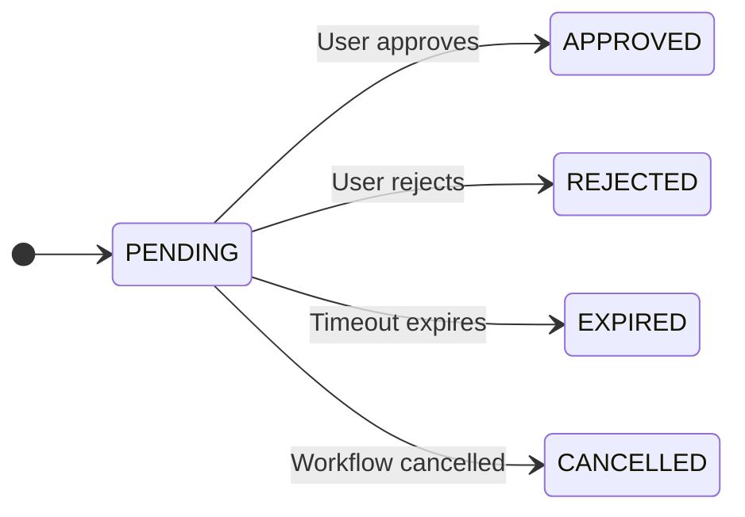
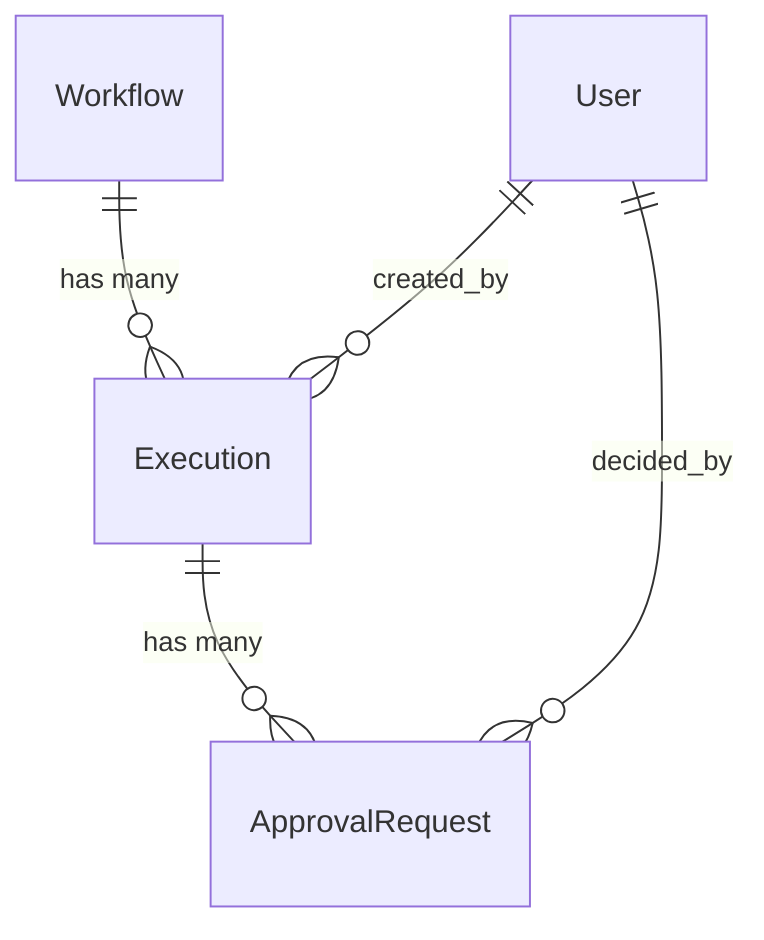

# Data Model: Human-in-the-Loop Approval Node

**Feature Branch**: `022-approval-node`
**Date**: 2025-12-16

---

## Overview

This document defines the data models for the Approval Node feature, including database entities, API schemas, and state transitions.

## Component Structure

The approvals feature is implemented as a standalone component for reusability:

```
src/nexus/approvals/
├── __init__.py
├── models/
│   ├── __init__.py
│   ├── approval_request.py    # ApprovalRequest, ApprovalRequestStatus
│   └── query_params.py        # ApprovalListParams
├── services/
│   ├── __init__.py
│   └── approval_service.py    # Business logic
├── clients/
│   ├── __init__.py
│   └── workflow_api_client.py # Abstraction for signaling workflows
└── exceptions.py              # ApprovalNotFoundError, etc.

src/nexus/api/v1/
└── approvals.py               # Router at /api/v1/approvals

src/nexus/schemas/approvals/
└── approvals-api.yaml         # OpenAPI specification
```

---

## Workflow Definition Updates

### Activity Definition Extension

The workflow definition schema requires a new activity type for approval nodes.

**File**: `src/nexus/schemas/workflows/workflow-definition.schema.json`

**Changes Required**:

1. Add `approvalActivity` definition to the `definitions` section (see schema definition below)
2. Add `approvalActivity` to the `activity` oneOf array
3. Add `approval` mapping to the discriminator

**Update the `activity` oneOf** (around line 382):

```json
"activity": {
  "oneOf": [
    { "$ref": "#/definitions/taskActivity" },
    { "$ref": "#/definitions/parallelActivity" },
    { "$ref": "#/definitions/sequenceActivity" },
    { "$ref": "#/definitions/conditionActivity" },
    { "$ref": "#/definitions/loopActivity" },
    { "$ref": "#/definitions/convergeActivity" },
    { "$ref": "#/definitions/approvalActivity" }
  ],
  "discriminator": {
    "propertyName": "type",
    "mapping": {
      "task": "#/definitions/taskActivity",
      "parallel": "#/definitions/parallelActivity",
      "sequence": "#/definitions/sequenceActivity",
      "condition": "#/definitions/conditionActivity",
      "loop": "#/definitions/loopActivity",
      "converge": "#/definitions/convergeActivity",
      "approval": "#/definitions/approvalActivity"
    }
  }
}
```

**Approval Activity Configuration**:

```yaml
activities:
  - id: review_changes
    type: approval
    name: "Review Destructive Changes"
    description: "Please review the proposed changes before proceeding"
    timeout: 604800 # 7 days in seconds - expires and follows rejection path
    onApproved:
      - id: apply_changes
        type: task
        name: "Apply Changes"
        task:
          executor: script
          config:
            script: "apply_changes.sh"
    onRejected:
      - id: notify_rejection
        type: task
        name: "Notify Rejection"
        task:
          executor: script
          config:
            script: "notify_rejection.sh"
```

### approvalActivity Schema Definition

**File**: `src/nexus/schemas/workflows/workflow-definition.schema.json`

Add the following `approvalActivity` definition to the `definitions` section (follows `conditionActivity` pattern):

```json
"approvalActivity": {
  "allOf": [
    { "$ref": "#/definitions/baseActivity" }
  ],
  "type": "object",
  "description": "Human approval node - pauses branch execution until approved or rejected",
  "required": ["type", "onApproved"],
  "properties": {
    "type": {
      "const": "approval"
    },
    "onApproved": {
      "type": "array",
      "description": "Activities to execute when approval is granted",
      "minItems": 1,
      "items": {
        "$ref": "#/definitions/activity"
      }
    },
    "onRejected": {
      "type": "array",
      "description": "Activities to execute when approval is rejected or expires",
      "items": {
        "$ref": "#/definitions/activity"
      }
    }
  },
  "unevaluatedProperties": false
}
```

### Field Mapping: Activity → ApprovalRequest

When the workflow engine reaches an approval activity, it creates an `ApprovalRequest` with the following field mappings:

| Approval Activity Field | ApprovalRequest Field | Notes                                |
| ----------------------- | --------------------- | ------------------------------------ |
| `id`                    | `approval_node_id`    | Activity ID from workflow definition |
| `name`                  | `name`                | Display name (FR-002)                |
| `timeout`               | `timeout_at`          | Computed as `now() + seconds`        |
| `onApproved[0]`         | `next_step_approved`  | Next activity to execute if approved |
| `onRejected[0]`         | `next_step_rejected`  | Next activity to execute if rejected |

### Requirement Coverage Notes

- **FR-001** (Add Approval node to workflow): Covered by `approvalActivity` schema definition
- **FR-002** (Configurable name/title): Covered by `name` field inherited from `baseActivity`
- **FR-003** (Name serves as description): Covered by `name` field inherited from `baseActivity`
- **FR-004** (Two output ports): Implicit in workflow graph - approval node connects to both approval and rejection path activities
- **FR-005** (Single input connection): Validated by workflow definition schema - activities have single input by default

### Pydantic Model Updates

**File**: `src/nexus/workflows/workflow_engine/models/workflow_definition.py`

| Change                                | Description                                                                             |
| ------------------------------------- | --------------------------------------------------------------------------------------- |
| Add `APPROVAL` to `ActivityType` enum | New enum value `APPROVAL = "approval"`                                                  |
| Update `Activity.timeout` type        | Change from `str \| None` to `str \| int \| None` to support approval's integer timeout |
| Add `on_approved` field to `Activity` | `list["Activity"] \| None` (aliased to `onApproved`, min_length=1)                      |
| Add `on_rejected` field to `Activity` | `list["Activity"] \| None` (aliased to `onRejected`)                                    |
| Add validator for approval type       | Ensures `on_approved` is provided when `type='approval'`                                |

**Note**: The existing `ApprovalDefinition` class is for the `requiresApproval` gate on other activity types. The new `on_approved`/`on_rejected` fields follow the direct-fields pattern used by `conditionActivity` (`then`/`else`).

---

## Entity Definitions

### 1. ApprovalRequest

Primary entity representing a human approval decision point in a workflow execution.

**Table Name**: `approval_requests`

| Field                | Type              | Nullable | Description                                                          |
| -------------------- | ----------------- | -------- | -------------------------------------------------------------------- |
| `id`                 | UUID              | No       | Primary key (inherited from BaseResource)                            |
| `created_at`         | TIMESTAMP WITH TZ | No       | When request was created (inherited)                                 |
| `updated_at`         | TIMESTAMP WITH TZ | No       | Last update timestamp (inherited)                                    |
| `labels`             | JSONB             | No       | Key-value metadata (inherited)                                       |
| `execution_id`       | UUID              | No       | FK to `executions.id` - parent workflow execution                    |
| `approval_node_id`   | VARCHAR(255)      | No       | Activity ID from workflow definition                                 |
| `name`               | VARCHAR(255)      | No       | Display name for the approval request                                |
| `status`             | ENUM              | No       | Current status (pending, approved, rejected, expired, cancelled)     |
| `timeout_at`         | TIMESTAMP WITH TZ | Yes      | When this request expires (null = no timeout)                        |
| `next_step_approved` | JSONB             | No       | Next activity that executes if approved                              |
| `next_step_rejected` | JSONB             | Yes      | Next activity that executes if rejected (null if path ends workflow) |
| `workflow_context`   | JSONB             | No       | Workflow inputs + previous step output                               |
| `decided_by`         | UUID              | Yes      | FK to `users.id` - user who made decision                            |
| `decided_at`         | TIMESTAMP WITH TZ | Yes      | When decision was made                                               |
| `decision_notes`     | TEXT              | Yes      | Notes provided with decision                                         |

**Indexes**:

- `ix_approval_requests_execution_id` - Index on `execution_id` for filtering by execution
- `ix_approval_requests_status` - Index on `status` for filtering pending approvals
- `ix_approval_requests_created_at` - Index on `created_at` for sorting
- `ix_approval_requests_timeout_at` - Index on `timeout_at` for expiration queries
- `ix_approval_requests_labels` - GIN index on `labels` for JSONB queries

**Constraints**:

- `fk_approval_requests_execution` - Foreign key to `executions(id)` with CASCADE delete
- `fk_approval_requests_decided_by` - Foreign key to `users(id)` with SET NULL on delete
- `ck_approval_requests_timeout_valid` - If `timeout_at` is set, it must be > `created_at`

**Application-Layer Validation**:

The following business rule is enforced in ApprovalService (not as a database constraint) for better error messages:

- When status transitions to `approved` or `rejected`, `decided_by` and `decided_at` must be set
- Error: "Cannot transition to '{status}' without decided_by and decided_at"

**JSONB Structures**:

The `next_step_approved` and `next_step_rejected` fields store a single activity summary (`next_step_rejected` can be null if rejected path ends workflow):

```json
// next_step_approved / next_step_rejected structure
{
  "id": "apply_changes",
  "name": "Apply Changes",
  "type": "task"
}
```

| Field | Type   | Required | Description                                     |
| ----- | ------ | -------- | ----------------------------------------------- |
| `id`  | string | Yes      | Activity ID from workflow definition            |
| `name` | string | Yes      | Human-readable activity name for display        |
| `type` | string | Yes      | Activity type (task, approval, parallel, etc.) |

**Notes**:

- Contains only the immediate next activity on each path
- `null` indicates no activities on that path (e.g., rejection path ends workflow)
- For full workflow context, approvers can navigate to the workflow canvas
- Populated by workflow engine when creating the ApprovalRequest

**Example - Simple linear workflow**:

```json
{
  "next_step_approved": {
    "id": "deploy_to_prod",
    "name": "Deploy to Production",
    "type": "task"
  },
  "next_step_rejected": null
}
```

**Example - Both paths have next steps**:

```json
{
  "next_step_approved": {
    "id": "apply_changes",
    "name": "Apply Changes",
    "type": "task"
  },
  "next_step_rejected": {
    "id": "log_rejection",
    "name": "Log Rejection",
    "type": "task"
  }
}
```

**workflow_context Structure**:

The `workflow_context` field provides approvers with essential context for making a decision. It contains workflow identification, inputs, and the output from the immediately preceding activity.

```json
{
  "workflow_version_id": "uuid",
  "workflow_name": "Workflow Name",
  "inputs": {}, // Workflow inputs (structure varies per workflow)
  "previous_step": {
    "id": "activity_id",
    "name": "Activity Name",
    "type": "task",
    "output": {} // Output from the activity (structure varies per activity)
  }
}
```

| Field                 | Type   | Required | Description                                                   |
| --------------------- | ------ | -------- | ------------------------------------------------------------- |
| `workflow_version_id` | uuid   | Yes      | ID of the workflow version being executed                     |
| `workflow_name`       | string | Yes      | Name of the workflow                                          |
| `inputs`              | object | Yes      | Original workflow input parameters                            |
| `previous_step`       | object | No       | The activity that immediately preceded this approval (if any) |

**Example - Deployment workflow approval**:

```json
{
  "workflow_version_id": "a1b2c3d4-e5f6-7890-abcd-ef1234567890",
  "workflow_name": "Production Deployment",
  "inputs": {
    "target_environment": "production",
    "version": "2.1.0",
    "requested_by": "alice@example.com"
  },
  "previous_step": {
    "id": "security_scan",
    "name": "Security Scan",
    "type": "task",
    "output": {
      "vulnerabilities_found": 0,
      "scan_duration_seconds": 120
    }
  }
}
```

**Notes**:

- `inputs` mirrors the workflow execution's input parameters
- `previous_step` is the activity that ran immediately before this approval node (null if approval is first activity)
- For current workflow state (especially in parallel workflows), approvers navigate to the workflow execution canvas via the provided link
- See research.md "Approver Context Requirements" for design rationale

---

### 2. ApprovalStatus (Enum)

PostgreSQL enum type for approval request status.

**Type Name**: `approvalrequeststatus`

| Value       | Description                                               |
| ----------- | --------------------------------------------------------- |
| `pending`   | Awaiting human decision                                   |
| `approved`  | Approved by user - workflow continues on approval path    |
| `rejected`  | Rejected by user - workflow continues on rejection path   |
| `expired`   | Timeout reached - automatically treated as rejection      |
| `cancelled` | Parent workflow was cancelled - approval no longer needed |

---

## State Transitions

### ApprovalRequest State Machine



**Transition Rules**:

| From    | To        | Trigger                | Side Effects                                                                      |
| ------- | --------- | ---------------------- | --------------------------------------------------------------------------------- |
| PENDING | APPROVED  | User submits approval  | Set `decided_by`, `decided_at`, `decision_notes`; send signal to Temporal         |
| PENDING | REJECTED  | User submits rejection | Set `decided_by`, `decided_at`, `decision_notes`; send signal to Temporal         |
| PENDING | EXPIRED   | Timeout timer fires    | Set `decision_notes` to auto-expire message (workflow handles timeout internally) |
| PENDING | CANCELLED | Workflow cancelled     | No signal needed (workflow already terminated)                                    |

**Invalid Transitions**:

- Any transition FROM a terminal state (approved, rejected, expired, cancelled)
- Direct transition from PENDING to any non-adjacent state

---

## Relationships



- **Execution → ApprovalRequest**: One-to-many. An execution can have multiple approval requests (if workflow has multiple approval nodes or loops through approval nodes)
- **User → ApprovalRequest**: Many-to-one (decided_by). A user can make decisions on multiple approval requests
- **WorkflowVersion → ApprovalRequest**: Indirect via Execution. The workflow version defines the approval node configuration

---

## SQLModel Implementation

```python


class ApprovalRequestStatus(str, Enum):
    """Approval request status enumeration."""

    PENDING = "pending"
    APPROVED = "approved"
    REJECTED = "rejected"
    EXPIRED = "expired"
    CANCELLED = "cancelled"


class ApprovalRequest(BaseResource, table=True):
    """ApprovalRequest model representing human-in-the-loop decision points.

    Extends BaseResource with approval-specific fields.

    Attributes:
        id: Primary key UUID (from BaseResource)
        created_at: When approval was requested (from BaseResource)
        updated_at: Last update timestamp (from BaseResource)
        labels: JSONB key-value labels (from BaseResource)
        execution_id: Foreign key to parent Execution
        approval_node_id: Activity ID from workflow definition
        name: Display name for the approval request
        status: Current approval status
        timeout_at: When this request expires (optional)
        next_step_approved: Next activity that executes if approved
        next_step_rejected: Next activity that executes if rejected
        workflow_context: Workflow inputs and previous step output
        decided_by: User who made the decision
        decided_at: When decision was made
        decision_notes: Notes provided with decision
    """

    __tablename__ = "approval_requests"

    # Filterable and sortable fields
    __filterable_fields__: ClassVar[list[str]] = [
        *BaseResource.__filterable_fields__,
        "execution_id",
        "status",
        "timeout_at",
    ]

    __sortable_fields__: ClassVar[list[str]] = [
        *BaseResource.__sortable_fields__,
        "timeout_at",
        "decided_at",
    ]

    # Relationships
    execution_id: UUID = Field(
        foreign_key="executions.id",
        nullable=False,
        ondelete="CASCADE",
        description="Parent execution ID",
        index=True,
    )

    # Approval identity
    approval_node_id: str = Field(
        min_length=1,
        max_length=255,
        nullable=False,
        description="Activity ID from workflow definition",
    )

    name: str = Field(
        min_length=1,
        max_length=255,
        nullable=False,
        description="Display name for approval request",
    )


    # Status
    status: ApprovalRequestStatus = Field(
        default=ApprovalRequestStatus.PENDING,
        description="Current approval status",
        sa_column=postgres_enum_column(
            ApprovalRequestStatus,
            "approvalrequeststatus",
            index=True,
            create_constraint=True,
            server_default=text("'pending'::approvalrequeststatus"),
        ),
    )

    # Timing
    timeout_at: datetime | None = Field(
        default=None,
        nullable=True,
        sa_type=DateTime(timezone=True),
        description="When this request expires",
        index=True,
    )

    # Context for approvers - single ActivitySummary dict
    # Structure: {"id": "...", "name": "...", "type": "..."}
    next_step_approved: dict[str, Any] = Field(
        sa_column=Column(JSONB, nullable=False),
        description="First activity that executes if approved",
    )

    next_step_rejected: dict[str, Any] | None = Field(
        default=None,
        sa_column=Column(JSONB, nullable=True),
        description="First activity that executes if rejected",
    )

    workflow_context: dict[str, Any] = Field(
        default_factory=dict,
        sa_column=Column(JSONB, nullable=False, server_default=text("'{}'::jsonb")),
        description="Workflow inputs and previous step output",
    )

    # Decision fields
    decided_by: UUID | None = Field(
        default=None,
        foreign_key="users.id",
        nullable=True,
        ondelete="SET NULL",
        description="User who made the decision",
    )

    decided_at: datetime | None = Field(
        default=None,
        nullable=True,
        sa_type=DateTime(timezone=True),
        description="When decision was made",
    )

    decision_notes: str | None = Field(
        default=None,
        nullable=True,
        sa_type=Text(),
        description="Notes provided with decision",
    )

    # Relationships
    execution: "Execution" = Relationship(
        back_populates="approval_requests",
        sa_relationship_kwargs={"foreign_keys": "[ApprovalRequest.execution_id]"},
    )

    decider: "User" = Relationship(
        sa_relationship_kwargs={"foreign_keys": "[ApprovalRequest.decided_by]"},
    )
```

---

## Validation Rules

### ApprovalRequest Validation

1. **Name**: Required, 1-255 characters
2. **Status transitions**: Only valid transitions allowed (see state machine)
3. **Decision completeness**: When status is approved/rejected, decided_by and decided_at must be set
4. **Timeout**: If set, must be in the future at creation time
5. **Approval node ID**: Must match a valid activity ID in the workflow definition

### Decision Validation

1. **Status**: Must be one of the `ApprovalDecisionStatus` enum values: "approved" or "rejected" (terminal states "cancelled" and "expired" are system-managed)
2. **Notes**: Optional, max 2000 characters
3. **Current status**: Must be "pending" to accept a decision
4. **Execution status**: Parent execution must not be cancelled/completed/failed

**Notes**:
- The API uses a separate `ApprovalDecisionStatus` enum for decision requests, which is a subset of the full `ApprovalRequestStatus` enum that includes only user-actionable values.
- The API uses a separate `BatchApprovalDecisionStatus` enum for batch decision requests, which is a subset of the full `ApprovalRequestStatus` enum that includes only system-actionable values.

---

## Migration Notes

### New Database Objects

1. **Enum type**: `approvalrequeststatus` with 5 values
2. **Table**: `approval_requests` with all columns and constraints
3. **Indexes**: 5 indexes for filtering and sorting performance
4. **Foreign keys**: 2 FKs (execution_id, decided_by)

### Relationship Updates

1. Add `approval_requests` relationship to `Execution` model:
   ```python
   approval_requests: list["ApprovalRequest"] = Relationship(
       back_populates="execution",
       cascade_delete=True,
   )
   ```

---

**Note**: UI component specifications are documented in research.md sections 14-18.
