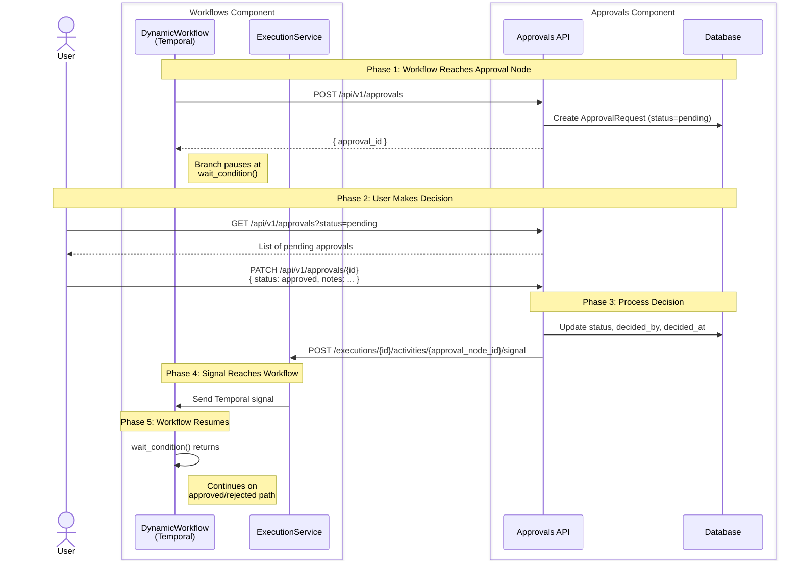
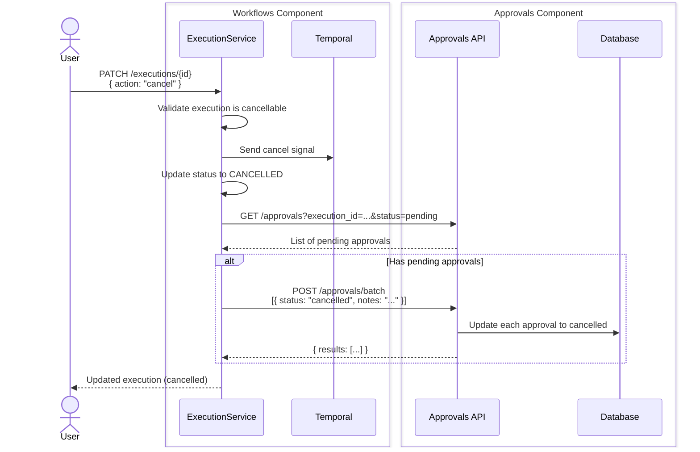

# Research: Human-in-the-Loop Approval Node

**Feature Branch**: `022-approval-node`
**Date**: 2025-12-16

---

## Overview

This document consolidates research findings for implementing the Approval Node feature in the Nexus workflow engine. All NEEDS CLARIFICATION items from the Technical Context have been resolved.

---

## Architecture

### HTTP-Based Inter-Component Communication

**Decision**: Components communicate exclusively via HTTP APIs, even within the monolith

**Rationale**:

- **Simpler code** - No abstract interfaces or multiple implementations to maintain
- **True decoupling** - Components are isolated; can deploy separately without code changes
- **Forced contract discipline** - API is the only integration point; catches breaking changes early
- **Better testing** - Components can be tested in isolation with mocked HTTP endpoints

**Trade-offs accepted**:

- ~1-5ms latency per HTTP call (negligible compared to Temporal activity execution time)
- Additional failure modes (HTTP errors, timeouts) - mitigated with retry strategy below

**Retry Strategy for HTTP Calls**:

Inter-component HTTP calls use asymmetric retry strategies based on criticality:

| Direction            | Call                                       | Retry Config                               | On Failure                                                 |
| -------------------- | ------------------------------------------ | ------------------------------------------ | ---------------------------------------------------------- |
| Workflow → Approvals | `POST /api/v1/approvals`                   | Default to 3 attempts, exponential backoff | Activity fails, Temporal retries per workflow retry policy |
| Approvals → Workflow | `POST /api/v1/executions/{id}/activities/{activity_id}/signal` | Default to 5 attempts, exponential backoff | Log error, approval stays decided (manual reconciliation)  |

**Why asymmetric?**

- **Workflow → Approvals**: Lower criticality. If this fails after retries, the Temporal activity fails and Temporal's built-in retry policy handles re-execution. The system self-heals.
- **Approvals → Workflow**: Higher criticality. The user's action is complete (approval marked as decided in database). If the signal fails, the workflow remains waiting while the approval shows as decided - an inconsistent state requiring manual intervention. More retries reduce this risk.

**Implementation**:

- **Reuse existing retry decorator**: `src/nexus/agent_orchestrator/utils/retry.py` (already used by ToolManagerClient)
- Retry on: connection errors, 502/503/504 status codes
- Do NOT retry on: 400/404/409 (client errors are not transient)
- Retry counts configurable via settings with sensible defaults (3 and 5)

**Edge case - Signal delivery exhausted**:
If all signal retries fail, the approval is marked as decided in the database but the workflow remains waiting. This is a rare edge case (requires sustained service unavailability). Resolution options:

1. Manual re-trigger via admin API (future enhancement)
2. Reconciliation job that checks for "decided but workflow still waiting" (future enhancement)
   For MVP, this is acceptable given low-volume human-in-the-loop scenarios

**Handling Multiple Approval Nodes**:

A workflow may contain multiple approval nodes (sequential or parallel). The `approval_id` is used to route each signal to the correct waiting node:

```python
# In DynamicWorkflow
def __init__(self):
    self._approval_decisions: dict[str, ApprovalResult] = {}

@workflow.signal
async def approval_decision(self, approval_id: str, status: str, notes: str | None):
    """Signal handler - stores decision keyed by approval_id."""
    self._approval_decisions[approval_id] = ApprovalResult(status=status, notes=notes)

async def _execute_approval_activity(self, node: ApprovalNode):
    """Each approval node waits for its specific approval_id."""
    # Create approval request via HTTP, get back the approval_id
    approval_id = await workflow.execute_activity(
        create_approval_request_activity,
        args=[...],
    )

    # Wait for THIS specific approval_id to have a decision
    await workflow.wait_condition(
        lambda: approval_id in self._approval_decisions
    )

    # Return the decision for this specific approval
    return self._approval_decisions[approval_id]
```

This pattern ensures:

- Each approval node waits only for its own decision
- Signals are correctly routed even with multiple pending approvals
- Parallel approval nodes can be resolved in any order

**Inter-Component Communication Flow**:



**Alternatives Considered**:

1. **Abstract interface with multiple implementations** (InProcessClient vs HTTPClient):

   - Rejected: More code to maintain, hidden coupling risk, testing gap between implementations

2. **Direct Temporal access from approvals**:

   - Rejected: Tight coupling, leaks Temporal implementation details

3. **Event bus (Redis Streams, PostgreSQL NOTIFY)**:

   - Considered for future: Adds infrastructure complexity
   - Better suited for true async event-driven architecture

4. **Workflow polls database for decision**:
   - Rejected: Latency issues, inefficient, wastes resources

**Decision Summary**: HTTP-only communication provides the best balance of simplicity, true decoupling, and maintainability. The small latency overhead (~1-5ms) is negligible compared to workflow execution time, and enforcing API contracts from day one prevents hidden coupling.

---

### Workflow Cancellation → Approval Cancellation

**Decision**: ExecutionService calls the Approvals API via HTTP when a workflow is cancelled

**Rationale**:

- When a workflow is cancelled, any pending approval requests for that workflow are no longer actionable
- The approval should transition to CANCELLED status so users don't waste time reviewing stale requests
- HTTP call maintains component isolation consistent with other inter-component communication

**Implementation Flow**:



**Why Synchronous HTTP (Not Event-Driven)**:

1. **Synchronous consistency**: Cancelled approvals are immediately visible when cancellation response returns
2. **Simpler error handling**: If approval cancellation fails, execution cancellation can handle the error
3. **Consistent with other inter-component calls**: Same pattern as creation and signaling

**Race Condition Handling**:

If a user submits an approval decision while the workflow is being cancelled:

1. ApprovalService.decide() checks that approval status is still PENDING
2. If status is now CANCELLED (from concurrent cancellation), return 409 Conflict
3. User sees error: "Approval already decided or workflow cancelled"

This is already tested in quickstart.md Scenario 6.

**Alternatives Considered**:

1. **Database trigger on execution status change**:
   - Rejected: Hides business logic in database; harder to test and maintain
2. **Event-driven (PostgreSQL NOTIFY or message queue)**:
   - Rejected: Adds eventual consistency; user might see stale pending approvals
3. **Polling from approvals component**:
   - Rejected: Inefficient; approval would remain pending until next poll

---

## Workflow Engine Integration

### Temporal Signal-Based Workflow Pause/Resume Pattern

**Decision**: Use Temporal signals to communicate approval decisions to workflow executions

**Rationale**:

- Temporal signals are the recommended pattern for external events that affect workflow execution
- Signals are durable and will be delivered even if the workflow is currently executing
- The workflow can wait on a signal indefinitely (no polling required)
- Temporal's retention handles long-running approvals that may take days/weeks

**Pattern Implementation**:

```python
# Simplified example showing the Temporal signal pattern.
# See section 9 "Handling Multiple Approval Nodes" for full implementation.

@workflow.defn
class DynamicWorkflow:
    def __init__(self):
        self._approval_decisions: dict[str, ApprovalResult] = {}

    @workflow.signal
    async def approval_decision(self, approval_id: str, status: str, notes: str | None) -> None:
        """Signal handler for approval decisions."""
        self._approval_decisions[approval_id] = ApprovalResult(status=status, notes=notes)

    @workflow.run
    async def run(self, input_data: WorkflowInput) -> WorkflowOutput:
        # ... workflow activities ...

        # At approval node: create request via HTTP, get approval_id
        approval_id = await workflow.execute_activity(
            create_approval_request_activity, args=[...]
        )

        # Wait for THIS specific approval_id to have a decision
        await workflow.wait_condition(
            lambda: approval_id in self._approval_decisions,
            timeout=approval_timeout  # Optional timeout
        )

        decision = self._approval_decisions[approval_id]
        if decision.status == "approved":
            # Continue on approval path
            ...
        else:
            # Continue on rejection path
            ...
```

**Alternatives Considered**:

1. **Polling-based approach**: Workflow periodically checks database for approval status
   - Rejected: Inefficient, delays response, wastes compute resources
2. **Activity with heartbeat**: Long-running activity that waits for approval
   - Rejected: Activities have timeouts; doesn't fit approval model well
3. **External workflow completion**: Separate workflow for approval handling
   - Rejected: Overly complex; signals are simpler and more direct

---

### Workflow Definition Integration

**Decision**: Add new activity type "approval" with dedicated ApprovalNode configuration

**Rationale**:

- Per spec: "Automation Designers MUST be able to add a standalone 'Approval' node to a workflow"
- Existing `ApprovalDefinition` in workflow_definition.py handles approval config within other activities
- For standalone approval node, need a dedicated activity type

See [data-model.md](./data-model.md) for the ActivityType extension and approval activity configuration schema.

**Alternatives Considered**:

1. **Reuse existing requires_approval flag on other activities**:
   - Rejected: Spec requires "standalone" approval node, not approval on existing activities
2. **Separate approval block outside activities array**:
   - Rejected: Breaks workflow activity ordering; approval is an activity in the flow

---

### Branch Pausing Behavior

**Decision**: Pause only the branch containing the approval node; parallel branches continue

**Rationale**:

- Per spec: "the system MUST pause the branch containing that node while allowing other parallel branches to continue executing"
- This is the natural behavior with Temporal when a workflow waits on a signal
- Other branches in parallel execution continue independently

**Implementation**:

- In a parallel block, each branch runs as a separate coroutine via `asyncio.gather()`
- When one branch hits an approval node, it calls `workflow.wait_condition()`
- `wait_condition()` blocks only the current coroutine, not the entire workflow
- Other coroutines in the `asyncio.gather()` continue executing independently
- The `gather()` completes when all branches finish (including the approval resolution)

```python
# DynamicWorkflow parallel execution pattern
async def _execute_parallel_block(self, branches: list[Branch]) -> None:
    await asyncio.gather(*[
        self._execute_branch(branch) for branch in branches
    ])
    # Reaches here only when ALL branches complete
    # (including any branches waiting for approval signals)
```

**Output Port Behavior**:

- Approval node has two output ports: "Approved" and "Rejected"
- The Approved port MUST have downstream activities (otherwise why have the approval?)
- The Rejected port may be left unconnected (no downstream activities)
- If the Rejected port is unconnected, the branch simply ends on rejection

**Execution Status During Approval Wait**:

The execution status depends on whether other branches are still running:

| Scenario                                                    | Execution Status | Reason                                |
| ----------------------------------------------------------- | ---------------- | ------------------------------------- |
| Single-branch workflow waiting for approval                 | `paused`         | No other activities running           |
| Parallel workflow: one branch waiting, others still running | `running`        | Other branches are actively executing |
| Parallel workflow: all branches waiting for approvals       | `paused`         | No activities running, all waiting    |
| Parallel workflow: one branch waiting, others completed     | `paused`         | No activities running                 |

**Implementation Logic**:

```python
def _compute_execution_status(self) -> ExecutionStatus:
    """Determine execution status based on branch states."""
    has_running_activities = any(
        branch.state == BranchState.RUNNING
        for branch in self._branches
    )
    has_waiting_branches = any(
        branch.state == BranchState.WAITING_FOR_APPROVAL
        for branch in self._branches
    )

    if has_running_activities:
        return ExecutionStatus.RUNNING
    elif has_waiting_branches:
        return ExecutionStatus.PAUSED
    elif all(branch.state == BranchState.COMPLETED for branch in self._branches):
        return ExecutionStatus.COMPLETED
    # ... other states
```

This ensures users see accurate status: `running` when work is happening, `paused` when waiting for human input.

---

### Approver Context Requirements

**Question**: What context does an approver need to decide whether to approve or reject?

**Context Categories**:

| What the approver needs to know    | How we represent it                                                    |
| ---------------------------------- | ---------------------------------------------------------------------- |
| What am I approving?               | `name` from approval node config (serves as description)               |
| What happens if I approve/reject?  | `next_step_approved`, `next_step_rejected` (immediate next activity)   |
| What led to this approval?         | `previous_step` - output from the activity that preceded this approval |
| Why was this workflow started?     | `inputs` - original workflow input parameters                          |
| What's the current workflow state? | Link to workflow execution canvas (live view)                          |

**Decision**: Store `inputs` + `previous_step` in the approval record. Link to the execution canvas for current workflow state.

**Rationale**:

- **Inputs** provide essential context: who requested the workflow, target environment, version, etc.
- **Previous step output** is typically most relevant: test results, security scan findings, or other outputs that triggered the need for approval
- **Current workflow state** (especially in parallel branches) should be viewed live via the execution canvas rather than stored as a snapshot that becomes stale

**Note on parallel workflows**: When an approval node is in one branch of a parallel workflow, other branches continue executing. Storing a workflow state snapshot would become stale. Instead, the approval detail page links to the execution canvas where approvers can see real-time progress.

---

### Timeout Handling

**Decision**: Use Temporal timer + database TTL for timeout expiration

**Rationale**:

- Temporal timers are durable and survive workflow restarts
- Database stores timeout_at for UI display and API filtering
- When timeout fires, workflow transitions to rejection path with auto-note

**Implementation**:

```python
# In workflow
try:
    await workflow.wait_condition(
        lambda: self.approval_result is not None,
        timeout=parse_duration(approval_config.timeout)
    )
except asyncio.TimeoutError:
    # Timeout expired - auto-reject
    self.approval_result = ApprovalResult(
        status="expired",
        notes="Request automatically rejected due to timeout"
    )
```

---

## Data Model

### Approval Request State Machine Design

**Decision**: Implement a 4-terminal-state state machine (Pending → Approved | Rejected | Expired | Cancelled)

**Rationale**:

- Per spec: "Pending → Approved, Rejected, Expired, or Cancelled (4 terminal states)"
- All terminal states are final and cannot be reversed
- Clear separation between user-initiated decisions (Approved/Rejected) and system-initiated transitions (Expired/Cancelled)

See [data-model.md](./data-model.md) for the full state transition diagram, transition rules, and SQLModel implementation.

**Alternatives Considered**:

1. **Single "completed" status with decision field**: Less explicit about what happened
   - Rejected: Reduces queryability and clarity
2. **Additional "processing" intermediate state**: For async approval processing
   - Rejected: Overcomplicates for initial implementation; can add later if needed

---

### Database Model Design Pattern

**Decision**: Create ApprovalRequest model extending BaseResource with relationship to Execution (not ActivityExecution)

**Rationale**:

- Approval nodes are top-level workflow activities, not tied to specific activity executions
- Per spec: "An approval request MUST include: a link to the source workflow execution"
- Execution relationship enables filtering by workflow and showing workflow context
- Follow existing pattern: Execution → activities, Execution → approval_requests

**Schema Outline** (full SQLModel implementation in data-model.md):

| Field Group   | Fields                                                                                | Purpose                       |
| ------------- | ------------------------------------------------------------------------------------- | ----------------------------- |
| Relationships | `execution_id`, `approval_node_id`                                                    | Link to workflow and activity |
| Request data  | `name`, `description`, `next_step_approved`, `next_step_rejected`, `workflow_context` | Context for approvers         |
| Status        | `status`, `timeout_at`                                                                | State machine and timing      |
| Decision      | `decided_by`, `decided_at`, `decision_notes`                                          | Audit trail                   |

**Alternatives Considered**:

1. **Link to ActivityExecution instead of Execution**:
   - Rejected: Approval nodes may not have corresponding ActivityExecution records since they're control flow nodes, not task executions
2. **Embed approval data in Execution model**:
   - Rejected: Violates single responsibility; muddies Execution model

---

## API Design

### Endpoint Design

**Decision**: Create standalone `/api/v1/approvals` endpoints as a top-level resource

**Rationale**:

- Approvals will eventually come from multiple sources (workflows, agent orchestrator)
- Standalone component enables reuse without coupling to workflows
- Clean dependency graph: workflows → approvals, agent_orchestrator → approvals

**Endpoints**:
| Method | Path | Description |
|--------|------|-------------|
| GET | `/api/v1/approvals` | List approval requests with filtering |
| POST | `/api/v1/approvals` | Create approval request |
| GET | `/api/v1/approvals/{id}` | Get approval request details |
| PATCH | `/api/v1/approvals/{id}` | Submit approval decision |
| POST | `/api/v1/approvals/batch` | Submit multiple decisions |

**Filtering Support**:

- `status`: Filter by status (pending, approved, rejected, expired, cancelled)
- `execution_id`: Filter by parent workflow execution
- `source_type`: Filter by source type (workflow, agent - future)
- `created_at`: Date range filtering
- `limit`, `cursor`: Pagination

**Alternatives Considered**:

1. **Nest under executions**: `/executions/{id}/approvals`
   - Rejected: Approvals may be viewed across executions; dedicated resource is cleaner
2. **Nest under workflows**: `/api/v1/workflows/approvals`
   - Rejected: Would require agent orchestrator to depend on workflows component
3. **Per-source endpoints**: `/workflows/approvals` and `/agents/approvals`
   - Rejected: Fragmenting approvals makes batch operations and unified inbox harder

---

### API Path Structure

**Decision**: Use `/api/v1/approvals` as the base path (approvals is both component and resource)

**Rationale**:

- Approvals is a standalone component with a single primary resource type
- The resource IS the approval request; there are no other resource types within this component
- Following the pattern strictly (`/api/v1/approvals/requests`) adds unnecessary nesting
- Other single-resource components in the project follow similar patterns

**Constitution Exception Justification**:
The constitution specifies `/api/v1/[component]/[resource]` pattern. For the approvals component, the resource type (approval requests) IS the primary concern. Adding `/requests` suffix would be redundant since:

- `GET /api/v1/approvals` - lists approval requests (the only resource type)
- `GET /api/v1/approvals/{id}` - gets a specific approval request
- `PATCH /api/v1/approvals/{id}` - decides an approval request
- `POST /api/v1/approvals/batch` - batch operations on approval requests

If additional resource types are added to the approvals component in the future (e.g., approval policies, approval rules), paths would be:

- `/api/v1/approvals` - approval requests (existing)
- `/api/v1/approvals/policies` - approval policies (future)
- `/api/v1/approvals/rules` - approval rules (future)

**Alternatives Considered**:

1. **Use `/api/v1/approvals/requests`**:
   - Rejected: Redundant for single-resource component
2. **Use `/api/v1/workflow-approvals`**:
   - Rejected: Limits reusability for agent orchestrator approvals

---

### Batch Approval Design

**Decision**: Implement POST `/approvals/batch` endpoint accepting array of decisions

**Rationale**:

- Per spec: "The system MUST support batch approval, allowing users to review and submit multiple approval requests at once"
- Single API call for multiple decisions improves UX and reduces latency

**Request Format**:

```json
{
  "decisions": [
    {
      "approval_id": "uuid-1",
      "status": "approved",
      "notes": "Approved after review"
    },
    {
      "approval_id": "uuid-2",
      "status": "rejected",
      "notes": "Missing justification"
    }
  ]
}
```

**Response**: Returns array of updated approval requests (or partial success with errors)

---

### Error Response Format

**Decision**: Use existing project Error schema format (error, message, details) rather than RFC 9457 Problem Details

**Rationale**:

- The existing `shared-resources.openapi.yaml` Error schema is already in use across all Nexus APIs
- Changing to RFC 9457 would require updating all existing endpoints and client code
- Consistency within the project takes precedence over external standard compliance for new features
- RFC 9457 migration should be a separate, project-wide effort (see Future Considerations)

**Current Error Format**:

```json
{
  "error": "validation_error",
  "message": "The 'name' field is required",
  "details": "Field 'name' must be between 1 and 255 characters"
}
```

**Constitution Exception Justification**:
The constitution requires RFC 9457 compliance, but this would create inconsistency with all other Nexus APIs. A project-wide migration to RFC 9457 is recommended as a future enhancement. This feature will follow existing patterns and be migrated along with all other APIs.

**Alternatives Considered**:

1. **Implement RFC 9457 for approvals only**:
   - Rejected: Creates inconsistent error handling across APIs
2. **Migrate all APIs to RFC 9457 as part of this feature**:
   - Rejected: Out of scope; requires separate planning and testing

---

### Schema Location and Single Source of Truth

**Decision**: All approval-related schemas are defined exclusively in `src/nexus/schemas/approvals/approvals-api.yaml`

**Rationale**:

- Single source of truth prevents schema drift and DRY violations
- Approval schemas should be owned by the approvals component, not shared-schemas
- Other components reference approval schemas via `$ref` when needed
- The workflows component's `shared-schemas.yaml` contains only workflow-specific schemas

**Implementation**:

- `approvals-api.yaml` defines: ApprovalRequest, ApprovalRequestStatus, ApprovalDecisionStatus, ApprovalDecisionRequest, BatchApprovalDecisionStatus, BatchApproval\* schemas
- `shared-schemas.yaml` includes comments pointing to approvals-api.yaml (no duplicates)
- WebSocket message types that include approval data reference the canonical schema

**Status Enums**:
- `ApprovalRequestStatus`: Full lifecycle enum (pending, approved, rejected, expired, cancelled)
- `ApprovalDecisionStatus`: User-actionable subset (approved, rejected) for decision requests
- `BatchApprovalDecisionStatus`: System-actionable subset (approved, rejected, expired, cancelled) for decision requests

**Naming Convention**:

- Database model: `ApprovalRequest` with `ApprovalRequestStatus` enum  
- API schemas: `ApprovalRequest` with `ApprovalRequestStatus` and `ApprovalDecisionStatus` enums
- `ApprovalDecisionStatus` is a subset of `ApprovalRequestStatus` containing only user-actionable values
- `BatchApprovalDecisionStatus` is a subset of `ApprovalRequestStatus` containing only system-actionable values

---

## Design Conventions

**M1: ApprovalDecision as Embedded Fields**

The spec lists ApprovalDecision as a key entity, but the implementation embeds decision fields directly in ApprovalRequest (`decided_by`, `decided_at`, `decision_notes`). This is intentional:

- Simplifies queries (no join required to get decision info)
- Matches existing patterns (Execution has embedded status fields)
- Decisions are 1:1 with approvals (no need for separate entity)

**M4: Path Parameter Naming (camelCase)**

Path parameters like `approvalId` use camelCase in OpenAPI specs, while field names use snake_case. This follows OpenAPI conventions:

- Path parameters: camelCase (`/approvals/{approvalId}`)
- Query parameters: snake_case (`?execution_id=...`)
- Schema properties: snake_case (`approval_node_id`)

**M5: Security Scopes**

OAuth2 scopes are not explicitly documented per-endpoint because:

- Current implementation uses simple bearer token authentication
- Scope-based authorization is a future enhancement (when RBAC is implemented)
- All authenticated users can currently access all approval endpoints

**M6: Status Enum Strategy**

- Database enum: `ApprovalRequestStatus` (full lifecycle: pending, approved, rejected, expired, cancelled)
- API schema: `ApprovalStatus` (shorter, user-friendly)
- This follows existing patterns in the codebase (e.g., `ExecutionStatus`)
- Decision API enum: `ApprovalDecisionStatus` (user-actionable subset: approved, rejected)
- Batch Decision API enum: `BatchApprovalDecisionStatus` (system-actionable subset: approved, rejected, expired, cancelled)
- This separation provides type safety while distinguishing between system-managed and user-actionable status values

---

## Implementation Reference

### Existing Code Patterns to Reuse

1. **BaseResource inheritance** - `src/nexus/core/models/base/base_resource.py`
2. **Pagination utilities** - `src/nexus/core/utils/pagination.py`, `cursor.py`
3. **Filtering infrastructure** - `src/nexus/core/utils/filters.py`
4. **Enum column pattern** - `src/nexus/core/utils/sqlmodel.py::postgres_enum_column`

---

### Dependencies and Integration Points

1. **Temporal SDK** - Signal handling, timer management, wait conditions
2. **PostgreSQL** - ApprovalRequest table with proper indexes
3. **Alembic** - Migration for new table and enum type
4. **WebSocket** - Real-time approval notifications (future enhancement, out of scope)

---

## Risks and Mitigations

| Risk                                                        | Mitigation                                                                     |
| ----------------------------------------------------------- | ------------------------------------------------------------------------------ |
| Long-running approvals exceed Temporal retention            | Store all approval data in database; Temporal only handles signal coordination |
| Race condition: workflow cancelled while approval submitted | Check execution status before processing; return error if cancelled            |
| Signal lost during workflow replay                          | Temporal signals are durable; handled automatically                            |
| Batch approval partial failure                              | Return partial success response with individual error details                  |

---

## Future Considerations

### Agent Orchestrator Approval Requests

**Context**: The agent orchestrator may need to request human approval for sensitive operations (e.g., executing destructive tools, accessing restricted resources, making financial transactions).

**Current Design Decision**: Keep `execution_id` as a required field for the initial implementation, focused on workflow approvals.

**Future Extension Path**:
When agent orchestrator approvals are needed, the following migration will be required:

1. **Make `execution_id` nullable** - Allow approvals without a workflow execution
2. **Add `source_type` field** - Enum: `workflow`, `agent_orchestrator`, etc.
3. **Add `source_id` field** - Generic UUID reference to the source entity
4. **Add source-specific context fields** - e.g., `invocation_id` for agent orchestrator

**Estimated Migration Effort**: Moderate

- **Database**: Simple Alembic migration to add nullable fields and source_type enum
- **API schemas**: Refactor workflow-centric schemas to use `oneOf` pattern supporting multiple source types (workflow vs agent orchestrator contexts)
- **Service layer**: Add source-type routing logic
- **UI**: New views/components for non-workflow approval contexts

**Why Not Design for This Now**:

1. Agent orchestrator approval requirements are not yet defined
2. YAGNI principle - avoid speculative complexity
3. Different sources may have different context requirements (tool call details vs workflow state)
4. Current design can be extended via backward-compatible migration

**Preserved Design Decisions**:

- Standalone `approvals` component at `src/nexus/approvals/` (enables future reuse)
- Top-level `/api/v1/approvals` API path (not nested under workflows)
- Generic `workflow_context` JSONB field (can store any source context)

---

## UI Research (nexus-ui)

### UI Architecture Overview

**Repository**: [nexus-ui](https://github.com/syntara-orchestration/syntara-ui)

**Technology Stack**:

- Framework: React 19 with TypeScript
- Routing: `wouter` (lightweight React router)
- State Management: Zustand (global) + React Query (server state)
- Build Tool: Vite
- Styling: Tailwind CSS
- Component Library: Custom `@ansible/nexus-ui-framework` + Lucide icons
- API Client: `openapi-fetch` + `openapi-react-query` for type-safe API calls

**Repo Structure**:

- `packages/nexus-ui`: Main UI application
- `packages/nexus-ui-framework`: Shared UI components
- `packages/nexus-contracts`: Generated TypeScript types from OpenAPI specs
- `packages/nexus-mock-api`: Mock API for development

---

### UI Integration Patterns

**API Client Pattern** (from `src/client.tsx`):

```typescript
import createFetchClient from "openapi-fetch";
import createClient from "openapi-react-query";

const approvalsFetchClient = createFetchClient<ApprovalsAPI.paths>({
  baseUrl: "/api/v1/",
});
export const approvalsClient = createClient(approvalsFetchClient);
```

**Contract Generation** (from `packages/nexus-contracts/package.json`):

```json
{
  "gen:approvals": "npx openapi-typescript ./nexus/src/nexus/schemas/approvals/approvals-api.yaml --output ./src/approvals-api.ts --default-non-nullable false"
}
```

**Page Component Pattern** (from `Executions.tsx`):

- Use `AppPage` wrapper for consistent layout
- Use `AppPageHeader` with search input
- Use `Table` component with typed columns
- Use `useQueryState` for loading/error states
- Use `useFuse` for client-side search

---

### Navigation Structure

**Current Navigation** (`src/app/navigationItems.tsx`):

The Approvals route already exists in AppRoute but has no component:

```typescript
{
  label: 'Approvals',
  path: AppRoute.Approvals,  // '/approvals'
}
```

**Required Changes**:

1. Add `Approvals` lazy import
2. Add `element: <Approvals />` to navigation item
3. Create `/routes/approvals/` directory structure

---

### UI Component Design Decisions

**Decision**: Follow existing patterns from `Executions.tsx` for the approvals list view

**Rationale**:

- Consistent user experience across the application
- Reuse proven patterns for tables, search, and status indicators
- Leverage existing `Table`, `LinkCell`, `DateCell` components

**Approvals List View Design**:

| Column     | Type        | Description                                                       |
| ---------- | ----------- | ----------------------------------------------------------------- |
| Name       | LinkCell    | Links to detail view                                              |
| Workflow   | LinkCell    | Links to workflow execution                                       |
| Status     | StatusLabel | Icon + colored text (pending/approved/rejected/expired/cancelled) |
| Created At | DateCell    | Relative time                                                     |
| Timeout At | DateCell    | Expiration countdown or null indicator                            |

**Approval Detail View Design**:

- Header: Name, status badge, **"View Workflow Execution" link** (prominent - links to `/executions/{execution_id}`)
- Context section: Workflow inputs and previous step output (JSON viewer)
- Next steps: Approved path vs Rejected path comparison
- Action buttons: Approve / Reject with notes modal
- Decision history: If already decided, show decided_by, decided_at, notes

**Note**: The workflow execution link is the primary way for approvers to see current workflow state, especially important for parallel workflows where other branches may be executing.

**Batch Approval Design**:

- Checkbox selection on table rows
- Toolbar appears when items selected: "Approve Selected" / "Reject Selected"
- Confirmation modal with notes field
- Progress indicator during batch operation
- Toast notifications for success/partial failure

---

### UI File Structure

```text
packages/nexus-ui/src/
├── app/
│   ├── AppRoute.tsx           # Add Approvals.Detail route
│   └── navigationItems.tsx    # Add Approvals component
├── client.tsx                 # Add approvalsClient
├── routes/
│   └── approvals/
│       ├── Approvals.tsx              # List view
│       ├── ApprovalDetail.tsx         # Detail view
│       ├── ApprovalStatusLabel.tsx    # Status indicator
│       ├── ApprovalActions.tsx        # Approve/Reject buttons
│       ├── ApprovalContextViewer.tsx  # JSON context display
│       └── useApprovals.tsx           # Custom hooks

packages/nexus-contracts/src/
├── approvals-api.ts           # Generated from OpenAPI
└── index.ts                   # Export ApprovalsAPI
```

---

### Workflow Builder Integration

**Context**: The workflow builder uses React Flow to provide a visual canvas for designing workflows. Adding the approval node requires both visual component work and bidirectional data transformation logic.

**Key Implementation Areas**:

1. **Node Component** (`ApprovalNode.tsx`)

   - Visual design similar to `ConditionNode` (branching node with multiple outputs)
   - 1 input handle (top)
   - 2 output handles (bottom): "Approved" and "Rejected" branches
   - Node body displays: name, description preview, timeout indicator
   - Config panel for editing: name, description, timeout

2. **Node Registration** (`nodeTypes.ts` or equivalent)

   - Register `approval` node type with `enabled: true`
   - Define node dimensions and handle positions
   - Set up validation rules (1 input, 2 outputs)

3. **Workflow Structure Transformation**

   The workflow builder must convert between two data structures:

   **Nested workflow structure** (API/storage format):

   ```yaml
   activities:
     - id: review_changes
       type: approval
       name: "Review Changes"
       timeout: 86400
       onApproved:
         - id: apply_changes
           type: task
           ...
       onRejected:
         - id: notify_rejection
           type: task
           ...
   ```

   **Flat React Flow structure** (canvas format):

   ```json
   {
     "nodes": [
       {"id": "review_changes", "type": "approval", "data": {...}},
       {"id": "apply_changes", "type": "task", "data": {...}},
       {"id": "notify_rejection", "type": "task", "data": {...}}
     ],
     "edges": [
       {"source": "review_changes", "target": "apply_changes", "sourceHandle": "approved"},
       {"source": "review_changes", "target": "notify_rejection", "sourceHandle": "rejected"}
     ]
   }
   ```

   **Transformation logic required**:

   - **Flatten (load)**: Convert nested `onApproved`/`onRejected` arrays into flat nodes + edges with labeled source handles
   - **Nest (save)**: Convert flat nodes + edges back into nested structure, grouping by edge source handle

4. **Reference Implementation**: Study the existing `ConditionNode` implementation which has similar branching logic (`then`/`else` paths)

**Files to modify/create** (nexus-ui):

```
packages/nexus-ui/src/
├── routes/workflows/builder/
│   ├── nodes/
│   │   └── ApprovalNode.tsx           # NEW: Node component
│   ├── nodeTypes.ts                   # MODIFY: Add approval type
│   ├── utils/
│   │   ├── flattenWorkflow.ts         # MODIFY: Handle approval branches
│   │   └── nestWorkflow.ts            # MODIFY: Handle approval branches
│   └── panels/
│       └── ApprovalConfigPanel.tsx    # NEW: Config editor
```

**Validation Rules**:

- Approval node must have exactly 1 input connection
- Approval node must have at least 1 output connection (approved path required, rejected path optional)
- No cycles allowed through approval nodes

---

_All NEEDS CLARIFICATION items resolved. Ready for Phase 1: Design & Contracts._
