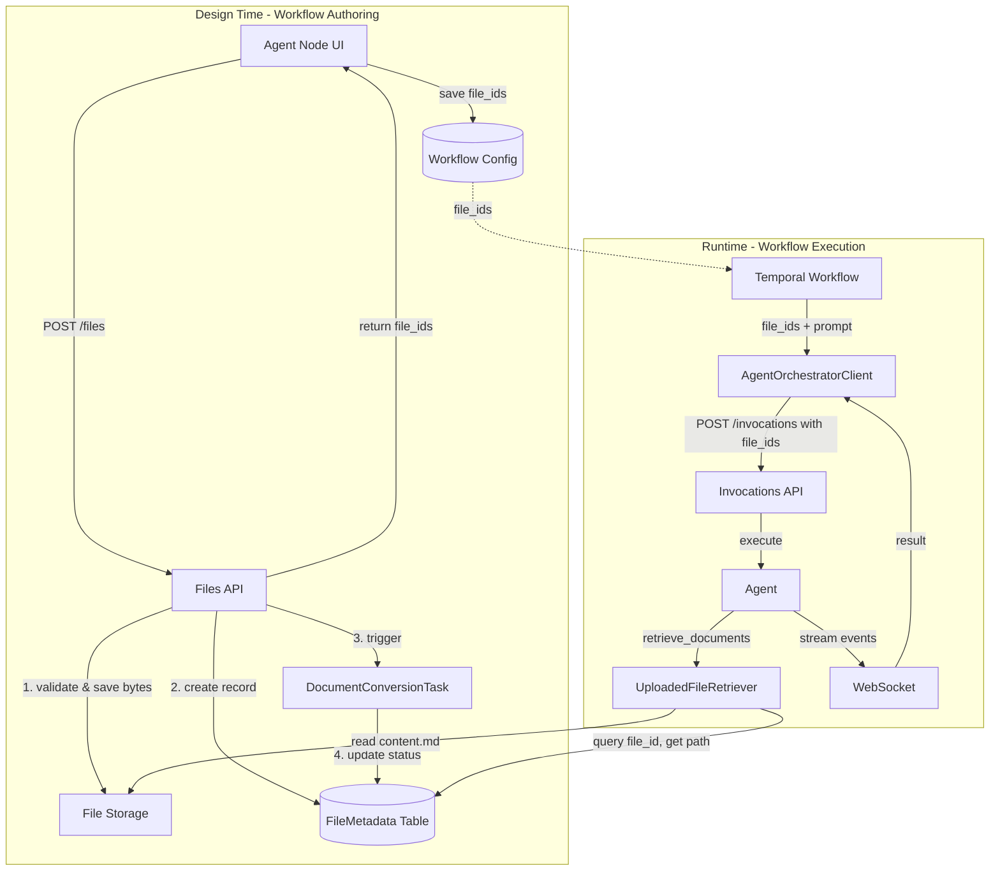

# Implementation Plan: Agent Node with File Context Support

**Branch**: `023-agent-node` | **Date**: 2025-12-11 | **Spec**: [specs/023-agent-node/spec.md](spec.md)
**Input**: Feature specification from `specs/023-agent-node/spec.md`

## Execution Flow (/plan command scope)
```
1. Load feature spec from Input path
   → If not found: ERROR "No feature spec at {path}"
2. Fill Technical Context (scan for NEEDS CLARIFICATION)
   → Detect Project Type from context (web=frontend+backend, mobile=app+api)
   → Set Structure Decision based on project type
3. Fill the Constitution Check section based on the content of the constitution document.
4. Evaluate Constitution Check section below
   → If violations exist: Document in Complexity Tracking
   → If no justification possible: ERROR "Simplify approach first"
   → Update Progress Tracking: Initial Constitution Check
5. Execute Phase 0 → research.md
   → If NEEDS CLARIFICATION remain: ERROR "Resolve unknowns"
6. Execute Phase 1 → schemas, data-model.md, quickstart.md, agent-specific template file (e.g., `CLAUDE.md` for Claude Code, `.github/copilot-instructions.md` for GitHub Copilot, `GEMINI.md` for Gemini CLI, `QWEN.md` for Qwen Code or `AGENTS.md` for opencode).
7. Re-evaluate Constitution Check section
   → If new violations: Refactor design, return to Phase 1
   → Update Progress Tracking: Post-Design Constitution Check
8. Plan Phase 2 → Describe task generation approach (DO NOT create tasks.md)
9. STOP - Ready for /tasks command
```

**IMPORTANT**: The /plan command STOPS at step 7. Phases 2-4 are executed by other commands:
- Phase 2: /tasks command creates tasks.md
- Phase 3-4: Implementation execution (manual or via tools)

## Summary

Enable Agent Node in workflows to accept file attachments that provide context for AI agent execution.

**Key Design Decision:** Files are **first-class entities** with their own lifecycle, managed independently from invocations. File metadata is persisted in a dedicated `FileMetadata` database table, not embedded in `Invocation.context_data`.

**Architectural Principle:** All file operations use `file_id` only. No `invocation_id` in the file management layer.

**What Already Exists (Verified 2025-12-16):**
- ✅ `POST /api/v1/invocations` - accepts files via multipart/form-data, returns HTTP 202
- ✅ `FileManager` - validation, storage, document conversion pipeline
- ✅ `DocumentConversionTask` - converts files to markdown (background task)
- ✅ `AgenticExecutorConfig` - has `prompt`, `agent`, `model`, `timeout`
- ✅ `AgentOrchestratorClient.invoke_agent()` - POSTs to `/invocations`
- ✅ **WebSocket streaming (server-side)** - `/ws/agent_orchestrator/v1/invocations/{id}` fully functional
- ✅ `agentic_activity` - Temporal activity that calls client

**What Needs to Change:**
- ❌ Files coupled to `invocation_id` - needs refactor to `file_id` only
- ❌ `FileMetadata` is Pydantic model stored in JSONB - needs SQLModel table
- ❌ No standalone file upload API - needs `POST /api/v1/files`
- ❌ `AgenticExecutorConfig` missing `file_ids` field
- ❌ Client expects terminal status from POST - **BUG**: API returns `created`, client raises error
- ❌ Client doesn't consume WebSocket - needs `stream_invocation()` method
- ❌ `UploadedFileRetriever` uses embedded `file_metadata` - needs to query DB by `file_id`

**Primary Changes (Ordered):**
1. **Create `FileMetadata` SQLModel table + Alembic migration** (new DB entity)
2. **Refactor `file_manager` to use `file_id` only** (remove `invocation_id` coupling, add `get_file_metadata()`, `get_files_metadata()`, `update_file_status()` methods)
3. **Add `POST /api/v1/files` endpoint** (design-time file uploads)
4. **Update `POST /api/v1/invocations`** to accept `file_ids`, remove `file_metadata` from response
5. **Update `DocumentConversionTask`** to use `FileManager.update_file_status()` (encapsulation)
6. **Update `UploadedFileRetriever`** to use `FileManager.get_files_metadata()` (encapsulation)
7. **Update `InvocationService`** to use `FileManager.get_files_metadata()` for validation (encapsulation)
8. **Add `file_ids` to `AgenticExecutorConfig`** (workflow config)
9. **Add `stream_invocation()` to `AgentOrchestratorClient`** (consume existing WebSocket)
10. **Update `agentic_activity`** to pass `file_ids` to client

**Encapsulation Principle:** All components (`DocumentConversionTask`, `InvocationService`, `UploadedFileRetriever`) access `FileMetadata` records through `FileManager` methods, not via direct database queries.

## Architecture Diagram



**Key Points:**
- `FileMetadata` table is the source of truth for file state (status, paths, metadata)
- `BaseRetriever` stores both original files and converted markdown on filesystem
- At runtime, `UploadedFileRetriever` queries DB for paths, then reads content from filesystem
- This protects DB from bloat (converted content can be large)
- `Invocation.context_data` only contains `file_ids` (references), not full metadata

## Agent Node → File Linkage

The Agent Node links to files through the workflow definition YAML/JSON:

```yaml
# Example workflow definition with Agent Node
activities:
  - name: analyze-documents
    type: agentic
    config:                           # This is AgenticExecutorConfig
      prompt: "Analyze the attached documents..."
      agent: document-analyst
      model: anthropic/claude-3.5-sonnet
      timeout: 300
      file_ids:                       # <-- File references stored here
        - "550e8400-e29b-41d4-a716-446655440001"
        - "550e8400-e29b-41d4-a716-446655440002"
```

**Linkage Flow:**

1. **UI uploads files** → `POST /api/v1/files` → returns `file_ids`
2. **UI saves workflow** → `file_ids` written into `AgenticExecutorConfig` in workflow YAML
3. **Workflow executes** → Temporal reads YAML → passes `config.file_ids` to agentic activity
4. **Activity invokes agent** → `file_ids` passed in `context_data` to `/invocations`
5. **Agent retrieves files** → `RetrieverService` → `UploadedFileRetriever.retrieve_documents()`

## Technical Context
**Language/Version**: Python 3.12
**Primary Dependencies**: FastAPI, SQLModel, httpx, websockets, temporalio
**Storage**: PostgreSQL with SQLModel ORM, Valkey for event streaming, filesystem for file uploads
**Testing**: pytest with pytest-asyncio
**Target Platform**: Linux server (containerized)
**Project Type**: single (monolithic backend)
**Performance Goals**: Real-time streaming via WebSocket (upload timeout requirements deferred)
**Constraints**: 10 MB max file size, 10 files max per request, allowed MIME types (PDF, DOC, DOCX, TXT, MD)
**Scale/Scope**: New API endpoint, file_manager refactor, client streaming - ~400-500 lines of code changes

## Constitution Check
*GATE: Must pass before Phase 0 research. Re-check after Phase 1 design.*

### Technology Standards Compliance
- [x] **SQLModel for Data Models**: Using SQLModel for any new file reference models

### Code Architecture Compliance
- [x] **DRY Principle**: Reusing existing `file_manager` validation, storage, document conversion
- [x] **SOLID Principles**:
  - Single Responsibility: Separating file upload API from invocation API
  - Open/Closed: Extending `file_manager` without breaking existing behavior
  - Dependency Inversion: `RetrieverService` uses `DocumentRetriever` interface (e.g., `UploadedFileRetriever`)
- [x] **Separation of Concerns**: Clear separation between design-time file upload and runtime invocation
- [x] **Dependency Injection**: File manager and retrievers injected as dependencies
- [x] **Composition vs Inheritance**: Using composition for file storage integration

### API Specification Standards Compliance
- [x] **OpenAPI/AsyncAPI Compliance**: New `/api/v1/files` endpoint will be documented
- [x] **Naming Convention**: Following existing snake_case patterns
- [x] **Documentation Completeness**: All new endpoints will have full OpenAPI docs
- [x] **RFC 9457 Error Format**: Following existing error handling patterns
- [x] **Error Message Safety**: Following existing patterns for safe error messages
- [x] **API Versioning**: Using existing `/api/v1/` path structure
- [x] **API Path Structure**: New `/api/v1/files` follows RESTful conventions
- [x] **Pagination Support**: N/A - file list not needed for MVP
- [x] **Filtering/Sorting Consistency**: N/A - no collection endpoints initially
- [x] **Security Documentation**: File upload limits and validation documented
- [x] **Schema Compatibility**: New optional `file_ids` parameter is backward compatible

## Project Structure

### Documentation (this feature)
```
specs/023-agent-node/
├── plan.md              # This file (/plan command output)
├── research.md          # Phase 0 output (/plan command)
├── data-model.md        # Phase 1 output (/plan command)
├── quickstart.md        # Phase 1 output (/plan command)
└── tasks.md             # Phase 2 output (/tasks command - NOT created by /plan)
```

### Source Code (changes only)
```
src/nexus/agent_orchestrator/models/
└── file_metadata.py              # NEW: FileMetadata SQLModel table

src/nexus/api/v1/
├── files.py                      # NEW: Standalone file upload endpoint
└── invocation.py                 # MODIFY: Accept file_ids in request, remove file_metadata from response

src/nexus/api/alembic/versions/
└── xxxx_add_file_metadata_table.py  # NEW: Alembic migration for FileMetadata

src/nexus/files/                  # NEW: Top-level component for file management
├── __init__.py                   # NEW
├── models/
│   ├── __init__.py               # NEW
│   └── file_metadata.py          # NEW: FileMetadata SQLModel table
├── services/
│   ├── __init__.py               # NEW
│   └── file_manager.py           # NEW: FileManager with DB record management
├── storage/
│   ├── __init__.py               # NEW
│   └── storage.py                # NEW: File storage with file_id only
└── document_conversion/
    ├── tasks/document_conversion_task.py  # MOVE: Update FileMetadata.status in DB
    └── services/document_conversion_service.py  # MOVE: Update FileMetadata.status in DB

src/nexus/agent_orchestrator/context_manager/retriever_service/
└── retrievers/uploaded_file_retriever.py  # MODIFY: Use file_ids, query FileMetadata table

src/nexus/agent_orchestrator/services/
└── invocation_service.py         # MODIFY: Orchestrate conversion and execution (decoupling)

src/nexus/agent_orchestrator/models/
└── invocation.py                 # MODIFY: Update context_data docstring (no file_metadata)

src/nexus/workflows/clients/
└── agent_orchestrator_client.py  # MODIFY: Add WebSocket streaming

src/nexus/workflows/workflow_engine/activities/
└── agentic_activity.py           # MODIFY: Pass file_ids to invoke_agent()

src/nexus/workflows/workflow_engine/models/
└── workflow_definition.py        # MODIFY: Add file_ids to AgenticExecutorConfig

src/nexus/schemas/agent_orchestrator/
└── agent-orchestrator-api.yaml   # MODIFY: Add /files endpoint, file_ids field

tests/unit/
├── api/v1/test_files.py                # NEW: File upload endpoint tests
├── files/models/test_file_metadata.py  # NEW: FileMetadata model tests
├── agent_orchestrator/context_manager/retriever_service/retrievers/test_uploaded_file_retriever.py  # MODIFY: Update for file_ids
└── workflows/clients/test_agent_orchestrator_client.py  # MODIFY: Add streaming tests

tests/integration/workflow/
└── test_agentic_activity_with_files.py  # NEW: End-to-end file context tests
```

### Frontend Code (nexus-ui) - Parallel Workstream
```
nexus-ui/packages/nexus-ui-framework/src/components/
├── FileUpload.tsx                        # NEW: Reusable file upload component with drag-drop
└── FileUploadItem.tsx                    # NEW: Individual file display with progress

nexus-ui/packages/nexus-ui/src/routes/builder/node-forms/
└── AIAgentNodeForm.tsx                   # MODIFY: Add file upload section and fileIds field

nexus-ui/packages/nexus-ui/src/
└── client.tsx                            # MODIFY: Add filesClient for /api/v1/files

nexus-ui/packages/nexus-contracts/src/
├── files-api.ts                          # NEW: Generated/defined types for files API
└── index.ts                              # MODIFY: Export FilesAPI namespace
```

**Structure Decision**: Option 1 (single project) - this is an existing monolithic backend

## Phase 0: Outline & Research
✓ COMPLETE - See [research.md](research.md)

**Key Findings (Backend - Code Review 2025-12-12, Updated 2025-12-16)**:
1. **file_manager**: `validate_and_save_files(files, invocation_id)` stores files as `nexus-{invocation_id}-{filename}` - refactor to use `file_id` only
2. **storage.py**: `save_file()` requires `invocation_id` param - replace with `file_id` param
3. **FileMetadata**: Currently a Pydantic model stored in `Invocation.context_data` - **convert to SQLModel table**
4. **WebSocket**: Full streaming at `/ws/agent_orchestrator/v1/invocations/{id}` with replay/resume support via query params
5. **AgentOrchestratorClient**: `invoke_agent()` expects terminal status from POST but POST returns `created` - need `stream_invocation()` method
6. **UploadedFileRetriever**: Currently uses embedded `file_metadata` from context - **update to query `FileMetadata` table by `file_id`**
7. **Invocations API**: `POST /invocations` supports multipart/form-data with files, stores metadata in `context_data.file_metadata` - **remove file_metadata, accept file_ids only**
8. **DocumentConversionService**: Updates file status but currently expects invocation context - **update to modify FileMetadata records in DB**

**Key Findings (Frontend)**:
1. React 19 + TypeScript 5.9 + Vite stack
2. `AIAgentNodeForm.tsx` exists at `nexus-ui/packages/nexus-ui/src/routes/builder/node-forms/` but has no file upload capability
3. No existing file upload component in `nexus-ui-framework` (flat component structure, not subdirectories)
4. Uses `react-hook-form` for form handling (via `Form` and `useFormContext` from framework)
5. Uses `openapi-fetch` and `openapi-react-query` for API calls (see `client.tsx`)
6. API contracts in `nexus-contracts` use namespace pattern (e.g., `WorkflowAPI`, `ToolsAPI`)
7. Workflow state managed by Zustand (`useWorkflowStore`)

## Phase 1: Design & Contracts
*Prerequisites: research.md complete*

### 1. Data Model Changes

**FileMetadata** (NEW SQLModel table - `src/nexus/files/models/file_metadata.py`):
```python
class FileStatus(str, Enum):
    """Status enum for file conversion lifecycle."""
    PENDING_CONVERSION = "pending_conversion"
    CONVERTING = "converting"
    CONVERTED = "converted"
    CONVERSION_FAILED = "conversion_failed"


class FileMetadata(BaseResource, table=True):
    """SQLModel for uploaded file metadata.

    Files are first-class entities with their own lifecycle,
    independent of invocations.

    Storage Strategy:
    - Original file bytes stored on filesystem via BaseRetriever
    - Converted text content stored on filesystem via BaseRetriever
    - Only paths stored in database (protects against DB bloat)
    """
    __tablename__ = "file_metadata"

    # File identification (id inherited from BaseResource as UUID primary key)
    filename: str = Field(max_length=255, description="Original filename")
    mime_type: str = Field(max_length=100, description="Detected MIME type")
    size_bytes: int = Field(ge=0, description="File size in bytes")

    # Storage paths (both via BaseRetriever - filesystem/S3/etc.)
    file_path: str = Field(max_length=500, description="Original file: nexus-{file_id}-{filename}")
    converted_content_path: str | None = Field(default=None, max_length=500, description="Converted markdown: nexus-{file_id}-content.md")

    # Conversion status
    status: FileStatus = Field(default=FileStatus.PENDING_CONVERSION)
    conversion_error: str | None = Field(default=None, description="Error message if conversion failed")

    # Inherited from BaseResource:
    # - id: UUID (primary key, used as file_id)
    # - created_at: datetime
    # - updated_at: datetime
```

**AgenticExecutorConfig** (`src/nexus/workflows/workflow_engine/models/workflow_definition.py`):
```python
class AgenticExecutorConfig(BaseModel):
    prompt: str
    agent: str | None = None
    model: str | None = None
    timeout: int = Field(default=constants.DEFAULT_AGENTIC_TIMEOUT_SECONDS, ge=1, le=3600)
    file_ids: list[str] = Field(default_factory=list, max_length=10)  # NEW: References to FileMetadata records
```

**Invocation.context_data** (breaking change - `file_metadata` removed):

**Before** (current implementation):
```python
context_data = {
    "file_metadata": [
        {"file_id": "...", "filename": "doc.pdf", "size_bytes": 1024, "mime_type": "...", ...}
    ]
}
```

**After** (new implementation):
```python
context_data = {
    "file_ids": ["550e8400-...", "550e8400-..."]  # References only
}
# FileMetadata is queried from the FileMetadata table, not stored here
```

**What's changing:**
- `file_metadata` array is **removed** from `context_data`
- Only `file_ids` (list of UUIDs) stored in `context_data`
- Full metadata lives in `FileMetadata` database table
- At runtime, `UploadedFileRetriever` queries the `FileMetadata` table by `file_id`

### 2. New Files API

**POST /api/v1/files** - Upload files at design time:
```python
@router.post("/files", response_model=FileUploadResponse)
async def upload_files(
    files: list[UploadFile],
    file_manager: FileManager = Depends(get_file_manager),
) -> FileUploadResponse:
    """Upload files for later use in agent invocations.

    Returns list of file_ids that can be stored in workflow config
    and passed to invocations at runtime.
    """
```

Response:
```python
class FileUploadResponse(BaseModel):
    file_ids: list[str]
    files: list[FileMetadataResponse]  # Excludes file_path for security
```

### 3. Invocations API Changes

**POST /api/v1/invocations** - Updated to accept `file_ids`:

**Request Changes**:
- Accept `file_ids` in `context_data` (list of UUIDs referencing pre-uploaded files)
- Continue supporting `multipart/form-data` for runtime file uploads
- Runtime uploads create `FileMetadata` records in DB (same as design-time)

```python
# JSON request with file_ids (pre-uploaded files)
{
    "prompt": "Analyze the attached documents",
    "sessionId": "session-123",
    "createdBy": "user-uuid",
    "contextData": {
        "file_ids": ["550e8400-...", "550e8400-..."]  # NEW: References to FileMetadata
    }
}
```

**Response Changes**:
- Response does NOT include `file_metadata` (metadata lives in `FileMetadata` table)
- Only `file_ids` are echoed back in response metadata if needed

**Behavior by Request Type**:
| Request Type | Conversion | Execution |
|--------------|------------|-----------|
| JSON with `file_ids` only | No (pre-converted) | Immediate |
| Multipart with file uploads only | Yes (creates FileMetadata in DB) | After conversion |
| Multipart with `file_ids` AND uploads | Yes (new uploads only) | After new file conversion |
| No files | No | Immediate |

### 4. Client Interface Changes

**Note:** WebSocket streaming already exists server-side at `/ws/agent_orchestrator/v1/invocations/{id}`. The client just needs to consume it.

**Current Bug:** `invoke_agent()` expects terminal status from POST response, but API returns `created` status. Fix: POST creates invocation → `stream_invocation()` consumes WebSocket until completion.

**AgentOrchestratorClient** (updated methods):
```python
class AgentOrchestratorClient:
    async def stream_invocation(
        self,
        invocation_id: str,
        on_event: Callable[[dict], None] | None = None,
    ) -> dict[str, Any]:
        """Connect to EXISTING WebSocket endpoint and stream until terminal state.

        WebSocket endpoint: /ws/agent_orchestrator/v1/invocations/{invocation_id}
        This endpoint already exists - this method just consumes it.
        """

    async def invoke_agent(
        self,
        prompt: str,
        user_id: str,
        session_id: str | None = None,
        agent: str | None = None,
        model: str | None = None,
        input_data: dict[str, Any] | None = None,
        metadata: dict[str, Any] | None = None,
        correlation_id: str | None = None,
        timeout_seconds: float | None = None,
        file_ids: list[str] | None = None,  # NEW: References to uploaded files
    ) -> dict[str, Any]:
        """Invoke agent with optional file context.

        Flow: POST /invocations → get invocation_id → stream_invocation() → return result
        """
```

**Invocation Response** (returned by `invoke_agent()` and `stream_invocation()`):
```python
# Final result after streaming completes
{
    "id": "770e8400-e29b-41d4-a716-446655440003",
    "status": "completed",  # or "failed", "cancelled"
    "result": "The analysis of the uploaded documents shows...",  # LLM response content
    "error_message": None,  # Populated if status is "failed"
    "created_at": "2025-12-11T10:30:00Z",
    "completed_at": "2025-12-11T10:30:45Z",
    "metadata": {
        "model": "anthropic/claude-3.5-sonnet",
        "tokens_used": 1234,
        "file_ids": ["550e8400-...", "550e8400-..."]  # Files that were processed
    }
}
```

**Agentic Activity Result** (returned to Temporal workflow):
```python
# execute_agentic_activity() returns this to the workflow
{
    "status": "completed",
    "result": "The analysis of the uploaded documents shows...",
    "invocation_id": "770e8400-e29b-41d4-a716-446655440003",
    "metadata": {
        "model": "anthropic/claude-3.5-sonnet",
        "tokens_used": 1234
    }
}
```

### 5. Retriever Service Changes

**Note:** `ContextManagerPlanner` does NOT need changes. File retrieval is handled by `UploadedFileRetriever` in the existing `retriever_service` layer.

**UploadedFileRetriever** - Update to use `file_ids` via `FileManager`:
```python
class UploadedFileRetriever(DocumentRetriever):
    """Already exists - update to use file_ids instead of file_metadata."""

    def __init__(self, file_manager: FileManager) -> None:
        self.file_manager = file_manager

    async def _retrieve_documents_impl(self, invocation_context: dict[str, Any]):
        # NEW: Extract file_ids from context (not file_metadata)
        file_ids = invocation_context.get("file_ids", [])

        # NEW: Use FileManager to get file records (encapsulation)
        async with session_factory() as session:
            file_records = await self.file_manager.get_files_metadata(file_ids, session)

        # Load content from converted_content_path via BaseRetriever
        for file_record in file_records:
            content = await retriever.load_file(file_record.converted_content_path)
            yield RelevantDocument(content=content, file_metadata=file_record)
```

**Key Points:**
- Existing architecture: `RetrieverService` → `UploadedFileRetriever` → `FileManager`
- Only `UploadedFileRetriever` needs changes (not `ContextManagerPlanner`)
- **Encapsulation**: Uses `FileManager.get_files_metadata()` instead of direct DB queries
- Reads content from filesystem (protects DB from bloat)

### 6. Test Scenarios from User Stories

| User Story | Test Scenario |
|------------|---------------|
| Upload files at design time | `test_upload_files_returns_file_ids()` |
| Multiple files uploaded | `test_upload_multiple_files()` |
| File validation (size/type) | `test_upload_rejects_invalid_file()` |
| Pass file_ids to invocation | `test_invoke_agent_with_file_ids()` |
| Agent retrieves file content | `test_agent_retrieves_files_by_id()` |
| Streaming response | `test_invoke_agent_streams_response_via_websocket()` |

## Phase 2: Task Planning Approach
*This section describes what the /tasks command will do - DO NOT execute during /plan*

**Task Generation Strategy**:
1. **Create `FileMetadata` SQLModel table** + Alembic migration (foundation)
2. Refactor `storage.py` to use `file_id` only (remove `invocation_id`)
3. Refactor `file_manager` to manage `FileMetadata` DB records (add `get_file_metadata()`, `get_files_metadata()`, `update_file_status()` methods)
4. Update `DocumentConversionTask` to use `FileManager.update_file_status()` (encapsulation)
5. Add `POST /api/v1/files` endpoint for design-time uploads
6. Update `Invocation` model docstring (remove `file_metadata` reference)
7. Update `UploadedFileRetriever` to use `FileManager.get_files_metadata()` (encapsulation)
8. Update `InvocationService` to use `FileManager.get_files_metadata()` for validation (encapsulation)
9. Add `file_ids` to `AgenticExecutorConfig`
10. Add `stream_invocation()` method to `AgentOrchestratorClient`
11. Update `invoke_agent()` to pass `file_ids` in context
12. Update agentic activity to pass `file_ids`
13. Write unit tests for `FileMetadata` model
14. Write unit tests for files API
15. Write unit tests for client streaming
16. Write integration tests for end-to-end flow

**Ordering Strategy**:
- `FileMetadata` model + migration first (foundation)
- Then storage refactor (use `file_id` only)
- Then `FileManager` methods (`get_file_metadata`, `get_files_metadata`, `update_file_status`)
- Then services that use FileManager (`DocumentConversionTask`, `InvocationService`, `UploadedFileRetriever`)
- Then Files API (design-time upload)
- Then client changes (streaming + `file_ids`)
- Then workflow changes (config → activity)
- Tests interspersed with implementation

**Encapsulation Note**: All components access `FileMetadata` through `FileManager` methods, not direct DB queries.

**Estimated Output**: 20 backend tasks (T001-T020) + 6 frontend tasks (T-FE01 to T-FE06) in tasks.md

**IMPORTANT**: This phase is executed by the /tasks command, NOT by /plan

## Phase 3+: Future Implementation
*These phases are beyond the scope of the /plan command*

**Phase 3**: Task execution (/tasks command creates tasks.md)
**Phase 4**: Implementation (execute tasks.md following constitutional principles)
**Phase 5**: Validation (run tests, execute quickstart.md, performance validation)

## Complexity Tracking
*No violations - design follows all constitutional principles*

| Violation | Why Needed | Simpler Alternative Rejected Because |
|-----------|------------|-------------------------------------|
| N/A | - | - |


## Progress Tracking
*This checklist is updated during execution flow*

**Phase Status**:
- [x] Phase 0: Research complete (/plan command)
- [x] Phase 1: Design complete (/plan command)
- [x] Phase 2: Task planning complete (/plan command - describe approach only)
- [x] Phase 3: Tasks generated (/tasks command) - 19 backend + 6 frontend tasks in tasks.md
- [ ] Phase 4: Implementation complete
- [ ] Phase 5: Validation passed

**Gate Status**:
- [x] Initial Constitution Check: PASS
- [x] Post-Design Constitution Check: PASS
- [x] All NEEDS CLARIFICATION resolved
- [x] Complexity deviations documented (none needed)

---
*Based on Constitution v1.2.0 - See `.specify/memory/constitution.md`*
