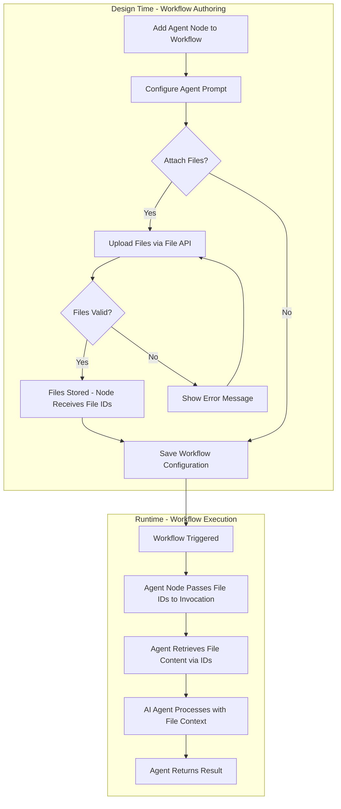
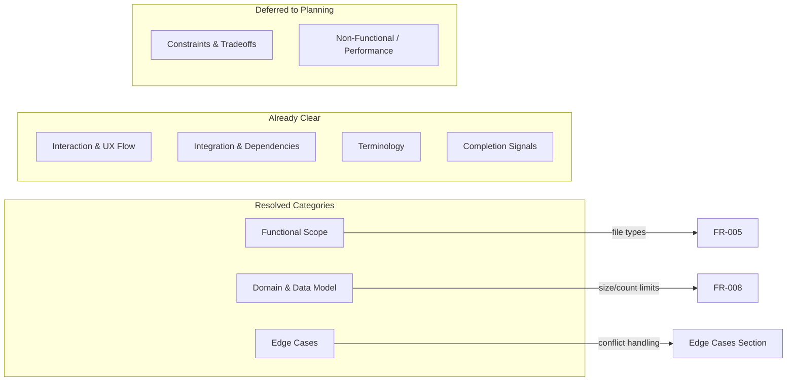

# Feature Specification: Agent Node with File Context Support

- **Feature Branch**: `023-agent-node`
- **Created**: 2025-12-11
- **Status**: Draft
- **Input**: User description: "Implement jira ticket AAP-60344. Use the context of it and its parent epic"
- **Jira Ticket**: [AAP-60344](AAP-60344) (Story) - Parent Epic: [AAP-57961](AAP-57961)

---

## Quick Guidelines
- Focus on WHAT users need and WHY
- Avoid HOW to implement (no tech stack, APIs, code structure)
- Written for business stakeholders, not developers

---

## User Scenarios & Testing

### Primary User Story
As an Automation Designer, I want to configure an "Agent" node in my workflow to perform complex tasks using AI and local files, so that I can delegate complex decision-making to an AI agent with additional context from uploaded files.

### Acceptance Scenarios

1. **Given** an Automation Designer is building a workflow, **When** they add an Agent node to the canvas, **Then** the node should be available in the workflow palette and configurable.

2. **Given** an Automation Designer has added an Agent node, **When** they configure the node, **Then** they should be able to provide a prompt/instructions for the AI agent.

3. **Given** an Agent node is configured, **When** the Automation Designer wants to provide additional context, **Then** they should be able to upload files to the node that the agent can reference during execution.

4. **Given** an Agent node with attached files, **When** the workflow executes, **Then** the AI agent should have access to the content of the uploaded files as context for completing its task.

### Edge Cases
- What happens when an uploaded file exceeds the maximum allowed size? (Maximum: 10 MB per file, per `file_upload_max_size_mb` configuration setting)
- How does the system handle when an uploaded file is corrupted or unreadable?
- What happens when the Agent node has no prompt configured but has files attached?
- How does the system behave when multiple files with conflicting information are uploaded? (No priority order; Agent receives all files equally and reconciles conflicts autonomously)

---

## Requirements

### Functional Requirements

- **FR-001**: System MUST allow Automation Designers to add an "Agent" node to their workflow.
- **FR-002**: System MUST allow Automation Designers to configure a prompt/instructions for the Agent node.
- **FR-003**: System MUST allow Automation Designers to upload files to an Agent node to provide context for the AI agent.
- **FR-004**: System MUST make uploaded file contents available to the AI agent during workflow execution.
- **FR-005**: System MUST validate uploaded files before accepting them. Allowed file types are defined by the `file_upload_allowed_mime_types` configuration setting (PDF, DOC, DOCX, TXT, MD).
- **FR-006**: System MUST pass file references to the agent invocation so the AI agent can retrieve file content.
- **FR-007**: System MUST provide feedback to the user when file upload is successful or fails.
- **FR-008**: System MUST enforce a maximum of 10 files per Agent node invocation (per `file_upload_max_files` configuration setting).

### Frontend Requirements

- **FR-009**: The Agent Node configuration form MUST include a file upload section where users can attach files.
- **FR-010**: The file upload UI MUST support drag-and-drop file selection.
- **FR-011**: The file upload UI MUST support manual file selection via file picker dialog.
- **FR-012**: The UI MUST display upload progress for each file being uploaded.
- **FR-013**: The UI MUST display clear error messages when file validation fails (wrong type, too large, too many files).
- **FR-014**: The UI MUST display a list of attached files with the ability to remove individual files.
- **FR-015**: The UI MUST persist file references (`file_ids`) when saving the workflow configuration.
- **FR-016**: The UI MUST display a browser confirmation dialog when the user attempts to navigate away with unsaved changes (including uploaded files not yet saved to the workflow).

### Non-Functional Requirements

- **NFR-001**: The AI agent should process uploaded file context during execution.
- **NFR-002**: File upload UI MUST provide responsive feedback (progress indicators, success/error states).

### Key Entities

- **Agent Node**: A workflow node type that delegates complex tasks to an AI agent. Contains a prompt/instructions and optionally attached files for context.
- **Attached Files**: Files uploaded by the Automation Designer to provide additional context to the Agent node during execution. Key attributes include file name, file type, file size, and file content.
- **Workflow**: The parent container that holds Agent nodes and other node types, representing an automation process.

---

## Context from Existing Implementation

Per comments on the parent epic ([AAP-57961](AAP-57961)), core Agent node infrastructure already exists:
- **Agentic activity** (`agentic_activity.py`) executes agents from workflows via `AgentOrchestratorClient`
- **Invocations API** (`POST /api/v1/invocations`) accepts prompts and returns HTTP 202 with invocation ID
- **File storage** (`file_manager`) handles validation, storage, and document conversion for uploaded files
- **WebSocket streaming** (`/ws/agent_orchestrator/v1/invocations/{id}`) delivers real-time events from agent execution
- **AgenticExecutorConfig** defines workflow node configuration (prompt, agent, model, timeout)

**Gaps Identified (Code Review 2025-12-12):**
1. **File uploads coupled to invocations** - `file_manager.validate_and_save_files()` requires `invocation_id`; no standalone upload API
2. **No design-time file API** - Files can only be uploaded during invocation creation, not at workflow design time
3. **AgenticExecutorConfig missing file_ids** - No field to store file references in workflow configuration
4. **Client lacks WebSocket streaming** - `AgentOrchestratorClient.invoke_agent()` expects terminal response from HTTP POST, but POST returns HTTP 202 with `created` status
5. **No file retrieval by ID** - `UploadedFileRetriever` uses embedded `file_metadata` from context; needs to query DB by `file_id`
6. **Frontend missing file upload** - `AIAgentNodeForm.tsx` has no file upload section

---

## Feature Flow Diagram

---

## Clarifications

### Session 2025-12-11
- Q: What file types should the system accept for Agent node uploads? → A: Use existing `file_upload_allowed_mime_types` setting (PDF, DOC, DOCX, TXT, MD)
- Q: What is the maximum file size and count? → A: Use existing settings: 10 MB per file (`file_upload_max_size_mb`), 10 files max (`file_upload_max_files`)
- Q: Should files with conflicting information have a priority order? → A: No priority; Agent receives all files equally and decides how to reconcile conflicts

### Clarification Coverage

---

## Review & Acceptance Checklist

### Content Quality
- [x] No implementation details (languages, frameworks, APIs)
- [x] Focused on user value and business needs
- [x] Written for non-technical stakeholders
- [x] All mandatory sections completed

### Requirement Completeness
- [x] No [NEEDS CLARIFICATION] markers remain
- [x] Requirements are testable and unambiguous
- [x] Success criteria are measurable
- [x] Scope is clearly bounded
- [x] Dependencies and assumptions identified

---

## Execution Status

- [x] User description parsed
- [x] Key concepts extracted
- [x] Ambiguities marked
- [x] User scenarios defined
- [x] Requirements generated
- [x] Entities identified
- [x] Review checklist passed

---
