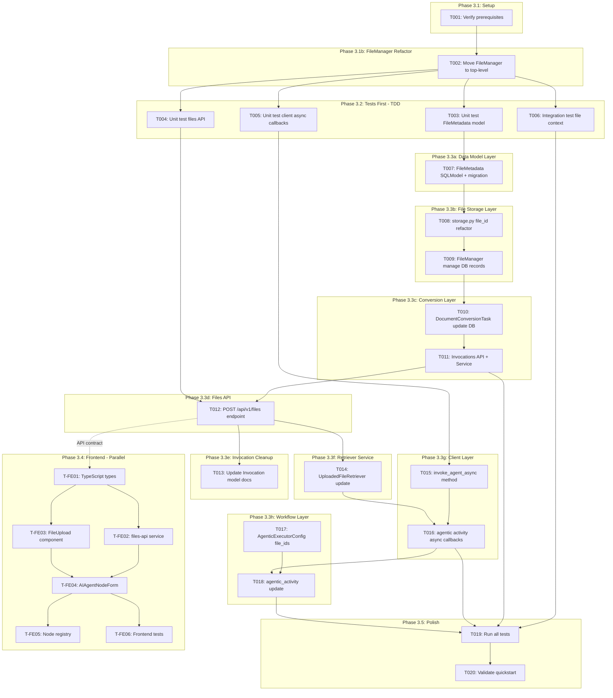
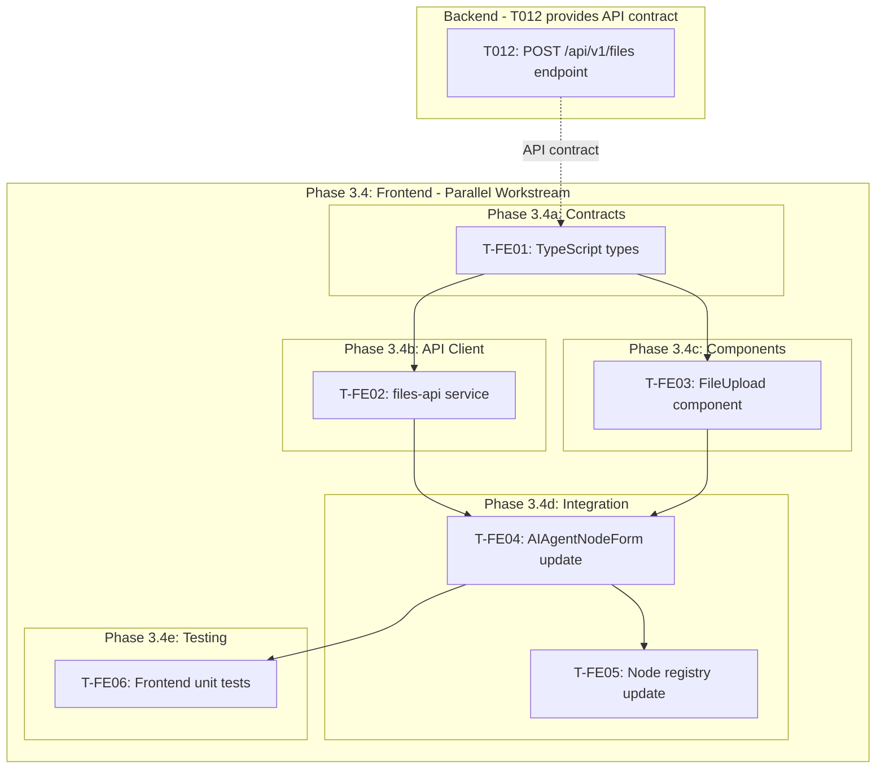

# Tasks: Agent Node with File Context Support

**Input**: Design documents from `/specs/023-agent-node/`
**Prerequisites**: plan.md (required), research.md, data-model.md, quickstart.md

---

## Task Dependency Diagram



---

## Phase 3.1: Setup

- [x] **T001** Verify prerequisites and branch setup
  - **File**: N/A (verification only)
  - **Actions**:
    1. Verify on branch `023-agent-node`
    2. Run `make lint` to ensure clean state
    3. Run `make test-all` to confirm baseline tests pass
    4. Verify all design documents exist in `specs/023-agent-node/`

---

## Phase 3.1b: FileManager Refactor (Single Source of Truth)

**CRITICAL: This refactor MUST be completed before any other implementation work. FileManager becomes the single source of truth for all file operations.**

- [X] **T002** Refactor FileManager to top-level `src/nexus/files/` module
  - **Current Location**: `src/nexus/agent_orchestrator/context_manager/file_manager/`
  - **Target Location**: `src/nexus/files/`
  - **Rationale**: FileManager should be a first-class, top-level component that is used by `agent_orchestrator`, `api`, and any other module needing file operations. Currently it's nested deep within `agent_orchestrator.context_manager`, making it appear as an implementation detail rather than a core service.
  - **Actions**:
    1. Create new directory structure:
       ```
       src/nexus/files/
       ├── __init__.py           # Export FileManager, FileMetadata, get_file_manager
       ├── file_manager.py       # FileManager class (from current __init__.py)
       ├── models/
       │   ├── __init__.py
       │   └── file_metadata.py  # FileMetadata Pydantic model (later becomes SQLModel in T007)
       ├── storage/
       │   ├── __init__.py
       │   └── storage.py        # save_file, delete_file functions
       ├── validators/
       │   ├── __init__.py
       │   ├── count.py
       │   ├── mime.py
       │   └── size.py
       ├── retrievers/
       │   ├── __init__.py
       │   ├── base.py
       │   └── local.py
       ├── utils.py
       └── document_conversion/  # Entire subtree moved
           ├── __init__.py
           ├── registry/
           ├── services/
           ├── tasks/
           └── converters/
       ```
    2. Move all files from `src/nexus/agent_orchestrator/context_manager/file_manager/` to `src/nexus/files/`
    3. Update all internal imports within the moved files to use `nexus.files.*`
    4. Update all external imports across the codebase:
       - `src/nexus/api/v1/invocation.py` - update file_manager imports
       - `src/nexus/agent_orchestrator/services/invocation_service.py` - update file_manager imports
       - `src/nexus/agent_orchestrator/context_manager/retriever_service/retrievers/uploaded_file_retriever.py` - update imports
       - Any other files importing from old location
    5. Move corresponding tests:
       - From: `tests/unit/file_manager/` → To: `tests/unit/files/`
       - From: `tests/unit/agent_orchestrator/context_manager/file_manager/` → To: `tests/unit/files/`
       - Update test imports accordingly
    6. Delete old directory `src/nexus/agent_orchestrator/context_manager/file_manager/` (after verifying all moved)
    7. Run `make lint && make typecheck && make test-all` to verify refactor is complete
    8. Commit with message: "refactor: Move FileManager to top-level src/nexus/files/ module"
  - **Depends on**: T001
  - **Blocks**: T003, T004, T005, T006 (all tests and implementation depend on new structure)
  - **Note**: This is a pure refactor - no behavioral changes. All existing functionality must continue to work.

---

## Phase 3.2: Tests First (TDD)

**CRITICAL: These tests MUST be written and MUST FAIL before ANY implementation**

- [x] **T003** [P] Unit test for FileMetadata SQLModel
  - **File**: `tests/unit/files/models/test_file_metadata.py` (NEW)
  - **Actions**:
    1. Create new test file for FileMetadata model tests
    2. Add test `test_file_metadata_create_with_defaults()`
    3. Add test `test_file_metadata_status_enum_values()`
    4. Add test `test_file_metadata_validates_required_fields()`
    5. Add test `test_file_metadata_inherits_base_resource_fields()` - id, created_at, updated_at
  - **Depends on**: T002 (refactor must complete first)
  - **Expected**: Tests fail (model not implemented yet)

- [x] **T004** [P] Unit test for Files API endpoint
  - **File**: `tests/unit/api/v1/test_files.py` (NEW)
  - **Actions**:
    1. Create new test file for files endpoint tests
    2. Add test `test_upload_single_file_returns_file_id()`
    3. Add test `test_upload_multiple_files_returns_file_ids()`
    4. Add test `test_upload_rejects_file_too_large()`
    5. Add test `test_upload_rejects_invalid_mime_type()`
    6. Add test `test_upload_rejects_too_many_files()`
    7. Add test `test_upload_creates_file_metadata_record()` - verify `FileMetadata` created in DB
    8. Add test `test_upload_triggers_document_conversion()` - verify `DocumentConversionTask` is scheduled
    9. Add test `test_file_status_updates_after_conversion()` - verify `FileMetadata.status` changes in DB
  - **Depends on**: T002 (refactor must complete first)
  - **Expected**: Tests fail (functionality not implemented yet)

- [ ] **T005** [P] Unit test for AgentOrchestratorClient async callbacks
  - **File**: `tests/unit/workflows/clients/test_agent_orchestrator_client.py` (NEW or MODIFY)
  - **Actions**:
    1. Create/modify test file for client tests
    2. Add test `test_invoke_agent_async_returns_pending_status()`
    3. Add test `test_invoke_agent_async_includes_callback_url()`
    4. Add test `test_invoke_agent_async_with_file_ids()`
    5. Add test `test_invoke_agent_async_timeout_handling()`
    6. Add test `test_activity_waits_for_signal_completion()`
  - **Depends on**: T002 (refactor must complete first)
  - **Expected**: Tests fail (functionality not implemented yet)

- [ ] **T006** [P] Integration test for end-to-end file context flow
  - **File**: `tests/integration/workflow/test_agentic_activity_with_files.py` (NEW)
  - **Actions**:
    1. Create new test file in `tests/integration/workflow/`
    2. Add test `test_upload_files_creates_db_records()`
    3. Add test `test_upload_files_then_invoke_agent()`
    4. Add test `test_agent_retrieves_file_metadata_from_db()`
    5. Add test `test_invoke_with_invalid_file_id_fails()`
    6. Add test `test_invoke_receives_signal_via_callback()`
  - **Depends on**: T002 (refactor must complete first)
  - **Expected**: Tests fail (functionality not implemented yet)

---

## Phase 3.3: Core Implementation

**Architecture Reminders**:
- Use SQLModel for all data models
- Follow SOLID principles
- Use dependency injection
- Maintain clear separation of concerns
- **FileMetadata is a first-class entity** - stored in DB, not in Invocation.context_data
- **Encapsulation Principle**: All components (`DocumentConversionTask`, `InvocationService`, `UploadedFileRetriever`) access `FileMetadata` through `FileManager` methods, not via direct database queries

### Phase 3.3a: Data Model Layer (Sequential)

- [x] **T007** Create FileMetadata SQLModel table and Alembic migration
  - **File**: `src/nexus/files/models/file_metadata.py` (MODIFY - convert Pydantic to SQLModel)
  - **Actions**:
    1. The `src/nexus/files/` structure already exists from T002 refactor
    2. Modify `file_metadata.py` to convert Pydantic model to SQLModel
    3. Define `FileStatus` enum: `PENDING_CONVERSION`, `CONVERTING`, `CONVERTED`, `CONVERSION_FAILED`
    4. Define `FileMetadata(BaseResource, table=True)` with fields:
       - `filename: str` (max 255)
       - `mime_type: str` (max 100)
       - `size_bytes: int`
       - `file_path: str` (max 500, original file: `nexus-{file_id}-{filename}`)
       - `converted_content_path: str | None` (max 500, converted markdown: `nexus-{file_id}-content.md`)
       - `status: FileStatus` (default: PENDING_CONVERSION)
       - `conversion_error: str | None` (error message if failed)
    5. Inherit `id`, `created_at`, `updated_at` from `BaseResource`
    6. Update `src/nexus/files/models/__init__.py` exports
    7. Run `alembic revision --autogenerate -m "add_file_metadata_table"`
    8. Review and apply migration with `alembic upgrade head`
  - **Depends on**: T003 (tests must exist first)
  - **Note**: Converted content stored on filesystem (not DB) to protect against bloat. Only paths stored in DB.

### Phase 3.3b: File Storage Layer (Sequential)

- [x] **T008** Refactor `save_file()` to use `file_id` only
  - **File**: `src/nexus/files/storage/storage.py` (MODIFY - already exists from T002)
  - **Actions**:
    1. Storage module already exists at `src/nexus/files/storage/` from T002 refactor
    2. Rename `invocation_id` parameter to `file_id`
    3. Update path pattern to use `nexus-{file_id}-{sanitized_filename}`
    4. Update logging to use `file_id`
    5. Update all existing callers to pass `file_id`
  - **Depends on**: T007
  - **Note**: Complete removal of `invocation_id` from file storage layer.

- [x] **T009** Refactor `FileManager` to manage FileMetadata DB records
  - **File**: `src/nexus/files/file_manager.py` (MODIFY - already exists from T002)
  - **Actions**:
    1. Add `session: AsyncSession` parameter to `__init__()` for DB access
    2. Remove `invocation_id` parameter from `validate_and_save_files()` - use `file_id` only
    3. After saving file bytes, create `FileMetadata` record in DB:
       ```python
       file_metadata = FileMetadata(
           id=file_id,  # Use generated file_id as primary key
           filename=original_filename,
           mime_type=mime_type,
           size_bytes=size,
           file_path=saved_path,
           status=FileStatus.PENDING_CONVERSION,
       )
       session.add(file_metadata)
       await session.commit()
       ```
    4. Add method `get_file_metadata(file_id: str, session: AsyncSession) -> FileMetadata | None`
    5. Add method `get_files_metadata(file_ids: list[str], session: AsyncSession) -> list[FileMetadata]`
    6. Add method `update_file_status(file_id: str, status: FileStatus, session: AsyncSession, converted_content_path: str | None = None, conversion_error: str | None = None) -> FileMetadata`
    7. Update existing callers to not pass `invocation_id`
  - **Depends on**: T008
  - **Note**: FileManager now owns all FileMetadata CRUD operations. All components must access FileMetadata through FileManager methods (encapsulation).

### Phase 3.3c: Conversion Layer (Sequential)

**Context**: Currently `DocumentConversionTask.convert()` calls `InvocationExecutor.execute_invocation()` in its `finally` block (line 311-313). This tightly couples conversion and execution. We need to decouple them so:
- Standalone file uploads (`POST /api/v1/files`) only trigger conversion and update `FileMetadata.status` in DB
- Invocations with `file_ids` (pre-converted) execute immediately

- [x] **T010** Update DocumentConversionTask/Service to use FileManager methods
  - **Files**:
    - `src/nexus/files/document_conversion/tasks/document_conversion_task.py`
    - `src/nexus/files/document_conversion/services/document_conversion_service.py`
  - **Actions**:
    1. Inject `FileManager` dependency (instead of direct DB access)
    2. Accept `file_id: str` instead of passing metadata in-memory
    3. Use `FileManager.get_file_metadata(file_id)` to get file record at start
    4. Use `FileManager.update_file_status(file_id, FileStatus.CONVERTING)` when starting
    5. On success:
       - Write converted markdown to filesystem via BaseRetriever: `nexus-{file_id}-content.md`
       - Use `FileManager.update_file_status(file_id, FileStatus.CONVERTED, converted_content_path=path)`
    6. On failure: use `FileManager.update_file_status(file_id, FileStatus.CONVERSION_FAILED, conversion_error=str(e))`
    7. Remove `_execute_invocation_after_conversion()` method - no longer needed
    8. Remove `finally` block that calls invocation execution
    9. Remove `invocation_executor_factory` parameter and related code
    10. Update class docstring to clarify this task is **only** for document conversion
  - **Depends on**: T009
  - **Rationale**: Uses FileManager for all FileMetadata operations (encapsulation). Converted content stored on filesystem (not DB) to protect against bloat.

- [x] **T011** Update Invocations API and InvocationService to handle file_ids
  - **Files**:
    - `src/nexus/api/v1/invocation.py`
    - `src/nexus/agent_orchestrator/services/invocation_service.py`
    - `src/nexus/schemas/agent_orchestrator/agent-orchestrator-api.yaml`
  - **Actions**:
    **API Endpoint (`invocation.py`):**
    1. Update request schema to accept `file_ids` in `context_data` (or as top-level field)
    2. Continue supporting multipart/form-data for runtime file uploads
    3. Ensure response does NOT include `file_metadata` (metadata lives in DB, not response)
    4. Update OpenAPI spec to document `file_ids` field in request
    **Service Layer (`invocation_service.py`):**
    5. Inject `FileManager` dependency
    6. Update `create_invocation()` to accept `file_ids` in `context_data`
    7. Remove any code that stores `file_metadata` in `context_data` (metadata lives in DB)
    8. Use `FileManager.get_files_metadata(file_ids)` to validate pre-uploaded file_ids exist
    9. Use `FileManager.validate_and_save_files(files)` to handle runtime file uploads
    10. Update logic:
       - **If `file_ids` only**: validate via FileManager, execute immediately
       - **If file uploads only (runtime)**: create FileMetadata via FileManager, convert, then execute
       - **If both `file_ids` AND file uploads**: validate file_ids via FileManager, create FileMetadata for new uploads, convert new files, then execute with all files
       - **If no files**: execute immediately
    11. Fix the bug: move background task scheduling from `finally` to after successful commit
  - **Depends on**: T010
  - **Rationale**: `InvocationService` uses `FileManager` for all file operations (encapsulation). Both `file_ids` (pre-uploaded) and runtime file uploads result in `FileMetadata` stored in DB, not `context_data`.

### Phase 3.3d: Files API (Sequential)

- [x] **T012** Create POST /api/v1/files endpoint
  - **File**: `src/nexus/api/v1/files.py` (NEW)
  - **Actions**:
    1. Create new router file `files.py`
    2. Define `FileMetadataResponse` schema (exclude `file_path` for security)
    3. Define `FileUploadResponse` schema with `file_ids` and `files` list
    4. Implement `POST /files` endpoint with multipart/form-data
    5. Inject `FileManager` and `AsyncSession` dependencies
    6. Call `file_manager.validate_and_save_files(files)` - creates `FileMetadata` records
    7. Schedule `DocumentConversionTask.convert(file_id)` as background task for each file
    8. Return `FileUploadResponse` with `file_ids` and metadata
    9. Register router in `src/nexus/api/v1/__init__.py`
    10. Handle errors with RFC 9457 format
    11. Update OpenAPI spec `src/nexus/schemas/agent_orchestrator/agent-orchestrator-api.yaml`
  - **Depends on**: T011, T004 (tests must exist)
  - **Note**: Files are converted at upload time (design time). FileMetadata stored in DB.

### Phase 3.3e: Invocation Cleanup (Sequential)

- [ ] **T013** Update Invocation model documentation
  - **File**: `src/nexus/agent_orchestrator/models/invocation.py`
  - **Actions**:
    1. Update `context_data` field docstring to remove `file_metadata` reference
    2. Document that `context_data` may contain `file_ids` (list of UUIDs)
    3. Add comment: "FileMetadata is stored in the FileMetadata table, not here"
  - **Depends on**: T012
  - **Note**: Documentation-only change to reflect new architecture.

### Phase 3.3f: Retriever Service (Sequential)

- [X] **T014** Update `UploadedFileRetriever` to use `file_ids` via FileManager
  - **File**: `src/nexus/agent_orchestrator/context_manager/retriever_service/retrievers/uploaded_file_retriever.py`
  - **Note**: `UploadedFileRetriever` already exists and handles file retrieval from `context_data.file_metadata` (embedded Pydantic objects). Update to use `file_ids` instead and access `FileMetadata` via `FileManager`.
  - **Key design decision**: `context_data` contains only `file_ids` (UUIDs), not hydrated `FileMetadata` objects. The retriever uses `FileManager` to get full records (encapsulation). This keeps `Invocation.context_data` lean and makes `FileMetadata` table the single source of truth.
  - **Actions**:
    1. Inject `FileManager` dependency
    2. Change `retrieve_documents()` to extract `file_ids` from `invocation_context` (not `file_metadata`)
    3. Use `FileManager.get_files_metadata(file_ids, session)` to get file records (NOT direct DB query)
    4. Validate all requested files exist - raise error if any missing
    5. Validate all files have `status == CONVERTED` - raise error if conversion pending/failed
    6. Read content from `converted_content_path` via `FileManager.get_retriever_for_file()`
    7. Return `RelevantDocument` objects with loaded content
    8. Update unit tests to reflect new flow
  - **Depends on**: T012
  - **Rationale**: Uses `FileManager.get_files_metadata()` for encapsulation (not direct DB query). Keeps file retrieval in `retriever_service` layer (existing architecture). `ContextManagerPlanner` does NOT need changes.

### Phase 3.3g: Client Layer (Sequential)

- [ ] **T015** Add `invoke_agent_async()` method to AgentOrchestratorClient
  - **File**: `src/nexus/workflows/clients/agent_orchestrator_client.py`
  - **Note**: Async callback system (PR #271) already exists with signal endpoint `/executions/{execution_id}/activities/{activity_id}/signal` and Temporal signal handling.
  - **Actions**:
    1. Add new method `invoke_agent_async(prompt, user_id, metadata, file_ids, ...)`
    2. Include `callback_url` from metadata in POST request to `/invocations`
    3. Return immediately with `{id: "inv-123", status: "pending", metadata: {...}}`
    4. No blocking or waiting for completion (handled by workflow signals)
    5. Support `file_ids` parameter for context
    6. Handle HTTP errors and timeouts for the POST request
  - **Depends on**: T005 (tests must exist first)
  - **Rationale**: Replaces synchronous `invoke_agent()` with async pattern. New flow: POST with callback_url → return immediately → Agent Orchestrator calls back when done → workflow continues via signal.

- [ ] **T016** Update agentic activity for async callbacks and signal waiting
  - **File**: `src/nexus/workflows/workflow_engine/activities/agentic_activity.py`
  - **Actions**:
    1. Generate callback URL using `generate_activity_signal_url(execution_id, activity_id)`
    2. Call `invoke_agent_async()` with `file_ids` and callback_url in metadata
    3. Use `workflow.wait_condition()` to wait for signal from Agent Orchestrator
    4. Return result data from signal payload when received
    5. Handle timeout and error scenarios for signal waiting
  - **Depends on**: T015, T014

### Phase 3.3h: Workflow Layer (Sequential)

- [ ] **T017** [P] Add `file_ids` to AgenticExecutorConfig
  - **File**: `src/nexus/workflows/workflow_engine/models/workflow_definition.py`
  - **Actions**:
    1. Add field: `file_ids: list[str] = Field(default_factory=list, max_length=10, description="List of file IDs to include as context")`
    2. Add Pydantic validator to check each `file_id` is valid UUID format
    3. Update docstring to document the new field
    4. Note: `max_length=10` enforces the file count limit at design time
  - **Can run in parallel with**: T015, T016 (different files)
  - **Note**: File existence is validated at runtime by `UploadedFileRetriever` when retrieving documents

- [ ] **T018** Update agentic activity to pass `file_ids` and add heartbeat
  - **File**: `src/nexus/workflows/workflow_engine/activities/agentic_activity.py`
  - **Actions**:
    1. Extract `file_ids` from `config` in `execute_agentic_activity()`
    2. Pass `file_ids` to `agent_client.invoke_agent()`
    3. Add heartbeat loop for long-running LLM calls:
       - Create background task that calls `activity.heartbeat()` every 30 seconds
       - Start heartbeat task before calling `invoke_agent()`
       - Cancel heartbeat task in `finally` block after invocation completes
    4. Pass `timeout_seconds=config.timeout` to `invoke_agent()`
  - **Depends on**: T017, T016
  - **Rationale**: Heartbeat in activity layer keeps `AgentOrchestratorClient` as a general-purpose client without Temporal coupling.

---

## Phase 3.5: Polish

- [ ] **T019** Run all tests and fix any failures
  - **File**: N/A (validation)
  - **Actions**:
    1. Run `make test-all` - all tests should pass
    2. Run `make lint` - no linting errors
    3. Run `make typecheck` - type checking passes
    4. Fix any issues discovered
  - **Depends on**: T006, T011, T016, T018

- [ ] **T020** Validate quickstart scenarios
  - **File**: `specs/023-agent-node/quickstart.md`
  - **Actions**:
    1. Start API with `make run-api`
    2. Test Scenario 1: Upload files via POST /files - verify `FileMetadata` record created in DB
    3. Test Scenario 2: Invoke agent with file_ids - verify files retrieved from DB
    4. Test Scenario 3: Verify async callback response via signal
    5. Document any issues found
  - **Depends on**: T019

---

## Phase 3.4: Frontend (Parallel Workstream)

**IMPORTANT:** These tasks can run in parallel with backend tasks (Phase 3.3). They depend only on the Files API being defined (T012 for contract), not implemented.

### Phase 3.4a: Contracts & Types

- [ ] **T-FE01** [P] Create TypeScript types for Files API
  - **File**: `nexus-ui/packages/nexus-contracts/src/files-api.ts` (NEW)
  - **Actions**:
    1. Create new file `files-api.ts` following existing namespace pattern (e.g., `WorkflowAPI`)
    2. Define `FilesAPI` namespace with `paths` and `components` types
    3. Define `FileMetadataResponse` interface matching OpenAPI spec
    4. Define `FileUploadResponse` interface
    5. Update `nexus-ui/packages/nexus-contracts/src/index.ts` to export `FilesAPI`
  - **Can run in parallel with**: All backend tasks (different codebase)

### Phase 3.4b: API Client

- [ ] **T-FE02** Add Files API client to client.tsx
  - **File**: `nexus-ui/packages/nexus-ui/src/client.tsx` (MODIFY)
  - **Actions**:
    1. Import `FilesAPI` from `@ansible/nexus-contracts`
    2. Create `filesFetchClient` using `createFetchClient<FilesAPI.paths>`
    3. Export `filesClient` using `createClient(filesFetchClient)`
    4. Note: multipart/form-data upload may require custom fetch wrapper for progress tracking
  - **Depends on**: T-FE01

### Phase 3.4c: Reusable Components

- [ ] **T-FE03** Create FileUpload components in nexus-ui-framework
  - **Files**:
    - `nexus-ui/packages/nexus-ui-framework/src/components/FileUpload.tsx` (NEW)
    - `nexus-ui/packages/nexus-ui-framework/src/components/FileUploadItem.tsx` (NEW)
  - **Actions**:
    1. Create `FileUpload.tsx` with drag-and-drop support (flat file, not subdirectory)
    2. Create `FileUploadItem.tsx` for individual file display with progress
    3. Export both from `nexus-ui/packages/nexus-ui-framework/src/index.tsx`
    4. Support props: `onFilesSelected`, `maxFiles`, `maxSizeBytes`, `acceptedMimeTypes`
    5. Display validation errors inline
    6. Support removing individual files from list
    7. Add unit tests: `FileUpload.test.tsx` and `FileUploadItem.test.tsx`
  - **Depends on**: T-FE01 (types for props)

### Phase 3.4d: Node Form Integration

- [ ] **T-FE04** Add file upload section to AIAgentNodeForm
  - **File**: `nexus-ui/packages/nexus-ui/src/routes/builder/node-forms/AIAgentNodeForm.tsx`
  - **Actions**:
    1. Import `FileUpload`, `FileUploadItem` from `@ansible/nexus-ui-framework`
    2. Import `filesClient` from `../../client` (or create upload helper)
    3. Add `fileIds: string[]` field to `AIAgentFormData` interface
    4. Add file upload section below prompt configuration
    5. Handle file upload on selection (POST to /api/v1/files)
    6. Display upload progress using FileUploadItem
    7. Store returned `file_ids` in form state via `setValue('fileIds', ...)`
    8. Display list of attached files with remove capability
    9. Persist `file_ids` to node configuration on form submit
    10. Implement unsaved changes warning (browser `beforeunload` event) when user has uploaded files but not saved the workflow
  - **Depends on**: T-FE02, T-FE03

- [ ] **T-FE05** Update node registry for file_ids support
  - **File**: `nexus-ui/packages/nexus-ui/src/routes/builder/registry/nodes/registerAIAgentNode.ts` (or similar)
  - **Actions**:
    1. Update AI Agent node registration to include `file_ids` in default data
    2. Ensure `file_ids` is serialized/deserialized correctly in workflow JSON
    3. Add default value (empty array) for `file_ids`
  - **Depends on**: T-FE04

### Phase 3.4e: Frontend Testing

- [ ] **T-FE06** Write frontend unit tests
  - **Files**:
    - `nexus-ui/packages/nexus-ui-framework/src/components/FileUpload.test.tsx` (NEW)
    - `nexus-ui/packages/nexus-ui-framework/src/components/FileUploadItem.test.tsx` (NEW)
    - `nexus-ui/packages/nexus-ui/src/routes/builder/node-forms/AIAgentNodeForm.test.tsx` (NEW - follows existing pattern)
  - **Actions**:
    1. Test FileUpload component renders correctly
    2. Test drag-and-drop file selection
    3. Test file validation (size, type, count)
    4. Test file removal
    5. Test AIAgentNodeForm with file upload section
    6. Test form saves `file_ids` correctly
    7. Mock API calls using MSW (project standard)
  - **Depends on**: T-FE04

---

## Frontend Dependencies Summary

| Task | Depends On | Blocks |
|------|------------|--------|
| T-FE01 | - | T-FE02, T-FE03 |
| T-FE02 | T-FE01 | T-FE04 |
| T-FE03 | T-FE01 | T-FE04 |
| T-FE04 | T-FE02, T-FE03 | T-FE05, T-FE06 |
| T-FE05 | T-FE04 | - |
| T-FE06 | T-FE04 | - |

---

## Frontend Task Dependency Diagram



---

## Dependencies Summary

| Task | Depends On | Blocks |
|------|------------|--------|
| T001 | - | T002 |
| T002 | T001 | T003, T004, T005, T006 |
| T003 | T002 | T007 |
| T004 | T002 | T012 |
| T005 | T002 | T015 |
| T006 | T002 | T019 |
| T007 | T003 | T008 |
| T008 | T007 | T009 |
| T009 | T008 | T010 |
| T010 | T009 | T011 |
| T011 | T010 | T012, T019 |
| T012 | T011, T004 | T013, T014 |
| T013 | T012 | - |
| T014 | T012 | T016 |
| T015 | T005 | T016 |
| T016 | T015, T014 | T018, T019 |
| T017 | - | T018 |
| T018 | T017, T016 | T019 |
| T019 | T006, T011, T016, T018 | T020 |
| T020 | T019 | - |

---

## Parallel Execution Examples

### After T002 completes - Launch 4 test tasks in parallel:
```
Task: "Unit test for FileMetadata model in tests/unit/files/models/test_file_metadata.py" (T003)
Task: "Unit test for Files API endpoint in tests/unit/api/v1/test_files.py" (T004)
Task: "Unit test for AgentOrchestratorClient async callbacks in tests/unit/workflows/clients/test_agent_orchestrator_client.py" (T005)
Task: "Integration test for file context flow in tests/integration/workflow/test_agentic_activity_with_files.py" (T006)
```

### T017 can run in parallel with T015/T016 (different files):
```
# These can run concurrently:
Task: "Add file_ids to AgenticExecutorConfig in src/nexus/workflows/workflow_engine/models/workflow_definition.py" (T017)
Task: "Add invoke_agent_async() method in src/nexus/workflows/clients/agent_orchestrator_client.py" (T015)
```

---

## Validation Checklist

### Backend Tasks
- [x] All test scenarios from quickstart have corresponding test tasks
- [x] All entities from data-model have implementation tasks
- [x] All tests come before implementation (TDD)
- [x] Parallel tasks truly independent (different files)
- [x] Each task specifies exact file path
- [x] No task modifies same file as another [P] task
- [x] Dependency diagram included (mermaid extension)
- [x] **FileManager refactored to top-level src/nexus/files/ (T002)**
- [x] **FileMetadata SQLModel table created (T007)**
- [x] **Alembic migration included (T007)**
- [x] **FileMetadata managed by FileManager, not stored in Invocation (T009)**
- [x] **DocumentConversionTask uses FileManager.update_file_status() (T010)**
- [x] **InvocationService uses FileManager.get_files_metadata() for validation (T011)**
- [x] **UploadedFileRetriever uses FileManager.get_files_metadata() (T014)**
- [x] **Invocation.context_data only holds file_ids, not file_metadata (T013)**
- [x] **Encapsulation: All components access FileMetadata through FileManager methods**

### Frontend Tasks
- [x] Frontend tasks in separate phase (3.4) for parallel delivery
- [x] TypeScript types defined before components (T-FE01)
- [x] API client created before form integration (T-FE02)
- [x] Reusable component in framework package (T-FE03)
- [x] Node form integration references all requirements (T-FE04)
- [x] Frontend tests included (T-FE06)
- [x] Frontend dependency diagram included

---

## Notes

- **[P]** tasks = different files, no dependencies, can run in parallel
- Verify tests fail before implementing (TDD discipline)
- Commit after each task completion
- Run `make lint && make typecheck` before committing
- New `/api/v1/files` endpoint needs OpenAPI documentation
- **Architecture Decision**: `FileMetadata` is a SQLModel table, not JSONB in `Invocation.context_data`
- **Key Principle**: All file operations use `file_id` only - no `invocation_id` in file layer
- **Encapsulation Principle**: All components access `FileMetadata` through `FileManager` methods (`get_file_metadata`, `get_files_metadata`, `update_file_status`), not via direct database queries
- **FileManager as Single Source of Truth**: T002 establishes `src/nexus/files/` as the top-level module for all file operations before any feature work begins
- **Total Backend Tasks**: 20 (T001-T020)
- **Total Frontend Tasks**: 6 (T-FE01 to T-FE06)
