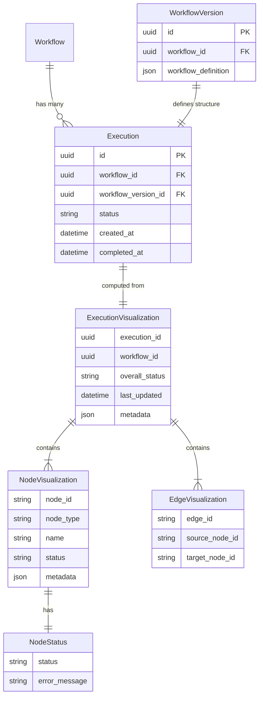
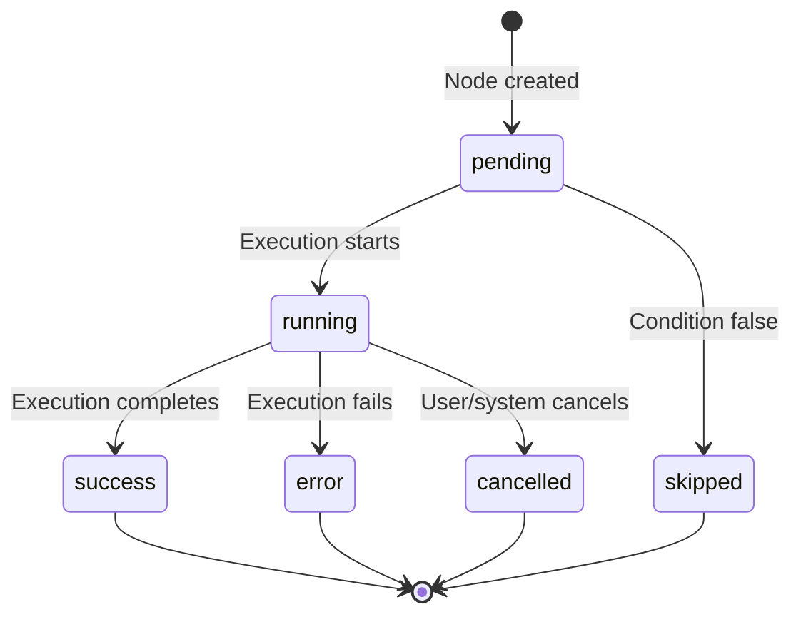
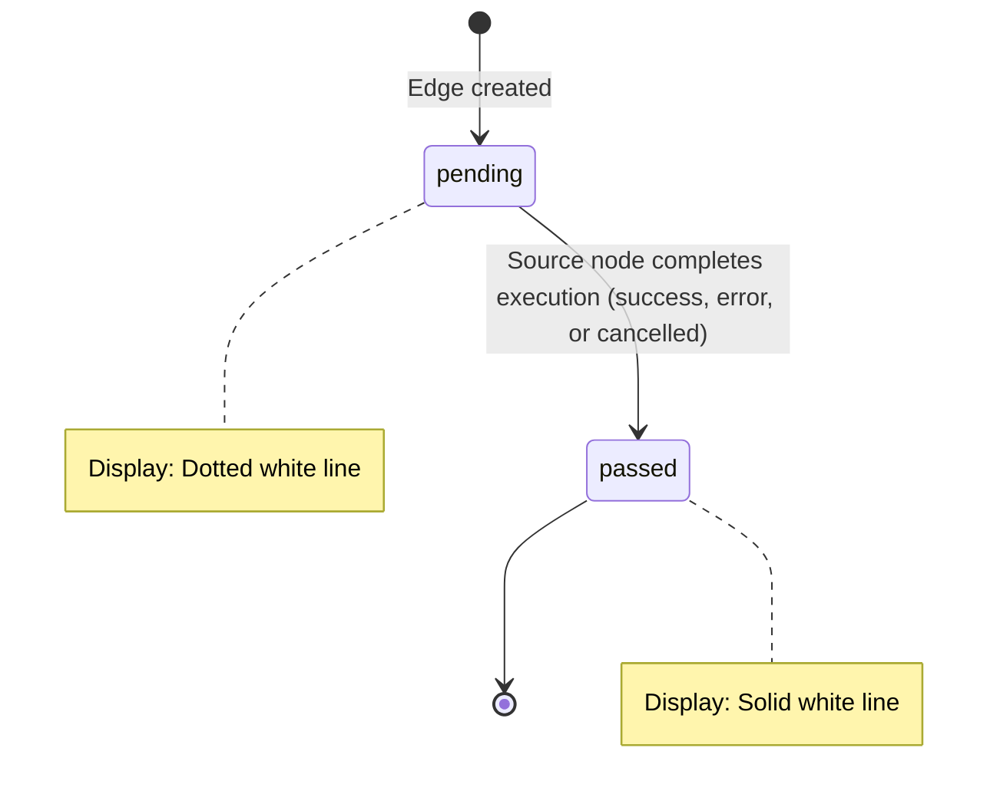

# Data Model: Visualize Workflow Execution

**Feature**: Visualize Workflow Execution | **Date**: 2025-12-10
**Status**: Complete

---

## Overview

This document defines the data models for real-time workflow execution visualization. The visualization graph is **computed client-side** from existing data models - no new database tables are required.

---

## 1. Conceptual Data Model

> **Note**: The visualization graph is **computed client-side** from existing data models - no new database tables are required. ExecutionVisualization, NodeVisualization, and EdgeVisualization are TypeScript/Python schema types, not database entities.



**Data Sources**:
- **Graph structure** (nodes, edges): Derived from `WorkflowVersion.workflow_definition`
- **Node status**: TASK nodes from `ActivityExecution` table; CONDITION/LOOP/CONVERGE from workflow execution state
- **Edge status**: Derived client-side from source node status (see Section 2.4)

---

## 2. Backend Models (Python/SQLModel)

### 2.1 Node Type (Frontend Mapping from Existing Enums)

The frontend derives `node_type` from existing backend enums in `workflow_definition`. No new backend enums are needed.

**Existing Backend Enums** (`src/nexus/workflows/workflow_engine/models/workflow_definition.py`):
- `ActivityType`: TASK, PARALLEL, SEQUENCE, CONDITION, LOOP, CONVERGE
- `ExecutorType`: SCRIPT, API, AGENTIC, AAP_JOB_TEMPLATE

**Frontend Node Type Mapping** (implemented in frontend, not backend):

| ActivityType | ExecutorType | Frontend `node_type` | Notes |
|--------------|--------------|----------------------|-------|
| `TASK` | `AGENTIC` | `"agent"` | AI agent execution |
| `TASK` | `SCRIPT` | `"script"` | Script execution (bash/python) |
| `TASK` | `API` | `"api"` | HTTP API call |
| `TASK` | `AAP_JOB_TEMPLATE` | `"aap_job_template"` | Ansible Automation Platform job |
| `CONDITION` | - | `"condition"` | Conditional branching |
| `LOOP` | - | `"loop"` | Iteration construct |
| `CONVERGE` | - | `"converge"` | Wait for parallel branches |
| `PARALLEL` | - | *(not a node)* | Structural - defines parallel branching |
| `SEQUENCE` | - | *(not a node)* | Structural - defines sequential steps |

**Note**: `PARALLEL` and `SEQUENCE` are structural activity types that define branching/ordering but are not rendered as individual nodes in the visualization. Only the activities within them are rendered.

**Note**: The frontend already implements this mapping in the workflow builder. The execution visualizer reuses the same node rendering logic.

### 2.2 Node Status (Uses ActivityStatus Directly)

The frontend uses `ActivityStatus` values directly from the database. No separate visualization enum is needed since the mapping is nearly 1-to-1.

**ActivityStatus Enum** (`src/nexus/workflows/models/activity_execution.py`):

```python
class ActivityStatus(str, Enum):
    PENDING = "pending"
    RUNNING = "running"
    COMPLETED = "completed"
    FAILED = "failed"
    RETRYING = "retrying"
    SKIPPED = "skipped"
    CANCELLED = "cancelled"
```

**Display Mapping for Visualization**:

| ActivityStatus | Display Label | UI Indicator |
|----------------|---------------|--------------|
| `PENDING` | pending | Gray border, ellipsis badge |
| `RUNNING` | running | Blue border, spinner badge |
| `RETRYING` | running | Blue border, spinner badge |
| `COMPLETED` | success | Green border, checkmark badge |
| `FAILED` | error | Red border, exclamation badge |
| `SKIPPED` | skipped | Gray dashed border, skip arrow badge |
| `CANCELLED` | cancelled | Orange border, stop badge |

**Note**: The frontend StatusBadge component handles the display label mapping (e.g., `COMPLETED` → "success", `FAILED` → "error"). No separate Python enum is required.

### 2.3 Edge Status (Client-Side Only)

> **Note**: Edge status is computed entirely client-side. No Python enum is needed on the backend since edge status is never sent from the server - it is derived from node status in the frontend.

### 2.4 Edge Status Derivation (Client-Side)

**Edge status is computed client-side** from source and target node status. No server broadcast required.

| Source Node Status | Target Node Status | Edge Status | Visual |
|--------------------|-------------------|-------------|--------|
| `pending` | `pending` | `pending` | Dotted white line |
| `pending` | * | `pending` | Dotted white line |
| `running` | `pending` | `pending` | Dotted white line |
| `running` | * | `pending` | Dotted white line |
| `success` | * | `passed` | Solid white line |
| `error` | * | `passed` | Solid white line |
| `skipped` | `skipped` | `pending` | Dotted white line (dimmed) |
| `cancelled` | * | `passed` | Solid white line |

**Note**: Edge status reflects whether the boundary has been passed (source node completed execution), not the success/failure of the transition. Node status indicators show success/error states.

**Implementation**: `useEdgeStatus` hook in frontend derives status using these rules.

---

## 3. WebSocket Message Schemas

> **Note**: Initial state is delivered via WebSocket on connection using `ExecutionSnapshotMessage`. Clients can replay from any `event_id` using the `replay=<event_id>` WebSocket parameter.

### 3.1 Activity Patch Message (JSON Patch - RFC 6902)

Sent when activity state changes. Uses JSON Patch format for idempotency and ordering guarantees.

```python
from typing import Any, Literal
from uuid import UUID

class JsonPatchOperation(BaseModel):
    """Single JSON Patch operation per RFC 6902."""
    op: Literal["add", "remove", "replace", "move", "copy", "test"]
    path: str  # JSON Pointer using activity IDs (e.g., "/activities/process_data/status")
    value: Any | None = None  # Required for add, replace, test
    from_: str | None = Field(default=None, alias="from")  # Required for move, copy

class ActivityPatchMessage(BaseModel):
    """Activity state update using JSON Patch format."""
    type: str = "activity_patch"
    execution_id: str
    event_id: str  # Valkey auto-generated stream ID (format: "{milliseconds}-{sequence}")
    ops: list[JsonPatchOperation]  # One or more patch operations
    timestamp: datetime  # Timestamp when this patch was generated
```

**Key Features**:
- **Idempotency**: `replace` and `test` operations are safe to retry
- **Ordering**: `event_id` is Valkey's auto-generated stream ID (format: `1691431234567-1`) providing time-ordered identifiers
- **Replay Support**: Clients can reconnect with `replay=<event_id>` to get all events after that event
- **Atomicity**: If any `test` operation fails, the entire patch is rejected
- **Path format**: Uses activity IDs (e.g., `/activities/process_data/status`)
- **Initial State**: On first connection (or `replay` from beginning), first message is an `ExecutionSnapshotMessage` containing the full execution state

**Note**: Edge status is NOT broadcast. Edge status is computed client-side from node status using the derivation rules in Section 2.4.

### 3.2 Execution Snapshot Message

Sent as the first message (type="initial_snapshot") when a client connects with `replay=0` (replay from beginning),
and as the last message (type="final_snapshot") when execution completes. Contains the full execution state including activities.

> **IMPORTANT**: The `execution` field contains the same `Execution` schema returned by the REST API `GET /executions/{id}?include=activities`. This allows the UI to use unified logic for processing execution data from both WebSocket and REST sources.

```python
from typing import Literal

class ExecutionSnapshotMessage(BaseModel):
    """Full execution snapshot sent as first or last message."""
    type: Literal["initial_snapshot", "final_snapshot"]
    execution_id: str
    event_id: str  # Valkey stream ID of this snapshot event
    execution: Execution  # Same as REST API GET /executions/{id}?include=activities
    timestamp: datetime  # Timestamp when this snapshot was generated
```

**Key Features**:
- **Complete State**: Contains all execution data including activities with their current status
- **Type Variants**:
  - `"initial_snapshot"`: First message when replaying from beginning
  - `"final_snapshot"`: Last message when execution completes, server disconnects after sending
- **REST API Compatibility**: The `execution` field is the same `Execution` schema from `GET /executions/{id}?include=activities`
- **Unified UI Logic**: UI can use the same data processing code for both WebSocket snapshots and REST responses
- **Replay Marker**: The `event_id` allows clients to resume from this point
- **Server Disconnection**: After sending final_snapshot, server closes the WebSocket connection

**Schema Reference**: The `Execution` schema includes:
- All base execution fields (execution_id, workflow_id, workflow_version_id, status, created_at, started_at, completed_at, etc.)
- Optional `activities: list[ActivityData]` (populated when snapshot includes activity data)
- See `src/nexus/schemas/workflows/shared-schemas.yaml#/components/schemas/Execution` for full schema

---

## 4. Frontend Models (TypeScript)

> **Note**: The nexus-ui codebase already has most of the required infrastructure:
> - Node types and components (`NodeType.tsx`, `nodeMetadata.ts`)
> - Executor types (`executorMetadata` in `nodeMetadata.ts`)
> - Status icons and colors (`executionStatusConstants.ts`)
> - ReactFlow graph rendering (`BuilderFlow.tsx`)
>
> The execution visualizer reuses this infrastructure. Only minimal additions are needed.

### 4.1 Edge Status Type

Edge status is derived client-side from node status (see Section 2.4).

```typescript
// Used by useEdgeStatus hook to style edges
export type EdgeStatus = 'pending' | 'passed';
```

### 4.2 WebSocket Message Types

> **IMPORTANT**: The `Execution` interface used in WebSocket messages is the same interface returned by the REST API. This allows unified data processing logic in the UI.

```typescript
// JSON Patch operation per RFC 6902
export interface JsonPatchOperation {
  op: 'add' | 'remove' | 'replace' | 'move' | 'copy' | 'test';
  path: string;  // JSON Pointer using activity IDs (e.g., "/activities/process_data/status")
  value?: unknown;  // Required for add, replace, test
  from?: string;  // Required for move, copy
}

// NOTE: Execution and ActivityData interfaces are shared between REST API and WebSocket
// This enables unified processing logic in the UI for both data sources

// Full execution snapshot (first message on replay=0 or last message when execution completes)
export interface ExecutionSnapshotMessage {
  type: 'initial_snapshot' | 'final_snapshot';
  execution_id: string;
  event_id: string;  // Valkey stream ID for replay support
  execution: Execution;  // Same Execution interface as REST API GET /executions/{id}
  timestamp: string;  // ISO datetime when this snapshot was generated
}

// Activity state update using JSON Patch format
export interface ActivityPatchMessage {
  type: 'activity_patch';
  execution_id: string;
  event_id: string;  // Valkey stream ID for replay support
  ops: JsonPatchOperation[];
  timestamp: string;  // ISO datetime when this patch was generated
}

// Discriminated union for all WebSocket messages
export type WebSocketMessage = ExecutionSnapshotMessage | ActivityPatchMessage;
```

### 4.3 Activity Status Display Mapping

The frontend maps backend `ActivityStatus` values to display labels:

```typescript
// Backend ActivityStatus -> Display label
const statusDisplayMap: Record<string, string> = {
  pending: 'pending',
  running: 'running',
  completed: 'success',  // Display as "success"
  failed: 'error',       // Display as "error"
  retrying: 'running',   // Display as "running"
  skipped: 'skipped',
  cancelled: 'cancelled',
};
```

This mapping is used by the StatusBadge component to show appropriate icons and colors.

---

## 5. State Transitions

### 5.1 Node Status State Machine



### 5.2 Edge Status State Machine



---

## 6. Visual Mapping

*Based on UX mockups in `resources/` directory*

### 6.1 Node Status Visual Indicators

Status is shown via **node border color** plus a **badge positioned at the bottom-right corner** of each node.

| Status | Node Border | Badge Icon | Badge Color | Animation |
|--------|-------------|------------|-------------|-----------|
| `pending` | Gray (#6B7280) solid | Ellipsis in box | Gray (#6B7280) | None |
| `running` | Blue (#3B82F6) solid | Spinner | Blue (#3B82F6) | Rotate |
| `success` | Green (#10B981) solid | Checkmark | Green (#10B981) | None |
| `error` | Red (#EF4444) solid | Exclamation point | Red (#EF4444) | Pulse |
| `skipped` | Gray (#9CA3AF) **dashed** | Skip arrow | Gray (#9CA3AF) | None |
| `cancelled` | Orange (#F97316) solid | Stop | Orange (#F97316) | None |

**Badge positioning**: Bottom-right corner of node, overlapping the node border slightly.

### 6.2 Edge Status Visual Indicators

| Status | Edge Style | Description |
|--------|------------|-------------|
| `pending` | Dotted white line | Boundary not yet passed |
| `passed` | Solid white line | Boundary has been passed |

**Note**: Edges no longer have success/fail badges. The success/error state is indicated on the node itself.

### 6.3 Page Layout Elements

| Element | Location | Purpose |
|---------|----------|---------|
| Status indicator | Top-left header | Shows "Preparing", "Running", "Successful", "Failed" |
| Stop automation button | Top-right header | Allows cancellation during execution |
| Elapsed time | Below status | Shows execution duration |

---

## 7. WebSocket Message Examples

> **Note**: Initial state is delivered via WebSocket on connection using `ExecutionSnapshotMessage`. Clients can replay from any `event_id` using the `replay=<event_id>` WebSocket parameter.

### 7.1 Initial State (First Message on Connection with replay=0)

When a client first connects with `replay=0` (replay from beginning), the first message is an execution snapshot with type="initial_snapshot".

> **Note**: The `execution` object in this message has the same structure as the REST API response from `GET /executions/{id}?include=activities`. This allows the UI to use the same processing logic for both data sources.

```json
{
  "type": "initial_snapshot",
  "execution_id": "abc-123-def-456",
  "event_id": "1691431234567-0",
  "timestamp": "2025-12-10T15:00:05Z",
  "execution": {
    "execution_id": "abc-123-def-456",
    "workflow_id": "workflow-uuid",
    "workflow_version_id": "version-uuid",
    "status": "running",
    "created_at": "2025-12-10T15:00:00Z",
    "started_at": "2025-12-10T15:00:05Z",
    "completed_at": null,
    "activities": [
      {
        "activity_id": "fetch_data",
        "status": "completed",
        "error_details": null,
        "started_at": "2025-12-10T15:00:05Z",
        "completed_at": "2025-12-10T15:00:10Z"
      },
      {
        "activity_id": "process_data",
        "status": "running",
        "error_details": null,
        "started_at": "2025-12-10T15:00:10Z",
        "completed_at": null
      },
      {
        "activity_id": "send_notification",
        "status": "pending",
        "error_details": null,
        "started_at": null,
        "completed_at": null
      }
    ]
  }
}
```

### 7.2 Activity Status Update

Sent when an activity status changes in the database:

```json
{
  "type": "activity_patch",
  "execution_id": "abc-123-def-456",
  "event_id": "1691431234568-0",
  "timestamp": "2025-12-10T15:00:15Z",
  "ops": [
    {"op": "replace", "path": "/activities/process_data/status", "value": "completed"}
  ]
}
```

**Example with progress (for running activities):**

```json
{
  "type": "activity_patch",
  "execution_id": "abc-123-def-456",
  "event_id": "1691431234569-0",
  "timestamp": "2025-12-10T15:00:18Z",
  "ops": [
    {"op": "replace", "path": "/activities/process_data/progress", "value": 45}
  ]
}
```

**Example with iteration (for activities inside loops):**

```json
{
  "type": "activity_patch",
  "execution_id": "abc-123-def-456",
  "event_id": "1691431234570-0",
  "timestamp": "2025-12-10T15:00:19Z",
  "ops": [
    {"op": "replace", "path": "/activities/process_item/status", "value": "running"},
    {"op": "replace", "path": "/activities/process_item/iteration", "value": 3}
  ]
}
```

**Example with error:**

```json
{
  "type": "activity_patch",
  "execution_id": "abc-123-def-456",
  "event_id": "1691431234571-0",
  "timestamp": "2025-12-10T15:00:20Z",
  "ops": [
    {"op": "replace", "path": "/activities/send_notification/status", "value": "failed"},
    {"op": "add", "path": "/activities/send_notification/error_details", "value": "Connection timeout"}
  ]
}
```

### 7.3 Final State (Last Message When Execution Completes)

When execution completes, the server sends a final snapshot with type="final_snapshot" and then disconnects the WebSocket.

```json
{
  "type": "final_snapshot",
  "execution_id": "abc-123-def-456",
  "event_id": "1691431234599-0",
  "timestamp": "2025-12-10T15:05:30Z",
  "execution": {
    "execution_id": "abc-123-def-456",
    "workflow_id": "workflow-uuid",
    "workflow_version_id": "version-uuid",
    "status": "completed",
    "created_at": "2025-12-10T15:00:00Z",
    "started_at": "2025-12-10T15:00:05Z",
    "completed_at": "2025-12-10T15:05:30Z",
    "activities": [
      {
        "activity_id": "fetch_data",
        "status": "completed",
        "error_details": null,
        "started_at": "2025-12-10T15:00:05Z",
        "completed_at": "2025-12-10T15:00:10Z"
      },
      {
        "activity_id": "process_data",
        "status": "completed",
        "error_details": null,
        "started_at": "2025-12-10T15:00:10Z",
        "completed_at": "2025-12-10T15:00:25Z"
      },
      {
        "activity_id": "send_notification",
        "status": "completed",
        "error_details": null,
        "started_at": "2025-12-10T15:00:25Z",
        "completed_at": "2025-12-10T15:05:30Z"
      }
    ]
  }
}
```

**Note**: After sending this message, the server immediately disconnects the WebSocket connection.

### 7.5 Edge Status (Client-Side Computed)

> **Note**: There is no edge status message from the server. Edge status is computed client-side using the `useEdgeStatus` hook, based on the derivation rules in Section 2.4.

**Example derivation**:
- Source node `fetch_data` status: `success`
- Target node `process_data` status: `running`
- → Derived edge status: `passed` (boundary has been crossed, solid white line)

---

## 8. Validation Rules

### 8.1 Node Validation

| Field | Validation |
|-------|------------|
| `node_id` | Non-empty string, unique within execution |
| `node_type` | Must be valid NodeType enum value |
| `status` | Must be valid NodeStatus enum value |

### 8.2 Edge Validation

| Field | Validation |
|-------|------------|
| `edge_id` | Non-empty string, unique within execution |
| `source` | Must reference existing node_id |
| `target` | Must reference existing node_id |

> **Note**: Edge `status` is derived client-side and not validated on the server.

### 8.3 Message Validation

| Rule | Description |
|------|-------------|
| Message type | Must be `initial_snapshot`, `final_snapshot`, or `activity_patch` |
| Execution ID | Must be valid UUID format |
| Activity name | Must reference existing activity in execution |
| Iteration | If present, must be non-negative integer |
| Status value | Must be valid ActivityStatus enum member |

---

## 9. Implementation Notes: Dynamic Temporal Workflow Integration

This section documents how the visualization data model integrates with the existing dynamic Temporal workflow implementation.

### 9.1 Activity Status Source of Truth

**Current Implementation** (`src/nexus/workflows/workflow_engine/services/activity_sync_service.py`):
- `ActivitySyncService` streams Temporal workflow history events in real-time
- Activity status is synced to database (`ActivityExecution` table) as events occur
- Event mapping: SCHEDULED→PENDING, STARTED→RUNNING, COMPLETED→COMPLETED, FAILED→FAILED, CANCELED→CANCELLED
- `MonitoringWorkflowInterceptor` auto-starts monitoring when workflow begins

**Visualization Integration**:
- TASK activities (agent, api, script, aap_job_template) are tracked via Temporal events and synced to database
- CONDITION, LOOP, CONVERGE are orchestration constructs - their status is derived from branch execution (SKIPPED status for untaken branches)

### 9.2 Structural vs. Visible Activities

| Activity Type | Temporal Event? | Visualization Node? | Status Source |
|---------------|-----------------|---------------------|---------------|
| TASK | Yes (ACTIVITY_TASK_*) | Yes | Temporal history events |
| PARALLEL | No | No (structural) | N/A |
| SEQUENCE | No | No (structural) | N/A |
| CONDITION | No | Yes | Workflow execution state |
| LOOP | No | Yes | Workflow execution state |
| CONVERGE | No | Yes | Workflow execution state |

### 9.3 Status Tracking for Orchestration Activities

**CONDITION nodes** (see `_execute_condition_activity` in `dynamic_workflow.py`):
- Status `running` when condition is being evaluated
- Status `success` when any branch completes
- Status `skipped` only applies to activities *within* the branch not taken, not the condition node itself
- The condition node shows which branch was taken in metadata

**LOOP nodes** (see `_execute_loop_activity` in `dynamic_workflow.py`):
- Status `running` while iterating
- Status `success` when all iterations complete
- Metadata includes: `current_iteration`, `total_iterations` (for forEach), `iteration_count` (for while)

**CONVERGE nodes** (see `_execute_converge_activity` in `dynamic_workflow.py`):
- Status `pending` until all required branches complete
- Status `running` while waiting for branches
- Status `success` when strategy condition is met
- Status `error` if timeout with `on_timeout: fail`

### 9.4 SKIPPED and CANCELLED Status Implementation ✅ Existing

**SKIPPED** - Implemented in `ActivitySyncService._handle_condition_branch_skipping()`:
```python
# When an activity from a condition branch starts executing,
# the opposite (untaken) branch activities are marked as SKIPPED.
# Uses activity_traversal.build_branch_head_map() to track which activities
# belong to which condition branches.
```

**CANCELLED** - Implemented in `ActivitySyncService._process_activity_canceled()`:
```python
# ActivityStatus.CANCELLED is added to the enum
# ACTIVITY_TASK_CANCELED events are mapped to CANCELLED status
```

**Status Enum** (`src/nexus/workflows/models/activity_execution.py`):
```python
class ActivityStatus(str, Enum):
    PENDING = "pending"
    RUNNING = "running"
    COMPLETED = "completed"
    FAILED = "failed"
    RETRYING = "retrying"
    SKIPPED = "skipped"      # ✅ Added
    CANCELLED = "cancelled"  # ✅ Added
```

### 9.5 Real-Time Activity Sync Architecture ✅ Existing

**Architecture**: ActivitySyncService with Database as Source of Truth

A background service streams Temporal history events and syncs activity state to the database in real-time.

**Key Characteristics**:
- **Durability**: Activity state persists after Temporal retention expires
- **Simplicity**: Frontend queries database via REST, no complex Temporal queries
- **Resilience**: Interceptor ensures monitoring auto-restarts on worker restart
- **Real-time**: WebSocket push notifications when activity states change

**Implementation** (`src/nexus/workflows/workflow_engine/services/activity_sync_service.py`):

```python
class ActivitySyncService:
    """Background service that streams Temporal events to database."""

    def start_monitoring_execution(self, execution_id: UUID, temporal_workflow_id: str) -> None:
        """Start background monitoring for a specific execution."""
        task = asyncio.create_task(
            self._monitor_execution(execution_id, temporal_workflow_id)
        )
        self._sync_tasks[str(execution_id)] = task

    async def _monitor_execution(self, execution_id: UUID, temporal_workflow_id: str) -> None:
        """Monitor execution and sync activities to database."""
        handle = self.temporal_client.get_workflow_handle(temporal_workflow_id)

        # Create all ActivityExecution records upfront with status=PENDING
        await self._create_all_activities_upfront(execution_id, activity_definitions_map)

        # Stream history events and sync to database
        async for event in handle.fetch_history_events(wait_new_event=True):
            self._process_activity_event(event, temp_map)
            await self._sync_activities_to_db(execution_id, temp_map, handle, event.event_id)
```

**Workflow Interceptor** (`src/nexus/workflows/workflow_engine/interceptors/monitoring_interceptor.py`):

```python
class MonitoringWorkflowInterceptor(Interceptor):
    """Auto-starts monitoring on workflow init via execute_workflow interceptor."""

    def workflow_interceptor_class(self, input) -> type[WorkflowInboundInterceptor]:
        return _MonitoringWorkflowInboundInterceptor

class _MonitoringWorkflowInboundInterceptor(WorkflowInboundInterceptor):
    async def execute_workflow(self, input: ExecuteWorkflowInput) -> Any:
        # Start monitoring activity in background (non-blocking)
        workflow.start_activity(
            "register_activity_monitoring",
            args=[execution_id, temporal_workflow_id],
            activity_id="__internal__register_monitoring",
        )
        return await super().execute_workflow(input)
```

**Workflow Queries** (`src/nexus/workflows/workflow_engine/dynamic_workflow.py`):

```python
@workflow.query
def get_activity_input(self, activity_id: str) -> JsonDict | None:
    """Query to get activity input data."""
    return self.workflow_state.get("activity_inputs", {}).get(activity_id)

@workflow.query
def get_activity_output(self, activity_id: str) -> JsonDict | None:
    """Query to get activity output data."""
    return self.workflow_state.get("activity_outputs", {}).get(activity_id)
```

**Event Flow** (Database Sync + Valkey Streams Pattern):

```
┌──────────────┐     ┌─────────────────────┐     ┌──────────────────┐     ┌─────────┐
│ WebSocket    │     │ API Server          │     │ Temporal Worker  │     │ Valkey  │
│ Client       │     │ (WebSocket Handler) │     │ (ActivitySync)   │     │ Streams │
└──────┬───────┘     └──────────┬──────────┘     └────────┬─────────┘     └────┬────┘
       │                        │                         │                    │
       │                        │                    1. Workflow starts        │
       │                        │                       MonitoringInterceptor  │
       │                        │                       → start_activity(...)  │
       │                        │                         │                    │
       │                        │                    2. ActivitySyncService    │
       │                        │                       streams Temporal events│
       │                        │                         │                    │
       │                        │                    3. Sync to database       │
       │                        │                       (ActivityExecution)    │
       │                        │                         │                    │
       │                        │                    4. Publish to Valkey ─────┼───>│
       │                        │                       stream: execution:     │    │
       │                        │                       {id}:events            │    │
       │                        │                       (JSON Patch message)   │    │
       │                        │                         │                    │
       │ 5. Connect (replay=?)  │                         │                    │
       │───────────────────────>│                         │                    │
       │                        │ 6. Read from Valkey stream (XREAD) ──────────┼───>│
       │                        │    Start from 0 or replay parameter          │    │
       │                        │                         │                    │
       │ 7. Initial state       │<─────────────────────── Stream messages ─────┼────│
       │<───────────────────────│    (ExecutionSnapshotMessage)                │
       │                        │                         │                    │
       │                        │<─────────────────────── 8. Real-time events ─┼────│
       │ 9. Push activity_patch │    (op=replace for updates)                  │
       │<───────────────────────│                         │                    │
```

**Valkey Streams Details**:
- **Stream key format**: `execution:{execution_id}:events`
- **Message format**: JSON Patch messages with Valkey auto-generated IDs (format: `{milliseconds}-{sequence}`)
- **Publisher**: `ActivitySyncService` after `_sync_activities_to_db()` commits (uses XADD)
- **Consumers**: API server WebSocket handlers for connected clients (uses XREAD with BLOCK)
- **Replay Support**: Clients can specify `replay=<event_id>` to start from a specific point
- **Scalability**: Multiple API server instances can independently read from streams

**Why Valkey Streams**:
- `ActivitySyncService` runs on Temporal worker process
- WebSocket connections live on API server process(es)
- Valkey Streams bridge the process boundary with sub-millisecond latency
- **Event replay** capability allows clients to reconnect and catch up from a specific event_id
- Already in the stack (used for session state)
- Scales to N API server instances with independent consumption

**Key Benefits**:
1. **Database as source of truth** - Activity state persists after Temporal retention expires
2. **Simplified frontend** - No REST queries needed; all state delivered via WebSocket from Valkey Streams
3. **Worker restart resilience** - Interceptor ensures monitoring auto-restarts
4. **Activity input/output access** - Workflow queries provide runtime data to sync service
5. **Condition branch handling** - SKIPPED status set for untaken branches
6. **Upfront activity creation** - All ActivityExecution records created when monitoring starts
7. **Scalable real-time updates** - Valkey Streams enable multi-instance API server deployments with replay capability
8. **Event replay support** - Clients can reconnect from any event_id to catch up on missed events

**References**:
- `src/nexus/workflows/workflow_engine/services/activity_sync_service.py` - ActivitySyncService implementation (✅ existing)
- `src/nexus/workflows/workflow_engine/interceptors/monitoring_interceptor.py` - MonitoringWorkflowInterceptor (✅ existing)
- `src/nexus/workflows/workflow_engine/activities/internal/activity_monitoring.py` - register_activity_monitoring activity (✅ existing)
- `src/nexus/workflows/utils/activity_traversal.py` - Activity traversal utilities (✅ existing)
- `src/nexus/workflows/services/activity_update_publisher.py` - Valkey Streams publisher (🔧 TODO)
- `src/nexus/workflows/ws/execution_streaming.py` - WebSocket handler with Valkey Streams consumer (🔧 TODO)

### 9.6 Graph Construction from Workflow Definition ✅ Existing (Frontend)

> **Note**: Graph construction already exists in nexus-ui. The execution visualizer reuses this infrastructure and adds status overlays.

**Existing Infrastructure** (nexus-ui):

| Component | File | Purpose |
|-----------|------|---------|
| `WorkflowTransform.flatten()` | `routes/builder/utils/workflowTransform.ts` | Converts nested workflow to flat activities + edges |
| `loadWorkflow()` | `routes/builder/utils/loadWorkflow.ts` | Loads and flattens workflow definition |
| `BuilderFlow.tsx` | `routes/builder/BuilderFlow.tsx` | Creates ReactFlow nodes/edges from flat activities |
| `EdgeFactory` | `routes/builder/utils/EdgeFactory.ts` | Centralized edge creation utility |

**Data Flow** (already implemented):
```
API Workflow Definition (nested)
    ↓
loadWorkflow() → WorkflowTransform.flatten()
    ↓
Flat activities + EdgeConnection[]
    ↓
BuilderFlow.tsx → ReactFlow nodes/edges
```

**Execution Visualization Extension**:
The execution visualizer will:
1. Reuse `loadWorkflow()` to get flat activities and edges
2. Fetch activity states from `GET /executions/{id}?include=activities`
3. Map `activity_id` → `activity.id` to correlate execution data
4. Enrich node.data with execution status for status badge overlay
5. Apply conditional styling based on `ActivityStatus`

**No new graph construction logic needed** - only status overlay components (`StatusBadge`, `ExecutionNode`, `ExecutionEdge`).

### 9.7 Activity Output Mapping for Nested Structures

For activities inside LOOP or CONDITION:

| Structure | Activity ID Pattern | Iteration Tracking |
|-----------|---------------------|-------------------|
| forEach loop | `{activity_id}` (same ID, multiple executions) | `iteration` field in metadata |
| while loop | `{activity_id}` | `iteration_index` in metadata |
| condition then | `{activity_id}` | `branch: "then"` in metadata |
| condition else | `{activity_id}` | `branch: "else"` in metadata |

### 9.8 Database Migration Requirements

**No database migration required for visualization.**

The `ActivityStatus` enum already includes all required status values (`PENDING`, `RUNNING`, `COMPLETED`, `FAILED`, `RETRYING`, `SKIPPED`, `CANCELLED`). The frontend uses these values directly and handles display label mapping (e.g., `COMPLETED` → "success").

---

## 10. API Endpoints for Visualization

### 10.1 Endpoint Strategy: WebSocket with Replay Support

The visualization uses WebSocket for both initial state and real-time updates via Valkey Streams:

| Data Source | Status | Purpose |
|-------------|--------|---------|
| `GET /api/v1/executions/{id}?include=workflow_definition&include=activities` | 🔧 TODO | Execution + workflow definition (for building graph) + activities (for completed executions) |
| WebSocket `/ws/workflows/v1/executions/{id}?replay=<event_id>` | 🔧 TODO | Initial state (ExecutionSnapshotMessage) + real-time updates (ActivityPatchMessage) from Valkey Streams |

**WebSocket Replay Parameter**:
- **No parameter**: Live streaming only - receive only new events generated after connection
- **`replay=0`**: Replay from the beginning, get all events including initial state as `ExecutionSnapshotMessage`
- **`replay=<event_id>`**: Replay from a specific event_id (e.g., `1691431234567-5`), useful for reconnection to catch up on missed events

**Why use WebSocket for initial state?** Valkey Streams provide event replay capability with `replay=0`, eliminating the need for a separate REST endpoint for activity states when execution is still running. Initial state is delivered as a single `ExecutionSnapshotMessage`.

**UI Behavior for Completed Executions**: When execution status is already completed (or failed, cancelled), the UI should fetch the execution with `include=activities` from the REST API and render the final state directly. It should NOT make a WebSocket connection as the execution events are already expired at the backend.

### 10.2 Extend ExecutionRead Schema (TODO)

Add optional `workflow_definition` and `activities` fields to avoid payload bloat on every request.

**Query Parameters**:
```
GET /api/v1/executions/{id}?include=workflow_definition&include=activities
```

**Schema change** in `src/nexus/workflows/models/execution.py`:

```python
class ActivityData(SQLModel):
    """Activity data for execution response."""
    activity_id: str
    status: str
    error_details: str | None = None
    started_at: datetime | None = None
    completed_at: datetime | None = None

class ExecutionRead(SQLModel):
    """Schema for execution response (GET /executions/{id})."""

    # ... existing fields ...

    # Optional: Only populated when ?include=workflow_definition
    workflow_definition: dict[str, Any] | None = Field(
        default=None,
        description="Workflow definition from the executed version. Only included when requested via ?include=workflow_definition query parameter."
    )

    # Optional: Only populated when ?include=activities
    activities: list[ActivityData] | None = Field(
        default=None,
        description="List of activities with their current status. Only included when requested via ?include=activities query parameter."
    )
```

**Endpoint change** in `src/nexus/api/v1/executions.py`:
```python
@router.get("/{execution_id}")
async def get_execution(
    execution_id: UUID,
    include: list[str] = Query(default=[]),  # e.g., ?include=workflow_definition&include=activities
    execution_service: ExecutionService = Depends(get_execution_service),
) -> ExecutionRead:
    execution = await execution_service.get_execution(execution_id)
    response = ExecutionRead.model_validate(execution)

    # Only include workflow_definition if explicitly requested
    if "workflow_definition" in include:
        response.workflow_definition = execution.workflow_version.workflow_definition

    # Only include activities if explicitly requested
    if "activities" in include:
        response.activities = await execution_service.get_execution_activities(execution_id)

    return response
```

**Usage**:
- **Normal requests**: `GET /executions/{id}` → returns execution without workflow_definition or activities
- **Visualization (running)**: `GET /executions/{id}?include=workflow_definition` → includes workflow_definition for graph building
- **Visualization (completed)**: `GET /executions/{id}?include=workflow_definition&include=activities` → includes both for rendering final state without WebSocket

### 10.3 WebSocket Streaming with Valkey Streams (TODO)

The WebSocket channel provides both initial state and real-time updates via Valkey Streams:

```
WS /ws/workflows/v1/executions/{executionId}?replay=<event_id>
```

**Message flow (Valkey Streams pattern):**
1. Client connects to WebSocket with optional `replay` parameter
2. Server reads from Valkey Stream `execution:{id}:events` using XREAD
   - If `replay=0`: Read from beginning (first message is `ExecutionSnapshotMessage`)
   - If `replay=<event_id>`: Read from that event_id onwards
   - If no replay parameter: Read only new events (BLOCK on stream)
3. Server pushes messages to client:
   - First message (if `replay=0`): `ExecutionSnapshotMessage` with full execution state
   - Subsequent messages: `ActivityPatchMessage` (JSON Patch format) for updates
4. Client receives and processes messages:
   - `ExecutionSnapshotMessage`: Set initial state from execution.activities
   - `ActivityPatchMessage`: Apply JSON Patch operations to update state
5. Client derives edge status from node status (client-side computation)

**Implementation file**: `src/nexus/workflows/ws/execution_streaming.py` (to be created)

### 10.4 Summary: Data Flow

```
┌─────────────────────────────────────────────────────────────────┐
│              INITIAL CONNECTION (Running Execution)              │
├─────────────────────────────────────────────────────────────────┤
│  1. GET /executions/{id}?include=workflow_definition            │
│     └─> execution + workflow_definition (for graph structure)  │
│     └─> check execution.status (running, preparing)            │
│                                                                  │
│  2. WS /ws/workflows/v1/executions/{id}?replay=0                │
│     └─> connect to Valkey Stream from beginning                 │
│     └─> receive ExecutionSnapshotMessage with activities        │
│     └─> receive real-time ActivityPatchMessage updates          │
│                                                                  │
│  3. Build graph (client-side)                                   │
│     └─> nodes + edges from workflow_definition                  │
│     └─> activity state from ExecutionSnapshotMessage            │
│     └─> apply ActivityPatchMessage ops for real-time updates    │
│     └─> edge status derived client-side from node status        │
└─────────────────────────────────────────────────────────────────┘

┌─────────────────────────────────────────────────────────────────┐
│            INITIAL CONNECTION (Completed Execution)              │
├─────────────────────────────────────────────────────────────────┤
│  1. GET /executions/{id}?include=workflow_definition&           │
│                           include=activities                     │
│     └─> execution + workflow_definition + activities            │
│     └─> check execution.status (successful, failed, cancelled)  │
│                                                                  │
│  2. Render final state (NO WebSocket connection)                │
│     └─> nodes + edges from workflow_definition                  │
│     └─> activity state from execution.activities                │
│     └─> edge status derived client-side from node status        │
│                                                                  │
│  Note: WebSocket events are expired for completed executions.   │
│  All data fetched from REST API in a single request.            │
└─────────────────────────────────────────────────────────────────┘

┌─────────────────────────────────────────────────────────────────┐
│                    RECONNECTION (During Execution)               │
├─────────────────────────────────────────────────────────────────┤
│  1. WS /ws/workflows/v1/executions/{id}?replay=<last_event_id>  │
│     └─> reconnect to Valkey Stream from last received event     │
│     └─> receive missed ActivityPatchMessage events              │
│     └─> continue with live real-time updates                    │
│                                                                  │
│  Note: Valkey Streams provide event replay capability. Client   │
│  can catch up on missed events by specifying last event_id.     │
└─────────────────────────────────────────────────────────────────┘
```

> **Event Replay Implementation**: Using Valkey Streams for event replay as specified in the requirements. Clients can replay from any `event_id` to catch up on missed events. Initial state is delivered as a single `ExecutionSnapshotMessage` when replaying from the beginning (`replay=0`).
