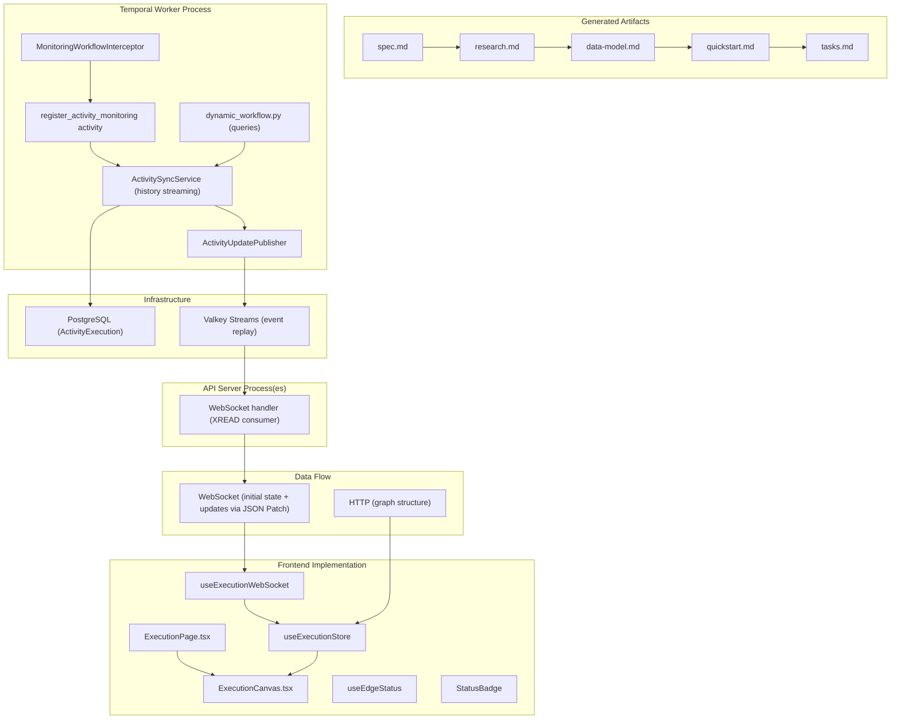

# Implementation Plan: Visualize Workflow Execution

**Branch**: `020-visualize-execution` | **Date**: 2025-12-10 | **Spec**: [specs/024-execution-visualizer/spec.md](spec.md)
**Input**: Feature specification from `specs/024-execution-visualizer/spec.md`
**Proposal Reference**: [resources/proposal.md](resources/proposal.md)

## Execution Flow (/plan command scope)
```
1. Load feature spec from Input path                    ✓ COMPLETE
2. Fill Technical Context                               ✓ COMPLETE
3. Fill Constitution Check                              ✓ COMPLETE
4. Evaluate Constitution Check                          ✓ PASS
5. Execute Phase 0 → research.md                        ✓ COMPLETE
6. Execute Phase 1 → schemas, data-model.md, quickstart.md
7. Re-evaluate Constitution Check                       → Post-Design
8. Plan Phase 2 → Describe task generation approach
9. STOP - Ready for /tasks command
```

---

## Summary

This feature implements real-time workflow execution visualization for the Nexus Workflow Canvas. Operators will see an interactive graph where nodes represent workflow steps (agents, actions, integrations, scripts, conditions, loops) and edges represent data flow. Node status icons update in real-time via database-backed activity state syncing with WebSocket push notifications.

**Key Technical Decisions**:
- **Backend Activity Sync**: `ActivitySyncService` streams Temporal workflow history events and syncs activity state to database (`ActivityExecution` table) in real-time. `MonitoringWorkflowInterceptor` auto-starts monitoring on workflow init.
- **Backend Valkey Streams**: After database commit, `ActivityUpdatePublisher` publishes JSON Patch messages to Valkey Streams (key: `execution:{id}:events`). This bridges the Temporal worker (where ActivitySyncService runs) and API servers (where WebSocket connections live).
- **Backend WebSocket**: WebSocket handlers read from Valkey Streams using XREAD and push JSON Patch messages to connected clients in real-time.
- **Message Format**: JSON Patch (RFC 6902) with Valkey auto-generated event IDs (format: `{milliseconds}-{sequence}`) for idempotency, replay support, and precise state updates
- **Frontend**: Extend existing ReactFlow-based workflow builder (`nexus-ui/packages/nexus-ui/src/routes/builder/`) with runtime visualization mode
- **Protocol**: REST for graph structure + activities (completed executions); WebSocket with Valkey Streams for initial state (ExecutionSnapshotMessage) + real-time updates (ActivityPatchMessage)
- **State Recovery**: Valkey Streams provide event replay; on reconnect, frontend connects with `replay=<last_event_id>` to catch up on missed events
- **Completed Executions**: For completed/failed/cancelled executions, fetch all data from REST API with `include=activities` and skip WebSocket connection

---

## Architecture Diagram



---

## Technical Context

| Aspect | Backend (Python) | Frontend (TypeScript) |
|--------|------------------|----------------------|
| **Language/Version** | Python 3.12 | TypeScript 5.9, React 19 |
| **Primary Dependencies** | FastAPI, SQLModel, Temporal SDK | React, ReactFlow (@xyflow/react), TanStack Query, Zustand |
| **Storage** | PostgreSQL (SQLModel ORM), Valkey (session state) | Browser local state (Zustand) |
| **Testing** | pytest | Vitest, Testing Library |
| **Target Platform** | Linux server (podman-compose) | Modern browsers |

**Project Type**: Web application (frontend + backend)

**Constraints**:
- Maximum 50 nodes per workflow (initial implementation)
- WebSocket connections per user: TBD (open question from proposal)

**Scale/Scope**:
- Target: 10-50 concurrent workflow executions being monitored
- Node types: 7 (Agent, API, AAP Job Template, Script, Condition, Loop, Converge)
- Node states: 6 (Pending, Running, Success, Error, Skipped, Cancelled)

---

## Constitution Check

*GATE: Must pass before Phase 0 research. Re-check after Phase 1 design.*

### Technology Standards Compliance
- [x] **SQLModel for Data Models**: All data models use SQLModel (existing pattern in codebase)

### Code Architecture Compliance
- [x] **DRY Principle**: Reuse existing WebSocket infrastructure, ReactFlow components
- [x] **SOLID Principles**: Extend existing node registry, use composition for visualization modes
- [x] **Separation of Concerns**: Clear backend (WebSocket events) / frontend (ReactFlow rendering) boundary
- [x] **Dependency Injection**: Follow existing FastAPI dependency injection patterns
- [x] **Composition vs Inheritance**: Extend ReactFlow with custom node types via composition

### API Specification Standards Compliance
- [x] **OpenAPI/AsyncAPI Compliance**: New `websocket-execution-streaming.yaml` (AsyncAPI 3.0.0) following auto-discovery convention
- [x] **Naming Convention**: Follow existing snake_case pattern in API specs
- [x] **Documentation Completeness**: All WebSocket messages documented with examples
- [x] **RFC 9457 Error Format**: Follow existing error message patterns
- [x] **Error Message Safety**: No internal implementation exposure
- [x] **API Versioning**: Use existing `/api/v1/` path structure
- [x] **API Path Structure**: `/ws/workflows/v1/executions/{executionId}` (consistent with agent_orchestrator pattern)
- [x] **Pagination Support**: N/A for WebSocket streaming
- [x] **Filtering/Sorting Consistency**: N/A for WebSocket streaming
- [x] **Schema Compatibility**: Extend existing schemas, no breaking changes

---

## Project Structure

### Documentation (this feature)
```
specs/024-execution-visualizer/
├── plan.md              # This file (/plan command output)
├── research.md          # Phase 0 output (/plan command)
├── data-model.md        # Phase 1 output (/plan command)
├── quickstart.md        # Phase 1 output (/plan command)
├── resources/
│   └── proposal.md      # Technical proposal reference
└── tasks.md             # Phase 2 output (/tasks command - NOT created by /plan)
```

### Source Code (repository root)

**Structure Decision**: Option 2 - Web application (frontend + backend)

```
# Backend (Python - existing structure)
src/nexus/
├── workflows/
│   ├── ws/
│   │   └── execution_streaming.py           # NEW: WebSocket handler with Valkey Streams XREAD consumer
│   ├── services/
│   │   └── activity_update_publisher.py     # NEW: Valkey Streams publisher (JSON Patch messages)
│   ├── workflow_engine/
│   │   ├── dynamic_workflow.py              # EXISTING: get_activity_input/output queries
│   │   ├── interceptors/
│   │   │   └── monitoring_interceptor.py    # EXISTING: Auto-start monitoring on workflow init
│   │   ├── activities/
│   │   │   └── internal/
│   │   │       └── activity_monitoring.py   # EXISTING: Register monitoring activity
│   │   └── services/
│   │       ├── activity_sync_service.py     # EXISTING + EXTENDED: Stream events + publish to Valkey
│   │       └── activity_sync_registry.py    # EXISTING: Global registry for sync service
│   └── utils/
│       └── activity_traversal.py            # EXISTING: Traverse workflow definition for activities
├── schemas/
│   └── workflows/
│       ├── workflow-websocket-api.yaml          # EXISTING: Core WebSocket infrastructure
│       └── websocket-execution-streaming.yaml   # NEW: Visualization-specific schemas
└── core/
    └── websocket/                    # EXISTING: Reuse infrastructure

# Frontend (TypeScript - nexus-ui/)
nexus-ui/packages/nexus-ui/src/
├── routes/
│   ├── automations/                  # EXTENDED: Add runtime visualization mode
│   │   ├── canvas/
│   │   │   └── nodes/                # EXISTING: ConditionNode, LoopNode, TaskNode, etc.
│   │   │       └── StatusBadge.tsx   # NEW: Runtime status overlay component
│   │   ├── execution/                # NEW: Execution runtime view
│   │   │   ├── ExecutionPage.tsx     # Runtime visualization page
│   │   │   └── ExecutionCanvas.tsx   # ReactFlow canvas with runtime mode
│   │   ├── hooks/
│   │   │   ├── useExecutionWebSocket.ts  # NEW: WebSocket connection management
│   │   │   ├── useExecutionData.ts       # NEW: Load graph structure from REST
│   │   │   └── useEdgeStatus.ts          # NEW: Derive edge status from node status
│   │   └── stores/
│   │       └── useExecutionStore.ts      # NEW: Zustand store for execution state
│   └── builder/
│       ├── BuilderFlow.tsx           # EXISTING: Graph rendering (reuse patterns)
│       ├── utils/
│       │   ├── workflowTransform.ts  # EXISTING: Flatten workflow to nodes/edges
│       │   ├── loadWorkflow.ts       # EXISTING: Load and flatten workflow
│       │   └── EdgeFactory.ts        # EXISTING: Edge creation utility
│       └── edges/                    # EXISTING: ButtonEdge, DefaultEdge, LoopBackEdge
└── components/
    └── ConnectionBanner.tsx          # NEW: Stale data warning banner (shared)
```

---

## Phase 0: Outline & Research

### Technical Context Analysis

All technical choices are resolved based on:
1. **Proposal document** (`resources/proposal.md`) - WebSocket streaming architecture
2. **Existing codebase** - Backend WebSocket infrastructure, Frontend ReactFlow patterns
3. **Decision records** - WebSockets for streaming, SQLModel for data, FastAPI for API

### Research Findings

**1. Activity Sync Architecture (Backend) - Existing**
- **Decision**: `ActivitySyncService` streams Temporal workflow history events and syncs to `ActivityExecution` table
- **Rationale**: Database as source of truth enables querying after Temporal retention expires, simplifies frontend data fetching
- **Key files**:
  - `src/nexus/workflows/workflow_engine/services/activity_sync_service.py` - Background service streaming events
  - `src/nexus/workflows/workflow_engine/interceptors/monitoring_interceptor.py` - Auto-start monitoring on workflow init
  - `src/nexus/workflows/workflow_engine/activities/internal/activity_monitoring.py` - Internal activity to register monitoring
  - `src/nexus/workflows/utils/activity_traversal.py` - Traverse workflow definition for activities

**2. Workflow Queries (Backend) - Existing**
- **Decision**: Add `get_activity_input()` and `get_activity_output()` workflow queries
- **Rationale**: Enable ActivitySyncService to fetch runtime data for activities
- **Key file**: `src/nexus/workflows/workflow_engine/dynamic_workflow.py`

**3. Valkey Streams + WebSocket Push Notifications (Backend) - TODO**
- **Decision**: Use Valkey Streams to bridge Temporal worker (ActivitySyncService) and API servers (WebSocket handlers)
- **Rationale**: Real-time updates without polling; event replay capability for reconnection; scalable to multiple API server instances; Valkey already in stack for session state
- **Message Format**: JSON Patch (RFC 6902) with Valkey auto-generated message IDs for idempotency and replay support
- **Flow**: ActivitySyncService → database commit → publish JSON Patch to Valkey Streams (XADD) → WebSocket handlers read from stream (XREAD) → push to clients
- **Replay Support**: Clients can specify `replay=<event_id>` to catch up on missed events; `replay=0` for initial state from beginning
- **Key files**:
  - `src/nexus/workflows/services/activity_update_publisher.py` - NEW: Valkey Streams publisher (JSON Patch messages)
  - `src/nexus/workflows/ws/execution_streaming.py` - NEW: WebSocket handler with Valkey Streams XREAD consumer
  - `src/nexus/core/websocket/manager.py` - Connection lifecycle manager (singleton)
  - `src/nexus/schemas/workflows/websocket-execution-streaming.yaml` - NEW: Visualization-specific AsyncAPI spec

**4. ReactFlow Integration (Frontend) - Existing Infrastructure**
- **Decision**: Extend existing builder architecture with runtime visualization mode
- **Rationale**: Reuse graph construction, layout algorithms, edge rendering
- **Key files**:
  - `nexus-ui/packages/nexus-ui/src/routes/builder/BuilderFlow.tsx` - Graph rendering
  - `nexus-ui/packages/nexus-ui/src/routes/builder/utils/workflowTransform.ts` - Flatten workflow to nodes/edges
  - `nexus-ui/packages/nexus-ui/src/routes/builder/utils/loadWorkflow.ts` - Load and flatten workflow
  - `nexus-ui/packages/nexus-ui/src/routes/automations/canvas/nodes/` - Node components (TaskNode, ConditionNode, etc.)
  - `nexus-ui/packages/nexus-ui/src/stores/useWorkflowStore.ts` - State management

**5. State Synchronization Pattern**
- **Decision**: Valkey Streams-backed state with WebSocket push and replay support
- **Rationale**: Event replay eliminates need for separate REST endpoint for activity states; database is source of truth; resilient to disconnection; no lost updates
- **Unified Schema**: `ExecutionSnapshotMessage.execution` uses the same `Execution` schema as REST API `GET /executions/{id}?include=activities`, enabling unified UI processing logic for both WebSocket and REST data sources
- **Initial Connection (Running Execution)**:
  1. Load graph structure via `GET /api/v1/executions/{id}?include=workflow_definition`
  2. Connect to WebSocket `/ws/workflows/v1/executions/{id}?replay=0` for initial state + real-time updates
  3. Receive initial state as `ExecutionSnapshotMessage` from Valkey Streams (same schema as REST API)
  4. Build visualization graph client-side from execution snapshot
  5. Continue receiving `ActivityPatchMessage` operations for real-time updates
- **Initial Connection (Completed Execution)**:
  1. Load graph structure and activities via `GET /api/v1/executions/{id}?include=workflow_definition&include=activities`
  2. Render final state from execution.activities (no WebSocket connection)
  3. UI uses same processing logic for both WebSocket ExecutionSnapshotMessage and REST API response
- **Reconnection**:
  1. Reconnect to WebSocket `/ws/workflows/v1/executions/{id}?replay=<last_event_id>`
  2. Receive missed events from Valkey Streams
  3. Client applies JSON Patch operations to catch up on state changes
  4. Resume receiving real-time WebSocket push notifications

**6. Edge Status Derivation**
- **Decision**: Client-side computation from node status (no server broadcast)
- **Rationale**: Reduces WebSocket traffic, edge status is deterministic from node status
- **Implementation**: `useEdgeStatus` hook derives status based on source/target node states

**7. Node Status Visualization** *(per UX mockups in `resources/`)*
- **Decision**: Extend existing node registry with runtime status overlay using badge pattern
- **Rationale**: Consistent visual language per UX mockups
- **Visual pattern**: Node border color + badge icon at bottom-right corner
- **Status indicators**:
  - Pending: Gray border, ellipsis-in-box badge
  - Running: Blue border, spinner badge (animated)
  - Success: Green border, checkmark badge
  - Error: Red border, exclamation point badge
  - Skipped: Gray dashed border, skip arrow badge
  - Cancelled: Orange border, stop badge
- **Edge transitions**: Dotted white line for pending, solid white line for passed (no success/fail colors)

**Output**: research.md (generated below)

---

## Phase 1: Design & Contracts

*Prerequisites: research.md complete*

### 1. Data Model

**Entities extracted from feature spec**:

| Entity | Key Attributes | Relationships |
|--------|---------------|---------------|
| ExecutionVisualization | execution_id, workflow_id, nodes[], edges[], status | 1:1 with Execution |
| NodeVisualization | node_id, type, label, status, metadata | Many:1 with ExecutionVisualization |
| EdgeVisualization | edge_id, source, target | Many:1 with ExecutionVisualization |
| NodeStatus | status enum, timestamp, progress, error_message | 1:1 with NodeVisualization |

**State transitions**:
```
Pending → Running → Success
                 → Error
                 → Cancelled
Pending → Skipped (conditional not taken)
Running → Cancelled (user/system termination)
```

### 2. API Contracts

**REST Endpoint (Graph Structure)**:

| Endpoint | Purpose |
|----------|---------|
| `GET /api/v1/executions/{id}?include=workflow_definition` | Execution status + workflow definition (graph structure) |

**Note**: The `workflow_definition` is only included when explicitly requested via query parameter to avoid payload bloat. Activity states are fetched via REST from the database (`GET /executions/{id}/activities`).

**WebSocket Messages (Push Notifications)**:

| Message Type | Direction | Purpose |
|-------------|-----------|---------|
| `activity_update` | Server→Client | Single activity status change pushed from database sync |
| `connection_health` | Server→Client | Connection liveness indicator (30s timeout) |

**Note**: Initial state is fetched via REST (`GET /executions/{id}/activities`). WebSocket only pushes real-time updates when activity states change. Edge status is computed client-side from node status.

**New AsyncAPI spec**:
```yaml
# websocket-execution-streaming.yaml - visualization-specific channel
# Follows auto-discovery convention: websocket-{handler}.yaml
channels:
  activityUpdates:
    address: /executions/{executionId}
    messages:
      activityUpdate, connectionHealth
```

### 3. Contract Tests

Contract tests will verify:
- WebSocket connection lifecycle (connect, message, disconnect, reconnect)
- Message format compliance (`activity_update`, `connection_health`)
- Activity state enum values match spec
- Client-side edge status derivation logic
- Reconnection fetches fresh state from REST endpoint

### 4. Test Scenarios from User Stories

| User Story | Test Scenario |
|------------|---------------|
| View workflow as graph | Graph renders with correct node count and edge connections |
| See node type icons | Each node type displays distinct icon |
| Real-time status updates | Status change reflected in UI automatically |
| Edge transitions | Dotted white for pending, solid white for passed |
| Connection recovery | Reconnect queries REST for fresh state and resumes WebSocket push notifications |

**Output**: data-model.md, quickstart.md (generated below)

---

## Phase 2: Task Planning Approach

*This section describes what the /tasks command will do - DO NOT execute during /plan*

**Task Generation Strategy**:
- Load `.specify/templates/tasks-template.md` as base
- Generate tasks from Phase 1 design docs (schemas, data model, quickstart)
- Split into **BACKEND** and **FRONTEND** task groups (per user request)

**BACKEND Tasks** (Python):
1. ✅ **Existing** ActivitySyncService - Stream Temporal events to database (`activity_sync_service.py`)
2. ✅ **Existing** MonitoringWorkflowInterceptor - Auto-start monitoring on workflow init (`monitoring_interceptor.py`)
3. ✅ **Existing** register_activity_monitoring activity - Internal activity to register monitoring (`activity_monitoring.py`)
4. ✅ **Existing** Workflow queries - `get_activity_input()` and `get_activity_output()` (`dynamic_workflow.py`)
5. ✅ **Existing** Activity traversal utility - Traverse workflow definition for activities (`activity_traversal.py`)
6. ✅ **Existing** SKIPPED and CANCELLED status values - Added to ActivityStatus enum (`activity_execution.py`)
7. [P] Create `websocket-execution-streaming.yaml` AsyncAPI spec (visualization schemas)
8. [P] Create WebSocket handler (`execution_streaming.py`) for push notifications
9. [P] Wire ActivitySyncService events to WebSocket broadcasts
10. Integration tests for WebSocket message flow

**FRONTEND Tasks** (TypeScript):
1. [P] Create ExecutionPage in `routes/automations/execution/`
2. [P] Create StatusBadge component for runtime node overlay
3. [P] Implement useExecutionWebSocket hook with reconnection
4. [P] Implement useExecutionData hook for loading graph structure + activities from REST
5. [P] Implement useEdgeStatus hook for client-side edge derivation
6. [P] Create ConnectionBanner component (stale data warning)
7. [P] Create useExecutionStore Zustand store
8. [P] ExecutionCanvas integration with existing node components
9. Integration tests for WebSocket connection
10. E2E tests for real-time updates

**Ordering Strategy**:
- TDD order: Tests before implementation
- Dependency order: Backend implemented → Frontend consumption
- Mark [P] for parallel execution (independent files)

**Estimated Output**: 25-30 numbered, ordered tasks in tasks.md

---

## Complexity Tracking

*No violations detected - design follows existing patterns*

| Aspect | Approach | Justification |
|--------|----------|---------------|
| Activity sync | ActivitySyncService + Interceptor | Database as source of truth, survives worker restarts |
| WebSocket infrastructure | Extend existing | Mature infrastructure, proven patterns |
| ReactFlow integration | Extend builder | Reuse node registry, layout algorithms |
| State management | Zustand + TanStack Query | Existing frontend patterns |

---

## Progress Tracking

**Phase Status**:
- [x] Phase 0: Research complete (/plan command)
- [x] Phase 1: Design complete (/plan command)
- [x] Phase 2: Task planning approach documented (/plan command)
- [x] Phase 3: Tasks generated (/tasks command)
- [ ] Phase 4: Implementation complete
- [ ] Phase 5: Validation passed

**Gate Status**:
- [x] Initial Constitution Check: PASS
- [x] Post-Design Constitution Check: PASS
- [x] All NEEDS CLARIFICATION resolved
- [x] Complexity deviations documented (none)

**Generated Artifacts**:
- [x] `plan.md` - Implementation plan with architecture diagram
- [x] `research.md` - Technical research and decisions
- [x] `data-model.md` - Entity definitions and schemas
- [x] `quickstart.md` - Developer implementation guide
- [x] `tasks.md` - Generated by /tasks command (not /plan)

---
*Based on Constitution v1.2.0 - See `.specify/memory/constitution.md`*
