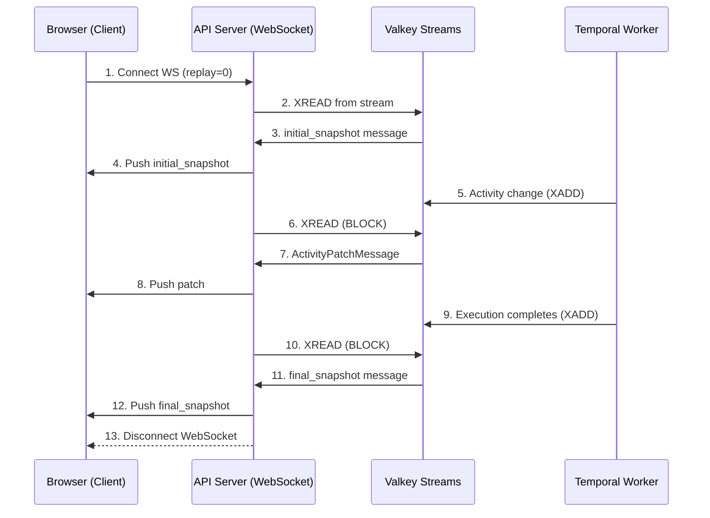

# Quickstart: Visualize Workflow Execution

**Feature**: Visualize Workflow Execution | **Date**: 2025-12-10
**Status**: Complete

---

## Overview

This quickstart guide provides a rapid onboarding path for developers implementing the workflow execution visualization feature. It covers both backend (Python) and frontend (TypeScript) components.

---

## Prerequisites

### Backend
- Python 3.12+
- uv (dependency management)
- Running Nexus backend: `make dev`
- PostgreSQL database
- Valkey (session state)

### Frontend
- Node.js 22+
- npm workspaces
- Running nexus-ui: `cd nexus-ui && npm start`

---

## Architecture Overview

```
┌─────────────────────────────────────────────────────────────────────┐
│                        FRONTEND (nexus-ui)                          │
├─────────────────────────────────────────────────────────────────────┤
│  routes/automations/execution/                                      │
│  ├── ExecutionPage.tsx                                              │
│  ├── ExecutionCanvas.tsx (ReactFlow)                                │
│  ├── canvas/nodes/StatusBadge.tsx (status overlay)                 │
│  ├── hooks/useExecutionWebSocket.ts (real-time push notifications)│
│  ├── hooks/useEdgeStatus.ts (client-side edge derivation)          │
│  └── stores/useExecutionStore.ts (Zustand state)                   │
└────────────────────────────┬────────────────────────────────────────┘
                             │ REST (initial) + WebSocket (updates)
                             ▼
┌─────────────────────────────────────────────────────────────────────┐
│                        BACKEND (nexus)                              │
├─────────────────────────────────────────────────────────────────────┤
│  workflows/workflow_engine/services/                                │
│  ├── activity_sync_service.py (✅ streams Temporal events to DB)   │
│  └── activity_sync_registry.py (✅ global registry)                │
│  workflows/workflow_engine/interceptors/                            │
│  └── monitoring_interceptor.py (✅ auto-start on workflow init)    │
│  workflows/workflow_engine/activities/internal/                     │
│  └── activity_monitoring.py (✅ register monitoring activity)      │
│  workflows/workflow_engine/dynamic_workflow.py (✅ activity queries)│
│  workflows/ws/execution_streaming.py (TODO: WebSocket push handler)│
│  core/websocket/* (existing infrastructure)                        │
└─────────────────────────────────────────────────────────────────────┘
```

**Key Pattern**: Database as Source of Truth with Valkey Streams Replay
- `ActivitySyncService` streams Temporal workflow history events to database
- `MonitoringWorkflowInterceptor` auto-starts monitoring when workflow begins
- Activity states persisted in `ActivityExecution` table
- JSON Patch messages published to Valkey Streams for event replay
- Frontend receives initial state + real-time updates via WebSocket with `replay=0`
- First message is `ExecutionSnapshotMessage` with type="initial_snapshot"
- Last message is `ExecutionSnapshotMessage` with type="final_snapshot", then server disconnects

### Real-Time Update Flow



| Layer | Technology | Purpose |
|-------|------------|---------|
| Client ↔ API Server | **WebSocket** | JSON Patch streaming to browser |
| API Server(s) ↔ Valkey | **Streams XREAD** | Consume activity updates with replay |
| Temporal Worker → Valkey | **Streams XADD** | Publish JSON Patch messages |

**Why Valkey Streams?** ActivitySyncService runs on the Temporal worker process, but WebSocket connections live on API server process(es). Valkey Streams bridge this process boundary, enable event replay from any event_id, and support horizontal scaling of API servers.

---

## BACKEND Implementation

### Step 1: Activity Sync Architecture ✅ Existing

The backend activity sync infrastructure is already implemented. Here's how it works:

**ActivitySyncService** (`src/nexus/workflows/workflow_engine/services/activity_sync_service.py`):

```python
class ActivitySyncService:
    """Background service that streams Temporal events to database.

    Key methods:
    - start_monitoring_execution(): Start monitoring a workflow execution
    - _monitor_execution(): Stream history events and sync to database
    - _create_all_activities_upfront(): Create ActivityExecution records
    - _sync_activities_to_db(): Update activity status in database
    - _handle_condition_branch_skipping(): Mark untaken branches as SKIPPED
    """

    async def _monitor_execution(self, execution_id: UUID, temporal_workflow_id: str) -> None:
        """Monitor execution and sync activities to database."""
        handle = self.temporal_client.get_workflow_handle(temporal_workflow_id)

        # Create all ActivityExecution records upfront with status=PENDING
        await self._create_all_activities_upfront(execution_id, activity_definitions_map)

        # Stream history events and sync to database
        async for event in handle.fetch_history_events(wait_new_event=True):
            self._process_activity_event(event, temp_map)
            await self._sync_activities_to_db(execution_id, temp_map, handle, event.event_id)
```

**MonitoringWorkflowInterceptor** (`src/nexus/workflows/workflow_engine/interceptors/monitoring_interceptor.py`):

```python
class MonitoringWorkflowInterceptor(Interceptor):
    """Auto-starts monitoring on workflow init via execute_workflow interceptor."""

class _MonitoringWorkflowInboundInterceptor(WorkflowInboundInterceptor):
    async def execute_workflow(self, input: ExecuteWorkflowInput) -> Any:
        # Start monitoring activity in background (non-blocking)
        workflow.start_activity(
            "register_activity_monitoring",
            args=[execution_id, temporal_workflow_id],
            activity_id="__internal__register_monitoring",
            start_to_close_timeout=timedelta(seconds=30),
        )
        return await super().execute_workflow(input)
```

**Workflow Queries** (`src/nexus/workflows/workflow_engine/dynamic_workflow.py`):

```python
@workflow.query
def get_activity_input(self, activity_id: str) -> JsonDict | None:
    """Query to get activity input data for sync service."""
    return self.workflow_state.get("activity_inputs", {}).get(activity_id)

@workflow.query
def get_activity_output(self, activity_id: str) -> JsonDict | None:
    """Query to get activity output data for sync service."""
    return self.workflow_state.get("activity_outputs", {}).get(activity_id)
```

### Step 2: Valkey Streams Publisher (TODO)

The `ActivitySyncService` runs on the Temporal worker, but WebSocket connections live on API server(s). We use Valkey Streams to bridge this process boundary and enable event replay.

**File**: `src/nexus/workflows/services/activity_update_publisher.py`

```python
"""Valkey Streams publisher for activity status updates using JSON Patch format."""

import json
import logging
from typing import Any
from uuid import UUID

from valkey.asyncio import Valkey

logger = logging.getLogger(__name__)


class ActivityUpdatePublisher:
    """Publishes activity status updates to Valkey Streams using JSON Patch format."""

    def __init__(self, valkey_client: Valkey) -> None:
        self.valkey = valkey_client

    async def publish_activity_patch(
        self,
        execution_id: UUID,
        ops: list[dict[str, Any]],
    ) -> str:
        """Publish activity patch to Valkey Stream.

        Args:
            execution_id: Workflow execution ID
            ops: List of JSON Patch operations

        Returns:
            event_id: Valkey-generated stream ID
        """
        from datetime import datetime, timezone

        stream_key = f"execution:{execution_id}:events"
        message = {
            "type": "activity_patch",
            "execution_id": str(execution_id),
            "ops": json.dumps(ops),
            "timestamp": datetime.now(timezone.utc).isoformat(),
        }

        # XADD returns the auto-generated event_id
        event_id = await self.valkey.xadd(stream_key, message)
        logger.debug("Published activity patch to %s: event_id=%s", stream_key, event_id)
        return event_id

    async def publish_execution_snapshot(
        self,
        execution_id: UUID,
        execution_data: dict[str, Any],
        snapshot_type: str = "initial_snapshot",
    ) -> str:
        """Publish execution snapshot to Valkey Stream.

        Args:
            execution_id: Workflow execution ID
            execution_data: Full execution data with activities
            snapshot_type: Type of snapshot ("initial_snapshot" or "final_snapshot")

        Returns:
            event_id: Valkey-generated stream ID
        """
        from datetime import datetime, timezone

        stream_key = f"execution:{execution_id}:events"
        message = {
            "type": snapshot_type,
            "execution_id": str(execution_id),
            "execution": json.dumps(execution_data),
            "timestamp": datetime.now(timezone.utc).isoformat(),
        }

        event_id = await self.valkey.xadd(stream_key, message)
        logger.debug("Published %s to %s: event_id=%s", snapshot_type, stream_key, event_id)
        return event_id
```

**Integration with ActivitySyncService** - Add publisher call after database commit in `_sync_activities_to_db()`:

```python
# In ActivitySyncService.__init__:
self._publisher: ActivityUpdatePublisher | None = publisher

# In ActivitySyncService._sync_activities_to_db(), after session.commit():
await session.commit()

# Publish updates to Valkey Streams for WebSocket fan-out
if self._publisher:
    ops = []
    for activity_data in temp_map.values():
        activity_path = f"/activities/{activity_data['activity_id']}"
        ops.append({
            "op": "replace",
            "path": f"{activity_path}/status",
            "value": activity_data["status"].value
        })
        if activity_data.get("error_details"):
            ops.append({
                "op": "add",
                "path": f"{activity_path}/error_details",
                "value": activity_data["error_details"]
            })

    if ops:
        await self._publisher.publish_activity_patch(execution_id, ops)
```

### Step 3: WebSocket Handler with Valkey Streams Consumer (TODO)

**File**: `src/nexus/workflows/ws/execution_streaming.py`

> **Note**: This handler follows the auto-discovery convention used in the codebase:
> - `SPEC_PATH` points to the AsyncAPI spec
> - `handle_{channel_name}()` handles incoming messages (dummy for server-to-client channels)
> - `on_connect_{channel_name}()` handles connection lifecycle with Valkey Streams XREAD
>
> The channel name `activityUpdates` comes from the AsyncAPI spec.

```python
"""WebSocket handler for execution visualization with Valkey Streams.

Auto-discovery convention:
    src/nexus/workflows/ws/execution_streaming.py
    → schemas/workflows/websocket-execution-streaming.yaml
"""

import asyncio
import json
import logging
from datetime import datetime, timezone
from typing import Any
from uuid import UUID

from fastapi import WebSocket, WebSocketDisconnect

from nexus.core.websocket.close_codes import UNSUPPORTED_DATA

logger = logging.getLogger(__name__)

# AsyncAPI specification path (relative to project root)
SPEC_PATH = "src/nexus/schemas/workflows/websocket-execution-streaming.yaml"


def handle_activityUpdates(_message: dict[str, object], _connection_id: str) -> dict[str, str]:
    """Return empty dict as dummy handler for framework.

    This function is required for the WebSocket framework to discover this module,
    but it won't be called since 'activityUpdates' is a server-to-client only channel.

    Args:
        _message: Incoming message (unused)
        _connection_id: Connection ID (unused)

    Returns:
        Empty dict

    """
    return {}


async def on_connect_activityUpdates(websocket: WebSocket, connection_id: str) -> None:
    """WebSocket connection handler for execution visualization.

    Reads from Valkey Stream and forwards messages to client.

    Args:
        websocket: The WebSocket connection
        connection_id: Unique connection identifier

    """
    # Extract execution_id from WebSocket path
    # Path format: /executions/{executionId}
    path_parts = websocket.url.path.split("/")
    execution_id_str = path_parts[-1]

    try:
        execution_id = UUID(execution_id_str)
    except ValueError:
        logger.exception("Invalid execution_id in path: %s", execution_id_str)
        await websocket.close(code=UNSUPPORTED_DATA, reason="Invalid execution ID")
        return

    # Get Valkey client from app state (injected at startup)
    valkey_client = getattr(websocket.app.state, "valkey_client", None)
    if valkey_client is None:
        logger.error("Valkey client not available in app state")
        await websocket.close(code=UNSUPPORTED_DATA, reason="Service unavailable")
        return

    # Get replay parameter from query string
    replay_param = websocket.query_params.get("replay")
    stream_key = f"execution:{execution_id}:events"

    try:
        logger.info("Connected to execution %s (connection: %s, replay: %s)", execution_id, connection_id, replay_param)

        # Read and forward stream events
        await _read_stream_events(websocket, valkey_client, stream_key, replay_param)

    except WebSocketDisconnect:
        logger.info("Client disconnected from execution %s", execution_id)
    except Exception as e:
        logger.exception("Error in execution visualization: %s", e)


async def _read_stream_events(
    websocket: WebSocket,
    valkey_client: Any,
    stream_key: str,
    replay_param: str | None,
) -> None:
    """Read from Valkey Stream and forward messages to WebSocket."""
    # Determine starting point
    if replay_param == "0":
        # Replay from beginning
        last_id = "0"
    elif replay_param:
        # Replay from specific event_id
        last_id = replay_param
    else:
        # Live streaming only (no replay)
        last_id = "$"

    while True:
        # XREAD with BLOCK (block for 1000ms if no new events)
        events = await valkey_client.xread({stream_key: last_id}, block=1000, count=10)

        if not events:
            continue

        for stream, messages in events:
            for event_id, data in messages:
                # Deserialize message
                msg_type = data.get(b"type", b"").decode()

                if msg_type in ("initial_snapshot", "final_snapshot"):
                    execution_json = data.get(b"execution", b"{}").decode()
                    timestamp = data.get(b"timestamp", b"").decode()
                    message = {
                        "type": msg_type,
                        "execution_id": data.get(b"execution_id", b"").decode(),
                        "event_id": event_id.decode(),
                        "execution": json.loads(execution_json),
                        "timestamp": timestamp,
                    }
                    await websocket.send_json(message)
                    logger.debug("Forwarded %s: event_id=%s", msg_type, event_id)

                    # Disconnect after sending final_snapshot
                    if msg_type == "final_snapshot":
                        logger.info("Sent final_snapshot, disconnecting client")
                        await websocket.close(code=1000, reason="Execution completed")
                        return

                elif msg_type == "activity_patch":
                    ops_json = data.get(b"ops", b"[]").decode()
                    timestamp = data.get(b"timestamp", b"").decode()
                    message = {
                        "type": "activity_patch",
                        "execution_id": data.get(b"execution_id", b"").decode(),
                        "event_id": event_id.decode(),
                        "ops": json.loads(ops_json),
                        "timestamp": timestamp,
                    }
                    await websocket.send_json(message)
                    logger.debug("Forwarded %s: event_id=%s", msg_type, event_id)
                else:
                    logger.warning("Unknown message type: %s", msg_type)
                    continue

                # Update last_id for next XREAD
                last_id = event_id
```

### Step 4: AsyncAPI Spec ✅ Existing

**File**: [`src/nexus/schemas/workflows/websocket-execution-streaming.yaml`](../../src/nexus/schemas/workflows/websocket-execution-streaming.yaml)

The AsyncAPI spec is already implemented. Key elements:

- **Channel**: `activityUpdates` at `/executions/{executionId}`
- **Messages**: `activityUpdate`
- **Protocol**: WebSocket with Valkey pub/sub backend

See the [full spec](../../src/nexus/schemas/workflows/websocket-execution-streaming.yaml) for complete schema definitions including message payloads, security schemes, and examples.

---

## FRONTEND Implementation

> **Note**: The nexus-ui codebase already has infrastructure for workflow visualization. The execution visualizer extends this existing code:
> - `routes/builder/utils/workflowTransform.ts` - `WorkflowTransform.flatten()` converts nested workflow to flat activities + edges
> - `routes/builder/utils/loadWorkflow.ts` - `loadWorkflow()` loads and flattens workflow definition
> - `routes/builder/BuilderFlow.tsx` - Creates ReactFlow nodes/edges (reuse layout algorithms)
> - `routes/builder/utils/EdgeFactory.ts` - Centralized edge creation utility
> - `routes/automations/canvas/nodes/` - Existing node components (TaskNode, ConditionNode, etc.)
> - `routes/executions/executionStatusConstants.ts` - Status icons and colors
>
> The execution visualizer **reuses this infrastructure** and adds runtime status overlays.

### Step 1: Create Zustand Store

**File**: `nexus-ui/packages/nexus-ui/src/routes/automations/stores/useExecutionStore.ts`

```typescript
import { create } from 'zustand';
import { immer } from 'zustand/middleware/immer';
import type { ExecutionVisualization, NodeVisualization } from '../types';

interface ExecutionStoreState {
  executionId: string | null;
  visualization: ExecutionVisualization | null;
  activityStates: Record<string, string>;  // activity_id -> status
  activityErrors: Record<string, string>;  // activity_id -> error message
  isLoading: boolean;
  isConnected: boolean;
  isStale: boolean;
  error: string | null;
}

interface ExecutionStoreActions {
  setExecution: (executionId: string) => void;
  setVisualization: (viz: ExecutionVisualization) => void;
  // NOTE: Execution interface is the same for both WebSocket and REST API
  // This enables unified processing logic for both data sources
  setExecutionSnapshot: (execution: Execution) => void;  // From ExecutionSnapshotMessage (same as REST API)
  applyActivityPatch: (ops: JsonPatchOperation[]) => void;  // From ActivityPatchMessage
  // Note: No edge status updates - derived client-side by useEdgeStatus hook
  setConnected: (connected: boolean) => void;
  setStale: (stale: boolean) => void;
  setError: (error: string | null) => void;
  reset: () => void;
}

const initialState: ExecutionStoreState = {
  executionId: null,
  visualization: null,
  activityStates: {},
  activityErrors: {},
  isLoading: false,
  isConnected: false,
  isStale: false,
  error: null,
};

export const useExecutionStore = create<ExecutionStoreState & ExecutionStoreActions>()(
  immer((set) => ({
    ...initialState,

    setExecution: (executionId) =>
      set((state) => {
        state.executionId = executionId;
        state.isLoading = true;
      }),

    setVisualization: (viz) =>
      set((state) => {
        state.visualization = viz;
        state.isLoading = false;
      }),

    setInitialState: (activities, errors) =>
      set((state) => {
        // Full state from REST endpoint
        state.activityStates = activities;
        state.activityErrors = errors;

        // Update visualization nodes with activity states
        if (state.visualization) {
          for (const node of state.visualization.nodes) {
            const status = activities[node.nodeId];
            if (status) {
              node.status = status as NodeVisualization['status'];
            }
            const errorMessage = errors[node.nodeId];
            if (errorMessage) {
              node.errorMessage = errorMessage;
            }
          }
        }
      }),

    setExecutionSnapshot: (execution) =>
      set((state) => {
        // Set state from ExecutionSnapshotMessage (initial_snapshot or final_snapshot)
        const activityStates: Record<string, string> = {};
        const activityErrors: Record<string, string> = {};

        for (const activity of execution.activities) {
          activityStates[activity.activity_id] = activity.status;
          if (activity.error_details) {
            activityErrors[activity.activity_id] = activity.error_details;
          }
        }

        state.activityStates = activityStates;
        state.activityErrors = activityErrors;

        // Update visualization nodes
        if (state.visualization) {
          for (const node of state.visualization.nodes) {
            const activityData = execution.activities.find(a => a.activity_id === node.nodeId);
            if (activityData) {
              node.status = activityData.status as NodeVisualization['status'];
              node.errorMessage = activityData.error_details;
            }
          }
        }
      }),

    applyActivityPatch: (ops) =>
      set((state) => {
        // Apply JSON Patch operations to activity state
        for (const op of ops) {
          if (!op.path.startsWith('/activities/')) continue;

          const pathParts = op.path.split('/');
          const activityName = pathParts[2]; // /activities/{name}/{field}
          const field = pathParts[3];

          if (op.op === 'replace' || op.op === 'add') {
            if (field === 'status') {
              state.activityStates[activityName] = op.value as string;
            } else if (field === 'error_details') {
              state.activityErrors[activityName] = op.value as string;
            }

            // Update visualization node
            if (state.visualization) {
              const node = state.visualization.nodes.find((n) => n.nodeId === activityName);
              if (node) {
                if (field === 'status') {
                  node.status = op.value as NodeVisualization['status'];
                } else if (field === 'error_details') {
                  node.errorMessage = op.value as string;
                }
              }
            }
          }
        }
      }),

    // Note: No edge status updates - edge status is derived by useEdgeStatus hook

    setConnected: (connected) =>
      set((state) => {
        state.isConnected = connected;
        if (connected) {
          state.isStale = false;
        }
      }),

    setStale: (stale) =>
      set((state) => {
        state.isStale = stale;
      }),

    setError: (error) =>
      set((state) => {
        state.error = error;
        state.isLoading = false;
      }),

    reset: () => set(initialState),
  }))
);
```

### Step 2: Create Hooks for Data Fetching

**File**: `nexus-ui/packages/nexus-ui/src/routes/automations/hooks/useExecutionData.ts`

```typescript
import { useQuery } from '@tanstack/react-query';
import { useExecutionStore } from '../stores/useExecutionStore';

const API_BASE_URL = import.meta.env.VITE_API_URL || 'http://localhost:8000/api/v1';

interface UseExecutionDataOptions {
  executionId: string;
  enabled?: boolean;
}

/**
 * Fetches execution data including workflow definition and activities.
 * Uses database as source of truth (ActivitySyncService keeps it up-to-date).
 */
export function useExecutionData({
  executionId,
  enabled = true,
}: UseExecutionDataOptions) {
  const { setVisualization, setError } = useExecutionStore();

  // Fetch execution with workflow definition
  const executionQuery = useQuery({
    queryKey: ['execution', executionId],
    queryFn: async () => {
      const response = await fetch(
        `${API_BASE_URL}/executions/${executionId}?include=workflow_definition`
      );
      if (!response.ok) throw new Error('Failed to fetch execution');
      return response.json();
    },
    enabled,
  });

  // Fetch activities (current state from database)
  const activitiesQuery = useQuery({
    queryKey: ['execution-activities', executionId],
    queryFn: async () => {
      const response = await fetch(`${API_BASE_URL}/executions/${executionId}/activities`);
      if (!response.ok) throw new Error('Failed to fetch activities');
      return response.json();
    },
    enabled,
    refetchInterval: 2000, // Poll for updates (until WebSocket is implemented)
  });

  return {
    execution: executionQuery.data,
    activities: activitiesQuery.data,
    isLoading: executionQuery.isLoading || activitiesQuery.isLoading,
    error: executionQuery.error || activitiesQuery.error,
    refetch: activitiesQuery.refetch,
  };
}
```

**File**: `nexus-ui/packages/nexus-ui/src/routes/automations/hooks/useExecutionWebSocket.ts`

```typescript
import { useEffect, useRef, useCallback } from 'react';
import { useExecutionStore } from '../stores/useExecutionStore';

const WS_BASE_URL = import.meta.env.VITE_WS_URL || 'ws://localhost:8000/api/v1/ws';
const RECONNECT_DELAY = 3000; // 3 seconds

interface UseExecutionWebSocketOptions {
  executionId: string;
  enabled?: boolean;
}

/**
 * WebSocket hook for real-time activity state push notifications.
 * Initial state is fetched via REST (useExecutionData hook).
 * WebSocket only receives updates after initial load.
 */
export function useExecutionWebSocket({
  executionId,
  enabled = true,
}: UseExecutionWebSocketOptions) {
  const wsRef = useRef<WebSocket | null>(null);
  const reconnectTimeoutRef = useRef<number | null>(null);

  const {
    setExecutionSnapshot,
    applyActivityPatch,
    setConnected,
    setStale,
    setError,
  } = useExecutionStore();

  const [lastEventId, setLastEventId] = useState<string | null>(null);

  const connect = useCallback(() => {
    if (wsRef.current?.readyState === WebSocket.OPEN) return;

    const url = new URL(`${WS_BASE_URL}/executions/${executionId}`);
    const ws = new WebSocket(url.toString());

    ws.onopen = () => {
      console.log('WebSocket connected');
      setConnected(true);
      setStale(false);
    };

    ws.onmessage = (event) => {
      try {
        const message = JSON.parse(event.data);
        handleMessage(message);
      } catch (e) {
        console.error('Failed to parse WebSocket message:', e);
      }
    };

    ws.onclose = (event) => {
      console.log('WebSocket closed:', event.code, event.reason);
      setConnected(false);
      setStale(true);

      // Auto-reconnect unless intentionally closed
      if (event.code !== 1000 && enabled) {
        reconnectTimeoutRef.current = window.setTimeout(connect, RECONNECT_DELAY);
      }
    };

    ws.onerror = (error) => {
      console.error('WebSocket error:', error);
      setError('Connection error');
    };

    wsRef.current = ws;
  }, [executionId, enabled]);

  const handleMessage = useCallback((message: any) => {
    const { type } = message;

    switch (type) {
      case 'initial_snapshot':
        // Initial state from replay=0
        // NOTE: message.execution has the same structure as REST API GET /executions/{id}?include=activities
        // This allows using the same processing logic for both WebSocket and REST sources
        setExecutionSnapshot(message.execution);
        setLastEventId(message.event_id);
        break;

      case 'final_snapshot':
        // Final state when execution completes, server will disconnect after this
        setExecutionSnapshot(message.execution);
        setLastEventId(message.event_id);
        break;

      case 'activity_patch':
        // JSON Patch operations for activity updates
        applyActivityPatch(message.ops);
        setLastEventId(message.event_id);
        break;

      default:
        console.warn('Unknown message type:', type);
    }
  }, [applyActivityPatch, setExecutionSnapshot, setLastEventId]);

  const disconnect = useCallback(() => {
    if (reconnectTimeoutRef.current) {
      clearTimeout(reconnectTimeoutRef.current);
    }
    if (wsRef.current) {
      wsRef.current.close(1000, 'Component unmounted');
      wsRef.current = null;
    }
  }, []);

  useEffect(() => {
    if (enabled && executionId) {
      connect();
    }
    return () => disconnect();
  }, [executionId, enabled, connect, disconnect]);

  return {
    isConnected: useExecutionStore((s) => s.isConnected),
    isStale: useExecutionStore((s) => s.isStale),
    reconnect: connect,
    disconnect,
  };
}
```

### Step 3: Create Edge Status Hook (Client-Side Derivation)

**File**: `nexus-ui/packages/nexus-ui/src/routes/automations/hooks/useEdgeStatus.ts`

```typescript
import { useMemo } from 'react';
import type { NodeStatus, EdgeStatus, NodeVisualization, EdgeVisualization } from '../types';

// Extended edge type with derived status
interface EdgeWithStatus extends EdgeVisualization {
  status: EdgeStatus;
}

/**
 * Derives edge status from source node status.
 * Edge status is computed client-side - no server broadcast required.
 *
 * Edge status is binary:
 * - 'pending': boundary not yet passed (dotted white line)
 * - 'passed': boundary has been passed (solid white line)
 */
export function useEdgeStatus(
  nodes: NodeVisualization[],
  edges: EdgeVisualization[]
): EdgeWithStatus[] {
  return useMemo(() => {
    const nodeStatusMap = new Map<string, NodeStatus>();
    nodes.forEach((node) => nodeStatusMap.set(node.nodeId, node.status));

    return edges.map((edge) => {
      const sourceStatus = nodeStatusMap.get(edge.source) ?? 'pending';

      const status = deriveEdgeStatus(sourceStatus);

      return { ...edge, status };
    });
  }, [nodes, edges]);
}

function deriveEdgeStatus(sourceStatus: NodeStatus): EdgeStatus {
  // Source node has completed execution (success, error, or cancelled)
  // = boundary has been passed (solid white line)
  if (sourceStatus === 'success' || sourceStatus === 'error' || sourceStatus === 'cancelled') {
    return 'passed';
  }

  // Source is still pending, running, or skipped = boundary not passed (dotted white line)
  return 'pending';
}
```

### Step 4: Create Execution Canvas Component

**File**: `nexus-ui/packages/nexus-ui/src/routes/automations/execution/ExecutionCanvas.tsx`

> **Note**: This component reuses existing infrastructure from `routes/builder/`:
> - `loadWorkflow()` from `utils/loadWorkflow.ts` to flatten workflow definition
> - `getLayoutedElements()` from `BuilderFlow.tsx` for dagre layout
> - Node styling patterns from `canvas/nodes/`

```typescript
import { useMemo } from 'react';
import {
  ReactFlow,
  Background,
  Controls,
  MiniMap,
  type Node,
  type Edge,
} from '@xyflow/react';
import '@xyflow/react/dist/style.css';

import { useExecutionStore } from '../stores/useExecutionStore';
import { useEdgeStatus } from '../hooks/useEdgeStatus';
// Reuse existing layout algorithm from builder
import { getLayoutedElements } from '../../builder/BuilderFlow';
// Reuse existing node components from canvas/nodes/
// Reuse existing edge components from builder/edges/

const nodeTypes = {
  execution: ExecutionNode,
};

const edgeTypes = {
  execution: ExecutionEdge,
};

export function ExecutionCanvas() {
  const visualization = useExecutionStore((s) => s.visualization);

  // Build nodes from visualization data
  const nodes: Node[] = useMemo(() => {
    if (!visualization) return [];

    return visualization.nodes.map((node) => ({
      id: node.nodeId,
      type: 'execution',
      position: { x: 0, y: 0 }, // Will be set by dagre layout
      data: {
        nodeId: node.nodeId,
        name: node.name,
        nodeType: node.nodeType,
        status: node.status,
        errorMessage: node.errorMessage,
      },
    }));
  }, [visualization]);

  // Derive edge status client-side from node status
  const edgesWithStatus = useEdgeStatus(
    visualization?.nodes ?? [],
    visualization?.edges ?? []
  );

  const edges: Edge[] = useMemo(() => {
    if (!visualization) return [];

    return edgesWithStatus.map((edge) => ({
      id: edge.edgeId,
      type: 'execution',
      source: edge.source,
      target: edge.target,
      sourceHandle: edge.sourceHandle,
      targetHandle: edge.targetHandle,
      data: {
        status: edge.status, // Derived by useEdgeStatus hook
      },
    }));
  }, [visualization, edgesWithStatus]);

  // Apply dagre layout (reuse existing layout algorithm from BuilderFlow)
  const { nodes: layoutedNodes, edges: layoutedEdges } = useMemo(
    () => getLayoutedElements(nodes, edges),
    [nodes, edges]
  );

  if (!visualization) {
    return (
      <div className="flex h-full items-center justify-center">
        <p className="text-gray-500">Loading execution...</p>
      </div>
    );
  }

  return (
    <ReactFlow
      nodes={layoutedNodes}
      edges={layoutedEdges}
      nodeTypes={nodeTypes}
      edgeTypes={edgeTypes}
      fitView
      nodesDraggable={true}
      nodesConnectable={false}
      elementsSelectable={true}
    >
      <Background />
      <Controls />
      <MiniMap />
    </ReactFlow>
  );
}
```

### Step 5: Create StatusBadge Component

**File**: `nexus-ui/packages/nexus-ui/src/routes/automations/canvas/nodes/StatusBadge.tsx`

This component adds runtime status overlay to existing node components.

> **Note**: Consider leveraging existing status icons from `routes/executions/executionStatusConstants.ts` which already defines icons and colors for execution states.

```typescript
import { memo } from 'react';
import { Handle, Position, type NodeProps } from '@xyflow/react';
import {
  CheckCircleIcon,
  AlertCircleIcon,
  StopCircleIcon,
  MoreHorizontalIcon,
  LoaderIcon,
  SkipForwardIcon,
} from 'lucide-react';
import type { NodeStatus, NodeType } from '../types';

interface ExecutionNodeData {
  nodeId: string;
  name?: string;
  nodeType: NodeType;
  status: NodeStatus;
  errorMessage?: string;
}

// Status configuration based on UX mockups
const statusConfig: Record<NodeStatus, { borderColor: string; badgeColor: string; Icon: typeof CheckCircleIcon }> = {
  pending: { borderColor: 'border-gray-400', badgeColor: 'bg-gray-400', Icon: MoreHorizontalIcon },
  running: { borderColor: 'border-blue-500', badgeColor: 'bg-blue-500', Icon: LoaderIcon },
  success: { borderColor: 'border-green-500', badgeColor: 'bg-green-500', Icon: CheckCircleIcon },
  error: { borderColor: 'border-red-500', badgeColor: 'bg-red-500', Icon: AlertCircleIcon },
  skipped: { borderColor: 'border-gray-300 border-dashed', badgeColor: 'bg-gray-300', Icon: SkipForwardIcon },
  cancelled: { borderColor: 'border-orange-500', badgeColor: 'bg-orange-500', Icon: StopCircleIcon },
};

export const ExecutionNode = memo(({ data }: NodeProps<ExecutionNodeData>) => {
  const { nodeId, name, status } = data;
  const config = statusConfig[status];
  const Icon = config.Icon;

  // Display name if available, otherwise fall back to nodeId
  const displayName = name ?? nodeId;

  return (
    <div className="relative">
      <div
        className={`rounded-lg border-2 px-4 py-2 shadow-sm bg-gray-900 ${config.borderColor} min-w-[150px]`}
      >
        <Handle type="target" position={Position.Top} />

        <div className="flex items-center gap-2">
          <span className="font-medium text-white">{displayName}</span>
        </div>

        <Handle type="source" position={Position.Bottom} />
      </div>

      {/* Status badge positioned at bottom-right corner */}
      <div
        className={`absolute -bottom-2 -right-2 flex h-6 w-6 items-center justify-center rounded-full ${config.badgeColor}`}
      >
        <Icon
          className={`h-4 w-4 text-white ${status === 'running' ? 'animate-spin' : ''}`}
        />
      </div>
    </div>
  );
});

ExecutionNode.displayName = 'ExecutionNode';
```

---

## Testing

### Backend Tests

```bash
# Run WebSocket tests
make test-unit -- -k "websocket"

# Run visualization service tests
make test-unit -- -k "visualization"
```

### Frontend Tests

```bash
cd nexus-ui

# Run unit tests
npm run test:nexus-ui -- --run

# Run specific test file
npm run vitest -- src/routes/automations/stores/useExecutionStore.test.ts
```

---

## Verification Checklist

### Backend ✅ Existing
- [x] `ActivitySyncService` streams Temporal history events to database
- [x] `MonitoringWorkflowInterceptor` auto-starts monitoring on workflow init
- [x] `register_activity_monitoring` activity handles registration
- [x] `get_activity_input()` and `get_activity_output()` workflow queries available
- [x] `ActivityStatus` enum includes SKIPPED and CANCELLED values
- [x] `GET /executions/{id}/activities` endpoint returns activity states

### Backend TODO
- [ ] Extend `GET /executions/{id}` to support `?include=workflow_definition` query parameter
- [ ] WebSocket handler for push notifications (`execution_streaming.py`)
- [ ] Wire ActivitySyncService events to WebSocket broadcasts

### Frontend TODO
- [ ] Zustand store with `updateActivityStatus` method
- [ ] `useExecutionData` hook for REST data fetching
- [ ] `useExecutionWebSocket` hook for real-time updates
- [ ] `useEdgeStatus` hook derives edge styles from node status (dotted/solid)
- [ ] ReactFlow renders nodes with correct status
- [ ] Reconnection shows stale warning

---

## Common Issues

### WebSocket Connection Refused
- Verify backend is running: `make dev`
- Check VITE_WS_URL environment variable
- Ensure no CORS issues

### Nodes Not Updating
- Check WebSocket messages in browser DevTools Network tab
- Verify Zustand store is updating
- Check node ID matching between REST response and WebSocket patches

### Performance Issues
- Enable React DevTools Profiler
- Check for excessive re-renders
- Verify memoization on node/edge components
