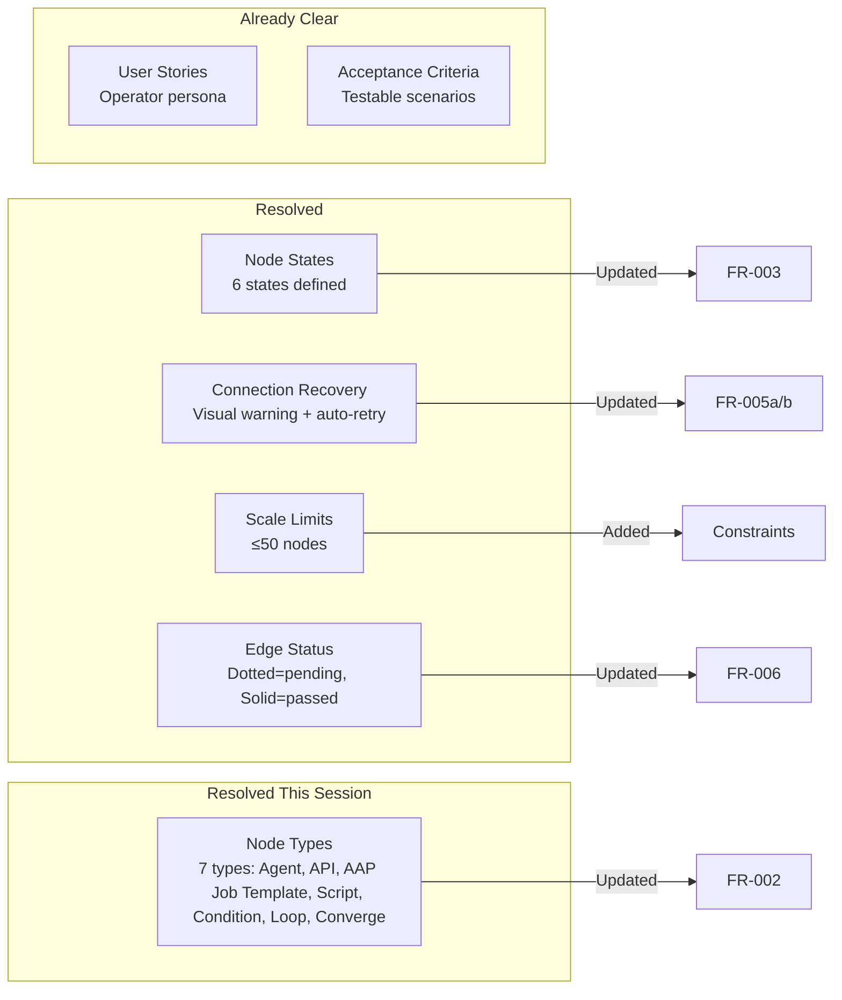
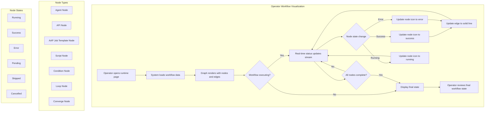

# Feature Specification: Visualize Workflow Execution

- **Feature Branch**: `020-visualize-execution`
- **Created**: 2025-12-10
- **Status**: Draft
- **Jira Ticket**: [AAP-60440](AAP-60440)
- **Parent Epic**: [AAP-58247 - Visualize Workflow Execution](AAP-58247)

---

## Overview

This specification defines the requirements for visualizing workflow execution in Nexus. The feature provides operators with a single view to monitor automation workflows in real-time through an interactive graph representation.

## Clarifications

### Session 2025-12-10

- Q: Which node states should the visualization support? → A: Extended (6 states): Running, Success, Error, Pending, Skipped, Cancelled. Skipped represents conditional pathways not taken.
- Q: What should happen when the real-time update connection is lost? → A: Visual warning - show banner/indicator that data may be stale while auto-retrying in background.
- Q: What is the maximum workflow size the visualization must support? → A: Small (≤50 nodes) for initial implementation.
- Q: What color should edges display in their default/pending state? → A: Dotted white line for pending, solid white line for passed transitions.
- Q: Are there additional node types beyond the 4 listed? → A: Yes, add Condition (branching logic) and Loop (iteration constructs) node types.
- Q: How are loop iterations visualized? → A: Loop nodes display an iteration counter. Nodes inside the loop show their current iteration's status only.

#### Clarification Coverage

---

### Epic Context

The parent epic (AAP-58247) establishes the vision for workflow visualization:
- **Primary Persona**: Operators who need to monitor automation workflows
- **Core Value**: Real-time visibility into workflow execution status and health

---

## User Scenarios & Testing

### Primary User Story

As an **Operator**, I want to see a real-time, interactive graph of my entire workflow, so that I can visually monitor its progress and health at a glance.

### Supporting User Stories

1. **As an Operator**, I want to see my workflow displayed as a graph of nodes connected by edges, so that I can understand the complete flow of tasks.

2. **As an Operator**, I want to see a unique icon for each node type (agent, API, AAP job template, script, condition, loop, converge), so that I can quickly distinguish between different kinds of steps.

3. **As an Operator**, I want to see the status of each node (running, success, error) update with an icon in real-time, so that I can immediately identify where the workflow is and if it's healthy.

### Acceptance Scenarios

1. **Given** I am viewing the runtime page for a specific workflow, **When** the page loads, **Then** I should see the entire workflow rendered as a graph of nodes and connecting edges.

2. **Given** the workflow graph is rendered, **When** I look at any node, **Then** I should see a distinct icon that indicates its type (agent, api, script, etc).

3. **Given** a node is running, **When** its state changes to "success", **Then** its icon must update to show "success".

4. **Given** a node is running, **When** its state changes to "error", **Then** its icon must update to show "error".

5. **Given** a node successfully passes data to the next, **When** the transition is complete, **Then** the edge connecting them should change from dotted to solid white.

6. **Given** a node is still pending or running, **When** the transition has not yet occurred, **Then** the edge(s) connecting it to the next node(s) should remain a dotted line.

7. **Given** I am viewing an active workflow execution, **When** the workflow runs for an extended period (e.g., 10+ minutes), **Then** status updates should continue to be received without manual refresh.

8. **Given** I am viewing an active workflow, **When** the connection to the status update stream is lost, **Then** I should see a warning indicating that the displayed data may not reflect current state.

9. **Given** the connection was lost and a warning is displayed, **When** the connection is restored, **Then** the warning should be removed and the visualization should resync to current state.

### Edge Cases

- What happens when the workflow has circular dependencies or loops?
- How does the system handle very large workflows with hundreds of nodes?
- How are parallel execution paths displayed?
- What happens when a node has multiple incoming or outgoing edges?

---

## Requirements

### Functional Requirements

#### Graph Rendering

- **FR-001**: System MUST automatically display the complete workflow structure as an interactive graph with nodes and edges when the user navigates to view an execution

#### Node Visualization

- **FR-002**: System MUST display a distinct icon for each node type:
  - Agent nodes
  - API nodes
  - AAP Job Template nodes (Ansible Automation Platform Job Template)
  - Script nodes
  - Condition nodes (branching/decision logic)
  - Loop nodes (iteration constructs)
  - Converge nodes (wait for parallel branches)

- **FR-003**: Each node MUST display its current execution status through visual indicators:
  - Pending state (not yet started)
  - Running state (currently executing)
  - Success state (completed successfully)
  - Error state (failed execution)
  - Skipped state (conditional pathway not taken)
  - Cancelled state (execution terminated by user/system)

#### Real-Time Updates

- **FR-004**: System MUST automatically update node status icons when a state change occurs (no page refresh required)
- **FR-005**: UI MUST maintain a WebSocket connection to the backend while the user is viewing the execution visualization page
- **FR-005a**: If connection is lost, system MUST display a visual indicator (banner) warning that data may be stale
- **FR-005b**: System MUST automatically retry connection in the background when disconnected

#### Edge Visualization

- **FR-006**: Edge status MUST be visually indicated:
  - Pending: Dotted white line (boundary not yet passed)
  - Passed: Solid white line (boundary has been passed)
- **FR-007**: Edges MUST indicate data flow and execution order direction

### Key Entities

- **Workflow**: The complete automation workflow being visualized, containing multiple nodes and their connections
- **Node**: An individual step in the workflow (agent, api, AAP job template, script, condition, loop, or converge) with a type and status
- **Edge**: A connection between two nodes representing data flow and execution order
- **Node Status**: The current execution state of a node (pending, running, success, error, skipped, cancelled)
- **Transition**: The movement of data/control from one node to the next (boundary passed or pending)

---

## User Flow Diagram

---

## Review & Acceptance Checklist

### Content Quality

- [x] No implementation details (languages, frameworks, APIs)
- [x] Focused on user value and business needs
- [x] Written for non-technical stakeholders
- [x] All mandatory sections completed

### Requirement Completeness

- [x] No [NEEDS CLARIFICATION] markers remain
- [x] Requirements are testable and unambiguous
- [x] Success criteria are measurable
- [x] Scope is clearly bounded
- [x] Dependencies and assumptions identified

---

## Constraints

- **Scale**: Initial implementation targets workflows with ≤50 nodes. Larger workflows are out of scope for this phase.

---

## Execution Status

- [x] User description parsed
- [x] Key concepts extracted
- [x] Ambiguities marked
- [x] User scenarios defined
- [x] Requirements generated
- [x] Entities identified
- [x] Review checklist passed

---

## Deliverables (per AAP-60440)

1. Spec-kit spec is created, reviewed, and merged to the nexus repo
2. Spec-kit plan is created, reviewed, and merged to the nexus repo
3. Design proposal is submitted to the ansible engineering handbook
