# Tasks: Visualize Workflow Execution

**Input**: Design documents from `/specs/024-execution-visualizer/`
**Prerequisites**: plan.md ✓, research.md ✓, data-model.md ✓, quickstart.md ✓
**Repositories**:
- **Backend**: `nexus` (this repo) - Python/FastAPI
- **Frontend**: `nexus-ui` (separate repo) - TypeScript/React

---

## Task Dependency Diagram

```mermaid
flowchart TB
    subgraph BACKEND_DONE["🔧 BACKEND - Existing ✅"]
        direction TB
        B001["B001: ✅ ActivitySyncService"]
        B002["B002: ✅ MonitoringWorkflowInterceptor"]
        B003["B003: ✅ register_activity_monitoring"]
        B004["B004: ✅ Workflow queries"]
        B005["B005: ✅ Activity traversal"]
        B006["B006: ✅ SKIPPED/CANCELLED status"]
    end

    subgraph BACKEND_TODO["🔧 BACKEND - TODO"]
        direction TB
        B007["B007: REST API include=workflow_definition"]
        B008["B008: Valkey publisher"]
        B009["B009: Integrate with ActivitySyncService"]
        B010["B010: WebSocket handler + subscriber"]
        B011["B011: Message schemas"]
        B012["B012: Unit tests"]
        B013["B013: Integration tests"]

        B007 --> F006
        B008 --> B009
        B009 --> B010
        B011 --> B010
        B010 --> B013
    end

    subgraph FRONTEND["🎨 FRONTEND (nexus-ui) - 18 tasks"]
        direction TB
        F001["F001: TypeScript types"]
        F002["F002: activityState utils"]
        F003["F003: Update executorMetadata"]
        F004["F004: useExecutionStore"]
        F005["F005: useEdgeStatus hook"]
        F006["F006: useExecutionData hook"]
        F007["F007: useExecutionWebSocket"]
        F008["F008: StatusBadge component"]
        F009["F009: ExecutionNode component"]
        F010["F010: ExecutionEdge component"]
        F011["F011: ExecutionCanvas"]
        F012["F012: ExecutionHeader"]
        F013["F013: ExecutionPage"]
        F014["F014: ConnectionBanner"]
        F015["F015: Add route"]
        F016["F016: Navigation links"]
        F017["F017: Unit tests"]
        F018["F018: Integration tests"]

        F001 --> F004
        F001 --> F005
        F002 --> F004
        F003 --> F008
        F004 --> F006
        F004 --> F007
        F005 --> F010
        F005 --> F011
        F006 --> F013
        F007 --> F013
        F008 --> F009
        F009 --> F011
        F010 --> F011
        F011 --> F013
        F012 --> F013
        F014 --> F013
        F013 --> F015
        F015 --> F016
        F004 --> F017
        F005 --> F017
        F006 --> F018
    end

    B001 -.->|"Database sync"| F006
    B010 -.->|"WebSocket API"| F007
```



---

## 🔧 BACKEND TASKS (nexus repository)

### Phase B1: Activity Sync Infrastructure ✅ Existing

The following backend components have been implemented in commit 19adab46:

- [x] **B001** ✅ ActivitySyncService - Stream Temporal events to database
  - File: `src/nexus/workflows/workflow_engine/services/activity_sync_service.py`
  - Streams Temporal workflow history events in real-time
  - Syncs activity status to `ActivityExecution` table
  - Creates all ActivityExecution records upfront when monitoring starts
  - Handles condition branch skipping (marks untaken branches as SKIPPED)

- [x] **B002** ✅ MonitoringWorkflowInterceptor - Auto-start monitoring
  - File: `src/nexus/workflows/workflow_engine/interceptors/monitoring_interceptor.py`
  - Auto-starts monitoring on workflow init via `execute_workflow` interceptor
  - Registered with Temporal worker for all workflow executions
  - Ensures monitoring survives worker restarts

- [x] **B003** ✅ register_activity_monitoring activity
  - File: `src/nexus/workflows/workflow_engine/activities/internal/activity_monitoring.py`
  - Internal activity that registers monitoring with the ActivitySyncService
  - Waits for Execution record to be created in DB with exponential backoff
  - Checks if monitoring is already running before starting

- [x] **B004** ✅ Workflow queries for activity input/output
  - File: `src/nexus/workflows/workflow_engine/dynamic_workflow.py`
  - Added `get_activity_input()` query for activity input data
  - Added `get_activity_output()` query for activity output data
  - Used by ActivitySyncService to fetch runtime data

- [x] **B005** ✅ Activity traversal utility
  - File: `src/nexus/workflows/utils/activity_traversal.py`
  - `traverse_activities()` - Walk through workflow definition
  - `build_branch_head_map()` - Map activities to condition branches
  - `collect_branch_activity_ids()` - Collect IDs in a branch

- [x] **B006** ✅ SKIPPED and CANCELLED status values
  - File: `src/nexus/workflows/models/activity_execution.py`
  - Added `SKIPPED = "skipped"` to ActivityStatus enum
  - Added `CANCELLED = "cancelled"` to ActivityStatus enum

### Phase B2: REST API Extension (TODO)

- [ ] **B007** Extend ExecutionRead schema with optional workflow_definition and activities
  - File: `src/nexus/workflows/models/execution.py`
  - Add `ActivityData` model: activity_id, status, error_details, started_at, completed_at
  - Add optional `workflow_definition: dict[str, Any] | None` field to `ExecutionRead`
  - Add optional `activities: list[ActivityData] | None` field to `ExecutionRead`
  - File: `src/nexus/api/v1/executions.py`
  - Add `include: list[str] = Query(default=[])` parameter to `get_execution()`
  - Populate `workflow_definition` when `?include=workflow_definition` is requested
  - Populate `activities` when `?include=activities` is requested
  - See data-model.md Section 10.2

### Phase B3: Valkey Streams + WebSocket Streaming (TODO)

> **Architecture**: ActivitySyncService runs on Temporal worker, WebSocket connections live on API server(s). Valkey Streams bridge this process boundary and enable event replay.

- [ ] **B008** Create ActivityUpdatePublisher for Valkey Streams
  - File: `src/nexus/workflows/services/activity_update_publisher.py`
  - Implement `ActivityUpdatePublisher` class with `publish_activity_patch()` method
  - Publish to Valkey Stream using XADD: `execution:{execution_id}:events`
  - Message format: JSON Patch with `{"type": "activity_patch", "execution_id": "...", "event_id": "<valkey-stream-id>", "ops": [...]}`
  - See quickstart.md Step 2 and data-model.md Section 3.1

- [ ] **B009** Integrate publisher with ActivitySyncService
  - File: `src/nexus/workflows/workflow_engine/services/activity_sync_service.py`
  - Add optional `publisher: ActivityUpdatePublisher` parameter to `__init__()`
  - **Integration point**: After `await session.commit()` (line 416) in `_sync_activities_to_db()`
  - **Event flow**: All Temporal events flow through `_process_activity_event()` (line 319) → `_sync_activities_to_db()` → **[NEW]** Valkey Streams publish
  - Build JSON Patch operations for changed activities and publish:
    ```python
    if self.publisher:
        ops = []
        for activity_data in temp_map.values():
            # Determine if this is initial state (use op=add) or update (use op=replace)
            activity_path = f"/activities/{activity_data['activity_id']}"
            ops.append({
                "op": "replace",  # or "add" for initial state
                "path": f"{activity_path}/status",
                "value": activity_data["status"].value
            })
            if activity_data.get("error_details"):
                ops.append({"op": "add", "path": f"{activity_path}/error_details", "value": activity_data["error_details"]})
        await self.publisher.publish_activity_patch(execution_id=str(execution_id), ops=ops)
    ```
  - Update `activity_sync_registry.py` to inject publisher dependency
  - See quickstart.md Step 2 and data-model.md Section 9.5

- [ ] **B010** Create WebSocket handler with Valkey Streams consumer
  - File: `src/nexus/workflows/ws/execution_streaming.py`
  - Follow auto-discovery convention: `SPEC_PATH`, `handle_{channel}()`, `on_connect_{channel}()`
  - Implement `handle_activityUpdates()` (dummy for server-to-client channel)
  - Implement `on_connect_activityUpdates()` with Valkey Streams XREAD consumer
  - Read from Valkey Stream: `execution:{execution_id}:events`
  - Support WebSocket query parameter `replay=<event_id>`:
    - No parameter: Read only new events (BLOCK on stream)
    - `replay=0`: Read from beginning (send ExecutionSnapshotMessage with type="initial_snapshot" first, then all events)
    - `replay=<event_id>`: Read from that event_id onwards
  - Use XREAD with BLOCK for live streaming, without BLOCK for replay
  - Forward stream messages (JSON Patch format) to WebSocket client
  - When execution completes, send ExecutionSnapshotMessage with type="final_snapshot" and disconnect
  - Get `valkey_client` from `websocket.app.state` (injected at startup)
  - See quickstart.md Step 3 and data-model.md Section 10.3

- [ ] **B011** [P] Create WebSocket message schemas
  - File: `src/nexus/workflows/schemas/visualization.py`
  - Create `ExecutionSnapshotMessage`, `JsonPatchOperation`, `ActivityPatchMessage` for WebSocket
  - `ExecutionSnapshotMessage`: type=Literal["initial_snapshot", "final_snapshot"], execution_id, event_id, execution (reuses Execution schema from shared-schemas.yaml), timestamp
    - "initial_snapshot": First message when replaying from beginning
    - "final_snapshot": Last message when execution completes, server disconnects after sending
  - **IMPORTANT**: `ExecutionSnapshotMessage.execution` uses the same `Execution` schema as REST API, enabling unified UI processing logic
  - `JsonPatchOperation`: op (add/remove/replace/move/copy/test), path, value, from_
  - `ActivityPatchMessage`: type="activity_patch", execution_id, event_id (Valkey stream ID), ops[], timestamp
  - Note: Node/edge/graph schemas are frontend-only (built client-side from workflow_definition)
  - See data-model.md Section 3

### Phase B4: Testing

- [ ] **B012** [P] Unit tests for visualization components
  - File: `tests/unit/workflows/test_activity_sync_service.py` - Test ActivitySyncService
  - File: `tests/unit/workflows/test_monitoring_interceptor.py` - Test interceptor
  - File: `tests/unit/workflows/test_activity_traversal.py` - Test traversal utilities
  - File: `tests/unit/workflows/test_visualization_schemas.py` - Test schema validation
  - File: `tests/unit/workflows/test_activity_update_publisher.py` - Test Valkey publisher
  - File: `tests/unit/workflows/test_execution_streaming.py` - Test WebSocket handler

- [ ] **B013** Integration tests for WebSocket streaming
  - File: `tests/integration/workflows/test_execution_visualization_ws.py`
  - Test WebSocket connection lifecycle (connect, message, disconnect, reconnect)
  - Test message types: `initial_snapshot`, `final_snapshot`, `activity_patch` (JSON Patch)
  - Test `initial_snapshot` message sent first when `replay=0`
  - Test `final_snapshot` message sent last when execution completes, followed by disconnect
  - Test activity state changes propagate to connected clients
  - Test replay parameter: `replay=0`, `replay=<event_id>`, no replay parameter
  - Test JSON Patch operations: op=add for initial state, op=replace for updates
  - Test timestamp field in all messages

---

## 🎨 FRONTEND TASKS (nexus-ui repository)

### Phase F1: Types & Setup

- [ ] **F001** [P] Create TypeScript type definitions for visualization
  - File: `packages/nexus-ui/src/routes/automations/execution/types.ts`
  - Define `NodeStatus`, `EdgeStatus`, `NodeType` type unions
  - Define `NodeVisualization`, `EdgeVisualization`, `ExecutionVisualization` interfaces
  - Define `ExecutionSnapshotMessage` interface: type='initial_snapshot' | 'final_snapshot', execution_id, event_id, execution (uses Execution interface from REST API), timestamp
  - **IMPORTANT**: `ExecutionSnapshotMessage.execution` uses the same `Execution` interface as REST API, enabling unified UI processing logic
  - Define `JsonPatchOperation` interface: op, path, value, from
  - Define `ActivityPatchMessage` interface: type="activity_patch", execution_id, event_id, ops[], timestamp
  - Define `WebSocketMessage` discriminated union (`ExecutionSnapshotMessage | ActivityPatchMessage`)
  - Note: Reuse existing `Execution` and `ActivityData` interfaces from REST API types
  - See data-model.md Section 4

- [ ] **F002** [P] Create activity state utility functions
  - File: `packages/nexus-ui/src/routes/automations/execution/utils/activityState.ts`
  - Implement helper functions for activity state management
  - Implement `applyJsonPatch()` function to apply JSON Patch operations to activity state
  - Handle op=add, op=replace, op=remove operations for activity paths
  - Build activity state maps from JSON Patch operations
  - See data-model.md Section 4 and test-workflow-events.json for examples

- [ ] **F003** [P] Update executorMetadata key for AAP job templates
  - File: `packages/nexus-ui/src/routes/automations/canvas/nodes/nodeMetadata.ts`
  - Change key from `aap` to `aap_job_template` to match backend enum
  - Verify existing usages don't break (check TaskNode.tsx detection logic)

### Phase F2: State Management

- [ ] **F004** Create useExecutionStore Zustand store
  - File: `packages/nexus-ui/src/routes/automations/stores/useExecutionStore.ts`
  - Implement state: `executionId`, `visualization`, `activityStates`, `activityErrors`, `isConnected`, `isStale`, `error`
  - Implement actions: `setVisualization`, `setInitialState`, `updateActivityStatus`, `setConnected`, `setStale`, `reset`
  - `updateActivityStatus(activityId, status, errorDetails?)` - Update single activity from WebSocket
  - Use immer middleware for immutable updates
  - See quickstart.md Step 1

- [ ] **F005** [P] Create useEdgeStatus hook for client-side edge derivation
  - File: `packages/nexus-ui/src/routes/automations/hooks/useEdgeStatus.ts`
  - Implement `deriveEdgeStatus(sourceStatus)` function
  - Return edge status: 'pending' (dotted) or 'passed' (solid) based on source node status
  - If source node is success/error/cancelled → 'passed', otherwise → 'pending'
  - Follow derivation rules from data-model.md Section 2.4
  - See quickstart.md Step 3

### Phase F3: Data Fetching & WebSocket

- [ ] **F006** Create useExecutionData hook for REST data fetching
  - File: `packages/nexus-ui/src/routes/automations/hooks/useExecutionData.ts`
  - Fetch execution via `GET /api/v1/executions/{id}?include=workflow_definition`
  - Build visualization graph client-side from workflow_definition
  - Note: Activity states are delivered via WebSocket with `replay=0`, not REST
  - Use TanStack Query for execution and workflow definition fetching only
  - See quickstart.md Step 2 (useExecutionData hook) and data-model.md Section 10.4

- [ ] **F007** [P] Create useExecutionWebSocket hook for streaming with replay
  - File: `packages/nexus-ui/src/routes/automations/hooks/useExecutionWebSocket.ts`
  - Implement WebSocket connection to `/ws/workflows/v1/executions/{executionId}?replay=0`
  - Support replay parameter: `replay=0` for initial state, `replay=<event_id>` for reconnection
  - Handle message types: `initial_snapshot`, `final_snapshot`, `activity_patch` (JSON Patch)
  - On `initial_snapshot`: Set initial execution state
  - On `final_snapshot`: Set final execution state and close connection
  - On `activity_patch`: Apply JSON Patch operations using `applyJsonPatch()` utility from F002
  - Track last received `event_id` for reconnection replay
  - Implement auto-reconnection with exponential backoff and replay from last event_id
  - See quickstart.md Step 2 (useExecutionWebSocket hook) and data-model.md Section 10.3

### Phase F4: Components

- [ ] **F008** Create StatusBadge component for runtime node overlay
  - File: `packages/nexus-ui/src/routes/automations/canvas/nodes/StatusBadge.tsx`
  - Display status badge at bottom-right corner of nodes
  - Implement visual indicators per data-model.md Section 6.1:
    - pending: gray border, ellipsis icon
    - running: blue border, spinner (animated)
    - success: green border, checkmark
    - error: red border, exclamation (pulse animation)
    - skipped: gray dashed border, skip arrow
    - cancelled: orange border, stop icon
  - See quickstart.md Step 5

- [ ] **F009** [P] Create ExecutionNode component
  - File: `packages/nexus-ui/src/routes/automations/execution/ExecutionNode.tsx`
  - Custom ReactFlow node type for runtime visualization
  - Compose with StatusBadge component from F008
  - Display node name (or nodeId as fallback), type icon, and status
  - Reuse existing node styling from `canvas/nodes/` where applicable
  - Handle all NodeType values (agent, api, script, aap_job_template, condition, loop, converge)

- [ ] **F010** [P] Create ExecutionEdge component
  - File: `packages/nexus-ui/src/routes/automations/execution/ExecutionEdge.tsx`
  - Custom ReactFlow edge type with status-based styling
  - Implement visual indicators per data-model.md Section 6.2:
    - pending: dotted white line (boundary not yet passed)
    - passed: solid white line (boundary has been passed)
  - No success/fail colors or badges on edges - node badges indicate outcome
  - No interactive buttons (runtime is read-only)

- [ ] **F011** Create ExecutionCanvas component
  - File: `packages/nexus-ui/src/routes/automations/execution/ExecutionCanvas.tsx`
  - Use ReactFlow with custom `ExecutionNode` and `ExecutionEdge` types
  - Register node/edge types: `{ execution: ExecutionNode }`, `{ execution: ExecutionEdge }`
  - Transform `ExecutionVisualization` to ReactFlow nodes/edges format
  - Use `useEdgeStatus` hook to derive edge statuses from node statuses
  - Configure: `fitView`, `nodesDraggable=true`, `nodesConnectable=false`, `elementsSelectable=true`
  - See quickstart.md Step 4

- [ ] **F012** Create ExecutionHeader component
  - File: `packages/nexus-ui/src/routes/automations/execution/ExecutionHeader.tsx`
  - Display workflow name and execution status badge (Preparing, Running, Successful, Failed)
  - Show elapsed time since execution started (auto-updating)
  - Include "Stop automation" button (calls cancel execution API)
  - See data-model.md Section 6.3 and UX mockups

- [ ] **F013** Create ExecutionPage component
  - File: `packages/nexus-ui/src/routes/automations/execution/ExecutionPage.tsx`
  - Compose: ExecutionHeader + ExecutionCanvas + ConnectionBanner
  - Use `useHybridState` for initial data fetch
  - Use `useExecutionWebSocket` for real-time updates
  - Handle loading, error, and empty states
  - See data-model.md Section 6.3

- [ ] **F014** [P] Create ConnectionBanner component
  - File: `packages/nexus-ui/src/components/ConnectionBanner.tsx`
  - Display stale data warning when `isStale` is true
  - Message: "Connection lost. Data may be out of date. Reconnecting..."
  - Include manual "Retry Now" button that calls `reconnect()` from WebSocket hook
  - Auto-dismiss when connection is restored
  - See research.md Section 7.2

### Phase F5: Routing & Integration

- [ ] **F015** Add execution visualization route
  - File: `packages/nexus-ui/src/app/AppRoute.tsx`
  - Extend existing `Executions.Execution` route or add new route
  - Current: `/executions/:executionId` - may need workflow context
  - Alternative: `/automations/:workflowId/executions/:executionId`
  - Lazy load `ExecutionPage` component
  - File: `packages/nexus-ui/src/routes/executions/` - update or create route handler

- [ ] **F016** [P] Add navigation from workflow list to execution visualization
  - File: `packages/nexus-ui/src/routes/automations/Automations.tsx` (or relevant list component)
  - Add link/button to view execution for workflows with active/recent executions
  - Consider adding execution status indicator to workflow list items

### Phase F6: Testing

- [ ] **F017** [P] Unit tests for frontend components
  - File: `packages/nexus-ui/src/routes/automations/stores/useExecutionStore.test.ts` - Test store actions and state
  - File: `packages/nexus-ui/src/routes/automations/hooks/useEdgeStatus.test.ts` - Test edge derivation logic
  - File: `packages/nexus-ui/src/routes/automations/canvas/nodes/StatusBadge.test.tsx` - Test status rendering
  - File: `packages/nexus-ui/src/routes/automations/execution/ExecutionNode.test.tsx` - Test node rendering
  - File: `packages/nexus-ui/src/routes/automations/execution/ExecutionCanvas.test.tsx` - Test graph rendering

- [ ] **F018** Integration tests for WebSocket connection
  - File: `packages/nexus-ui/src/routes/automations/hooks/useExecutionWebSocket.test.ts`
  - Test connection lifecycle (connect, message, disconnect, reconnect)
  - Test message handling for all message types (`initial_snapshot`, `final_snapshot`, `activity_patch`)
  - Test `initial_snapshot` handling: Set initial execution state
  - Test `final_snapshot` handling: Set final state and close connection
  - Test JSON Patch application: op=add for initial state, op=replace for updates
  - Test store updates from JSON Patch operations
  - Test reconnection with `replay=<last_event_id>` parameter
  - Test tracking of last received event_id
  - Test timestamp field in all messages
  - Mock WebSocket for testing with test data from test-workflow-events.json

---

## Dependencies Summary

### Backend Dependencies (B001-B013)
```
✅ Existing (commit 19adab46):
B001 (ActivitySyncService) - core sync infrastructure
B002 (MonitoringWorkflowInterceptor) - auto-start monitoring
B003 (register_activity_monitoring) - registration activity
B004 (Workflow queries) - get_activity_input/output
B005 (Activity traversal) - workflow traversal utilities
B006 (SKIPPED/CANCELLED status) - status enum values

TODO (REST API + Valkey Streams Architecture):
B007 (REST API extension) - include=workflow_definition and include=activities query params
B008 (Valkey Streams publisher) - ActivityUpdatePublisher class with JSON Patch
B009 (Integrate with ActivitySyncService) - requires B008
B010 (WebSocket handler + XREAD consumer) - requires B009, B011, supports replay parameter
B011 (Message schemas) [P] - ActivityData, ExecutionData, ExecutionSnapshotMessage, JsonPatchOperation, ActivityPatchMessage
B012 (Unit tests) - test publisher, handler, schemas, JSON Patch operations
B013 (Integration tests) - requires B010, test replay functionality
```

### Frontend Dependencies (F001-F018)
```
F001 (types) [P] → F004, F005, F006, F007
F002 (activityState utils) [P] → F004
F003 (executorMetadata) [P] → F008, F009
F004 (store) → F006, F007, F017
F005 (useEdgeStatus) [P] → F010, F011, F017
F006 (useExecutionData) → F013
F007 (useExecutionWebSocket) [P] → F013
F008 (StatusBadge) → F009
F009 (ExecutionNode) [P] → F011
F010 (ExecutionEdge) [P] → F011
F011 (ExecutionCanvas) → F013
F012 (ExecutionHeader) → F013
F013 (ExecutionPage) → F015
F014 (ConnectionBanner) [P] → F013
F015 (route) → F016
F016 (navigation) - final frontend integration
F017 (unit tests) - can run after F004, F005, F008, F009
F018 (integration tests) - requires F006
```

### Cross-Repository Dependencies
```
B001 (ActivitySyncService) → F007 (useExecutionWebSocket) - activity states via Valkey Streams
B007 (REST API extension) → F006 (useExecutionData) - workflow_definition for graph building
B009 (Valkey Streams publisher integration) → B010 (WebSocket handler) - stream publishing
B010 (WebSocket API with replay) → F007 (useExecutionWebSocket) - JSON Patch streaming via Valkey Streams
```

---

## Parallel Execution Examples

### Backend Parallel Tasks
```bash
# Phase B2 (REST API):
Task: "B007 - Extend ExecutionRead with include=workflow_definition"

# Phase B3 parallel tasks:
Task: "B008 - Create ActivityUpdatePublisher"
Task: "B011 - Create WebSocket message schemas"

# Phase B3 sequential (after B008):
Task: "B009 - Integrate publisher with ActivitySyncService"
Task: "B010 - Create WebSocket handler with Valkey subscriber"

# Phase B4 tests (after B010):
Task: "B012 - Unit tests for publisher and handler"
Task: "B013 - Integration tests for WebSocket streaming"
```

### Frontend Parallel Tasks
```bash
# Phase F1 parallel tasks:
Task: "F001 - Create TypeScript type definitions"
Task: "F002 - Create activity state utility functions"
Task: "F003 - Update executorMetadata key"

# Phase F2 parallel with F004:
Task: "F005 - Create useEdgeStatus hook"

# Phase F4 parallel component tasks:
Task: "F009 - Create ExecutionNode component"
Task: "F010 - Create ExecutionEdge component"
Task: "F014 - Create ConnectionBanner component"

# Phase F6 unit tests (after dependencies):
Task: "F017 - Unit tests for frontend components"
```

---

## Validation Checklist

- [x] AsyncAPI spec exists: `src/nexus/schemas/workflows/websocket-execution-streaming.yaml`
- [x] All entities from data-model have corresponding tasks
- [x] All WebSocket messages have handler implementations (B010, B011)
- [x] Parallel tasks are truly independent (different files)
- [x] Each task specifies exact file path
- [x] Backend and frontend tasks are clearly separated
- [x] Cross-repo dependencies are documented

---

## 📋 FOLLOW-UP TASKS

These tasks should be completed after the main implementation is done.

### Phase FU1: Future Feature Specifications

- [ ] **FU001** Create log streaming feature specification
  - Directory: `specs/025-log-streaming/`
  - Create `spec.md` with:
    - Problem statement: Real-time log streaming from workflow activities
    - Requirements: FR-001 to FR-005 (stream logs, multi-topic, buffering, filtering, persistence)
    - Non-functional requirements (latency, concurrency, retention)
    - Technical considerations (Temporal integration, storage options)
    - Reference AAP-60127 Log Streaming section for original design
  - This feature was deferred from AAP-60127 to focus on execution visualization

---

## Notes

- **[P]** = Can run in parallel with other [P] tasks in same phase
- Backend tasks (B###) are in the `nexus` repository
- Frontend tasks (F###) are in the `nexus-ui` repository
- Commit after each task completion
- Run `make format && make lint && make test-all` after backend changes
- Run `npm run format && npm run eslint && npm test` after frontend changes
