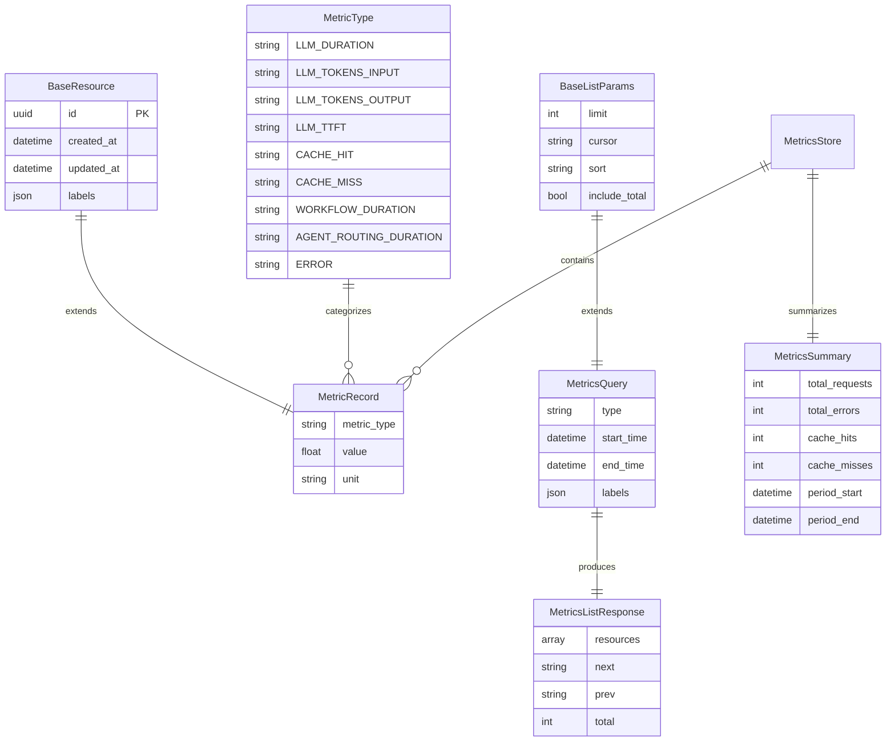

# Data Model: LLM/Agent Performance Metrics Exposure

**Feature**: 025-llm-agent-performance-kpis
**Date**: 2025-12-17

## Overview

This document defines the data models for the metrics exposure system. The system uses a combination of:
1. **In-memory models** for fast metrics recording and querying (REST API)
2. **Prometheus metrics** for aggregated time-series data (OpenMetrics format)

Note: Unlike other Nexus features, metrics are NOT persisted to PostgreSQL. They are stored in-memory with configurable retention.

## Entities

### 1. MetricType (Enum)

**Purpose**: Categorizes metrics for filtering and organization.

**Definition**:
```python
# File: src/nexus/metrics/types.py
from enum import Enum

class MetricType(str, Enum):
    """Categories of metrics recorded by Nexus."""

    # LLM Metrics (FR-005 to FR-010)
    LLM_DURATION = "llm_duration_ms"
    LLM_TOKENS_INPUT = "llm_tokens_input"
    LLM_TOKENS_OUTPUT = "llm_tokens_output"
    LLM_TTFT = "llm_ttft_ms"  # Time To First Token
    LLM_STATUS = "llm_status"  # success/failure

    # Cache Metrics (FR-011 to FR-013)
    CACHE_HIT = "cache_hit"
    CACHE_MISS = "cache_miss"
    CACHE_LOOKUP_DURATION = "cache_lookup_ms"
    CACHE_UTILIZATION = "cache_utilization_ratio"

    # Workflow Metrics (FR-014 to FR-017)
    WORKFLOW_DURATION = "workflow_duration_ms"
    WORKFLOW_STATUS = "workflow_status"
    ACTIVITY_DURATION = "activity_duration_ms"

    # Agent Metrics (FR-018 to FR-020)
    AGENT_ROUTING_DURATION = "agent_routing_ms"
    AGENT_INVOCATION_DURATION = "agent_invocation_ms"
    AGENT_STATUS = "agent_status"

    # System Overhead Metrics (FR-021 to FR-023)
    REQUEST_DURATION = "request_duration_ms"
    COMPONENT_DURATION = "component_duration_ms"

    # Error Metrics (FR-024 to FR-025)
    ERROR = "error"
```

**Grouping by Category**:
```python
# For /api/v1/metrics?type=llm filtering
METRIC_CATEGORIES = {
    "llm": [MetricType.LLM_DURATION, MetricType.LLM_TOKENS_INPUT,
            MetricType.LLM_TOKENS_OUTPUT, MetricType.LLM_TTFT, MetricType.LLM_STATUS],
    "cache": [MetricType.CACHE_HIT, MetricType.CACHE_MISS,
              MetricType.CACHE_LOOKUP_DURATION, MetricType.CACHE_UTILIZATION],
    "workflow": [MetricType.WORKFLOW_DURATION, MetricType.WORKFLOW_STATUS,
                 MetricType.ACTIVITY_DURATION],
    "agent": [MetricType.AGENT_ROUTING_DURATION, MetricType.AGENT_INVOCATION_DURATION,
              MetricType.AGENT_STATUS],
    "error": [MetricType.ERROR],
}
```

---

### 2. MetricRecord (SQLModel)

**Purpose**: Individual metric data point with timestamp, type, value, and labels. Stored in-memory, not database.

> **Note**: Although metrics are NOT persisted to PostgreSQL, we follow the Nexus architectural decision
> to use SQLModel for all data models. This provides built-in serialization, validation, and consistency
> with other Nexus resources. See [Decision Records](../../decision-records.md).

**Definition**:
```python
# File: src/nexus/metrics/types.py
from sqlmodel import Field

from nexus.core.models.base import BaseResource


class MetricRecord(BaseResource):
    """Individual metric data point.

    Extends BaseResource to leverage built-in support for:
    - Filtering, sorting, and pagination
    - Serialization via model_dump() / model_dump_json()
    - Consistent validation with other Nexus resources

    Inherited from BaseResource:
    - id: UUID (unique identifier)
    - created_at: datetime (serves as recording timestamp)
    - updated_at: datetime (not used for immutable metrics)
    - labels: dict[str, str] (key-value pairs for filtering/grouping)

    Note: Metrics are stored in-memory, not PostgreSQL.
    """

    metric_type: MetricType = Field(
        ...,
        description="Type/category of metric"
    )
    value: float = Field(
        ...,
        description="Metric value (e.g., duration in ms, count)"
    )
    unit: str = Field(
        default="",
        description="Unit of measurement (ms, count, ratio, tokens)"
    )
```

**Fields**:
- `id`: UUID, auto-generated (inherited from BaseResource)
- `created_at`: UTC timestamp when metric was recorded (inherited from BaseResource)
- `updated_at`: Not used for immutable metrics (inherited from BaseResource)
- `labels`: Key-value pairs for filtering/grouping (inherited from BaseResource)
- `metric_type`: Enum value categorizing the metric
- `value`: Numeric value (duration, count, ratio)
- `unit`: Measurement unit (ms, count, ratio, tokens)

**Common Label Keys**:
```python
# Standard labels used across metrics
STANDARD_LABELS = {
    # LLM metrics
    "model": "gpt-4",  # LLM model name
    "provider": "openai",  # LLM provider
    "status": "success",  # success/error

    # Workflow metrics
    "workflow_id": "uuid",
    "execution_id": "uuid",
    "activity_name": "fetch_context",

    # Agent metrics
    "agent_type": "router",

    # Error metrics
    "error_type": "timeout",  # timeout, rate_limit, validation, internal
    "correlation_id": "uuid",

    # Request metrics
    "endpoint": "/api/v1/chat",
    "method": "POST",
}
```

---

### 3. MetricsQuery (Query Parameters)

**Purpose**: Query parameters for the `/api/v1/metrics` endpoint using cursor-based pagination.

> **Note**: Extends `BaseListParams` to inherit standard pagination parameters (limit, cursor, sort, include_total).
> See [spec 006 data model](../006-create-shared-resources/data-model.md) for pagination patterns.

**Definition**:
```python
# File: src/nexus/metrics/types.py
from datetime import datetime
from typing import Literal

from sqlmodel import Field

from nexus.core.models.base import BaseListParams


class MetricsQuery(BaseListParams):
    """Query parameters for metrics API with cursor-based pagination.

    Extends BaseListParams to inherit standard pagination parameters:
    - limit: int (default 20, max 100)
    - cursor: str | None (pagination cursor)
    - sort: str | None (sort field with optional - prefix)
    - include_total: bool (include total count)
    """

    type: Literal["llm", "cache", "workflow", "agent", "error", "all"] | None = Field(
        default="all",
        description="Filter by metric category"
    )
    start_time: datetime | None = Field(
        default=None,
        description="Start of time range (ISO 8601)"
    )
    end_time: datetime | None = Field(
        default=None,
        description="End of time range (ISO 8601)"
    )
    labels: dict[str, str] | None = Field(
        default=None,
        description="Filter by label key-value pairs"
    )
```

---

### 4. MetricsListResponse (Type Alias)

**Purpose**: Response schema for the `/api/v1/metrics` endpoint following Nexus pagination patterns.

> **Note**: Uses the standard `ResourcesResponse[T]` type alias pattern from [spec 006 data model](../006-create-shared-resources/data-model.md).
> This follows the same pattern as `WorkflowListResponse`, `ExecutionListResponse`, `InvocationListResponse`, etc.

**Definition**:
```python
# File: src/nexus/metrics/types.py
from nexus.core.models import ResourcesResponse

# Type alias for paginated metrics response
# Follows the standard Nexus pattern: ResourcesResponse[ResourceType]
MetricsListResponse = ResourcesResponse[MetricRecord]
```

**Inherited from ResourcesResponse**:
- `resources`: list[MetricRecord] - Array of metric records in current page
- `next`: str | None - Cursor for next page of results
- `prev`: str | None - Cursor for previous page of results
- `total`: int | None - Total count (when include_total=true)

---

### 5. MetricsSummary (SQLModel)

**Purpose**: Response schema for the `/api/v1/metrics/summary` endpoint.

**Definition**:
```python
# File: src/nexus/metrics/types.py
from sqlmodel import SQLModel, Field


class MetricsSummary(SQLModel):
    """Quick summary of metric counts."""

    total_requests: int = Field(default=0, description="Total requests recorded")
    total_errors: int = Field(default=0, description="Total errors recorded")
    cache_hits: int = Field(default=0, description="Cache hit count")
    cache_misses: int = Field(default=0, description="Cache miss count")
    llm_calls: int = Field(default=0, description="Total LLM API calls")
    active_workflows: int = Field(default=0, description="Currently active workflows")
    period_start: datetime = Field(..., description="Start of metrics retention period")
    period_end: datetime = Field(..., description="End of metrics period (now)")

    @property
    def cache_hit_rate(self) -> float:
        """Calculate cache hit rate."""
        total = self.cache_hits + self.cache_misses
        return self.cache_hits / total if total > 0 else 0.0

    @property
    def error_rate(self) -> float:
        """Calculate error rate."""
        return self.total_errors / self.total_requests if self.total_requests > 0 else 0.0
```

---

### 6. PrometheusMetrics (Module-Level)

**Purpose**: Prometheus metrics definitions for OpenMetrics endpoint.

**Definition**:
```python
# File: src/nexus/metrics/prometheus.py
from prometheus_client import Counter, Histogram, Gauge

# === Counters (FR-027) ===

requests_total = Counter(
    'nexus_requests_total',
    'Total number of requests processed',
    ['status', 'endpoint']
)

errors_total = Counter(
    'nexus_errors_total',
    'Total number of errors by type',
    ['error_type']
)

cache_hits_total = Counter(
    'nexus_cache_hits_total',
    'Total cache hits'
)

cache_misses_total = Counter(
    'nexus_cache_misses_total',
    'Total cache misses'
)

llm_calls_total = Counter(
    'nexus_llm_calls_total',
    'Total LLM API calls',
    ['model', 'status']
)

# === Histograms (FR-028) ===

# Bucket boundaries for different duration ranges
LATENCY_BUCKETS_FAST = [0.005, 0.01, 0.025, 0.05, 0.075, 0.1, 0.25, 0.5, 0.75, 1.0]
LATENCY_BUCKETS_MEDIUM = [0.1, 0.25, 0.5, 1.0, 2.5, 5.0, 7.5, 10.0]
LATENCY_BUCKETS_SLOW = [1.0, 5.0, 10.0, 30.0, 60.0, 120.0, 300.0]

request_duration_seconds = Histogram(
    'nexus_request_duration_seconds',
    'Request duration in seconds',
    ['endpoint'],
    buckets=LATENCY_BUCKETS_MEDIUM
)

llm_duration_seconds = Histogram(
    'nexus_llm_duration_seconds',
    'LLM API call duration in seconds',
    ['model'],
    buckets=LATENCY_BUCKETS_MEDIUM
)

ttft_seconds = Histogram(
    'nexus_ttft_seconds',
    'Time To First Token in seconds',
    ['model'],
    buckets=LATENCY_BUCKETS_FAST
)

cache_lookup_duration_seconds = Histogram(
    'nexus_cache_lookup_duration_seconds',
    'Cache lookup duration in seconds',
    buckets=LATENCY_BUCKETS_FAST
)

workflow_duration_seconds = Histogram(
    'nexus_workflow_duration_seconds',
    'Workflow execution duration in seconds',
    ['workflow_type'],
    buckets=LATENCY_BUCKETS_SLOW
)

# === Gauges (FR-029) ===

cache_utilization_ratio = Gauge(
    'nexus_cache_utilization_ratio',
    'Current cache utilization (0.0 to 1.0)'
)

active_workflows = Gauge(
    'nexus_active_workflows',
    'Number of currently active workflows'
)

active_llm_requests = Gauge(
    'nexus_active_llm_requests',
    'Number of in-flight LLM requests'
)
```

---

## Relationships



---

## MetricsRecorder Class

**Purpose**: Main interface for recording metrics throughout Nexus.

### Singleton and Distributed Deployment Considerations

> **Important**: In a distributed microservices deployment, each Nexus service instance will have
> its own `MetricsRecorder` instance. This is intentional and aligns with how Prometheus works:
>
> **Current Design (per-instance):**
> - Each service instance has its own in-memory metrics store
> - Each instance exposes its own `/metrics` endpoint
> - Prometheus scrapes all instances and aggregates automatically
> - The REST API `/api/v1/metrics` returns metrics from the queried instance only
>
> **For Centralized Aggregation (future consideration):**
> If cross-instance REST API aggregation is needed, options include:
> - Use Redis/Valkey as a shared metrics store (adds latency)
> - Use Prometheus federation for aggregated queries
> - Implement a metrics aggregation service
>
> This decision should be revisited when planning [ANSTRAT-1748 Observability Feature](ANSTRAT-1748).

**Definition**:
```python
# File: src/nexus/metrics/recorder.py
from collections import deque
from datetime import datetime, timedelta
from typing import Iterator
import time
from contextlib import contextmanager

class MetricsRecorder:
    """Central metrics recording service.

    Thread-safe, non-blocking metrics recording with configurable retention.

    Note: In distributed deployments, each service instance has its own
    MetricsRecorder. Prometheus handles cross-instance aggregation.
    """

    def __init__(
        self,
        retention_seconds: int = 86400,  # 24 hours default
        max_records: int = 1_000_000  # 1M records max
    ):
        self._retention = timedelta(seconds=retention_seconds)
        self._max_records = max_records
        self._records: deque[MetricRecord] = deque(maxlen=max_records)
        self._counters: dict[str, int] = {}

    def record(
        self,
        metric_type: MetricType,
        value: float,
        unit: str = "",
        labels: Optional[dict[str, str]] = None
    ) -> None:
        """Record a single metric (non-blocking)."""
        record = MetricRecord(
            metric_type=metric_type,
            value=value,
            unit=unit,
            labels=labels or {},
            # Note: created_at is auto-set by BaseResource default_factory
        )
        self._records.append(record)

        # Update Prometheus metrics
        self._update_prometheus(metric_type, value, labels)

    def increment(self, counter_name: str, value: int = 1) -> None:
        """Increment a counter."""
        self._counters[counter_name] = self._counters.get(counter_name, 0) + value

    @contextmanager
    def time(
        self,
        metric_type: MetricType,
        labels: Optional[dict[str, str]] = None
    ):
        """Context manager for timing operations."""
        start = time.perf_counter()
        try:
            yield
        finally:
            duration_ms = (time.perf_counter() - start) * 1000
            self.record(metric_type, duration_ms, unit="ms", labels=labels)

    def query(
        self,
        metric_type: Optional[MetricType] = None,
        start_time: Optional[datetime] = None,
        end_time: Optional[datetime] = None,
        labels: Optional[dict[str, str]] = None
    ) -> Iterator[MetricRecord]:
        """Query metrics with optional filters."""
        now = datetime.utcnow()
        start = start_time or (now - self._retention)
        end = end_time or now

        for record in self._records:
            # Use created_at as the recording timestamp (inherited from BaseResource)
            if record.created_at < start or record.created_at > end:
                continue
            if metric_type and record.metric_type != metric_type:
                continue
            if labels:
                if not all(record.labels.get(k) == v for k, v in labels.items()):
                    continue
            yield record

    def get_summary(self) -> MetricsSummary:
        """Get current metrics summary."""
        now = datetime.utcnow()
        return MetricsSummary(
            total_requests=self._counters.get('requests', 0),
            total_errors=self._counters.get('errors', 0),
            cache_hits=self._counters.get('cache_hits', 0),
            cache_misses=self._counters.get('cache_misses', 0),
            llm_calls=self._counters.get('llm_calls', 0),
            active_workflows=self._counters.get('active_workflows', 0),
            period_start=now - self._retention,
            period_end=now
        )

    def cleanup(self) -> int:
        """Remove expired metrics. Returns count of removed records."""
        cutoff = datetime.utcnow() - self._retention
        original_count = len(self._records)
        self._records = deque(
            (r for r in self._records if r.created_at >= cutoff),
            maxlen=self._max_records
        )
        return original_count - len(self._records)

    def _update_prometheus(
        self,
        metric_type: MetricType,
        value: float,
        labels: Optional[dict[str, str]]
    ) -> None:
        """Update corresponding Prometheus metrics."""
        labels = labels or {}

        # Map MetricType to Prometheus metrics
        if metric_type == MetricType.REQUEST_DURATION:
            request_duration_seconds.labels(
                endpoint=labels.get('endpoint', 'unknown')
            ).observe(value / 1000)  # Convert ms to seconds

        elif metric_type == MetricType.LLM_DURATION:
            llm_duration_seconds.labels(
                model=labels.get('model', 'unknown')
            ).observe(value / 1000)

        elif metric_type == MetricType.LLM_TTFT:
            ttft_seconds.labels(
                model=labels.get('model', 'unknown')
            ).observe(value / 1000)

        elif metric_type == MetricType.CACHE_HIT:
            cache_hits_total.inc()

        elif metric_type == MetricType.CACHE_MISS:
            cache_misses_total.inc()

        elif metric_type == MetricType.ERROR:
            errors_total.labels(
                error_type=labels.get('error_type', 'unknown')
            ).inc()
```

---

## Configuration

**Purpose**: Metrics subsystem configuration.

> **Note**: All configuration MUST be added to the centralized configuration file at
> `src/nexus/core/config.py`, following the existing pattern of composable settings classes.
> See existing examples like `RetrieverServiceSettings`, `AdapterRetrySettings`, etc.

**Definition**:
```python
# File: src/nexus/core/config.py (add to existing file)
from pydantic import Field
from pydantic_settings import BaseSettings


class MetricsSettings(BaseSettings):
    """Metrics subsystem configuration settings.

    Configuration for performance metrics recording and exposure.

    Note: This class should not be instantiated directly. Use Settings via get_settings().
    """

    # Retention settings
    metrics_retention_seconds: int = Field(
        default=86400,  # 24 hours
        description="How long to retain raw metrics in memory (NFR-003)",
    )
    metrics_max_records: int = Field(
        default=1_000_000,
        description="Maximum number of raw metrics to store in memory",
    )

    # Performance settings
    metrics_enabled: bool = Field(
        default=True,
        description="Enable/disable metrics collection",
    )
    metrics_async_recording: bool = Field(
        default=True,
        description="Use async recording for minimal overhead (NFR-002)",
    )

    # Prometheus settings
    metrics_prometheus_enabled: bool = Field(
        default=True,
        description="Enable Prometheus /metrics endpoint",
    )


# Then add MetricsSettings to the Settings class inheritance:
# class Settings(
#     ...,
#     MetricsSettings,  # ADD THIS
# ):
```

**Environment Variables** (with NEXUS_ prefix per centralized config):
```bash
NEXUS_METRICS_RETENTION_SECONDS=86400  # 24 hours
NEXUS_METRICS_MAX_RECORDS=1000000
NEXUS_METRICS_ENABLED=true
NEXUS_METRICS_ASYNC_RECORDING=true
NEXUS_METRICS_PROMETHEUS_ENABLED=true
```

---

## Performance Considerations

- **Memory footprint**: ~200 bytes per MetricRecord
- **1M records**: ~200MB memory usage
- **Query performance**: O(n) scan, but fast due to in-memory storage
- **Recording overhead**: <0.1ms per metric (NFR-001: <1% request latency impact)
- **Cleanup**: Automatic when deque exceeds max size; manual cleanup available

---

## OpenAPI Schema

The following OpenAPI schema defines the REST API endpoints for metrics exposure.

> **Important**: OpenAPI schemas MUST be placed in `src/nexus/schemas/metrics/` directory to work with
> Nexus automatic router discovery and validation. This follows the pattern of other features:
> - `src/nexus/schemas/tool_management/`
> - `src/nexus/schemas/workflows/`
> - `src/nexus/schemas/agent_orchestrator/`
>
> See also:
> - [Contracts README](../006-create-shared-resources/contracts/README.md)
> - [Shared Resources OpenAPI](../006-create-shared-resources/contracts/shared-resources.openapi.yaml)

```yaml
# File: src/nexus/schemas/metrics/openapi.yaml
openapi: 3.1.0
info:
  title: Nexus Metrics API
  description: REST API for querying raw performance metrics from Nexus
  version: 1.0.0

paths:
  /api/v1/metrics:
    get:
      summary: Query raw metrics
      description: |
        Query raw metrics with optional filtering by type, time range, and labels.
        Returns individual metric records for analysis by external performance tests.
        Uses cursor-based pagination per Nexus architectural decision.
      operationId: queryMetrics
      tags:
        - metrics
      parameters:
        - name: type
          in: query
          description: Filter by metric category
          schema:
            type: string
            enum: [llm, cache, workflow, agent, error, all]
            default: all
        - name: start_time
          in: query
          description: Start of time range (ISO 8601)
          schema:
            type: string
            format: date-time
        - name: end_time
          in: query
          description: End of time range (ISO 8601)
          schema:
            type: string
            format: date-time
        - name: labels
          in: query
          description: Filter by label key-value pairs
          style: deepObject
          explode: true
          schema:
            type: object
            additionalProperties:
              type: string
        # Reference shared pagination parameters
        - $ref: ../base/shared-resources.openapi.yaml#/components/parameters/cursorParam
        - $ref: ../base/shared-resources.openapi.yaml#/components/parameters/limitParam
        - $ref: ../base/shared-resources.openapi.yaml#/components/parameters/sortParam
        - $ref: ../base/shared-resources.openapi.yaml#/components/parameters/includeTotalParam
      responses:
        '200':
          description: Successful query
          content:
            application/json:
              schema:
                allOf:
                  - $ref: ../base/shared-resources.openapi.yaml#/components/schemas/ResourcesResponseBase
                  - type: object
                    required:
                      - resources
                    properties:
                      resources:
                        type: array
                        items:
                          $ref: '#/components/schemas/MetricRecord'
                        description: List of metric records in current page
        '400':
          description: Invalid query parameters
          content:
            application/json:
              schema:
                $ref: ../base/shared-resources.openapi.yaml#/components/schemas/Error

  /api/v1/metrics/summary:
    get:
      summary: Get metrics summary
      description: Get a quick summary of metric counts and rates
      operationId: getMetricsSummary
      tags:
        - metrics
      responses:
        '200':
          description: Successful response
          content:
            application/json:
              schema:
                $ref: '#/components/schemas/MetricsSummary'
        '500':
          description: Internal server error
          content:
            application/json:
              schema:
                $ref: ../base/shared-resources.openapi.yaml#/components/schemas/Error

  /metrics:
    get:
      summary: Prometheus metrics endpoint
      description: |
        Returns metrics in OpenMetrics/Prometheus text format for scraping.
        See: https://github.com/OpenObservability/OpenMetrics/blob/main/specification/OpenMetrics.md
      operationId: getPrometheusMetrics
      tags:
        - prometheus
      responses:
        '200':
          description: Prometheus metrics
          content:
            text/plain:
              schema:
                type: string
                example: |
                  # HELP nexus_requests_total Total number of requests processed
                  # TYPE nexus_requests_total counter
                  nexus_requests_total{status="success",endpoint="/api/v1/chat"} 1234
                  nexus_requests_total{status="error",endpoint="/api/v1/chat"} 12

                  # HELP nexus_request_duration_seconds Request duration in seconds
                  # TYPE nexus_request_duration_seconds histogram
                  nexus_request_duration_seconds_bucket{endpoint="/api/v1/chat",le="0.1"} 100
                  nexus_request_duration_seconds_bucket{endpoint="/api/v1/chat",le="0.5"} 800
                  nexus_request_duration_seconds_bucket{endpoint="/api/v1/chat",le="1.0"} 1200
                  nexus_request_duration_seconds_bucket{endpoint="/api/v1/chat",le="+Inf"} 1234
                  nexus_request_duration_seconds_sum{endpoint="/api/v1/chat"} 423.5
                  nexus_request_duration_seconds_count{endpoint="/api/v1/chat"} 1234

components:
  schemas:
    # MetricRecord extends BaseResource pattern
    MetricRecord:
      allOf:
        - $ref: ../base/shared-resources.openapi.yaml#/components/schemas/BaseResource
        - type: object
          description: Individual metric data point (extends BaseResource)
          required:
            - metricType
            - value
          properties:
            metricType:
              type: string
              description: Metric type/category
              enum:
                - llm_duration_ms
                - llm_tokens_input
                - llm_tokens_output
                - llm_ttft_ms
                - llm_status
                - cache_hit
                - cache_miss
                - cache_lookup_ms
                - cache_utilization_ratio
                - workflow_duration_ms
                - workflow_status
                - activity_duration_ms
                - agent_routing_ms
                - agent_invocation_ms
                - agent_status
                - request_duration_ms
                - component_duration_ms
                - error
            value:
              type: number
              description: Metric value (duration in ms, count, or ratio)
            unit:
              type: string
              description: Unit of measurement
              enum: [ms, count, ratio, tokens]
              default: ""

    MetricsSummary:
      type: object
      description: Quick summary of metric counts
      required:
        - total_requests
        - total_errors
        - cache_hits
        - cache_misses
        - llm_calls
        - active_workflows
        - period_start
        - period_end
      properties:
        total_requests:
          type: integer
          description: Total requests recorded
        total_errors:
          type: integer
          description: Total errors recorded
        cache_hits:
          type: integer
          description: Cache hit count
        cache_misses:
          type: integer
          description: Cache miss count
        llm_calls:
          type: integer
          description: Total LLM API calls
        active_workflows:
          type: integer
          description: Currently active workflows
        period_start:
          type: string
          format: date-time
          description: Start of metrics retention period
        period_end:
          type: string
          format: date-time
          description: End of metrics period (now)
        cache_hit_rate:
          type: number
          description: Calculated cache hit rate (0.0 to 1.0)
        error_rate:
          type: number
          description: Calculated error rate (0.0 to 1.0)
```

---

## Next Steps

1. Create quickstart.md with validation scenarios
2. Write failing tests for MetricsRecorder and API endpoints
3. Implement core metrics infrastructure
4. Add instrumentation to existing components
