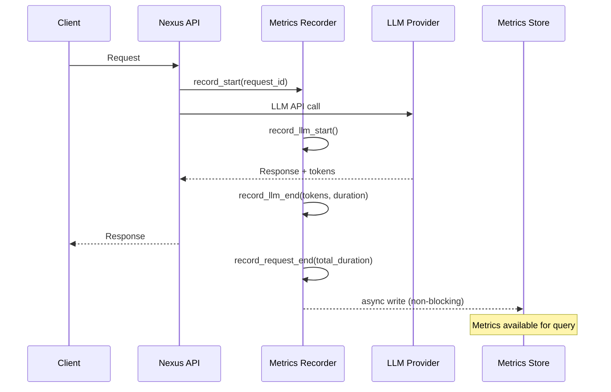
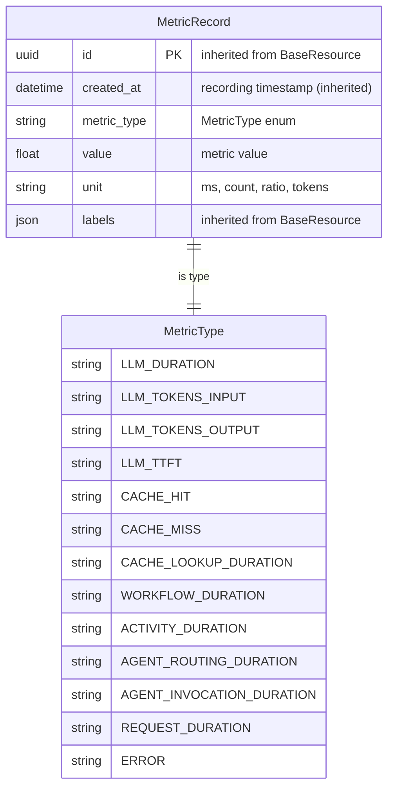

# Implementation Plan: LLM/Agent Performance Metrics Exposure

**Branch**: `plan/llm-agent-metrics-exposure` | **Date**: 2025-12-17 | **Spec**: [spec.md](./spec.md)
**Input**: Feature specification from `/specs/025-llm-agent-performance-kpis/spec.md`

## Summary

Expose raw metrics from Nexus via API endpoints so that external performance tests can query the data and calculate KPIs (p95, aggregations, etc.). Nexus records metrics with minimal overhead and exposes them via REST API and Prometheus-compatible endpoints. KPI validation is done by separate performance tests, not Nexus.

## Architecture

### Separation of Concerns

```
┌─────────────────────────────────────────────────────────────────────┐
│                         NEXUS                                        │
│  ┌─────────────┐  ┌─────────────┐  ┌─────────────┐                  │
│  │ LLM Adaptor │  │  Workflows  │  │   Agents    │                  │
│  └──────┬──────┘  └──────┬──────┘  └──────┬──────┘                  │
│         │                │                │                          │
│         └────────────────┼────────────────┘                          │
│                          ▼                                           │
│                 ┌─────────────────┐                                  │
│                 │ Metrics Recorder│  (async, <1% overhead)           │
│                 └────────┬────────┘                                  │
│                          ▼                                           │
│                 ┌─────────────────┐                                  │
│                 │  Metrics Store  │  (in-memory / Redis)             │
│                 └────────┬────────┘                                  │
│                          │                                           │
│         ┌────────────────┼────────────────┐                          │
│         ▼                ▼                ▼                          │
│  ┌─────────────┐  ┌─────────────┐  ┌─────────────┐                  │
│  │ /api/v1/    │  │  /metrics   │  │  Structured │                  │
│  │   metrics   │  │ (Prometheus)│  │   Logging   │                  │
│  └─────────────┘  └─────────────┘  └─────────────┘                  │
└─────────────────────────────────────────────────────────────────────┘
         │                │
         ▼                ▼
┌─────────────────────────────────────────────────────────────────────┐
│                    EXTERNAL (not part of Nexus)                      │
│  ┌─────────────────┐  ┌─────────────────┐  ┌─────────────────┐      │
│  │ Performance     │  │ Prometheus /    │  │ CI/CD Pipeline  │      │
│  │ Tests (pytest)  │  │ Grafana         │  │ (KPI gates)     │      │
│  └─────────────────┘  └─────────────────┘  └─────────────────┘      │
│         │                                           │                │
│         └──────── Calculate p95, validate ──────────┘                │
│                   targets, generate reports                          │
└─────────────────────────────────────────────────────────────────────┘
```

### Metrics Recording Flow



### Data Model

> **Note**: `MetricRecord` follows the Nexus SQLModel pattern for consistency, even though metrics
> are stored in-memory rather than PostgreSQL. See [data-model.md](./data-model.md) for full details.



## Technical Context

- **Language/Version**: Python 3.12+
- **Dependencies**: FastAPI, prometheus-client (for /metrics endpoint)
- **Storage**: In-memory buffer with optional Redis/Valkey persistence
- **Testing**: pytest, locust/k6 for performance tests
- **Overhead Target**: <1% impact on request latency

## Project Structure

### Source Code Changes

```
src/nexus/
├── core/
│   └── config
│       └── base.py             # ADD: MetricsSettings class (per centralized config)
├── metrics/                    # NEW: Metrics subsystem
│   ├── __init__.py
│   ├── router.py               # NEW: /api/v1/metrics endpoints (Router Discovery Framework)
│   ├── recorder.py             # MetricsRecorder class (async recording)
│   ├── store.py                # MetricsStore (optional - may be merged into recorder)
│   ├── types.py                # MetricType enum, MetricRecord model (SQLModel)
│   └── prometheus.py           # Prometheus exporter
├── schemas/
│   └── metrics/
│       └── openapi.yaml        # NEW: OpenAPI schema (for router validation)
└── [existing - add instrumentation]
    ├── agent_orchestrator/          # Add LLM/agent timing instrumentation
    ├── workflows/                    # Add workflow timing instrumentation
    └── tool_manager/                 # Add tool timing instrumentation

tests/
├── unit/
│   └── metrics/                # Unit tests for metrics module
├── integration/
│   └── metrics/                # Integration tests
└── performance/                # NEW: Performance tests that calculate KPIs
    ├── conftest.py
    ├── test_llm_latency_kpis.py
    ├── test_cache_kpis.py
    ├── test_workflow_kpis.py
    └── kpi_calculator.py       # Helper to calculate p95, etc.
```

## API Endpoints

### REST API: `/api/v1/metrics`

> **Note**: Full OpenAPI schema should be placed in `src/nexus/schemas/metrics/openapi.yaml`
> to work with Nexus automatic router discovery and validation.
> References shared base schemas from `../base/shared-resources.openapi.yaml`.

```yaml
GET /api/v1/metrics:
  description: Query raw metrics with cursor-based pagination
  parameters:
    - name: type
      in: query
      schema:
        type: string
        enum: [llm, cache, workflow, agent, error, all]
        default: all
    - name: start_time
      in: query
      schema:
        type: string
        format: date-time
    - name: end_time
      in: query
      schema:
        type: string
        format: date-time
    - name: labels
      in: query
      description: Filter by labels (e.g., labels[model]=gpt-4)
      style: deepObject
      schema:
        type: object
    # Reference shared pagination parameters (per Nexus architectural decision)
    - $ref: ../base/shared-resources.openapi.yaml#/components/parameters/cursorParam
    - $ref: ../base/shared-resources.openapi.yaml#/components/parameters/limitParam
    - $ref: ../base/shared-resources.openapi.yaml#/components/parameters/sortParam
    - $ref: ../base/shared-resources.openapi.yaml#/components/parameters/includeTotalParam
  response:
    200:
      content:
        application/json:
          schema:
            allOf:
              - $ref: ../base/shared-resources.openapi.yaml#/components/schemas/ResourcesResponseBase
              - type: object
                properties:
                  resources:
                    type: array
                    items:
                      $ref: '#/components/schemas/MetricRecord'

GET /api/v1/metrics/summary:
  description: Get metric counts by type (for quick health check)
  response:
    200:
      content:
        application/json:
          schema:
            $ref: '#/components/schemas/MetricsSummary'

# Schema components (see data-model.md for full definitions)
components:
  schemas:
    MetricRecord:
      allOf:
        - $ref: ../base/shared-resources.openapi.yaml#/components/schemas/BaseResource
        - description: Individual metric data point (extends BaseResource)
    MetricsListResponse:
      description: Type alias - ResourcesResponse[MetricRecord]
    MetricsSummary:
      description: Quick summary of metric counts
```

### Prometheus Endpoint: `/metrics`

```
# HELP nexus_requests_total Total number of requests
# TYPE nexus_requests_total counter
nexus_requests_total{status="success"} 1234
nexus_requests_total{status="error"} 12

# HELP nexus_request_duration_seconds Request duration
# TYPE nexus_request_duration_seconds histogram
nexus_request_duration_seconds_bucket{le="0.1"} 100
nexus_request_duration_seconds_bucket{le="0.5"} 500
nexus_request_duration_seconds_bucket{le="1.0"} 800

# HELP nexus_llm_duration_seconds LLM API call duration
# TYPE nexus_llm_duration_seconds histogram
nexus_llm_duration_seconds_bucket{model="gpt-4",le="0.5"} 200

# HELP nexus_cache_hits_total Cache hits
# TYPE nexus_cache_hits_total counter
nexus_cache_hits_total 456

# HELP nexus_cache_misses_total Cache misses
# TYPE nexus_cache_misses_total counter
nexus_cache_misses_total 234
```

## Phase 2: Task Planning Approach

### Part 1: Core Metrics Infrastructure (13 points)

**Ticket 1: Metrics Types and Recorder** - 5 points
- Define `MetricType` enum and `MetricRecord` SQLModel (per Nexus patterns)
- Implement `MetricsRecorder` class with async recording
- Context manager for timing (`with recorder.time("llm_duration"):`)
- Add `MetricsSettings` to `src/nexus/core/config/base.py`
- Unit tests with 80%+ coverage

**Ticket 2: Metrics Store and REST API** - 5 points
- Implement in-memory `MetricsStore` with configurable retention
- `GET /api/v1/metrics` endpoint with cursor-based pagination
- `GET /api/v1/metrics/summary` endpoint
- Add OpenAPI schema to `src/nexus/schemas/metrics/openapi.yaml`
- Integration tests

**Ticket 3: Prometheus Exporter** - 3 points
- Implement `/metrics` endpoint using prometheus-client
- Counters, histograms, gauges as per FR-026 to FR-029
- Integration test verifying Prometheus format

### Part 2: Component Instrumentation (10 points)

**Ticket 4: LLM Adaptor Instrumentation** - 3 points
- Add timing instrumentation to LLM adaptor
- Record: duration, input_tokens, output_tokens, ttft, model, status
- Minimal code changes, use decorators/context managers

**Ticket 5: Cache Instrumentation** - 2 points
- Add hit/miss recording to cache layer
- Record: lookup_duration, hit/miss status
- Expose cache utilization gauge

**Ticket 6: Workflow & Agent Instrumentation** - 5 points
- Add timing to workflow execution
- Add timing to agent routing and invocation
- Record per-activity duration
- Include workflow_id, execution_id labels

### Part 3: Performance Tests (8 points)

**Ticket 7: KPI Calculator and Test Framework** - 3 points
- Create `kpi_calculator.py` helper (calculate p95, percentiles, rates)
- Create `conftest.py` with fixtures for metrics querying
- Document KPI test patterns

**Ticket 8: KPI Validation Tests** - 5 points
- `test_llm_latency_kpis.py` - validate latency targets
- `test_cache_kpis.py` - validate cache hit rate targets
- `test_throughput_kpis.py` - validate RPS targets
- Tests query `/api/v1/metrics`, calculate KPIs, assert against targets

**Total: 31 story points** across 8 tickets

### Task Dependencies

```
Ticket 1 (Types/Recorder)
    │
    ├──► Ticket 2 (Store/API)
    │        │
    │        └──► Ticket 7 (KPI Calculator)
    │                 │
    │                 └──► Ticket 8 (KPI Tests)
    │
    └──► Ticket 3 (Prometheus)

Ticket 1 ──► Ticket 4 (LLM Instrumentation)
         ──► Ticket 5 (Cache Instrumentation)
         ──► Ticket 6 (Workflow Instrumentation)
```

## Constitution Check

- **Modular Architecture**: ✅ PASS - Metrics is a standalone module, instrumentation via decorators
- **Test-Driven Development**: ✅ PASS - Unit tests for recorder, integration tests for API, performance tests for KPIs
- **Explicit Configuration**: ✅ PASS - Retention period, buffer size configurable via env vars
- **Observability First**: ✅ PASS - This IS observability
- **API Stability**: ✅ PASS - Simple REST API, Prometheus standard format
- **Code Quality**: ✅ PASS - Type hints, 80% coverage, minimal overhead

## Progress Tracking

**Phase Status**:
- [x] Phase 0: Research complete (research.md created)
- [x] Phase 1: Design complete (data-model.md created)
- [x] Phase 2: Task planning complete (tasks.md created)
- [x] Phase 3: Tasks generated (32 tasks defined in tasks.md)
- [ ] Phase 4: Implementation complete
- [ ] Phase 5: Validation passed

---
*KPI targets from source document: Nexus LLM/Agent Performance KPIs v1.0*
*KPI calculation performed by external performance tests, not Nexus*
