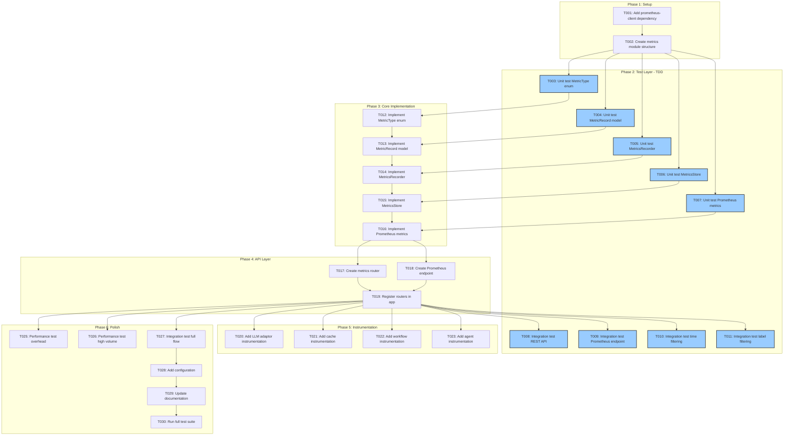

# Tasks: LLM/Agent Performance Metrics Exposure

**Input**: Design documents from `/specs/025-llm-agent-performance-kpis/`
**Prerequisites**: plan.md, research.md, data-model.md, quickstart.md

## Execution Flow (main)
```
1. Load plan.md from feature directory
   → ✅ Tech stack: Python 3.12, FastAPI, prometheus-client, asyncio
   → ✅ Structure: src/nexus/metrics/ (new module)
2. Load optional design documents:
   → ✅ data-model.md: MetricType, MetricRecord, MetricsRecorder
   → ✅ research.md: prometheus-client, async recording, in-memory store
   → ✅ quickstart.md: 10 test scenarios for validation
3. Generate tasks by category:
   → ✅ Setup: dependencies, module structure
   → ✅ Tests: unit tests, integration tests (TDD)
   → ✅ Core: types, recorder, store, prometheus
   → ✅ API: metrics router, prometheus endpoint
   → ✅ Instrumentation: LLM, cache, workflow, agent
   → ✅ Polish: performance tests, documentation
4. Apply task rules:
   → ✅ Different files = mark [P] for parallel
   → ✅ Same file = sequential (no [P])
   → ✅ Tests before implementation (TDD)
5. Number tasks sequentially (T001+)
   → ✅ 31 total tasks generated (T024 removed - overhead calculated from component metrics)
6. Generate dependency graph
   → ✅ Graph included below
7. Create parallel execution examples
   → ✅ Examples provided
8. Validate task completeness:
   → ✅ All entities have models
   → ✅ All scenarios have tests
   → ✅ TDD workflow enforced
9. Return: SUCCESS (tasks ready for execution)
```

## Task Dependency Workflow



## Format: `[ID] [P?] Description`
- **[P]**: Can run in parallel (different files, no dependencies)
- Include exact file paths in descriptions

---

## Phase 1: Setup & Dependencies

- [ ] **T001** Add prometheus-client dependency
  - File: `pyproject.toml`
  - Action: Add `prometheus-client = "^0.19.0"` to dependencies
  - Verification: Run `uv sync` successfully

- [ ] **T002** Create metrics module structure
  - Files to create:
    - `src/nexus/metrics/__init__.py`
    - `src/nexus/metrics/types.py`
    - `src/nexus/metrics/recorder.py`
    - `src/nexus/metrics/store.py`
    - `src/nexus/metrics/prometheus.py`
    - `src/nexus/core/config/base.py` (add MetricsSettings)
    - `src/nexus/metrics/instrumentation.py`
    - `src/nexus/metrics/router.py`
    - `src/nexus/schemas/metrics/openapi.yaml`
    - `tests/unit/metrics/__init__.py`
    - `tests/integration/metrics/__init__.py`
    - `tests/performance/metrics/__init__.py`
  - Action: Create directory structure with module docstrings

---

## Phase 2: Tests First (TDD) ⚠️ MUST COMPLETE BEFORE PHASE 3

**CRITICAL: These tests MUST be written and MUST FAIL before ANY implementation**

### Unit Tests (can run in parallel)

- [ ] **T003** [P] Write unit tests for MetricType enum
  - File: `tests/unit/metrics/test_types.py`
  - Test cases:
    - `test_metric_type_values()` - all expected types exist
    - `test_metric_type_is_string_enum()` - can be used as string
    - `test_metric_categories()` - categories contain correct types
  - Imports: `from nexus.metrics.types import MetricType, METRIC_CATEGORIES`
  - **Expected**: All tests FAIL (MetricType doesn't exist yet)

- [ ] **T004** [P] Write unit tests for MetricRecord model
  - File: `tests/unit/metrics/test_types.py` (section 2)
  - Test cases:
    - `test_metric_record_creation()` - valid creation with all fields
    - `test_metric_record_defaults()` - id and created_at auto-generated (via BaseResource)
    - `test_metric_record_labels()` - labels stored correctly
    - `test_metric_record_to_dict()` - JSON serialization works
    - `test_metric_record_unit()` - unit field stored correctly
  - Imports: `from nexus.metrics.types import MetricRecord`
  - **Expected**: All tests FAIL (MetricRecord doesn't exist yet)

- [ ] **T005** [P] Write unit tests for MetricsRecorder
  - File: `tests/unit/metrics/test_recorder.py`
  - Test cases:
    - `test_recorder_record()` - records metric to store
    - `test_recorder_increment()` - increments counters
    - `test_recorder_time_context()` - context manager times operations
    - `test_recorder_query()` - queries return matching metrics
    - `test_recorder_query_with_filters()` - filtering by type and labels
    - `test_recorder_get_summary()` - summary returns counts
    - `test_recorder_cleanup()` - removes expired metrics
    - `test_recorder_max_records()` - respects max_records limit
  - Imports: `from nexus.metrics.recorder import MetricsRecorder`
  - **Expected**: All tests FAIL (MetricsRecorder doesn't exist yet)

- [ ] **T006** [P] Write unit tests for MetricsStore
  - File: `tests/unit/metrics/test_store.py`
  - Test cases:
    - `test_store_add()` - adds metric to store
    - `test_store_query_all()` - returns all metrics
    - `test_store_query_by_type()` - filters by metric type
    - `test_store_query_by_time_range()` - filters by time range
    - `test_store_query_by_labels()` - filters by labels
    - `test_store_retention()` - old metrics expire
    - `test_store_max_size()` - bounded queue behavior
  - Imports: `from nexus.metrics.store import MetricsStore`
  - **Expected**: All tests FAIL (MetricsStore doesn't exist yet)

- [ ] **T007** [P] Write unit tests for Prometheus metrics
  - File: `tests/unit/metrics/test_prometheus.py`
  - Test cases:
    - `test_counters_defined()` - all counters exist
    - `test_histograms_defined()` - all histograms exist
    - `test_gauges_defined()` - all gauges exist
    - `test_counter_increment()` - counters can be incremented
    - `test_histogram_observe()` - histograms can observe values
    - `test_gauge_set()` - gauges can be set
    - `test_generate_metrics()` - Prometheus format output
  - Imports: `from nexus.metrics.prometheus import *`
  - **Expected**: All tests FAIL (prometheus module doesn't exist yet)

### Integration Tests (after API implementation)

- [ ] **T008** [P] Write integration test for REST API metrics endpoint
  - File: `tests/integration/metrics/test_metrics_api.py`
  - Scenario: Quickstart Scenario 3
  - Test: Query `/api/v1/metrics` endpoint
  - Verify: Returns JSON with metrics array and count
  - Use FastAPI TestClient

- [ ] **T009** [P] Write integration test for Prometheus endpoint
  - File: `tests/integration/metrics/test_prometheus_api.py`
  - Scenario: Quickstart Scenario 7
  - Test: Query `/metrics` endpoint
  - Verify: Returns text/plain with Prometheus format
  - Verify: Contains expected metric names

- [ ] **T010** [P] Write integration test for time-range filtering
  - File: `tests/integration/metrics/test_metrics_api.py` (section 2)
  - Test: Query with `start_time` and `end_time` parameters
  - Verify: Only metrics within range returned

- [ ] **T011** [P] Write integration test for label filtering
  - File: `tests/integration/metrics/test_metrics_api.py` (section 3)
  - Scenario: Quickstart Scenario 4
  - Test: Query with `labels` parameter
  - Verify: Only metrics matching labels returned

---

## Phase 3: Core Implementation (ONLY after tests are failing)

### Types Module

- [ ] **T012** Implement MetricType enum
  - File: `src/nexus/metrics/types.py`
  - Implementation (from data-model.md):
    - Enum with all metric types (LLM, cache, workflow, agent, error)
    - METRIC_CATEGORIES dict for grouping
  - Verification: Run `tests/unit/metrics/test_types.py` - type tests PASS

- [ ] **T013** Implement MetricRecord model
  - File: `src/nexus/metrics/types.py`
  - Implementation (from data-model.md):
    - Pydantic BaseModel with all fields
    - `to_dict()` method for JSON serialization
    - Inherits id, created_at, labels from BaseResource
  - Verification: Run `tests/unit/metrics/test_types.py` - all tests PASS

### Core Components

- [ ] **T014** Implement MetricsRecorder
  - File: `src/nexus/metrics/recorder.py`
  - Implementation (from data-model.md):
    - `__init__(retention_seconds, max_records)`
    - `record(metric_type, value, unit, labels)`
    - `increment(counter_name, value)`
    - `time(metric_type, labels)` context manager
    - `query(metric_type, start_time, end_time, labels)`
    - `get_summary()`
    - `cleanup()`
  - Verification: Run `tests/unit/metrics/test_recorder.py` - all tests PASS

- [ ] **T015** Implement MetricsStore (or merge into MetricsRecorder)
  - File: `src/nexus/metrics/store.py` (optional separate file)
  - Note: In data-model.md, store functionality is incorporated into `MetricsRecorder`.
    Implementer should decide whether to keep separate or merge.
  - Implementation:
    - In-memory deque with maxlen
    - Query with filtering support
    - Automatic cleanup on add
  - Verification: Run `tests/unit/metrics/test_store.py` - all tests PASS

- [ ] **T016** Implement Prometheus metrics definitions
  - File: `src/nexus/metrics/prometheus.py`
  - Implementation (from data-model.md):
    - Counters: requests_total, errors_total, cache_hits_total, cache_misses_total
    - Histograms: request_duration_seconds, llm_duration_seconds, ttft_seconds
    - Gauges: cache_utilization_ratio, active_workflows
  - Verification: Run `tests/unit/metrics/test_prometheus.py` - all tests PASS

---

## Phase 4: API Layer

- [ ] **T017** Create metrics REST API router
  - File: `src/nexus/metrics/router.py`
  - Note: Follows Router Discovery Framework pattern (see `src/nexus/example/router.py`)
  - Implementation (from plan.md):
    - `GET /api/v1/metrics` with query params
    - `GET /api/v1/metrics/summary`
    - Cursor-based pagination
    - Label filtering
  - Verification: Can import router, endpoints defined

- [ ] **T018** Add Prometheus metrics endpoint to router
  - File: `src/nexus/metrics/router.py` (same file as T017)
  - Note: Per Router Discovery Framework, all metrics endpoints must be in same router
  - Implementation:
    - `GET /metrics` returning Prometheus format
    - Use `prometheus_client.generate_latest()`
    - Content-Type: text/plain
  - Verification: Endpoint returns valid Prometheus format

- [ ] **T019** Verify router discovery
  - File: `src/nexus/metrics/router.py`
  - Action: Ensure router is discoverable by Router Discovery Framework
  - Verification: All endpoints accessible at expected paths

---

## Phase 5: Component Instrumentation

- [ ] **T020** [P] Add LLM adaptor instrumentation
  - Files: `src/nexus/agent_orchestrator/**/*.py`
    - `agents/` - agent implementations
    - `clients/` - LLM API clients (e.g., openrouter)
    - `ws/adaptor_streaming.py` - streaming adaptor
    - `services/` - orchestration and invocation services
  - Implementation (FR-005 to FR-010):
    - Record LLM request duration
    - Record input/output token counts
    - Record TTFT for streaming
    - Record model name and status
  - Use decorators or context managers for minimal invasion
  - Verification: LLM calls produce metrics

- [ ] **T021** [P] Add cache instrumentation (DEFERRED)
  - **Status**: Deferred - no cache module exists yet
  - **Note**: Caching is planned in architecture (spec 001) but not yet implemented.
    When cache module is added, implement FR-011 to FR-013:
    - Record cache hit/miss
    - Record lookup duration
    - Update cache utilization gauge
  - **Dependency**: Requires cache module to be implemented first

- [ ] **T022** [P] Add workflow instrumentation
  - File: `src/nexus/workflows/*.py`
  - Implementation (FR-014 to FR-017):
    - Record workflow execution duration
    - Record per-activity duration
    - Record workflow success/failure
    - Include workflow_id and execution_id labels
  - Verification: Workflow executions produce metrics

- [ ] **T023** [P] Add agent instrumentation
  - Files: `src/nexus/agent_orchestrator/**/*.py`
    - `agents/` - base_agent.py, generic_agent.py, orchestrator_agent.py
    - `executor/invocation_executor.py` - invocation execution
    - `services/orchestration_service.py` - agent routing
  - Note: Overlaps with T020 - both instrument agent_orchestrator code.
    T020 focuses on LLM metrics, T023 on agent routing/invocation metrics.
  - Implementation (FR-018 to FR-020):
    - Record agent routing duration
    - Record agent invocation duration
    - Record agent success/failure
  - Verification: Agent operations produce metrics

---

## Phase 6: Polish & Validation

- [ ] **T025** [P] Performance test: metrics overhead
  - File: `tests/performance/metrics/test_overhead.py`
  - Scenario: Quickstart Scenario 10
  - Test: Compare request latency with/without metrics
  - Target: <1% overhead (NFR-001)
  - Verification: Assert overhead < 1%

- [ ] **T026** [P] Performance test: high volume
  - File: `tests/performance/metrics/test_high_volume.py`
  - Test: Record 10,000 metrics per second
  - Verify: No memory leaks, bounded queue works
  - Verify: Query performance remains acceptable

- [ ] **T027** [P] Integration test: full metrics flow
  - File: `tests/integration/metrics/test_full_flow.py`
  - Scenario: Quickstart Scenario 8 (workflow metrics)
  - Test: Execute workflow, query metrics, verify timeline
  - Verify: All component metrics recorded correctly

- [ ] **T028** [P] Add MetricsSettings to centralized config
  - File: `src/nexus/core/config/base.py`
  - Implementation (from data-model.md):
    - Add MetricsSettings class to existing base.py
    - Add to Settings class inheritance chain
    - Environment variable support (NEXUS_METRICS_*)
    - Retention, max records, enable/disable toggles
  - Verification: Config loads from environment via get_settings()

- [ ] **T029** [P] Update documentation
  - Files: `README.md`, `CLAUDE.md`
  - Add section: Metrics and Observability
  - Document:
    - Available endpoints
    - Configuration options
    - Integration with Prometheus/Grafana
    - Performance considerations

- [ ] **T030** Run full test suite
  - Command: `make test-all`
  - Expected: All unit tests PASS, all integration tests PASS
  - Coverage: Verify >80% coverage for metrics module
  - Command: `pytest tests/ --cov=src/nexus/metrics --cov-report=html`

- [ ] **T031** [P] Run quickstart validation scenarios
  - File: `tests/integration/metrics/test_quickstart_scenarios.py`
  - Execute all 10 scenarios as automated tests
  - Verification: All scenarios produce expected output

- [ ] **T032** [P] Code review: SOLID compliance
  - Files: All implementation files in `src/nexus/metrics/`
  - Review checklist:
    - Single Responsibility: Each class has one purpose
    - Open/Closed: Extensible via configuration
    - Dependency Inversion: Recorder injectable
    - DRY: No code duplication
  - Refactor if violations found

---

## Dependencies

### Phase Dependencies
1. **Setup (T001-T002)** → Blocks everything else
2. **Tests (T003-T011)** → Must complete before implementation
3. **Core (T012-T016)** → Blocked by tests, sequential within phase
4. **API (T017-T019)** → Blocked by core implementation
5. **Instrumentation (T020-T023)** → Blocked by API
6. **Polish (T025-T032)** → Blocked by instrumentation

### Specific Task Dependencies
- T001 → T002 (need prometheus-client before structure)
- T002 → T003-T007 (structure ready, write tests)
- T003 → T012 (test before implementation)
- T004 → T013 (test before implementation)
- T005 → T014 (test before implementation)
- T006 → T015 (test before implementation)
- T007 → T016 (test before implementation)
- T012 → T013 (MetricRecord uses MetricType)
- T013 → T014 (Recorder uses MetricRecord)
- T014 → T015 (Store used by Recorder)
- T015 → T016 (Prometheus updated by Recorder)
- T016 → T017, T018 (API uses Prometheus)
- T017, T018 → T019 (register routers)
- T019 → T008-T011 (integration tests need API)
- T019 → T020-T023 (instrumentation needs API)
- T023 → T025-T027 (performance tests need instrumentation)

---

## Parallel Execution Examples

### Parallel Unit Tests (after T002)
```bash
# Can run simultaneously (different test files)
pytest tests/unit/metrics/test_types.py &
pytest tests/unit/metrics/test_recorder.py &
pytest tests/unit/metrics/test_store.py &
pytest tests/unit/metrics/test_prometheus.py &
wait
```

### Parallel Instrumentation (after T019)
```bash
# Different components, can run in parallel
# T020, T021, T022, T023 can run simultaneously
# T023 should complete before performance tests
```

### Parallel Polish Tasks (after T023)
```bash
# T025, T026, T027, T028, T029, T031, T032 can run in parallel
pytest tests/performance/metrics/ &
pytest tests/integration/metrics/test_full_flow.py &
# ... (different files, independent)
wait
```

---

## Validation Checklist
*GATE: Checked before marking tasks complete*

- [ ] All entities from data-model.md have implementation tasks
  - MetricType → T012
  - MetricRecord → T013
  - MetricsRecorder → T014
  - MetricsStore → T015
  - Prometheus metrics → T016

- [ ] All test scenarios from quickstart.md have test tasks
  - Scenario 1 (basic recording) → T003, T004
  - Scenario 2 (timing context) → T005
  - Scenario 3 (REST API) → T008
  - Scenario 4 (label filtering) → T011
  - Scenario 5 (cache metrics) → T006
  - Scenario 6 (summary endpoint) → T008
  - Scenario 7 (Prometheus) → T009
  - Scenario 8 (workflow metrics) → T027
  - Scenario 9 (error metrics) → T005
  - Scenario 10 (performance) → T025

- [ ] All requirements from spec.md have implementation tasks
  - FR-001 to FR-004 (Core API) → T017
  - FR-005 to FR-010 (LLM) → T020
  - FR-011 to FR-013 (Cache) → T021
  - FR-014 to FR-017 (Workflow) → T022
  - FR-018 to FR-020 (Agent) → T023
  - FR-021 to FR-023 (Overhead) → Calculated from component metrics (no separate task)
  - FR-024 to FR-025 (Error) → T020-T023
  - FR-026 to FR-029 (Prometheus) → T016, T018
  - NFR-001 (Overhead) → T025
  - NFR-002 (Async) → T014
  - NFR-003 (Retention) → T028

- [ ] All tests come before implementation (TDD)
  - Tests: T003-T011
  - Implementation: T012-T023

- [ ] Parallel tasks are truly independent
  - Test files: Different files, can run parallel
  - Instrumentation: Different components, can run parallel

---

## Task Summary

**Total Tasks**: 31
- Setup: 2 tasks
- Tests (TDD): 9 tasks (5 unit, 4 integration)
- Core Implementation: 5 tasks
- API Layer: 3 tasks
- Instrumentation: 3 tasks (T021 deferred, T024 removed)
- Polish & Validation: 8 tasks

**Parallelizable**: 20+ tasks marked [P]
**Sequential**: ~12 tasks (dependencies)

**Estimated Effort**: 5-7 days for full implementation (TDD approach)
- Day 1: Setup + Unit test writing (T001-T007) - ~7 tasks
- Day 2: Core implementation (T012-T016) - ~5 tasks
- Day 3: API layer + integration tests (T017-T019, T008-T011) - ~7 tasks
- Day 4: Instrumentation (T020-T023) - ~3 tasks (T021 deferred)
- Day 5-6: Performance + polish (T025-T032) - ~8 tasks
- Buffer: Additional day for debugging and refinement

**Ready for Execution**: ✅ All tasks defined with clear acceptance criteria
