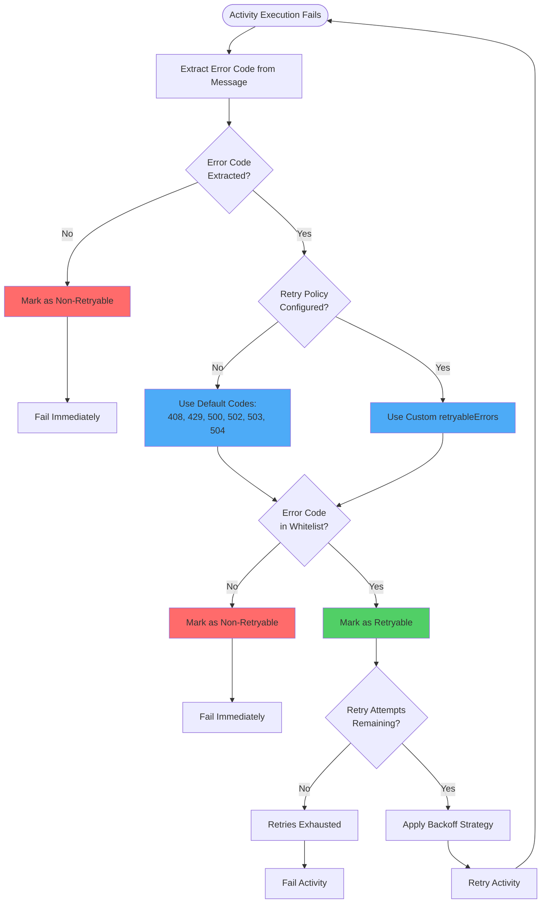

# Feature Specification: Retryable Errors as Integer Error Codes

**Feature Branch**: `024-retryable-errors-as-int`
**Created**: 2026-01-15
**Status**: Implemented
**Input**: User description: "update the specs to change the retryable errors to integers from strings this was mentioned in specs/003-workflow-engine"

## Execution Flow (main)
```
1. Parse user description from Input
   → Feature: Change retryableErrors from string error types to integer error codes
2. Extract key concepts from description
   → Actors: Workflow authors, workflow engine
   → Actions: Define retryable error codes, match errors during execution
   → Data: HTTP status codes, process exit codes
   → Constraints: Must use whitelist approach
3. For each unclear aspect:
   → ✓ No clarifications needed - implementation already complete
4. Fill User Scenarios & Testing section
   → ✓ User flow: Define retry policy with numeric codes
5. Generate Functional Requirements
   → ✓ All requirements testable and implemented
6. Identify Key Entities (if data involved)
   → ✓ RetryPolicy model, error code constants
7. Run Review Checklist
   → ✓ No implementation details in spec (documented separately)
8. Return: SUCCESS (spec documents completed implementation)
```

---

## ⚡ Quick Guidelines
- ✅ Focus on WHAT users need and WHY
- ❌ Avoid HOW to implement (no tech stack, APIs, code structure)
- 👥 Written for business stakeholders, not developers

---

## User Scenarios & Testing *(mandatory)*

### Primary User Story
As a workflow author, I need to specify which error codes should trigger automatic retries so that transient failures (like temporary server errors or rate limiting) are automatically recovered without workflow failure, while permanent errors (like authentication failures or invalid requests) fail immediately without wasting retry attempts.

### Acceptance Scenarios

1. **Given** a workflow activity with retry policy specifying `retryableErrors: [500, 503]`, **When** the activity fails with HTTP status code 500, **Then** the workflow engine automatically retries the activity according to the retry policy (maxAttempts, backoff strategy)

2. **Given** a workflow activity with retry policy specifying `retryableErrors: [500, 503]`, **When** the activity fails with HTTP status code 401 (not in the list), **Then** the workflow engine marks the activity as permanently failed without retrying

3. **Given** a workflow activity with no explicit retryableErrors specified, **When** the activity fails with HTTP status code 503, **Then** the workflow engine uses default retryable codes and retries the activity

4. **Given** a workflow activity with retry policy specifying `retryableErrors: [2, 3]` (process exit codes), **When** a script task exits with code 2, **Then** the workflow engine retries the script execution

5. **Given** a workflow activity that fails with an error message not containing an extractable error code, **When** the error is processed, **Then** the workflow engine treats it as non-retryable and fails immediately

### Edge Cases
- What happens when an error message contains multiple numeric codes? → The first matched code is extracted and used for retry decision
- How does the system handle errors without any numeric code? → Treated as non-retryable (fail fast)
- What happens if retryableErrors is an empty list? → No errors are retried (all errors are non-retryable)
- How does the system distinguish between HTTP status codes and exit codes? → Both are treated as numeric error codes; the context (HTTP vs script) is maintained separately

## Requirements *(mandatory)*

### Functional Requirements

- **FR-001**: System MUST accept integer values in the `retryableErrors` field of retry policies
- **FR-002**: System MUST validate that `retryableErrors` contains only integer values (no strings)
- **FR-003**: System MUST provide default retryable error codes when `retryableErrors` is not specified: [408, 429, 500, 502, 503, 504]
- **FR-004**: System MUST use whitelist approach: ONLY errors with codes in the `retryableErrors` list trigger retries
- **FR-005**: System MUST treat errors NOT in the `retryableErrors` list as non-retryable (permanent failures)
- **FR-006**: System MUST extract numeric error codes from error messages for retry decisions
- **FR-007**: System MUST support both HTTP status codes and process exit codes as error codes
- **FR-008**: System MUST treat errors without extractable numeric codes as non-retryable
- **FR-009**: System MUST allow workflow authors to specify custom error codes for domain-specific retry logic
- **FR-010**: System MUST document default retryable error codes with clear explanations of why each code is transient

### Default Retryable Error Codes
The system provides sensible defaults aligned with industry standards (Kubernetes retry patterns):
- **408**: Request Timeout - Client timeout, often transient
- **429**: Too Many Requests - Rate limiting, should retry with backoff
- **500**: Internal Server Error - Temporary server issue
- **502**: Bad Gateway - Upstream server error, often transient
- **503**: Service Unavailable - Service temporarily down
- **504**: Gateway Timeout - Upstream timeout, often transient

### Key Entities

- **RetryPolicy**: Configuration defining retry behavior for workflow activities
  - Attributes: maxAttempts, backoff strategy, initialInterval, maxInterval, multiplier, retryableErrors (list of integers)
  - Purpose: Controls automatic retry behavior for transient failures
  - Relationships: Associated with workflow activities

- **Error Code**: Numeric identifier extracted from error messages
  - Types: HTTP status codes (4xx, 5xx), process exit codes (0-255)
  - Purpose: Determines whether an error is retryable based on whitelist
  - Usage: Compared against retryableErrors list to make retry decisions

---

## Review & Acceptance Checklist

### Content Quality
- [x] No implementation details (languages, frameworks, APIs)
- [x] Focused on user value and business needs
- [x] Written for non-technical stakeholders
- [x] All mandatory sections completed

### Requirement Completeness
- [x] No [NEEDS CLARIFICATION] markers remain
- [x] Requirements are testable and unambiguous
- [x] Success criteria are measurable
- [x] Scope is clearly bounded
- [x] Dependencies and assumptions identified

---

## Execution Status

- [x] User description parsed
- [x] Key concepts extracted
- [x] Ambiguities marked (none found)
- [x] User scenarios defined
- [x] Requirements generated
- [x] Entities identified
- [x] Review checklist passed

---

## System Flow Diagram



**Diagram Explanation:**
- **Error Code Extraction**: First step determines if a numeric code can be extracted from the error message
- **Whitelist Check**: Only errors with codes in the retryableErrors list (or defaults) are retried
- **Fail Fast**: Errors without codes or not in whitelist fail immediately without retries
- **Backoff Strategy**: Retryable errors use configured backoff (exponential, fixed, or linear)
- **Retry Limit**: Maximum attempts prevent infinite retry loops

---

## Business Value

### Problem Statement
Previously, the `retryableErrors` field accepted string values representing error type names (e.g., "TimeoutError", "NetworkError"), but this feature was never implemented. Errors from external systems (APIs, scripts) return numeric codes (HTTP status codes, exit codes), not exception type names. This mismatch meant:
- The field was non-functional (dead code)
- No way to configure retry behavior based on actual error codes
- Workflows would retry all errors or none, with no granular control

### Solution Benefits
1. **Functional Retry Control**: Workflow authors can now specify exactly which error codes trigger retries
2. **Industry Alignment**: Whitelist approach matches Kubernetes and standard HTTP client retry patterns
3. **Better Resource Efficiency**: Avoid wasting retry attempts on permanent errors (401, 403, 404)
4. **Faster Failure Detection**: Non-retryable errors fail immediately instead of exhausting retry attempts
5. **Sensible Defaults**: Common transient server errors retry automatically without configuration
6. **Flexibility**: Supports custom exit codes for script-based activities

### Use Cases
- **API Integration**: Retry on rate limiting (429) and server errors (5xx), but fail fast on auth errors (401, 403)
- **Script Execution**: Retry specific exit codes that indicate transient failures
- **Multi-Service Workflows**: Different retry strategies per service based on their error code patterns
- **Cost Optimization**: Reduce unnecessary retries on permanent failures, saving compute resources

---
