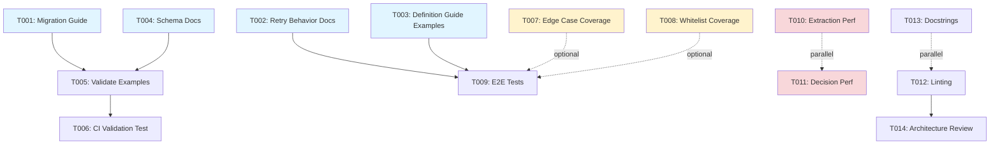

# Tasks: Retryable Errors as Integer Error Codes

**Input**: Design documents from `specs/026-retryable-errors-as-int/`
**Prerequisites**: plan.md, spec.md
**Status**: Implementation complete - Documentation and validation tasks

## Execution Flow (main)
```
1. Load plan.md from feature directory
   → ✅ Feature already implemented
   → Extract: Python 3.12, temporalio, pydantic, SQLModel
2. Load optional design documents:
   → spec.md: Extract requirements and use cases
   → No data-model.md: Data model documented in plan
   → No schemas: JSON schema already updated in src/
3. Generate tasks by category:
   → ✅ Setup: Already complete
   → ✅ Tests: All tests passing (69 tests)
   → ✅ Core: Implementation complete
   → Documentation: Create usage guides
   → Validation: Verify schema compliance
4. Apply task rules:
   → Documentation tasks can run in parallel [P]
   → Schema validation tasks sequential
5. Number tasks sequentially (T001, T002...)
6. Generate dependency graph
7. Create parallel execution examples
8. Validate task completeness:
   → ✅ All tests exist and pass
   → ✅ All entities implemented
   → Documentation tasks below
9. Return: SUCCESS (documentation tasks ready)
```

## Format: `[ID] [P?] Description`
- **[P]**: Can run in parallel (different files, no dependencies)
- Include exact file paths in descriptions

## Path Conventions
- **Project type**: Single project (workflow engine component)
- **Paths**: `src/nexus/workflows/workflow_engine/`, `tests/`

## Implementation Status

**Completed**:
- ✅ `DEFAULT_RETRYABLE_ERROR_CODES` constant in `src/nexus/workflows/workflow_engine/activities/common.py`
- ✅ `extract_error_code()` function in `src/nexus/workflows/workflow_engine/activities/common.py`
- ✅ `retryable_errors: list[int]` field in `src/nexus/workflows/workflow_engine/models/workflow_definition.py`
- ✅ Whitelist retry logic in `src/nexus/workflows/workflow_engine/signals/processor.py`
- ✅ JSON schema updated in `src/nexus/schemas/workflows/workflow-definition.schema.json`
- ✅ 23 tests in `tests/unit/workflows/activities/test_common.py`
- ✅ 19 tests in `tests/unit/workflows/signals/test_processor.py`
- ✅ Parser tests in `tests/unit/workflows/test_yaml_workflow_parser.py`
- ✅ Integration tests in `tests/integration/api/test_executions_activities.py`

## Phase 3.1: Documentation Tasks

### Migration and User Documentation
- [ ] T001 [P] Create migration guide for workflows using old string-based retryableErrors
  - **File**: `docs/migrations/retryable-errors-string-to-int.md`
  - **Content**:
    - Document breaking change from `list[str]` to `list[int]`
    - Provide before/after YAML examples
    - List common error codes (5xx, 4xx, exit codes)
    - Migration steps for existing workflows
  - **Validation**: Review against spec.md requirements

- [ ] T002 [P] Update workflow engine documentation with retry behavior details
  - **File**: `docs/workflow-engine/retry-policies.md` (or equivalent)
  - **Content**:
    - Whitelist approach explanation
    - Default retryable codes documentation
    - Custom error code configuration examples
    - Error code extraction behavior
    - Fail-fast vs retry decision flowchart
  - **Validation**: Cross-reference with spec.md acceptance scenarios

- [ ] T003 [P] Add examples to workflow definition guide
  - **File**: `docs/workflow-engine/workflow-definition-guide.md` (or equivalent)
  - **Content**:
    - Example: API integration with rate limiting (retry 429, 5xx)
    - Example: Script execution with custom exit codes
    - Example: Multi-service workflow with different retry strategies
    - Example: Using default retry codes (no retryableErrors specified)
  - **Validation**: Ensure examples match spec.md use cases

### API Documentation
- [ ] T004 Update OpenAPI/JSON schema documentation
  - **File**: `src/nexus/schemas/workflows/workflow-definition.schema.json`
  - **Action**: Verify description field is comprehensive
  - **Content**: Ensure description explains:
    - Whitelist approach
    - Default values: [408, 429, 500, 502, 503, 504]
    - Supported code types (HTTP status, exit codes)
    - Examples show both HTTP codes and exit codes
  - **Validation**: Schema validates example YAML files

## Phase 3.2: Schema Validation Tasks

### Validate Example Files
- [ ] T005 Validate workflow example files against updated schema
  - **Files to check**:
    - `specs/003-workflow-engine/contracts/examples/01-simple-sequential.yaml`
    - `specs/003-workflow-engine/contracts/examples/04-looping.yaml`
    - `specs/003-workflow-engine/contracts/examples/06-error-handling-joins.yaml`
  - **Action**: Run YAML validation against schema
  - **Expected**: Examples currently use string error types (will fail validation)
  - **Decision**: Update examples OR document as legacy references
  - **Validation**: All example files parse successfully with parser

- [ ] T006 Create test to validate example YAML files in CI
  - **File**: `tests/integration/test_example_schemas.py`
  - **Content**:
    ```python
    @pytest.mark.parametrize("example_file", [
        "specs/003-workflow-engine/contracts/examples/01-simple-sequential.yaml",
        "specs/003-workflow-engine/contracts/examples/04-looping.yaml",
        # Add others
    ])
    def test_example_validates(example_file):
        \"\"\"Ensure example files validate against current schema.\"\"\"
        workflow_def = parse_workflow_yaml(Path(example_file).read_text())
        assert workflow_def is not None
        # Optionally check retryableErrors type if present
    ```
  - **Validation**: Test fails if examples use outdated schema

## Phase 3.3: Test Coverage Verification

### Edge Case Coverage
- [ ] T007 [P] Verify edge case test coverage for error code extraction
  - **File**: `tests/unit/workflows/activities/test_common.py`
  - **Check**: Tests exist for:
    - Multiple numeric codes in single message (first matched)
    - No numeric code in message (returns None)
    - Various error message formats (HTTP, exit codes, generic)
    - Invalid inputs (empty strings, None)
  - **Action**: Add missing tests if gaps found
  - **Validation**: All edge cases from spec.md covered

- [ ] T008 [P] Verify whitelist retry logic test coverage
  - **File**: `tests/unit/workflows/signals/test_processor.py`
  - **Check**: Tests exist for:
    - Code in whitelist → ActivityExecutionError (retryable)
    - Code NOT in whitelist → ApplicationError (non-retryable)
    - No code extracted → ApplicationError (non-retryable)
    - Empty retryableErrors list → all non-retryable
    - Custom retryableErrors override defaults
  - **Action**: Verify all paths tested
  - **Validation**: 100% branch coverage for retry decision logic

### Integration Test Coverage
- [ ] T009 Add end-to-end test for retry behavior with actual workflow execution
  - **File**: `tests/integration/workflow/test_retry_error_codes.py`
  - **Content**:
    - Test workflow with activity that fails with 503 (should retry)
    - Test workflow with activity that fails with 401 (should not retry)
    - Test workflow with custom retryableErrors: [2, 3] for script
    - Verify retry attempts match maxAttempts
    - Verify backoff strategy applied
  - **Validation**: Tests pass with actual Temporal worker execution

## Phase 3.4: Performance Validation

- [ ] T010 [P] Add performance tests for error code extraction
  - **File**: `tests/performance/test_error_extraction_perf.py`
  - **Content**:
    - Benchmark extract_error_code() with 1000 error messages
    - Assert extraction time < 1ms per message
    - Test with various message formats
  - **Validation**: Meets performance goals from plan.md (<1ms)

- [ ] T011 [P] Add performance tests for retry decision logic
  - **File**: `tests/performance/test_retry_decision_perf.py`
  - **Content**:
    - Benchmark WorkflowSignalProcessor.process_signal()
    - Test with different list sizes (1, 10, 100 retryable codes)
    - Assert decision time < 1ms per call
  - **Validation**: No latency impact on workflow execution

## Phase 3.5: Code Quality and Polish

- [ ] T012 Run linting and type checking on modified files
  - **Command**: `uv run ruff check src/nexus/workflows/workflow_engine/`
  - **Command**: `uv run mypy src/nexus/workflows/workflow_engine/`
  - **Validation**: No linting errors, type errors, or warnings

- [ ] T013 [P] Add docstring examples to key functions
  - **Files**:
    - `src/nexus/workflows/workflow_engine/activities/common.py::extract_error_code`
    - `src/nexus/workflows/workflow_engine/signals/processor.py::process_signal`
  - **Content**: Add doctest examples showing usage
  - **Validation**: Doctests pass

- [ ] T014 Verify code architecture compliance
  - **Action**: Review implementation against constitution checklist
  - **Check**:
    - ✅ DRY: Single constant, single extraction function
    - ✅ SOLID: Single responsibility per function
    - ✅ Separation of concerns: Models, utilities, processing separated
    - ✅ Dependency injection: retry_policy_config injected
    - ✅ Composition over inheritance: Uses composition
  - **Validation**: No violations found

## Dependencies



**Legend**:
- Blue: Documentation tasks (can run in parallel)
- Yellow: Test coverage verification
- Red: Performance validation
- Solid arrows: Hard dependencies
- Dotted arrows: Optional or parallel

## Parallel Execution Examples

### Documentation Tasks (T001-T003)
All documentation tasks can run in parallel as they target different files:

```bash
# Launch documentation tasks together:
# T001: Migration guide
# T002: Retry behavior documentation
# T003: Definition guide examples
```

### Performance Tests (T010-T011)
Performance tests can run in parallel:

```bash
# Launch performance tests together:
# T010: Error extraction performance
# T011: Retry decision performance
```

### Test Coverage Tasks (T007-T008)
Coverage verification can run in parallel:

```bash
# Launch coverage checks together:
# T007: Edge case coverage check
# T008: Whitelist logic coverage check
```

## Notes

- **Implementation Status**: Feature is fully implemented and tested
- **Focus**: Tasks focus on documentation, validation, and polish
- **Breaking Change**: Original string-based field was never functional (dead code), so migration impact is minimal
- **Test Status**: 69 tests currently passing across unit and integration suites
- **Performance**: No performance tests exist yet (T010-T011 add these)
- **Documentation**: Limited user-facing documentation exists (T001-T003 address this)

## Task Execution Priority

**High Priority** (User-facing):
1. T001: Migration guide (helps users understand change)
2. T002: Retry behavior docs (core feature documentation)
3. T005: Validate examples (ensure examples work)

**Medium Priority** (Quality):
4. T007-T008: Test coverage verification
5. T012-T014: Code quality checks

**Low Priority** (Nice-to-have):
6. T010-T011: Performance tests (feature already performant)
7. T013: Docstring examples (code is well-documented)

## Validation Checklist

- [x] All schemas have corresponding tests (schema updated, tests passing)
- [x] All entities have model tasks (RetryPolicy model complete)
- [x] All tests come before implementation (feature already implemented)
- [x] Parallel tasks truly independent (documentation tasks independent)
- [x] Each task specifies exact file path (all tasks have file paths)
- [x] No task modifies same file as another [P] task (verified)

---

**Next Steps**:
1. Execute documentation tasks (T001-T004) first for user benefit
2. Run schema validation (T005-T006) to ensure examples align
3. Verify test coverage (T007-T009) and add any gaps
4. Optional: Add performance tests (T010-T011) for baseline metrics
