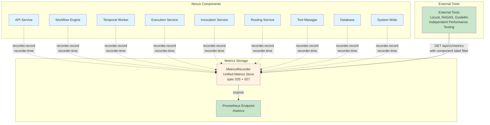

# Feature Specification: Extend Metrics Collection for All Nexus Components

**Feature Branch**: `027-nexus-component-performance-kpi`  
**Created**: 2026-01-21  
**Status**: Draft  
**Input**: Collect metrics for all Nexus components and pass the metrics for Performance testing.

---

## Quick Guidelines

- Focus on WHAT metrics need to be collected from each Nexus component
- KPI targets are for external performance tests, not Nexus implementation
- Components record metrics directly to MetricsRecorder using `recorder.record()` and `recorder.time()` calls (same pattern as spec 025)
- External tools access metrics via the unified `/api/v1/metrics` endpoint (from spec 025) with component label filters

---

## Architecture Overview

---

## Executive Summary

This feature extends the existing MetricsRecorder class from spec 025-llm-agent-performance-kpis to add metrics collection capabilities for all Nexus components.

### Separation of Concerns

| Component | Responsibility |
|-----------|----------------|
| **Nexus Components** | Record operational metrics directly to MetricsRecorder using `recorder.record()` and `recorder.time()` calls with component labels (same pattern as spec 025) |
| **MetricsRecorder** | Store all component metrics in unified metrics store (extends existing MetricsRecorder from spec 025) |
| **Unified Metrics Endpoint** | `/api/v1/metrics` endpoint provides access to all metrics with filtering by component label |
| **External Performance Testing Tools** | Access metrics via GET on unified `/api/v1/metrics` endpoint with component label filters (Locust, RAGAS, Guidellm) |
| **External Monitoring** | Prometheus/Grafana scraping, alerting, dashboards |

### Component Categories Requiring Metrics

Based on the Nexus Key Performance Indicators, metrics must be collected from:

- **API Service**: HTTP request/response metrics (response time, error rate, throughput)
- **Workflow Engine**: Workflow creation, serialization, validation, execution metrics
- **Temporal Worker**: Task queue depth, activity execution metrics
- **Execution Service**: Workflow execution start latency, completion rate, active count
- **Invocation Service**: Invocation throughput, status distribution, E2E duration, token usage, RAG quality metrics (faithfulness, answer relevancy, context precision)
- **Routing Service**: Routing decision time, accuracy, agent utilization
- **Tool Manager**: Tool execution success rate, duration, availability, error rates
- **Database**: Query response time, connection pool utilization, transaction rate
- **System-Wide**: Uptime, E2E latency, aggregate error rate

---

## User Scenarios & Testing *(mandatory)*

### Primary User Story

As a performance test engineer, I want all Nexus components to record operational metrics directly to MetricsRecorder so that metrics are available for performance evaluation and KPI assessment via the unified metrics endpoint.

### Acceptance Scenarios

1. **Given** Nexus components are instrumented with MetricsRecorder calls, **When** components execute operations, **Then** they should record metrics directly to MetricsRecorder with appropriate component labels for all 9 component categories (API Service, Workflow Engine, Temporal Worker, Execution Service, Invocation Service, Routing Service, Tool Manager, Database, System-Wide)

2. **Given** components record metrics with component labels, **When** external tools query the unified `/api/v1/metrics` endpoint with component label filter (`?labels={"component": "api_service"}`), **Then** the endpoint should return component-specific operational metrics

3. **Given** MetricsRecorder stores metrics from all components, **When** external tools query the unified `/api/v1/metrics` endpoint, **Then** metrics should be filterable by component, metric type, and time range

4. **Given** components are instrumented with MetricsRecorder calls, **When** components are under load, **Then** metrics recording should not add more than 1% overhead to component operations

5. **Given** a component fails to record metrics, **When** other components continue operating, **Then** their metrics recording should continue unaffected

### Edge Cases

- What happens if MetricsRecorder is unavailable when a component tries to record? (Should log error but not block component operation)
- How does MetricsRecorder handle high-frequency metric recording? (Should support async, non-blocking recording with batching - already supported in spec 025)
- What if external performance tests query metrics while components are recording? (Should provide consistent snapshots from unified store)
- How are metrics from distributed component instances stored? (Each instance has its own MetricsRecorder; Prometheus handles cross-instance aggregation)

---

## Requirements *(mandatory)*

### Functional Requirements - Metrics Collection Extension

#### Component Metrics Instrumentation

- **FR-001**: Each Nexus component MUST record operational metrics directly to MetricsRecorder using `recorder.record()` and `recorder.time()` calls
- **FR-002**: All component metrics MUST include a `component` label identifying the component category (api_service, workflow_engine, temporal_worker, execution_service, invocation_service, routing_service, tool_manager, database, system_wide)
- **FR-003**: Components MUST instrument key operations (request handling, workflow execution, tool execution, etc.) with `recorder.record()` and `recorder.time()` calls with appropriate metric types and component labels

#### Unified Metrics Endpoint

- **FR-004**: The unified `/api/v1/metrics` endpoint (from spec 025) MUST support filtering by component label to allow external tools to query component-specific metrics
- **FR-005**: External tools MUST query metrics via `/api/v1/metrics?labels={"component": "{component}"}` to get component-specific metrics

#### MetricsRecorder Extension

- **FR-006**: MetricsRecorder MUST store all component operational metrics recorded directly via `recorder.record()` and `recorder.time()` calls in its unified metrics store (same as spec 025)
- **FR-007**: MetricsRecorder MUST support filtering metrics by component, metric type, and time range (extends existing MetricsRecorder from spec 025)

#### API Service Metrics

- **FR-008**: API Service MUST record HTTP request/response metrics including: response time (p50, p95, p99), error rate (4xx, 5xx), throughput (requests per second)
- **FR-009**: API Service metrics MUST include per-endpoint breakdowns with labels (endpoint path, HTTP method, status code)
- **Instrumentation**: Add `recorder.time()` context manager around FastAPI request handlers, record error counts with `recorder.record()` for 4xx/5xx responses

#### Workflow Engine Metrics

- **FR-010**: Workflow Engine MUST record workflow creation metrics including: creation success rate, serialization duration, validation duration
- **FR-011**: Workflow Engine MUST record workflow execution metrics including: execution duration (p50, p95, p99), success rate, failure categorization (validation errors, execution errors, timeout, cancellation, system errors)
- **Instrumentation**: Add `recorder.time()` around workflow creation, serialization, validation, and execution operations. Record success/failure counts with appropriate error type labels

#### Temporal Worker Metrics

- **FR-012**: Temporal Worker MUST record task queue metrics including: queue depth (pending tasks), activity execution success rate, activity execution duration (p50, p95, p99)
- **FR-013**: Temporal Worker metrics MUST include per-activity-type breakdowns with labels (activity type, workflow type)
- **Instrumentation**: Add `recorder.time()` around Temporal activity execution. Record queue depth as gauge with `recorder.record()`. Track activity success/failure counts

#### Execution Service Metrics

- **FR-014**: Execution Service MUST record workflow execution metrics including: start latency, completion rate, active workflow count
- **FR-015**: Execution Service metrics MUST include per-workflow-type breakdowns with labels (workflow type, status)
- **Instrumentation**: Add `recorder.time()` around workflow start operations. Record active workflow count as gauge. Track completion/failure counts with workflow type labels

#### Tool Manager Metrics

- **FR-016**: Tool Manager MUST record tool execution metrics including: success rate, execution duration (p50, p95, p99), provider availability (uptime percentage)
- **FR-017**: Tool Manager MUST record tool usage metrics including: execution counts (total, successful, failed), error rates by type (timeout, validation error, provider error, system error), tool usage ranking
- **FR-018**: Tool Manager metrics MUST include labels for provider_id, tool_id, and error_code
- **Instrumentation**: Add `recorder.time()` around tool execution calls. Record success/failure counts with provider_id, tool_id, and error_code labels. Track provider availability

#### Database Metrics

- **FR-019**: Database component MUST record query performance metrics including: query response time (p50, p95, p99), connection pool utilization (active/max connections), transaction rate (transactions per second)
- **FR-020**: Database metrics MUST include per-table breakdowns with labels (table name, query type)
- **Instrumentation**: Add `recorder.time()` around database query execution. Record connection pool utilization as gauge. Track transaction counts with table and query type labels

#### System-Wide Metrics

- **FR-021**: System-Wide component MUST record system-wide metrics including: system uptime/availability, end-to-end request latency (p50, p95, p99), system error rate (across all services)
- **FR-022**: System-Wide metrics MUST include per-service health metrics with labels (service name, health status)
- **Instrumentation**: Add `recorder.time()` around end-to-end request handling. Record system uptime as gauge. Aggregate error rates across all services with service name labels

#### External Performance Testing Integration

- **FR-023**: MetricsRecorder MUST expose metrics in formats suitable for external performance testing and KPI evaluation
- **FR-024**: MetricsRecorder MUST support time-range queries for performance test evaluation periods
- **FR-025**: MetricsRecorder MUST provide metrics with sufficient granularity for KPI calculation
- **FR-026**: MetricsRecorder MUST support filtering by component category for component-specific KPI evaluation

#### Prometheus/OpenMetrics Support

- **FR-027**: MetricsRecorder MUST expose metrics via Prometheus-compatible `/metrics` endpoint (existing endpoint from spec 025)
- **FR-028**: Prometheus metrics MUST include component labels for filtering
- **FR-029**: Prometheus metrics MUST support all metric types required for KPI evaluation (counters, histograms, gauges)

### Non-Functional Requirements

- **NFR-001**: Metrics recording via `recorder.record()` and `recorder.time()` calls MUST add less than 1% overhead to component operations
- **NFR-002**: Metrics recording MUST be asynchronous and non-blocking
- **NFR-003**: Metrics MUST be available for querying immediately after recording (no collection delay)

---

## Dependencies and Assumptions

### Dependencies

- **Spec 025 (LLM/Agent Performance Metrics Exposure)**: MetricsRecorder class and metrics infrastructure from spec 025
- **Component Metrics Instrumentation**: All Nexus components must be instrumented to record metrics directly to MetricsRecorder with component labels using `recorder.record()` and `recorder.time()` calls (same pattern as spec 025)
- **Unified Metrics Endpoint**: The unified `/api/v1/metrics` endpoint (from spec 025) provides access to all metrics with filtering by component label
- **Nexus Key Performance Indicators Document**: KPI definitions and targets are defined in the referenced PDF document
- **External Performance Testing Tools**: External tools (Locust, RAGAS, Guidellm) are independent and separate from MetricsRecorder metrics collection

### Assumptions

- **Component Availability**: All 9 component categories are implemented and operational
- **Metrics Endpoint Standardization**: The unified `/api/v1/metrics` endpoint (from spec 025) returns metrics in a consistent format with component label filtering support
- **Instrumentation Coverage**: All key operations in each component are instrumented with MetricsRecorder calls
- **External Performance Testing**: External tools (Locust, RAGAS, Guidellm) are independent and separate from MetricsRecorder metrics collection

---

## Key Entities *(include if feature involves data)*

- **MetricsRecorder**: The same MetricsRecorder class from spec 025, stores all component metrics in unified metrics store. Components record directly using `recorder.record()` and `recorder.time()` calls.
- **Component Metrics**: Operational metrics recorded by each Nexus component directly to MetricsRecorder with component labels using `recorder.record()` and `recorder.time()` calls
- **Unified Metrics Endpoint**: The `/api/v1/metrics` endpoint (from spec 025) provides GET access to all metrics with filtering by component label for external tools
- **Metrics Store**: In-memory store (from spec 025) that contains metrics from all components, accessible via MetricsRecorder and the unified `/api/v1/metrics` endpoint for external performance testing
- **Component Label**: Identifier (api_service, workflow_engine, etc.) attached to metrics for filtering by component category

---

## Review & Acceptance Checklist

### Content Quality

- [x] Focused on WHAT metrics need to be collected, not HOW to implement collection
- [x] Clear separation: Components expose metrics, MetricsRecorder stores, external tools evaluate
- [x] Requirements are testable and unambiguous (with noted clarifications needed)
- [x] Written for technical stakeholders understanding metrics collection needs

### Requirement Completeness

- [x] All component categories identified (9 categories)
- [x] Metrics collection requirements specified per component
- [x] External performance testing integration requirements defined
- [x] All clarifications resolved (collection intervals: 30s default, latency: 10s, scale: configurable)
- [x] Dependencies and assumptions identified

---

## Execution Status

- [x] User description parsed
- [x] Key concepts extracted (component instrumentation, component labels, unified metrics endpoint filtering, external performance testing)
- [x] All ambiguities resolved with reasonable defaults
- [x] User scenarios defined
- [x] Requirements generated
- [x] Entities identified
- [x] Review checklist completed (with noted clarifications)

---
