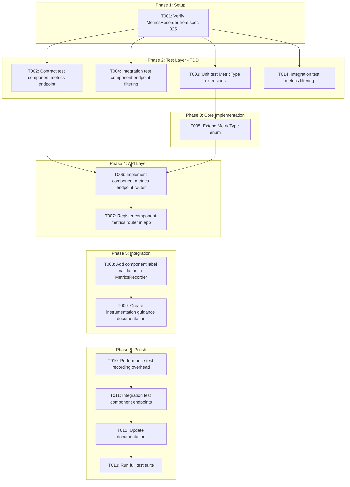

# Tasks: Extend Metrics Collection for All Nexus Components

**Input**: Design documents from `/specs/027-nexus-component-performance-kpi/`
**Prerequisites**: plan.md, research.md, data-model.md, quickstart.md, src/nexus/schemas/metrics/component_metrics.yaml

## Execution Flow (main)
```
1. Load plan.md from feature directory
   → ✅ Tech stack: Python 3.12, FastAPI, SQLModel
   → ✅ Structure: src/nexus/metrics/ (extends spec 025), src/nexus/api/v1/metrics/ (endpoints)
2. Load optional design documents:
   → ✅ data-model.md: MetricType extensions, component labels
   → ✅ research.md: Component instrumentation patterns, endpoint implementation
   → ✅ quickstart.md: 6 test scenarios for validation
   → ✅ component_metrics.yaml: OpenAPI schema for component metrics endpoints
3. Generate tasks by category:
   → ✅ Setup: module structure
   → ✅ Tests: contract tests, unit tests, integration tests (TDD)
   → ✅ Core: MetricType extensions
   → ✅ API: Component metrics endpoint router (GET handler with component label filtering)
   → ✅ Integration: Component instrumentation guidance, endpoint filtering
   → ✅ Polish: Performance tests, documentation
4. Apply task rules:
   → ✅ Different files = mark [P] for parallel
   → ✅ Same file = sequential (no [P])
   → ✅ Tests before implementation (TDD)
5. Number tasks sequentially (T001, T002...)
6. Generate dependency graph
7. Create parallel execution examples
8. Validate task completeness:
   → ✅ All schemas have tests?
   → ✅ All entities have models?
   → ✅ All endpoints implemented?
9. Return: SUCCESS (tasks ready for execution)
```

## Task Dependency Workflow



## Phase 3.1: Setup

- [ ] **T001** Verify MetricsRecorder from spec 025
  - File: `src/nexus/metrics/recorder.py` (from spec 025)
  - Verify MetricsRecorder class exists with `record()` and `time()` methods
  - Verify MetricsRecorder has `query()` method for filtering
  - Verification: MetricsRecorder available and functional
  - Verification: Directory structure exists

## Phase 3.2: Tests First (TDD) ⚠️ MUST COMPLETE BEFORE 3.3
**CRITICAL: These tests MUST be written and MUST FAIL before ANY implementation**

### Contract Tests

- [ ] **T002** [P] Contract test GET /api/v1/{component}/metrics endpoint
  - File: `tests/contract/metrics/test_component_metrics_endpoint.py`
  - Test cases:
    - `test_component_metrics_endpoint_schema()` - response matches OpenAPI schema
    - `test_component_metrics_endpoint_path_parameter()` - component path parameter validation
    - `test_component_metrics_endpoint_query_parameters()` - type, start_time, end_time, labels filtering
    - `test_component_metrics_endpoint_pagination()` - limit, cursor pagination
    - `test_component_metrics_endpoint_component_label()` - all metrics include component label
  - Schema: `src/nexus/schemas/metrics/component_metrics.yaml`
  - **Expected**: All tests FAIL (endpoint doesn't exist yet)

### Unit Tests (can run in parallel)

- [ ] **T003** [P] Write unit tests for MetricType enum extensions
  - File: `tests/unit/metrics/test_types.py` (extend existing from spec 025)
  - Test cases:
    - `test_metric_type_component_extensions()` - all component-specific types exist
    - `test_metric_type_categories_extended()` - extended categories contain correct types
    - `test_metric_type_component_label_validation()` - component label values validated
  - Imports: `from nexus.metrics.types import MetricType, METRIC_CATEGORIES, COMPONENT_LABELS`
  - **Expected**: All tests FAIL (extensions don't exist yet)

### Integration Tests

- [ ] **T004** [P] Write integration test for component endpoint filtering
  - File: `tests/integration/metrics/test_metrics_collection.py`
  - Scenario: Quickstart Scenario 2
  - Test cases:
    - `test_query_component_metrics_endpoint()` - component endpoint returns metrics
    - `test_component_metrics_format()` - response format matches schema
    - `test_component_metrics_component_label()` - all metrics include component label
  - **Expected**: All tests FAIL (endpoint doesn't exist yet)

- [ ] **T014** [P] Write integration test for metrics filtering
  - File: `tests/integration/metrics/test_metrics_collection.py` (section 2)
  - Scenario: Quickstart Scenario 3
  - Test cases:
    - `test_filter_by_component()` - filter metrics by component
    - `test_filter_by_metric_type()` - filter by metric type
    - `test_filter_by_time_range()` - filter by time range
  - **Expected**: All tests FAIL (filtering doesn't work yet)

---

## Phase 3.3: Core Implementation (ONLY after tests are failing)
**Architecture Reminders**:
- Apply DRY principle - extract reusable functions/classes
- Follow SOLID principles - single responsibility per class
- Use dependency injection - inject dependencies via constructors
- Prefer composition over inheritance
- Maintain clear separation of concerns
- **Use SQLModel for all data models** - unified models for database tables and API schemas (not separate Pydantic + SQLAlchemy)

**API Specification Reminders**:
- Document all REST APIs with OpenAPI spec (latest version)
- Document all WebSocket/async APIs with AsyncAPI v3.0.0+
- Use snake_case for all API spec names (parameters, properties, schemas)
- All endpoints must follow path pattern: /api/v1/[component]/[resource]
- Implement RFC 9457 Problem Details for error responses
- All collection endpoints must support pagination (limit and cursor)
- Document security schemes for authenticated endpoints
- Validate schema changes for backward compatibility

### MetricType Extensions

- [ ] **T005** Extend MetricType enum with component-specific types
  - File: `src/nexus/metrics/types.py` (extend existing from spec 025)
  - Implementation (from data-model.md):
    - Add component-specific metric types (API_RESPONSE_TIME, WORKFLOW_CREATION_SUCCESS_RATE, etc.)
    - Extend METRIC_CATEGORIES dict with new categories
    - Add COMPONENT_LABELS constant
  - Verification: Run `tests/unit/metrics/test_types.py` - T003 tests PASS

---

## Phase 3.4: API Layer

- [ ] **T006** Implement component metrics endpoint router
  - File: `src/nexus/metrics/router.py` (extend existing from spec 025 or create new)
  - Implementation:
    - GET `/api/v1/{component}/metrics` endpoint
    - Path parameter: component (enum validation)
    - Query parameters: type, start_time, end_time, labels, limit, cursor
    - Response: ComponentMetricsResponse (from schema)
    - Error handling: RFC 9457 Problem Details
    - Component label validation
  - Schema: `src/nexus/schemas/metrics/component_metrics.yaml`
  - Dependencies: MetricsRecorder from spec 025
  - Verification: Run `tests/contract/metrics/test_component_metrics_endpoint.py` - T002 tests PASS

- [ ] **T007** Register component metrics router in app
  - File: `src/nexus/api/main.py` (or appropriate router registration file)
  - Implementation:
    - Import component metrics router
    - Register router with app
    - Ensure path pattern `/api/v1/{component}/metrics` works
  - Dependencies: T006
  - Verification: Router registered, endpoint accessible

---

## Phase 3.5: Integration

- [ ] **T008** Add component label validation to MetricsRecorder
  - File: `src/nexus/metrics/recorder.py` (extend existing from spec 025)
  - Implementation:
    - Add validation in `record()` method to ensure all metrics include `component` label
    - Validate component label value is one of the 9 valid component categories
    - Raise validation error if component label is missing or invalid
  - Dependencies: T005 (MetricType needed for validation)
  - Verification: Component label validation works correctly

- [ ] **T009** Create instrumentation guidance documentation
  - File: `docs/instrumentation-guide.md` (or appropriate documentation location)
  - Implementation:
    - Document where to add `recorder.record()` calls in each component
    - Document where to add `recorder.time()` context managers
    - Provide examples for each component category
    - Include component label requirements
  - Dependencies: T008 (validation needed for guidance)
  - Verification: Documentation complete and accurate

---

## Phase 3.6: Polish

- [ ] **T010** [P] Performance test recording overhead
  - File: `tests/integration/metrics/test_component_endpoints.py` (section 2)
  - Scenario: Quickstart Scenario 5
  - Test: Measure overhead of metrics recording (<1% threshold)
  - Verification: Overhead < 1%, recording is async and non-blocking

- [ ] **T011** Integration test component endpoints
  - File: `tests/integration/metrics/test_component_endpoints.py` (section 3)
  - Scenario: Quickstart Scenarios 1-6
  - Test: End-to-end component recording, endpoint filtering, querying
  - Verification: All quickstart scenarios pass

- [ ] **T012** [P] Update documentation
  - Files:
    - `README.md` (if metrics section exists)
    - API documentation for component metrics endpoints
  - Update with component endpoint patterns and instrumentation guidance
  - Verification: Documentation updated

- [ ] **T013** Run full test suite
  - Command: `make test-all`
  - Verification: All tests pass, no regressions

---

## Dependencies

- T001 → T002-T004, T014 (MetricsRecorder verification before tests)
- T002-T004 → T005-T007 (tests before implementation - TDD)
- T005 → T006 (MetricType needed for endpoint)
- T006 → T007 (router needed for registration)
- T005 → T008 (MetricType needed for validation)
- T008 → T009 (validation needed for instrumentation guidance)
- T007 → T010 (endpoints needed for performance tests)
- T010 → T011 (performance tests before integration tests)
- T011 → T012-T013 (polish phase)
- T013 → T014 (full test suite before metrics filtering test)

## Parallel Example

```
# Launch T002-T004 together (tests, different files):
Task: "Contract test component metrics endpoint" (T002)
Task: "Unit test MetricType extensions in tests/unit/metrics/test_types.py" (T003)
Task: "Integration test component endpoint filtering in tests/integration/metrics/test_component_endpoints.py" (T004)
```

## Notes

- [P] tasks = different files, no dependencies
- Verify tests fail before implementing
- Commit after each task
- Avoid: vague tasks, same file conflicts
- **Important**: This feature extends spec 025. Ensure MetricsRecorder from spec 025 exists before implementing T001
- All metrics must include component label (FR-002)
- External tools (Locust, RAGAS, Guidellm) are completely independent and separate from MetricsRecorder metrics collection - not integrated into Nexus

## Task Generation Rules
*Applied during main() execution*

1. **From Schemas**:
   - component_metrics.yaml → contract test task T002 [P]

2. **From Data Model**:
   - MetricType extensions → T005
   - Component label validation → T008

3. **From User Stories**:
   - Quickstart Scenario 1 → T004 [P]
   - Quickstart Scenario 2 → T004 [P]
   - Quickstart Scenario 3 → T004 [P]
   - Quickstart Scenario 5 → T010 [P]

4. **Ordering**:
   - Setup → Tests → Models → API → Integration → Polish
   - Dependencies block parallel execution

## Validation Checklist
*GATE: Checked by main() before returning*

- [x] All schemas have corresponding tests (component_metrics.yaml → T002)
- [x] All entities have model tasks (MetricType extensions, component label validation)
- [x] All tests come before implementation (TDD enforced)
- [x] Parallel tasks truly independent (different files)
- [x] Each task specifies exact file path
- [x] No task modifies same file as another [P] task
