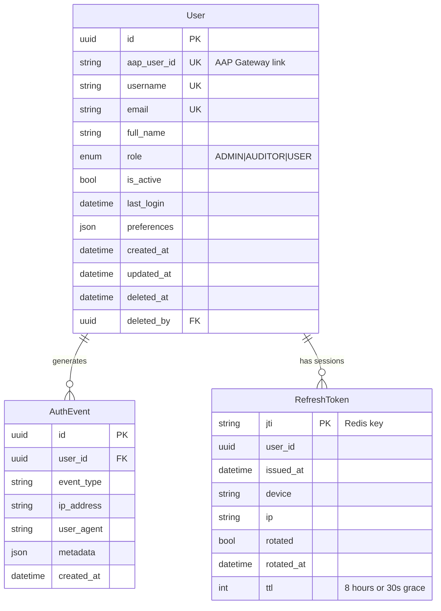
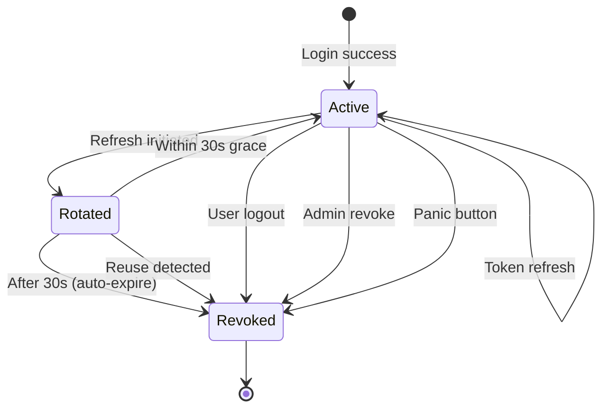
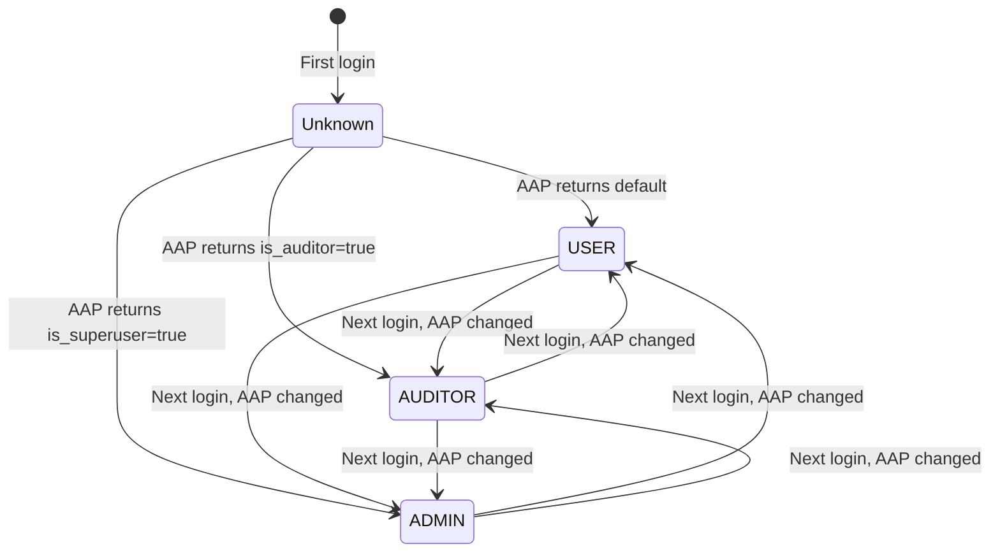

# Data Model: Authentication and Authorization

- **Feature**: 028-authentication-and-authorization
- **Date**: 2026-02-06

## Entity Overview



## User Model (Extended)

**Location**: `src/nexus/core/models/user.py`

### Current State
```python
class UserRole(str, Enum):
    CREATOR = "creator"
    APPROVER = "approver"
    ADMINISTRATOR = "administrator"
    VIEWER = "viewer"

class User(SoftDeletableResource, table=True):
    username: str
    email: str
    full_name: str
    role: UserRole
    is_active: bool = True
    last_login: datetime | None
    preferences: dict[str, Any]
```

### Target State
```python
class UserRole(str, Enum):
    """User role enumeration for access control.

    Roles are mapped from AAP Gateway flags:
    - is_superuser=true -> ADMIN
    - is_auditor=true -> AUDITOR
    - default -> USER

    Note: ADMIN takes precedence if both flags are set.
    """
    ADMIN = "admin"
    AUDITOR = "auditor"
    USER = "user"

class User(SoftDeletableResource, table=True):
    # ... existing fields ...

    # NEW: AAP Gateway link
    aap_user_id: str | None = Field(
        default=None,
        max_length=255,
        sa_type=String(255),
        description="AAP Gateway user identifier for OAuth2 linking",
    )

    # Table args update for unique constraint
    __table_args__ = (
        # ... existing indexes ...
        Index(
            "ix_users_aap_user_id_unique",
            "aap_user_id",
            unique=True,
            postgresql_where=text("deleted_at IS NULL AND aap_user_id IS NOT NULL"),
        ),
    )
```

### Migration Notes
- `aap_user_id` is nullable to support existing users
- Unique constraint only applies to non-null, non-deleted users
- Role enum migration: ADMINISTRATOR→ADMIN, VIEWER→AUDITOR, CREATOR/APPROVER→USER

## AuthEvent Model (New)

**Location**: `src/nexus/core/models/auth_event.py`

**Alignment**: This model implements the authentication/authorization audit requirements defined in [ANSTRAT-1740](ANSTRAT-1740) (Audits / Logging).

**ANSTRAT-1740 Requirements Coverage**:
| Requirement | How AuthEvent Addresses It |
|-------------|---------------------------|
| User accountability | `user_id` links every auth event to a specific user |
| Security-relevant events | Captures login failures, access denied, token revocation, panic events |
| Immutability | Append-only table design (no UPDATE/DELETE operations in application code) |
| Time-synchronized | `created_at` timestamp from database server time |
| Traceability | `metadata` JSON captures full context (IP, user agent, error codes, affected resources) |

```python
from enum import Enum
from typing import Any
from uuid import UUID

from sqlmodel import JSON, Field, String

from nexus.core.models.base import BaseResource


class AuthEventType(str, Enum):
    """Authentication and authorization event types."""

    LOGIN_SUCCESS = "login_success"
    LOGIN_FAILURE = "login_failure"
    USER_CREATED = "user_created"
    LOGOUT = "logout"
    TOKEN_REFRESH = "token_refresh"
    TOKEN_REFRESH_FAILURE = "token_refresh_failure"
    TOKEN_REVOKED = "token_revoked"
    ACCESS_DENIED = "access_denied"
    ROLE_CHANGE = "role_change"
    PANIC_REVOCATION = "panic_revocation"


class AuthEvent(BaseResource, table=True):
    """Audit log for authentication and authorization events.

    Attributes:
        id: Primary key UUID (from BaseResource)
        created_at: Event timestamp (from BaseResource)
        user_id: Associated user (nullable for failed logins)
        event_type: Type of auth event
        ip_address: Client IP address
        user_agent: Client user agent string
        metadata: Additional event-specific data
    """

    __tablename__ = "auth_events"

    user_id: UUID | None = Field(
        default=None,
        foreign_key="users.id",
        index=True,
        description="User associated with event (null for failed logins)",
    )

    event_type: AuthEventType = Field(
        sa_column=postgres_enum_column(
            AuthEventType,
            "autheventtype",
            index=True,
            create_constraint=True,
        ),
        description="Type of authentication/authorization event",
    )

    ip_address: str | None = Field(
        default=None,
        max_length=45,  # IPv6 max length
        sa_type=String(45),
        description="Client IP address",
    )

    user_agent: str | None = Field(
        default=None,
        max_length=1000,
        sa_type=String(1000),
        description="Client user agent string",
    )

    metadata: dict[str, Any] = Field(
        default_factory=dict,
        sa_type=JSON,
        description="Event-specific metadata (e.g., error codes, JTIs)",
    )
```

### Event Trigger Reference

Per ANSTRAT-1740, each event must capture sufficient context for root-cause analysis and compliance.

#### `login_success`

- **Trigger**: After OAuth2 callback completes successfully (code exchange + profile fetch + user sync)
- **user_id**: Set (the authenticated user)
- **ANSTRAT-1740 Category**: User action
- **Metadata**: `{"aap_user_id": "...", "aap_instance_id": "...", "role_assigned": "USER"}`

#### `login_failure`

- **Trigger**: Any failure during the OAuth2 login flow
- **user_id**: Null (user identity unknown at failure point)
- **ANSTRAT-1740 Category**: Security event
- **Metadata**: `{"error_code": "<code>", "error_message": "...", "aap_instance_id": "..."}`
- **Error codes**:

| Error Code | Trigger |
|------------|---------|
| `csrf_mismatch` | OAuth2 state parameter does not match stored state |
| `code_exchange_failed` | AAP rejected the authorization code (expired, invalid, already used) |
| `aap_unreachable` | AAP Gateway is unreachable during code exchange or profile fetch |
| `profile_fetch_failed` | Code exchanged successfully but user profile fetch from AAP failed |
| `oauth2_error` | AAP returned an error in the OAuth2 callback (`?error=...` parameter) |

#### `user_created`

- **Trigger**: First login by a user with no existing Nexus account (FR-002a)
- **user_id**: Set (the newly created user)
- **ANSTRAT-1740 Category**: User action
- **Metadata**: `{"aap_user_id": "...", "aap_instance_id": "...", "role_assigned": "USER", "username": "aap-prod/john.doe"}`

#### `logout`

- **Trigger**: User calls `POST /auth/logout`
- **user_id**: Set
- **ANSTRAT-1740 Category**: User action
- **Metadata**: `{"revoke_success": true, "aap_logout_redirect": true, "sessions_revoked": 1}`

#### `token_refresh`

- **Trigger**: Successful `POST /auth/refresh` (new access token issued, refresh token rotated)
- **user_id**: Set
- **ANSTRAT-1740 Category**: User action
- **Metadata**: `{"old_jti": "...", "new_jti": "..."}`

#### `token_refresh_failure`

- **Trigger**: Failed `POST /auth/refresh` (refresh token expired, not found in Redis, or invalid)
- **user_id**: Set if extractable from the token, null otherwise
- **ANSTRAT-1740 Category**: Security event
- **Metadata**: `{"error_code": "<code>", "jti": "..."}`
- **Error codes**:

| Error Code | Trigger |
|------------|---------|
| `token_expired` | Refresh token JWT has expired (beyond 8-hour lifetime) |
| `token_not_found` | JTI does not exist in Redis (already revoked or expired) |
| `invalid_signature` | JWT signature verification failed |
| `invalid_token` | Malformed JWT or missing required claims |

#### `token_revoked`

- **Trigger**: Refresh token signature validation failure or reuse detection, resulting in ALL refresh tokens for the affected user being flushed from Redis
- **user_id**: Set (the affected user whose sessions are flushed)
- **ANSTRAT-1740 Category**: Security event
- **Metadata**: `{"reason": "<reason>", "trigger_jti": "...", "sessions_flushed": 3}`
- **Reasons**:

| Reason | Trigger | Implication |
|--------|---------|-------------|
| `signature_invalid` | Public key validation failed during JWT signature check | Potentially forged or tampered token |
| `reuse_detected` | Rotated refresh token used outside 30-second grace period (FR-018) | Potential token theft |
| `admin_revoked` | Admin revoked sessions via `POST /api/v1/admin/users/{id}/revoke-tokens` | Deliberate administrative action |

#### `access_denied`

- **Trigger**: Authenticated user attempts an action they are not authorized for (insufficient role or not resource owner)
- **user_id**: Set
- **ANSTRAT-1740 Category**: Security event
- **Metadata**: `{"endpoint": "/api/v1/...", "method": "POST", "required_permission": "admin", "user_role": "USER", "denial_reason": "insufficient_role"}`
- **Denial reasons**:

| Denial Reason | Trigger |
|---------------|---------|
| `insufficient_role` | User's role does not meet the endpoint's minimum role requirement |
| `not_resource_owner` | User is not the owner of the resource and is not ADMIN |
| `auditor_write_denied` | AUDITOR attempted a write operation |

#### `role_change`

- **Trigger**: During login, the role synced from AAP differs from the user's stored role in Nexus
- **user_id**: Set
- **ANSTRAT-1740 Category**: Configuration change
- **Metadata**: `{"old_role": "USER", "new_role": "ADMIN", "changed_by": "aap_sync", "aap_instance_id": "..."}`

#### `panic_revocation`

- **Trigger**: Admin uses emergency panic button via `POST /api/v1/admin/sessions/revoke-all`
- **user_id**: Set (the admin who triggered it)
- **ANSTRAT-1740 Category**: Security event
- **Metadata**: `{"admin_user_id": "...", "affected_users": 15, "affected_sessions": 42, "reason": "..."}`

### Audit Log Integrity

Per ANSTRAT-1740 immutability requirement:
- AuthEvent records are **append-only** (INSERT only, no UPDATE/DELETE)
- Application code MUST NOT modify or delete existing auth events
- Database-level retention policies may archive old records but MUST NOT modify them
- Consider database audit triggers or Write-Ahead Logging (WAL) for tamper detection

## RefreshToken Metadata (Redis)

**Storage**: Redis key-value with TTL
**Key Pattern**: `refresh_token:{jti}`

### Schema
```json
{
  "user_id": "550e8400-e29b-41d4-a716-446655440000",
  "issued_at": "2026-02-06T10:30:00Z",
  "device": "Mozilla/5.0 (Windows NT 10.0; Win64; x64)...",
  "ip": "192.168.1.100",
  "rotated": false,
  "rotated_at": null
}
```

### Operations

| Operation | Implementation |
|-----------|---------------|
| Create | `SETEX refresh_token:{jti} 28800 {json}` (8 hours) |
| Get | `GET refresh_token:{jti}` |
| Mark rotated | Update JSON with `rotated: true, rotated_at: now`, `SETEX` with 30s TTL |
| Revoke | `DEL refresh_token:{jti}` |
| List user sessions | `SCAN refresh_token:*` + filter by user_id |
| Revoke all | `SCAN refresh_token:*` + `DEL` each matching user_id |

### Global Revocation Key
```
Key: global_revocation_timestamp
Value: Unix timestamp (integer)
TTL: None (persistent until cleared)
```

Access tokens with `iat < global_revocation_timestamp` are rejected.

## JWT Token Claims

### Custom Claims Namespace

All non-standard JWT claims use the `nexus/` namespace prefix to avoid collisions with reserved OIDC claims and future standard claims. This follows [Auth0's namespaced claims guidelines](https://auth0.com/docs/secure/tokens/json-web-tokens/create-custom-claims).

| Claim | Description |
|-------|-------------|
| `nexus/username` | User identifier in format `<aap-instance-id>/<username>` |
| `nexus/user_type` | User role: `ADMIN`, `AUDITOR`, or `USER` |
| `nexus/token_type` | Token type: `access` or `refresh` |

### Username Format

The `nexus/username` claim uses the format `<aap-instance-id>/<username>` to ensure uniqueness across AAP Gateway instances:

```
nexus/username: "aap-prod/john.doe"
```

**Rationale**: If an AAP Gateway instance is replaced or multiple instances are configured, this format prevents identity collisions. The `aap-instance-id` is a unique identifier configured in Nexus for each AAP Gateway connection.

### Access Token
```json
{
  "header": {
    "alg": "ES256",
    "typ": "JWT",
    "kid": "2026-01-nexus-primary"
  },
  "payload": {
    "sub": "550e8400-e29b-41d4-a716-446655440000",
    "email": "john.doe@example.com",
    "nexus/username": "aap-prod/john.doe",
    "nexus/user_type": "USER",
    "nexus/token_type": "access",
    "iss": "nexus",
    "iat": 1707216600,
    "exp": 1707217500
  }
}
```

### Refresh Token
```json
{
  "header": {
    "alg": "ES256",
    "typ": "JWT",
    "kid": "2026-01-nexus-primary"
  },
  "payload": {
    "sub": "550e8400-e29b-41d4-a716-446655440000",
    "jti": "a1b2c3d4-5678-90ab-cdef-1234567890ab",
    "nexus/token_type": "refresh",
    "iss": "nexus",
    "iat": 1707216600,
    "exp": 1707245400
  }
}
```

## Validation Rules

### User
| Field | Validation |
|-------|------------|
| `username` | 1-255 chars, unique per non-deleted users |
| `email` | 1-255 chars, unique per non-deleted users |
| `aap_user_id` | 1-255 chars, unique per non-deleted users (nullable) |
| `role` | Must be valid UserRole enum value |

### AuthEvent
| Field | Validation |
|-------|------------|
| `event_type` | Must be valid AuthEventType enum value |
| `ip_address` | Max 45 chars (IPv6 compatible) |
| `user_agent` | Max 1000 chars |

### JWT Claims
| Claim | Validation |
|-------|------------|
| `alg` | Must be exactly "ES256" |
| `kid` | Must match a known key ID in the key registry (used to select the correct public key for signature validation; supports key rotation grace period) |
| `iss` | Must be "nexus" |
| `exp` | Must be in future |
| `nexus/token_type` | Must match expected token type ("access" or "refresh") |
| `nexus/username` | Required for access tokens, format: `<aap-instance-id>/<username>` |
| `nexus/user_type` | Required for access tokens, must be "ADMIN", "AUDITOR", or "USER" |
| `jti` | Required for refresh tokens, must exist in Redis |

**Key rotation validation**: During a key rotation grace period, the key registry contains both the current and previous public keys. The `kid` header determines which public key validates the token — no trial-and-error fallback. Tokens with an unknown `kid` are rejected immediately. This is only relevant when the refresh token lifetime is configured to a longer period (e.g., 5-30 days); with the default 8-hour lifetime, all old tokens expire naturally within one day of rotation.

## State Transitions

### Session Lifecycle


### Role Sync

