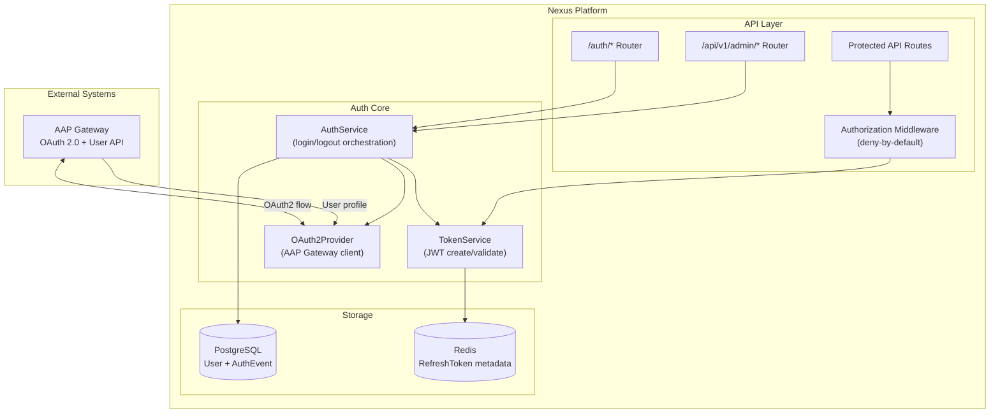
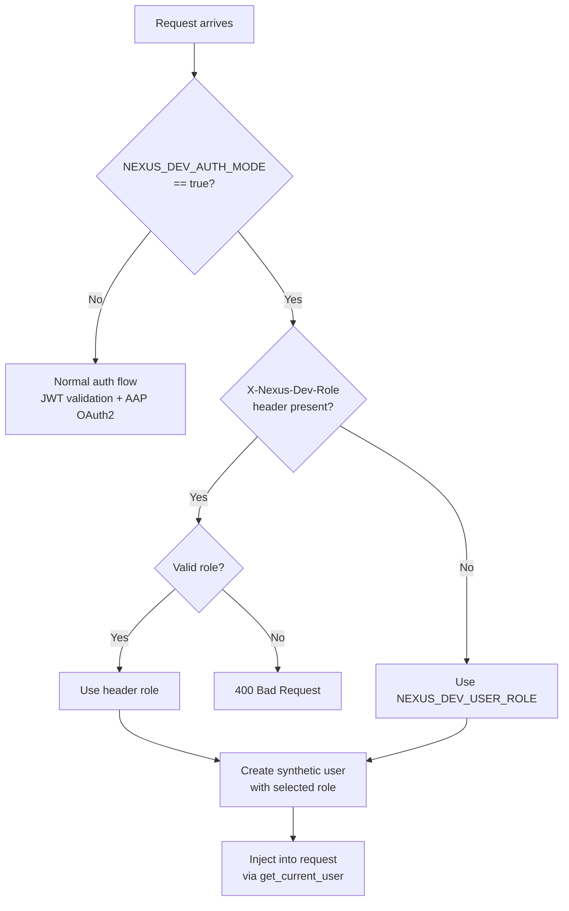

# Implementation Plan: Authentication and Authorization

- **Branch**: `028-authentication-and-authorization`
- **Date**: 2026-02-06
- **Spec**: [specs/028-authentication-and-authorization/spec.md](spec.md)
- **Input**: Feature specification from `specs/028-authentication-and-authorization/spec.md`

## Summary

Implement authentication via AAP Gateway OAuth 2.0 and role-based authorization for Nexus. Users authenticate through AAP Gateway, their profile and role are synced during login, and JWT tokens enable stateless API request validation. Three roles (ADMIN, AUDITOR, USER) control access with deny-by-default authorization. Redis stores refresh token metadata for session management and revocation.

### Key Technical Decisions

- OAuth 2.0 with AAP Gateway (not OIDC - AAP 2.6 doesn't support userinfo claims)
- JWT access tokens (15 min, stateless) + refresh tokens (8 hours, stored in Redis)
- ES256 (ECDSA P-256) for JWT signing
- Modular auth provider pattern for future OIDC migration
- Existing User model extended with `aap_user_id` field

## Technical Context

- **Language/Version**: Python 3.12
- **Primary Dependencies**: FastAPI, SQLModel, authlib (OAuth2 client), PyJWT[crypto] (ES256 JWT), httpx (async HTTP), redis-py (session storage)
- **Storage**: PostgreSQL with SQLModel ORM (User model), Redis for refresh token metadata
- **Testing**: pytest with pytest-asyncio, respx for mocking httpx
- **Target Platform**: Linux server (containerized with Podman/OpenShift)
- **Project Type**: single (existing Nexus monolith)
- **Performance Goals**: <50ms token validation (no external calls), <500ms login flow
- **Constraints**: Stateless access token validation (horizontal scaling), 8-hour max session
- **Scale/Scope**: Single AAP instance, all AAP users can access Nexus

## Constitution Check
*GATE: Must pass before Phase 0 research. Re-check after Phase 1 design.*

### Technology Standards Compliance
- [x] **SQLModel for Data Models**: User model already uses SQLModel; new auth entities will too

### Code Architecture Compliance
- [x] **DRY Principle**: Reuse existing base models, service patterns, and cache client
- [x] **SOLID Principles**: AuthProvider interface for OAuth2/OIDC abstraction; separate TokenService, AuthService
- [x] **Separation of Concerns**: Auth layer (middleware) separate from business logic services
- [x] **Dependency Injection**: FastAPI Depends() pattern already established; follow same for auth
- [x] **Composition vs Inheritance**: AuthProvider uses interface/protocol, not inheritance hierarchy

### API Specification Standards Compliance
- [x] **OpenAPI/AsyncAPI Compliance**: Auth endpoints defined in OpenAPI schema
- [x] **Naming Convention**: snake_case for all parameters (access_token, refresh_token, user_type)
- [x] **Documentation Completeness**: All auth endpoints documented with examples
- [x] **RFC 9457 Error Format**: Auth errors use Problem Details with auth-specific problem types (see PRE-001 prerequisite)
- [x] **Error Message Safety**: No internal details in auth error messages
- [x] **API Versioning**: Auth endpoints under `/auth/*` (unversioned for OAuth2 standard compliance)
- [x] **API Path Structure**: `/auth/*` for OAuth flow, `/api/v1/admin/*` for session management
- [x] **Pagination Support**: Session list endpoint supports pagination
- [x] **Filtering/Sorting Consistency**: N/A for auth endpoints
- [x] **Security Documentation**: OAuth2 Bearer scheme documented for protected endpoints
- [x] **Schema Compatibility**: New endpoints, no backward compatibility concerns

## Project Structure

### Documentation (this feature)
```
specs/028-authentication-and-authorization/
├── plan.md              # This file
├── research.md          # Phase 0 output
├── data-model.md        # Phase 1 output
├── quickstart.md        # Phase 1 output
└── tasks.md             # Phase 2 output (/tasks command)
```

### Source Code (repository root)
```
src/nexus/
├── api/
│   └── auth/                    # Auth endpoints and middleware
│       ├── __init__.py
│       ├── router.py            # /auth/* endpoints
│       ├── dependencies.py      # get_current_user (replace existing stub)
│       ├── middleware.py        # Authorization middleware
│       └── schemas.py           # Request/response models
├── core/
│   ├── auth/                    # Auth business logic (NEW component)
│   │   ├── __init__.py
│   │   ├── providers/           # OAuth2/OIDC providers
│   │   │   ├── __init__.py
│   │   │   ├── base.py          # AuthProvider protocol
│   │   │   └── oauth2.py        # AAP Gateway OAuth2 provider
│   │   ├── services/
│   │   │   ├── __init__.py
│   │   │   ├── auth_service.py  # Login/logout orchestration
│   │   │   └── token_service.py # JWT creation/validation
│   │   └── session/
│   │       ├── __init__.py
│   │       └── session_store.py # Redis key-value storage for refresh tokens
│   ├── models/
│   │   └── user.py              # Extend with aap_user_id, update UserRole
│   └── cache/
│       └── stream.py            # Existing Redis Streams client (NOT reused for sessions)
├── schemas/
│   └── auth/                    # OpenAPI schemas for auth
│       └── auth.yaml
tests/
├── unit/
│   └── core/
│       └── auth/                # Unit tests for auth services
├── integration/
│   └── auth/                    # Integration tests for auth flow
└── contract/
    └── auth/                    # Contract tests for auth endpoints
```

**Structure Decision**: Option 1 (single project) - extending existing Nexus monolith

## Phase 0: Outline & Research

### Research Topics

1. **OAuth2 with authlib + FastAPI**: Best practices for OAuth2 client implementation
2. **JWT with PyJWT ES256**: ECDSA key management, token creation/validation patterns
3. **Redis session storage**: Refresh token metadata storage patterns
4. **Existing codebase integration**: How to extend User model, replace auth stub

### Key Findings (Codebase Exploration)

**Existing User Model** (`src/nexus/core/models/user.py`):
- Already exists with `username`, `email`, `full_name`, `role`, `is_active`, `last_login`
- Current `UserRole` enum: CREATOR, APPROVER, ADMINISTRATOR, VIEWER
- **CONFLICT**: Proposal defines roles as ADMIN, AUDITOR, USER
- Extends `SoftDeletableResource` (UUID pk, timestamps, soft delete)
- Missing: `aap_user_id` field for AAP Gateway linkage

**Existing Auth Stub** (`src/nexus/api/auth/dependencies.py`):
- `get_current_user()` returns hardcoded "dev-user"
- Comment indicates: "Real authentication will be implemented in a future ticket"
- This is the hook point for JWT validation

### Existing Patterns

- Service pattern: Constructor injection of `AsyncSession` + `User`
- Cache client: `StreamClient` in `src/nexus/core/cache/stream.py` (Redis Streams only - see note below)
- Router pattern: `APIRouter` with `Depends()` for service injection
- httpx: Used throughout for async HTTP calls

**Redis Client Note**: `StreamClient` wraps `redis.asyncio.Redis` but only exposes Redis Streams operations (`XADD`, `XREAD`, `XREVRANGE`, `XINFO`, `DEL`). It does **not** support key-value operations (`SET`, `GET`, `SETEX`, `SCAN`) needed for refresh token storage. A separate `SessionStore` class is needed (see project structure), reusing the same `CacheSettings` configuration and `redis.asyncio.Redis` client pattern.

### Dependencies to Add

- `authlib` - OAuth2 client (not currently in pyproject.toml)
- `PyJWT[crypto]` - JWT with ECDSA support (not currently in pyproject.toml)

**Output**: research.md (see separate file)

## Phase 1: Design & Contracts

### 1. Data Model Updates

**User Model Extension**:
```python
# Add to existing User model
aap_user_id: str | None = Field(
    default=None,
    max_length=255,
    sa_type=String(255),
    description="AAP Gateway user identifier for OAuth2 linking",
    index=True,
)
```

**UserRole Enum Update**:
```python
class UserRole(str, Enum):
    ADMIN = "admin"
    AUDITOR = "auditor"
    USER = "user"
```

### New Entities

- `RefreshTokenMetadata` (Redis, not PostgreSQL) - session tracking
- `AuthEvent` (PostgreSQL) - audit logging

### 2. API Contracts

**Authentication Endpoints** (`/auth/*`):
| Method | Endpoint | Description |
|--------|----------|-------------|
| GET | `/auth/login` | Initiate OAuth2 flow (redirect to AAP) |
| GET | `/auth/callback` | OAuth2 callback (exchange code, create session) |
| POST | `/auth/refresh` | Refresh access token |
| POST | `/auth/logout` | Revoke tokens, clear session |
| GET | `/auth/me` | Get current user info |
| GET | `/auth/.well-known/jwks.json` | Public keys for JWT verification |

**Admin Endpoints** (`/api/v1/admin/*`):
| Method | Endpoint | Description |
|--------|----------|-------------|
| GET | `/api/v1/admin/sessions` | List all sessions (admin only) |
| POST | `/api/v1/admin/users/{id}/revoke-tokens` | Revoke all user sessions |
| POST | `/api/v1/admin/sessions/revoke-all` | Panic button |

**User Session Endpoints** (`/api/v1/sessions/*`) - *Future Enhancement*:
| Method | Endpoint | Description |
|--------|----------|-------------|
| GET | `/api/v1/sessions` | List current user's sessions |
| DELETE | `/api/v1/sessions/{jti}` | Revoke specific session |

> **Note**: User session self-management is out of scope for initial implementation (see FR-016a).

### 2a. Existing Endpoint Permission Matrix

This matrix defines authorization rules for all existing Nexus endpoints plus new auth endpoints.

**Legend**: ✓ = Allowed, ✗ = Forbidden, Own = Only if user owns resource, Pub = Public (no auth)

#### Public Endpoints (No Authentication Required)
| Method | Endpoint | ADMIN | AUDITOR | USER | Unauthenticated |
|--------|----------|:-----:|:-------:|:----:|:---------------:|
| GET | `/health` | Pub | Pub | Pub | Pub |
| GET | `/` | Pub | Pub | Pub | Pub |
| GET | `/auth/login` | Pub | Pub | Pub | Pub |
| GET | `/auth/callback` | Pub | Pub | Pub | Pub |
| GET | `/auth/.well-known/jwks.json` | Pub | Pub | Pub | Pub |

#### Authentication Endpoints (Authenticated)
| Method | Endpoint | ADMIN | AUDITOR | USER |
|--------|----------|:-----:|:-------:|:----:|
| POST | `/auth/refresh` | ✓ | ✓ | ✓ |
| POST | `/auth/logout` | ✓ | ✓ | ✓ |
| GET | `/auth/me` | ✓ | ✓ | ✓ |

#### Admin Endpoints (ADMIN Only)
| Method | Endpoint | ADMIN | AUDITOR | USER |
|--------|----------|:-----:|:-------:|:----:|
| GET | `/api/v1/admin/sessions` | ✓ | ✗ | ✗ |
| POST | `/api/v1/admin/users/{id}/revoke-tokens` | ✓ | ✗ | ✗ |
| POST | `/api/v1/admin/sessions/revoke-all` | ✓ | ✗ | ✗ |
| GET | `/api/v1/admin/auth-events` | ✓ | ✓ | ✗ |

#### Workflows Endpoints
| Method | Endpoint | ADMIN | AUDITOR | USER | Notes |
|--------|----------|:-----:|:-------:|:----:|-------|
| GET | `/api/v1/workflows` | ✓ | ✓ | ✓ | List all |
| POST | `/api/v1/workflows` | ✓ | ✗ | ✓ | Create |
| GET | `/api/v1/workflows/{id}` | ✓ | ✓ | ✓ | Read |
| PATCH | `/api/v1/workflows/{id}` | ✓ | ✗ | Own | Update |
| DELETE | `/api/v1/workflows/{id}` | ✓ | ✗ | Own | Delete |
| GET | `/api/v1/workflows/{id}/versions` | ✓ | ✓ | ✓ | List versions |
| GET | `/api/v1/workflows/{id}/versions/{v}` | ✓ | ✓ | ✓ | Get version |

#### Executions Endpoints
| Method | Endpoint | ADMIN | AUDITOR | USER | Notes |
|--------|----------|:-----:|:-------:|:----:|-------|
| GET | `/api/v1/executions` | ✓ | ✓ | ✓ | List all |
| POST | `/api/v1/executions` | ✓ | ✗ | Own | Run workflow (own only) |
| GET | `/api/v1/executions/{id}` | ✓ | ✓ | ✓ | Read |
| GET | `/api/v1/executions/{id}/activities` | ✓ | ✓ | ✓ | Read activities |
| POST | `/api/v1/executions/{id}/activities/{aid}/signal` | ✓ | ✗ | Own | Signal (own execution) |

#### Invocations Endpoints
| Method | Endpoint | ADMIN | AUDITOR | USER | Notes |
|--------|----------|:-----:|:-------:|:----:|-------|
| GET | `/api/v1/invocations` | ✓ | ✓ | ✓ | List all |
| POST | `/api/v1/invocations` | ✓ | ✗ | ✓ | Create invocation |
| GET | `/api/v1/invocations/{id}` | ✓ | ✓ | ✓ | Read |
| POST | `/api/v1/invocations/{id}/cancel` | ✓ | ✗ | Own | Cancel (own only) |

#### Tool Manager Endpoints
| Method | Endpoint | ADMIN | AUDITOR | USER | Notes |
|--------|----------|:-----:|:-------:|:----:|-------|
| GET | `/api/v1/tool_manager/tools` | ✓ | ✓ | ✓ | List tools |
| GET | `/api/v1/tool_manager/tools/{id}` | ✓ | ✓ | ✓ | Read tool |
| PATCH | `/api/v1/tool_manager/tools/{id}` | ✓ | ✗ | ✗ | Update tool status |
| PATCH | `/api/v1/tool_manager/tools/bulk_update` | ✓ | ✗ | ✗ | Bulk update |
| GET | `/api/v1/tool_manager/tool_providers` | ✓ | ✓ | ✓ | List providers |
| POST | `/api/v1/tool_manager/tool_providers` | ✓ | ✗ | ✗ | Register provider |
| GET | `/api/v1/tool_manager/tool_providers/{id}` | ✓ | ✓ | ✓ | Read provider |
| PUT | `/api/v1/tool_manager/tool_providers/{id}` | ✓ | ✗ | ✗ | Replace provider |
| PATCH | `/api/v1/tool_manager/tool_providers/{id}` | ✓ | ✗ | ✗ | Update provider |
| DELETE | `/api/v1/tool_manager/tool_providers/{id}` | ✓ | ✗ | ✗ | Delete provider |
| POST | `/api/v1/tool_manager/tool_providers/{id}/validate` | ✓ | ✗ | ✗ | Validate |
| POST | `/api/v1/tool_manager/tool_providers/test` | ✓ | ✗ | ✗ | Test |
| POST | `/api/v1/tool_manager/tool_providers/{id}/refresh_tools` | ✓ | ✗ | ✗ | Refresh |

#### Files Endpoints
| Method | Endpoint | ADMIN | AUDITOR | USER | Notes |
|--------|----------|:-----:|:-------:|:----:|-------|
| POST | `/api/v1/files` | ✓ | ✗ | ✓ | Upload files |

### 3. Architecture Diagram



### 4. Quickstart Test Scenarios

See `quickstart.md` for full validation scenarios.

**Output**: data-model.md, src/nexus/schemas/auth/auth.yaml, quickstart.md

### 5. Development Environment Auth Bypass

In development mode, the auth system is replaced by a configurable stub that requires no AAP Gateway. All dev-mode configuration uses the `NEXUS_DEV_` prefix. When `NEXUS_DEV_AUTH_MODE` is not set or not `"true"`, the application MUST ignore all `NEXUS_DEV_*` variables entirely.

#### Environment Variables

| Variable | Default | Description |
|----------|---------|-------------|
| `NEXUS_DEV_AUTH_MODE` | _(unset)_ | Set to `"true"` to enable dev auth bypass. **Required** to activate dev mode. |
| `NEXUS_DEV_USER_ROLE` | `ADMIN` | Default role for the dev user (`ADMIN`, `AUDITOR`, `USER`) |
| `NEXUS_DEV_USERNAME` | `dev-user` | Username for the dev user |
| `NEXUS_DEV_USER_EMAIL` | `dev@nexus.local` | Email for the dev user |
| `NEXUS_DEV_AAP_INSTANCE_ID` | `aap-dev` | AAP instance ID prefix for username |

#### Per-Request Role Override Header

When `NEXUS_DEV_AUTH_MODE=true`, the middleware accepts the `X-Nexus-Dev-Role` header to override the role on a per-request basis:

```bash
# Use ADMIN role (from env default)
curl http://localhost:8000/api/v1/workflows

# Override to AUDITOR for this request
curl -H "X-Nexus-Dev-Role: AUDITOR" http://localhost:8000/api/v1/workflows

# Override to USER for this request
curl -H "X-Nexus-Dev-Role: USER" http://localhost:8000/api/v1/workflows
```

#### Behavior



#### Implementation Rules

- **Hard boundary**: When `NEXUS_DEV_AUTH_MODE` is not `"true"`, the `X-Nexus-Dev-Role` header is silently ignored and all `NEXUS_DEV_*` variables are never read
- **Startup log**: When dev mode is active, log a clear warning at startup: `"WARNING: Dev auth mode is active. All requests are authenticated as <username> (<role>)"`
- **No dev code in production path**: The dev auth provider is a separate implementation of the `AuthProvider` protocol, selected at startup based on the env var. The production auth path has zero dev-mode logic
- **Synthetic user**: The dev user gets a deterministic UUID derived from the username (e.g., `uuid5(NAMESPACE_DNS, username)`) so it's stable across restarts
- **JWT tokens still issued**: Even in dev mode, the system issues real JWT tokens with namespaced claims, so the full token validation path is exercised
- **Username format**: The dev user's prefixed username follows the same format as production: `<aap-instance-id>/<username>` (e.g., `aap-dev/dev-user`)

## Phase 2: Task Planning Approach
*This section describes what the /tasks command will do - DO NOT execute during /plan*

### Task Generation Strategy

- TDD approach: Write failing tests first, then implement
- Layer order: Models → Services → API → Middleware → Integration

### Task Groups
0. **Prerequisite** (1 task): Fix duplicate HTTPException handler override in `main.py` (PRE-001)
1. **Setup** (2 tasks): Add dependencies, create auth module structure
2. **Models** (3 tasks): Extend User, add AuthEvent, create Redis schemas
3. **Token Service** (4 tasks): JWT creation, validation, JWKS endpoint, key management
4. **OAuth2 Provider** (3 tasks): AAP Gateway client, token exchange, user profile fetch
5. **Session Store** (3 tasks): Redis operations, rotation, revocation
6. **Auth Service** (4 tasks): Login flow, logout flow, refresh flow, user sync
7. **Auth Error Handling** (2 tasks): Register auth-specific RFC 9457 problem types (`unauthorized`, `forbidden`), create custom auth exceptions (`AuthenticationRequiredError`, `PermissionDeniedError`, `InsufficientRoleError`) using the existing `@fastapi_exception(handler=...)` decorator pattern
8. **API Endpoints** (5 tasks): Auth router, admin router, dependencies, middleware
9. **Integration Tests** (4 tasks): Full OAuth flow, session management, authorization
10. **Migration** (2 tasks): Alembic migration to replace `userrole` PostgreSQL enum values (`creator/approver/administrator/viewer` → `admin/auditor/user`) and add new auth fields (`aap_user_id`, `AuthEvent` table)

### Auth-Specific RFC 9457 Problem Types

| Problem Type URI | Status | Title | When Used |
|------------------|--------|-------|-----------|
| `https://api.nexus.com/errors/unauthorized` | 401 | Unauthorized | Missing or invalid access token |
| `https://api.nexus.com/errors/token-expired` | 401 | Token Expired | Access token has expired |
| `https://api.nexus.com/errors/forbidden` | 403 | Forbidden | Valid token but insufficient role |
| `https://api.nexus.com/errors/resource-ownership` | 403 | Forbidden | Valid token but user does not own resource |

### Auth Exception Classes

Following the existing domain exception pattern (e.g., `ToolNotFoundError`, `WorkflowNotFoundError`):

```python
# src/nexus/core/auth/exceptions.py

@fastapi_exception(handler="nexus.core.auth.error_handlers.auth_error_handler")
class AuthenticationRequiredError(Exception):
    """Raised when no valid credentials are provided (401)."""

@fastapi_exception(handler="nexus.core.auth.error_handlers.auth_error_handler")
class TokenExpiredError(Exception):
    """Raised when access token has expired (401)."""

@fastapi_exception(handler="nexus.core.auth.error_handlers.auth_error_handler")
class InsufficientRoleError(Exception):
    """Raised when user's role lacks required permission (403)."""

@fastapi_exception(handler="nexus.core.auth.error_handlers.auth_error_handler")
class ResourceOwnershipError(Exception):
    """Raised when user does not own the resource (403)."""
```

### Ordering Strategy

- Dependencies: Setup → Models → Services → API
- Parallel [P]: Token tests + OAuth tests, Model tests + Schema tests
- Sequential: Each layer's tests before implementation

### Estimated Output

30 numbered, ordered tasks in tasks.md

## Complexity Tracking

| Violation | Why Needed | Simpler Alternative Rejected Because |
|-----------|------------|-------------------------------------|
| UserRole enum change | Proposal requires ADMIN/AUDITOR/USER roles | Existing CREATOR/APPROVER/ADMINISTRATOR/VIEWER doesn't map to AAP flags; Alembic migration needed to alter PostgreSQL enum type |

## Progress Tracking

### Phase Status

- [x] Phase 0: Research complete (/plan command)
- [x] Phase 1: Design complete (/plan command)
- [x] Phase 2: Task planning complete (/plan command - describe approach only)
- [x] Phase 3: Tasks generated (/tasks command)
- [ ] Phase 4: Implementation complete
- [ ] Phase 5: Validation passed

### Gate Status

- [x] Initial Constitution Check: PASS
- [x] Post-Design Constitution Check: PASS
- [x] All NEEDS CLARIFICATION resolved
- [x] Complexity deviations documented

---

## Open Questions (From Specification Review) — All Resolved

The following questions were identified during brainstorming. All have been resolved (clarification session 2026-02-16):

### Critical Questions

1. ~~**Role Precedence**: What if a user has BOTH `is_superuser=true` AND `is_auditor=true` in AAP?~~
   - **RESOLVED**: ADMIN takes priority (superuser overrides auditor) - added to FR-010

2. ~~**Missing "Run Workflow" Permission**: Can a USER run someone else's workflow? Can an AUDITOR run workflows?~~
   - **RESOLVED**: USER can only run workflows they own (strict ownership); AUDITOR cannot run workflows (write operation) - updated FR-013a and permission matrix

3. ~~**Existing UserRole Migration**: Current roles (CREATOR, APPROVER, ADMINISTRATOR, VIEWER) don't match proposal (ADMIN, AUDITOR, USER)~~
   - **RESOLVED**: No data migration needed (no production users). However, an Alembic migration is required to alter the PostgreSQL `userrole` enum type from `creator/approver/administrator/viewer` to `admin/auditor/user` (existing migration `969f97db7469` creates the old enum).

### Important Questions

4. ~~**Session Visibility**: Can users see and terminate their own sessions on other devices?~~
   - **RESOLVED**: Deferred to future enhancement (FR-016a). Only admin session management in initial build.

5. ~~**Audit Logs Access**: The permission matrix says USER cannot view audit logs, but spec says "read access to all resources"~~
   - **RESOLVED**: Already clarified in FR-013 — USER has read access to all resources and workflow execution logs, but NOT authentication/authorization logs. No contradiction.

6. ~~**Admin Self-Revocation**: Can an admin revoke their own session? Can the last admin revoke all admin sessions?~~
   - **RESOLVED**: Panic button (FR-017) revokes ALL sessions including the caller's. Admin must re-authenticate after.

### Nice-to-Have Clarifications

7. **Token Refresh Retry**: What if refresh fails during active use? How many retries?
   - **RESOLVED**: 3 retries with exponential backoff, then show re-login modal (frontend concern, accepted as recommendation)

8. **Non-Functional Requirements**: Should we capture NFRs from proposal (security best practices, scalability, latency goals)?
   - **RESOLVED**: Performance targets captured in plan's Technical Context (<50ms token validation, <500ms login flow). Spec has NFR-001/NFR-002 for error handling.

9. ~~**Concurrent Session Limit**: Is there a max sessions per user?~~
   - **RESOLVED**: No limit for initial implementation; configurable limit deferred to future enhancement.

10. **Offline/Degraded Mode**: What about AAP unavailability during normal API operations?
    - **RESOLVED**: JWT self-validation means no AAP dependency during normal operations (by design). AAP only needed during login/logout.

---
*Based on Constitution v1.2.0 - See `.specify/memory/constitution.md`*
