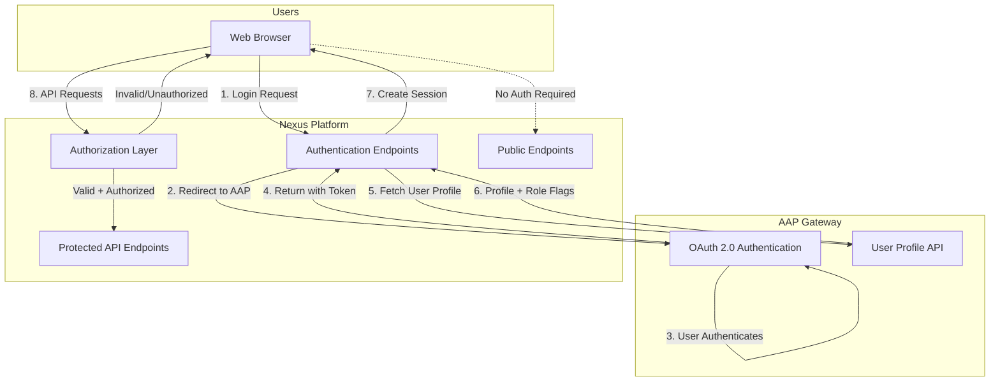
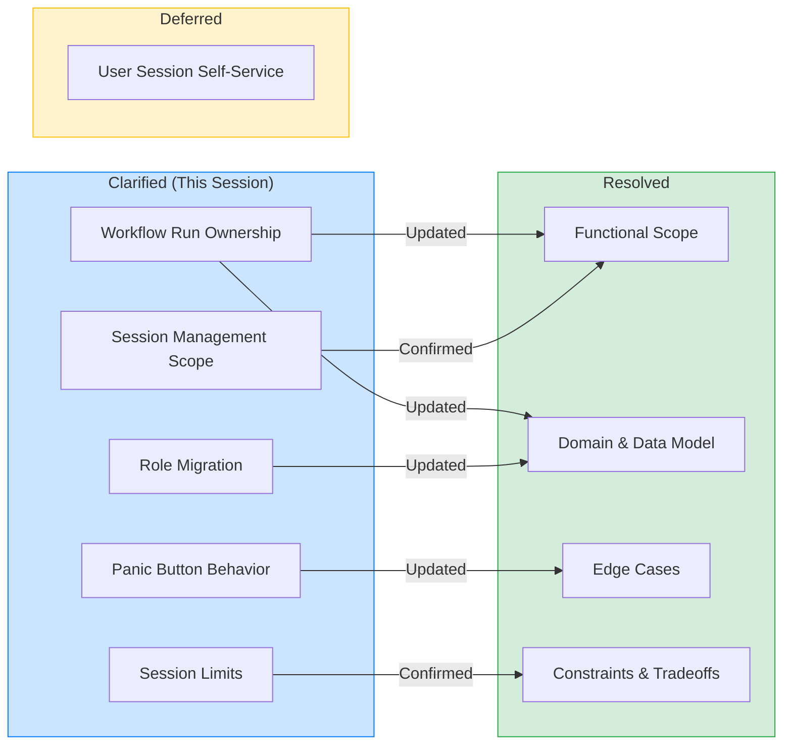

# Feature Specification: Authentication and Authorization

- **Feature Branch**: `028-authentication-and-authorization`
- **Created**: 2026-02-06
- **Status**: Draft
- **Input**: User description: "Create authentication and authorization for Nexus using AAP Gateway as the OAuth 2.0 provider, following the ANSTRAT-1844 proposal"

---

## Quick Guidelines
- Focus on WHAT users need and WHY
- Avoid HOW to implement (no tech stack, APIs, code structure)
- Written for business stakeholders, not developers

---

## User Scenarios & Testing

### Primary User Story
As a user of the Nexus platform, I want to authenticate using my AAP Gateway credentials so that I can access Nexus without creating separate login credentials, and my permissions are automatically determined by my AAP role.

### Acceptance Scenarios

1. **Given** a user with valid AAP Gateway credentials, **When** they click "Login" in Nexus and complete authentication via AAP Gateway, **Then** they are logged into Nexus with appropriate permissions based on their AAP role.
2. **Given** a logged-in user whose session has expired, **When** they attempt any action in Nexus, **Then** they see a dialog informing them their session expired and prompting them to log in again (no abrupt redirect).
3. **Given** a user with `is_superuser=true` in AAP, **When** they log into Nexus, **Then** they have full administrative access including user management.
4. **Given** a user with `is_auditor=true` in AAP, **When** they log into Nexus, **Then** they have read-only access to all resources including audit logs.
5. **Given** a regular user (no special flags) in AAP, **When** they log into Nexus, **Then** they can view all resources, create their own workflows, and edit/delete only resources they created.
6. **Given** a USER attempting to modify a workflow they did not create, **When** they submit the change, **Then** the system denies the request with a permission error.
7. **Given** an AUDITOR attempting to create or modify any resource, **When** they submit the action, **Then** the system denies the request with a permission error.
8. **Given** a logged-in user who clicks "Logout", **When** the logout completes, **Then** they are logged out from both Nexus and AAP Gateway.
9. **Given** a user whose role changed in AAP (e.g., promoted to admin), **When** they log into Nexus again, **Then** their new role is applied immediately.
10. **Given** a user with multiple browser tabs open and their session expires, **When** they attempt any action in any tab, **Then** each tab shows a login modal (no automatic redirect) allowing the user to re-authenticate without losing their current page context.

### Edge Cases
- What happens when AAP Gateway is unavailable during login? System shows an appropriate error message.
- What happens when AAP Gateway is unavailable during logout? Nexus clears local session and redirects to Nexus login page.
- What happens when a user is deleted in AAP but has an active Nexus session? Session continues until expiration (maximum 8 hours), then user cannot re-authenticate.
- What happens when an administrator needs to immediately revoke a user's access? Admin can revoke all sessions for that user, or use emergency global revocation for security incidents.

---

## Requirements

### Functional Requirements

#### Authentication
- **FR-001**: System MUST authenticate users via AAP Gateway's OAuth 2.0 flow (no separate Nexus credentials).
- **FR-002**: System MUST retrieve user profile information (username, email, full name) from AAP Gateway after authentication.
- **FR-002a**: System MUST create a new User record on first login if no existing user matches the AAP identity.
- **FR-002b**: System MUST ensure AAP user identifiers are unique; a new AAP user MUST NOT share an identifier with a previously soft-deleted Nexus user.
- **FR-003**: System MUST sync the user's role from AAP Gateway during their login (not background sync).
- **FR-004**: System MUST enforce maximum session length of 8 hours; users must re-authenticate after this period.
- **FR-005**: System MUST provide access tokens valid for 15 minutes that can be refreshed without user interaction until session expires.
- **FR-006**: System MUST provide a logout function that terminates both Nexus and AAP Gateway sessions.
- **FR-007**: System MUST log all authentication events (login success, login failure, logout, token refresh) for auditing, per [ANSTRAT-1740](ANSTRAT-1740) requirements.

#### Authorization
- **FR-008**: System MUST implement a deny-by-default authorization model where all endpoints require authentication unless explicitly marked as public.
- **FR-009**: System MUST enforce Role-Based Access Control (RBAC) with three roles: ADMIN, AUDITOR, and USER.
- **FR-010**: System MUST map AAP Gateway `is_superuser=true` to ADMIN role, `is_auditor=true` to AUDITOR role, and default to USER role. If both flags are set, ADMIN takes precedence.
- **FR-011**: ADMIN role MUST have full access to all resources, including user and system management.
- **FR-012**: AUDITOR role MUST have read-only access to all resources including authentication/authorization logs (no create/edit/delete).
- **FR-013**: USER role MUST have read access to all resources and workflow execution logs, but NOT authentication/authorization logs. USER can create/edit/delete/run only resources they own.
- **FR-013a**: Running a workflow is considered a write operation; USER can only run workflows they own; AUDITOR role MUST NOT be able to run workflows.
- **FR-014**: System MUST track resource ownership (who created each resource) for authorization decisions.
- **FR-015**: System MUST log all authorization failures (access denied events) for auditing, per [ANSTRAT-1740](ANSTRAT-1740) requirements.

#### Session Management
- **FR-016**: System MUST allow administrators to revoke all sessions for a specific user.
- **FR-016a**: (Future Enhancement) Users viewing and terminating their own sessions is out of scope for initial implementation.
- **FR-017**: System MUST provide an emergency "panic button" to revoke all active sessions platform-wide, including the caller's own session (admin must re-authenticate after).
- **FR-018**: System MUST detect and prevent refresh token reuse (potential token theft) by revoking all sessions for the affected user.
- **FR-019**: System MUST provide a 30-second grace period for token refresh to handle multi-tab race conditions.

#### User Experience
- **FR-020**: When session expires with multiple browser tabs open, system MUST show a modal dialog instead of auto-redirecting.
- **FR-021**: System MUST provide an endpoint for the frontend to retrieve current user information and role.
- **FR-022**: System MUST allow seamless re-authentication when AAP Gateway session is still active (no repeated consent screens).

#### Public Endpoints
- **FR-023**: System MUST allow unauthenticated access to health check and readiness probe endpoints.
- **FR-024**: System MUST allow unauthenticated access to the OAuth callback endpoint (user not yet authenticated at this stage).

#### Development Environment
- **FR-025**: System MUST provide a dev auth bypass mode (activated via `NEXUS_DEV_AUTH_MODE=true`) that replaces the OAuth2 flow with a configurable synthetic user, requiring no AAP Gateway.
- **FR-026**: In dev mode, system MUST support per-request role override via `X-Nexus-Dev-Role` header (`ADMIN`, `AUDITOR`, `USER`).
- **FR-027**: When dev mode is not active, the system MUST ignore all `NEXUS_DEV_*` environment variables and the `X-Nexus-Dev-Role` header entirely.

### Non-Functional Requirements

- **NFR-001**: Error messages MUST be user-friendly and MUST NOT expose internal system details or security-sensitive information.
- **NFR-002**: All authentication and authorization error responses (401, 403) MUST use [RFC 9457](https://datatracker.ietf.org/doc/rfc9457/) Problem Details format with auth-specific problem type URIs (not generic `validation_error`).

### Prerequisites

- **PRE-001**: The duplicate `HTTPException` handler in `src/nexus/api/main.py` (decorator override at lines 204-222) MUST be fixed before auth implementation. Currently, it overrides the RFC 9457-compliant handler registered at line 139, causing all `HTTPException` responses (including 401/403) to return plain JSON instead of RFC 9457 format. This is a pre-existing bug that affects the entire API, not just auth.

### Key Entities

- **User**: Represents a person who can log into Nexus. Linked to AAP Gateway identity. Has a role (ADMIN, AUDITOR, USER) and profile information (username, email). Created/updated during login.
- **Session**: Represents an active login for a user. Has expiration time and can be revoked. A user may have multiple sessions (multiple devices/browsers).
- **Resource Ownership**: All user-created resources track who created them. This enables "own resource" authorization checks.
- **Audit Event**: Records authentication and authorization events for security monitoring and compliance.

---

## Architecture Overview

---

## Role Permission Matrix

| Capability | ADMIN | AUDITOR | USER |
|-----------|:-----:|:-------:|:----:|
| View all resources | Yes | Yes | Yes |
| Create own resources | Yes | No | Yes |
| Edit/Delete own resources | Yes | No | Yes |
| Edit/Delete others' resources | Yes | No | No |
| Run own workflows | Yes | No | Own |
| View workflow execution logs | Yes | Yes | Yes |
| View authentication/authorization logs | Yes | Yes | No |
| Manage users/sessions | Yes | No | No |
| Emergency session revocation | Yes | No | No |

**Note on logs**: "Authentication/authorization logs" refers to system security events (login, logout, access denied). "Workflow execution logs" refers to workflow run history including who triggered each execution.

---

## Clarifications

### Session 2026-02-16
- Q: Can a USER run workflows created by other users, or only their own? → A: Own only (strict ownership for all write operations including run)
- Q: Should user self-service session endpoints be deferred or included? → A: Deferred (only admin session management in initial build)
- Q: Should the 'revoke all sessions' panic button include the caller's own session? → A: Yes, revoke ALL including the caller's (admin must re-authenticate)
- Q: Should there be a maximum number of concurrent sessions per user? → A: No limit for initial implementation
- Q: Confirm UserRole enum replacement (ADMIN, AUDITOR, USER)? → A: Confirmed; no data migration needed (no deployed database)

---

## Out of Scope

The following items are explicitly out of scope for this feature:

- **API Keys / Programmatic Access**: Long-lived tokens for automation and scripts (future enhancement)
- **Multi-tenancy**: Organization-based isolation (single AAP instance assumed)
- **WebHooks**: Authentication for incoming webhook requests to trigger workflows
- **Rate Limiting**: Will be handled at infrastructure layer by Installer team
- **Real-time Permission Sync**: Changes in AAP take effect on next login (up to 8 hours delay acceptable)
- **Background User Sync**: No periodic sync of all users from AAP

---

## Review & Acceptance Checklist

### Content Quality
- [x] No implementation details (languages, frameworks, APIs)
- [x] Focused on user value and business needs
- [x] Written for non-technical stakeholders
- [x] All mandatory sections completed

### Requirement Completeness
- [x] No [NEEDS CLARIFICATION] markers remain
- [x] Requirements are testable and unambiguous
- [x] Success criteria are measurable
- [x] Scope is clearly bounded
- [x] Dependencies and assumptions identified

---

## Dependencies and Assumptions

### Dependencies

- AAP Gateway must be available and configured with an OAuth 2.0 application for Nexus
- AAP Gateway provides user profile and role flags via its API
- Audit logging must align with [ANSTRAT-1740](ANSTRAT-1740) (Audits / Logging) requirements for accountability, immutability, and traceability

### Assumptions

- All AAP users can access Nexus (no access restrictions)
- AAP Gateway supports the `skip_authorization` flag for seamless re-authentication
- Maximum acceptable delay for role changes to take effect is 8 hours (until session expires)

---

## Future: Internal Call Impersonation and Role Propagation

**Context**: Nexus uses Temporal Workers to execute workflow activities. When an Agentic Activity Node in a workflow performs an internal API call (e.g., `POST /api/v1/invocations`), the call runs within the Temporal Worker context, which does not have access to the original user's JWT token. This means the authorization layer cannot identify or authorize the request on behalf of the user who initiated the workflow.

**Problem**: Without role propagation, internal calls from Temporal Workers would either:
- Fail with 401 (no credentials)
- Require a system-level service account that bypasses RBAC entirely (security risk)
- Lose traceability of which user initiated the action (ANSTRAT-1740 violation)

**Scope**: This is explicitly **out of scope** for the initial auth implementation. A separate spec/proposal will define the full delegation mechanism. However, this feature must prepare the entrypoint:

- **Stub function**: Implement a simple authorization function that receives a user ID and role as parameters and returns `true`. This function will serve as the entrypoint for the future delegation logic, allowing internal calls to be authorized without a JWT token.
- **Call sites**: Internal API calls from Temporal Workers (e.g., activity node executing `POST /api/v1/invocations`) must use this stub instead of requiring a Bearer token.
- **Traceability**: Even with the stub, the originating user ID must be propagated through the Temporal workflow context so that audit events (ANSTRAT-1740) can attribute the action to the correct user.

**Future proposal should address**:
- Secure role delegation mechanism (user → system)
- Scoped internal tokens or service-to-service auth
- Time-limited delegation with audit trail
- Prevention of privilege escalation through delegation

---

## Execution Status

- [x] User description parsed
- [x] Key concepts extracted
- [x] Ambiguities marked (none remaining)
- [x] User scenarios defined
- [x] Requirements generated
- [x] Entities identified
- [x] Review checklist passed
