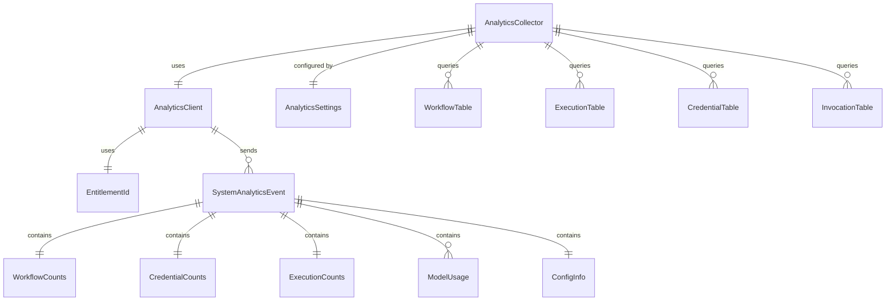

# Data Model: Segment Analytics Integration (Periodic Metrics)

**Feature**: 031-segment-analytics-integration
**Date**: 2026-02-12
**Scope**: Periodic/scheduled metrics collection only

## Overview

This document defines the data models for the Segment analytics integration via **periodic scheduled collection**.

**Periodic Aggregation** (sent at fixed intervals, every 5 minutes):
- A background task runs at a fixed interval (5 minutes)
- Queries the existing Nexus database for current-state aggregate counts
- Collects feature flag configuration
- Sends a single stateless `system_analytics` event to Segment.com

**Out of scope** (separate SDPs):
- Real-time workflow runtime events
- Real-time authentication/logout events
- Real-time API call events
- Container/system resource metrics (separate SDP)

## Entities

### 1. EntitlementId (external)

The `entitlement_id` is created during product registration and persisted to the database. This spec's analytics module **consumes** it as `userId` for all Segment events.

The analytics collector requires a valid `entitlement_id` to exist in the database. If it is not present (product not yet registered), analytics collection is skipped gracefully.

---

### 2. AnalyticsSettings (external)

Analytics configuration (enabled/disabled, Segment write key, collection interval) is defined externally. This spec's analytics module consumes these settings via dependency injection.

---

### 3. Aggregation Query Results

**Purpose**: Typed results from database aggregation queries. All events are **stateless snapshots** of the current database state.

**Definition**:
```python
# File: src/nexus/analytics/queries.py
from sqlmodel import SQLModel, Field


class WorkflowCounts(SQLModel):
    """Current workflow counts from database."""

    total: int = Field(default=0, description="Total workflows")
    enabled: int = Field(default=0, description="Enabled workflows")
    disabled: int = Field(default=0, description="Disabled workflows")


class ExecutionCounts(SQLModel):
    """Current execution counts from database."""

    total: int = Field(default=0, description="Total executions")
    completed: int = Field(default=0, description="Completed executions")
    failed: int = Field(default=0, description="Failed executions")
    cancelled: int = Field(default=0, description="Cancelled executions")
    running: int = Field(default=0, description="Currently running executions")
    avg_duration_seconds: float = Field(
        default=0.0,
        description="Average execution duration in seconds"
    )


class ModelUsage(SQLModel):
    """Aggregated model usage from database."""

    model_name: str = Field(..., description="Model name (e.g., 'gpt-4')")
    call_count: int = Field(default=0, description="Number of calls")
    input_tokens: int = Field(default=0, description="Total input tokens")
    output_tokens: int = Field(default=0, description="Total output tokens")
    success_count: int = Field(default=0, description="Successful calls")
    error_count: int = Field(default=0, description="Failed calls")


class CredentialCounts(SQLModel):
    """Aggregated credential counts from database."""

    total: int = Field(default=0, description="Total number of credentials configured")


class ConfigInfo(SQLModel):
    """Configuration information for analytics."""

    feature_flags_enabled: list[str] = Field(
        default_factory=list,
        description="List of enabled feature flags"
    )
```

---

### 4. Analytics Event (system_analytics)

**Purpose**: The single stateless event sent to Segment at each collection interval. Each event is a self-contained snapshot of current database state.

**Definition**:
```python
# File: src/nexus/analytics/events.py
from typing import Any

from pydantic import Field
from sqlmodel import SQLModel


class SystemAnalyticsEvent(SQLModel):
    """Stateless system analytics event sent to Segment.

    Each event is a self-contained snapshot of current DB state.
    No delta tracking or "since last report" logic.
    Timestamp is set automatically by the Segment SDK.
    """

    entitlement_id: str = Field(..., description="Installation identifier")

    # Current-state counts from database
    workflows: WorkflowCounts = Field(..., description="Workflow aggregates")
    credentials: CredentialCounts = Field(..., description="Credential aggregates")
    executions: ExecutionCounts = Field(..., description="Execution aggregates")
    model_usage: list[ModelUsage] = Field(default_factory=list, description="Model usage by model")

    # Configuration
    config: ConfigInfo = Field(..., description="Configuration info (feature flags)")

    def to_segment_payload(self) -> dict[str, Any]:
        """Convert to Segment track() payload format."""
        return {
            "userId": self.entitlement_id,
            "event": "system_analytics",
            "properties": {
                "entitlement_id": self.entitlement_id,
                "workflows": self.workflows.model_dump(),
                "credentials": self.credentials.model_dump(),
                "executions": self.executions.model_dump(),
                "model_usage": {m.model_name: m.model_dump(exclude={"model_name"}) for m in self.model_usage},
                "config": self.config.model_dump(),
            },
        }
```

---

### 5. AnalyticsClient

**Purpose**: Thin wrapper around Segment Python SDK for event emission. Supports both real-time events and periodic system analytics events.

**Definition**:
```python
# File: src/nexus/analytics/client.py
from typing import Any

import analytics
import structlog


logger = structlog.get_logger(__name__)


class AnalyticsClient:
    """Segment analytics client wrapper.

    Provides fire-and-forget event emission with graceful error handling.
    Supports both real-time events (track method) and periodic aggregations.
    Timestamp is set automatically by the Segment SDK.
    """

    def __init__(
        self,
        settings,  # AnalyticsSettings (external)
        entitlement_id: str,
    ):
        self._settings = settings
        self._entitlement_id = entitlement_id
        self._initialized = False

        if settings.analytics_enabled and settings.analytics_segment_write_key:
            analytics.write_key = settings.analytics_segment_write_key
            self._initialized = True
            logger.info("analytics_client_initialized")
        else:
            logger.info("analytics_client_disabled", reason="no write key or analytics disabled")

    @property
    def entitlement_id(self) -> str:
        """Get the installation entitlement ID."""
        return self._entitlement_id

    def track(self, event_name: str, properties: dict[str, Any]) -> None:
        """Send a real-time analytics event to Segment.

        Used for: workflow_started, workflow_ended, activity_executed,
                  workflow_copied, authentication, logout, api_call

        Fire-and-forget: failures are logged but don't raise exceptions.
        """
        if not self._initialized:
            return

        try:
            analytics.track(
                user_id=self._entitlement_id,
                event=event_name,
                properties={
                    "entitlement_id": self._entitlement_id,
                    **properties,
                },
            )
        except Exception as error:
            logger.warning("analytics_event_failed", event=event_name, error=str(error))

    def track_system_analytics(self, event: "SystemAnalyticsEvent") -> None:
        """Send periodic system analytics event to Segment.

        Used by AnalyticsCollector for aggregated periodic metrics.
        """
        if not self._initialized:
            return

        try:
            payload = event.to_segment_payload()
            analytics.track(
                user_id=payload["userId"],
                event=payload["event"],
                properties=payload["properties"],
            )
        except Exception as error:
            logger.warning("system_analytics_event_failed", error=str(error))

    def flush(self) -> None:
        """Flush pending events to Segment (for graceful shutdown)."""
        if self._initialized:
            analytics.flush()
```

---

### 6. AnalyticsCollector

**Purpose**: Background task that periodically collects and sends stateless analytics snapshots.

**Resilience**: The collector is deliberately not fault-tolerant beyond its internal `try/except`. If it crashes, the exception is logged and the loop continues on the next interval. In multi-Pod deployments, each Pod runs its own collector (duplicate events accepted). See spec.md "Resilience / Fault Tolerance" for full rationale.

**Definition**:
```python
# File: src/nexus/analytics/collector.py
import asyncio

import structlog

from nexus.analytics.client import AnalyticsClient
from nexus.analytics.events import SystemAnalyticsEvent
from nexus.analytics.queries import (
    query_workflow_counts,
    query_credential_counts,
    query_execution_counts,
    query_model_usage,
    get_enabled_feature_flags,
    ConfigInfo,
)


logger = structlog.get_logger(__name__)


class AnalyticsCollector:
    """Background task that periodically snapshots DB state and sends to Segment.

    Events are stateless -- each event is a self-contained snapshot of the
    current database state. No delta tracking or "since last report" logic.
    """

    def __init__(
        self,
        client: AnalyticsClient,
        session_factory,  # Callable that returns AsyncSession
        settings: AnalyticsSettings,
    ):
        self._client = client
        self._session_factory = session_factory
        self._settings = settings
        self._task: asyncio.Task | None = None

    async def start(self) -> None:
        """Start the background collection task."""
        if not self._settings.analytics_enabled:
            logger.info("analytics_collection_disabled")
            return
        self._task = asyncio.create_task(self._collection_loop())
        logger.info(
            "analytics_collector_started",
            interval_seconds=self._settings.ANALYTICS_COLLECTION_INTERVAL_SECONDS,
        )

    async def stop(self) -> None:
        """Stop the background task gracefully."""
        if self._task:
            self._task.cancel()
            try:
                await self._task
            except asyncio.CancelledError:
                pass
            self._client.flush()
            logger.info("analytics_collector_stopped")

    async def _collection_loop(self) -> None:
        """Main collection loop."""
        while True:
            try:
                await asyncio.sleep(self._settings.ANALYTICS_COLLECTION_INTERVAL_SECONDS)
                await self._collect_and_send()
            except asyncio.CancelledError:
                raise
            except Exception as error:
                logger.warning("analytics_collection_error", error=str(error))

    async def _collect_and_send(self) -> None:
        """Snapshot current DB state and send to Segment."""
        try:
            async with self._session_factory() as session:
                workflow_counts = await query_workflow_counts(session)
                execution_counts = await query_execution_counts(session)
                model_usage = await query_model_usage(session)
                credential_counts = await query_credential_counts(session)

            feature_flags = get_enabled_feature_flags()

            event = SystemAnalyticsEvent(
                entitlement_id=self._client.entitlement_id,
                workflows=workflow_counts,
                credentials=credential_counts,
                executions=execution_counts,
                model_usage=model_usage,
                config=ConfigInfo(feature_flags_enabled=feature_flags),
            )

            self._client.track_system_analytics(event)
            logger.debug("analytics_event_sent")
        except Exception as error:
            logger.warning("analytics_collection_failed", error=str(error))
```

---

## Database Queries

The analytics collector queries existing Nexus tables. These queries should be **read-only** and **non-locking**. All queries return **current-state snapshots** with no time-based filtering.

### Workflow Counts Query

```python
# File: src/nexus/analytics/queries.py
from sqlalchemy import select, func
from sqlalchemy.ext.asyncio import AsyncSession

from nexus.workflows.models import Workflow  # Existing model


async def query_workflow_counts(session: AsyncSession) -> WorkflowCounts:
    """Query current workflow counts from database."""

    total = await session.scalar(select(func.count(Workflow.id)))
    enabled = await session.scalar(
        select(func.count(Workflow.id)).where(Workflow.enabled == True)
    )

    return WorkflowCounts(
        total=total or 0,
        enabled=enabled or 0,
        disabled=(total or 0) - (enabled or 0),
    )
```

### Execution Counts Query

```python
async def query_execution_counts(session: AsyncSession) -> ExecutionCounts:
    """Query current execution counts from database."""
    from nexus.workflows.models import Execution  # Existing model

    # Total counts by status
    result = await session.execute(
        select(Execution.status, func.count(Execution.id))
        .group_by(Execution.status)
    )
    status_counts = {row[0]: row[1] for row in result}

    # Average duration (calculated from completed_at - created_at)
    avg_duration = await session.scalar(
        select(
            func.avg(
                func.extract("epoch", Execution.completed_at - Execution.created_at)
            )
        ).where(Execution.completed_at.isnot(None))
    )

    return ExecutionCounts(
        total=sum(status_counts.values()),
        completed=status_counts.get("completed", 0),
        failed=status_counts.get("failed", 0),
        cancelled=status_counts.get("cancelled", 0),
        running=status_counts.get("running", 0),
        avg_duration_seconds=float(avg_duration) if avg_duration is not None else 0.0,
    )
```

---

## Relationships



---

## Privacy Summary

### Data Collected (Current-State Snapshots Only)

| Category | Data | Example |
|----------|------|---------|
| Workflows | Counts by status | `{"total": 150, "enabled": 120}` |
| Credentials | Total count | `{"total": 25}` |
| Executions | Counts by status, avg duration | `{"completed": 40, "avg_duration_seconds": 125.3}` |
| Models | Call counts, token counts by model | `{"gpt-4": {"calls": 100, "tokens": 50000}}` |
| Config | Enabled feature flags | `{"feature_flags_enabled": ["agent_v2"]}` |

### Data NOT Collected

- User identifiers, names, emails
- Workflow definitions, inputs, outputs
- Prompt content, response content
- Credentials, tokens, secrets
- Individual record details (only aggregates)

---

## Next Steps

1. Consume existing `EntitlementId` and `AnalyticsSettings`
2. Implement `AnalyticsClient` with Segment SDK
3. Implement stateless database aggregation queries
4. Implement `AnalyticsCollector` background task
5. Integrate with FastAPI lifespan events
