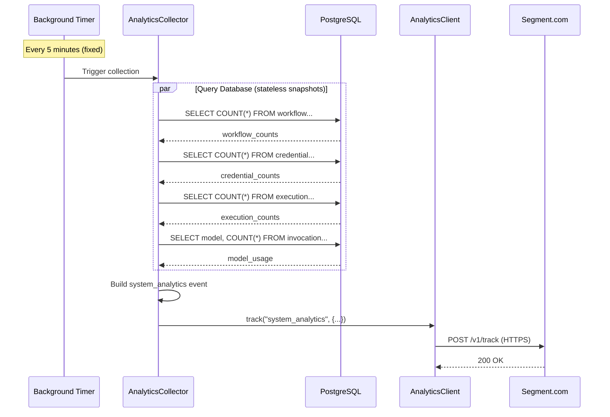
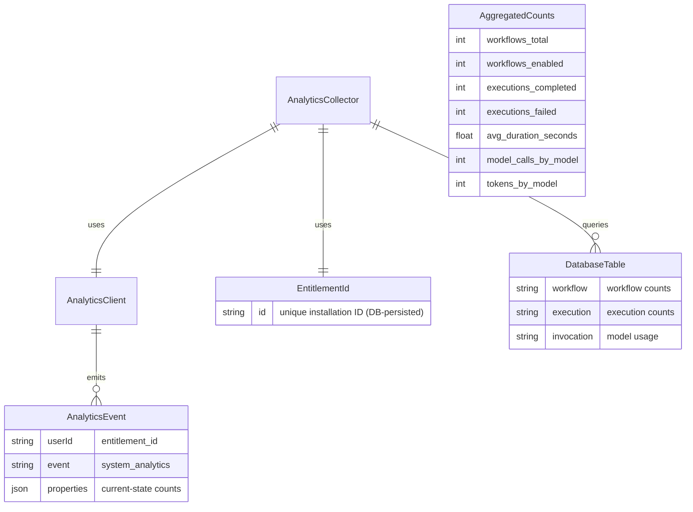

# Implementation Plan: Segment Analytics Integration (Periodic Metrics)

**Branch**: `031-segment-analytics-integration`
**Date**: 2026-02-12
**Spec**: [spec.md](./spec.md)
**Scope**: Periodic/scheduled metrics collection only
**Input**: SDP ANSTRAT-1748 - Agentic Automation - Instrumentation / Telemetry / Observability

## Summary

Integrate Segment.com analytics into Nexus to collect anonymized usage metrics for product insights via **periodic scheduled collection**.

**This spec covers**:
- Core analytics infrastructure (AnalyticsClient, AnalyticsCollector)
- Consuming existing `EntitlementId` and `AnalyticsSettings`
- Periodic database aggregation (workflow counts, credential counts, execution counts, model usage)
- Feature flag status collection

**Out of scope** (separate SDPs):
- Real-time workflow runtime events
- Real-time authentication/logout events
- Real-time API call events
- Container/system resource metrics (separate SDP)

## Architecture

### High-Level Architecture

```
┌─────────────────────────────────────────────────────────────────────────────┐
│                              NEXUS PLATFORM                                  │
│                                                                              │
│  ┌────────────────────────────────────────────────────────────────────────┐ │
│  │  PostgreSQL Database                                                    │ │
│  │  ┌───────────┐  ┌───────────┐  ┌────────────┐  ┌───────────┐          │ │
│  │  │ workflow  │  │ execution │  │ credential │  │invocation │          │ │
│  │  │   table   │  │   table   │  │   table    │  │   table   │          │ │
│  │  └─────┬─────┘  └─────┬─────┘  └─────┬──────┘  └─────┬─────┘          │ │
│  │        │              │              │               │                 │ │
│  │        └──────────────┴──────────────┴───────────────┘                 │ │
│  │                              │                                          │ │
│  └──────────────────────────────┼──────────────────────────────────────────┘ │
│                                 │ SQL queries                                │
│                                 ▼ (every 5 min)                              │
│                    ┌──────────────────────────────┐                          │
│                    │    AnalyticsCollector        │                          │
│                    │   (asyncio background task)  │                          │
│                    │  - Snapshot current DB state  │                          │
│                    │  - Build system_analytics    │                          │
│                    └──────────────┬───────────────┘                          │
│                                   │                                          │
│                                   ▼                                          │
│                    ┌──────────────────────────────┐                          │
│                    │       AnalyticsClient        │                          │
│                    │     (Segment SDK Wrapper)    │                          │
│                    │   - track() system_analytics │                          │
│                    │   - async, fire-and-forget   │                          │
│                    └──────────────┬───────────────┘                          │
│                                   │                                          │
└───────────────────────────────────┼──────────────────────────────────────────┘
                                    │ HTTPS POST (async, batched)
                                    ▼
┌──────────────────────────────────────────────────────────────────────────────┐
│                              SEGMENT.COM                                      │
│                    ┌──────────────────────────────┐                          │
│                    │     Dedicated Account        │                          │
│                    │   (Higher Rate Limits)       │                          │
│                    └──────────────────────────────┘                          │
│                                   │                                          │
│                         Periodic Aggregates                                  │
│                    (system_analytics event every 5 min)                      │
└──────────────────────────────────────────────────────────────────────────────┘
```

### Periodic Aggregation Flow



### Data Model



### Example Event: `system_analytics`

The single stateless event sent at each collection interval (every 5 minutes):
```json
{
  "userId": "entitlement-abc123",
  "event": "system_analytics",
  "properties": {
    "entitlement_id": "entitlement-abc123",
    "workflows": {
      "total": 150,
      "enabled": 120,
      "disabled": 30
    },
    "credentials": {
      "total": 25
    },
    "executions": {
      "total": 245,
      "completed": 200,
      "failed": 35,
      "cancelled": 7,
      "running": 3,
      "avg_duration_seconds": 125.3
    },
    "model_usage": {
      "gpt-4": {"calls": 120, "input_tokens": 50000, "output_tokens": 15000},
      "gpt-3.5-turbo": {"calls": 80, "input_tokens": 20000, "output_tokens": 8000}
    },
    "config": {
      "feature_flags_enabled": ["agent_v2", "streaming_responses", "mcp_tools"]
    }
  }
}
```

## Technical Context

- **Language/Version**: Python 3.12+
- **Primary Dependency**: segment-analytics-python (official Segment SDK)
- **Data Source**: PostgreSQL database (existing tables)
- **Storage**: EntitlementId persisted to database; no other analytics storage
- **Testing**: pytest with mocked Segment SDK and test database
- **Overhead Target**: Minimal - only periodic background task
- **Collection Interval**: Fixed at 5 minutes (internal constant)

### Alignment with Nexus Architecture Decisions

| Decision | Alignment |
|----------|-----------|
| FastAPI | Background task integrated via FastAPI lifespan events |
| SQLModel | Uses existing SQLModel tables for queries |
| PostgreSQL | Queries existing workflow/execution/invocation tables; stores EntitlementId |
| structlog | Analytics errors logged via structlog |
| Temporal | NOT used - simple asyncio background task is sufficient |

## Project Structure

### Source Code Changes

```
src/nexus/
├── core/
│   └── config/
│       └── base.py                  # AnalyticsSettings (existing)
├── analytics/                       # NEW: Analytics subsystem
│   ├── __init__.py
│   ├── client.py                    # AnalyticsClient (Segment SDK wrapper)
│   ├── collector.py                 # AnalyticsCollector (periodic background task)
│   ├── queries.py                   # Database aggregation queries
└── api/
    └── main.py                      # ADD: Start analytics collector on lifespan
                                     # ADD: AnalyticsClient as FastAPI dependency

tests/
├── unit/
│   └── analytics/
│       ├── test_client.py           # AnalyticsClient tests
│       ├── test_collector.py        # AnalyticsCollector tests
│       ├── test_queries.py          # Database query tests
└── integration/
    └── analytics/
        └── test_periodic_flow.py    # End-to-end periodic collection tests
```

### Code Changes Required

This spec focuses on **periodic collection only** - no modifications to existing services:
- **NEW**: `analytics/` module with collector, queries, client
- **CONSUME**: Existing `EntitlementId` and `AnalyticsSettings`
- **MODIFY**: `api/main.py` to start collector on FastAPI lifespan

**Note**: Real-time event integration (workflow engine, auth service, API middleware) and container/system resource metrics are covered in separate SDPs.

## API Contracts

### No External API

Analytics events are sent TO Segment.com, not exposed as a Nexus API. The Segment SDK handles all HTTP communication.

## Phase 2: Task Planning Approach

### Part 1: Core Analytics Infrastructure (7 points)

**Ticket 1: Analytics Configuration and Entitlement** - 1 point
- Consume existing `EntitlementId` and `AnalyticsSettings`
- Verify integration with existing configuration and entitlement infrastructure
- Unit tests for configuration consumption

**Ticket 2: AnalyticsClient Implementation** - 4 points
- Implement `AnalyticsClient` wrapper around Segment SDK
- Initialize with `AnalyticsSettings` and `entitlement_id`
- Implement `track(event_name, properties)` method
- Implement graceful error handling (fire-and-forget)
- Make available via FastAPI dependency injection
- Unit tests with mocked Segment SDK

### Part 2: Periodic Aggregation (12 points)

**Ticket 3: Database Aggregation Queries** - 6 points
- Query workflow table for current counts (total, enabled, disabled)
- Query credential table for total credential count
- Query execution table for counts by status, avg duration (float)
- Query invocation table for model usage (calls, tokens by model)
- Query feature flag configuration for enabled flags
- All queries are stateless snapshots (no "since last report" tracking)
- Unit tests with test database

**Ticket 4: AnalyticsCollector Background Task** - 4 points
- Implement `AnalyticsCollector` as asyncio background task
- Integrate with FastAPI lifespan events (start/stop)
- Run at fixed interval (5 minutes, internal constant)
- Combine DB snapshots + config into single `system_analytics` event
- No local data persistence (Segment SDK handles buffering)
- Integration tests

**Ticket 5: Error Handling and Graceful Shutdown** - 2 points
- Handle shutdown gracefully (flush pending events)
- Log errors without impacting platform (fire-and-forget)
- Rely on database-level timeouts for query protection
- Integration tests

### Part 3: Documentation (2 points)

**Ticket 6: Documentation** - 2 points
- Update README with analytics documentation
- Document data collection policy (what is/isn't collected)
- Create quickstart validation tests
- Privacy compliance checklist

**Total: 19 story points** across 6 tickets

### Task Dependencies

```
EntitlementId + AnalyticsSettings (existing)
    │
    └──► Ticket 1 (Consume Config/Entitlement)
              │
              ├──► Ticket 2 (AnalyticsClient)
              │         │
              │         └──► Ticket 4 (AnalyticsCollector) ◄────┐
              │                    │                            │
              │                    └──► Ticket 5 (Error Handling)
              │                                                 │
              └──► Ticket 3 (DB Aggregation Queries) ──────────┘

Ticket 4 + Ticket 5
    │
    └──► Ticket 6 (Documentation)
```

### Example Implementation: AnalyticsCollector

```python
# src/nexus/analytics/collector.py
import asyncio

import structlog

logger = structlog.get_logger(__name__)

class AnalyticsCollector:
    """Background task that periodically snapshots DB state and sends to Segment."""

    def __init__(
        self,
        client: AnalyticsClient,
        session_factory,
        settings: AnalyticsSettings,
    ):
        self._client = client
        self._session_factory = session_factory
        self._settings = settings
        self._task: asyncio.Task | None = None

    async def start(self) -> None:
        """Start the background collection task."""
        self._task = asyncio.create_task(self._collection_loop())

    async def stop(self) -> None:
        """Stop the background task gracefully."""
        if self._task:
            self._task.cancel()
            self._client.flush()

    async def _collection_loop(self) -> None:
        """Main collection loop."""
        while True:
            await asyncio.sleep(self._settings.ANALYTICS_COLLECTION_INTERVAL_SECONDS)
            await self._collect_and_send()

    async def _collect_and_send(self) -> None:
        """Snapshot current DB state and send to Segment."""
        try:
            async with self._session_factory() as session:
                workflow_counts = await query_workflow_counts(session)
                credential_counts = await query_credential_counts(session)
                execution_counts = await query_execution_counts(session)
                model_usage = await query_model_usage(session)

            feature_flags = get_enabled_feature_flags()

            self._client.track("system_analytics", {
                "workflows": workflow_counts.model_dump(),
                "credentials": credential_counts.model_dump(),
                "executions": execution_counts.model_dump(),
                "model_usage": model_usage,
                "config": {"feature_flags_enabled": feature_flags},
            })

        except Exception as error:
            logger.warning("analytics_collection_failed", error=str(error))
```

## Constitution Check
*GATE: Must pass before Phase 0 research. Re-check after Phase 1 design.*

### Core Principles

- **I. Modular Architecture**: PASS - Analytics is a standalone module under `src/nexus/analytics/` with clear boundaries, no hidden dependencies, and well-defined interfaces (AnalyticsClient, AnalyticsCollector, queries). Follows `/src/nexus/<component>` convention.
- **II. Test-Driven Development**: PASS - tasks.md enforces TDD ordering: Phase 3.2 (tests) MUST complete before Phase 3.3 (implementation). Red-Green-Refactor cycle mandated.
- **III. Explicit Configuration**: PASS - `analytics_enabled` and `analytics_segment_write_key` are explicit, environment-injected settings. Collection interval and query timeout are named constants (`ANALYTICS_COLLECTION_INTERVAL_SECONDS`, `ANALYTICS_QUERY_TIMEOUT_SECONDS`) -- deliberately non-configurable to keep all installations uniform and simplify data interpretation.
- **IV. Observability First**: PASS - All components use structlog for structured logging. Debug-level event emission, warning-level error logging. Log levels configurable without code changes.
- **V. API Stability**: N/A - No external API exposed. Events are sent TO Segment, not exposed as a Nexus endpoint. AnalyticsClient internal API is clearly marked.

### Technology Standards Compliance
- [x] **SQLModel for Data Models**: EntitlementId uses `SQLModel, table=True`. All query result models (WorkflowCounts, ExecutionCounts, etc.) use SQLModel.

### Code Architecture Compliance
- [x] **DRY Principle**: Reusable AnalyticsClient for both periodic and future real-time events. Query functions return shared typed models.
- [x] **SOLID Principles**: Single responsibility per class (Client wraps SDK, Collector orchestrates, queries handle data access). Open for extension (new event types can reuse AnalyticsClient).
- [x] **Separation of Concerns**: Clear layers -- queries (data access), events (data model), client (SDK wrapper), collector (orchestration).
- [x] **Dependency Injection**: AnalyticsClient and AnalyticsCollector accept dependencies via constructors (settings, entitlement, session_factory).
- [x] **Composition vs Inheritance**: AnalyticsCollector composes AnalyticsClient (has-a), no inheritance hierarchies.

### API Specification Standards Compliance
N/A - This feature does not introduce any external REST or WebSocket APIs. Analytics events are sent TO Segment.com via the official SDK, not exposed as Nexus endpoints.

### Code Quality
- [x] Type hints throughout all modules
- [x] Coverage target: 90% minimum per constitution
- [x] Integration tests for collector and periodic flow
- [x] Unit tests for all components (client, queries, events, entitlement)

### Documentation Standards
- [x] All classes have docstrings describing purpose and responsibilities
- [x] All public methods documented with descriptions
- [x] README update planned (tasks.md T022)

## Complexity Tracking
*Fill ONLY if Constitution Check has violations that must be justified*

| Violation | Why Needed | Simpler Alternative Rejected Because |
|-----------|------------|--------------------------------------|
| Internal constants (interval/timeout) not user-configurable | Keep all installations uniform for consistent data interpretation | Configurable settings rejected per reviewer feedback -- varying intervals across installations would make aggregate analytics data unreliable |

## Progress Tracking

**Phase Status**:
- [x] Phase 0: Research complete (SDP ANSTRAT-1748 analyzed)
- [x] Phase 1: Design complete (spec.md, plan.md created)
- [x] Phase 2: Task planning complete (tasks.md created)
- [x] Phase 3: Tasks generated
- [ ] Phase 4: Implementation complete
- [ ] Phase 5: Validation passed

**Gate Status**:
- [x] Initial Constitution Check: PASS
- [x] SDP alignment verified
- [x] Periodic aggregation approach validated
- [x] Post-Design Constitution Check: PASS

---

*SDP Reference: ANSTRAT-1748 - Agentic Automation - Analytics Events Integration with Segment*
*Related MCP Telemetry: 0091-AAP-MCP-Server-Telemetry-Integration-with-Segment*
