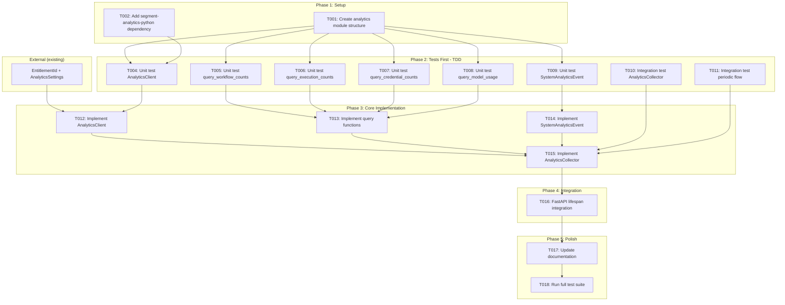

# Tasks: Segment Analytics Integration (Periodic Metrics)

**Input**: Design documents from `/specs/031-segment-analytics-integration/`
**Prerequisites**: plan.md, data-model.md, research.md, quickstart.md

## Execution Flow (main)
```
1. Load plan.md from feature directory
   → ✅ Tech stack: Python 3.12, FastAPI, SQLModel, segment-analytics-python
   → ✅ Structure: src/nexus/analytics/ (new module), src/nexus/core/config/base.py
2. Load optional design documents:
   → ✅ data-model.md: query result models, events, client, collector
   → ✅ research.md: Segment SDK, periodic DB aggregation, fire-and-forget pattern
   → ✅ quickstart.md: 7 validation scenarios
3. Generate tasks by category:
   → ✅ Setup: module structure, dependencies
   → ✅ Tests: unit tests, integration tests (TDD)
   → ✅ Core: AnalyticsClient, queries, collector
   → ✅ Integration: FastAPI lifespan
   → ✅ Polish: documentation, full test suite
4. Apply task rules:
   → ✅ Different files = mark [P] for parallel
   → ✅ Same file = sequential (no [P])
   → ✅ Tests before implementation (TDD)
5. Number tasks sequentially (T001, T002...)
6. Generate dependency graph
7. Create parallel execution examples
8. Validate task completeness:
   → ✅ All entities have tests?
   → ✅ All models have tasks?
   → ✅ All queries tested?
9. Return: SUCCESS (tasks ready for execution)
```

## Format: `[ID] [P?] Description`
- **[P]**: Can run in parallel (different files, no dependencies)
- Include exact file paths in descriptions

## Path Conventions
- **Project type**: Single project (analytics subsystem)
- **Paths**: `src/nexus/analytics/`, `src/nexus/core/config/`, `tests/`

## Task Dependency Workflow



## Phase 3.1: Setup

- [ ] **T001** Create analytics module structure
  - Files:
    - `src/nexus/analytics/__init__.py`
    - `src/nexus/analytics/client.py`
    - `src/nexus/analytics/collector.py`
    - `src/nexus/analytics/queries.py`
    - `src/nexus/analytics/events.py`
    - `tests/unit/analytics/__init__.py`
    - `tests/integration/analytics/__init__.py`
  - Verification: Directory structure exists, empty modules importable

- [ ] **T002** Add segment-analytics-python dependency
  - File: `pyproject.toml`
  - Add `segment-analytics-python` to project dependencies
  - Run `uv sync` to install
  - Verification: `import analytics` works

---

## Phase 3.2: Tests First (TDD) ⚠️ MUST COMPLETE BEFORE 3.3
**CRITICAL: These tests MUST be written and MUST FAIL before ANY implementation**

> **Note**: EntitlementId and AnalyticsSettings are defined and tested externally.
> This spec's tests focus on consuming those entities, not defining them.

### Unit Tests (can run in parallel)

- [ ] **T004** [P] Unit test AnalyticsClient
  - File: `tests/unit/analytics/test_client.py`
  - Test cases:
    - `test_client_initializes_with_write_key()` - SDK configured when key provided
    - `test_client_skips_init_without_write_key()` - no SDK setup without key
    - `test_client_track_sends_event()` - track() calls Segment SDK with `user_id` (mocked)
    - `test_client_track_includes_entitlement_id()` - `userId` set correctly
    - `test_client_track_handles_sdk_error()` - logs warning, doesn't raise
    - `test_client_track_system_analytics()` - converts event to payload correctly
    - `test_client_flush()` - calls SDK flush
    - `test_client_noop_when_disabled()` - track() is no-op when not initialized
  - Imports: `from nexus.analytics.client import AnalyticsClient`
  - **Expected**: All tests FAIL (AnalyticsClient not implemented yet)

- [ ] **T005** [P] Unit test query_workflow_counts
  - File: `tests/unit/analytics/test_queries.py`
  - Test cases:
    - `test_query_workflow_counts_all()` - returns total, enabled, disabled
    - `test_query_workflow_counts_empty()` - returns zeros for empty table
    - `test_query_workflow_counts_only_enabled()` - correct when all enabled
    - `test_query_workflow_counts_only_disabled()` - correct when all disabled
  - Imports: `from nexus.analytics.queries import query_workflow_counts`
  - **Expected**: All tests FAIL (query not implemented yet)

- [ ] **T006** [P] Unit test query_execution_counts
  - File: `tests/unit/analytics/test_queries.py`
  - Test cases:
    - `test_query_execution_counts_by_status()` - correct counts per status
    - `test_query_execution_counts_avg_duration()` - returns float avg duration
    - `test_query_execution_counts_empty()` - returns zeros, avg_duration=0.0
    - `test_query_execution_counts_running()` - running count accurate
  - Imports: `from nexus.analytics.queries import query_execution_counts`
  - **Expected**: All tests FAIL (query not implemented yet)

- [ ] **T007** [P] Unit test query_credential_counts
  - File: `tests/unit/analytics/test_queries.py`
  - Test cases:
    - `test_query_credential_counts_total()` - returns total count
    - `test_query_credential_counts_empty()` - returns zero for empty table
  - Imports: `from nexus.analytics.queries import query_credential_counts`
  - **Expected**: All tests FAIL (query not implemented yet)

- [ ] **T008** [P] Unit test query_model_usage
  - File: `tests/unit/analytics/test_queries.py`
  - Test cases:
    - `test_query_model_usage_aggregates_by_model()` - groups by model name
    - `test_query_model_usage_token_counts()` - sums input/output tokens
    - `test_query_model_usage_empty()` - returns empty list for no invocations
  - Imports: `from nexus.analytics.queries import query_model_usage`
  - **Expected**: All tests FAIL (query not implemented yet)

- [ ] **T009** [P] Unit test SystemAnalyticsEvent
  - File: `tests/unit/analytics/test_events.py`
  - Test cases:
    - `test_system_analytics_event_to_segment_payload()` - correct payload structure
    - `test_system_analytics_event_user_id()` - `userId` = entitlement_id
    - `test_system_analytics_event_no_timestamp()` - no timestamp in payload (SDK handles it)
    - `test_system_analytics_event_no_pii()` - payload contains no PII fields
    - `test_system_analytics_event_stateless()` - no "since_last" or delta fields
  - Imports: `from nexus.analytics.events import SystemAnalyticsEvent`
  - **Expected**: All tests FAIL (event model not implemented yet)

### Integration Tests

- [ ] **T010** [P] Integration test AnalyticsCollector
  - File: `tests/integration/analytics/test_collector.py`
  - Test cases:
    - `test_collector_starts_when_enabled()` - background task created
    - `test_collector_skips_when_disabled()` - no task when disabled
    - `test_collector_sends_stateless_event()` - event is current-state snapshot
    - `test_collector_continues_after_error()` - loop survives exceptions
    - `test_collector_graceful_shutdown()` - task cancelled, events flushed
  - **Expected**: All tests FAIL (collector not implemented yet)

- [ ] **T011** [P] Integration test periodic flow end-to-end
  - File: `tests/integration/analytics/test_periodic_flow.py`
  - Test cases:
    - `test_periodic_flow_queries_all_sources()` - all query functions called
    - `test_periodic_flow_builds_complete_event()` - event has all sections
    - `test_periodic_flow_sends_to_segment()` - Segment SDK track() called with `user_id` (mocked)
    - `test_periodic_flow_no_state_between_cycles()` - no delta tracking
  - **Expected**: All tests FAIL (full flow not wired yet)

---

## Phase 3.3: Core Implementation (ONLY after tests are failing)
**Architecture Reminders**:
- Apply DRY principle - extract reusable functions/classes
- Follow SOLID principles - single responsibility per class
- Use dependency injection - inject dependencies via constructors
- Prefer composition over inheritance
- Maintain clear separation of concerns
- **Use SQLModel for all data models** - unified models for database tables and API schemas

### Client and Events

- [ ] **T012** Implement AnalyticsClient
  - File: `src/nexus/analytics/client.py`
  - Implementation (from data-model.md):
    - Constructor takes `AnalyticsSettings` and `entitlement_id: str`
    - `track()` method with fire-and-forget error handling, uses `user_id`
    - `track_system_analytics()` method for periodic events
    - `flush()` method for graceful shutdown
  - Dependencies: EntitlementId + AnalyticsSettings (existing)
  - Verification: Run `tests/unit/analytics/test_client.py` - T004 tests PASS

- [ ] **T013** [P] Implement database aggregation query functions
  - File: `src/nexus/analytics/queries.py`
  - Implementation (from data-model.md):
    - `query_workflow_counts(session)` - stateless, no `since` parameter
    - `query_execution_counts(session)` - avg_duration_seconds as float (from `completed_at - created_at`)
    - `query_credential_counts(session)` - total count
    - `query_model_usage(session)` - aggregated by model name
    - `get_enabled_feature_flags()` - returns list of flag names
    - Result models: `WorkflowCounts`, `ExecutionCounts`, `CredentialCounts`, `ModelUsage`, `ConfigInfo`
  - All queries are read-only, non-locking, stateless snapshots
  - Verification: Run `tests/unit/analytics/test_queries.py` - T005-T008 tests PASS

- [ ] **T014** [P] Implement SystemAnalyticsEvent
  - File: `src/nexus/analytics/events.py`
  - Implementation (from data-model.md):
    - `entitlement_id` field (no `timestamp` -- Segment SDK handles it)
    - `to_segment_payload()` method with `userId` (not `anonymousId`)
    - Stateless: no delta fields, no "since_last" tracking
  - Verification: Run `tests/unit/analytics/test_events.py` - T009 tests PASS

### Collector

- [ ] **T015** Implement AnalyticsCollector background task
  - File: `src/nexus/analytics/collector.py`
  - Implementation (from data-model.md):
    - `start()` / `stop()` lifecycle methods
    - `_collection_loop()` with fixed 5-minute interval
    - `_collect_and_send()` - stateless DB snapshot, no timestamp (SDK handles it)
    - Fire-and-forget error handling in collection loop
  - Dependencies: T012, T013, T014
  - Verification: Run `tests/integration/analytics/test_collector.py` - T010 tests PASS
  - Verification: Run `tests/integration/analytics/test_periodic_flow.py` - T011 tests PASS

---

## Phase 3.4: Integration

- [ ] **T016** FastAPI lifespan integration
  - File: `src/nexus/api/main.py`
  - Implementation:
    - Load `entitlement_id` from DB on startup (created by product registration)
    - Create AnalyticsClient instance with `entitlement_id` and `AnalyticsSettings`
    - Start AnalyticsCollector on startup
    - Stop AnalyticsCollector on shutdown (flush events)
    - Register AnalyticsClient as FastAPI dependency
  - Dependencies: T015
  - Verification: Application starts with analytics collector running

---

## Phase 3.5: Polish

- [ ] **T017** [P] Update documentation
  - Files:
    - `README.md` - Add analytics section (what's collected, how to disable)
    - Data collection policy (aggregates only, no PII)
  - Verification: Documentation complete and accurate

- [ ] **T018** Run full test suite
  - Command: `make test-all`
  - Verification: All tests pass, no regressions, coverage >= 90% for analytics module

---

## Dependencies

- T001 → T004-T011 (module structure before tests)
- T002 → T004 (SDK dependency before client tests)
- EntitlementId + AnalyticsSettings (existing) → T012 (before client impl)
- T004-T011 → T012-T015 (tests before implementation - TDD)
- T012, T013, T014 → T015 (client + queries + events before collector)
- T015 → T016 (collector before lifespan integration)
- T016 → T017, T018 (integration before polish)

## Parallel Example
```
# Launch T004-T011 together (tests, different files):
Task: "Unit test AnalyticsClient in tests/unit/analytics/test_client.py" (T004)
Task: "Unit test queries in tests/unit/analytics/test_queries.py" (T005-T008)
Task: "Unit test events in tests/unit/analytics/test_events.py" (T009)
Task: "Integration test collector in tests/integration/analytics/test_collector.py" (T010)
Task: "Integration test flow in tests/integration/analytics/test_periodic_flow.py" (T011)
```

## Notes

- [P] tasks = different files, no dependencies
- Verify tests fail before implementing
- Commit after each task
- Avoid: vague tasks, same file conflicts
- All events are stateless snapshots (no delta tracking, no "since last report")
- EntitlementId and AnalyticsSettings are defined externally -- this spec consumes them
- Collection interval and query timeout are internal constants (not user-configurable)
- Segment SDK handles timestamps automatically -- do not set them manually
- Use `userId` (not `anonymousId`) for Segment track calls

## Task Generation Rules
*Applied during main() execution*

1. **From Data Model**:
   - AnalyticsClient → T004 (test), T012 (impl)
   - Query functions → T005-T008 (tests), T013 (impl)
   - SystemAnalyticsEvent → T009 (test), T014 (impl)
   - AnalyticsCollector → T010 (test), T015 (impl)

2. **From Quickstart**:
   - Scenario 1 (config loading) → T004
   - Scenario 2 (DB queries) → T005-T008
   - Scenario 3 (client tracking) → T004
   - Scenario 4 (periodic loop) → T010, T011
   - Scenario 5 (graceful shutdown) → T010
   - Scenario 6 (error handling) → T010
   - Scenario 7 (disabled analytics) → T004, T010

3. **Ordering**:
   - Setup → Tests → Implementation → Integration → Polish
   - Dependencies block parallel execution

## Validation Checklist
*GATE: Checked by main() before returning*

- [x] All entities have corresponding tests (Client, Queries, Events, Collector)
- [x] All models have implementation tasks
- [x] All tests come before implementation (TDD enforced)
- [x] Parallel tasks truly independent (different files)
- [x] Each task specifies exact file path
- [x] No task modifies same file as another [P] task
- [x] EntitlementId and AnalyticsSettings consumed from existing infrastructure (not redefined)
