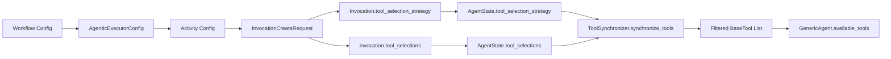
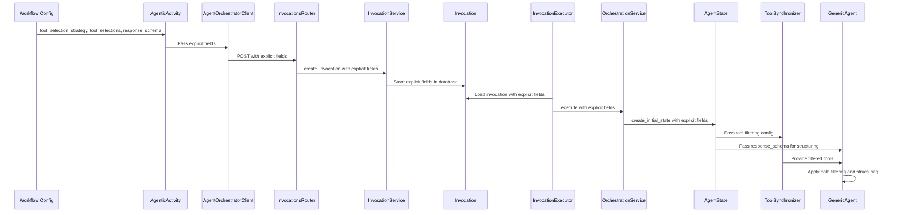

# Data Model: Agentic Node Enhancements

**Date**: 2026-02-13  
**Feature**: Tool Selection Control and Structured Output Formatting

## Overview

This document defines the data model changes required to support user-based tool filtering and structured output capabilities in agentic workflow nodes.

## Enum Definitions

### ToolSelectionStrategy

**Location**: `src/nexus/agent_orchestrator/models/tool_selection.py` (new file)

```python
from enum import Enum

class ToolSelectionStrategy(str, Enum):
    """Strategy for selecting tools available to agents."""
    ALL = "ALL"          # All system-enabled tools available
    NONE = "NONE"        # No tools available (text-only mode)
    SELECTED = "SELECTED"  # Only specific tools from tool_selections
```

## Entity Updates

### 1. InvocationCreateRequest (Extended)

**Location**: `src/nexus/agent_orchestrator/models/request.py`

**Extended Fields**:
```python
class InvocationCreateRequest(SQLModel, populate_by_name=True):
    # Existing fields
    prompt: str
    session_id: str
    context_data: dict[str, object]

    # Tool filtering support
    tool_selection_strategy: ToolSelectionStrategy = Field(
        default=ToolSelectionStrategy.ALL,
        validation_alias=AliasChoices("toolSelectionStrategy", "tool_selection_strategy"),
        serialization_alias="tool_selection_strategy",
        description="Strategy for tool selection: ALL, NONE, or SELECTED",
    )

    tool_selections: list[str] | None = Field(
        default=None,
        validation_alias=AliasChoices("toolSelections", "tool_selections"),
        serialization_alias="tool_selections",
        description="List of tool IDs when strategy is SELECTED",
    )

    # Structured output support  
    response_schema: dict[str, Any] | None = Field(
        default=None,
        validation_alias=AliasChoices("responseSchema", "response_schema"),
        serialization_alias="response_schema",
        description="JSON Schema Draft 2020-12 for structured response output",
    )
```

### 2. Invocation (Extended)

**Location**: `src/nexus/agent_orchestrator/models/invocation.py`

**Extended Fields**:
```python
class Invocation(UserOwnedResource, table=True):
    # Existing fields
    prompt: str
    session_id: str
    status: InvocationStatus
    context_data: dict[str, object]
    result: dict[str, object] | None
    # ... other existing fields

    # Tool filtering support
    tool_selection_strategy: ToolSelectionStrategy = Field(
        default=ToolSelectionStrategy.ALL,
        sa_column=postgres_enum_column(
            ToolSelectionStrategy,
            "toolselectionstrategy",
            index=False,
            nullable=False,
        ),
        description="Strategy for tool selection",
    )

    tool_selections: list[str] | None = Field(
        default=None,
        sa_type=JSONB,
        description="List of tool IDs when strategy is SELECTED",
    )

    # Structured output support  
    response_schema: dict[str, Any] | None = Field(
        default=None,
        sa_type=JSONB,
        description="JSON Schema Draft 2020-12 for structured response output",
    )
```

### 3. AgentState (Extended)

**Location**: `src/nexus/agent_orchestrator/models/agent_state.py`

**Extended Fields**:
```python
class AgentState(TypedDict):
    # Existing fields
    prompt: str
    session_id: str
    invocation_id: str
    messages: list[AnyMessage]
    result: dict[str, Any] | None
    metadata: dict[str, Any]

    # Tool filtering support
    tool_selection_strategy: ToolSelectionStrategy
    """Strategy for tool selection: ALL, NONE, or SELECTED"""

    tool_selections: list[str] | None
    """List of tool IDs when strategy is SELECTED, null otherwise"""

    # Structured output support  
    response_schema: dict[str, Any] | None
    """JSON Schema Draft 2020-12 definition for structured agent responses"""
```

**Validation Rules**:
- `tool_selection_strategy`: Required ToolSelectionStrategy enum with values ALL, NONE, or SELECTED
  - `ALL`: All system-enabled tools available ("all tools" option)
  - `NONE`: No tools available to agent ("no tools" option)  
  - `SELECTED`: Only tools specified in tool_selections available ("specific tools" option)
- `tool_selections`: Optional list of UUID strings, required when strategy is SELECTED, null otherwise
- `response_schema`: Optional JSON Schema object, null means unstructured response

**Relationships**:
- Passed explicitly from InvocationCreateRequest through the pipeline
- Tool fields consumed by ToolSynchronizer for filtering
- `response_schema` consumed by GenericAgent for structured output

### 4. AgenticExecutorConfig (Extended)

**Location**: `src/nexus/workflows/models/workflow_definition.py`

**New Fields**:
```python
class AgenticExecutorConfig(TemplateAwareBaseModel):
    # Existing fields...

    # NEW: Tool selection configuration
    tool_selection_strategy: ToolSelectionStrategy = Field(
        default=ToolSelectionStrategy.ALL,
        description="Strategy for tool selection: ALL, NONE, or SELECTED",
        alias="toolSelectionStrategy",
    )

    tool_selections: list[str] | None = Field(
        default=None,
        description="List of tool IDs when strategy is SELECTED",
        alias="toolSelections",
    )

    # NEW: Structured output configuration
    response_schema: dict[str, Any] | None = Field(
        default=None,
        description="JSON Schema Draft 2020-12 for structured response output",
        alias="responseSchema",
    )

    @field_validator("tool_selections")
    @classmethod
    def validate_tool_selections_format(cls, v: list[str] | None, info) -> list[str] | None:
        """Validate tool_selections based on strategy."""
        strategy = info.data.get("tool_selection_strategy", ToolSelectionStrategy.ALL)

        if strategy == ToolSelectionStrategy.SELECTED:
            if v is None or len(v) == 0:
                msg = "tool_selections is required when tool_selection_strategy is 'SELECTED'"
                raise ValueError(msg)
            # Validate each tool_id is a valid UUID format (unless it's a template expression)
            for tool_id in v:
                # Skip template expressions like ${input.tools}
                if isinstance(tool_id, str) and TEMPLATE_PATTERN.search(tool_id):
                    continue
                try:
                    uuid.UUID(tool_id)
                except ValueError as err:
                    msg = f"Invalid tool_id format: '{tool_id}'. Must be a valid UUID."
                    raise ValueError(msg) from err
        else:
            # For ALL or NONE strategies, tool_selections should be null
            if v is not None:
                msg = f"tool_selections must be null when tool_selection_strategy is '{strategy.value}'"
                raise ValueError(msg)

        return v
```

**Validation Rules**:
- `tool_selection_strategy`: Must be ToolSelectionStrategy enum value (ALL, NONE, or SELECTED)
- `tool_selections`: Required (non-empty) when strategy is SELECTED, null otherwise; each tool_id must be valid UUID format (except template expressions)
- `response_schema`: Must be valid JSON object if provided
- All fields support template expressions for dynamic configuration

**State Transitions**:
- Configuration → Workflow Definition → Activity Config → InvocationCreateRequest → Invocation → AgentState

### 5. Workflow Definition Schema (Extended)

**Location**: `src/nexus/schemas/workflows/workflow-definition.schema.json`

**Schema Updates**:
```json
{
  "agenticTask": {
    "type": "object",
    "properties": {
      "config": {
        "type": "object",
        "properties": {
          "toolSelectionStrategy": {
            "type": "string",
            "enum": ["ALL", "NONE", "SELECTED"],
            "default": "ALL",
            "description": "Strategy for tool selection"
          },
          "toolSelections": {
            "type": "array",
            "description": "List of tool IDs when strategy is SELECTED",
            "items": {
              "type": "string",
              "format": "uuid"
            }
          },
          "responseSchema": {
            "type": "object",
            "description": "JSON Schema Draft 2020-12 for structured response output",
            "additionalProperties": true
          }
        }
      }
    }
  }
}
```

**Validation Rules**:
- `toolSelectionStrategy`: Defaults to 'ALL'
- `toolSelections`: Optional array of UUID-formatted strings
- `responseSchema`: Optional valid JSON Schema object

### 6. OpenAPI Schema (Extended)

**Location**: `src/nexus/schemas/invocations/openapi.yaml`

**InvocationRequest Schema Updates**:
```yaml
InvocationRequest:
  type: object
  title: Invocation Request
  description: Request body for creating a new invocation
  required:
    - prompt
    - created_by
    - session_id
  properties:
    prompt:
      type: string
      minLength: 1
      maxLength: 10000
      title: Prompt
      description: Natural language request describing desired automation task
      example: Create a workflow to deploy customer service app
    created_by:
      type: string
      format: uuid
      title: Created By
      description: User identifier for authentication and policy evaluation
      example: 550e8400-e29b-41d4-a716-446655440000
    session_id:
      type: string
      title: Session ID
      description: Session identifier for grouping related invocations
      example: session-001
    context_data:
      type: object
      default: {}
      title: Context Data
      description: Optional additional context for the request
      additionalProperties: true
      example:
        environment: production
        app_id: customer-svc

    # NEW: Tool selection configuration
    tool_selection_strategy:
      type: string
      enum: ["ALL", "NONE", "SELECTED"]
      default: "ALL"
      title: Tool Selection Strategy
      description: Strategy for tool selection - ALL, NONE, or SELECTED
      example: SELECTED

    tool_selections:
      type: array
      nullable: true
      title: Tool Selections
      description: List of tool IDs when strategy is SELECTED, null otherwise
      items:
        type: string
        format: uuid
        description: UUID of a specific tool to make available
      example:
        - "550e8400-e29b-41d4-a716-446655440001"
        - "660e8400-e29b-41d4-a716-446655440002"

    # NEW: Structured output configuration
    response_schema:
      type: object
      nullable: true
      title: Response Schema
      description: JSON Schema Draft 2020-12 for structured response output
      additionalProperties: true
      example:
        type: "object"
        properties:
          summary:
            type: "string"
            description: "Brief summary of the task"
          priority:
            type: "string"
            enum: ["low", "medium", "high"]
            description: "Task priority level"
        required: ["summary", "priority"]
```

**Schema Validation Rules**:
- `tool_selection_strategy`: Optional enum with default "ALL"
- `tool_selections`: Optional array, required (non-empty) when strategy is "SELECTED"
- `response_schema`: Optional valid JSON Schema Draft 2020-12 object

### 7. Enhanced Tool Metadata

**Location**: Tool filtering logic in `src/nexus/agent_orchestrator/tool_manager/`

**Enhanced BaseTool Metadata**:
```python
# Existing pattern - tools enhanced with metadata during synchronization
enhanced_tool.metadata = {
    "tool_id": str(tool.id),  # UUID from ToolWithParameters
    "namespaced_name": namespaced_name,
    "provider_id": str(provider.id),
    # Additional metadata...
}
```

**Usage Pattern**:
- ToolSynchronizer adds `tool_id` to BaseTool.metadata during enhancement phase
- User filtering function uses `tool.metadata.get("tool_id")` for filtering
- Enables O(1) lookup performance with set-based tool ID checking

## Data Flow Architecture

### 1. Tool Selection Data Flow



### 2. Structured Output Data Flow


### 3. Explicit Field Pipeline Integration



## State Management

### 1. AgentState Lifecycle

**Creation** (AgentStateFactory.create_initial_state):
```python
# Receive explicit parameters from orchestration service
def create_initial_state(
    prompt: str,
    session_id: str,
    invocation_id: UUID,
    correlation_id: str | None = None,
    metadata: dict[str, Any] | None = None,
    # Explicit parameters
    tool_selection_strategy: ToolSelectionStrategy = ToolSelectionStrategy.ALL,
    tool_selections: list[str] | None = None,
    response_schema: dict[str, Any] | None = None,
) -> AgentState:
    return AgentState(
        # ... existing fields ...
        tool_selection_strategy=tool_selection_strategy,
        tool_selections=tool_selections,
        response_schema=response_schema,
    )
```

**Consumption** (Multiple components):
- ToolSynchronizer uses `state["tool_selection_strategy"]` and `state["tool_selections"]` for filtering
- GenericAgent uses `state["response_schema"]` for structuring

### 2. State Transitions

1. **Initial State**: Explicit fields passed from database through service layer
2. **Tool Filtering**: ToolSynchronizer applies user filtering based on tool_selection_strategy and tool_selections
3. **Agent Execution**: GenericAgent applies structured output based on response_schema  
4. **Response Generation**: Either structured dict or unstructured text based on schema presence

## Validation & Constraints

### 1. Tool ID Validation

**Format Requirements**:
- Must be valid UUID format: `550e8400-e29b-41d4-a716-446655440001`
- Template expressions allowed: `${input.toolIds}`, `{{ workflow.tools }}`
- `null` interpreted as "all tools allowed"
- `[]` interpreted as "no tools allowed"

**Tool Selection Semantic Mapping**:
- `tool_selection_strategy: ToolSelectionStrategy.ALL` → "All tools" UI option → Agent receives all system-enabled tools
- `tool_selection_strategy: ToolSelectionStrategy.NONE` → "No tools" UI option → Agent receives empty tool list
- `tool_selection_strategy: ToolSelectionStrategy.SELECTED` + `tool_selections: [uuid1, uuid2]` → "Specific tools" UI option → Agent receives only specified tools

**Validation Logic**:
```python
def validate_tool_selection(strategy: ToolSelectionStrategy, selections: list[str] | None) -> bool:
    if strategy == ToolSelectionStrategy.SELECTED:
        if not selections or len(selections) == 0:
            return False  # Must have selections when strategy is SELECTED
        # Validate each tool_id
        for tool_id in selections:
            if TEMPLATE_PATTERN.search(tool_id):
                continue  # Skip template expressions
            try:
                uuid.UUID(tool_id)
            except ValueError:
                return False
    else:
        if selections is not None:
            return False  # Should be null for ALL/NONE strategies

    return True
```

### 2. Schema Validation

**Format Requirements**:
- Must be valid [JSON Schema Draft 2020-12](https://json-schema.org/draft/2020-12) object
- Required fields: `type`, `properties` recommended
- Complex nested structures supported

**Validation Logic**:
```python
def validate_response_schema(schema: dict[str, Any] | None) -> bool:
    if not schema:
        return True  # None = unstructured response

    # Basic JSON Schema structure validation
    return isinstance(schema, dict) and "type" in schema
```

## Performance Considerations

### 1. Memory Usage

**AgentState Extensions**:
- `tool_selection_strategy`: Minimal impact, single enum value
- `tool_selections`: Minimal impact, typically <10 UUIDs per workflow when used
- `response_schema`: Variable impact, schemas typically <5KB

**Tool Filtering Impact**:
- Reduced memory usage when fewer tools selected (SELECTED strategy)
- Zero tools loaded for NONE strategy
- Set-based lookup provides O(1) performance for tool ID checking

### 2. Processing Efficiency

**Tool Synchronization**:
- User filtering applied after system filtering (optimal placement)
- O(n) complexity where n = enhanced tools (typically 10-50)

**Schema Processing**:
- LangChain handles schema compilation and validation
- Single retry attempt limits processing overhead

## Database Migration Strategy

### 1. Default Values

- `tool_selection_strategy: ToolSelectionStrategy.ALL` → All system-enabled tools available (set during migration)
- `tool_selections: null` → No specific selections (only relevant when strategy is SELECTED)
- `response_schema: null` → Unstructured text response (existing behavior)

### 2. Migration Requirements

- Alembic migration required to add three new columns to invocations table
- `tool_selection_strategy` column added with default value 'ALL' for existing records
- `tool_selections` and `response_schema` columns added as nullable JSONB fields
- API schema updates required for new explicit fields

This data model provides the foundation for implementing both tool selection control and structured output formatting using optional configuration properties.
