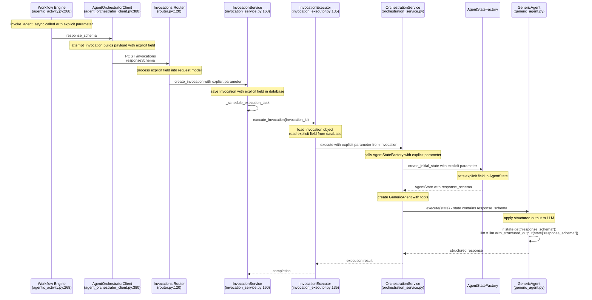

# Spec 033: Agent Node Enhancements - Structured Output Support

## Overview

This specification documents the research, analysis, and proposed implementation for adding structured response capabilities to the Nexus agent orchestration system.

The enhancement will enable agents to return responses conforming to user-provided JSON schemas without requiring Python class definitions. The structured output schema is passed from the workflow via `agent_metadata` and flows through the orchestration system to reach the GenericAgent.

## Current Architecture Analysis

### Execution Flow

The current agent execution follows this path:

1. **AgenticActivity** (`agentic_activity.py:268`)
   - Calls `invoke_agent_async` on AgentOrchestratorClient
   - Passes `agent_metadata` containing callback_url and potentially structured output schema

2. **AgentOrchestratorClient** (`agent_orchestrator_client.py:380`)
   - `_attempt_invocation` builds payload for invocations endpoint
   - Renames `agent_metadata` to `metadata` in contextData
   - Extracts callback_url and adds explicitly to contextData

3. **InvocationsRouter** (`router.py:120`)
   - Receives POST to /invocations endpoint
   - Processes `context_data` into `final_context_data`
   - Passes to InvocationService.create_invocation on L#199

4. **InvocationService** (`invocation_service.py:160`)
   - `create_invocation` processes context_data into final_context_data
   - Saves Invocation object with context_data (L#225-233)
   - Calls `_schedule_execution_task` (L#265/L#268)

5. **InvocationExecutor** (`invocation_executor.py:135`)
   - `execute_invocation` loads Invocation object (L#64)
   - Calls `orchestration_service.execute()` (L#135)
   - Passes prompt, session_id, invocation_id, correlation_id, and metadata=invocation.context_data (L#140)

6. **OrchestrationService** (`orchestration_service.py`)
   - Creates LangGraph state machine with agent nodes
   - Sets up `GenericAgent` with available tools
   - Manages state flow through LangGraph

7. **GenericAgent** (`generic_agent.py:55-63`)
   - Uses `llm.bind_tools(self.available_tools)`
   - Executes `llm.ainvoke(messages)`
   - Returns unstructured text response

### Current State Management

**AgentState** (`agent_state.py:18-62`) contains:
- `prompt`: Current prompt being processed
- `session_id`: Session identifier
- `invocation_id`: UUID of invocation
- `messages`: LangGraph ToolNode execution messages
- `result`: Final result from agent execution
- `metadata`: Context data including callback_url

## Research: LangChain Structured Output

### LangChain Capabilities

Based on [LangChain documentation](https://docs.langchain.com/oss/python/langchain/models#structured-output), structured output can be achieved with:

```python
json_schema = {
    "title": "Response",
    "type": "object",
    "properties": {
        "answer": {"type": "string", "description": "The response text"},
        "confidence": {"type": "number", "description": "Confidence score 0-1"}
    },
    "required": ["answer"]
}

model_with_structure = model.with_structured_output(
    json_schema,
    method="json_schema"
)
```

### Key Benefits

- **Schema-only approach**: No Python class definitions needed
- **Maximum control**: Direct JSON schema specification
- **Interoperability**: Standard JSON schema format
- **Tool compatibility**: Works alongside existing `bind_tools()`

## Proposed Implementation

### 1. Workflow Schema Updates

#### Workflow Definition Schema
Add `response_schema` property to `workflow-definition.schema.json` L#468:

```json
"agenticTask": {
  ...
  "properties": {
    "config": {
      ...
      "properties": {
        ...
        "response_schema": {
          "type": "object",
          "description": "JSON schema for structured response output",
          "additionalProperties": true
        }
      }
    }
  }
}
```

#### AgenticExecutorConfig Updates
Add `response_schema` field to `AgenticExecutorConfig` in `workflow_definition.py`:

```python
class AgenticExecutorConfig(TemplateAwareBaseModel):
    ...
    response_schema: dict[str, Any] | None = Field(
        default=None,
        description="JSON schema for structured response output",
        alias="responseSchema",
    )
```

### 2. AgenticActivity Updates

Modify `AgenticActivity.invoke_agent_async()` to pass response_schema as explicit parameter:

```python
# In agentic_activity.py - Update agent client call to pass explicit fields
invocation_id = await agent_client.invoke_agent_async(
    prompt=config.prompt,
    user_id=user_id,
    agent=config.agent,
    model=config.model,
    input_data=input_data,
    file_ids=file_ids,
    metadata=agent_metadata,
    correlation_id=correlation_id,
    # Pass explicit fields from activity_config
    response_schema=activity_config.get("response_schema"),
)
```

The `response_schema` will be available in `activity_config` from the workflow definition, following the same pattern as other configuration parameters.

### 3. Agent Orchestrator Client Updates

Modify `AgentOrchestratorClient.invoke_agent_async()` to accept response_schema as explicit parameter:

```python
# In agent_orchestrator_client.py
async def invoke_agent_async(
    self,
    prompt: str,
    user_id: str,
    session_id: str | None = None,
    agent: str | None = None,
    model: str | None = None,
    input_data: dict[str, Any] | None = None,
    file_ids: list[str] | None = None,
    metadata: dict[str, Any] | None = None,
    correlation_id: str | None = None,
    # Explicit parameters
    response_schema: dict[str, Any] | None = None,
) -> str:
    payload = {
        "prompt": prompt,
        "createdBy": user_id,
        "sessionId": session_id,
        "contextData": {/* existing context fields */},
        # Explicit fields at top level
        "responseSchema": response_schema,
    }
    # Remove null fields
    payload = {k: v for k, v in payload.items() if v is not None}
```

### 4. State Model Enhancement

Add structured output support to `AgentState`:

```python
class AgentState(TypedDict):
    # ... existing fields ...

    response_schema: dict[str, Any] | None
    """JSON schema for structured response output"""
```

Update `AgentStateFactory.create_initial_state()` to accept optional schema parameter.

### 5. GenericAgent Modification

Enhance `GenericAgent._execute()` in `generic_agent.py` with cascading fallback support:

```python
async def _execute(self, state: AgentState) -> AgentState:
    """Execute GenericAgent with optional structured output."""

    # Configure LLM with tools
    llm_with_tools = self.llm.bind_tools(self.available_tools)

    # Prepare messages
    messages: list[AnyMessage] = [
        SystemMessage(content="..."),  # existing system message
    ] + state["messages"]

    # Execute with structured output fallback if schema provided
    if state.get("response_schema"):
        structured_content = await self._execute_structured_output(state, messages)
        response_model = GenericAgentResponse(
            content=json.dumps(structured_content, indent=2),
            response_metadata={
                "structured_output": structured_content,
                "schema_applied": True,
            }
        )
        # Create mock message for state consistency
        result_message = AIMessage(content=json.dumps(structured_content, indent=2))
    else:
        # Regular text response
        result_message = await llm_with_tools.ainvoke(messages)
        response_model = GenericAgentResponse(
            content=str(result_message.content),
            response_metadata=getattr(result_message, 'response_metadata', {})
        )

    # Update state
    state["messages"] = [result_message]
    state["result"] = response_model.model_dump(by_alias=True)

    return state

async def _execute_structured_output(self, state: AgentState, messages: list[AnyMessage]) -> dict:
    """Execute with structured output using cascading fallback strategies.

    Separates schema validation failures from runtime exceptions:
    - Schema validation failures: Immediate fallback to next strategy
    - Runtime exceptions: Retry with @retry_with_backoff mechanism
    - Strategy exhaustion: Raises non-retryable StructuredOutputError
    """
    schema = state["response_schema"]
    strategies = [
        ("native", self._try_native_structured_output),
        ("pydantic", self._try_pydantic_parser),
        ("structured_parser", self._try_structured_parser)
    ]

    for strategy_name, strategy_func in strategies:
        try:
            result = await strategy_func(schema, messages)
            if self._validate_schema_compliance(result, schema):
                logger.debug(f"Structured output succeeded with {strategy_name} strategy")
                return result
            else:
                logger.info(f"Schema validation failed for {strategy_name} strategy, trying next strategy")
                continue
        except Exception as e:
            # Runtime exceptions (LLM service errors, network issues) should be retried
            logger.error(f"Runtime exception in {strategy_name} strategy: {e}")
            raise  # Let @retry_with_backoff handle this

    # All strategies failed schema validation - this is NOT retryable
    raise StructuredOutputError(
        f"All structured output strategies failed schema validation. "
        f"Schema: {schema.get('title', 'Unnamed')}. Consider fallback to unstructured output."
    )

@retry_with_backoff
async def _try_native_structured_output(self, schema: dict, messages: list[AnyMessage]) -> dict:
    """Try native structured output with runtime exception retry."""
    llm_with_structure = self.llm.bind_tools(self.available_tools).with_structured_output(
        schema, method="json_schema"
    )
    result = await llm_with_structure.ainvoke(messages)
    return result

@retry_with_backoff
async def _try_pydantic_parser(self, schema: dict, messages: list[AnyMessage]) -> dict:
    """Try Pydantic output parser with runtime exception retry."""
    from langchain_core.output_parsers import PydanticOutputParser
    pydantic_model = self._json_schema_to_pydantic(schema)
    parser = PydanticOutputParser(pydantic_object=pydantic_model)

    llm_with_parser = self.llm.bind_tools(self.available_tools) | parser
    result = await llm_with_parser.ainvoke(messages)
    return result.dict()

@retry_with_backoff
async def _try_structured_parser(self, schema: dict, messages: list[AnyMessage]) -> dict:
    """Try structured output parser with runtime exception retry."""
    from langchain_core.output_parsers import StructuredOutputParser
    response_schemas = self._json_schema_to_response_schemas(schema)
    parser = StructuredOutputParser.from_response_schemas(response_schemas)

    enhanced_messages = self._add_format_instructions(messages, parser)
    llm_with_parser = self.llm.bind_tools(self.available_tools) | parser
    result = await llm_with_parser.ainvoke(enhanced_messages)
    return result

def _validate_schema_compliance(self, result: dict, schema: dict) -> bool:
    """Validate that the LLM response conforms to the required schema."""
    try:
        import jsonschema
        jsonschema.validate(result, schema)
        return True
    except jsonschema.exceptions.ValidationError as e:
        logger.debug(f"Schema validation failed: {e}")
        return False
```

### 6. AgentStateFactory Updates

Modify `AgentStateFactory.create_initial_state()` to accept response_schema as explicit parameter:

```python
@staticmethod
def create_initial_state(
    prompt: str,
    session_id: str,
    invocation_id: UUID,
    correlation_id: str | None = None,
    metadata: dict[str, Any] | None = None,
    # Explicit parameters
    response_schema: dict[str, Any] | None = None,
) -> AgentState:
    return AgentState(
        prompt=prompt,
        session_id=session_id,
        invocation_id=str(invocation_id),
        messages=[],
        result=None,
        metadata=metadata or {},
        response_schema=response_schema,
        # ... other existing fields ...
    )
```

OrchestrationService.execute() will need to pass explicit parameters from the invocation to AgentStateFactory.

### 7. Complete Integration Flow

The structured output schema flows from the workflow through the existing metadata pipeline:



#### Integration Points

**Explicit Parameter Flow** - All components updated to pass explicit parameters:
- InvocationExecutor passes explicit field from database to OrchestrationService
- OrchestrationService passes explicit parameter to AgentStateFactory
- AgentStateFactory sets explicit field directly in AgentState

### 8. Backward Compatibility

- When `response_schema` is `None` or missing, behavior is unchanged
- Existing invocations continue to work without modification
- Structured output is purely additive enhancement

## Implementation Phases

### Phase 1: Core Infrastructure
1. Add `response_schema` to `AgentState`
2. Update `AgentStateFactory`
3. Modify `GenericAgent._execute()`

### Phase 2: Integration
1. Update `OrchestrationService.execute()`
2. Modify invocation executor to pass schema
3. Add API parameter support

### Phase 3: Testing & Validation
1. Unit tests for structured output
2. Integration tests with various schemas
3. Default behavior verification

## Example Usage

### Input Schema
```json
{
    "title": "TaskAnalysis",
    "type": "object",
    "properties": {
        "summary": {
            "type": "string",
            "description": "Brief summary of the task"
        },
        "priority": {
            "type": "string",
            "enum": ["low", "medium", "high"],
            "description": "Task priority level"
        },
        "estimated_hours": {
            "type": "number",
            "description": "Estimated completion time in hours"
        },
        "dependencies": {
            "type": "array",
            "items": {"type": "string"},
            "description": "List of dependencies"
        }
    },
    "required": ["summary", "priority"]
}
```

### Expected Output
```json
{
    "summary": "Implement user authentication system",
    "priority": "high",
    "estimated_hours": 16.5,
    "dependencies": ["database setup", "security review"]
}
```

## Considerations

### Tool Compatibility
- `bind_tools()` and `with_structured_output()` can be chained
- Tool calls may need special handling with structured output
- Consider tool result integration with structured responses

### Error Handling & Fallback Strategies

The implementation uses a three-tier cascading fallback approach for maximum reliability, following the approaches documented in the comprehensive LangChain structured outputs guide:

#### Strategy 1: Native Provider Support (`with_structured_output`)
- Uses `llm.with_structured_output(schema, method="json_schema")`
- Leverages provider's native structured output capabilities (OpenAI, Anthropic, etc.)
- Highest reliability when supported by the model provider
- **Pros**: Most reliable, efficient, direct API support
- **Cons**: Limited to providers with native support

#### Strategy 2: Pydantic Output Parser
- Converts JSON schema to dynamic Pydantic model
- Uses LangChain's `PydanticOutputParser` with tool-calling mechanism
- Effective for models supporting tool calls but not native structured output
- **Pros**: Good reliability with tool-calling models, strong validation
- **Cons**: Requires runtime Pydantic model creation, tool-calling overhead

#### Strategy 3: Structured Output Parser  
- Uses prompt engineering with explicit format instructions
- Converts JSON schema to `ResponseSchema` format for `StructuredOutputParser`
- Most compatible fallback option using prompt-based instruction
- **Pros**: Works with any text-generation model, no special API requirements
- **Cons**: Least reliable, depends on model following instructions

#### Retry Behavior
- Strategies are attempted sequentially; runtime exceptions within a strategy are retried according to the `@retry_with_backoff` decorator, while schema validation failures cause immediate fallback to the next strategy
- No external configuration needed - fallback is automatic and transparent
- Comprehensive error logging for debugging model compatibility
- Strategy exhaustion raises `StructuredOutputError` (non-retryable) to trigger unstructured fallback
- Encapsulated within GenericAgent - workflow designers only specify `response_schema`

### Performance Impact
- Fallback strategies add minimal overhead when native support works
- Strategy 2-3 add processing overhead but significantly improve success rates
- JSON schema conversion cached to avoid repeated processing
- Memory usage for schema storage and dynamic model creation

### Security
- Schema injection prevention through JSON schema validation
- Response size limits enforced at parser level
- Schema complexity constraints prevent excessive processing
- Dynamic Pydantic model creation sandboxed

## Related Documentation

- [LangChain Structured Output](https://docs.langchain.com/oss/python/langchain/models#structured-output)
- [JSON Schema Draft 2020-12 Specification](https://json-schema.org/draft/2020-12)
- Nexus Agent Architecture (internal)
- LangGraph State Management (internal)
