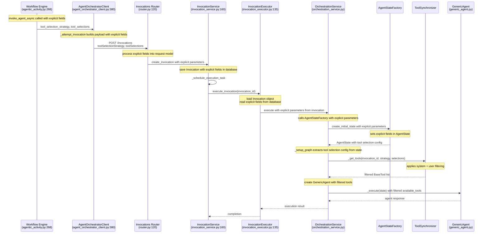

# User Tool Filtering Enhancement

## Overview

This document analyzes how user-supplied tool filtering can be implemented to allow users to specify a subset of available tools (by tool_id) that should be accessible to agents during execution. The enhancement builds on the existing tool synchronization infrastructure while adding user-driven tool selection capabilities.

The allowed tool IDs are passed from the workflow via `agent_metadata` and flow through the orchestration system to control which tools are available to the GenericAgent.

## Current Tool Flow Analysis

### 1. Tool Discovery and Synchronization

**Entry Point**: `OrchestrationService._get_tools()` (`orchestration_service.py:118-132`)

```python
async def _get_tools(self, invocation_id: UUID) -> list[BaseTool]:
    """Get available tools for the agent execution."""
    synchronizer = ToolSynchronizer(invocation_id)
    return await synchronizer.synchronize_tools()
```

**Tool Synchronization Process** (`tool_services.py:479-520`):

1. **Discovery**: `_discover_tools()` - Fetches ALL tools from Tool Manager
2. **Provider Processing**: `_retrieve_base_tools_from_providers()` - Gets BaseTools from MCP servers
3. **System Filtering**: `_filter_enabled_tools()` - Filters by system-enabled status
4. **Enhancement**: `_enhance_tools_with_metadata()` - Adds tool_id metadata

### 2. Current Filtering Logic

**System-Level Filtering** (`tool_filtering.py:16-45`):

```python
def filter_base_tools_by_enabled(
    namespaced_tools: list[NamespacedBaseTool],
    enabled_tools: list[ToolWithParameters],
) -> list[NamespacedBaseTool]:
    """Filter NamespacedBaseTools by enabled ToolWithParameters using namespaced_name."""
    enabled_names = {tool.namespaced_name for tool in enabled_tools}

    filtered_tools = []
    for namespaced_name, base_tool in namespaced_tools:
        if namespaced_name in enabled_names:
            filtered_tools.append((namespaced_name, base_tool))

    return filtered_tools
```

### 3. Tool Usage in Agents

**GenericAgent Tool Binding** (`generic_agent.py:55`):

```python
llm_with_tools = self.llm.bind_tools(self.available_tools)
```

## Proposed User Tool Filtering Implementation

### 1. Workflow Schema Updates

#### Workflow Definition Schema
Add new tool selection properties to `workflow-definition.schema.json` L#477:

```json
"agenticTask": {
  ...
  "properties": {
    "config": {
      ...
      "properties": {
        ...
        "toolSelectionStrategy": {
          "type": "string",
          "enum": ["ALL", "NONE", "SELECTED"],
          "default": "ALL",
          "description": "Strategy for tool selection"
        },
        "toolSelections": {
          "type": "array",
          "description": "List of tool IDs when strategy is SELECTED",
          "items": {
            "type": "string",
            "format": "uuid"
          }
        }
      }
    }
  }
}
```

#### AgenticExecutorConfig Updates
Add tool selection fields to `AgenticExecutorConfig` in `workflow_definition.py`:

```python
class AgenticExecutorConfig(TemplateAwareBaseModel):
    ...
    tool_selection_strategy: ToolSelectionStrategy = Field(
        default=ToolSelectionStrategy.ALL,
        description="Strategy for tool selection: ALL, NONE, or SELECTED",
        alias="toolSelectionStrategy",
    )

    tool_selections: list[str] | None = Field(
        default=None,
        description="List of tool IDs when strategy is SELECTED",
        alias="toolSelections",
    )

    @field_validator("tool_selections")
    @classmethod
    def validate_tool_selections_format(cls, v: list[str] | None, info) -> list[str] | None:
        """Validate tool_selections based on strategy."""
        strategy = info.data.get("tool_selection_strategy", ToolSelectionStrategy.ALL)

        if strategy == ToolSelectionStrategy.SELECTED:
            if v is None or len(v) == 0:
                msg = "tool_selections is required when tool_selection_strategy is 'SELECTED'"
                raise ValueError(msg)
            # Validate each tool_id is a valid UUID format (unless it's a template expression)
            for tool_id in v:
                # Skip template expressions like ${input.tools}
                if isinstance(tool_id, str) and TEMPLATE_PATTERN.search(tool_id):
                    continue
                try:
                    uuid.UUID(tool_id)
                except ValueError as err:
                    msg = f"Invalid tool_id format: '{tool_id}'. Must be a valid UUID."
                    raise ValueError(msg) from err
        else:
            # For ALL or NONE strategies, tool_selections should be null
            if v is not None:
                msg = f"tool_selections must be null when tool_selection_strategy is '{strategy.value}'"
                raise ValueError(msg)

        return v
```

### 2. AgenticActivity Updates

Modify `AgenticActivity.invoke_agent_async()` to pass tool_selection_strategy and tool_selections as explicit parameters:

```python
# In agentic_activity.py - Update agent client call to pass explicit fields
invocation_id = await agent_client.invoke_agent_async(
    prompt=config.prompt,
    user_id=user_id,
    agent=config.agent,
    model=config.model,
    input_data=input_data,
    file_ids=file_ids,
    metadata=agent_metadata,
    correlation_id=correlation_id,
    # Pass explicit fields from activity_config
    tool_selection_strategy=activity_config.get("tool_selection_strategy", ToolSelectionStrategy.ALL),
    tool_selections=activity_config.get("tool_selections"),
)
```

The tool selection fields will be available in `activity_config` from the workflow definition, following the same pattern as other configuration parameters.

### 3. Agent Orchestrator Client Updates

Modify `AgentOrchestratorClient.invoke_agent_async()` to accept explicit parameters:

```python
# In agent_orchestrator_client.py
async def invoke_agent_async(
    self,
    prompt: str,
    user_id: str,
    session_id: str | None = None,
    agent: str | None = None,
    model: str | None = None,
    input_data: dict[str, Any] | None = None,
    file_ids: list[str] | None = None,
    metadata: dict[str, Any] | None = None,
    correlation_id: str | None = None,
    # Explicit parameters
    tool_selection_strategy: ToolSelectionStrategy = ToolSelectionStrategy.ALL,
    tool_selections: list[str] | None = None,
) -> str:
    payload = {
        "prompt": prompt,
        "createdBy": user_id,
        "sessionId": session_id,
        "contextData": {/* existing context fields */},
        # Explicit fields at top level
        "toolSelectionStrategy": tool_selection_strategy.value,
        "toolSelections": tool_selections,
    }
    # Remove null fields (except toolSelectionStrategy which is always present)
    payload = {k: v for k, v in payload.items() if v is not None or k == "toolSelectionStrategy"}
```

### 4. State Management Enhancement

Add to `AgentState` (`agent_state.py`):

```python
class AgentState(TypedDict):
    # ... existing fields ...

    tool_selection_strategy: ToolSelectionStrategy
    """Strategy for tool selection: ALL, NONE, or SELECTED"""

    tool_selections: list[str] | None
    """List of tool IDs when strategy is SELECTED, null otherwise"""
```

### 5. AgentStateFactory Updates

Modify `AgentStateFactory.create_initial_state()` to accept explicit parameters:

```python
@staticmethod
def create_initial_state(
    prompt: str,
    session_id: str,
    invocation_id: UUID,
    correlation_id: str | None = None,
    metadata: dict[str, Any] | None = None,
    # Explicit parameters
    tool_selection_strategy: ToolSelectionStrategy = ToolSelectionStrategy.ALL,
    tool_selections: list[str] | None = None,
) -> AgentState:
    return AgentState(
        prompt=prompt,
        session_id=session_id,
        invocation_id=str(invocation_id),
        messages=[],
        result=None,
        metadata=metadata or {},
        tool_selection_strategy=tool_selection_strategy,
        tool_selections=tool_selections,
        # ... other existing fields ...
    )
```

OrchestrationService.execute() will need to pass explicit parameters from the invocation to AgentStateFactory.

### 6. User Filtering Function

Add new filtering function to `tool_filtering.py`:

```python
def filter_base_tools_by_user_selection(
    enhanced_tools: list[BaseTool],
    tool_selection_strategy: ToolSelectionStrategy,
    tool_selections: list[str] | None = None,
) -> list[BaseTool]:
    """Filter BaseTools by user-specified tool selection.

    Args:
        enhanced_tools: List of BaseTools enhanced with metadata (containing tool_id)
        tool_selection_strategy: Strategy for tool selection (ALL, NONE, or SELECTED)
        tool_selections: List of tool IDs when strategy is SELECTED

    Returns:
        List of BaseTools filtered to user's selection
    """
    if tool_selection_strategy == ToolSelectionStrategy.ALL:
        # Return all tools
        return enhanced_tools

    if tool_selection_strategy == ToolSelectionStrategy.NONE:
        # No tools allowed
        return []

    if tool_selection_strategy == ToolSelectionStrategy.SELECTED:
        if not tool_selections:
            # No specific tools selected
            return []

        allowed_ids_set = set(tool_selections)
        filtered_tools = []

        for tool in enhanced_tools:
            tool_id = tool.metadata.get("tool_id") if hasattr(tool, "metadata") and tool.metadata else None

            if tool_id and tool_id in allowed_ids_set:
                filtered_tools.append(tool)

        return filtered_tools

    return enhanced_tools  # Fallback case
```

### 7. ToolSynchronizer Enhancement

Modify `ToolSynchronizer.synchronize_tools()` to accept user filtering:

```python
async def synchronize_tools(self, tool_selection_strategy: ToolSelectionStrategy = ToolSelectionStrategy.ALL, tool_selections: list[str] | None = None) -> list[BaseTool]:
    """Perform tool synchronization and validation before execution.

    Args:
        tool_selection_strategy: Strategy for tool selection (ALL, NONE, or SELECTED)
        tool_selections: Optional list of tool IDs when strategy is SELECTED

    Returns:
        List of filtered BaseTools ready for execution
    """
    logger.info("Starting tool synchronization", invocation_id=self.invocation_id)

    try:
        # Steps 1-4: Same as existing implementation
        self.all_providers = await _discover_tool_providers()
        self.enabled_tools, self.disabled_tools = await _discover_tools()
        self.namespaced_tools = await _retrieve_base_tools_from_providers(self.all_providers)
        filtered_tools = _filter_enabled_tools(self.namespaced_tools, self.enabled_tools)
        enhanced_tools = _enhance_tools_with_metadata(filtered_tools, self.enabled_tools)

        # NEW: Step 5 - Apply user tool filtering
        enhanced_tools = filter_base_tools_by_user_selection(enhanced_tools, tool_selection_strategy, tool_selections)

        # Steps 6-8: Same as existing (update missing/re-enabled tools, log unregistered)
        await _update_missing_tools(self.namespaced_tools, self.enabled_tools)
        await _update_re_enabled_tools(self.namespaced_tools, self.disabled_tools)
        _log_unregistered_tools(self.namespaced_tools, self.enabled_tools)

        logger.info("Tool synchronization completed", invocation_id=self.invocation_id)
        return enhanced_tools

    except Exception:
        logger.exception("Tool synchronization failed", invocation_id=self.invocation_id)
        return []
```

### 8. OrchestrationService Updates

Modify tool retrieval in `OrchestrationService`:

```python
async def _get_tools(self, invocation_id: UUID, tool_selection_strategy: ToolSelectionStrategy = ToolSelectionStrategy.ALL, tool_selections: list[str] | None = None) -> list[BaseTool]:
    """Get available tools for the agent execution.

    Args:
        invocation_id: Unique identifier for the current invocation
        tool_selection_strategy: Strategy for tool selection (ALL, NONE, or SELECTED)
        tool_selections: Optional list of tool IDs when strategy is SELECTED

    Returns:
        List of synchronized BaseTool instances available for agent use
    """
    synchronizer = ToolSynchronizer(invocation_id)
    return await synchronizer.synchronize_tools(tool_selection_strategy, tool_selections)

async def _setup_graph(self, state: AgentState) -> CompiledStateGraph[AgentState, None, Any, Any]:
    """Set up the LangGraph state machine with ToolNode integration."""
    logger.info("Initializing LangGraph orchestration with ToolNode support")

    # Create state graph
    workflow = StateGraph(AgentState)

    # Add agent nodes with user-filtered tools
    invocation_id: UUID = UUID(state["invocation_id"])
    tool_selection_strategy = state.get("tool_selection_strategy", ToolSelectionStrategy.ALL)  # NEW
    tool_selections = state.get("tool_selections")  # NEW
    available_tools: list[BaseTool] = await self._get_tools(invocation_id, tool_selection_strategy, tool_selections)  # MODIFIED

    # ... rest of setup remains the same ...
```

## Complete Integration Flow

The allowed tool IDs flow from the workflow through the existing metadata pipeline:



### Integration Points

**Explicit Parameter Flow** - All components updated to pass explicit parameters:
- InvocationExecutor passes explicit fields from database to OrchestrationService
- OrchestrationService passes explicit parameters to AgentStateFactory
- AgentStateFactory sets explicit fields directly in AgentState
- OrchestrationService extracts fields from AgentState and passes to ToolSynchronizer

## Implementation Flow

### Complete Tool Filtering Pipeline

1. **Workflow Request** → Includes tool selection config in workflow definition
2. **Explicit Parameter Flow** → Fields passed explicitly through all layers
3. **AgentStateFactory** → Receives explicit parameters, sets directly in AgentState
4. **OrchestrationService** → Extracts tool selection config from AgentState
5. **_setup_graph()** → Calls `_get_tools()` with tool selection strategy and selections
6. **ToolSynchronizer** → Applies system filtering + user filtering based on strategy
7. **GenericAgent** → Receives filtered tools via `bind_tools()`

### Tool Filtering Order

1. **System Discovery**: Get all tools from Tool Manager
2. **Provider Filtering**: Match with available MCP server tools  
3. **System Filtering**: Filter by enabled status
4. **Enhancement**: Add metadata (tool_id)
5. **User Filtering**: Filter by user-specified strategy and tool selections ← NEW
6. **Agent Binding**: Bind filtered tools to LLM

## Error Handling & Edge Cases

### 1. Invalid Tool IDs

```python
def filter_base_tools_by_user_selection(
    enhanced_tools: list[BaseTool],
    tool_selection_strategy: ToolSelectionStrategy,
    tool_selections: list[str] | None = None,
) -> list[BaseTool]:
    # ... filtering logic ...

    # Report unmatched tool IDs for user awareness
    matched_tool_ids = {
        tool.metadata.get("tool_id")
        for tool in filtered_tools
        if hasattr(tool, "metadata") and tool.metadata
    }
    unmatched_ids = set(tool_selections) - matched_tool_ids

    if unmatched_ids:
        logger.warning(
            "Some requested tools are not available",
            unmatched_tool_ids=list(unmatched_ids),
            available_tool_count=len(enhanced_tools)
        )

    return filtered_tools
```

### 2. Empty Tool List

- If user filtering results in empty tool list, log warning but continue execution
- Agent will operate without tools (LLM-only mode)

### 3. Backward Compatibility

- When `tool_selection_strategy` is `ALL`, all system-enabled tools are available
- When `tool_selection_strategy` is `NONE`, no tools are available
- When `tool_selection_strategy` is `SELECTED` with empty selections, no tools are available
- Existing invocations continue to work without modification

## Performance Considerations

### 1. Filtering Efficiency
- User filtering is O(n) where n = number of enhanced tools
- Uses set-based lookup for O(1) tool ID checking
- Applied after system filtering to minimize processing

### 2. Memory Impact
- Additional tool selection fields storage in AgentState
- Filtered tool list may be smaller (memory savings)

### 3. Caching Opportunities
- Tool synchronization results could be cached by `(invocation_id, tool_selection_strategy, tool_selections)` tuple
- Provider discovery results remain cacheable

## Security Considerations

### 1. Tool ID Validation
- Validate that tool IDs are valid UUIDs
- Ensure users can only access tools they have explicitly configured via tool selection strategy
- Prevent tool ID injection attacks

### 2. Tool Capability Restrictions
- User filtering provides additional security layer
- Cannot override system-level disabled tools
- Maintains existing permission boundaries

## Example Usage

### Request with Tool Filtering
```json
{
    "prompt": "Analyze this data using statistical tools",
    "session_id": "session123",
    "context_data": {
        "tool_selection_strategy": "SELECTED",
        "tool_selections": [
            "550e8400-e29b-41d4-a716-446655440001",  # statistical_analysis_tool
            "550e8400-e29b-41d4-a716-446655440002"   # data_visualization_tool
        ]
    }
}
```

### Resulting Tool Availability
- Only `statistical_analysis_tool` and `data_visualization_tool` bound to LLM
- All other system tools filtered out based on SELECTED strategy
- Agent operates with focused tool set

## Alternative Approaches Considered

### 1. Tool Name-based Filtering
**Rejected**: Tool names may not be unique across providers

### 2. Provider-based Filtering  
**Rejected**: Too coarse-grained, doesn't allow per-tool selection

### 3. Post-execution Filtering
**Rejected**: Tools would still be available to LLM, reducing security

## Related Enhancements

This user tool filtering enhancement could be combined with:
- **Structured Output** (from previous spec): Users specify both tools and response format
- **Tool Parameterization**: Users provide default parameters for allowed tools
- **Dynamic Tool Loading**: Load only user-specified tools to improve performance
