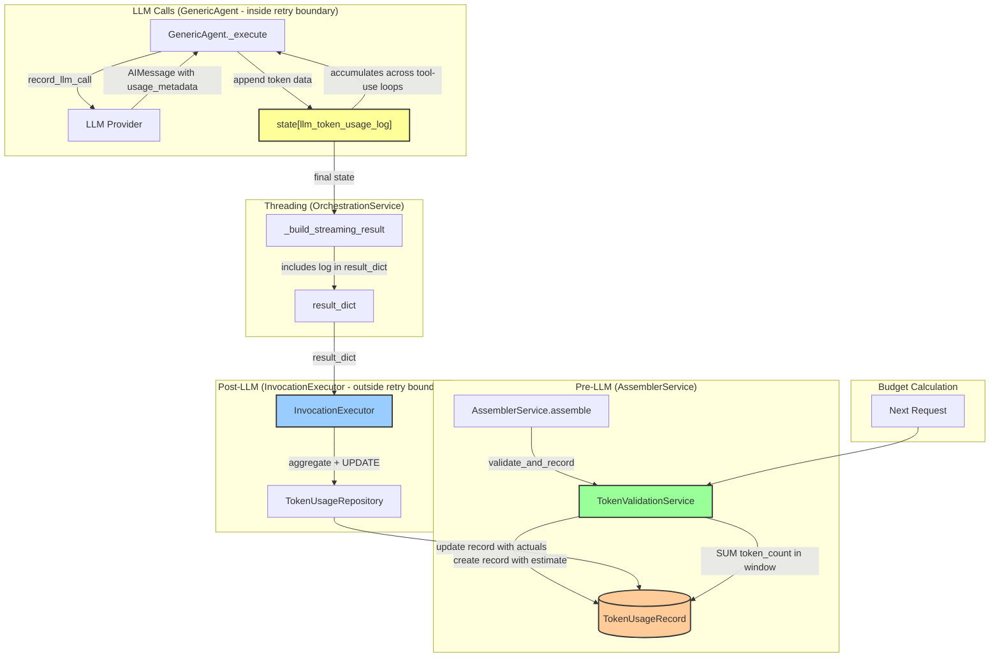

# Implementation Plan: Post-LLM Token Count Capture

**Branch**: `037-post-llm-token-count` | **Date**: 2026-03-23 | **Spec**: [spec.md](./spec.md)
**Input**: Feature specification from `/specs/037-post-llm-token-count/spec.md`

## Execution Flow (/plan command scope)
```
1. Load feature spec from Input path
   -> Loaded successfully
2. Fill Technical Context (scan for NEEDS CLARIFICATION)
   -> Detected Python/FastAPI project with SQLModel
   -> Set Structure Decision: Single project
3. Fill the Constitution Check section based on the content of the constitution document.
   -> Constitution checks populated
4. Evaluate Constitution Check section below
   -> No violations - all constitutional principles followed
5. Execute Phase 0 -> research.md
   -> COMPLETE - All technical decisions documented (14 decisions, R1 superseded, R5/R11 dropped)
6. Execute Phase 1 -> data-model.md, quickstart.md
   -> COMPLETE - Generated data-model.md, quickstart.md
7. Re-evaluate Constitution Check section
   -> PASS - Design maintains constitutional compliance
8. Plan Phase 2 -> Describe task generation approach
   -> COMPLETE - Task planning approach documented
9. STOP - Ready for /speckit.tasks command
   -> Plan execution complete
```

## Summary

This feature extends the existing token counting system to capture and store the full provider-reported token usage after LLM calls. Currently, only pre-LLM input token estimates (via tiktoken) are stored in `TokenUsageRecord`. After this feature, each successful LLM call will result in the existing record being updated with actual token counts (`prompt_tokens`, `completion_tokens`) and a full provider usage breakdown (`usage_details` JSONB). The `token_count` field — used for budget calculation — is updated from the tiktoken estimate to the actual total (`prompt_tokens + completion_tokens`). Correlation is at the **invocation level** (`invocation_id` FK); workflow and activity execution correlation is deferred because those IDs are not yet propagated through the agent orchestration layer to the LLM call point.

**Primary Changes**:
- Extend `TokenUsageRecord` with `estimated_input_tokens`, `prompt_tokens`, `completion_tokens`, `invocation_id` (FK), and `usage_details` (JSONB)
- Accumulate per-call token data in `AgentState["llm_token_usage_log"]` (GenericAgent appends, OrchestrationService threads to result_dict, InvocationExecutor persists)
- Add `TokenUsageRepository.update_with_actual_tokens()` method
- Extend `TokenValidationService.validate_and_record()` to accept `invocation_id` and set `estimated_input_tokens`
- Create Alembic migration with 5 new nullable columns

**Technical Approach**:
- **Collection**: `GenericAgent._execute()` extracts token usage from `AIMessage.response_metadata` after each successful LLM call and appends to `state["llm_token_usage_log"]` (no DB access — agents remain DB-free, just data accumulation in state)
- **Threading**: `OrchestrationService._build_streaming_result()` includes `llm_token_usage_log` from final AgentState in `result_dict`
- **Persistence**: `InvocationExecutor.execute_invocation()` reads `result_dict["llm_token_usage_log"]`, aggregates token counts across all entries, and performs a single UPDATE on the existing `TokenUsageRecord` — setting `prompt_tokens`, `completion_tokens`, `token_count` (actual total), and `usage_details`. All within `session.begin_nested()` (SAVEPOINT) with try/except (non-blocking, best-effort)
- Use `invocation.created_by` for user_id and `invocation.id` for invocation_id (both already loaded)
- Instantiate `TokenUsageRepository()` inline in InvocationExecutor (stateless class, no injection needed)
- Use existing database session from InvocationExecutor's session context
- No changes to budget calculation query (already sums `token_count`) — budget = actual total for completed invocations, tiktoken estimate for in-flight
- Multi-call invocations (tool-use loops) are fully captured — each LangGraph iteration appends to the shared log in AgentState; all entries are aggregated before the single UPDATE
- Streaming responses require no special handling — token metadata is captured from the AIMessage after each LLM call completes

## Architecture Diagram



## Technical Context

**Language/Version**: Python 3.12
**Primary Dependencies**: FastAPI, SQLModel, tiktoken, LangChain (ChatOpenAI)
**Storage**: PostgreSQL with SQLModel ORM
**Testing**: pytest with pytest-asyncio; all tests use PostgreSQL via `test_db_session` fixture (no SQLite)
**Target Platform**: Linux server (containerized with podman-compose)
**Project Type**: single (API backend component)
**Performance Goals**: Post-LLM recording <50ms overhead (non-blocking)
**Constraints**: Must not block or fail LLM response delivery; backward-compatible migration; agents remain DB-free
**Scale/Scope**: Same as existing token counting: 1000+ users, millions of requests

## Constitution Check

*GATE: Must pass before Phase 0 research. Re-check after Phase 1 design.*

### Technology Standards Compliance
- [x] **SQLModel for Data Models**: Extended `TokenUsageRecord` uses SQLModel with `table=True`, no separate Pydantic schemas
- [x] **BaseResource Inheritance**: `TokenUsageRecord` already inherits from `BaseResource`

### Code Architecture Compliance
- [x] **DRY Principle**: Reuses `TokenUsageRepository` for persistence. Token extraction helper in GenericAgent (~8 lines) operates on `AIMessage` — same type as `_extract_token_usage()` in metrics, but extends it with full usage dict return. Minimal duplication justified by different return shape — see R9 DRY trade-off
- [x] **SOLID Principles**: Single Responsibility (recording logic in InvocationExecutor, separate from validation and agent execution), Open/Closed (new fields added without changing existing behavior), Dependency Injection (repository injected into service)
- [x] **Separation of Concerns**: Agents handle LLM calls (no DB access) -> InvocationExecutor handles persistence -> repository handles data access -> service handles budget enforcement
- [x] **Dependency Injection**: Repository explicitly injected into service via constructor
- [x] **Composition vs Inheritance**: Uses composition throughout

### API Specification Standards Compliance
- [x] **N/A**: This feature is an internal service extension (no new HTTP endpoints)
- [x] **Error Format**: Non-blocking recording — errors logged, not propagated
- [x] **Schema Compatibility**: SQLModel schema changes via Alembic migration with backward compatibility

### Code Quality Requirements
- [x] **TDD**: Tests written first following Red-Green-Refactor cycle
- [x] **Observability**: Structured logging for recording success/failure with structured fields (user_id, invocation_id, token_count)

## Project Structure

### Documentation (this feature)

```text
specs/037-post-llm-token-count/
├── plan.md              # This file (/speckit.plan command output)
├── research.md          # Phase 0 output (/speckit.plan command)
├── data-model.md        # Phase 1 output (/speckit.plan command)
├── quickstart.md        # Phase 1 output (/speckit.plan command)
└── tasks.md             # Phase 2 output (/speckit.tasks command - NOT created by /speckit.plan)
```

### Source Code (repository root)

```text
src/nexus/
├── agent_orchestrator/
│   ├── agents/
│   │   └── generic_agent.py          # MODIFY: Append token usage to state["llm_token_usage_log"] after each LLM call (no DB access)
│   ├── models/
│   │   ├── agent_state.py            # MODIFY: Add llm_token_usage_log field to AgentState TypedDict
│   │   └── invocation.py             # No changes (referenced by new FK)
│   ├── services/
│   │   └── orchestration_service.py  # MODIFY: Include llm_token_usage_log in _build_streaming_result()
│   ├── executor/
│   │   └── invocation_executor.py    # MODIFY: Read llm_token_usage_log and update TokenUsageRecord with actuals
│   ├── token_manager/
│   │   ├── __init__.py               # No changes needed
│   │   ├── models.py                 # MODIFY: Add estimated_input_tokens, prompt_tokens, completion_tokens, invocation_id, usage_details to TokenUsageRecord
│   │   ├── services.py               # MODIFY: Update validate_and_record to accept invocation_id and set estimated_input_tokens
│   │   ├── repository.py             # MODIFY: Add update_with_actual_tokens method, extend record_usage for new fields
│   │   └── exceptions.py             # No changes
├── core/
│   └── database/
│       └── migrations/
│           └── versions/
│               └── <hash>_add_post_llm_token_fields.py  # NEW: Alembic migration
└── metrics/
    └── instrumentation.py            # No changes

tests/
├── unit/
│   └── agent_orchestrator/
│       ├── token_manager/
│       │   ├── test_token_models.py               # MODIFY: Test new TokenUsageRecord fields
│       │   ├── test_token_usage_repository.py      # MODIFY: Test update_with_actual_tokens, extended record_usage
│       │   └── test_token_validation_service.py    # MODIFY: Test invocation_id and estimated_input_tokens on records
│       └── agents/
│           └── test_generic_agent.py              # MODIFY: Test token usage log accumulation
└── integration/
    └── agent_orchestrator/
        └── token_manager/
            ├── test_token_validation_flow.py       # MODIFY: Verify invocation_id in integration
            └── test_post_llm_recording.py          # NEW: Post-LLM recording integration tests
```

**Structure Decision**: Single project — extends existing `token_manager` component under `src/nexus/agent_orchestrator/`. Token data is collected in GenericAgent (pure data accumulation in AgentState, no DB access), threaded through OrchestrationService, and persisted in InvocationExecutor (which has DB session access and invocation context). Agents remain DB-free per codebase convention.

## Phase 0: Outline & Research

All research complete. See [research.md](./research.md) for 14 decisions (R1 superseded, R5/R11 dropped, 11 active):

1. **R1**: ~~Superseded by R9 and R13~~ — token extraction and accumulation resolved
2. **R2**: Two-part hook — GenericAgent collects token data in AgentState (no DB), InvocationExecutor updates the record (outside retry boundary, has DB session)
3. **R3**: Use `invocation.created_by` already loaded in InvocationExecutor (no extra query)
4. **R4**: Use existing DB session from InvocationExecutor's `get_async_session_context()`
5. **R5**: ~~Dropped~~ — TokenType enum not needed; single record with dedicated fields instead
6. **R6**: Non-blocking recording via `session.begin_nested()` (SAVEPOINT) with try/except
7. **R7**: Nullable columns migration strategy; existing records unchanged
8. **R8**: No row-level locking for post-LLM update (simple UPDATE of existing record)
9. **R9**: Extract token usage from `AIMessage` in GenericAgent, append to `state["llm_token_usage_log"]`
10. **R10**: Extend existing TokenUsageRepository (only repository in codebase; refactoring to BaseService out of scope)
11. **R11**: ~~Dropped~~ — dedicated model name column removed; model name available in `usage_details` JSONB
12. **R12**: Store full provider token usage breakdown in `usage_details` JSONB column; `token_count` remains budget-relevant integer
13. **R13**: Add `llm_token_usage_log` to AgentState for per-call accumulation across LangGraph iterations; thread through OrchestrationService to result_dict
14. **R14**: Post-LLM update — update existing record's `prompt_tokens`, `completion_tokens`, `token_count`, and `usage_details` after LLM calls complete

## Phase 1: Design & Contracts

### Data Model

See [data-model.md](./data-model.md) for full entity details.

**Summary**: Five new fields on `TokenUsageRecord`:
- `estimated_input_tokens: int | None` (tiktoken estimate, preserved for audit)
- `prompt_tokens: int | None` (actual input tokens from provider)
- `completion_tokens: int | None` (actual output tokens from provider)
- `invocation_id: UUID | None` (FK -> invocations.id, nullable, cascade SET NULL)
- `usage_details: dict | None` (JSONB, nullable) — full provider token usage breakdown, preserved as-is (R12)

### Public API Surface

No new public API endpoints. Internal service changes:

**Modified**: `TokenUsageRepository.record_usage()`
- New optional parameters: `invocation_id`, `estimated_input_tokens`
- Sets `estimated_input_tokens` to the same value as `token_count` when provided

**New**: `TokenUsageRepository.update_with_actual_tokens()`
- Parameters: `invocation_id`, `prompt_tokens`, `completion_tokens`, `token_count`, `usage_details`, `session`
- Finds the record by `invocation_id` and updates it with actual token data

**Modified**: `TokenValidationService.validate_and_record()`
- New optional parameter: `invocation_id`
- Passes `invocation_id` and `estimated_input_tokens` to `record_usage()`

**Modified**: `GenericAgent._execute()`
- After `record_llm_call()` returns `result_message` (AIMessage):
  1. Extract input token count, output token count, and full usage dict from `result_message` (see R9)
  2. Append `{input_tokens, output_tokens, usage_details}` to `state["llm_token_usage_log"]`
  3. No DB access — pure data accumulation in AgentState

**Modified**: `AgentState` (TypedDict)
- New field: `llm_token_usage_log: Annotated[list[dict[str, Any]], operator.add]` — uses `operator.add` annotation for LangGraph list accumulation across graph iterations (same pattern as `messages`; see R13)

**Modified**: `OrchestrationService._build_streaming_result()`
- Extract `llm_token_usage_log` from `final_state` (not from `final_state["result"]`) and include it in the returned `result_dict` as a separate key. This key is consumed by InvocationExecutor for token persistence and MUST NOT be stored in `invocation.result` — InvocationExecutor should pop it from result_dict before persisting

**Modified**: `InvocationExecutor.execute_invocation()`
- After `orchestration_service.execute()` returns `result_dict`:
  1. Read `result_dict["llm_token_usage_log"]` (list of per-call entries)
  2. Aggregate: `prompt_tokens = sum(input_tokens)`, `completion_tokens = sum(output_tokens)`
  3. Call `TokenUsageRepository.update_with_actual_tokens()` with aggregated values and `token_count = prompt_tokens + completion_tokens`
  4. Wrap in `session.begin_nested()` (SAVEPOINT) with try/except for non-blocking behavior (R6)

### Integration Tests from User Stories

| Test                                          | File                            | Scenario |
|-----------------------------------------------|---------------------------------|----------|
| `test_record_updated_with_actual_tokens`       | test_post_llm_recording.py     | US1-S1   |
| `test_budget_uses_actual_for_completed`        | test_token_validation_flow.py  | US1-S2   |
| `test_record_has_invocation_id`                | test_post_llm_recording.py     | US2-S1   |
| `test_multiple_llm_calls_aggregated`           | test_post_llm_recording.py     | US2-S2   |
| `test_query_by_invocation_id`                  | test_post_llm_recording.py     | US2-S3   |
| `test_estimated_and_actual_both_present`       | test_post_llm_recording.py     | US3-S1   |
| `test_completed_record_has_all_fields`         | test_post_llm_recording.py     | US3-S2   |
| `test_no_update_on_llm_failure`                | test_post_llm_recording.py     | US1-S3   |
| `test_update_failure_non_blocking`             | test_post_llm_recording.py     | FR-007   |
| `test_existing_records_unchanged_after_migration` | test_post_llm_recording.py  | FR-010   |
| `test_record_contains_usage_details`           | test_post_llm_recording.py     | FR-011   |
| `test_structured_logging_on_update`            | test_post_llm_recording.py     | FR-012   |

### Quickstart Validation

See [quickstart.md](./quickstart.md) — manual validation scenario with SQL queries to verify record creation, post-LLM update, estimation accuracy, budget calculation, and migration compatibility.

## Phase 2: Task Planning Approach

*This section describes what the /speckit.tasks command will do — DO NOT execute during /speckit.plan*

**Task Generation Strategy**:
1. Load tasks template
2. Extract tasks from Phase 1 artifacts
3. Order by dependency chain

**Task Ordering**:

1. **Model Layer** (TDD: tests first)
   - Write unit tests for extended TokenUsageRecord fields (estimated_input_tokens, prompt_tokens, completion_tokens, invocation_id, usage_details)
   - Add new fields to TokenUsageRecord model

2. **Migration**
   - Create Alembic migration: TokenUsageRecord new columns [depends on model changes]

3. **Repository Layer** (TDD)
   - Write unit tests for extended record_usage (invocation_id, estimated_input_tokens) [P]
   - Update record_usage to accept invocation_id, estimated_input_tokens
   - Write unit tests for update_with_actual_tokens
   - Add update_with_actual_tokens method to TokenUsageRepository

4. **AgentState & Collection Layer** (TDD)
   - Add `llm_token_usage_log` field to AgentState TypedDict
   - Write unit tests for token usage extraction helper in GenericAgent
   - Implement `_build_token_usage_entry()` helper and append logic in `GenericAgent._execute()`
   - Update `OrchestrationService._build_streaming_result()` to include log in result_dict

5. **Service Layer** (TDD)
   - Write unit tests for validate_and_record with invocation_id and estimated_input_tokens
   - Update validate_and_record to pass invocation_id and set estimated_input_tokens
   - Write unit tests (with mocked dependencies) for post-LLM update in InvocationExecutor
   - Implement post-LLM update in InvocationExecutor (aggregate `llm_token_usage_log`, inline `TokenUsageRepository()`, `session.begin_nested()` for isolation)

6. **Integration** (TDD)
   - Write integration tests for post-LLM recording [depends on service layer]
   - Update validate_and_record callers (AssemblerService) to pass invocation_id

7. **Polish**
   - Run full test suite
   - Verify quickstart scenario
   - Update exports in __init__.py (if needed)

**Parallelization Markers**: [P] = can run in parallel

**Estimated Output**: 18-22 numbered, dependency-ordered tasks in tasks.md

## Complexity Tracking

No constitution violations. No complexity deviations needed.

| Violation | Why Needed | Simpler Alternative Rejected Because |
|-----------|------------|-------------------------------------|
| Inline `TokenUsageRepository()` instantiation in InvocationExecutor (DI deviation) | Repository is stateless (no constructor args), and InvocationExecutor is not a service with injected dependencies for token concerns — it only needs the repo for a single best-effort UPDATE | Constructor injection would require adding a new param to InvocationExecutor's `__init__`, changing all callers and tests, for a stateless class that can be trivially mocked via `patch` |

## Progress Tracking

**Phase Status**:
- [x] Phase 0: Research complete — research.md generated (14 decisions, 11 active)
- [x] Phase 1: Design complete — data-model.md, quickstart.md generated
- [x] Phase 2: Task planning complete — approach documented
- [ ] Phase 3: Tasks generated (/speckit.tasks command)
- [ ] Phase 4: Implementation complete
- [ ] Phase 5: Validation passed

**Gate Status**:
- [x] Initial Constitution Check: PASS
- [x] Post-Design Constitution Check: PASS (post plan-review revision)
- [x] All clarifications resolved (3 total from /speckit.clarify)
- [x] Complexity deviations documented (none)

---
*Based on Constitution v1.3.0*
